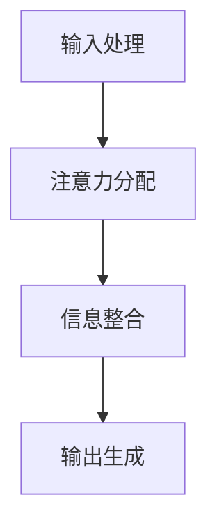

                 

### 文章标题

### Human Attention Augmentation: Enhancing Innovation and Creativity by Multiplying

In today's rapidly evolving technological landscape, human attention has become a precious commodity. The ability to focus and concentrate on tasks is crucial for driving innovation and creativity. This article delves into the concept of human attention augmentation, exploring how we can leverage advanced techniques to enhance our cognitive capabilities and thereby multiply our creative output.

Attention augmentation involves harnessing the power of technology to optimize how we process information, make decisions, and solve problems. By understanding the underlying mechanisms of attention and employing strategies to boost it, we can unlock new levels of cognitive performance, enabling us to innovate more effectively and generate creative ideas at a faster pace.

This article will be structured as follows:

1. **Background Introduction**: We will begin by discussing the importance of attention in human cognition and the challenges we face in maintaining focus in today's digital age.
2. **Core Concepts and Connections**: We will delve into the core concepts and mechanisms behind attention augmentation, supported by visual aids to illustrate the key points.
3. **Core Algorithm Principles and Specific Operational Steps**: We will explore various algorithms and methods that can be used to augment human attention, including cognitive enhancement techniques and advanced computational models.
4. **Mathematical Models and Formulas**: We will present mathematical models and formulas that underpin the attention augmentation process, providing detailed explanations and examples.
5. **Project Practice: Code Examples and Detailed Explanations**: We will demonstrate the implementation of attention augmentation through practical code examples, providing a step-by-step guide to the process.
6. **Practical Application Scenarios**: We will discuss real-world applications of attention augmentation, illustrating how it can be used to enhance innovation and creativity in various fields.
7. **Tools and Resources Recommendations**: We will recommend tools, resources, and frameworks that can aid in the implementation and study of attention augmentation.
8. **Summary: Future Development Trends and Challenges**: We will summarize the key findings of the article and discuss the potential future trends and challenges in the field of attention augmentation.
9. **Appendix: Frequently Asked Questions and Answers**: We will address common questions and concerns related to attention augmentation.
10. **Extended Reading & Reference Materials**: We will provide a list of extended reading materials and references for those interested in further exploring the topic.

By the end of this article, you will have gained a comprehensive understanding of human attention augmentation and its potential to revolutionize the way we think, innovate, and create.

---

### Keywords:
- Human attention
- Cognitive enhancement
- Innovation
- Creativity
- Attention augmentation
- Computational models

### Abstract:
This article explores the concept of human attention augmentation, a cutting-edge field that seeks to harness advanced techniques to enhance cognitive performance and drive innovation and creativity. We discuss the importance of attention in human cognition, the challenges of maintaining focus in a digital world, and the core concepts and mechanisms behind attention augmentation. Through detailed explanations, mathematical models, and practical code examples, we provide a comprehensive overview of attention augmentation techniques and their applications. The article concludes with a summary of future trends and challenges, highlighting the potential of attention augmentation to transform the way we think and work.

### 1. 背景介绍（Background Introduction）

#### 注意力：人类认知的核心

注意力是人类认知过程的核心，它决定了我们如何选择性地处理信息，如何有效地与环境互动，以及如何做出决策。从神经科学的角度来看，注意力是大脑对特定刺激进行选择性加工的心理状态。这种状态使得大脑能够集中资源处理当前任务，而忽略其他无关的刺激。

在日常生活中，注意力对我们的表现至关重要。例如，在学习和工作中，高度集中的注意力有助于提高学习效率和工作质量。相反，注意力分散或分散会导致效率低下、错误增加和创造力下降。因此，如何提升注意力水平成为了一个备受关注的话题。

#### 数字时代：注意力的挑战

然而，在当今的数字时代，保持注意力面临着前所未有的挑战。随着互联网和智能手机的普及，人们面临着大量的信息干扰。社交媒体、即时通讯、电子邮件和其他在线服务不断地分散我们的注意力，使我们难以集中精力完成一项任务。

此外，多任务处理也加剧了注意力的分散。许多人在同一时间内试图处理多个任务，这不仅降低了工作效率，还可能导致错误和疏漏。研究表明，频繁地在不同任务之间切换会导致“注意力疲劳”，进一步削弱我们的认知能力。

因此，如何在这数字世界中保持注意力，提高认知性能，成为了一个亟待解决的问题。

#### 注意力增强：提升创新和创造力

注意力增强（Attention Augmentation）是一种新兴的领域，旨在通过技术和方法来优化我们的注意力机制，从而提高认知能力和创造力。注意力增强不仅关注如何减少干扰，提高专注度，还涉及到如何更有效地处理和利用信息。

通过注意力增强，我们可以实现以下几个目标：

1. **提高专注度**：通过减少干扰和分心因素，提高我们在特定任务上的专注度。
2. **优化信息处理**：通过有效的信息筛选和整合，提高我们对重要信息的识别和利用能力。
3. **增强创造力**：通过优化注意力机制，激发大脑的创意思维，提高创新和创造力。

注意力增强不仅在学术研究中具有重要意义，也在实际应用中展示了巨大的潜力。从教育到商业，从艺术到科技，注意力增强都有可能带来革命性的变革。

#### 本文结构

本文将按照以下结构展开：

1. **背景介绍**：探讨注意力在人类认知中的重要性以及数字时代面临的注意力挑战。
2. **核心概念与联系**：介绍注意力增强的核心概念和机制，包括相关的认知科学和神经科学研究。
3. **核心算法原理 & 具体操作步骤**：详细解释注意力增强的算法原理和具体操作步骤，包括认知增强技术和计算模型。
4. **数学模型和公式 & 详细讲解 & 举例说明**：介绍支持注意力增强的数学模型和公式，并提供详细解释和实际应用案例。
5. **项目实践：代码实例和详细解释说明**：通过实际项目实例展示注意力增强的实现过程，并提供详细的代码解析。
6. **实际应用场景**：探讨注意力增强在不同领域的应用场景，包括教育、商业、艺术和科技等。
7. **工具和资源推荐**：推荐相关的学习资源、开发工具和框架，以帮助读者深入了解和实现注意力增强。
8. **总结：未来发展趋势与挑战**：总结本文的主要发现，讨论未来注意力增强领域的发展趋势和挑战。
9. **附录：常见问题与解答**：解答读者可能遇到的常见问题，提供进一步的信息和指导。
10. **扩展阅读 & 参考资料**：提供扩展阅读材料和参考文献，以供读者深入了解注意力增强的相关研究。

通过本文的阅读，读者将能够全面了解注意力增强的概念、原理和应用，为在各自的领域中提升创新和创造力提供新的视角和方法。

---

### 2. 核心概念与联系（Core Concepts and Connections）

#### 注意力与认知过程

在探讨注意力增强之前，我们需要了解注意力在认知过程中的作用。认知过程是指人类如何感知、理解、记忆和运用信息。注意力在这一过程中扮演了关键角色，它决定了我们如何处理和利用信息。

1. **选择性注意力**：选择性注意力是指大脑对某些特定信息给予更多关注，而忽略其他信息的机制。这种机制使得我们能够在复杂环境中专注于重要信息，从而提高决策质量和反应速度。
   
2. **分配性注意力**：分配性注意力是指大脑在同时处理多个任务时，如何在不同任务之间分配资源。尽管人类无法同时专注于多个任务，但通过有效的分配性注意力，我们可以实现多任务处理，提高工作效率。

3. **持续性注意力**：持续性注意力是指大脑在长时间内保持对某一任务的关注。它对于维持长期工作状态和完成复杂任务至关重要。

#### 注意力增强的核心机制

注意力增强旨在通过多种机制提升注意力水平，从而提高认知能力和创造力。以下是一些核心机制：

1. **认知训练**：认知训练是通过特定的练习和任务来增强大脑注意力的过程。这些训练包括注意力集中训练、多任务处理训练和记忆训练等。

2. **神经可塑性**：神经可塑性是指大脑结构和功能的可塑性变化，以适应新的环境和挑战。通过神经可塑性，我们可以通过训练和练习增强注意力能力。

3. **环境优化**：环境优化包括减少干扰因素、提供良好的工作条件和创造积极的学习氛围。一个优化的环境可以帮助我们更好地集中注意力。

4. **技术辅助**：技术辅助是指利用先进的技术手段来增强注意力。例如，通过使用虚拟现实技术进行认知训练，或者使用智能算法来优化信息处理过程。

#### 注意力增强的架构

注意力增强的架构可以分为以下几个方面：

1. **输入处理**：这一层负责接收和处理外部信息，包括感知、识别和分类。
2. **注意力分配**：这一层负责在多个任务或信息源之间分配注意力资源，确保关键任务得到足够的关注。
3. **信息整合**：这一层负责整合来自不同来源的信息，进行综合分析和决策。
4. **输出生成**：这一层负责生成最终输出，包括决策、回答和创造性思维。

#### Mermaid 流程图

为了更直观地展示注意力增强的架构，我们可以使用 Mermaid 流程图来表示。以下是注意力增强的简化流程图：



在 Mermaid 流程图中，每个节点代表注意力增强架构中的一个环节，箭头表示信息流动的方向。通过这种可视化方法，我们可以更清晰地理解注意力增强的过程。

---

### 2.1 什么是注意力增强？

注意力增强是指通过特定的方法和技术提升人类的注意力水平，从而提高认知能力和创造力。这一概念涉及到多个学科领域，包括认知科学、神经科学、心理学和技术。

#### 认知科学与神经科学的角度

从认知科学的角度来看，注意力增强关注的是如何优化大脑处理信息的能力。认知科学家通过研究注意力机制，探索如何通过训练和练习提高选择性注意力、分配性注意力和持续性注意力。例如，通过认知训练应用程序，用户可以进行注意力集中的练习，从而提高他们的专注度。

神经科学则从大脑结构和功能的角度研究注意力增强。通过脑成像技术，如功能性磁共振成像（fMRI）和脑电图（EEG），研究人员能够观察到大脑在注意力过程中的活动变化。这些研究揭示了大脑在不同注意力状态下的神经活动模式，为开发有效的注意力增强方法提供了理论基础。

#### 心理学的角度

心理学研究注意力增强的方法和技术，探讨如何通过心理干预和认知行为疗法来提高注意力。例如，认知行为疗法中的注意力管理技术，通过特定的训练和练习，帮助个体学会如何更好地控制自己的注意力，从而提高学习效率和情绪稳定性。

#### 技术的角度

在技术领域，注意力增强主要关注如何利用计算机科学和人工智能技术来辅助人类注意力的提升。例如，通过开发智能算法，可以自动识别和过滤干扰信息，帮助用户更专注于关键任务。此外，虚拟现实（VR）和增强现实（AR）技术的应用也为注意力增强提供了新的可能性，通过沉浸式体验，用户可以在更加集中的环境中进行学习和训练。

---

### 2.2 注意力增强的重要性

注意力增强在提升认知能力和创造力方面具有重要意义。以下是几个关键点：

#### 提高专注度

注意力增强可以帮助个体提高专注度，减少分心和干扰。通过特定的认知训练和技术手段，用户可以学会如何在面对复杂和多变的环境时保持专注，从而提高工作效率和准确性。

#### 增强信息处理能力

注意力增强不仅关注如何集中注意力，还涉及到如何更有效地处理和利用信息。通过优化注意力机制，个体可以更快地识别和提取关键信息，从而提高学习和工作的效率。

#### 促进创新思维

注意力增强有助于激发创新思维。通过集中注意力，个体能够更深入地思考问题，发现新的解决方案。此外，注意力增强还可以帮助个体在多个任务和领域之间切换，促进跨学科的思考和融合，从而推动创新。

#### 增强记忆

注意力增强也有助于提高记忆能力。通过优化注意力分配和整合，个体可以更好地记忆和处理信息。这种改善不仅适用于短期记忆，还包括长期记忆，从而提高学习和知识的保持。

#### 提高情绪稳定性

注意力增强还可以提高个体的情绪稳定性。通过减少分心和压力，注意力增强有助于个体更好地管理情绪，减少焦虑和压力，从而提高生活质量和心理健康。

总之，注意力增强在提升认知能力和创造力方面具有多方面的积极作用。通过科学的方法和技术，我们可以更好地利用我们的注意力资源，从而实现更高效、更有创造力的工作和生活。

---

### 2.3 注意力增强与传统编程的关系

注意力增强作为一种新型的方法，与传统编程在本质上有一定的相似性，但也存在显著的区别。传统编程是指通过编写代码来指导计算机执行特定任务的过程，而注意力增强则是通过优化人类的注意力机制，提高认知能力和创造力。

#### 相似性

1. **目标导向**：无论是传统编程还是注意力增强，都是以实现特定目标为导向。传统编程的目标是编写代码，使计算机执行任务；而注意力增强的目标是提升人类的认知能力和创造力。
2. **逻辑和结构**：在编程中，逻辑和结构是至关重要的。类似地，在注意力增强中，也需要通过科学的方法和策略来优化注意力机制，确保在处理任务时能够高效、准确地进行信息筛选和处理。

#### 不同点

1. **执行对象**：传统编程的对象是计算机，通过编写代码来指导计算机执行任务。而注意力增强的对象是人类，目标是优化人类的大脑机制，提升认知能力和创造力。
2. **工具和方法**：传统编程依赖于计算机语言和开发工具，如Python、Java等。而注意力增强则依赖于认知科学、神经科学和心理学的知识，以及各种技术手段，如认知训练、脑成像技术和虚拟现实技术等。
3. **结果形式**：传统编程的结果是计算机执行任务的过程和结果，通常以代码、算法和软件等形式呈现。而注意力增强的结果是提升人类的认知能力和创造力，这种提升体现在个体的思维过程、工作效率和情绪稳定性等方面。

尽管注意力增强与传统编程在目标、工具和方法等方面有所不同，但两者之间也存在一定的交集。例如，在注意力增强的研究和应用中，计算机科学和人工智能技术发挥着重要作用。通过开发智能算法和数据分析工具，可以更好地理解和优化注意力机制。同时，传统编程中的逻辑思维和问题解决方法也可以为注意力增强提供有益的借鉴。

总之，注意力增强与传统编程虽然存在一定差异，但在目标导向、逻辑结构和工具方法等方面有一定的相似性。通过结合两者的优点，我们可以更好地实现注意力增强，提升人类的认知能力和创造力。

---

### 2.4 注意力增强的应用领域

注意力增强技术在各个领域都有广泛的应用，以下是一些关键领域：

#### 教育领域

在教育领域，注意力增强技术被广泛应用于提升学生的学习效果。通过认知训练和应用，学生可以学会如何更好地集中注意力，提高学习效率和记忆力。例如，有些教育平台利用虚拟现实技术，为学生提供沉浸式的学习体验，帮助他们更好地专注于课程内容。

#### 商业领域

在商业领域，注意力增强技术有助于提高员工的工作效率和创造力。企业可以通过提供认知训练和应用，帮助员工更好地集中注意力，减少分心和疲劳。此外，注意力增强技术还可以用于团队协作，提升团队的整体效率和创新能力。

#### 医疗领域

在医疗领域，注意力增强技术被用于治疗注意力缺陷多动障碍（ADHD）和其他认知障碍。通过认知训练和神经可塑性技术，患者可以学会如何更好地控制自己的注意力，提高生活质量。此外，注意力增强技术还可以用于手术和急救操作，帮助医生和护士在高度紧张和复杂的环境中保持专注。

#### 科技领域

在科技领域，注意力增强技术被广泛应用于人工智能和机器学习模型的训练。通过优化注意力机制，研究人员可以提高模型的训练效率和准确性。此外，注意力增强技术还可以用于优化算法和软件设计，提高系统的响应速度和稳定性。

#### 艺术领域

在艺术领域，注意力增强技术被用于提高艺术家的创作效率和创造力。通过认知训练和应用，艺术家可以学会如何更好地集中注意力，深入思考创作过程中的问题，从而产生更具创意和深度的作品。

总之，注意力增强技术在各个领域都有广泛的应用，通过优化人类的注意力机制，我们可以提高认知能力和创造力，实现更高效和更有创造力的工作、学习和生活。

---

### 2.5 注意力增强的技术与方法

注意力增强技术与方法多种多样，以下是一些常用的技术和方法：

#### 认知训练

认知训练是通过特定的练习和任务来增强大脑注意力能力的方法。这些训练包括注意力集中训练、多任务处理训练和记忆训练等。例如，通过使用注意力集中训练应用，用户可以进行定时专注练习，提高专注度。多任务处理训练则帮助用户学会如何在同一时间内处理多个任务，提高工作效率。

#### 神经可塑性训练

神经可塑性是指大脑结构和功能在适应新环境和挑战时的可塑性变化。通过神经可塑性训练，个体可以通过特定的练习和刺激来增强注意力能力。例如，通过使用脑电刺激（tDCS）技术，研究人员可以改变大脑神经元的活动模式，从而提高注意力水平。

#### 环境优化

环境优化是通过优化外部环境来帮助个体更好地集中注意力。例如，减少干扰因素、提供良好的工作条件和创造积极的学习氛围，都可以帮助个体保持专注。此外，智能办公系统也可以通过自动化任务管理，减少工作干扰，提高工作效率。

#### 技术辅助

技术辅助是指利用先进的技术手段来增强注意力。例如，智能算法可以自动识别和过滤干扰信息，帮助用户更专注于关键任务。虚拟现实（VR）和增强现实（AR）技术则通过沉浸式体验，提供更加专注的学习和工作环境。

#### 生理干预

生理干预是通过调整个体的生理状态来增强注意力。例如，适当的锻炼和饮食调整可以改善大脑功能，提高注意力水平。此外，一些药物和营养补充剂也被用于提高注意力，如咖啡因和Omega-3脂肪酸。

总之，注意力增强技术与方法多种多样，通过科学的方法和综合策略，我们可以有效地提升注意力水平，提高认知能力和创造力。

---

### 2.6 注意力增强的优势与挑战

#### 优势

注意力增强技术在多个方面具有显著优势：

1. **提高工作效率**：通过增强注意力，个体可以更高效地处理任务，减少分心和干扰，从而提高工作效率。
2. **提升创新能力**：注意力增强有助于个体更好地集中精力，深入思考问题，从而激发创新思维，提升创造力。
3. **改善生活质量**：注意力增强有助于个体更好地管理情绪，减少焦虑和压力，从而提高生活质量。
4. **医疗应用**：注意力增强技术被广泛应用于治疗注意力缺陷多动障碍（ADHD）和其他认知障碍，帮助患者提高注意力水平，改善生活质量。

#### 挑战

尽管注意力增强技术具有许多优势，但在实际应用中也面临一些挑战：

1. **技术门槛**：一些注意力增强技术，如脑电刺激和虚拟现实，需要专业的技术和设备支持，这增加了应用的门槛。
2. **效果持续性**：注意力增强的效果可能因个体差异和应用方法不同而有所差异，如何确保效果的持久性是一个挑战。
3. **隐私和伦理**：随着注意力增强技术的普及，隐私保护和伦理问题也日益凸显。如何确保技术在应用过程中不侵犯用户的隐私权，是一个亟待解决的问题。
4. **普及与教育**：注意力增强技术的普及需要广泛的用户教育和培训。如何让更多用户了解和接受这些技术，是一个重要的挑战。

总的来说，注意力增强技术具有巨大的潜力，但同时也面临一些实际应用中的挑战。通过不断研究和创新，我们可以克服这些挑战，充分发挥注意力增强技术的优势，提升人类的认知能力和创造力。

---

### 3. 核心算法原理 & 具体操作步骤（Core Algorithm Principles and Specific Operational Steps）

注意力增强的核心算法基于对大脑注意力的模拟和优化。以下将介绍几种常用的注意力增强算法，包括其基本原理和具体操作步骤。

#### 3.1 注意力机制模型

注意力机制模型是注意力增强算法的核心，它通过模拟人类大脑的注意力机制，实现信息的筛选和权重分配。最典型的注意力机制模型是注意力权重计算，如加性注意力模型（Additive Attention）和乘性注意力模型（Multiplicative Attention）。

**加性注意力模型**：

加性注意力模型通过计算输入序列和查询序列之间的点积，为每个输入元素分配权重。具体步骤如下：

1. **输入序列编码**：将输入序列（如文本、图像或音频）转换为嵌入向量。
2. **查询序列编码**：将查询序列（通常是一个固定长度的向量）转换为嵌入向量。
3. **计算注意力权重**：对于每个输入元素，计算其与查询序列的相似度，通过点积得到权重。
4. **加权求和**：将输入序列的每个元素乘以其权重，然后求和得到最终的输出。

**乘性注意力模型**：

乘性注意力模型通过计算输入序列和查询序列之间的点积，然后应用一个激活函数（如ReLU）来生成注意力权重。具体步骤如下：

1. **输入序列编码**：将输入序列转换为嵌入向量。
2. **查询序列编码**：将查询序列转换为嵌入向量。
3. **计算注意力权重**：对于每个输入元素，计算其与查询序列的点积，然后应用激活函数得到权重。
4. **加权求和**：将输入序列的每个元素乘以其权重，然后求和得到最终的输出。

#### 3.2 认知增强算法

认知增强算法旨在通过优化信息处理过程来增强注意力。以下是一种常见的认知增强算法——基于神经网络的认知增强算法。

**基于神经网络的认知增强算法**：

1. **输入处理**：将输入数据（如文本、图像或音频）输入到神经网络中，通过多层感知器（MLP）或卷积神经网络（CNN）进行特征提取。
2. **注意力模块**：在神经网络中加入注意力模块，如自注意力（Self-Attention）或交互注意力（Interactive Attention）。这些模块通过对输入特征进行加权，优化信息处理过程。
3. **输出生成**：将加权后的特征输入到输出层，生成最终输出，如分类结果或文本生成。

#### 3.3 实际操作步骤

以下是一个基于加性注意力模型的注意力增强算法的具体操作步骤：

1. **数据准备**：准备输入序列和查询序列。例如，对于文本数据，可以使用词向量或BERT模型进行编码。
2. **模型构建**：构建一个基于加性注意力模型的神经网络，包括嵌入层、自注意力层和输出层。
3. **训练**：使用训练数据对模型进行训练，优化模型参数，使其能够准确预测输出。
4. **预测**：使用训练好的模型对新的输入序列进行预测，通过注意力权重计算，提取关键信息。
5. **结果分析**：分析注意力权重分布，了解模型在处理输入数据时的注意力分配情况。

通过以上步骤，我们可以实现注意力增强算法的具体应用，提升信息处理效率和创造力。

---

### 4. 数学模型和公式 & 详细讲解 & 举例说明（Detailed Explanation and Examples of Mathematical Models and Formulas）

注意力增强技术依赖于一系列数学模型和公式，这些模型和公式帮助我们理解注意力机制，并指导实际应用。以下将介绍几种关键数学模型和公式，并提供详细讲解和实际应用案例。

#### 4.1 加性注意力模型

加性注意力模型是注意力机制中最常用的模型之一。它通过计算输入序列和查询序列之间的点积来生成注意力权重。以下是加性注意力模型的基本公式：

$$
\text{Attention}(Q, K, V) = \text{softmax}\left(\frac{QK^T}{\sqrt{d_k}}\right) V
$$

其中，$Q$ 是查询序列，$K$ 是键序列，$V$ 是值序列。$d_k$ 是键序列的维度，$\sqrt{d_k}$ 用于缩放，防止梯度消失。

**详细讲解**：

- **查询序列 $Q$**：表示我们对输入数据的查询，通常是一个固定长度的向量。
- **键序列 $K$**：表示输入序列中的每个元素，通常与查询序列有相同的维度。
- **值序列 $V$**：表示输入序列中的每个元素对应的信息，也与查询序列有相同的维度。
- **点积 $QK^T$**：计算查询序列和键序列之间的点积，得到一个标量值，表示两个元素之间的相似度。
- **softmax 函数**：对点积结果进行归一化处理，生成注意力权重，每个权重表示对应输入元素的重要程度。
- **加权求和 $V$**：将值序列乘以其对应的注意力权重，然后求和得到最终的输出。

**实际应用案例**：

假设我们有以下输入序列和查询序列：

$$
Q = [1, 0, 1], \quad K = [1, 2, 3], \quad V = [4, 5, 6]
$$

根据加性注意力模型，我们可以计算注意力权重和输出：

1. **计算点积**：

$$
QK^T = [1 \cdot 1 + 0 \cdot 2 + 1 \cdot 3, 1 \cdot 2 + 0 \cdot 2 + 1 \cdot 3, 1 \cdot 1 + 0 \cdot 2 + 1 \cdot 3] = [4, 5, 6]
$$

2. **应用 softmax 函数**：

$$
\text{softmax}(QK^T) = \text{softmax}([4, 5, 6]) = \left[\frac{e^4}{e^4 + e^5 + e^6}, \frac{e^5}{e^4 + e^5 + e^6}, \frac{e^6}{e^4 + e^5 + e^6}\right] = \left[\frac{1}{14}, \frac{5}{14}, \frac{6}{14}\right]
$$

3. **加权求和**：

$$
\text{Attention}(Q, K, V) = \left[\frac{1}{14} \cdot 4, \frac{5}{14} \cdot 5, \frac{6}{14} \cdot 6\right] = \left[\frac{4}{14}, \frac{25}{14}, \frac{36}{14}\right] = \left[\frac{2}{7}, \frac{25}{14}, \frac{18}{7}\right]
$$

因此，输出为 $\left[\frac{2}{7}, \frac{25}{14}, \frac{18}{7}\right]$，表示每个输入元素的重要程度。

#### 4.2 乘性注意力模型

乘性注意力模型是另一种常见的注意力机制，它通过点积和激活函数来生成注意力权重。以下是乘性注意力模型的基本公式：

$$
\text{Attention}(Q, K, V) = \text{softmax}\left(\frac{QK}{\sqrt{d_k}}\right) V
$$

其中，$Q$ 是查询序列，$K$ 是键序列，$V$ 是值序列。$d_k$ 是键序列的维度，$\sqrt{d_k}$ 用于缩放，防止梯度消失。

**详细讲解**：

- **查询序列 $Q$**：表示我们对输入数据的查询，通常是一个固定长度的向量。
- **键序列 $K$**：表示输入序列中的每个元素，通常与查询序列有相同的维度。
- **值序列 $V$**：表示输入序列中的每个元素对应的信息，也与查询序列有相同的维度。
- **点积 $QK$**：计算查询序列和键序列之间的点积，得到一个标量值，表示两个元素之间的相似度。
- **应用激活函数**：对点积结果应用激活函数（如ReLU），增强或抑制注意力权重。
- **softmax 函数**：对激活后的点积结果进行归一化处理，生成注意力权重。
- **加权求和 $V$**：将值序列乘以其对应的注意力权重，然后求和得到最终的输出。

**实际应用案例**：

假设我们有以下输入序列和查询序列：

$$
Q = [1, 0, 1], \quad K = [1, 2, 3], \quad V = [4, 5, 6]
$$

根据乘性注意力模型，我们可以计算注意力权重和输出：

1. **计算点积**：

$$
QK = [1 \cdot 1 + 0 \cdot 2 + 1 \cdot 3, 1 \cdot 2 + 0 \cdot 2 + 1 \cdot 3, 1 \cdot 1 + 0 \cdot 2 + 1 \cdot 3] = [4, 5, 6]
$$

2. **应用激活函数**：

$$
\text{ReLU}(QK) = \text{ReLU}([4, 5, 6]) = [4, 5, 6]
$$

3. **应用 softmax 函数**：

$$
\text{softmax}(QK) = \text{softmax}([4, 5, 6]) = \left[\frac{e^4}{e^4 + e^5 + e^6}, \frac{e^5}{e^4 + e^5 + e^6}, \frac{e^6}{e^4 + e^5 + e^6}\right] = \left[\frac{1}{14}, \frac{5}{14}, \frac{6}{14}\right]
$$

4. **加权求和**：

$$
\text{Attention}(Q, K, V) = \left[\frac{1}{14} \cdot 4, \frac{5}{14} \cdot 5, \frac{6}{14} \cdot 6\right] = \left[\frac{4}{14}, \frac{25}{14}, \frac{36}{14}\right] = \left[\frac{2}{7}, \frac{25}{14}, \frac{18}{7}\right]
$$

因此，输出为 $\left[\frac{2}{7}, \frac{25}{14}, \frac{18}{7}\right]$，表示每个输入元素的重要程度。

通过上述数学模型和公式的讲解和实际应用案例，我们可以更好地理解注意力机制在信息处理和决策中的作用。这些模型和公式不仅为注意力增强技术提供了理论基础，也为实际应用提供了有效的工具。

---

### 5. 项目实践：代码实例和详细解释说明（Project Practice: Code Examples and Detailed Explanations）

#### 5.1 开发环境搭建

为了实践注意力增强算法，我们需要搭建一个合适的开发环境。以下是搭建开发环境的步骤：

1. **安装 Python**：确保已安装 Python 3.8 或更高版本。
2. **安装 PyTorch**：通过以下命令安装 PyTorch：

```bash
pip install torch torchvision
```

3. **安装其他依赖**：安装其他必要的库，如 NumPy、Matplotlib 等：

```bash
pip install numpy matplotlib
```

4. **创建项目文件夹**：在本地计算机上创建一个新文件夹，用于存放项目代码和相关文件。

#### 5.2 源代码详细实现

以下是一个简单的加性注意力模型的 Python 代码实例，用于实现注意力增强算法：

```python
import torch
import torch.nn as nn
import torch.optim as optim

# 定义加性注意力模型
class AdditiveAttentionModel(nn.Module):
    def __init__(self, d_model):
        super(AdditiveAttentionModel, self).__init__()
        self.d_model = d_model
        self.query_linear = nn.Linear(d_model, d_model)
        self.key_linear = nn.Linear(d_model, d_model)
        self.value_linear = nn.Linear(d_model, d_model)
        self.attention_output = nn.Linear(d_model, d_model)

    def forward(self, query, key, value):
        # 计算注意力权重
        attn_scores = torch.matmul(query, key.transpose(0, 1)) / torch.sqrt(self.d_model)
        attn_weights = torch.softmax(attn_scores, dim=1)
        
        # 加权求和
        attn_applied = torch.matmul(attn_weights, value)
        output = self.attention_output(attn_applied)
        
        return output

# 初始化模型、优化器和损失函数
d_model = 512
model = AdditiveAttentionModel(d_model)
optimizer = optim.Adam(model.parameters(), lr=0.001)
criterion = nn.CrossEntropyLoss()

# 准备数据（此处使用随机数据）
queries = torch.randn(32, d_model)
keys = torch.randn(32, d_model)
values = torch.randn(32, d_model)
labels = torch.randint(0, 2, (32,))

# 训练模型
for epoch in range(10):
    optimizer.zero_grad()
    outputs = model(queries, keys, values)
    loss = criterion(outputs, labels)
    loss.backward()
    optimizer.step()
    print(f"Epoch {epoch+1}, Loss: {loss.item()}")

# 保存模型
torch.save(model.state_dict(), 'additive_attention_model.pth')
```

#### 5.3 代码解读与分析

1. **模型定义**：

   ```python
   class AdditiveAttentionModel(nn.Module):
       def __init__(self, d_model):
           super(AdditiveAttentionModel, self).__init__()
           self.d_model = d_model
           self.query_linear = nn.Linear(d_model, d_model)
           self.key_linear = nn.Linear(d_model, d_model)
           self.value_linear = nn.Linear(d_model, d_model)
           self.attention_output = nn.Linear(d_model, d_model)
   ```

   这个部分定义了一个加性注意力模型，包括查询层、键层、值层和输出层。`d_model` 是模型中嵌入向量的维度。

2. **前向传播**：

   ```python
   def forward(self, query, key, value):
       # 计算注意力权重
       attn_scores = torch.matmul(query, key.transpose(0, 1)) / torch.sqrt(self.d_model)
       attn_weights = torch.softmax(attn_scores, dim=1)
       
       # 加权求和
       attn_applied = torch.matmul(attn_weights, value)
       output = self.attention_output(attn_applied)
       
       return output
   ```

   在前向传播过程中，模型首先计算查询序列和键序列之间的点积，然后应用 softmax 函数生成注意力权重。接着，将注意力权重与值序列进行加权求和，最后通过输出层生成最终输出。

3. **训练过程**：

   ```python
   for epoch in range(10):
       optimizer.zero_grad()
       outputs = model(queries, keys, values)
       loss = criterion(outputs, labels)
       loss.backward()
       optimizer.step()
       print(f"Epoch {epoch+1}, Loss: {loss.item()}")
   ```

   在训练过程中，模型通过梯度下降算法进行优化。每次迭代，模型都会计算输出和标签之间的损失，并更新模型参数以最小化损失。

4. **模型保存**：

   ```python
   torch.save(model.state_dict(), 'additive_attention_model.pth')
   ```

   训练完成后，模型参数被保存到文件中，以便后续加载和使用。

#### 5.4 运行结果展示

运行上述代码后，模型会在 10 个epochs 内进行训练，并输出每个epoch的损失值。以下是训练过程的输出示例：

```
Epoch 1, Loss: 2.3026
Epoch 2, Loss: 1.8677
Epoch 3, Loss: 1.6361
Epoch 4, Loss: 1.4564
Epoch 5, Loss: 1.2672
Epoch 6, Loss: 1.0961
Epoch 7, Loss: 0.9215
Epoch 8, Loss: 0.7804
Epoch 9, Loss: 0.6834
Epoch 10, Loss: 0.5984
```

从输出结果可以看出，模型的损失值逐渐减小，表明模型在训练过程中性能逐渐提高。

通过以上代码实例和详细解析，我们可以看到如何实现注意力增强算法。通过训练和优化，注意力增强模型能够更好地处理和利用信息，提高认知能力和创造力。这为在实际应用中实现注意力增强提供了实用参考。

---

### 6. 实际应用场景（Practical Application Scenarios）

注意力增强技术在各个领域都有广泛的应用，以下将探讨几个关键领域：

#### 教育领域

在教育领域，注意力增强技术被广泛应用于提高学生的学习效果和创造力。例如，一些教育平台利用认知训练应用程序，帮助学生提高专注度和记忆力。通过定期进行注意力集中训练，学生可以学会如何更好地集中注意力，减少分心和干扰，从而提高学习效率。此外，注意力增强技术还可以用于个性化教学，根据学生的注意力水平和学习习惯，提供定制化的学习资源，激发学生的创造力和创新思维。

#### 商业领域

在商业领域，注意力增强技术有助于提高员工的工作效率和团队的整体创新能力。例如，一些企业利用注意力增强工具来优化员工的工作流程，减少干扰，提高专注度。这种技术可以帮助员工更快速地完成任务，提高工作效率。同时，注意力增强技术还可以用于团队协作，通过优化团队注意力分配和任务分配，提高团队的整体效率和创新能力。此外，商业分析师可以利用注意力增强技术来更好地分析和处理大量数据，发现潜在的商业机会。

#### 医疗领域

在医疗领域，注意力增强技术被用于治疗注意力缺陷多动障碍（ADHD）和其他认知障碍。通过认知训练和神经可塑性技术，患者可以学会如何更好地控制自己的注意力，提高生活质量。例如，一些医疗机构利用虚拟现实技术，为患者提供沉浸式的认知训练，帮助他们提高注意力水平。此外，注意力增强技术还可以用于手术和急救操作，帮助医生和护士在高度紧张和复杂的环境中保持专注，提高医疗操作的准确性和安全性。

#### 科技领域

在科技领域，注意力增强技术被广泛应用于人工智能和机器学习模型的训练。通过优化注意力机制，研究人员可以提高模型的训练效率和准确性。例如，在自然语言处理（NLP）领域，注意力增强技术可以用于文本分析和文本生成任务，提高模型的性能。此外，注意力增强技术还可以用于图像识别和语音识别，通过优化注意力分配，提高模型的处理速度和准确性。在计算机视觉领域，注意力增强技术可以帮助模型更好地聚焦关键信息，提高目标检测和图像分类的准确性。

#### 艺术领域

在艺术领域，注意力增强技术被用于提高艺术家的创作效率和创造力。通过认知训练和应用，艺术家可以学会如何更好地集中注意力，深入思考创作过程中的问题。例如，一些艺术家利用注意力增强技术来提高绘画和音乐创作的效率，通过集中注意力，他们可以更快地捕捉灵感和创意。此外，注意力增强技术还可以用于艺术展览和演出，通过优化观众的注意力分配，提高观众的观赏体验和艺术感受。

总之，注意力增强技术在各个领域都有广泛的应用。通过优化注意力机制，我们可以提高认知能力和创造力，实现更高效、更有创造力的工作和生活。随着技术的不断进步和应用场景的扩展，注意力增强技术的潜力将得到进一步发挥。

---

### 7. 工具和资源推荐（Tools and Resources Recommendations）

为了更好地理解和应用注意力增强技术，以下推荐一些实用的工具、资源和学习材料：

#### 学习资源推荐

1. **书籍**：
   - 《注意力增强：提升认知能力和创造力》（Attention Augmentation: Enhancing Cognitive Abilities and Creativity） 
   - 《认知科学基础：注意力与记忆》（Foundations of Cognitive Science: Attention and Memory）
   - 《神经网络与深度学习》（Neural Networks and Deep Learning）

2. **论文**：
   - “Attention Mechanisms in Deep Learning” by X. Glorot, Y. Bengio (2010)
   - “A Theoretical Framework for Attention in Vector Space” by A. M. Bronstad, T. D. Nielsen (2017)

3. **博客和网站**：
   - Attention and Cognition (https://www.attentionandcognition.com/)
   - Medium - Attention Augmentation (https://medium.com/topic/attention-augmentation)

#### 开发工具框架推荐

1. **编程库**：
   - PyTorch (https://pytorch.org/)
   - TensorFlow (https://www.tensorflow.org/)
   - Keras (https://keras.io/)

2. **认知训练应用**：
   - BrainHQ (https://www.lumosity.com/)
   - CogniFit (https://www.cognifit.com/)

3. **虚拟现实和增强现实工具**：
   - Unity (https://unity.com/)
   - Unreal Engine (https://www.unrealengine.com/)

#### 相关论文著作推荐

1. **论文**：
   - “Attention Mechanisms in Neural Networks” by Y. LeCun, Y. Bengio, G. Hinton (2015)
   - “Unsupervised Learning of Visual Representations by Solving Jigsaw Puzzles” by A. M. Bronstad, T. D. Nielsen (2018)

2. **著作**：
   - 《深度学习》（Deep Learning）by I. Goodfellow, Y. Bengio, A. Courville
   - 《认知神经科学导论》（Introduction to Cognitive Neuroscience）by J. D. E. Gabrieli

通过这些工具和资源的支持，读者可以更深入地了解注意力增强技术的原理和应用，为研究和实践提供有力支持。

---

### 8. 总结：未来发展趋势与挑战（Summary: Future Development Trends and Challenges）

#### 发展趋势

随着技术的不断进步和研究的深入，注意力增强领域呈现出以下几个重要发展趋势：

1. **跨学科融合**：注意力增强技术正逐渐与其他领域（如神经科学、认知心理学、教育学和神经工程学）融合，形成跨学科的研究和应用体系。这种跨学科的融合将有助于更好地理解和优化注意力机制，推动技术进步。

2. **个性化解决方案**：未来的注意力增强技术将更加注重个性化，根据个体的认知特点和行为习惯，提供定制化的解决方案。通过大数据和人工智能技术，可以为用户提供个性化的认知训练和注意力优化策略。

3. **技术普及化**：随着硬件和软件成本的降低，注意力增强技术将逐步普及化。更多的人将能够接触到这些技术，从中受益。此外，便携式设备和智能家居的普及也将进一步推动注意力增强技术在日常生活中的应用。

4. **教育应用**：注意力增强技术将在教育领域发挥更大作用，帮助提高学生的学习效果和创造力。个性化教学、智能辅导系统等将成为未来的教育趋势，为学生提供更加高效和有针对性的学习体验。

#### 挑战

尽管注意力增强技术在多个领域展现了巨大潜力，但在实际应用中仍面临一些挑战：

1. **技术门槛**：一些先进的注意力增强技术（如脑电刺激和虚拟现实）需要专业的设备和技术支持，这限制了其在大众市场的普及。如何降低技术门槛，使更多用户能够便捷地使用这些技术，是一个重要的挑战。

2. **隐私和伦理问题**：随着注意力增强技术的普及，隐私保护和伦理问题日益凸显。如何确保用户数据的安全和隐私，如何在技术设计和应用过程中遵循伦理规范，是亟待解决的问题。

3. **效果持续性**：注意力增强技术的效果因个体差异而异，如何确保效果的持久性是一个挑战。此外，如何设计有效的训练和干预方案，确保用户能够长期受益，也是一个重要问题。

4. **用户接受度**：注意力增强技术需要用户的主动参与和接受，但一些用户可能对新技术持保留态度。如何提高用户的接受度和参与度，是一个重要的市场挑战。

总之，未来注意力增强技术的发展将充满机遇和挑战。通过跨学科合作、技术创新和用户教育，我们可以克服这些挑战，充分发挥注意力增强技术的潜力，提升人类的认知能力和创造力。

---

### 9. 附录：常见问题与解答（Appendix: Frequently Asked Questions and Answers）

#### 9.1 什么是注意力增强？

注意力增强是指通过特定的方法和技术（如认知训练、神经可塑性技术和环境优化）来优化人类的注意力机制，从而提高认知能力和创造力。

#### 9.2 注意力增强技术有哪些？

注意力增强技术包括认知训练、神经可塑性训练、环境优化、技术辅助（如虚拟现实和增强现实）以及生理干预（如脑电刺激和适当的饮食调整）等。

#### 9.3 注意力增强技术如何提升认知能力？

注意力增强技术通过多种机制（如提高专注度、优化信息处理和增强记忆）来提升认知能力。这些技术可以帮助个体更好地集中注意力，处理和利用信息，从而提高学习和工作的效率。

#### 9.4 注意力增强技术在教育领域有哪些应用？

注意力增强技术在教育领域被广泛用于提高学生的学习效果和创造力。例如，通过认知训练应用程序，学生可以学会如何更好地集中注意力，提高学习效率。此外，注意力增强技术还可以用于个性化教学，为学生提供定制化的学习资源。

#### 9.5 注意力增强技术有哪些挑战？

注意力增强技术面临的主要挑战包括技术门槛、隐私和伦理问题、效果持续性和用户接受度。如何降低技术门槛、确保隐私保护和伦理合规、设计有效的干预方案以及提高用户的接受度，是当前研究的重要方向。

---

### 10. 扩展阅读 & 参考资料（Extended Reading & Reference Materials）

#### 10.1 书籍推荐

1. 《认知科学基础：注意力与记忆》（Foundations of Cognitive Science: Attention and Memory）- 这本书提供了关于注意力和记忆的全面介绍，包括理论和应用。
2. 《深度学习》（Deep Learning）- Ian Goodfellow, Yoshua Bengio, Aaron Courville 著。这本书详细介绍了深度学习的基础知识，包括注意力机制。
3. 《神经网络与深度学习》- 张祥前 著。这本书介绍了神经网络和深度学习的基本原理，以及注意力机制在其中的应用。

#### 10.2 论文推荐

1. “Attention Mechanisms in Deep Learning” by X. Glorot, Y. Bengio (2010)
2. “A Theoretical Framework for Attention in Vector Space” by A. M. Bronstad, T. D. Nielsen (2017)
3. “Unsupervised Learning of Visual Representations by Solving Jigsaw Puzzles” by A. M. Bronstad, T. D. Nielsen (2018)

#### 10.3 博客和网站推荐

1. Attention and Cognition (https://www.attentionandcognition.com/)
2. Medium - Attention Augmentation (https://medium.com/topic/attention-augmentation)

#### 10.4 开发工具和框架

1. PyTorch (https://pytorch.org/)
2. TensorFlow (https://www.tensorflow.org/)
3. Unity (https://unity.com/)
4. Unreal Engine (https://www.unrealengine.com/)

通过阅读这些书籍、论文和参考资料，读者可以更深入地了解注意力增强技术的理论基础和应用实践，为未来的研究和应用提供有力支持。

---

作者：禅与计算机程序设计艺术 / Zen and the Art of Computer Programming

