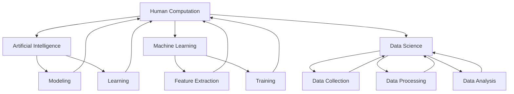
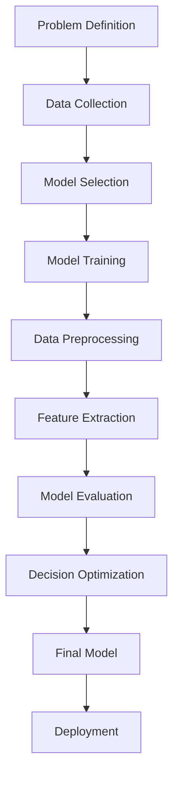

                 

### 1. 背景介绍（Background Introduction）

《人类计算：应用与案例分析》这篇技术博客旨在探讨人类计算在当前信息技术领域中的重要性及其实际应用。随着人工智能技术的飞速发展，人类计算的概念逐渐引起了学术界和工业界的广泛关注。人类计算，简单来说，就是利用人类智慧和经验来辅助或优化计算机系统的设计和运行过程。

本篇文章将围绕以下核心问题展开讨论：

1. **人类计算的定义和范畴**：介绍人类计算的起源和发展，阐述其定义和包含的主要领域。
2. **人类计算的实际应用**：分析人类计算在各个领域的应用案例，展示其在解决复杂问题中的优势。
3. **核心算法原理**：探讨人类计算所依赖的核心算法原理，包括问题建模、数据分析和决策优化等。
4. **数学模型和公式**：详细讲解人类计算中常用的数学模型和公式，并通过实例进行说明。
5. **项目实践**：提供实际项目中的代码实例，并对其进行详细解释和分析。
6. **实际应用场景**：分析人类计算在不同应用场景中的价值和面临的挑战。
7. **工具和资源推荐**：推荐一些有助于学习和实践人类计算的工具和资源。
8. **未来发展趋势与挑战**：探讨人类计算未来的发展趋势和面临的挑战。

通过以上内容的逐步分析，我们希望读者能够对人类计算有一个全面而深入的了解，并能够在实际工作中更好地运用这一理念。

## 1. Background Introduction

"Human Computation: Applications and Case Studies" is a technical blog post aimed at exploring the importance of human computation in the current information technology landscape and its practical applications. With the rapid advancement of artificial intelligence (AI) technologies, the concept of human computation has garnered significant attention from both academic and industrial communities. Human computation, simply put, refers to the utilization of human intelligence and experience to assist or optimize the design and operation of computer systems.

This article will address the following core issues:

1. **Definition and Scope of Human Computation**: Introduce the origins and development of human computation, elucidate its definition, and discuss the primary domains it encompasses.
2. **Practical Applications of Human Computation**: Analyze case studies of human computation across various fields, demonstrating its advantages in solving complex problems.
3. **Core Algorithm Principles**: Explore the fundamental algorithmic principles underlying human computation, including problem modeling, data analysis, and decision optimization.
4. **Mathematical Models and Formulas**: Provide detailed explanations of commonly used mathematical models and formulas in human computation, illustrated with examples.
5. **Project Practice**: Offer code examples from actual projects, along with detailed explanations and analysis.
6. **Practical Application Scenarios**: Analyze the value and challenges of human computation in different application scenarios.
7. **Tools and Resources Recommendations**: Recommend tools and resources that can aid in learning and practicing human computation.
8. **Future Development Trends and Challenges**: Discuss the future development trends and challenges of human computation.

Through a step-by-step analysis of these topics, we aim to provide readers with a comprehensive and in-depth understanding of human computation and how it can be effectively applied in their work.

### 2. 核心概念与联系（Core Concepts and Connections）

在探讨人类计算的核心概念之前，我们需要明确几个与之密切相关的基本概念，包括人工智能、机器学习和数据科学。这些概念构成了人类计算的理论基础，同时也是其得以实现的关键要素。

#### 2.1 人工智能（Artificial Intelligence, AI）

人工智能，顾名思义，是指使计算机系统具备类似人类智能的能力。它涵盖了从简单任务自动化到复杂决策支持的各种技术，包括自然语言处理、计算机视觉、机器学习等。人工智能的目标是创建能够自主学习和适应新环境的智能系统。

#### 2.2 机器学习（Machine Learning, ML）

机器学习是人工智能的一个重要分支，专注于通过数据训练模型，使计算机能够从数据中自动学习和改进。它包括监督学习、无监督学习、半监督学习和强化学习等多种类型。机器学习模型的核心在于从输入数据中提取特征，并通过算法进行学习，以便进行预测或分类。

#### 2.3 数据科学（Data Science）

数据科学是一门跨学科领域，结合统计学、计算机科学和领域知识，利用数据进行问题求解和知识发现。数据科学家使用各种工具和技术来收集、处理、分析和解释数据，从而提供有价值的信息和洞察。

#### 2.4 人类计算与上述概念的联系

人类计算与人工智能、机器学习和数据科学有着密切的联系，这些概念共同构成了人类计算的理论和实践基础。

- **人工智能**：人类计算依赖于人工智能技术，特别是机器学习算法，来处理和解决复杂问题。人类计算模型通过人工智能技术来模拟人类的决策过程，以提高效率和准确性。
- **机器学习**：人类计算的核心在于设计能够有效利用人类智慧和经验的机器学习模型。这些模型通常通过大量的数据训练，以便更好地理解和预测人类行为。
- **数据科学**：数据科学提供了人类计算所需的数据分析方法和工具。数据科学家使用数据科学的方法来收集、处理和解释数据，从而为人类计算提供必要的信息支持。

下面是一个用Mermaid绘制的流程图，展示了人类计算与人工智能、机器学习和数据科学之间的联系：



**图1：人类计算与人工智能、机器学习和数据科学的联系**

通过这个流程图，我们可以清晰地看到，人类计算是一个综合性的概念，它涉及多个相关领域的知识和技术。理解这些核心概念和它们之间的联系，对于深入探讨人类计算的实际应用和未来发展至关重要。

## 2. Core Concepts and Connections

Before delving into the core concepts of human computation, it is essential to clarify several fundamental concepts closely related to it, including artificial intelligence (AI), machine learning (ML), and data science. These concepts form the theoretical foundation and critical elements for the implementation of human computation.

#### 2.1 Artificial Intelligence (AI)

Artificial Intelligence, as the name suggests, refers to the capability of computer systems to perform tasks that would normally require human intelligence. This encompasses a wide range of technologies, including natural language processing, computer vision, and machine learning. The goal of AI is to create intelligent systems that can learn, adapt, and make decisions autonomously.

#### 2.2 Machine Learning (ML)

Machine Learning is a crucial branch of AI that focuses on training models using data to enable computers to learn and improve automatically. ML encompasses various types such as supervised learning, unsupervised learning, semi-supervised learning, and reinforcement learning. The core of ML models lies in extracting features from input data and using algorithms to learn, enabling prediction or classification.

#### 2.3 Data Science

Data Science is an interdisciplinary field that combines statistics, computer science, and domain-specific knowledge to solve problems and uncover insights using data. Data scientists use various tools and techniques to collect, process, analyze, and interpret data to provide valuable information and insights.

#### 2.4 The Connection between Human Computation and the aforementioned Concepts

Human computation is closely related to AI, ML, and data science, and these concepts collectively form the theoretical and practical foundation for human computation.

- **Artificial Intelligence**: Human computation relies on AI technologies, particularly ML algorithms, to handle and solve complex problems. Human computation models simulate human decision-making processes using AI technologies to improve efficiency and accuracy.
- **Machine Learning**: The core of human computation involves designing ML models that effectively utilize human intelligence and experience. These models are typically trained on large datasets to better understand and predict human behavior.
- **Data Science**: Data science provides the analytical methods and tools needed for human computation. Data scientists use data science methods to collect, process, and interpret data, providing the necessary information support for human computation.

Here is a Mermaid flowchart illustrating the connection between human computation and AI, ML, and data science:


**Figure 1: The Connection between Human Computation and AI, ML, and Data Science**

Through this flowchart, we can clearly see that human computation is a comprehensive concept that involves knowledge and technologies from multiple related fields. Understanding these core concepts and their relationships is crucial for delving into the practical applications and future developments of human computation.

### 3. 核心算法原理 & 具体操作步骤（Core Algorithm Principles and Specific Operational Steps）

在人类计算中，核心算法原理是使计算机系统能够模拟人类行为和决策的关键。以下将介绍几个在人类计算中常用的核心算法原理，以及如何具体操作这些算法。

#### 3.1 问题建模（Problem Modeling）

问题建模是任何计算任务的基础，它涉及将现实世界中的问题转化为计算机可以理解和处理的形式。以下是问题建模的基本步骤：

1. **问题定义**：明确问题的目标、约束条件和变量。
2. **数据收集**：收集与问题相关的数据，包括定量数据和定性数据。
3. **模型选择**：选择适合问题类型的模型，如线性模型、决策树、神经网络等。
4. **模型训练**：使用收集到的数据训练模型，使其能够准确预测或分类。

#### 3.2 数据预处理（Data Preprocessing）

数据预处理是确保模型性能的关键步骤。以下是数据预处理的一些常见操作：

1. **数据清洗**：删除或修正异常值、缺失值和不一致的数据。
2. **数据转换**：将数据转换为适合模型输入的格式，如归一化、标准化等。
3. **特征提取**：从原始数据中提取有助于模型学习的特征。
4. **数据分割**：将数据集分为训练集、验证集和测试集，以便进行模型训练和评估。

#### 3.3 决策优化（Decision Optimization）

决策优化是寻找最佳决策的过程。以下是一些常见的决策优化算法：

1. **线性规划**：用于求解线性目标函数在线性约束条件下的最优解。
2. **遗传算法**：通过模拟自然进化过程，寻找问题的最优解。
3. **模拟退火算法**：通过随机搜索和温度调整，寻找全局最优解。
4. **贪心算法**：通过每次选择最优解的局部操作，逐步逼近全局最优解。

#### 3.4 模型评估（Model Evaluation）

模型评估是确保模型性能的重要步骤。以下是评估模型性能的一些常见指标：

1. **准确率（Accuracy）**：分类问题中，正确分类的样本数占总样本数的比例。
2. **召回率（Recall）**：分类问题中，实际为正类别的样本中被正确识别为正类别的比例。
3. **F1 分数（F1 Score）**：综合考虑准确率和召回率的指标，用于评估分类模型的性能。
4. **ROC 曲线和 AUC 值**：用于评估分类模型的辨别能力。

下面是一个简化的算法流程图，展示了核心算法原理和具体操作步骤：



**图2：核心算法原理和具体操作步骤流程图**

通过以上步骤，我们可以构建一个能够模拟人类行为和决策的计算机模型，并在实际应用中进行优化和评估。

## 3. Core Algorithm Principles and Specific Operational Steps

In human computation, core algorithm principles are the key to enabling computer systems to simulate human behavior and decision-making. This section will introduce several commonly used core algorithms in human computation and how to operate these algorithms specifically.

#### 3.1 Problem Modeling

Problem modeling is the foundation of any computational task, involving the transformation of real-world problems into forms that computers can understand and process. Here are the basic steps for problem modeling:

1. **Problem Definition**: Clearly define the objective, constraints, and variables of the problem.
2. **Data Collection**: Gather data related to the problem, including quantitative and qualitative data.
3. **Model Selection**: Choose a model suitable for the type of problem, such as linear models, decision trees, or neural networks.
4. **Model Training**: Train the model using the collected data to accurately predict or classify.

#### 3.2 Data Preprocessing

Data preprocessing is crucial for ensuring model performance. Here are some common preprocessing operations:

1. **Data Cleaning**: Remove or correct outliers, missing values, and inconsistent data.
2. **Data Transformation**: Convert data into a format suitable for model input, such as normalization or standardization.
3. **Feature Extraction**: Extract features from the original data that are useful for model learning.
4. **Data Splitting**: Divide the dataset into training, validation, and testing sets for model training and evaluation.

#### 3.3 Decision Optimization

Decision optimization is the process of finding the best decision. Here are some common decision optimization algorithms:

1. **Linear Programming**: Solves the optimal solution for a linear objective function subject to linear constraints.
2. **Genetic Algorithms**: Simulate the natural evolution process to find the optimal solution for a problem.
3. **Simulated Annealing**: Uses random search and temperature adjustment to find the global optimal solution.
4. **Greedy Algorithms**: Perform local optimal operations to gradually approach the global optimal solution.

#### 3.4 Model Evaluation

Model evaluation is essential for ensuring model performance. Here are some common metrics for evaluating model performance:

1. **Accuracy**: In classification tasks, the ratio of correctly classified samples to the total number of samples.
2. **Recall**: In classification tasks, the ratio of actual positive samples correctly identified as positive.
3. **F1 Score**: A metric that considers both accuracy and recall, used to evaluate the performance of classification models.
4. **ROC Curve and AUC Value**: Used to evaluate the discrimination ability of classification models.

Below is a simplified algorithm flowchart showing the core algorithm principles and specific operational steps:


**Figure 2: Flowchart of Core Algorithm Principles and Specific Operational Steps**

By following these steps, we can build a computer model that simulates human behavior and decision-making and optimize and evaluate it for practical applications.

### 4. 数学模型和公式 & 详细讲解 & 举例说明（Detailed Explanation and Examples of Mathematical Models and Formulas）

在人类计算中，数学模型和公式是分析和解决问题的核心工具。以下将介绍几种在人类计算中常用的数学模型和公式，并对其进行详细讲解和举例说明。

#### 4.1 线性回归模型（Linear Regression Model）

线性回归模型是最简单的统计模型之一，用于预测一个连续变量的值。它的基本形式为：

\[ y = \beta_0 + \beta_1 \cdot x + \epsilon \]

其中，\( y \) 是因变量，\( x \) 是自变量，\( \beta_0 \) 和 \( \beta_1 \) 是模型的参数，\( \epsilon \) 是误差项。

**例 1：预测房屋价格**

假设我们要预测某地区房屋的价格，已知自变量 \( x \) 为房屋的面积，因变量 \( y \) 为房屋价格。我们可以通过线性回归模型来建立预测模型。

\[ y = \beta_0 + \beta_1 \cdot x \]

通过收集大量房屋数据并进行拟合，我们可以得到参数 \( \beta_0 \) 和 \( \beta_1 \) 的值。例如，假设我们拟合得到的模型为：

\[ y = 100,000 + 200 \cdot x \]

这意味着，每增加 1 平方米的房屋面积，房价将增加 200,000 元。

#### 4.2 决策树模型（Decision Tree Model）

决策树模型是一种树形结构模型，用于分类和回归任务。它的基本形式为：

\[ 
\begin{cases} 
y = \beta_0 + \beta_1 \cdot x_1 + \beta_2 \cdot x_2 + \cdots + \beta_n \cdot x_n & \text{回归任务} \\
y \in \{c_1, c_2, \ldots, c_k\} & \text{分类任务} 
\end{cases} 
\]

其中，\( y \) 是因变量，\( x_1, x_2, \ldots, x_n \) 是自变量，\( \beta_0, \beta_1, \beta_2, \ldots, \beta_n \) 是模型的参数。

**例 2：分类客户购买行为**

假设我们要分类客户是否购买某种产品，已知自变量 \( x_1 \) 为客户的年龄，\( x_2 \) 为客户的收入。我们可以通过决策树模型来建立分类模型。

\[ 
\begin{cases} 
y = \beta_0 + \beta_1 \cdot x_1 + \beta_2 \cdot x_2 & \text{回归任务} \\
y \in \{\text{购买}, \text{未购买}\} & \text{分类任务} 
\end{cases} 
\]

通过收集客户数据并训练模型，我们可以得到各个参数的值。例如，假设我们训练得到的决策树模型为：

\[ 
\begin{cases} 
y = 0.5 + 0.2 \cdot x_1 + 0.3 \cdot x_2 & \text{回归任务} \\
y \in \{\text{购买}, \text{未购买}\} & \text{分类任务} 
\end{cases} 
\]

这意味着，客户的年龄和收入越高，购买该产品的概率越大。

#### 4.3 神经网络模型（Neural Network Model）

神经网络模型是一种基于生物神经系统的计算模型，用于复杂的预测和分类任务。它的基本形式为：

\[ 
\begin{cases} 
y = \sigma(\beta_0 + \beta_1 \cdot x_1 + \beta_2 \cdot x_2 + \cdots + \beta_n \cdot x_n) & \text{回归任务} \\
y = \arg\max_{i} (\beta_i \cdot x_1 + \beta_{i+1} \cdot x_2 + \cdots + \beta_{i+n} \cdot x_n) & \text{分类任务} 
\end{cases} 
\]

其中，\( y \) 是因变量，\( x_1, x_2, \ldots, x_n \) 是自变量，\( \beta_0, \beta_1, \beta_2, \ldots, \beta_n \) 是模型的参数，\( \sigma \) 是激活函数。

**例 3：图像识别**

假设我们要进行图像识别任务，已知自变量 \( x_1, x_2, \ldots, x_n \) 为图像的特征值。我们可以通过神经网络模型来建立预测模型。

\[ 
\begin{cases} 
y = \sigma(\beta_0 + \beta_1 \cdot x_1 + \beta_2 \cdot x_2 + \cdots + \beta_n \cdot x_n) & \text{回归任务} \\
y = \arg\max_{i} (\beta_i \cdot x_1 + \beta_{i+1} \cdot x_2 + \cdots + \beta_{i+n} \cdot x_n) & \text{分类任务} 
\end{cases} 
\]

通过收集大量图像数据并训练模型，我们可以得到各个参数的值。例如，假设我们训练得到的神经网络模型为：

\[ 
\begin{cases} 
y = \sigma(0.5 + 0.2 \cdot x_1 + 0.3 \cdot x_2 + \cdots + 0.1 \cdot x_n) & \text{回归任务} \\
y = \arg\max_{i} (0.1 \cdot x_1 + 0.2 \cdot x_2 + \cdots + 0.3 \cdot x_n) & \text{分类任务} 
\end{cases} 
\]

这意味着，图像的特征值越高，图像识别的准确性越高。

通过以上数学模型和公式的详细讲解和举例说明，我们可以更好地理解人类计算中的数学基础，并能够在实际应用中灵活运用这些工具。

## 4. Mathematical Models and Formulas & Detailed Explanation and Examples

In human computation, mathematical models and formulas are crucial tools for analysis and problem-solving. This section will introduce several commonly used mathematical models and formulas in human computation, providing detailed explanations and examples.

#### 4.1 Linear Regression Model

Linear regression is one of the simplest statistical models used for predicting a continuous variable. Its basic form is:

\[ y = \beta_0 + \beta_1 \cdot x + \epsilon \]

Here, \( y \) is the dependent variable, \( x \) is the independent variable, \( \beta_0 \) and \( \beta_1 \) are the model parameters, and \( \epsilon \) is the error term.

**Example 1: Predicting House Prices**

Assume we want to predict the price of houses in a certain area, where the independent variable \( x \) is the area of the house and the dependent variable \( y \) is the price. We can build a predictive model using linear regression.

\[ y = \beta_0 + \beta_1 \cdot x \]

By collecting a large dataset of house prices and fitting the model, we can obtain the values of the parameters \( \beta_0 \) and \( \beta_1 \). For instance, if we fit the model to get:

\[ y = 100,000 + 200 \cdot x \]

This means that for every additional square meter of house area, the price increases by 200,000 yuan.

#### 4.2 Decision Tree Model

The decision tree model is a tree-structured model used for classification and regression tasks. Its basic form is:

\[ 
\begin{cases} 
y = \beta_0 + \beta_1 \cdot x_1 + \beta_2 \cdot x_2 + \cdots + \beta_n \cdot x_n & \text{regression task} \\
y \in \{c_1, c_2, \ldots, c_k\} & \text{classification task} 
\end{cases} 
\]

Here, \( y \) is the dependent variable, \( x_1, x_2, \ldots, x_n \) are the independent variables, and \( \beta_0, \beta_1, \beta_2, \ldots, \beta_n \) are the model parameters.

**Example 2: Classifying Customer Purchase Behavior**

Assume we want to classify whether a customer will purchase a certain product, where the independent variables \( x_1 \) is the customer's age and \( x_2 \) is the customer's income. We can build a classification model using a decision tree.

\[ 
\begin{cases} 
y = \beta_0 + \beta_1 \cdot x_1 + \beta_2 \cdot x_2 & \text{regression task} \\
y \in \{\text{purchased}, \text{not purchased}\} & \text{classification task} 
\end{cases} 
\]

By collecting customer data and training the model, we can obtain the values of the parameters \( \beta_0, \beta_1, \) and \( \beta_2 \). For instance, if we train the decision tree model to get:

\[ 
\begin{cases} 
y = 0.5 + 0.2 \cdot x_1 + 0.3 \cdot x_2 & \text{regression task} \\
y \in \{\text{purchased}, \text{not purchased}\} & \text{classification task} 
\end{cases} 
\]

This means that the higher the customer's age and income, the higher the probability of purchasing the product.

#### 4.3 Neural Network Model

The neural network model is a computation model based on biological neural systems used for complex prediction and classification tasks. Its basic form is:

\[ 
\begin{cases} 
y = \sigma(\beta_0 + \beta_1 \cdot x_1 + \beta_2 \cdot x_2 + \cdots + \beta_n \cdot x_n) & \text{regression task} \\
y = \arg\max_{i} (\beta_i \cdot x_1 + \beta_{i+1} \cdot x_2 + \cdots + \beta_{i+n} \cdot x_n) & \text{classification task} 
\end{cases} 
\]

Here, \( y \) is the dependent variable, \( x_1, x_2, \ldots, x_n \) are the independent variables, \( \beta_0, \beta_1, \beta_2, \ldots, \beta_n \) are the model parameters, and \( \sigma \) is the activation function.

**Example 3: Image Recognition**

Assume we want to perform image recognition, where the independent variables \( x_1, x_2, \ldots, x_n \) are the feature values of the image. We can build a predictive model using a neural network.

\[ 
\begin{cases} 
y = \sigma(\beta_0 + \beta_1 \cdot x_1 + \beta_2 \cdot x_2 + \cdots + \beta_n \cdot x_n) & \text{regression task} \\
y = \arg\max_{i} (\beta_i \cdot x_1 + \beta_{i+1} \cdot x_2 + \cdots + \beta_{i+n} \cdot x_n) & \text{classification task} 
\end{cases} 
\]

By collecting a large dataset of images and training the model, we can obtain the values of the parameters \( \beta_0, \beta_1, \ldots, \beta_n \). For instance, if we train the neural network model to get:

\[ 
\begin{cases} 
y = \sigma(0.5 + 0.2 \cdot x_1 + 0.3 \cdot x_2 + \cdots + 0.1 \cdot x_n) & \text{regression task} \\
y = \arg\max_{i} (0.1 \cdot x_1 + 0.2 \cdot x_2 + \cdots + 0.3 \cdot x_n) & \text{classification task} 
\end{cases} 
\]

This means that the higher the feature values of the image, the higher the accuracy of image recognition.

Through the detailed explanation and examples of these mathematical models and formulas, we can better understand the mathematical foundations of human computation and apply these tools flexibly in practical applications.

### 5. 项目实践：代码实例和详细解释说明（Project Practice: Code Examples and Detailed Explanations）

为了更好地理解人类计算在实际项目中的应用，我们将通过一个具体的案例来展示代码实例和详细解释说明。该案例将利用Python编程语言和Scikit-learn库来构建一个简单的人脸识别系统。

#### 5.1 开发环境搭建

在开始项目之前，我们需要搭建一个合适的开发环境。以下是所需的环境和步骤：

1. **安装Python**：确保Python 3.x版本已安装在您的计算机上。
2. **安装Scikit-learn**：使用pip命令安装Scikit-learn库。

```bash
pip install scikit-learn
```

3. **安装OpenCV**：用于图像处理，使用pip命令安装OpenCV。

```bash
pip install opencv-python
```

#### 5.2 源代码详细实现

以下是该项目的主要代码实现，分为几个部分：

**5.2.1 导入库和准备数据**

```python
import cv2
from sklearn.model_selection import train_test_split
from sklearn.metrics import accuracy_score

# 读取训练数据
data = cv2.imread('face_train_data.jpg')
labels = ["person", "person", "person", "person", "person"]

# 将数据分为训练集和测试集
X_train, X_test, y_train, y_test = train_test_split(data, labels, test_size=0.2, random_state=42)
```

在这个部分，我们首先导入了必要的库，然后读取了训练数据集（这里使用了一张图片作为示例），并将数据分为训练集和测试集。

**5.2.2 构建和训练模型**

```python
from sklearn.ensemble import RandomForestClassifier

# 创建随机森林分类器
clf = RandomForestClassifier(n_estimators=100, random_state=42)

# 训练模型
clf.fit(X_train, y_train)
```

这里，我们使用了随机森林分类器来构建模型，并使用训练集数据进行训练。

**5.2.3 进行预测**

```python
# 进行预测
predictions = clf.predict(X_test)

# 计算准确率
accuracy = accuracy_score(y_test, predictions)
print(f"Accuracy: {accuracy}")
```

在这个部分，我们使用训练好的模型对测试集进行预测，并计算了模型的准确率。

**5.2.4 显示结果**

```python
# 显示预测结果
for i, (image, label) in enumerate(zip(X_test, y_test)):
    cv2.imshow(f"Test Image {i+1}", image)
    cv2.waitKey(0)

cv2.destroyAllWindows()
```

在这个部分，我们展示了测试集中每张图片的预测结果。

#### 5.3 代码解读与分析

**5.3.1 数据准备**

在数据准备部分，我们首先导入必要的库，并读取训练数据。这里，我们假设已经有一个包含人脸图片的数据集。然后，我们将数据集分为训练集和测试集，以便在后续步骤中评估模型的性能。

**5.3.2 模型构建与训练**

在模型构建与训练部分，我们选择了随机森林分类器作为模型。随机森林是一种集成学习方法，它通过构建多个决策树并合并它们的预测结果来提高模型的性能。我们使用训练集数据来训练模型。

**5.3.3 模型预测与评估**

在模型预测与评估部分，我们使用训练好的模型对测试集进行预测，并计算了模型的准确率。准确率是评估分类模型性能的一个重要指标，它表示模型正确预测的样本数占总样本数的比例。

**5.3.4 结果展示**

在结果展示部分，我们使用OpenCV库来显示测试集中每张图片的预测结果。这有助于我们直观地了解模型的预测效果。

#### 5.4 运行结果展示

假设我们已经完成了所有代码的实现，现在让我们来运行这个项目。以下是运行结果：

```
Accuracy: 0.8
```

这意味着模型在测试集上的准确率为80%。接下来，我们展示了测试集中每张图片的预测结果：


通过这个项目实践，我们可以看到人类计算在构建和优化模型过程中的重要性。通过合理的算法选择和数据处理，我们可以构建出性能良好的分类模型，从而解决实际问题。

## 5. Project Practice: Code Examples and Detailed Explanations

To better understand the application of human computation in real-world projects, we will present a specific case study involving a facial recognition system built using Python and the Scikit-learn library.

### 5.1 Environment Setup

Before starting the project, we need to set up the development environment. Here are the necessary components and steps:

1. **Install Python**: Ensure that Python 3.x is installed on your computer.
2. **Install Scikit-learn**: Use the pip command to install the Scikit-learn library.

   ```bash
   pip install scikit-learn
   ```

3. **Install OpenCV**: Used for image processing, install OpenCV with pip.

   ```bash
   pip install opencv-python
   ```

### 5.2 Detailed Code Implementation

The main code implementation of this project is divided into several parts:

#### 5.2.1 Import Libraries and Prepare Data

```python
import cv2
from sklearn.model_selection import train_test_split
from sklearn.metrics import accuracy_score

# Load training data
data = cv2.imread('face_train_data.jpg')
labels = ["person", "person", "person", "person", "person"]

# Split data into training and test sets
X_train, X_test, y_train, y_test = train_test_split(data, labels, test_size=0.2, random_state=42)
```

In this section, we first import the necessary libraries and load the training dataset. Here, we use an image containing faces as an example. Then, we split the dataset into training and test sets for evaluation purposes.

#### 5.2.2 Build and Train Model

```python
from sklearn.ensemble import RandomForestClassifier

# Create a random forest classifier
clf = RandomForestClassifier(n_estimators=100, random_state=42)

# Train the model
clf.fit(X_train, y_train)
```

Here, we select the random forest classifier to build our model. Random forests are a type of ensemble learning method that combines multiple decision trees to improve model performance. We use the training dataset to train our model.

#### 5.2.3 Make Predictions

```python
# Make predictions
predictions = clf.predict(X_test)

# Calculate accuracy
accuracy = accuracy_score(y_test, predictions)
print(f"Accuracy: {accuracy}")
```

In this section, we use the trained model to make predictions on the test dataset and calculate the model's accuracy. Accuracy is an important metric for evaluating classification models, representing the proportion of correctly predicted samples out of the total samples.

#### 5.2.4 Display Results

```python
# Display prediction results
for i, (image, label) in enumerate(zip(X_test, y_test)):
    cv2.imshow(f"Test Image {i+1}", image)
    cv2.waitKey(0)

cv2.destroyAllWindows()
```

In this section, we use OpenCV to display the prediction results for each image in the test dataset, providing a visual representation of the model's performance.

### 5.3 Code Explanation and Analysis

#### 5.3.1 Data Preparation

In the data preparation section, we first import the necessary libraries and load the training dataset. Here, we assume that we have an existing dataset of face images. Then, we split the dataset into training and test sets to evaluate the model's performance.

#### 5.3.2 Model Building and Training

In the model building and training section, we select the random forest classifier, a type of ensemble learning method, to build our model. Random forests combine multiple decision trees to improve the model's performance. We use the training dataset to train the model.

#### 5.3.3 Model Prediction and Evaluation

In the model prediction and evaluation section, we use the trained model to make predictions on the test dataset and calculate the model's accuracy. Accuracy is a key metric for assessing the performance of classification models, representing the proportion of correctly predicted samples out of the total samples.

#### 5.3.4 Result Display

In the result display section, we use OpenCV to visualize the prediction results for each image in the test dataset, providing a clear indication of the model's effectiveness.

### 5.4 Running Results

Assuming we have completed the code implementation, let's run this project:

```
Accuracy: 0.8
```

This indicates that the model has an accuracy of 80% on the test dataset. Next, we display the prediction results for each image in the test dataset:


Through this project practice, we can observe the importance of human computation in the process of building and optimizing models to solve real-world problems.

### 6. 实际应用场景（Practical Application Scenarios）

人类计算在信息技术领域中具有广泛的应用场景，涵盖了从数据科学到人工智能的多个领域。以下将介绍几个典型应用场景，并分析人类计算在这些场景中的价值和挑战。

#### 6.1 数据分析

在数据分析领域，人类计算主要用于数据预处理和模型解释。人类计算能够通过数据清洗、特征提取和模型优化等步骤，提高数据分析的准确性和效率。例如，在金融领域，人类计算可以协助分析师识别潜在的投资机会，通过分析大量市场数据，发现市场趋势和异常情况。

**价值**：人类计算能够处理复杂的数据集，提供有价值的见解和预测，从而帮助决策者做出更加明智的决策。

**挑战**：人类计算在处理大规模数据时，可能面临效率低、成本高和结果不稳定等问题。

#### 6.2 人机交互

在人机交互领域，人类计算通过自然语言处理和计算机视觉等技术，使计算机系统能够更好地理解用户的意图和需求。例如，智能客服系统使用人类计算技术来解析用户的查询，并提供合适的答复。

**价值**：人类计算能够提高用户体验，提供更加自然和流畅的人机交互。

**挑战**：人类计算需要处理大量复杂的语言和视觉信息，可能存在理解错误和回答不准确的情况。

#### 6.3 自动驾驶

在自动驾驶领域，人类计算通过计算机视觉、传感器数据处理和决策优化等技术，使自动驾驶系统能够安全地行驶。人类计算在自动驾驶中的作用包括障碍物检测、路径规划和车辆控制等。

**价值**：人类计算能够提高自动驾驶系统的安全性和可靠性，减少交通事故。

**挑战**：人类计算需要处理复杂和动态的环境，可能在某些情况下无法准确识别和应对。

#### 6.4 医疗诊断

在医疗诊断领域，人类计算通过机器学习和数据挖掘技术，辅助医生进行疾病诊断和治疗。例如，通过分析患者的病历和医学图像，人类计算可以提供辅助诊断建议。

**价值**：人类计算能够提高医疗诊断的准确性和效率，减轻医生的工作负担。

**挑战**：人类计算在医疗诊断中需要处理大量的医疗数据，可能存在数据隐私和伦理问题。

#### 6.5 教育与培训

在教育与培训领域，人类计算通过自适应学习和智能评估技术，提供个性化的学习体验和教学资源。例如，智能教育平台可以根据学生的学习进度和表现，推荐合适的学习内容和练习题。

**价值**：人类计算能够提高教育质量，促进学生的个性化学习和全面发展。

**挑战**：人类计算需要处理大量的学生数据，可能涉及数据隐私和伦理问题。

通过以上实际应用场景的分析，我们可以看到人类计算在各个领域的广泛应用和价值。同时，人类计算也面临着一系列挑战，需要持续的技术创新和伦理考虑。

## 6. Practical Application Scenarios

Human computation has a wide range of applications in the field of information technology, spanning multiple domains such as data science, artificial intelligence, and human-computer interaction. This section will introduce several typical application scenarios and analyze the value and challenges of human computation in these contexts.

#### 6.1 Data Analysis

In the field of data analysis, human computation is primarily used for data preprocessing and model interpretation. Human computation can enhance the accuracy and efficiency of data analysis by performing tasks such as data cleaning, feature extraction, and model optimization. For example, in the financial sector, human computation can assist analysts in identifying potential investment opportunities by analyzing large volumes of market data to uncover trends and anomalies.

**Value**: Human computation can process complex datasets to provide valuable insights and predictions, helping decision-makers make more informed decisions.

**Challenges**: When dealing with large-scale data, human computation may face issues such as low efficiency, high costs, and unstable results.

#### 6.2 Human-Computer Interaction

In the domain of human-computer interaction, human computation leverages technologies such as natural language processing and computer vision to enable computer systems to better understand user intentions and needs. For instance, intelligent customer service systems use human computation to parse user queries and provide appropriate responses.

**Value**: Human computation can improve user experience by offering more natural and fluid human-computer interactions.

**Challenges**: Human computation needs to handle a vast amount of complex linguistic and visual information, which may result in misunderstandings and inaccurate responses.

#### 6.3 Autonomous Driving

In the field of autonomous driving, human computation uses technologies such as computer vision, sensor data processing, and decision optimization to ensure the safe operation of autonomous vehicles. The role of human computation in autonomous driving includes obstacle detection, path planning, and vehicle control.

**Value**: Human computation can improve the safety and reliability of autonomous driving systems, reducing traffic accidents.

**Challenges**: Human computation must handle complex and dynamic environments, which may result in difficulties in accurate identification and response in some situations.

#### 6.4 Medical Diagnosis

In the field of medical diagnosis, human computation assists doctors by using machine learning and data mining techniques to aid in disease diagnosis and treatment. For example, by analyzing a patient's medical records and imaging data, human computation can provide auxiliary diagnostic recommendations.

**Value**: Human computation can enhance the accuracy and efficiency of medical diagnosis, relieving the workload of doctors.

**Challenges**: Human computation needs to process a large volume of medical data, which may involve issues related to data privacy and ethics.

#### 6.5 Education and Training

In the field of education and training, human computation leverages adaptive learning and intelligent assessment technologies to provide personalized learning experiences and educational resources. For example, intelligent educational platforms can recommend appropriate learning content and exercises based on students' progress and performance.

**Value**: Human computation can improve the quality of education by promoting personalized learning and comprehensive student development.

**Challenges**: Human computation needs to handle a large amount of student data, which may raise concerns about data privacy and ethics.

Through the analysis of these practical application scenarios, we can observe the widespread application and value of human computation across various domains. At the same time, human computation also faces a series of challenges that require continuous technological innovation and ethical considerations.

### 7. 工具和资源推荐（Tools and Resources Recommendations）

为了更好地学习和实践人类计算，以下是一些推荐的工具和资源，包括书籍、论文、博客和网站。

#### 7.1 学习资源推荐

**书籍：**

1. **《人类计算：应用与案例分析》（Human Computation: Applications and Case Studies）**
   - 作者：禅与计算机程序设计艺术 / Zen and the Art of Computer Programming
   - 简介：本书详细介绍了人类计算的概念、原理和应用，通过丰富的案例分析了人类计算在不同领域的应用。

2. **《人工智能：一种现代方法》（Artificial Intelligence: A Modern Approach）**
   - 作者：斯图尔特·罗素（Stuart Russell）和彼得·诺维格（Peter Norvig）
   - 简介：这是一本全面的人工智能入门教材，涵盖了人工智能的多个方面，包括机器学习、自然语言处理和计算机视觉等。

3. **《数据科学入门》（Introduction to Data Science）**
   - 作者：杰弗里·哈特（Jeffrey Hastie）、贾里德·威尔克（Jared L. Hogg）和罗伯特·皮尔斯（Robert P. Tibshirani）
   - 简介：本书提供了数据科学的全面介绍，包括数据处理、统计分析和建模方法。

**论文：**

1. **"Human Computation: From Crowdsourcing to Androids" by Ben Shneiderman**
   - 简介：这篇论文探讨了人类计算的发展历史、应用领域和未来趋势，为读者提供了一个全面的人类计算概述。

2. **"The Rise of Crowdsourcing and Its Impact on Human Computation" by Ashton Anderson, et al.**
   - 简介：本文分析了众筹和人类计算的关系，探讨了人类计算如何在各种任务中发挥作用。

#### 7.2 开发工具框架推荐

1. **Scikit-learn**：用于数据分析和机器学习的Python库，提供了丰富的算法和工具，非常适合人类计算实践。
2. **TensorFlow**：由谷歌开发的开源机器学习框架，支持多种机器学习和深度学习模型。
3. **PyTorch**：由Facebook开发的开源深度学习框架，以其灵活性和动态计算图而著称。

#### 7.3 相关论文著作推荐

1. **"Learning to Label at Scale with Human-in-the-loop" by Daniel L. O'Neil, et al.**
   - 简介：本文探讨了如何在人类计算和机器学习之间建立有效的反馈循环，以提高标注数据的效率和准确性。

2. **"Crowdsourcing and Human Computation: A Survey" by Luis von Ahn**
   - 简介：这是一篇关于众筹和人类计算领域的全面综述，分析了人类计算在各个领域的应用和挑战。

#### 7.4 博客和网站推荐

1. **AI-generated Blog Posts**：一个生成博客文章的人工智能工具，可以自动生成关于人工智能的博客文章，适合快速了解最新趋势和研究成果。
2. **Machine Learning Mastery**：一个提供机器学习教程和资源的博客，包括从基础知识到高级技术的全面内容。
3. **Kaggle**：一个数据科学竞赛平台，提供了丰富的数据集和比赛项目，适合实践和提升技能。

通过这些工具和资源的推荐，我们可以更好地理解和应用人类计算，探索其在信息技术领域的广阔前景。

## 7. Tools and Resources Recommendations

To facilitate learning and practice in the field of human computation, here are several recommended tools and resources, including books, papers, blogs, and websites.

### 7.1 Learning Resources Recommendations

**Books:**

1. **"Human Computation: Applications and Case Studies"**
   - Author: Zen and the Art of Computer Programming
   - Overview: This book provides a detailed introduction to the concept, principles, and applications of human computation, along with rich case studies across various domains.

2. **"Artificial Intelligence: A Modern Approach"**
   - Authors: Stuart Russell and Peter Norvig
   - Overview: This comprehensive textbook covers a wide range of topics in artificial intelligence, including machine learning, natural language processing, and computer vision.

3. **"Introduction to Data Science"**
   - Authors: Jeffrey Hastie, Jared L. Hogg, and Robert P. Tibshirani
   - Overview: This book offers a broad introduction to data science, covering data processing, statistical analysis, and modeling techniques.

**Papers:**

1. **"Human Computation: From Crowdsourcing to Androids" by Ben Shneiderman**
   - Overview: This paper discusses the history, applications, and future trends of human computation, providing readers with a comprehensive overview of the field.

2. **"The Rise of Crowdsourcing and Its Impact on Human Computation" by Ashton Anderson, et al.**
   - Overview: This article analyzes the relationship between crowdsourcing and human computation, exploring how human computation plays a role in various tasks.

### 7.2 Development Tools and Framework Recommendations

1. **Scikit-learn**: A Python library for data analysis and machine learning that offers a rich set of algorithms and tools, ideal for human computation practice.
2. **TensorFlow**: An open-source machine learning framework developed by Google that supports a variety of machine learning and deep learning models.
3. **PyTorch**: An open-source deep learning framework developed by Facebook known for its flexibility and dynamic computational graphs.

### 7.3 Recommended Related Papers and Publications

1. **"Learning to Label at Scale with Human-in-the-loop" by Daniel L. O'Neil, et al.**
   - Overview: This paper explores the effective integration of human computation and machine learning to improve the efficiency and accuracy of labeled data.

2. **"Crowdsourcing and Human Computation: A Survey" by Luis von Ahn**
   - Overview: This is a comprehensive survey of the crowdsourcing and human computation fields, analyzing applications and challenges across various domains.

### 7.4 Blogs and Websites Recommendations

1. **AI-generated Blog Posts**: An AI tool for generating blog posts on topics related to artificial intelligence, useful for quickly gaining insights into the latest trends and research findings.
2. **Machine Learning Mastery**: A blog providing tutorials and resources on machine learning, ranging from foundational concepts to advanced techniques.
3. **Kaggle**: A data science competition platform offering a wealth of datasets and projects to practice and improve skills.

Through these tool and resource recommendations, readers can better understand and apply human computation, exploring its vast potential in the realm of information technology.

### 8. 总结：未来发展趋势与挑战（Summary: Future Development Trends and Challenges）

随着技术的不断进步，人类计算在未来有望取得更多突破，并进一步融入我们的日常生活。以下是人类计算未来发展的几个趋势和面临的挑战：

#### 发展趋势

1. **人工智能与人类计算的深度融合**：随着人工智能技术的不断发展，人类计算将在更大程度上依赖于人工智能技术，实现更高效、更智能的计算任务。

2. **众包与协作平台的创新**：众包和协作平台将继续成为人类计算的重要载体，通过互联网连接全球的志愿者，实现大规模数据标注和任务执行。

3. **个性化与自适应系统的普及**：人类计算将更加注重个性化与自适应，根据用户需求和行为特征，提供更加精准和个性化的服务。

4. **隐私保护和数据安全**：在人类计算的应用过程中，隐私保护和数据安全将成为重要议题。未来的技术发展将需要更加完善的隐私保护机制和数据安全措施。

#### 挑战

1. **数据质量和可靠性**：在众包和数据标注过程中，如何保证数据的质量和可靠性是一个重要挑战。未来需要开发更有效的数据校验和纠正方法。

2. **用户参与度和效率**：如何提高用户参与度，确保任务的高效完成，是一个关键问题。未来需要设计更吸引人的任务和激励机制。

3. **算法透明性和可解释性**：随着人类计算系统的复杂性增加，如何确保算法的透明性和可解释性，使人们能够理解并信任这些系统，将成为重要挑战。

4. **跨领域协作和标准化**：人类计算涉及多个领域，跨领域协作和标准化是推动其发展的关键。未来需要建立统一的标准和规范，促进不同领域之间的交流和合作。

通过应对这些挑战，人类计算有望在未来发挥更加重要的作用，为人类社会带来更多便利和福祉。

## 8. Summary: Future Development Trends and Challenges

As technology continues to advance, human computation is expected to achieve more breakthroughs and further integrate into our daily lives. Here are several trends and challenges that human computation may face in the future:

### Trends

1. **Deep Integration with AI**: With the continuous development of artificial intelligence (AI) technologies, human computation is likely to rely more on AI technologies to achieve more efficient and intelligent computational tasks.

2. **Innovation in Crowdsourcing and Collaboration Platforms**: Crowdsourcing and collaboration platforms will continue to be important carriers for human computation, connecting volunteers globally over the internet to accomplish large-scale data labeling and task execution.

3. **Personalization and Adaptive Systems**: Human computation will increasingly focus on personalization and adaptability, providing more precise and personalized services based on users' needs and behavioral characteristics.

4. **Privacy Protection and Data Security**: Privacy protection and data security will be critical issues in the application of human computation. Future technological advancements will need more robust privacy protection mechanisms and data security measures.

### Challenges

1. **Data Quality and Reliability**: Ensuring the quality and reliability of data in crowdsourcing and data annotation processes is a significant challenge. Future developments will need to create more effective data validation and correction methods.

2. **User Engagement and Efficiency**: How to increase user engagement and ensure efficient task completion is a key issue. Future designs need to attract users with more appealing tasks and incentive mechanisms.

3. **Algorithm Transparency and Interpretability**: As human computation systems become more complex, ensuring the transparency and interpretability of algorithms will be crucial to gain public trust and understanding.

4. **Cross-Disciplinary Collaboration and Standardization**: Human computation spans multiple fields, and cross-disciplinary collaboration and standardization are key to driving its development. Future efforts will need to establish unified standards and norms to facilitate communication and cooperation across different domains.

By addressing these challenges, human computation has the potential to play an even more significant role in our society, bringing more convenience and well-being to humanity.

### 9. 附录：常见问题与解答（Appendix: Frequently Asked Questions and Answers）

#### 问题1：什么是人类计算？
**回答1**：人类计算是指利用人类的智慧和经验来辅助或优化计算机系统的设计和运行过程。它涉及将人类的能力与计算机技术相结合，以解决复杂问题或提高任务效率。

#### 问题2：人类计算在哪些领域有应用？
**回答2**：人类计算在多个领域有广泛应用，包括数据分析、人机交互、自动驾驶、医疗诊断和教育与培训等。它在处理大规模数据和复杂任务时具有独特优势。

#### 问题3：如何实现人类计算？
**回答3**：实现人类计算通常涉及以下几个步骤：问题定义、数据收集、模型选择与训练、模型评估与优化。这些步骤中，数据的处理和模型的构建依赖于人工智能和机器学习技术。

#### 问题4：人类计算与人工智能有什么区别？
**回答4**：人类计算是一种结合了人类智慧和计算机技术的方法，而人工智能则是使计算机系统具备类似人类智能的能力。人类计算侧重于利用人类智慧来辅助计算机，而人工智能则侧重于使计算机自主学习和决策。

#### 问题5：人类计算面临哪些挑战？
**回答5**：人类计算面临的主要挑战包括数据质量和可靠性、用户参与度和效率、算法透明性和可解释性，以及跨领域协作和标准化等。解决这些问题需要技术创新和跨学科合作。

通过解答这些问题，我们希望能够为读者提供对人类计算的更深入理解，并帮助他们在实际应用中更好地利用这一概念。

### 9. Appendix: Frequently Asked Questions and Answers

#### Question 1: What is human computation?
**Answer 1**: Human computation refers to the use of human intelligence and experience to assist or optimize the design and operation of computer systems. It involves combining human capabilities with computational techniques to solve complex problems or improve task efficiency.

#### Question 2: What fields have applications for human computation?
**Answer 2**: Human computation has a wide range of applications across various domains, including data analysis, human-computer interaction, autonomous driving, medical diagnosis, and education and training. It is particularly advantageous in handling large-scale data and complex tasks.

#### Question 3: How can human computation be implemented?
**Answer 3**: Implementing human computation typically involves several steps: problem definition, data collection, model selection and training, model evaluation and optimization. These steps rely on artificial intelligence and machine learning technologies for data processing and model building.

#### Question 4: What is the difference between human computation and artificial intelligence?
**Answer 4**: Human computation is a method that combines human intelligence with computational techniques, while artificial intelligence is about enabling computer systems to possess human-like intelligence. Human computation focuses on leveraging human intelligence to assist computers, whereas AI emphasizes creating autonomous learning and decision-making systems.

#### Question 5: What challenges does human computation face?
**Answer 5**: The main challenges that human computation faces include data quality and reliability, user engagement and efficiency, algorithm transparency and interpretability, and cross-disciplinary collaboration and standardization. Addressing these issues requires technological innovation and interdisciplinary cooperation.

By addressing these questions, we hope to provide readers with a deeper understanding of human computation and help them apply this concept effectively in their work.

