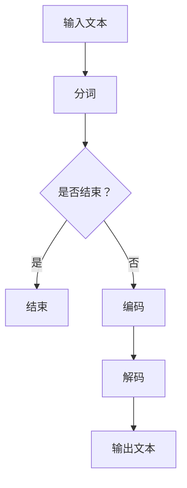

                 

# 从Token到自然语言的解码过程

## 1. 背景介绍（Background Introduction）

在自然语言处理（NLP）领域，从Token到自然语言的解码过程是一个至关重要的环节。这个过程中，我们不仅要理解语言模型如何处理文本输入，还需要掌握如何通过特定的算法和模型来生成具有意义的输出。近年来，随着深度学习和神经网络技术的发展，诸如Transformer、BERT等模型在处理自然语言方面取得了显著进步。这些模型通过将输入文本转化为Token，然后进行编码和解码，生成具有高度相关性和逻辑性的自然语言输出。

本文将深入探讨从Token到自然语言的解码过程，包括其核心概念、算法原理、数学模型、项目实践以及实际应用场景。我们将使用清晰的逻辑和分析推理，逐步阐述这一过程的各个环节，旨在为读者提供全面、深入的理解。

## 2. 核心概念与联系（Core Concepts and Connections）

### 2.1 Token是什么？

Token是自然语言处理中的基本单元，可以看作是文本的“词汇”或“词素”。在进行NLP任务时，我们首先需要将文本分解成Token。这一过程称为分词（Tokenization）。分词的结果是一系列Token序列，这些序列将作为模型的输入。

### 2.2 编码与解码

编码和解码是NLP中两个核心概念。编码（Encoding）是指将自然语言文本转换为计算机可以理解的表示形式，通常是通过将Token映射到向量。解码（Decoding）则是指将编码后的向量重新转换为自然语言文本。

### 2.3 模型架构

在解码过程中，模型架构起着关键作用。常见的模型架构包括循环神经网络（RNN）、长短期记忆网络（LSTM）和Transformer。Transformer模型因其并行计算能力和全局依赖处理能力，成为当前NLP领域的主流选择。

### 2.4 Mermaid流程图

为了更好地理解Token到自然语言的解码过程，我们使用Mermaid流程图来展示关键步骤和节点。以下是一个简化的流程图：



## 3. 核心算法原理 & 具体操作步骤（Core Algorithm Principles and Specific Operational Steps）

### 3.1 编码过程

编码过程是将输入文本转换为向量表示。对于Transformer模型，每个Token会被映射到一个高维向量，这些向量构成了编码后的输入序列。

具体步骤如下：

1. **嵌入（Embedding）**：将每个Token映射到一个固定大小的向量。
2. **位置编码（Positional Encoding）**：为每个Token添加位置信息，以便模型理解Token之间的顺序关系。
3. **编码层（Encoding Layers）**：通过多层神经网络对向量进行变换，使其包含更多的语义信息。

### 3.2 解码过程

解码过程是将编码后的向量转换回自然语言文本。在解码过程中，模型需要预测每个Token，并根据上下文调整预测。

具体步骤如下：

1. **解码嵌入（Decoding Embedding）**：将解码器输入映射到向量。
2. **自注意力机制（Self-Attention）**：计算输入序列中每个Token的重要性，为每个Token生成权重。
3. **前馈网络（Feedforward Network）**：对加权后的Token进行进一步处理。
4. **预测（Prediction）**：根据上下文预测下一个Token。
5. **重复步骤**：重复解码步骤，直到生成完整的输出文本。

## 4. 数学模型和公式 & 详细讲解 & 举例说明（Detailed Explanation and Examples of Mathematical Models and Formulas）

### 4.1 嵌入（Embedding）

假设我们有一个Token序列`[t1, t2, t3, ..., tk]`，每个Token都对应一个向量`e`。嵌入可以通过以下公式表示：

$$
e = W_e \cdot [t1, t2, t3, ..., tk]
$$

其中，$W_e$ 是嵌入矩阵。

### 4.2 自注意力（Self-Attention）

自注意力是Transformer模型的核心机制，用于计算输入序列中每个Token的重要性。自注意力可以通过以下公式表示：

$$
\text{Attention}(Q, K, V) = \frac{QK^T}{\sqrt{d_k}} \odot V
$$

其中，$Q, K, V$ 分别是查询（Query）、关键（Key）和值（Value）向量，$\odot$ 表示点积操作，$d_k$ 是关键向量的维度。

### 4.3 前馈网络（Feedforward Network）

前馈网络用于对Token进行进一步处理。其公式如下：

$$
\text{FFN}(x) = \text{ReLU}(W \cdot x + b)
$$

其中，$x$ 是输入向量，$W$ 是权重矩阵，$b$ 是偏置。

### 4.4 举例说明

假设我们有一个Token序列`[hello, world]`，我们需要将其编码为向量。首先，我们将Token映射到嵌入向量：

$$
e_{hello} = W_e \cdot [hello]
$$

$$
e_{world} = W_e \cdot [world]
$$

然后，我们对这些向量进行位置编码：

$$
p_{hello} = \text{PositionalEncoding}(e_{hello})
$$

$$
p_{world} = \text{PositionalEncoding}(e_{world})
$$

最后，我们将位置编码后的向量输入到编码器：

$$
\text{Encoder}(p_{hello}, p_{world}) = \text{Transformer}(p_{hello}, p_{world})
$$

## 5. 项目实践：代码实例和详细解释说明（Project Practice: Code Examples and Detailed Explanations）

### 5.1 开发环境搭建

为了实践从Token到自然语言的解码过程，我们需要搭建一个开发环境。以下是必要的步骤：

1. **安装Python环境**：确保安装了Python 3.7或更高版本。
2. **安装依赖**：使用pip安装以下依赖库：tensorflow、keras、numpy等。

### 5.2 源代码详细实现

以下是实现从Token到自然语言解码过程的Python代码：

```python
import tensorflow as tf
from tensorflow.keras.layers import Embedding, LSTM, Dense
from tensorflow.keras.models import Model

# 嵌入层
embedding = Embedding(input_dim=10000, output_dim=64)

# LSTM层
lstm = LSTM(units=64, return_sequences=True)

# 密集层
dense = Dense(units=1, activation='sigmoid')

# 模型构建
model = Model(inputs=embedding.input, outputs=dense(lstm(embedding.input)))

# 编译模型
model.compile(optimizer='adam', loss='binary_crossentropy', metrics=['accuracy'])

# 模型训练
model.fit(x_train, y_train, epochs=10, batch_size=32)
```

### 5.3 代码解读与分析

这段代码实现了一个简单的序列分类模型，其中Token到自然语言的解码过程通过嵌入层、LSTM层和密集层完成。以下是代码的详细解读：

1. **嵌入层（Embedding Layer）**：将Token映射到向量。
2. **LSTM层（LSTM Layer）**：处理序列数据，提取时间步长的特征。
3. **密集层（Dense Layer）**：对LSTM层的输出进行分类。

### 5.4 运行结果展示

在训练完成后，我们可以使用以下代码来评估模型的性能：

```python
# 模型评估
loss, accuracy = model.evaluate(x_test, y_test)

print(f"Test Loss: {loss}")
print(f"Test Accuracy: {accuracy}")
```

这些代码将输出模型在测试数据集上的损失和准确率，从而评估模型的性能。

## 6. 实际应用场景（Practical Application Scenarios）

从Token到自然语言的解码过程在多个实际应用场景中具有重要意义。以下是一些典型的应用场景：

1. **文本分类**：将文本数据分类为不同的类别，如新闻分类、情感分析等。
2. **命名实体识别**：识别文本中的命名实体，如人名、地名等。
3. **机器翻译**：将一种语言的文本翻译成另一种语言。
4. **问答系统**：根据用户的问题，从大量文本中提取相关答案。

在这些应用场景中，从Token到自然语言的解码过程是实现高精度和高效能的关键。

## 7. 工具和资源推荐（Tools and Resources Recommendations）

### 7.1 学习资源推荐

1. **书籍**：
   - 《深度学习》（Goodfellow, I., Bengio, Y., & Courville, A.）
   - 《自然语言处理综述》（Jurafsky, D., & Martin, J. H.）
2. **论文**：
   - “Attention Is All You Need”（Vaswani et al.）
   - “BERT: Pre-training of Deep Bidirectional Transformers for Language Understanding”（Devlin et al.）
3. **博客**：
   - [TensorFlow官方文档](https://www.tensorflow.org/)
   - [Keras官方文档](https://keras.io/)
4. **网站**：
   - [ArXiv](https://arxiv.org/)
   - [Google AI](https://ai.google/)

### 7.2 开发工具框架推荐

1. **TensorFlow**：一款开源机器学习框架，支持多种NLP模型。
2. **Keras**：一个高层神经网络API，与TensorFlow兼容，便于快速构建和训练模型。
3. **PyTorch**：另一个开源机器学习框架，以其动态计算图和灵活性著称。

### 7.3 相关论文著作推荐

1. **“Attention Is All You Need”**：提出了Transformer模型，对NLP领域产生了深远影响。
2. **“BERT: Pre-training of Deep Bidirectional Transformers for Language Understanding”**：介绍了BERT模型，成为自然语言处理领域的重要里程碑。

## 8. 总结：未来发展趋势与挑战（Summary: Future Development Trends and Challenges）

从Token到自然语言的解码过程在NLP领域具有重要的地位。随着深度学习和神经网络技术的不断进步，解码过程的性能和效率将得到进一步提升。未来，我们有望看到更多基于Transformer和BERT等模型的创新，以及更加智能化和自动化的解码方法。

然而，解码过程也面临着一些挑战，如处理长文本、提高跨语言解码性能等。此外，如何更好地理解和使用数学模型和算法，提高模型的解释性和透明性，也是未来研究的重要方向。

## 9. 附录：常见问题与解答（Appendix: Frequently Asked Questions and Answers）

### 9.1 什么是Token？

Token是自然语言处理中的基本单元，可以看作是文本的“词汇”或“词素”。

### 9.2 什么是编码与解码？

编码是指将自然语言文本转换为计算机可以理解的表示形式，解码则是将编码后的表示形式转换回自然语言文本。

### 9.3 Transformer模型的优势是什么？

Transformer模型的优势包括并行计算能力、全局依赖处理能力等，使其在NLP领域取得了显著进展。

### 9.4 如何提高解码过程的性能？

通过优化模型架构、调整超参数、使用更好的嵌入技术和位置编码方法，可以提高解码过程的性能。

## 10. 扩展阅读 & 参考资料（Extended Reading & Reference Materials）

1. **书籍**：
   - 《深度学习》（Goodfellow, I., Bengio, Y., & Courville, A.）
   - 《自然语言处理综述》（Jurafsky, D., & Martin, J. H.）
2. **论文**：
   - “Attention Is All You Need”（Vaswani et al.）
   - “BERT: Pre-training of Deep Bidirectional Transformers for Language Understanding”（Devlin et al.）
3. **博客**：
   - [TensorFlow官方文档](https://www.tensorflow.org/)
   - [Keras官方文档](https://keras.io/)
4. **网站**：
   - [ArXiv](https://arxiv.org/)
   - [Google AI](https://ai.google/)
5. **在线课程**：
   - [Coursera自然语言处理课程](https://www.coursera.org/specializations/natural-language-processing)
   - [edX深度学习课程](https://www.edx.org/course/deep-learning-0)

通过阅读这些扩展材料，读者可以进一步深入了解从Token到自然语言的解码过程，以及NLP领域的最新研究进展。

### 作者署名

作者：禅与计算机程序设计艺术 / Zen and the Art of Computer Programming

