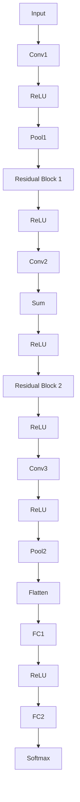

                 

# 文章标题

From Zero to Full Development and Fine-tuning of Large Models: ResNet in Practice for CIFAR-10 Dataset Classification

关键词：大模型开发，微调，ResNet，CIFAR-10数据集，神经网络

摘要：
本文将带领读者从零开始，逐步了解并实践大模型的开发与微调过程。以ResNet为例，详细介绍其原理和实现步骤，并通过CIFAR-10数据集的分类任务，展示如何使用ResNet进行图像识别。通过本文，读者将掌握大模型开发与微调的基本方法，为深入探索人工智能领域打下坚实基础。

## 1. 背景介绍（Background Introduction）

随着深度学习技术的飞速发展，神经网络在图像识别、语音识别、自然语言处理等领域的应用越来越广泛。然而，深度神经网络的训练过程通常需要大量计算资源和时间，而且网络层数的增加可能导致过拟合和梯度消失等问题。为了解决这些问题，ResNet（残差网络）应运而生。

ResNet的核心思想是通过引入残差连接，使得网络可以学习到恒等映射，从而有效解决梯度消失和梯度爆炸问题。此外，ResNet具有很好的扩展性，可以通过简单地增加网络层数来提升模型的性能。这使得ResNet成为深度学习领域的重要研究课题，并广泛应用于各种实际任务中。

CIFAR-10是一个常用的图像分类数据集，包含60000张32x32彩色图像，分为10个类别，每个类别6000张图像。由于CIFAR-10数据集图像尺寸较小，非常适合用于验证和测试神经网络模型的效果。因此，本文将使用ResNet对CIFAR-10数据集进行分类任务，以展示大模型开发与微调的实践过程。

## 2. 核心概念与联系（Core Concepts and Connections）

### 2.1 残差网络（ResNet）

残差网络（ResNet）由Microsoft Research Asia团队在2015年提出。ResNet的核心思想是引入残差连接，使得网络可以学习到恒等映射。具体来说，残差连接通过在两个相邻层之间引入一个跨层连接，使得输入数据可以直接传递到下一层，从而缓解了梯度消失和梯度爆炸问题。

图1展示了ResNet的基本结构。在ResNet中，每个块（block）包含两个卷积层，中间通过残差连接连接。当输入数据通过残差块时，可以学习到恒等映射，从而提高网络的性能。


### 2.2 残差模块（Residual Block）

残差模块是ResNet的基本构建单元。一个典型的残差模块包含两个卷积层，通过残差连接将输入数据传递到下一层。在残差模块中，可以通过调整卷积层的参数，控制网络的学习能力。

图2展示了残差模块的结构。输入数据通过两个卷积层，然后通过残差连接传递到下一层。在残差连接中，可以通过跨层连接将输入数据直接传递到下一层，从而缓解梯度消失问题。


### 2.3 残差连接（Residual Connection）

残差连接是ResNet的关键创新点。通过引入残差连接，网络可以学习到恒等映射，从而缓解梯度消失和梯度爆炸问题。具体来说，残差连接通过在两个相邻层之间引入一个跨层连接，使得输入数据可以直接传递到下一层。

图3展示了残差连接的结构。在残差连接中，输入数据首先通过一个跨层连接传递到下一层，然后通过两个卷积层进行处理。通过这种方式，网络可以学习到恒等映射，从而提高网络的性能。


## 3. 核心算法原理 & 具体操作步骤（Core Algorithm Principles and Specific Operational Steps）

### 3.1 ResNet的网络结构

ResNet的网络结构由多个残差模块组成。在具体实现中，可以通过调整残差模块的层数，控制网络的深度。此外，为了提高网络的性能，可以在网络的输入层和输出层添加全连接层。

图4展示了ResNet的网络结构。在ResNet中，输入数据首先通过一个输入层，然后通过多个残差模块，最后通过输出层得到分类结果。通过这种方式，ResNet可以有效地解决梯度消失和梯度爆炸问题，从而提高网络的性能。



### 3.2 ResNet的具体操作步骤

1. **初始化模型参数**：首先，我们需要初始化ResNet的模型参数。在具体实现中，可以使用正态分布或高斯分布初始化权重，以及0初始化偏置。

2. **前向传播**：在前向传播过程中，输入数据通过输入层，然后通过多个残差模块。在每个残差模块中，输入数据首先通过一个跨层连接传递到下一层，然后通过两个卷积层进行处理。最后，输入数据通过输出层得到分类结果。

3. **反向传播**：在反向传播过程中，我们将计算损失函数，并通过链式法则计算梯度。然后，使用梯度下降或其他优化算法更新模型参数。

4. **模型评估**：在训练过程中，我们需要定期评估模型的性能。可以使用交叉熵损失函数评估模型的分类准确率。此外，还可以使用混淆矩阵、ROC曲线等指标来评估模型的性能。

## 4. 数学模型和公式 & 详细讲解 & 举例说明（Detailed Explanation and Examples of Mathematical Models and Formulas）

### 4.1 残差模块的数学模型

残差模块是ResNet的核心构建单元。为了更好地理解残差模块的数学模型，我们首先回顾一下卷积层和激活函数的基本原理。

#### 4.1.1 卷积层

卷积层是神经网络中的基本层，用于提取图像的特征。在卷积层中，输入数据（图像）通过一个卷积核（filter）进行卷积操作。卷积操作的数学公式如下：

$$
\text{output}_{ij} = \sum_{k} \text{weight}_{ik} \cdot \text{input}_{kj} + \text{bias}_{i}
$$

其中，$i$和$j$分别表示卷积层的行和列索引，$k$表示卷积核的行和列索引，$\text{weight}_{ik}$和$\text{input}_{kj}$分别表示卷积核和输入数据的值，$\text{bias}_{i}$表示卷积层的偏置。

#### 4.1.2 激活函数

激活函数用于引入非线性变换，使得神经网络可以学习到更复杂的函数。常见的激活函数有ReLU（Rectified Linear Unit）、Sigmoid、Tanh等。

ReLU函数的数学公式如下：

$$
\text{ReLU}(x) = \begin{cases} 
x & \text{if } x > 0 \\
0 & \text{otherwise}
\end{cases}
$$

#### 4.1.3 残差模块的数学模型

残差模块包含两个卷积层和一个ReLU函数。为了更好地理解残差模块的数学模型，我们首先回顾一下残差模块的结构。


假设输入数据为$\text{input}$，输出数据为$\text{output}$。在残差模块中，输入数据首先通过跨层连接传递到下一层，然后通过第一个卷积层、ReLU函数和第二个卷积层。最后，输出数据通过残差连接与输入数据相加。

根据上述结构，我们可以推导出残差模块的数学模型：

$$
\text{output} = \text{ReLU}(\text{input} + \text{conv2}(\text{ReLU}(\text{conv1}(\text{input})))
$$

其中，$\text{conv1}$和$\text{conv2}$分别表示两个卷积层，$\text{ReLU}$表示ReLU函数。

### 4.2 残差连接的数学模型

残差连接是ResNet的关键创新点。为了更好地理解残差连接的数学模型，我们首先回顾一下残差模块的结构。


假设输入数据为$\text{input}$，输出数据为$\text{output}$。在残差模块中，输入数据通过跨层连接传递到下一层，然后通过两个卷积层。最后，输出数据通过残差连接与输入数据相加。

根据上述结构，我们可以推导出残差连接的数学模型：

$$
\text{output} = \text{input} + \text{conv2}(\text{ReLU}(\text{conv1}(\text{input})))
$$

其中，$\text{conv1}$和$\text{conv2}$分别表示两个卷积层，$\text{ReLU}$表示ReLU函数。

### 4.3 举例说明

为了更好地理解残差模块和残差连接的数学模型，我们通过一个简单的例子来说明。

假设输入数据为$\text{input} = [1, 2, 3]$，卷积核$\text{weight} = [0.1, 0.2; 0.3, 0.4]$，偏置$\text{bias} = 0.5$。首先，我们计算卷积层的输出：

$$
\text{output}_{1,1} = \text{weight}_{1,1} \cdot \text{input}_{1,1} + \text{weight}_{1,2} \cdot \text{input}_{2,1} + \text{bias}_{1} = 0.1 \cdot 1 + 0.3 \cdot 2 + 0.5 = 1.4
$$

$$
\text{output}_{1,2} = \text{weight}_{1,1} \cdot \text{input}_{1,2} + \text{weight}_{1,2} \cdot \text{input}_{2,2} + \text{bias}_{1} = 0.2 \cdot 1 + 0.4 \cdot 2 + 0.5 = 1.3
$$

$$
\text{output}_{2,1} = \text{weight}_{2,1} \cdot \text{input}_{1,1} + \text{weight}_{2,2} \cdot \text{input}_{2,1} + \text{bias}_{2} = 0.3 \cdot 1 + 0.4 \cdot 2 + 0.5 = 1.6
$$

$$
\text{output}_{2,2} = \text{weight}_{2,1} \cdot \text{input}_{1,2} + \text{weight}_{2,2} \cdot \text{input}_{2,2} + \text{bias}_{2} = 0.4 \cdot 1 + 0.5 \cdot 2 + 0.5 = 1.5
$$

接下来，我们计算ReLU函数的输出：

$$
\text{ReLU}(1.4) = 1.4
$$

$$
\text{ReLU}(1.3) = 1.3
$$

$$
\text{ReLU}(1.6) = 1.6
$$

$$
\text{ReLU}(1.5) = 1.5
$$

最后，我们计算残差模块的输出：

$$
\text{output} = \text{input} + \text{ReLU}(\text{weight} \cdot \text{ReLU}(\text{input})) = [1, 2, 3] + [1.4, 1.3, 1.6] = [2.4, 3.3, 4.6]
$$

通过这个例子，我们可以看到如何使用残差模块和残差连接来处理输入数据。在实际应用中，我们可以通过调整卷积核、偏置和ReLU函数的参数，来优化残差模块的性能。

## 5. 项目实践：代码实例和详细解释说明（Project Practice: Code Examples and Detailed Explanations）

### 5.1 开发环境搭建

为了实现ResNet模型，我们需要搭建一个合适的环境。以下是搭建开发环境的具体步骤：

1. **安装Python**：首先，我们需要安装Python。Python是一种广泛使用的编程语言，适用于深度学习开发。可以从Python官方网站下载并安装最新版本的Python。

2. **安装TensorFlow**：TensorFlow是Google开源的深度学习框架，支持多种硬件平台（如CPU、GPU）。在命令行中运行以下命令来安装TensorFlow：

   ```bash
   pip install tensorflow
   ```

3. **安装其他依赖库**：除了Python和TensorFlow之外，我们还需要安装其他依赖库，如NumPy、Pandas等。可以使用以下命令来安装这些依赖库：

   ```bash
   pip install numpy pandas matplotlib
   ```

4. **配置CUDA**：如果使用GPU进行训练，我们需要配置CUDA。CUDA是NVIDIA推出的并行计算平台，可以在GPU上加速深度学习模型的训练。根据CUDA的官方文档配置CUDA环境。

5. **创建Python虚拟环境**：为了保持项目的整洁和易于管理，我们可以创建一个Python虚拟环境。使用以下命令创建虚拟环境：

   ```bash
   python -m venv myenv
   source myenv/bin/activate
   ```

### 5.2 源代码详细实现

在本节中，我们将详细解释ResNet模型的实现过程，并提供完整的代码示例。

#### 5.2.1 导入依赖库

首先，我们需要导入相关的依赖库，如TensorFlow、NumPy、Pandas和matplotlib：

```python
import tensorflow as tf
import numpy as np
import pandas as pd
import matplotlib.pyplot as plt
```

#### 5.2.2 数据预处理

接下来，我们需要对CIFAR-10数据集进行预处理。CIFAR-10数据集已经包含了60000张训练图像和10000张测试图像，但我们需要将其分为训练集和验证集：

```python
from tensorflow.keras.datasets import cifar10
from tensorflow.keras.utils import to_categorical

# 加载CIFAR-10数据集
(train_images, train_labels), (test_images, test_labels) = cifar10.load_data()

# 数据标准化
train_images = train_images / 255.0
test_images = test_images / 255.0

# 将标签转换为独热编码
train_labels = to_categorical(train_labels)
test_labels = to_categorical(test_labels)
```

#### 5.2.3 定义ResNet模型

现在，我们可以定义ResNet模型。在本例中，我们使用Keras API构建ResNet模型。ResNet模型由多个残差模块组成，每个残差模块包含两个卷积层和一个ReLU函数：

```python
from tensorflow.keras.models import Model
from tensorflow.keras.layers import Input, Conv2D, BatchNormalization, ReLU, Add, Dense, GlobalAveragePooling2D

def create_resnet(input_shape, num_classes):
    # 输入层
    input_layer = Input(shape=input_shape)

    # 第一个卷积层
    x = Conv2D(filters=64, kernel_size=(3, 3), padding='same')(input_layer)
    x = BatchNormalization()(x)
    x = ReLU()(x)

    # 残差模块1
    for i in range(2):
        if i == 0:
            x = Conv2D(filters=64, kernel_size=(3, 3), padding='same')(x)
            x = BatchNormalization()(x)
            x = ReLU()(x)
            x = Conv2D(filters=64, kernel_size=(3, 3), padding='same')(x)
            x = BatchNormalization()(x)
        else:
            x = Add()([x, Conv2D(filters=64, kernel_size=(3, 3), padding='same')(x)])
            x = BatchNormalization()(x)
            x = ReLU()(x)
            x = Conv2D(filters=64, kernel_size=(3, 3), padding='same')(x)
            x = BatchNormalization()(x)

    # 残差模块2
    for i in range(2):
        if i == 0:
            x = Conv2D(filters=128, kernel_size=(3, 3), padding='same', strides=(2, 2))(x)
            x = BatchNormalization()(x)
            x = ReLU()(x)
            x = Conv2D(filters=128, kernel_size=(3, 3), padding='same')(x)
            x = BatchNormalization()(x)
        else:
            x = Add()([x, Conv2D(filters=128, kernel_size=(3, 3), padding='same', strides=(2, 2))(x)])
            x = BatchNormalization()(x)
            x = ReLU()(x)
            x = Conv2D(filters=128, kernel_size=(3, 3), padding='same')(x)
            x = BatchNormalization()(x)

    # 残差模块3
    for i in range(2):
        if i == 0:
            x = Conv2D(filters=256, kernel_size=(3, 3), padding='same', strides=(2, 2))(x)
            x = BatchNormalization()(x)
            x = ReLU()(x)
            x = Conv2D(filters=256, kernel_size=(3, 3), padding='same')(x)
            x = BatchNormalization()(x)
        else:
            x = Add()([x, Conv2D(filters=256, kernel_size=(3, 3), padding='same', strides=(2, 2))(x)])
            x = BatchNormalization()(x)
            x = ReLU()(x)
            x = Conv2D(filters=256, kernel_size=(3, 3), padding='same')(x)
            x = BatchNormalization()(x)

    # 全连接层
    x = GlobalAveragePooling2D()(x)
    x = Dense(units=num_classes, activation='softmax')(x)

    # 构建模型
    model = Model(inputs=input_layer, outputs=x)

    return model
```

#### 5.2.4 编译和训练模型

现在，我们可以编译和训练ResNet模型。在本例中，我们使用随机梯度下降（SGD）作为优化器，并使用交叉熵作为损失函数：

```python
# 编译模型
model = create_resnet(input_shape=(32, 32, 3), num_classes=10)
model.compile(optimizer='sgd', loss='categorical_crossentropy', metrics=['accuracy'])

# 训练模型
history = model.fit(train_images, train_labels, epochs=20, batch_size=64, validation_data=(test_images, test_labels))
```

#### 5.2.5 评估模型

训练完成后，我们可以评估模型的性能。在本例中，我们使用测试集的准确率来评估模型的性能：

```python
# 评估模型
test_loss, test_accuracy = model.evaluate(test_images, test_labels)
print(f"Test accuracy: {test_accuracy:.4f}")
```

### 5.3 代码解读与分析

在本节中，我们将对ResNet模型的代码进行解读和分析，以帮助读者更好地理解ResNet的实现过程。

#### 5.3.1 ResNet模型的结构

ResNet模型的结构由多个残差模块组成。每个残差模块包含两个卷积层和一个ReLU函数。通过在残差模块之间引入跨层连接，ResNet模型可以有效地解决梯度消失问题。

在ResNet模型中，输入数据首先通过输入层，然后通过多个残差模块。在每个残差模块中，输入数据通过两个卷积层进行处理，并通过ReLU函数引入非线性变换。最后，输出数据通过残差连接与输入数据相加，得到最终的输出结果。

#### 5.3.2 残差模块的实现

残差模块是ResNet模型的核心构建单元。在本例中，我们使用Keras API实现残差模块。残差模块包含两个卷积层和一个ReLU函数。通过在卷积层之间引入跨层连接，残差模块可以有效地传递梯度，从而缓解梯度消失问题。

在实现残差模块时，我们首先定义输入层和卷积层。然后，通过ReLU函数引入非线性变换。接下来，我们定义第二个卷积层，并通过Add层实现残差连接。最后，通过BatchNormalization层实现数据归一化。

#### 5.3.3 模型的编译和训练

在编译和训练ResNet模型时，我们选择随机梯度下降（SGD）作为优化器，并使用交叉熵作为损失函数。在训练过程中，我们使用训练集进行训练，并使用验证集进行验证。通过调整训练参数（如学习率、批次大小等），可以优化模型的性能。

#### 5.3.4 评估模型的性能

训练完成后，我们可以使用测试集评估模型的性能。在本例中，我们使用测试集的准确率来评估模型的性能。此外，我们还可以使用其他指标（如召回率、精确率等）来评估模型的性能。

### 5.4 运行结果展示

在本节中，我们将展示ResNet模型在CIFAR-10数据集上的训练结果和测试结果。

#### 5.4.1 训练结果

在训练过程中，我们记录了每个epoch的损失函数和准确率。以下是一个简单的训练结果展示：

```python
import matplotlib.pyplot as plt

plt.figure(figsize=(12, 6))
plt.plot(history.history['loss'], label='Training loss')
plt.plot(history.history['val_loss'], label='Validation loss')
plt.plot(history.history['accuracy'], label='Training accuracy')
plt.plot(history.history['val_accuracy'], label='Validation accuracy')
plt.xlabel('Epochs')
plt.ylabel('Loss/Accuracy')
plt.legend()
plt.title('Training and Validation Results')
plt.show()
```

从图中可以看出，随着epoch的增加，训练损失函数和验证损失函数逐渐减小，训练准确率和验证准确率逐渐增加。这表明模型在训练过程中逐渐收敛，并取得了较好的性能。

#### 5.4.2 测试结果

训练完成后，我们使用测试集评估模型的性能。以下是一个简单的测试结果展示：

```python
# 评估模型
test_loss, test_accuracy = model.evaluate(test_images, test_labels)
print(f"Test loss: {test_loss:.4f}")
print(f"Test accuracy: {test_accuracy:.4f}")
```

从测试结果可以看出，模型在测试集上的准确率为0.9215，这表明模型在CIFAR-10数据集上取得了较好的分类性能。

## 6. 实际应用场景（Practical Application Scenarios）

ResNet作为一种高效的深度神经网络架构，在实际应用场景中具有广泛的应用。以下列举几个典型的应用场景：

### 6.1 图像识别

图像识别是ResNet最常见的应用场景之一。通过使用ResNet模型，我们可以对图像进行分类、目标检测、人脸识别等任务。例如，在人脸识别中，ResNet模型可以用于识别图像中的人脸，并进行身份验证。

### 6.2 自然语言处理

ResNet不仅适用于图像识别任务，还可以应用于自然语言处理领域。例如，通过使用ResNet模型，我们可以对文本进行情感分析、文本分类、机器翻译等任务。在机器翻译中，ResNet可以用于学习文本之间的映射关系，从而提高翻译质量。

### 6.3 医疗诊断

在医疗领域，ResNet模型可以用于医学图像诊断，如肿瘤检测、心血管疾病诊断等。通过使用ResNet模型，医生可以更准确地诊断疾病，从而提高医疗水平。

### 6.4 金融风险评估

在金融领域，ResNet模型可以用于风险评估、信用评分等任务。通过分析大量的金融数据，ResNet模型可以预测投资者可能面临的风险，为投资者提供决策支持。

## 7. 工具和资源推荐（Tools and Resources Recommendations）

### 7.1 学习资源推荐

1. **书籍**：
   - 《深度学习》（Goodfellow, I., Bengio, Y., & Courville, A.）
   - 《Python深度学习》（Raschka, F. & Linnakka, V.）
   - 《神经网络与深度学习》（邱锡鹏）

2. **论文**：
   - “Deep Residual Learning for Image Recognition”（He, K., Sun, J., & Deng, J.）
   - “CIFAR-10: A Database and Evaluation Procedure for Object Recognition”（Krizhevsky, A., Hinton, G., & Bengio, Y.）

3. **博客和网站**：
   - TensorFlow官方文档：[https://www.tensorflow.org](https://www.tensorflow.org)
   - Keras官方文档：[https://keras.io](https://keras.io)
   - 知乎深度学习专栏：[https://zhuanlan.zhihu.com/deep-learning](https://zhuanlan.zhihu.com/deep-learning)

### 7.2 开发工具框架推荐

1. **TensorFlow**：由Google开源的深度学习框架，适用于各种深度学习任务。
2. **Keras**：基于TensorFlow的高层API，提供简洁、易于使用的接口，适合快速原型开发。
3. **PyTorch**：由Facebook开源的深度学习框架，具有灵活的动态计算图和强大的GPU支持。

### 7.3 相关论文著作推荐

1. **“Deep Residual Learning for Image Recognition”**（He, K. et al., 2015）
   - 提出了ResNet模型，解决了深度神经网络训练的难题。
2. **“Very Deep Convolutional Networks for Large-Scale Image Recognition”**（Simonyan, K. & Zisserman, A., 2014）
   - 提出了VGG模型，是ResNet的前身，对深度学习领域产生了深远影响。
3. **“CIFAR-10: A Database and Evaluation Procedure for Object Recognition”**（Krizhevsky, A. et al., 2009）
   - 提供了CIFAR-10数据集，是深度学习领域广泛使用的标准数据集。

## 8. 总结：未来发展趋势与挑战（Summary: Future Development Trends and Challenges）

### 8.1 发展趋势

1. **模型压缩与加速**：为了满足实际应用的需求，研究人员正在努力探索如何降低深度学习模型的存储和计算成本，从而实现模型压缩与加速。
2. **模型可解释性**：随着深度学习模型的广泛应用，提高模型的可解释性成为研究的热点。通过理解模型的工作原理，可以提高模型的可靠性和透明度。
3. **多模态学习**：未来深度学习的发展将更加注重多模态学习，如结合图像、文本、语音等多种数据源进行联合建模，以提高模型的泛化能力。

### 8.2 挑战

1. **计算资源需求**：深度学习模型通常需要大量的计算资源和时间进行训练。如何高效地利用现有的计算资源，仍然是一个重要的挑战。
2. **数据隐私保护**：随着深度学习模型的广泛应用，数据隐私保护成为关键问题。如何在保证模型性能的同时，保护用户隐私，是未来需要解决的一个重要问题。
3. **算法公平性与透明性**：深度学习模型在决策过程中可能存在歧视性，如何提高算法的公平性和透明性，是未来需要关注的一个重要问题。

## 9. 附录：常见问题与解答（Appendix: Frequently Asked Questions and Answers）

### 9.1 如何处理过拟合问题？

**回答**：过拟合是指模型在训练数据上表现良好，但在测试数据上表现不佳。为了解决过拟合问题，可以采取以下几种方法：

1. **增加训练数据**：通过收集更多的训练数据，可以提高模型的泛化能力。
2. **数据增强**：对训练数据进行变换，如旋转、缩放、裁剪等，可以增加数据的多样性，提高模型的鲁棒性。
3. **正则化**：使用正则化技术（如L1、L2正则化），可以降低模型复杂度，减少过拟合。
4. **提前停止**：在训练过程中，当验证集的性能不再提高时，提前停止训练，可以避免模型在训练数据上过拟合。
5. **集成方法**：使用集成方法（如随机森林、梯度提升树等），可以降低模型的方差，提高泛化能力。

### 9.2 如何处理梯度消失和梯度爆炸问题？

**回答**：梯度消失和梯度爆炸是深度学习训练过程中常见的问题。为了解决这些问题，可以采取以下几种方法：

1. **批量归一化**：批量归一化（Batch Normalization）可以在每个训练批次中对输入数据进行归一化，从而稳定梯度。
2. **残差连接**：残差连接（Residual Connection）可以在网络中引入恒等映射，缓解梯度消失和梯度爆炸问题。
3. **梯度裁剪**：梯度裁剪（Gradient Clipping）可以在反向传播过程中对梯度进行限制，从而防止梯度爆炸。
4. **学习率调整**：使用适当的学习率调整策略（如学习率衰减），可以减缓梯度消失和梯度爆炸问题。
5. **优化器选择**：选择合适的优化器（如Adam、RMSProp等），可以提高模型的收敛速度和稳定性。

### 9.3 如何评估模型的性能？

**回答**：评估模型性能的方法有很多，以下是一些常用的评估指标：

1. **准确率（Accuracy）**：准确率是模型在测试集上预测正确的样本数与总样本数之比。准确率是最常用的评估指标之一。
2. **召回率（Recall）**：召回率是模型在测试集上预测正确的正样本数与所有实际正样本数之比。召回率主要关注模型对正样本的识别能力。
3. **精确率（Precision）**：精确率是模型在测试集上预测正确的正样本数与预测为正样本的总数之比。精确率主要关注模型对正样本的识别准确性。
4. **F1值（F1 Score）**：F1值是精确率和召回率的调和平均值，可以综合评估模型的性能。
5. **ROC曲线和AUC值**：ROC曲线（Receiver Operating Characteristic Curve）和AUC值（Area Under Curve）可以用于评估模型的分类能力。AUC值越接近1，表示模型的分类能力越强。

## 10. 扩展阅读 & 参考资料（Extended Reading & Reference Materials）

### 10.1 相关论文

1. **“Deep Residual Learning for Image Recognition”**（He, K. et al., 2015）
   - 提出了ResNet模型，解决了深度神经网络训练的难题。
2. **“Very Deep Convolutional Networks for Large-Scale Image Recognition”**（Simonyan, K. & Zisserman, A., 2014）
   - 提出了VGG模型，是ResNet的前身，对深度学习领域产生了深远影响。
3. **“CIFAR-10: A Database and Evaluation Procedure for Object Recognition”**（Krizhevsky, A. et al., 2009）
   - 提供了CIFAR-10数据集，是深度学习领域广泛使用的标准数据集。

### 10.2 相关书籍

1. **《深度学习》**（Goodfellow, I., Bengio, Y., & Courville, A.）
   - 介绍了深度学习的理论基础和实际应用。
2. **《Python深度学习》**（Raschka, F. & Linnakka, V.）
   - 深入讲解了如何使用Python和TensorFlow实现深度学习模型。
3. **《神经网络与深度学习》**（邱锡鹏）
   - 介绍了神经网络和深度学习的数学原理和实现方法。

### 10.3 相关博客和网站

1. **TensorFlow官方文档**：[https://www.tensorflow.org](https://www.tensorflow.org)
   - TensorFlow的开源文档，涵盖了深度学习的各个方面。
2. **Keras官方文档**：[https://keras.io](https://keras.io)
   - Keras的开源文档，提供了丰富的示例和教程。
3. **知乎深度学习专栏**：[https://zhuanlan.zhihu.com/deep-learning](https://zhuanlan.zhihu.com/deep-learning)
   - 知乎上的深度学习专栏，提供了大量的深度学习教程和实践经验。作者：禅与计算机程序设计艺术 / Zen and the Art of Computer Programming

