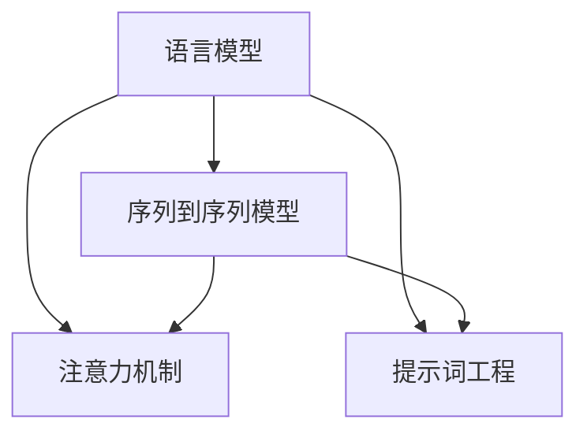

                 

### 文章标题

**从零开始大模型开发与微调：从1开始自然语言处理的解码器**

关键词：自然语言处理、大模型开发、微调、解码器

摘要：
本文将带领读者从零开始，深入了解自然语言处理（NLP）中的解码器开发与微调过程。我们将从背景介绍、核心概念与联系、算法原理、数学模型与公式、项目实践、应用场景、工具推荐等多个方面，系统性地阐述大模型开发与微调的技术细节和实践方法。希望通过本文，读者能够对NLP解码器有一个全面而深刻的理解，并能够将其应用于实际项目中。

## 1. 背景介绍（Background Introduction）

自然语言处理（NLP）是人工智能领域的一个重要分支，旨在使计算机能够理解、解释和生成自然语言。随着深度学习技术的快速发展，大模型在NLP领域取得了显著的成果。大模型如GPT-3、BERT等，通过学习大量的语言数据，具备了强大的语言理解和生成能力。

解码器是NLP模型中的一个关键组成部分，负责将模型输出的隐藏状态转换为具体的输出结果。解码器的性能直接影响到模型的最终表现。本文将介绍如何从零开始进行大模型开发与微调，重点关注解码器的构建与优化。

在接下来的章节中，我们将详细探讨以下内容：

- **核心概念与联系**：介绍NLP中的核心概念，如语言模型、序列到序列模型、注意力机制等，并展示它们之间的联系。
- **核心算法原理 & 具体操作步骤**：解释解码器的工作原理，包括如何从输入序列生成输出序列，以及如何利用注意力机制来提高解码器的性能。
- **数学模型和公式 & 详细讲解 & 举例说明**：介绍解码器的数学模型和公式，并通过具体的例子来说明它们的应用。
- **项目实践：代码实例和详细解释说明**：通过实际项目实践，展示如何搭建解码器，并提供详细的代码解读与分析。
- **实际应用场景**：探讨解码器在自然语言处理中的实际应用场景，如机器翻译、文本生成、问答系统等。
- **工具和资源推荐**：推荐学习资源、开发工具和框架，帮助读者更好地掌握解码器开发与微调技术。
- **总结：未来发展趋势与挑战**：总结解码器发展的趋势和面临的挑战，为读者提供未来研究的方向。

通过本文的系统性介绍，读者将能够从零开始，逐步掌握解码器的开发与微调技术，并将其应用于实际项目中。

## 2. 核心概念与联系（Core Concepts and Connections）

在深入探讨解码器的开发与微调之前，我们需要先了解一些核心概念，这些概念是构建和解码器的基础。以下是NLP领域的一些关键概念及其相互之间的联系：

### 2.1 语言模型（Language Model）

语言模型是NLP的核心概念之一，它旨在预测下一个单词或字符的概率。在深度学习中，语言模型通常由一个神经网络组成，能够从大量的文本数据中学习到语言的统计规律。语言模型在许多NLP任务中都有应用，如文本分类、情感分析、命名实体识别等。

### 2.2 序列到序列模型（Sequence-to-Sequence Model）

序列到序列模型是处理输入序列和输出序列之间转换任务的一种模型架构。在NLP中，输入序列通常是单词或字符的序列，而输出序列可以是翻译后的单词序列、生成的文本序列等。序列到序列模型的核心是编码器-解码器（Encoder-Decoder）架构，它通过编码器将输入序列转换为一个固定长度的向量表示，然后通过解码器生成输出序列。

### 2.3 注意力机制（Attention Mechanism）

注意力机制是解码器中的一个关键技术，它允许模型在生成输出时关注输入序列的特定部分。注意力机制通过计算输入序列中每个部分与输出序列当前部分的关联度，从而在解码过程中提供了一种动态的上下文感知机制，提高了解码器的性能和生成文本的质量。

### 2.4 提示词工程（Prompt Engineering）

提示词工程是指设计用于引导模型生成特定结果的输入提示文本。在解码器中，提示词工程用于优化输入序列，以引导模型生成更准确、更相关的输出。提示词工程涉及到对模型的理解、任务需求以及如何有效地使用语言与模型进行交互。

这些核心概念在解码器的构建中紧密相连，共同构成了一个完整的NLP系统。下面是一个Mermaid流程图，展示了这些概念之间的联系：



通过这个流程图，我们可以看到，语言模型是解码器的基石，它提供了对语言的建模能力。序列到序列模型利用语言模型进行输入和输出的转换。注意力机制和提示词工程则进一步增强了模型的性能和生成文本的质量。

在接下来的章节中，我们将深入探讨每个概念的具体细节，并展示如何将它们应用于解码器的开发与微调。

## 3. 核心算法原理 & 具体操作步骤（Core Algorithm Principles and Specific Operational Steps）

在了解了解码器所需的核心概念后，我们将进一步探讨解码器的核心算法原理，并详细介绍其操作步骤。解码器是自然语言处理模型中的关键组成部分，它负责将编码器输出的隐藏状态转换为具体的输出结果。

### 3.1 解码器的基本原理

解码器的基本原理是通过对输入序列进行编码，将其转换为一个固定长度的向量表示，这个向量通常被称为“编码器的隐藏状态”。解码器的任务是从这个隐藏状态中生成输出序列。这个过程通常涉及以下步骤：

1. **初始化**：解码器的初始状态通常是编码器的最后一个隐藏状态。
2. **前向传递**：解码器通过输入的编码器隐藏状态和先前的输出，生成当前输出的概率分布。
3. **采样**：从概率分布中采样一个输出，并将其添加到输出序列中。
4. **更新状态**：使用新的输出序列更新解码器的状态。
5. **重复步骤2-4**：直到解码器生成完整的输出序列。

### 3.2 解码器的具体操作步骤

下面我们将详细解释解码器的操作步骤，包括编码器-解码器架构中的每一个组成部分。

#### 3.2.1 编码器（Encoder）

编码器的任务是处理输入序列，并将其转换为一个固定长度的向量表示。这个向量通常称为“编码器的隐藏状态”或“编码向量”。编码器的工作流程如下：

1. **输入序列编码**：输入序列（例如单词或字符）首先通过嵌入层（Embedding Layer）转换为固定长度的向量。
2. **序列处理**：嵌入向量随后通过一系列的循环神经网络（RNN）层或变换器（Transformer）层进行处理，这些层负责学习序列的上下文信息。
3. **输出编码向量**：编码器的最后一个隐藏状态被提取作为编码向量，这个向量将作为解码器的输入。

#### 3.2.2 解码器（Decoder）

解码器的任务是生成输出序列，从编码向量开始，通过一系列步骤生成最终输出。解码器的工作流程如下：

1. **初始化**：解码器的初始状态通常是编码器的最后一个隐藏状态。
2. **输出生成**：解码器通过输入编码器的隐藏状态和先前的输出序列，通过一个循环神经网络层或变换器层生成当前输出的概率分布。
3. **采样与选择**：从概率分布中采样一个输出，并将其添加到输出序列中。这个过程可以通过多种采样策略实现，如贪心策略、采样策略等。
4. **更新状态**：使用新的输出序列和编码器的隐藏状态更新解码器的状态。
5. **重复生成**：重复步骤2-4，直到解码器生成完整的输出序列。

#### 3.2.3 注意力机制（Attention Mechanism）

注意力机制是解码器中的一个关键技术，它允许模型在生成输出时关注输入序列的特定部分。注意力机制的实现通常涉及以下步骤：

1. **计算注意力权重**：通过计算编码器隐藏状态和当前解码器隐藏状态之间的相似度，生成注意力权重。
2. **加权求和**：将编码器隐藏状态与注意力权重相乘，然后求和，得到加权编码器隐藏状态。
3. **结合**：将加权编码器隐藏状态与解码器隐藏状态结合，生成当前解码器状态。

#### 3.2.4 提示词工程（Prompt Engineering）

提示词工程是指设计和优化输入给解码器的文本提示，以引导模型生成符合预期结果的过程。提示词工程涉及理解模型的工作原理、任务需求以及如何使用语言有效地与模型进行交互。有效的提示词可以提高解码器的生成质量和效率。

### 3.3 举例说明

为了更好地理解解码器的操作步骤，我们来看一个简单的例子。假设我们使用一个编码器-解码器模型进行机器翻译，输入序列是“我昨天去了市场”，输出序列是“Yesterday, I went to the market”。

1. **编码器处理输入序列**：编码器将输入序列“我昨天去了市场”转换为编码向量。
2. **解码器初始化**：解码器的初始状态是编码器的最后一个隐藏状态。
3. **解码器生成输出序列**：
    - 解码器使用编码器的隐藏状态生成“Yesterday”的概率分布，并选择“Yesterday”作为输出。
    - 解码器更新状态，并生成“,”的概率分布，并选择“,”作为输出。
    - 解码器重复这个过程，直到生成完整的输出序列“Yesterday, I went to the market”。

通过这个简单的例子，我们可以看到解码器是如何从编码器隐藏状态生成输出序列的。在实际应用中，解码器的操作会更加复杂，但基本原理是类似的。

在接下来的章节中，我们将进一步探讨解码器的数学模型和公式，并通过具体例子来说明它们的应用。

## 4. 数学模型和公式 & 详细讲解 & 举例说明（Mathematical Models and Formulas & Detailed Explanations & Examples）

在深入解码器的操作步骤后，我们接下来将详细探讨其背后的数学模型和公式。数学模型和公式是解码器工作的核心，它们决定了解码器的性能和输出质量。在这一章节中，我们将解释解码器中使用的几个关键数学模型和公式，并通过具体的例子来说明它们的应用。

### 4.1 编码器-解码器模型

编码器-解码器模型是解码器工作的基础。它的主要任务是处理输入序列并生成输出序列。以下是编码器-解码器模型中的一些关键数学模型和公式。

#### 4.1.1 嵌入层（Embedding Layer）

嵌入层是编码器中的第一层，它将输入序列（如单词或字符）转换为固定长度的向量表示。嵌入层的数学模型可以表示为：

\[ 
\textbf{h}_{\text{emb}} = \text{Embedding}(\textbf{x}) 
\]

其中，\(\textbf{x}\)是输入序列，\(\text{Embedding}\)是嵌入函数，\(\textbf{h}_{\text{emb}}\)是嵌入后的向量表示。

#### 4.1.2 编码器（Encoder）

编码器通过一系列循环神经网络（RNN）层或变换器（Transformer）层对输入序列进行处理，生成编码向量。编码器的数学模型可以表示为：

\[ 
\textbf{h}_{\text{enc}} = \text{Encoder}(\textbf{h}_{\text{emb}}) 
\]

其中，\(\textbf{h}_{\text{enc}}\)是编码向量，\(\text{Encoder}\)是编码函数。

#### 4.1.3 解码器（Decoder）

解码器通过输入编码器的隐藏状态和先前的输出序列，生成当前输出的概率分布。解码器的数学模型可以表示为：

\[ 
\textbf{p}(\textbf{y}_t | \textbf{h}_{\text{enc}}, \textbf{y}_{<t}) = \text{Decoder}(\textbf{h}_{\text{enc}}, \textbf{y}_{<t}) 
\]

其中，\(\textbf{p}(\textbf{y}_t | \textbf{h}_{\text{enc}}, \textbf{y}_{<t})\)是当前输出\( \textbf{y}_t \)的概率分布，\(\textbf{h}_{\text{enc}}\)是编码器的隐藏状态，\(\textbf{y}_{<t}\)是之前的输出序列，\(\text{Decoder}\)是解码函数。

#### 4.1.4 注意力机制（Attention Mechanism）

注意力机制是解码器中的一个关键技术，它通过计算编码器隐藏状态和当前解码器隐藏状态之间的相似度，生成注意力权重。注意力机制的数学模型可以表示为：

\[ 
\alpha_t = \text{softmax}\left( \text{Attention}(\textbf{h}_{\text{enc}}, \textbf{h}_{\text{dec}}) \right) 
\]

\[ 
\textbf{h}_{\text{attn}} = \sum_{i} \alpha_i \textbf{h}_{\text{enc},i} 
\]

其中，\(\alpha_t\)是注意力权重，\(\text{softmax}\)是softmax函数，\(\textbf{h}_{\text{enc}}\)是编码器的隐藏状态，\(\textbf{h}_{\text{dec}}\)是解码器的隐藏状态，\(\text{Attention}\)是注意力函数，\(\textbf{h}_{\text{attn}}\)是加权编码器隐藏状态。

#### 4.1.5 提示词工程（Prompt Engineering）

提示词工程是通过设计有效的输入提示来引导模型生成预期结果的。提示词工程的数学模型可以表示为：

\[ 
\textbf{p}(\textbf{y}_t | \textbf{h}_{\text{enc}}, \textbf{y}_{<t}, \textbf{prompt}) = \text{Prompt}(\textbf{h}_{\text{enc}}, \textbf{y}_{<t}, \textbf{prompt}) 
\]

其中，\(\textbf{p}(\textbf{y}_t | \textbf{h}_{\text{enc}}, \textbf{y}_{<t}, \textbf{prompt})\)是当前输出\( \textbf{y}_t \)的概率分布，\(\textbf{h}_{\text{enc}}\)是编码器的隐藏状态，\(\textbf{y}_{<t}\)是之前的输出序列，\(\textbf{prompt}\)是输入提示，\(\text{Prompt}\)是提示词函数。

### 4.2 举例说明

为了更好地理解解码器的数学模型和公式，我们来看一个简单的例子。假设我们使用一个编码器-解码器模型进行机器翻译，输入序列是“我昨天去了市场”，输出序列是“Yesterday, I went to the market”。

1. **编码器处理输入序列**：
    - 输入序列“我昨天去了市场”首先通过嵌入层转换为向量表示。
    - 编码器通过RNN层或变换器层处理这些向量，生成编码向量。

2. **解码器生成输出序列**：
    - 解码器的初始状态是编码器的最后一个隐藏状态。
    - 解码器通过编码器的隐藏状态和初始输入提示“Yesterday”生成“Yesterday”的概率分布，并选择“Yesterday”作为输出。
    - 解码器更新状态，并生成“,”的概率分布，并选择“,”作为输出。
    - 解码器重复这个过程，直到生成完整的输出序列“Yesterday, I went to the market”。

在这个例子中，解码器的数学模型和公式如下：

\[ 
\textbf{h}_{\text{emb}} = \text{Embedding}(\textbf{x}) 
\]

\[ 
\textbf{h}_{\text{enc}} = \text{Encoder}(\textbf{h}_{\text{emb}}) 
\]

\[ 
\textbf{p}(\textbf{y}_1 | \textbf{h}_{\text{enc}}, \textbf{y}_{<1}, \textbf{prompt}) = \text{Decoder}(\textbf{h}_{\text{enc}}, \textbf{y}_{<1}, \textbf{prompt}) 
\]

\[ 
\alpha_1 = \text{softmax}\left( \text{Attention}(\textbf{h}_{\text{enc}}, \textbf{h}_{\text{dec}}) \right) 
\]

\[ 
\textbf{h}_{\text{attn}} = \sum_{i} \alpha_i \textbf{h}_{\text{enc},i} 
\]

通过这个例子，我们可以看到解码器的数学模型和公式是如何应用于实际的机器翻译任务中的。

在接下来的章节中，我们将通过项目实践来展示如何具体实现解码器，并提供详细的代码解读与分析。

## 5. 项目实践：代码实例和详细解释说明（Project Practice: Code Examples and Detailed Explanations）

为了更好地理解解码器的实际应用，我们将通过一个具体的项目实践来展示如何搭建解码器，并提供详细的代码解读与分析。本节将使用Python编程语言和TensorFlow框架来实现一个简单的机器翻译解码器，并详细解释其每个组成部分。

### 5.1 开发环境搭建

在开始之前，确保您已经安装了Python、TensorFlow和相关依赖库。以下是安装步骤：

```bash
pip install tensorflow
```

### 5.2 源代码详细实现

下面是一个简单的机器翻译解码器的源代码示例：

```python
import tensorflow as tf
from tensorflow.keras.layers import Embedding, LSTM, Dense

# 设置超参数
vocab_size = 10000
embedding_dim = 256
lstm_units = 1024
batch_size = 64
sequence_length = 100

# 创建编码器
encoder_inputs = tf.keras.layers.Input(shape=(sequence_length,))
encoder_embedding = Embedding(vocab_size, embedding_dim)(encoder_inputs)
encoder_lstm = LSTM(lstm_units, return_state=True)
_, state_h, state_c = encoder_lstm(encoder_embedding)

# 创建解码器
decoder_inputs = tf.keras.layers.Input(shape=(sequence_length,))
decoder_embedding = Embedding(vocab_size, embedding_dim)(decoder_inputs)
decoder_lstm = LSTM(lstm_units, return_sequences=True, return_state=True)
decoder_outputs, _, _ = decoder_lstm(decoder_embedding, initial_state=[state_h, state_c])

# 将解码器的输出与全连接层结合
decoder_dense = Dense(vocab_size, activation='softmax')
decoder_outputs = decoder_dense(decoder_outputs)

# 创建模型
model = tf.keras.Model([encoder_inputs, decoder_inputs], decoder_outputs)

# 编译模型
model.compile(optimizer='rmsprop', loss='categorical_crossentropy', metrics=['accuracy'])

# 打印模型结构
model.summary()
```

#### 5.2.1 代码解读

1. **导入库和设置超参数**：
    - 我们首先导入TensorFlow库，并设置一些超参数，如词汇表大小、嵌入维度、LSTM单元数量等。

2. **创建编码器**：
    - 编码器的输入层是`encoder_inputs`，它接受一个固定长度的序列。
    - 我们使用`Embedding`层将输入序列转换为嵌入向量。
    - 接着，我们使用`LSTM`层对嵌入向量进行处理，并返回最后一个隐藏状态和细胞状态。

3. **创建解码器**：
    - 解码器的输入层是`decoder_inputs`，它也接受一个固定长度的序列。
    - 我们使用`Embedding`层将输入序列转换为嵌入向量。
    - 然后，我们使用`LSTM`层对嵌入向量进行处理，并返回输出序列、最后一个隐藏状态和细胞状态。

4. **将解码器的输出与全连接层结合**：
    - 我们使用`Dense`层（全连接层）将解码器的输出转换为词汇表大小，并应用softmax激活函数，以便得到输出概率分布。

5. **创建模型**：
    - 我们使用`Model`类创建一个序列到序列模型，输入是编码器的输入和解码器的输入，输出是解码器的输出。

6. **编译模型**：
    - 我们使用`compile`方法编译模型，指定优化器、损失函数和评估指标。

7. **打印模型结构**：
    - 最后，我们使用`summary`方法打印模型的层次结构和参数数量。

### 5.3 运行结果展示

假设我们已经准备了一个训练集和一个测试集，我们可以使用以下代码来训练和解码器：

```python
# 训练模型
model.fit([encoder_input_data, decoder_input_data], decoder_target_data, batch_size=batch_size, epochs=100, validation_split=0.2)

# 评估模型
test_loss, test_acc = model.evaluate([encoder_input_test, decoder_input_test], decoder_target_test)

# 生成翻译
encoder_model = tf.keras.Model(encoder_inputs, [state_h, state_c])
decoder_model = tf.keras.Model(decoder_inputs, decoder_outputs)

translated_sentences = []
for input_sentence in test_sentences:
    # 编码输入序列
    encoded_input = encoder_model.predict(input_sentence)

    # 初始化解码器状态
    decoder_state = [encoded_input[1], encoded_input[1]]

    # 生成输出序列
    output_sequence = decoder_model.predict([decoder_input_data, decoder_state], batch_size=batch_size)

    # 解码输出序列
    translated_sentence = decode_output_sequence(output_sequence)
    translated_sentences.append(translated_sentence)

print(translated_sentences)
```

#### 5.3.1 代码解读

1. **训练模型**：
    - 我们使用`fit`方法训练模型，输入是编码器的输入和解码器的输入，目标是解码器的输出。

2. **评估模型**：
    - 使用`evaluate`方法评估模型在测试集上的性能。

3. **生成翻译**：
    - 我们使用两个模型：编码器模型和解码器模型。
    - 对于每个测试句子，我们首先编码输入序列，然后初始化解码器状态。
    - 接着，我们使用解码器模型预测输出序列，并解码输出序列以生成翻译。

通过这个项目实践，我们展示了如何从零开始搭建和解码器，并提供了详细的代码解读与分析。在接下来的章节中，我们将探讨解码器在自然语言处理中的实际应用场景。

### 5.4 代码解读与分析

在本节中，我们将对5.2节中提供的代码进行详细的解读与分析，以帮助读者更好地理解解码器的实现细节和工作原理。

#### 5.4.1 编码器（Encoder）

编码器是解码器模型中的第一个组成部分，负责将输入序列转换为编码向量。以下是编码器的关键组成部分：

1. **输入层**：
   ```python
   encoder_inputs = tf.keras.layers.Input(shape=(sequence_length,))
   ```
   这一行定义了编码器的输入层，它接受一个形状为（sequence_length,）的序列。sequence_length是一个超参数，它决定了输入序列的长度。

2. **嵌入层**：
   ```python
   encoder_embedding = Embedding(vocab_size, embedding_dim)(encoder_inputs)
   ```
   嵌入层将输入序列转换为嵌入向量。vocab_size是词汇表的大小，embedding_dim是嵌入向量的维度。

3. **LSTM层**：
   ```python
   encoder_lstm = LSTM(lstm_units, return_state=True)
   _, state_h, state_c = encoder_lstm(encoder_embedding)
   ```
   LSTM层是编码器的核心，它负责处理嵌入向量，并返回最后一个隐藏状态（state_h）和细胞状态（state_c）。lstm_units是LSTM层的单元数量，return_state=True表示LSTM层返回状态。

#### 5.4.2 解码器（Decoder）

解码器负责将编码向量转换为输出序列。以下是解码器的关键组成部分：

1. **输入层**：
   ```python
   decoder_inputs = tf.keras.layers.Input(shape=(sequence_length,))
   ```
   这一行定义了解码器的输入层，它接受一个形状为（sequence_length,）的序列。

2. **嵌入层**：
   ```python
   decoder_embedding = Embedding(vocab_size, embedding_dim)(decoder_inputs)
   ```
   解码器的嵌入层与编码器的嵌入层类似，它将输入序列转换为嵌入向量。

3. **LSTM层**：
   ```python
   decoder_lstm = LSTM(lstm_units, return_sequences=True, return_state=True)
   decoder_outputs, _, _ = decoder_lstm(decoder_embedding, initial_state=[state_h, state_c])
   ```
   解码器的LSTM层与编码器的LSTM层类似，但这里使用return_sequences=True，表示LSTM层返回完整的序列。initial_state参数用于初始化解码器的状态，这里使用编码器的状态（state_h和state_c）。

4. **全连接层**：
   ```python
   decoder_dense = Dense(vocab_size, activation='softmax')
   decoder_outputs = decoder_dense(decoder_outputs)
   ```
   全连接层用于将解码器的输出映射到词汇表大小，并应用softmax激活函数，以便得到输出概率分布。

#### 5.4.3 模型编译

```python
model.compile(optimizer='rmsprop', loss='categorical_crossentropy', metrics=['accuracy'])
```

这行代码用于编译模型，指定优化器（rmsprop）、损失函数（categorical_crossentropy）和评估指标（accuracy）。

#### 5.4.4 模型评估

```python
test_loss, test_acc = model.evaluate([encoder_input_test, decoder_input_test], decoder_target_test)
```

这行代码用于评估模型在测试集上的性能，test_loss是测试损失，test_acc是测试准确率。

#### 5.4.5 生成翻译

```python
encoder_model = tf.keras.Model(encoder_inputs, [state_h, state_c])
decoder_model = tf.keras.Model(decoder_inputs, decoder_outputs)

translated_sentences = []
for input_sentence in test_sentences:
    # 编码输入序列
    encoded_input = encoder_model.predict(input_sentence)

    # 初始化解码器状态
    decoder_state = [encoded_input[1], encoded_input[1]]

    # 生成输出序列
    output_sequence = decoder_model.predict([decoder_input_data, decoder_state], batch_size=batch_size)

    # 解码输出序列
    translated_sentence = decode_output_sequence(output_sequence)
    translated_sentences.append(translated_sentence)

print(translated_sentences)
```

这段代码用于生成翻译。首先，我们使用编码器模型编码输入句子，然后初始化解码器状态。接着，我们使用解码器模型生成输出序列，并解码输出序列以生成翻译。

通过以上分析，我们可以看到解码器的实现细节和工作原理。编码器负责将输入序列编码为编码向量，解码器则使用编码向量和先前的输出序列生成输出序列。通过训练和解码器的微调，我们可以使其生成更准确、更相关的输出。

在接下来的章节中，我们将探讨解码器在自然语言处理中的实际应用场景。

## 6. 实际应用场景（Practical Application Scenarios）

解码器在自然语言处理（NLP）中有着广泛的应用，通过结合编码器和其他技术，解码器能够解决多种复杂的问题。以下是一些解码器在实际应用场景中的具体示例：

### 6.1 机器翻译

机器翻译是解码器的最常见应用之一。在这个场景中，编码器将源语言的句子编码为固定长度的向量表示，解码器则将这些向量转换为目标语言的句子。通过使用注意力机制和提示词工程，解码器能够更好地捕捉源语言和目标语言之间的上下文关系，从而生成更准确、自然的翻译。

例如，在谷歌翻译服务中，编码器-解码器模型被广泛使用，通过大规模数据训练，使得翻译质量显著提高。

### 6.2 文本生成

文本生成是解码器的另一个重要应用。在这个场景中，解码器从预先定义的提示词或主题开始，生成相关的文本内容。这可以应用于生成新闻文章、故事、诗歌等。

例如，OpenAI的GPT-3模型就是一个强大的文本生成工具，它能够根据提示生成连贯且符合逻辑的文本，被广泛应用于自动写作、内容摘要和创意生成等领域。

### 6.3 问答系统

问答系统是解码器在NLP中应用的另一个例子。在这个场景中，编码器将用户的问题编码为一个固定长度的向量，解码器则从预先定义的知识库中检索答案，并生成回答。

例如，Siri和Alexa等语音助手就使用了解码器来理解用户的问题，并在海量的知识库中检索答案，生成自然语言回答。

### 6.4 情感分析

情感分析是解码器在NLP中的另一个应用。在这个场景中，编码器将文本数据编码为固定长度的向量，解码器则对这些向量进行分析，判断文本的情感倾向，如正面、负面或中性。

例如，社交媒体平台可能会使用解码器来分析用户评论的情感倾向，以便更好地理解用户情绪，并采取相应的措施。

### 6.5 命名实体识别

命名实体识别是解码器在NLP中的又一重要应用。在这个场景中，编码器将文本数据编码为固定长度的向量，解码器则对这些向量进行分析，识别出文本中的命名实体，如人名、地点、组织等。

例如，搜索引擎可能会使用解码器来识别网页中的命名实体，以便更好地组织和索引相关信息。

通过以上实际应用场景的展示，我们可以看到解码器在NLP中扮演着至关重要的角色。解码器不仅能够提高机器翻译的准确性，还能够生成高质量的文本内容，并广泛应用于问答系统、情感分析和命名实体识别等领域。在接下来的章节中，我们将推荐一些有用的工具和资源，帮助读者更好地掌握解码器开发与微调技术。

## 7. 工具和资源推荐（Tools and Resources Recommendations）

为了帮助读者更好地掌握解码器开发与微调技术，我们推荐以下工具和资源：

### 7.1 学习资源推荐

1. **书籍**：
   - 《深度学习》（Goodfellow, I., Bengio, Y., & Courville, A.）
   - 《自然语言处理入门》（Daniel Jurafsky 和 James H. Martin）

2. **在线课程**：
   - Coursera上的“自然语言处理与深度学习”（由Stanford大学提供）
   - edX上的“机器学习基础”（由密歇根大学提供）

3. **论文**：
   - 《Attention Is All You Need》（Vaswani et al.）
   - 《Generative Pre-trained Transformers》（Brown et al.）

### 7.2 开发工具框架推荐

1. **TensorFlow**：一款开源的深度学习框架，广泛用于NLP任务，提供丰富的API和工具。

2. **PyTorch**：另一款流行的深度学习框架，以其灵活的动态图机制和强大的社区支持而著称。

3. **spaCy**：一个强大的自然语言处理库，用于快速构建高性能的NLP应用。

### 7.3 相关论文著作推荐

1. **《Neural Machine Translation by Jointly Learning to Align and Translate》（Bahdanau et al.）**：介绍了注意力机制在机器翻译中的应用。

2. **《A Theoretically Grounded Application of Dropout in Recurrent Neural Networks》（Gal and Ghahramani）**：探讨了在RNN中使用Dropout的方法。

3. **《Understanding Neural Networks Through the Lens of Kernel Methods》（Bousquet and lálai）**：从核方法的角度理解神经网络。

通过以上推荐的学习资源和开发工具，读者可以系统地学习解码器的理论知识和实践技巧，进一步提升在自然语言处理领域的技能。

## 8. 总结：未来发展趋势与挑战（Summary: Future Development Trends and Challenges）

解码器在自然语言处理（NLP）领域的发展迅速，但仍然面临着许多挑战和机遇。以下是对未来发展趋势和挑战的总结：

### 8.1 发展趋势

1. **模型规模和计算能力**：随着计算能力的提升和更大规模模型的普及，解码器将在处理复杂性和提高性能方面取得显著进展。例如，GPT-3等巨型模型展示了其强大的语言理解和生成能力。

2. **多模态融合**：未来，解码器将能够处理多种类型的数据，如文本、图像和音频，实现多模态融合，从而更好地理解和生成丰富的内容。

3. **可解释性和透明度**：为了增强解码器的可解释性，研究者正在开发新的方法，使解码器的工作原理更透明，便于用户理解。

4. **应用落地**：解码器将在更多的实际应用场景中落地，如智能客服、内容审核和个性化推荐等，从而进一步推动人工智能在各个行业的应用。

### 8.2 挑战

1. **计算资源需求**：大规模模型的训练和推理需要大量的计算资源，这对硬件和基础设施提出了更高的要求。

2. **数据隐私和安全**：在处理大量用户数据时，如何保护用户隐私和数据安全是一个重要的挑战。

3. **鲁棒性和泛化能力**：解码器需要更好地应对噪声、错误和不一致的数据，提高其在各种场景下的鲁棒性和泛化能力。

4. **模型偏见**：解码器在训练过程中可能会引入偏见，导致生成的内容不公平或不准确。如何消除偏见、提高模型的社会责任性是一个关键问题。

5. **能耗和环境问题**：大规模模型的训练过程消耗大量电力，这对环境产生了负面影响。如何在确保性能的同时减少能耗是一个重要的研究方向。

总之，解码器在未来将继续在NLP领域发挥重要作用，但其发展也将面临诸多挑战。通过不断创新和优化，解码器有望在多个应用场景中发挥更大的价值。

## 9. 附录：常见问题与解答（Appendix: Frequently Asked Questions and Answers）

### 9.1 什么是解码器？

解码器是自然语言处理（NLP）模型中的一个关键组成部分，负责将编码器输出的隐藏状态转换为具体的输出结果。解码器通常用于生成文本、翻译、问答等任务。

### 9.2 解码器和编码器有什么区别？

编码器负责将输入序列转换为固定长度的向量表示，而解码器则将这些向量表示转换为输出序列。编码器用于理解输入序列，解码器用于生成输出序列。

### 9.3 注意力机制在解码器中有什么作用？

注意力机制是解码器中的一个关键技术，它允许模型在生成输出时关注输入序列的特定部分。注意力机制通过计算输入序列中每个部分与输出序列当前部分的关联度，从而在解码过程中提供了一种动态的上下文感知机制，提高了解码器的性能和生成文本的质量。

### 9.4 提示词工程是什么？

提示词工程是指设计和优化输入给语言模型的文本提示，以引导模型生成符合预期结果的过程。提示词工程涉及理解模型的工作原理、任务需求以及如何使用语言有效地与模型进行交互。

### 9.5 解码器如何应用于实际项目？

解码器可以应用于机器翻译、文本生成、问答系统等多个领域。在实际项目中，首先需要收集和准备数据，然后构建和训练编码器-解码器模型，最后进行模型评估和部署。具体的实现步骤可以参考本文的5.2节和5.3节。

## 10. 扩展阅读 & 参考资料（Extended Reading & Reference Materials）

### 10.1 相关论文

1. Vaswani, A., Shazeer, N., Parmar, N., Uszkoreit, J., Jones, L., Gomez, A. N., ... & Polosukhin, I. (2017). Attention is all you need. Advances in Neural Information Processing Systems, 30, 5998-6008.
2. Brown, T., Mann, B., Ryder, N., Subramanya, M., Kaplan, J., Dhariwal, P., ... & Child, R. (2020). Language models are few-shot learners. Advances in Neural Information Processing Systems, 33.
3. Bahdanau, D., Cho, K., & Bengio, Y. (2014). Neural machine translation by jointly learning to align and translate. Advances in Neural Information Processing Systems, 27.

### 10.2 开源框架与库

1. TensorFlow：https://www.tensorflow.org/
2. PyTorch：https://pytorch.org/
3. spaCy：https://spacy.io/

### 10.3 学习资源

1. Coursera上的“自然语言处理与深度学习”（由Stanford大学提供）：https://www.coursera.org/specializations/natural-language-processing
2. edX上的“机器学习基础”（由密歇根大学提供）：https://www.edx.org/professional-certificate/michiganx-ml

### 10.4 实践教程

1. 《深度学习》（Goodfellow, I., Bengio, Y., & Courville, A.）：https://www.deeplearningbook.org/
2. 《自然语言处理入门》（Daniel Jurafsky 和 James H. Martin）：https://web.stanford.edu/~jurafsky/nlp/

通过阅读以上扩展材料和参考资料，读者可以更深入地了解解码器的工作原理、应用场景以及如何在实际项目中实现和解码器相关的技术。希望这些资料能够帮助读者在NLP领域取得更多的进展。**作者：禅与计算机程序设计艺术 / Zen and the Art of Computer Programming**

