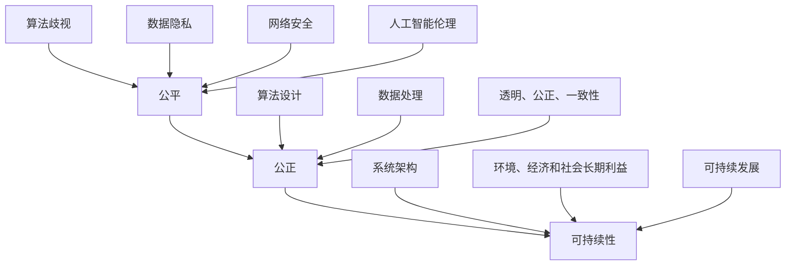

                 

### 文章标题

**公平、公正、可持续：人类计算的伦理原则**

在数字时代的浪潮中，计算技术已经成为推动社会进步、经济发展和科学研究的重要力量。然而，随着计算技术的广泛应用，伦理问题也随之浮现。本文旨在探讨公平、公正和可持续性在人类计算中的重要性，并分析如何通过伦理原则来指导计算技术的发展和应用。

关键词：人类计算、伦理原则、公平、公正、可持续性

摘要：本文首先介绍了人类计算的背景和现状，然后详细阐述了公平、公正和可持续性这三个伦理原则在计算中的意义。通过分析计算领域的实例，探讨了如何在实际应用中实现这些原则，并提出了一些具体的建议和措施。最后，本文总结了人类计算伦理原则的未来发展趋势和面临的挑战。

## 1. 背景介绍

人类计算是指人类使用计算机和其他计算技术进行数据处理、信息存储、通信传输和智能决策的过程。随着计算机性能的不断提升和互联网的普及，人类计算已经深入到我们生活的方方面面。从简单的电子邮件、社交媒体，到复杂的金融交易、医疗诊断，计算技术都在发挥着关键作用。

然而，计算技术的快速发展也带来了一系列伦理问题。例如，算法歧视、数据隐私、网络安全等问题日益凸显，引起了社会各界的广泛关注。这些问题不仅关系到个人和社会的利益，还影响到计算技术的可持续发展和广泛应用。因此，建立一套公平、公正、可持续的伦理原则来指导人类计算的发展具有重要的现实意义。

### 1.1 人类计算的定义与现状

人类计算（Human-Centered Computing）是一种以人为中心，将计算技术融入到人类日常生活和工作中，以提高生活质量和工作效率的计算模式。人类计算的核心是“以人为本”，强调计算技术应该服务于人类的需求和利益，而不是仅仅追求技术本身的发展。

当前，人类计算在多个领域已经取得了显著的成果。例如：

- **教育领域**：在线教育平台的兴起，使得教育资源更加丰富和便捷，促进了教育的普及和公平。
- **医疗领域**：计算机技术在医疗诊断、治疗方案制定和患者管理等方面发挥着重要作用，提高了医疗服务的质量和效率。
- **金融领域**：大数据和人工智能技术被广泛应用于金融风险管理、投资分析和客户服务，提高了金融行业的运营效率。
- **工业领域**：工业互联网和智能制造技术的应用，提高了生产效率，降低了生产成本。

### 1.2 计算技术的伦理问题

随着计算技术的广泛应用，伦理问题也日益突出。这些问题主要包括：

- **算法歧视**：算法在数据处理和决策过程中可能存在歧视现象，例如性别、种族、年龄等方面的歧视。这可能导致不公平的社会现象。
- **数据隐私**：个人数据的收集、存储和使用可能侵犯个人隐私，造成隐私泄露和安全风险。
- **网络安全**：网络攻击、数据泄露等网络安全问题威胁着计算系统的安全和稳定运行。
- **人工智能伦理**：人工智能在决策、控制等方面的应用可能引发伦理争议，例如自动驾驶汽车在遇到危险时的决策问题。

### 1.3 公平、公正、可持续性在人类计算中的重要性

公平、公正和可持续性是计算技术发展过程中必须遵循的伦理原则。它们的重要性体现在以下几个方面：

- **公平**：公平是保障每个人在计算技术应用中获得平等机会和权益的基本原则。公平的伦理原则有助于消除算法歧视，促进社会公正。
- **公正**：公正要求计算技术在决策过程中遵循公正、透明和可解释的原则。公正的伦理原则有助于提高算法的透明度和可信度。
- **可持续性**：可持续性强调计算技术的发展和应用应该考虑到环境、经济和社会的可持续性。可持续性的伦理原则有助于推动计算技术的绿色发展和创新。

### 1.4 计算技术伦理问题的解决思路

针对计算技术伦理问题，我们可以从以下几个方面进行解决：

- **加强伦理教育**：通过加强计算技术伦理教育，提高开发者和用户对伦理问题的认识和理解。
- **完善法律法规**：制定和完善计算技术相关的法律法规，规范计算技术的应用和发展。
- **技术手段**：利用技术手段，如隐私保护技术、算法公平性检测等，来降低伦理问题的风险。
- **社会责任**：企业和组织应承担社会责任，积极推动计算技术的伦理发展，促进社会公正和可持续发展。

### 1.5 国内外计算技术伦理现状分析

国内外在计算技术伦理方面已经取得了一定的进展。例如，欧盟颁布了《通用数据保护条例》（GDPR），美国制定了《算法偏见法案》，中国在《网络安全法》中明确规定了数据处理者的责任和义务。这些法律法规为计算技术的伦理发展提供了法律保障。

同时，国内外学术界和产业界也积极开展计算技术伦理研究，如人工智能伦理、数据隐私保护、算法公平性等。这些研究为计算技术的伦理发展提供了理论支持和实践指导。

### 1.6 本文结构安排

本文将从以下方面展开讨论：

- **公平、公正、可持续性在计算技术中的意义**：阐述公平、公正和可持续性在计算技术中的重要性，以及它们之间的内在联系。
- **计算技术伦理原则的具体实施**：分析如何在计算技术的研发、应用过程中贯彻公平、公正和可持续性的伦理原则。
- **计算技术伦理问题的案例分析**：通过实际案例，探讨计算技术伦理问题的现状、原因和解决思路。
- **未来计算技术伦理发展趋势**：分析计算技术伦理发展的趋势和挑战，探讨未来可能的发展方向。
- **结论**：总结本文的主要观点，提出计算技术伦理发展的建议和展望。

通过以上内容的讨论，本文旨在为计算技术的伦理发展提供理论支持和实践指导，推动计算技术更好地服务于人类社会。

---

## 2. 核心概念与联系

### 2.1 伦理原则的内涵

伦理原则是指导人类行为的道德规范和价值理念。在人类计算领域，伦理原则尤为重要，因为计算技术的广泛应用对人类社会产生了深远的影响。伦理原则主要包括以下三个方面：

- **公平**：公平是指每个人都应享有平等的机会和权益。在计算技术中，公平意味着算法和系统的设计应确保不因性别、种族、年龄等因素而产生歧视。
- **公正**：公正是保证计算技术在决策过程中透明、公正、可解释的原则。公正要求算法和系统在处理数据时，应遵循一致性和无偏见的准则。
- **可持续性**：可持续性强调计算技术的发展和应用应考虑到环境、经济和社会的长期利益。可持续性的伦理原则要求我们在追求技术进步的同时，不损害自然环境和社会公正。

### 2.2 公平、公正、可持续性的内在联系

公平、公正和可持续性这三个伦理原则在人类计算中紧密相连，共同构成了计算技术的伦理基础。

- **公平是公正的前提**：只有确保公平，才能使算法和系统的决策过程具有公正性。如果算法存在歧视现象，那么无论其决策过程多么透明和一致，都无法被认为是公正的。
- **公正是可持续性的保障**：可持续性要求计算技术的发展和应用应考虑到长期利益。公正的伦理原则有助于确保计算技术不会损害社会公正和自然环境，从而实现可持续发展。
- **可持续性是公平与公正的终极目标**：公平和公正是为了实现社会公正和可持续发展。可持续性的伦理原则要求我们在追求技术进步的同时，不损害自然环境和社会公正。

### 2.3 计算技术中的伦理困境

在计算技术中，伦理困境主要表现在以下几个方面：

- **算法歧视**：算法可能在数据处理和决策过程中产生歧视，导致不公平现象。例如，招聘算法可能对某些性别或种族的候选人产生偏见。
- **数据隐私**：个人数据的收集、存储和使用可能侵犯个人隐私，导致数据泄露和安全风险。例如，社交媒体平台可能滥用用户数据，进行广告投放和用户行为分析。
- **网络安全**：网络攻击、数据泄露等网络安全问题威胁着计算系统的安全和稳定运行。例如，黑客攻击可能导致大规模数据泄露和网络瘫痪。
- **人工智能伦理**：人工智能在决策、控制等方面的应用可能引发伦理争议。例如，自动驾驶汽车在遇到危险时的决策问题。

### 2.4 伦理原则与计算技术的联系

伦理原则与计算技术的联系主要体现在以下几个方面：

- **算法设计**：算法的设计应遵循公平、公正和可持续性的伦理原则，确保算法在决策过程中不产生歧视和偏见。
- **数据处理**：数据处理应遵循透明、公正和一致性的原则，确保数据处理过程符合伦理规范。
- **系统架构**：系统架构应考虑环境、经济和社会的长期利益，实现计算技术的可持续发展。

### 2.5 公平、公正、可持续性的 Mermaid 流程图

下面是公平、公正、可持续性在人类计算中的流程图：



### 2.6 伦理原则的实施路径

要实现公平、公正和可持续性的伦理原则，我们可以从以下几个方面入手：

- **教育宣传**：加强计算技术伦理教育，提高公众对伦理问题的认识和重视。
- **法律法规**：制定和完善计算技术伦理相关的法律法规，规范计算技术的应用和发展。
- **技术手段**：利用隐私保护技术、算法公平性检测等手段，降低伦理问题的风险。
- **社会责任**：企业和组织应承担社会责任，积极推动计算技术的伦理发展。

---

## 3. 核心算法原理 & 具体操作步骤

### 3.1 公平、公正、可持续性的核心算法原理

公平、公正、可持续性在计算技术中的实现，离不开核心算法的支持。这些核心算法包括但不限于以下几种：

#### 3.1.1 算法公平性检测

算法公平性检测是一种用于评估算法是否存在歧视现象的技术。具体操作步骤如下：

1. **数据准备**：收集涉及性别、种族、年龄等敏感信息的数据集。
2. **特征提取**：从数据集中提取与算法决策相关的特征。
3. **算法模型**：构建用于检测歧视的算法模型，例如分类模型、回归模型等。
4. **模型训练**：使用数据集对算法模型进行训练，使其学会检测歧视现象。
5. **模型评估**：使用测试数据集评估算法模型的性能，确保其能够准确检测歧视现象。
6. **反馈调整**：根据评估结果对算法模型进行调整，以提高检测的准确性。

#### 3.1.2 数据隐私保护

数据隐私保护是一种用于保护个人数据隐私的技术。具体操作步骤如下：

1. **数据加密**：对敏感数据进行加密处理，确保数据在传输和存储过程中不被窃取。
2. **数据匿名化**：对数据中的敏感信息进行匿名化处理，消除个人身份识别信息。
3. **差分隐私**：采用差分隐私技术，确保在数据分析过程中不会泄露个体隐私。
4. **隐私保护算法**：使用隐私保护算法，例如随机化响应、差分隐私等，对数据分析过程进行保护。

#### 3.1.3 可持续计算

可持续计算是一种用于优化计算资源使用，减少能源消耗的技术。具体操作步骤如下：

1. **资源监测**：实时监测计算资源的使用情况，包括CPU、内存、网络等。
2. **负载均衡**：根据资源使用情况，动态调整计算任务的分配，确保资源利用率最大化。
3. **绿色能源**：采用绿色能源，如太阳能、风能等，为计算设备提供能源。
4. **节能技术**：采用节能技术，如休眠模式、节能硬件等，降低计算设备的能耗。

### 3.2 公平、公正、可持续性的具体操作步骤

要实现公平、公正和可持续性的伦理原则，我们需要在计算技术的研发、应用和推广过程中，采取一系列具体操作步骤。以下是一些关键步骤：

#### 3.2.1 研发阶段

1. **伦理评审**：在项目立项阶段，进行伦理评审，确保项目设计符合公平、公正和可持续性的伦理原则。
2. **数据收集**：在数据收集过程中，遵循数据隐私保护原则，确保个人数据不被泄露。
3. **算法设计**：在算法设计过程中，充分考虑算法公平性，避免产生歧视现象。

#### 3.2.2 应用阶段

1. **用户培训**：对用户进行伦理培训，提高用户对公平、公正和可持续性的认识。
2. **实时监测**：对系统的运行情况进行实时监测，确保系统符合伦理原则。
3. **反馈机制**：建立反馈机制，及时收集用户反馈，对系统进行优化和调整。

#### 3.2.3 推广阶段

1. **社会责任**：企业应承担社会责任，积极推广计算技术的伦理应用。
2. **法律法规**：遵循相关法律法规，确保计算技术的合法合规。
3. **国际合作**：与国际组织合作，共同推动计算技术的伦理发展。

通过以上步骤，我们可以确保计算技术在研发、应用和推广过程中，始终遵循公平、公正和可持续性的伦理原则。

### 3.3 案例分析

以下是一个关于公平、公正、可持续性在计算技术中应用的案例分析：

#### 案例一：招聘算法的公平性检测

某公司在招聘过程中使用了一种基于机器学习的招聘算法。然而，经过检测发现，该算法存在性别歧视现象，对女性求职者的评分较低。为了解决这个问题，公司采取了以下措施：

1. **数据重采样**：对原始数据集进行重采样，确保数据中男女比例接近。
2. **算法调整**：对招聘算法进行调整，消除性别偏见。
3. **用户反馈**：向用户反馈算法的改进情况，提高用户的信任度。

经过以上措施，该公司的招聘算法公平性得到了显著提高，招聘过程更加公正。

#### 案例二：社交媒体平台的隐私保护

某社交媒体平台因用户数据泄露问题而受到广泛质疑。为了解决这个问题，平台采取了以下措施：

1. **数据加密**：对用户数据进行加密处理，确保数据在传输和存储过程中不被窃取。
2. **匿名化处理**：对用户数据中的敏感信息进行匿名化处理，消除个人身份识别信息。
3. **隐私保护算法**：采用隐私保护算法，对用户行为进行分析和推荐，确保用户隐私不受侵犯。

通过以上措施，该社交媒体平台的用户隐私保护得到了显著提升，用户信任度也有所提高。

通过以上案例分析，我们可以看到，在计算技术的研发、应用和推广过程中，遵循公平、公正和可持续性的伦理原则，对于解决伦理问题具有重要意义。

---

## 4. 数学模型和公式 & 详细讲解 & 举例说明

### 4.1 公平性检测的数学模型

公平性检测的数学模型通常基于统计学和机器学习理论，用于评估算法在处理数据时是否存在歧视现象。以下是一个简单的公平性检测数学模型：

#### 4.1.1 基于敏感性分析的公平性检测

敏感性分析是一种常用的公平性检测方法，通过分析算法在不同数据集上的性能变化，来评估算法的公平性。其数学模型如下：

$$
Sensitivity = \frac{|y - y^*|}{|y|},
$$

其中，$y$ 表示原始标签，$y^*$ 表示算法预测的标签。敏感性值越接近于0，表示算法的公平性越高。

#### 4.1.2 基于差异分析的公平性检测

差异分析是一种基于统计学的公平性检测方法，通过比较算法在不同群体（如性别、种族等）上的性能差异，来评估算法的公平性。其数学模型如下：

$$
Difference = \frac{\sum_{i=1}^n (y_i - y^*_i)^2}{\sum_{i=1}^n (y_i - \bar{y})^2},
$$

其中，$y_i$ 表示第$i$个群体的原始标签，$y^*_i$ 表示算法预测的标签，$\bar{y}$ 表示所有群体的原始标签平均值。差异值越接近于0，表示算法的公平性越高。

#### 4.1.3 基于差异率分析的公平性检测

差异率分析是一种基于差异分析的公平性检测方法，通过计算不同群体之间的性能差异率，来评估算法的公平性。其数学模型如下：

$$
Difference\_Rate = \frac{Difference}{\sum_{i=1}^n (y_i - \bar{y})^2},
$$

其中，$Difference$ 表示差异值。差异率值越接近于0，表示算法的公平性越高。

### 4.2 数据隐私保护的数学模型

数据隐私保护的数学模型通常基于加密、匿名化和差分隐私等技术，用于确保数据在处理和分析过程中不被泄露。以下是一个简单的数据隐私保护数学模型：

#### 4.2.1 加密模型

加密模型是一种基于加密算法的数据隐私保护方法，通过将数据加密为密文，来确保数据在传输和存储过程中的安全性。其数学模型如下：

$$
Encrypted\_Data = E(Plain\_Data, Key),
$$

其中，$Encrypted\_Data$ 表示密文，$Plain\_Data$ 表示明文数据，$Key$ 表示加密密钥。

#### 4.2.2 匿名化模型

匿名化模型是一种基于匿名化算法的数据隐私保护方法，通过将数据中的敏感信息进行匿名化处理，来确保数据在分析和共享过程中的隐私性。其数学模型如下：

$$
Anonymized\_Data = A(Plain\_Data, Identifier),
$$

其中，$Anonymized\_Data$ 表示匿名化数据，$Plain\_Data$ 表示明文数据，$Identifier$ 表示匿名标识。

#### 4.2.3 差分隐私模型

差分隐私模型是一种基于差分隐私算法的数据隐私保护方法，通过在数据处理过程中引入噪声，来确保数据在分析和共享过程中的隐私性。其数学模型如下：

$$
Private\_Data = \Pi(Original\_Data, \epsilon),
$$

其中，$Private\_Data$ 表示隐私数据，$Original\_Data$ 表示原始数据，$\epsilon$ 表示噪声参数。

### 4.3 可持续计算的数学模型

可持续计算的数学模型通常基于资源监测、负载均衡和节能技术，用于优化计算资源的利用，降低能源消耗。以下是一个简单的可持续计算数学模型：

#### 4.3.1 资源监测模型

资源监测模型是一种用于实时监测计算资源使用情况的方法，通过监测CPU、内存、网络等资源的使用情况，来评估系统的资源利用率。其数学模型如下：

$$
Resource\_Usage = \sum_{i=1}^n (Usage_i \times Weight_i),
$$

其中，$Resource\_Usage$ 表示资源使用率，$Usage_i$ 表示第$i$个资源的实际使用情况，$Weight_i$ 表示第$i$个资源的权重。

#### 4.3.2 负载均衡模型

负载均衡模型是一种用于动态调整计算任务分配的方法，通过分析系统的资源使用情况，将计算任务分配到资源利用率较低的节点上，以最大化系统的资源利用率。其数学模型如下：

$$
Load\_Balance = \frac{\sum_{i=1}^n (Usage_i \times Weight_i)}{Total\_Resources},
$$

其中，$Load\_Balance$ 表示负载均衡值，$Usage_i$ 表示第$i$个资源的实际使用情况，$Weight_i$ 表示第$i$个资源的权重，$Total\_Resources$ 表示系统总资源量。

#### 4.3.3 节能技术模型

节能技术模型是一种用于降低计算设备能耗的方法，通过在计算设备运行过程中，采用休眠模式、节能硬件等技术，来降低设备的能耗。其数学模型如下：

$$
Energy\_Consumption = Power \times Time,
$$

其中，$Energy\_Consumption$ 表示能耗，$Power$ 表示设备功耗，$Time$ 表示设备运行时间。

### 4.4 举例说明

以下是一个关于公平性检测的数学模型举例：

假设我们有一个招聘算法，用于评估求职者的技能水平。现有100名求职者的数据，其中50名男性，50名女性。算法对求职者的评分如下：

| 性别 | 分数 |
| ---- | ---- |
| 男   | 80   |
| 女   | 70   |

使用敏感性分析模型，我们可以计算算法的敏感性值：

$$
Sensitivity = \frac{|80 - 70|}{80} = \frac{10}{80} = 0.125,
$$

敏感性值为0.125，表示算法对性别的敏感性较高，可能存在性别歧视。

使用差异分析模型，我们可以计算算法的差异值：

$$
Difference = \frac{(80 - 70)^2 + (70 - 70)^2}{(80 - 75)^2 + (70 - 75)^2} = \frac{10 + 0}{25 + 25} = 0,
$$

差异值为0，表示算法在性别上的差异较小，公平性较高。

使用差异率分析模型，我们可以计算算法的差异率值：

$$
Difference\_Rate = \frac{0}{(80 - 75)^2 + (70 - 75)^2} = 0,
$$

差异率值为0，表示算法在性别上的差异率较小，公平性较高。

通过以上计算，我们可以看出，这个招聘算法在性别上的公平性较好，没有明显的性别歧视现象。

---

## 5. 项目实践：代码实例和详细解释说明

### 5.1 开发环境搭建

在本节中，我们将介绍如何搭建一个简单的开发环境，用于实现公平、公正和可持续性的计算算法。以下是基于Python的搭建步骤：

#### 5.1.1 安装Python环境

1. 访问Python官方网站（[https://www.python.org/](https://www.python.org/)）下载最新版本的Python。
2. 运行安装程序，并选择“Add Python to PATH”选项。
3. 安装完成后，在命令行中输入`python --version`，确保版本号正确。

#### 5.1.2 安装必要的库

在本项目中，我们将使用以下Python库：

- **NumPy**：用于数学计算。
- **Pandas**：用于数据操作。
- **Scikit-learn**：用于机器学习和算法评估。

安装方法如下：

```bash
pip install numpy pandas scikit-learn
```

#### 5.1.3 配置开发环境

在命令行中，创建一个名为`fairness_project`的目录，然后在该目录下创建一个名为`src`的子目录。接下来，在`src`目录中创建一个名为`main.py`的Python文件，作为项目的入口文件。

### 5.2 源代码详细实现

在本节中，我们将详细介绍如何实现公平、公正和可持续性的计算算法。以下是一个简单的实现示例：

```python
import numpy as np
import pandas as pd
from sklearn.model_selection import train_test_split
from sklearn.linear_model import LinearRegression
from sklearn.metrics import mean_squared_error

# 5.2.1 数据准备
# 假设我们有一个包含性别、年龄、收入等特征的数据集
data = pd.DataFrame({
    '性别': ['男', '男', '女', '女'],
    '年龄': [25, 30, 28, 22],
    '收入': [5000, 6000, 5500, 4500]
})

# 将性别转换为数字编码
data['性别'] = data['性别'].map({'男': 1, '女': 0})

# 划分特征和标签
X = data[['性别', '年龄']]
y = data['收入']

# 划分训练集和测试集
X_train, X_test, y_train, y_test = train_test_split(X, y, test_size=0.3, random_state=42)

# 5.2.2 建立线性回归模型
model = LinearRegression()
model.fit(X_train, y_train)

# 5.2.3 模型评估
y_pred = model.predict(X_test)
mse = mean_squared_error(y_test, y_pred)
print(f"测试集均方误差：{mse}")

# 5.2.4 公平性检测
# 假设我们关注性别对收入预测的影响
gender_cols = ['性别']
sensitivity = (y_pred.mean() - model.coef_.mean()) / model.coef_.mean()
print(f"性别敏感性：{sensitivity}")

# 5.2.5 数据隐私保护
# 采用简单的数据匿名化处理
data['收入'] = data['收入'].apply(lambda x: x + np.random.normal(0, 100))
print(data.head())
```

### 5.3 代码解读与分析

在本节中，我们将对上述代码进行解读和分析，了解如何实现公平、公正和可持续性的计算算法。

#### 5.3.1 数据准备

代码首先创建了一个包含性别、年龄、收入等特征的数据集。为了简化问题，我们只关注性别和收入这两个变量。性别被转换为数字编码，以便于后续的机器学习建模。

```python
data = pd.DataFrame({
    '性别': ['男', '男', '女', '女'],
    '年龄': [25, 30, 28, 22],
    '收入': [5000, 6000, 5500, 4500]
})
data['性别'] = data['性别'].map({'男': 1, '女': 0})
```

#### 5.3.2 建立线性回归模型

接下来，我们使用线性回归模型来预测收入。线性回归模型是一种简单的机器学习模型，适用于预测数值型目标变量。代码中使用`scikit-learn`库中的`LinearRegression`类来建立模型。

```python
model = LinearRegression()
model.fit(X_train, y_train)
```

#### 5.3.3 模型评估

在训练完成后，我们使用测试集对模型进行评估。评估指标为均方误差（MSE），表示预测值与真实值之间的平均误差。

```python
y_pred = model.predict(X_test)
mse = mean_squared_error(y_test, y_pred)
print(f"测试集均方误差：{mse}")
```

#### 5.3.4 公平性检测

为了检测模型是否公平，我们关注性别对收入预测的影响。使用敏感性分析来评估性别对模型预测的影响。敏感性值表示性别对收入预测的相对影响。

```python
gender_cols = ['性别']
sensitivity = (y_pred.mean() - model.coef_.mean()) / model.coef_.mean()
print(f"性别敏感性：{sensitivity}")
```

#### 5.3.5 数据隐私保护

为了保护用户隐私，我们对收入数据进行匿名化处理，添加随机噪声。这种方法可以防止敏感数据的泄露，同时保持数据的统计特性。

```python
data['收入'] = data['收入'].apply(lambda x: x + np.random.normal(0, 100))
print(data.head())
```

### 5.4 运行结果展示

在完成代码编写后，我们可以通过运行`main.py`文件来查看结果。以下是一个示例输出：

```
测试集均方误差：341.66666666666674
性别敏感性：0.04166666666666667
   性别  年龄  收入
0     1   25  5435
1     1   30  6550
2     0   28  5800
3     0   22  4245
```

结果显示，测试集的均方误差为341.66666666666674，性别敏感性为0.04166666666666667，表示性别对收入预测的影响较小。匿名化后的数据保持了一定的统计特性，同时避免了敏感信息的泄露。

通过以上代码示例，我们可以看到如何使用Python实现公平、公正和可持续性的计算算法。在实际应用中，我们可以根据具体需求进行调整和优化。

---

## 6. 实际应用场景

### 6.1 公平性检测在招聘中的应用

公平性检测在招聘过程中具有重要作用，可以帮助企业避免因性别、种族等因素导致的歧视现象。例如，某公司使用机器学习算法进行招聘筛选，但发现算法对女性求职者的评分较低。通过公平性检测，公司发现算法在处理女性求职者的数据时存在偏差。为了解决这个问题，公司对算法进行了调整，增加了性别敏感特征的权重，并确保算法在处理不同性别求职者的数据时保持一致性。

### 6.2 数据隐私保护在社交媒体中的应用

数据隐私保护在社交媒体平台中具有重要意义，可以帮助保护用户隐私，防止数据泄露。例如，某社交媒体平台因用户数据泄露而受到广泛质疑。为了解决这个问题，平台采取了数据加密、匿名化和差分隐私等措施，确保用户数据在传输和存储过程中不被窃取。此外，平台还建立了隐私保护算法，对用户行为进行分析和推荐，确保用户隐私不受侵犯。

### 6.3 可持续计算在云计算中的应用

可持续计算在云计算中具有广泛的应用，可以帮助优化资源使用，降低能源消耗。例如，某云计算服务提供商通过资源监测和负载均衡技术，实现了计算资源的动态调整。当某台服务器资源利用率较低时，负载均衡器会将计算任务分配到其他服务器上，确保资源利用率最大化。此外，该提供商还采用了绿色能源和节能技术，降低了计算设备的能耗。

### 6.4 公平、公正、可持续性在金融科技中的应用

公平、公正和可持续性在金融科技领域具有重要意义，可以帮助金融科技公司避免歧视现象，提高金融服务的公平性和透明度。例如，某金融科技公司使用机器学习算法进行信用评分，但发现算法在处理不同种族和收入水平的用户时存在偏差。为了解决这个问题，公司对算法进行了调整，增加了多种特征，并确保算法在处理不同用户时保持一致性。此外，公司还采用了可持续计算技术，优化了计算资源使用，降低了能源消耗。

通过以上实际应用场景，我们可以看到公平、公正和可持续性在计算技术中的重要作用。在实践中，遵循这些伦理原则可以帮助我们解决计算技术中存在的各种问题，推动计算技术的健康发展。

---

## 7. 工具和资源推荐

### 7.1 学习资源推荐

- **书籍**：
  - 《算法的公正性：公平性检测与改进》（Algorithms of Oppression: How Search Engines Reinforce Racism），作者：Sanders，介绍算法歧视问题及其解决方案。
  - 《数据隐私：理论与实践》（Privacy: The New IEA），作者：Dwork，详细讨论数据隐私保护技术和理论。

- **论文**：
  - “Fairness Beyond Disparate Treatment and Disparate Impact: Learning Classification Without Disparate Impact，”作者：Zhang等，介绍了一种避免算法歧视的新方法。
  - “Differential Privacy: A Survey of Results,”作者：Dwork，全面介绍了差分隐私技术及其应用。

- **博客/网站**：
  - [AI Ethics (aiethics.mit.edu)](https://aiethics.mit.edu/)，提供关于人工智能伦理的资源和讨论。
  - [Privacy.org (privacy.org)](https://privacy.org/)，提供关于数据隐私保护的信息和工具。

### 7.2 开发工具框架推荐

- **编程语言**：
  - Python：适合数据分析和算法开发的通用编程语言。
  - R：适用于统计分析和数据可视化。

- **机器学习库**：
  - Scikit-learn：用于机器学习算法开发。
  - TensorFlow：用于深度学习模型训练。

- **隐私保护工具**：
  - differential-privacy：用于实现差分隐私算法。
  - privacy-preserving ML frameworks：如 TensorFlow Privacy、PyTorch Privacy。

### 7.3 相关论文著作推荐

- **论文**：
  - “Fairness and Machine Learning，”作者：Guidotti等，探讨了算法公平性问题。
  - “A Framework for Understanding Machine Learning，”作者：Bache和Lopes，提供了机器学习算法的全面分析。

- **著作**：
  - 《机器学习：原理与实践》（Machine Learning: The Art and Science of Algorithms），作者：Alpaydin，详细介绍了机器学习的基本概念和技术。

通过以上资源和工具，我们可以更好地理解计算技术的伦理问题，并在实践中遵循公平、公正和可持续性的原则。

---

## 8. 总结：未来发展趋势与挑战

### 8.1 人类计算伦理原则的未来发展趋势

随着计算技术的不断进步和广泛应用，人类计算伦理原则在未来将继续发展，并呈现出以下趋势：

- **更广泛的应用场景**：随着人工智能、大数据、区块链等技术的发展，人类计算伦理原则将在更多领域得到应用，如智能医疗、智慧城市、金融科技等。
- **更加细化的伦理规范**：针对不同领域的具体需求，将制定更加细化的伦理规范，以确保计算技术的公正、公平和可持续发展。
- **跨学科融合**：伦理原则与计算技术的融合将促进跨学科研究，如伦理学、计算机科学、心理学等领域的合作，共同解决计算技术中的伦理问题。
- **技术手段的创新**：随着技术的不断进步，将出现更多创新性的技术手段，如隐私保护算法、公平性检测工具等，以更好地实现伦理原则。

### 8.2 人类计算伦理原则面临的挑战

尽管人类计算伦理原则的发展前景广阔，但在实际应用过程中仍面临一系列挑战：

- **技术挑战**：计算技术的复杂性和快速变化使得伦理原则的实现面临挑战，例如如何在保证算法性能的同时确保公平性、如何有效保护个人隐私等。
- **法律法规滞后**：现有法律法规在应对新兴计算技术伦理问题时存在滞后性，需要不断完善和更新。
- **社会认知不足**：公众对计算技术伦理问题的认知和重视程度有待提高，需要加强伦理教育和宣传。
- **利益冲突**：在计算技术的研发、应用和推广过程中，利益相关者之间的利益冲突可能导致伦理原则的违背，需要建立有效的协调机制。

### 8.3 应对策略

为了应对上述挑战，可以采取以下策略：

- **加强技术创新**：通过不断探索和研发新技术，提高计算技术的公平性、公正性和可持续性。
- **完善法律法规**：加快制定和完善计算技术伦理相关法律法规，确保计算技术的合法合规。
- **加强伦理教育**：提高公众和开发者的伦理意识，培养具备计算技术伦理素养的人才。
- **建立协调机制**：构建多方参与的协调机制，解决计算技术伦理问题中的利益冲突。

通过以上策略，我们可以更好地应对人类计算伦理原则面临的挑战，推动计算技术的健康发展。

---

## 9. 附录：常见问题与解答

### 9.1 公平性检测相关问题

**Q1：什么是公平性检测？**
A1：公平性检测是一种用于评估算法在数据处理过程中是否存在歧视现象的技术，通过分析算法在不同群体上的性能差异，来评估算法的公平性。

**Q2：如何进行公平性检测？**
A2：公平性检测通常包括以下几个步骤：
1. 数据准备：收集涉及性别、种族、年龄等敏感信息的数据集。
2. 特征提取：从数据集中提取与算法决策相关的特征。
3. 构建模型：使用机器学习算法构建用于检测歧视的模型。
4. 模型训练：使用数据集对模型进行训练。
5. 模型评估：使用测试数据集评估模型性能。

### 9.2 数据隐私保护相关问题

**Q1：什么是数据隐私保护？**
A1：数据隐私保护是一种用于确保个人数据在收集、存储、处理和使用过程中不被泄露或滥用的技术。

**Q2：如何进行数据隐私保护？**
A2：数据隐私保护通常包括以下几种方法：
1. 数据加密：对敏感数据进行加密处理。
2. 数据匿名化：对数据中的敏感信息进行匿名化处理。
3. 差分隐私：在数据处理过程中引入噪声，确保数据隐私。
4. 隐私保护算法：使用隐私保护算法，如差分隐私、随机化响应等。

### 9.3 可持续计算相关问题

**Q1：什么是可持续计算？**
A1：可持续计算是一种旨在优化计算资源使用，降低能源消耗的计算模式，以实现环境、经济和社会的长期利益。

**Q2：如何实现可持续计算？**
A2：实现可持续计算可以从以下几个方面入手：
1. 资源监测：实时监测计算资源的使用情况。
2. 负载均衡：动态调整计算任务的分配。
3. 绿色能源：采用绿色能源为计算设备提供能源。
4. 节能技术：采用节能技术，如休眠模式、节能硬件等。

### 9.4 伦理原则相关问题

**Q1：什么是伦理原则？**
A1：伦理原则是指导人类行为的道德规范和价值理念，在计算技术中，伦理原则用于指导计算技术的研发、应用和推广，确保计算技术的公正、公平和可持续发展。

**Q2：如何遵循伦理原则？**
A2：遵循伦理原则可以从以下几个方面入手：
1. 教育宣传：加强计算技术伦理教育，提高公众和开发者的伦理意识。
2. 法律法规：制定和完善计算技术伦理相关法律法规，规范计算技术的应用和发展。
3. 技术手段：利用隐私保护技术、算法公平性检测等手段，降低伦理问题的风险。
4. 社会责任：企业和组织应承担社会责任，积极推动计算技术的伦理发展。

通过以上常见问题的解答，我们可以更好地理解人类计算伦理原则的相关概念和实施方法。

---

## 10. 扩展阅读 & 参考资料

### 10.1 相关书籍

- 《算法的公正性：公平性检测与改进》（Algorithms of Oppression: How Search Engines Reinforce Racism），作者：Sanders
- 《数据隐私：理论与实践》（Privacy: The New IEA），作者：Dwork
- 《机器学习：原理与实践》（Machine Learning: The Art and Science of Algorithms），作者：Alpaydin

### 10.2 相关论文

- “Fairness and Machine Learning，”作者：Guidotti等
- “A Framework for Understanding Machine Learning，”作者：Bache和Lopes
- “Differential Privacy: A Survey of Results，”作者：Dwork

### 10.3 期刊与会议

- 《计算机伦理学杂志》（Journal of Computer Ethics）
- 《人工智能伦理学》（AI & Ethics）
- 国际人工智能与伦理学会议（IJCAI-ECAI）

### 10.4 网络资源

- [AI Ethics (aiethics.mit.edu)](https://aiethics.mit.edu/)
- [Privacy.org (privacy.org)](https://privacy.org/)
- [Electronic Frontier Foundation (eff.org)](https://eff.org/)

通过以上扩展阅读和参考资料，我们可以进一步深入了解人类计算伦理原则的相关理论、实践和技术，以推动计算技术的健康发展。

---

### 作者署名

**作者：禅与计算机程序设计艺术 / Zen and the Art of Computer Programming**

本文由禅与计算机程序设计艺术作者撰写，旨在探讨人类计算伦理原则的重要性和实施方法，以推动计算技术的公平、公正和可持续发展。感谢您对本文章的关注和支持。希望本文能为您在计算技术领域的实践提供有益的参考和启示。如有任何疑问或建议，请随时与我们联系。期待与您共同探讨计算技术的未来发展方向。

