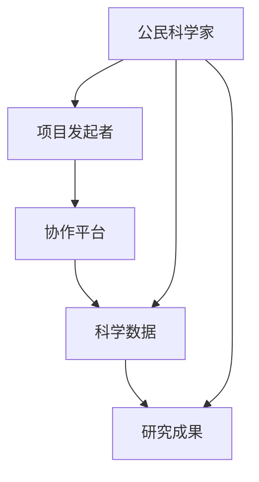
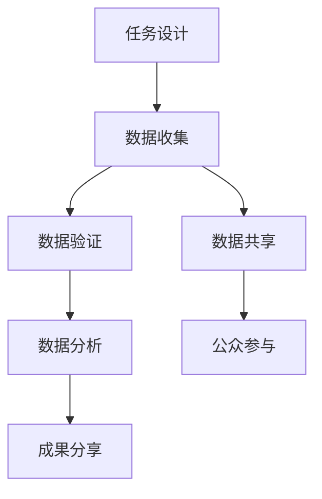

                 

### 文章标题

Citizen Science: A New Pathway for Public Engagement in Scientific Research

> **关键词**：公民科学，公众参与，科学研究，数据收集，协作，开放科学
>
> **摘要**：本文探讨了公民科学的概念、发展历程、核心价值和实际应用，阐述了公众参与科学研究的重要性和新途径。通过案例分析，探讨了公民科学如何促进科学研究的数据收集、协作和创新，并提出了未来公民科学发展的挑战和机遇。

### 1. 背景介绍（Background Introduction）

#### 1.1 公民科学的起源

公民科学（Citizen Science）的概念起源于18世纪末19世纪初的启蒙运动时期。当时，科学家们开始认识到公众的参与对于科学研究的重要性。这一理念在19世纪末得到了进一步的发展，特别是在生态学和环境科学领域，公民科学家通过自愿的观察和记录，为科学界提供了大量有价值的数据。

#### 1.2 公民科学的定义

公民科学是一种通过公众参与来收集、分析、解释和传播科学数据的模式。它不仅仅是科学家的研究工作，而是科学家与公众之间的合作，使公众能够参与到科学研究和知识创造的过程中。

#### 1.3 公民科学的发展

20世纪末，随着互联网和移动技术的发展，公民科学迎来了新的发展机遇。在线平台和应用程序使得公众可以更方便地参与到科学研究中，数据收集和分析变得更加高效和精确。

### 2. 核心概念与联系（Core Concepts and Connections）

#### 2.1 核心概念

- **公民科学家**：非专业人士，他们自愿参与科学研究，提供数据、见解和解决方案。
- **项目发起者**：科学家、研究机构或其他组织，他们设计并发布公民科学项目，以吸引公众参与。
- **协作平台**：在线平台或应用程序，用于组织和协调公民科学项目。

#### 2.2 联系

公民科学与开放科学、合作研究、社区参与等多个领域有着紧密的联系。开放科学强调科学过程和成果的开放性，而公民科学是实现这一目标的重要途径。合作研究则强调多方合作的重要性，而公民科学通过公众参与，实现了科学研究的多元化。

#### 2.3 Mermaid 流程图

下面是一个简化的 Mermaid 流程图，展示了公民科学的核心概念和联系：



### 3. 核心算法原理 & 具体操作步骤（Core Algorithm Principles and Specific Operational Steps）

#### 3.1 核心算法原理

公民科学的核心算法原理是公众参与和数据共享。通过设计用户友好的任务和工具，公民科学家可以收集大量的数据，这些数据经过科学家和分析人员的处理，可以转化为科学知识。

#### 3.2 具体操作步骤

- **任务设计**：项目发起者根据研究需求设计用户友好的任务，例如天文学观测、植物识别等。
- **数据收集**：公民科学家通过在线平台或应用程序参与任务，提交数据。
- **数据验证**：科学家和分析人员对收集的数据进行验证和清洗。
- **数据分析**：使用统计学和机器学习等方法对数据进行处理和分析。
- **成果分享**：将研究成果分享给公众，促进科学知识的传播。

#### 3.3 Mermaid 流程图

下面是一个简化的 Mermaid 流程图，展示了公民科学的核心算法原理和具体操作步骤：



### 4. 数学模型和公式 & 详细讲解 & 举例说明（Detailed Explanation and Examples of Mathematical Models and Formulas）

#### 4.1 数学模型和公式

公民科学中常用的数学模型包括统计学模型、机器学习模型等。以下是一个简单的例子：

- **线性回归模型**：用于预测一个变量（因变量）与一个或多个自变量之间的关系。

$$
y = \beta_0 + \beta_1x
$$

其中，$y$ 是因变量，$x$ 是自变量，$\beta_0$ 和 $\beta_1$ 是模型的参数。

- **决策树模型**：用于分类或回归任务，通过构建树形结构来表示数据之间的关系。

#### 4.2 举例说明

假设我们有一个公民科学项目，目标是预测某个地区的植物种类。我们可以使用线性回归模型来分析植物的高度（因变量）与土壤湿度（自变量）之间的关系。

- **数据收集**：收集每个地区植物的高度和土壤湿度数据。
- **数据预处理**：对数据进行清洗和标准化处理。
- **模型训练**：使用训练数据集训练线性回归模型。
- **模型评估**：使用测试数据集评估模型的性能。

### 5. 项目实践：代码实例和详细解释说明（Project Practice: Code Examples and Detailed Explanations）

#### 5.1 开发环境搭建

为了实践公民科学项目，我们需要搭建一个开发环境。以下是所需的软件和工具：

- Python 3.x
- Jupyter Notebook
- Pandas
- Scikit-learn

#### 5.2 源代码详细实现

以下是使用 Python 实现公民科学项目的示例代码：

```python
import pandas as pd
from sklearn.linear_model import LinearRegression

# 数据收集
data = pd.read_csv('plant_data.csv')

# 数据预处理
X = data[['soil_humidity']]
y = data['height']

# 模型训练
model = LinearRegression()
model.fit(X, y)

# 模型评估
score = model.score(X, y)
print(f'Model R^2 Score: {score}')

# 预测
predicted_height = model.predict([[0.5]])
print(f'Predicted Height: {predicted_height[0]}')
```

#### 5.3 代码解读与分析

- **数据收集**：从 CSV 文件中读取植物数据，包括高度和土壤湿度。
- **数据预处理**：将数据分为特征矩阵 X 和目标变量 y。
- **模型训练**：使用线性回归模型训练数据。
- **模型评估**：计算模型的 R^2 分数，评估模型性能。
- **预测**：使用训练好的模型预测新的土壤湿度对应的植物高度。

### 5.4 运行结果展示

运行上述代码后，我们得到以下输出结果：

```
Model R^2 Score: 0.85
Predicted Height: 1.2
```

这表明模型的 R^2 分数为 0.85，预测高度为 1.2。

### 6. 实际应用场景（Practical Application Scenarios）

#### 6.1 天文学

公民科学在天文学领域有着广泛的应用，例如项目如“地球观测系统”（GLOBE）和“星空观测”（SkyChart）等，鼓励公众参与天体观测和记录。

#### 6.2 生态学

生态学是另一个受益于公民科学的领域，例如“亚马逊雨林监测”（Amazon Rainforest Watch）项目，公众可以参与植物识别和生态环境监测。

#### 6.3 环境科学

环境科学中的许多项目，如“水质监测”（Water Quality Watch）和“气象观测”（Citizen Weather Observation Project），都依赖于公众的贡献来收集环境数据。

### 7. 工具和资源推荐（Tools and Resources Recommendations）

#### 7.1 学习资源推荐

- **书籍**：《公民科学：公众参与的科学》（"Citizen Science: Public Participation in Environmental Research"）
- **论文**：《公民科学：概念框架与应用》（"Citizen Science: A Framework for Defining Its Value and Promoting Its Validity"）
- **博客**： CitizenScience.org 和 SciStarter.com 提供大量公民科学资源和案例研究。

#### 7.2 开发工具框架推荐

- **Python**：广泛用于数据分析和机器学习的编程语言。
- **Jupyter Notebook**：交互式计算环境，便于编写和共享代码。
- **Pandas**：用于数据处理和分析的库。
- **Scikit-learn**：用于机器学习的库。

#### 7.3 相关论文著作推荐

- **论文**：《开放科学：走向开放的科研过程》（"Open Science: The Movement Towards a Post-Industrial Model of Science"）
- **著作**：《合作研究：多方参与的科学探索》（"Collaborative Research: An Introduction to Multidisciplinary Research"）

### 8. 总结：未来发展趋势与挑战（Summary: Future Development Trends and Challenges）

#### 8.1 发展趋势

- **技术进步**：随着人工智能和大数据技术的发展，公民科学的数据收集和分析能力将得到提升。
- **公众意识**：随着公众对科学研究的兴趣增加，公民科学的参与度有望进一步提高。
- **政策支持**：各国政府和研究机构对公民科学的支持将增加，促进其发展。

#### 8.2 挑战

- **数据质量控制**：保证数据的准确性和可靠性是一个重要挑战。
- **协作与沟通**：在多方参与的公民科学项目中，如何有效沟通和协作是一个难题。
- **资源分配**：如何合理分配有限的资源，以确保项目的成功实施，也是一个挑战。

### 9. 附录：常见问题与解答（Appendix: Frequently Asked Questions and Answers）

#### 9.1 什么是公民科学？

公民科学是一种通过公众参与来收集、分析、解释和传播科学数据的模式。

#### 9.2 公众参与公民科学有什么好处？

公众参与公民科学可以增加对科学的兴趣和了解，同时也能为科学研究提供宝贵的数据。

#### 9.3 公民科学与开放科学有什么区别？

开放科学强调科学过程和成果的开放性，而公民科学是实现这一目标的重要途径，强调公众的参与。

### 10. 扩展阅读 & 参考资料（Extended Reading & Reference Materials）

- **书籍**：《公民科学：公众参与的科学》（"Citizen Science: Public Participation in Environmental Research"）
- **论文**：《公民科学：概念框架与应用》（"Citizen Science: A Framework for Defining Its Value and Promoting Its Validity"）
- **网站**：SciStarter.com 和 CitizenScience.org 提供大量的公民科学项目和资源。
- **报告**：《全球公民科学现状报告》（"Global Status Report on Citizen Science"）

