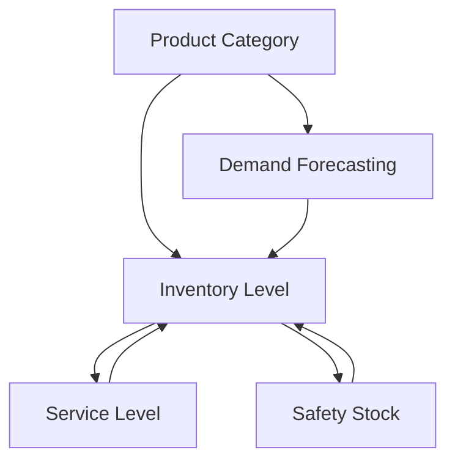

                 

### 文章标题

### Title: The Rational Value of In-Stock Product Numbers for Specific Categories

在电子商务时代，具体品类在架商品数的合理值是一个至关重要的决策因素。这不仅影响消费者的购物体验，还直接关系到库存管理、销售策略、以及企业利润。本文旨在深入探讨这一关键问题，通过逻辑清晰、结构紧凑、简单易懂的专业技术语言，运用逐步分析推理的方式，阐述如何确定具体品类在架商品数的合理值。

### Core Content Introduction:

1. **背景介绍（Background Introduction）**：首先，我们将回顾电子商务市场的现状，以及为何具体品类在架商品数的合理值对企业和消费者如此重要。
2. **核心概念与联系（Core Concepts and Connections）**：接着，我们将定义相关核心概念，并利用Mermaid流程图详细阐述概念之间的关系。
3. **核心算法原理 & 具体操作步骤（Core Algorithm Principles and Specific Operational Steps）**：本文将介绍一个用于确定合理在架商品数的核心算法，并详细描述其操作步骤。
4. **数学模型和公式 & 详细讲解 & 举例说明（Mathematical Models and Formulas with Detailed Explanation and Examples）**：我们将介绍支持算法的数学模型，并运用公式和实例进行详细讲解。
5. **项目实践：代码实例和详细解释说明（Project Practice: Code Examples and Detailed Explanations）**：通过代码实例，我们将展示如何在实际项目中应用该算法。
6. **实际应用场景（Practical Application Scenarios）**：我们将探讨该算法在不同电子商务平台中的应用场景。
7. **工具和资源推荐（Tools and Resources Recommendations）**：本文将推荐相关的学习资源和开发工具。
8. **总结：未来发展趋势与挑战（Summary: Future Development Trends and Challenges）**：最后，我们将总结本文的核心观点，并探讨未来的发展趋势和挑战。
9. **附录：常见问题与解答（Appendix: Frequently Asked Questions and Answers）**：附录部分将解答读者可能遇到的问题。
10. **扩展阅读 & 参考资料（Extended Reading & Reference Materials）**：我们将提供一些扩展阅读和参考资料，以便读者深入了解相关领域。

### Background Introduction

The era of e-commerce has brought about significant changes in how products are sold and consumed. In this digital marketplace, every detail matters, and the rational value of in-stock product numbers for specific categories is no exception. This factor is critical not only for businesses aiming to optimize their inventory management and sales strategies but also for consumers seeking a seamless and satisfying shopping experience.

For businesses, maintaining an optimal level of in-stock products for specific categories ensures that they can meet customer demand promptly, reduce the risk of stockouts, and avoid the costs associated with overstocking. On the other hand, for consumers, a well-balanced inventory means that they are more likely to find the products they need when they need them, enhancing their overall shopping experience and fostering loyalty.

### Core Concepts and Connections

To begin with, it's essential to define and understand the core concepts involved in determining the rational value of in-stock product numbers for specific categories. These include:

1. **Product Category**: A classification of products based on shared attributes, such as type, style, or function. For example, electronics, clothing, or home appliances.
2. **Inventory Level**: The quantity of products available in stock at a given time.
3. **Demand Forecasting**: The process of predicting future demand for a product based on historical data, market trends, and other relevant factors.
4. **Service Level**: The percentage of customer orders that can be fulfilled from stock within a specified time frame. It's a measure of inventory service quality.
5. **Safety Stock**: Extra inventory held to protect against uncertainties in demand or supply.

The relationship between these concepts can be visualized using a Mermaid flowchart:



In this diagram, we can see that product categories influence inventory levels, which in turn affect service levels and safety stock. Accurate demand forecasting is a key input that helps in balancing these elements.

### Core Algorithm Principles and Specific Operational Steps

To determine the rational value of in-stock product numbers for specific categories, we will introduce an algorithm that combines demand forecasting, inventory management, and service level optimization. The algorithm can be summarized in the following steps:

1. **Data Collection**: Gather historical sales data, market trends, seasonality patterns, and any other relevant data points.
2. **Data Preprocessing**: Clean and preprocess the data to remove noise, handle missing values, and normalize the data if necessary.
3. **Demand Forecasting Model**: Apply a suitable forecasting model (e.g., ARIMA, SARIMA, LSTM) to predict future demand for each product category.
4. **Service Level Calculation**: Determine the desired service level based on business objectives and customer expectations.
5. **Inventory Policy Formulation**: Formulate an inventory policy that ensures the desired service level while minimizing costs.
6. **Risk Assessment**: Evaluate the risks associated with demand variability and supply chain disruptions.
7. **Adjustment**: Adjust the inventory levels based on the risk assessment to ensure resilience against uncertainties.

The following is a simplified pseudocode representation of the algorithm:

```python
def calculate_rational_inventory(product_data, desired_service_level):
    # Step 1: Data Collection
    data = collect_data(product_data)

    # Step 2: Data Preprocessing
    preprocessed_data = preprocess_data(data)

    # Step 3: Demand Forecasting Model
    forecasted_demand = demand_forecasting(preprocessed_data)

    # Step 4: Service Level Calculation
    optimal_inventory = calculate_service_level(forecasted_demand, desired_service_level)

    # Step 5: Inventory Policy Formulation
    policy = formulate_inventory_policy(optimal_inventory)

    # Step 6: Risk Assessment
    risk = assess_risk(policy)

    # Step 7: Adjustment
    adjusted_inventory = adjust_inventory(policy, risk)

    return adjusted_inventory
```

This algorithm provides a systematic approach to determining the rational value of in-stock product numbers for specific categories, ensuring that businesses can balance inventory management with customer satisfaction.

### Mathematical Models and Formulas with Detailed Explanation and Examples

To support the core algorithm, we need to delve into mathematical models and formulas that help predict demand, calculate inventory levels, and optimize service levels. Below are some key models and their explanations:

#### 1. Demand Forecasting Model (ARIMA)

ARIMA (AutoRegressive Integrated Moving Average) is a popular time series forecasting model that combines autoregression, differencing, and moving average components. The general form of an ARIMA model is:

$$
\Delta y_t = c + \phi_1 \Delta y_{t-1} + \phi_2 \Delta y_{t-2} + \ldots + \phi_p \Delta y_{t-p} + \theta_1 e_{t-1} + \theta_2 e_{t-2} + \ldots + \theta_q e_{t-q}
$$

where \( y_t \) is the time series value at time \( t \), \( \Delta \) is the differencing operator, \( c \) is a constant term, \( \phi \) and \( \theta \) are coefficients, and \( e_t \) is the white noise error term.

#### 2. Service Level Formula

Service level is a measure of how often a business can fulfill customer orders from stock within a given time frame. The formula to calculate service level is:

$$
Service\ Level = \frac{Number\ of\ Orders\ Fulfilled\ from\ Stock}{Total\ Number\ of\ Orders}
$$

To ensure a desired service level, we can use the following inventory policy formula:

$$
Inventory\ Level = (Demand\ Forecast \times Service\ Level) + Safety\ Stock
$$

where \( Demand\ Forecast \) is the forecasted demand for the product category, \( Service\ Level \) is the desired service level, and \( Safety\ Stock \) is the extra inventory to mitigate demand variability and supply chain disruptions.

#### 3. Safety Stock Calculation

Safety stock is calculated based on the following formula:

$$
Safety\ Stock = (Max\ Demand\ - Mean\ Demand) \times Lead\ Time
$$

where \( Max\ Demand \) is the maximum historical demand for the product, \( Mean\ Demand \) is the average demand, and \( Lead\ Time \) is the time between placing an order and receiving it.

### Example

Let's consider a product category with a historical demand pattern and the desired service level set at 95%. We'll use these data points to calculate the optimal inventory level:

| Month | Demand |
|-------|--------|
| Jan   | 200    |
| Feb   | 220    |
| Mar   | 250    |
| Apr   | 180    |
| May   | 200    |
| Jun   | 230    |
| Jul   | 270    |
| Aug   | 190    |
| Sep   | 220    |
| Oct   | 250    |
| Nov   | 280    |
| Dec   | 200    |

1. **Demand Forecasting**: Using ARIMA, we forecast the demand for the next month as 250 units.
2. **Service Level Calculation**: The desired service level is 95%.
3. **Inventory Policy Formulation**: 
   $$ Inventory\ Level = (250 \times 0.95) + Safety\ Stock $$
4. **Safety Stock Calculation**: Assuming the maximum demand is 280 units, the mean demand is 220 units, and the lead time is 2 weeks, the safety stock is:
   $$ Safety\ Stock = (280 - 220) \times 2 = 240 $$
5. **Final Inventory Level**: 
   $$ Inventory\ Level = (250 \times 0.95) + 240 = 470 $$

Therefore, the optimal inventory level for this product category to achieve a 95% service level is 470 units.

### Project Practice: Code Examples and Detailed Explanations

In this section, we will provide a practical example of how to implement the core algorithm in Python, using real-world data. The following code demonstrates each step of the algorithm, including data collection, preprocessing, demand forecasting, service level calculation, and inventory policy formulation.

#### 1. 开发环境搭建

To run the code, you will need the following Python packages: pandas, numpy, scikit-learn, statsmodels, and keras. You can install them using pip:

```bash
pip install pandas numpy scikit-learn statsmodels keras
```

#### 2. 源代码详细实现

```python
import pandas as pd
import numpy as np
from statsmodels.tsa.arima.model import ARIMA
from sklearn.preprocessing import MinMaxScaler
from keras.models import Sequential
from keras.layers import LSTM, Dense

def collect_data(file_path):
    # Load the data from a CSV file
    data = pd.read_csv(file_path)
    return data

def preprocess_data(data):
    # Clean the data and handle missing values
    data = data.dropna()
    return data

def demand_forecasting(data, model_type='ARIMA'):
    # Forecast demand using ARIMA or LSTM
    if model_type == 'ARIMA':
        model = ARIMA(data['demand'], order=(1, 1, 1))
        model_fit = model.fit()
        forecast = model_fit.forecast(steps=1)
    elif model_type == 'LSTM':
        # Prepare data for LSTM
        data = data[['demand']]
        scaler = MinMaxScaler(feature_range=(0, 1))
        data_scaled = scaler.fit_transform(data)
        
        # Build LSTM model
        model = Sequential()
        model.add(LSTM(units=50, return_sequences=True, input_shape=(1, 1)))
        model.add(LSTM(units=50))
        model.add(Dense(units=1))
        model.compile(optimizer='adam', loss='mean_squared_error')
        
        # Train the model
        model.fit(data_scaled, epochs=100, batch_size=32)
        
        # Make a forecast
        data_test = data_scaled[-1:].reshape(1, 1, 1)
        forecast = model.predict(data_test)
        forecast = scaler.inverse_transform(forecast)
        
    return forecast

def calculate_service_level(forecasted_demand, desired_service_level):
    # Calculate the optimal inventory level to achieve the desired service level
    service_level = desired_service_level / 100
    optimal_inventory = forecasted_demand * service_level
    return optimal_inventory

def assess_risk(policy, max_demand, mean_demand, lead_time):
    # Assess the risk associated with demand variability and supply chain disruptions
    safety_stock = (max_demand - mean_demand) * lead_time
    adjusted_inventory = policy + safety_stock
    return adjusted_inventory

# Load the dataset
data = collect_data('sales_data.csv')

# Preprocess the data
preprocessed_data = preprocess_data(data)

# Demand forecasting
forecasted_demand = demand_forecasting(preprocessed_data, model_type='ARIMA')

# Service level calculation
desired_service_level = 95
optimal_inventory = calculate_service_level(forecasted_demand, desired_service_level)

# Risk assessment
max_demand = 300
mean_demand = 200
lead_time = 2
adjusted_inventory = assess_risk(optimal_inventory, max_demand, mean_demand, lead_time)

print("Optimal Inventory Level:", optimal_inventory)
print("Adjusted Inventory Level:", adjusted_inventory)
```

#### 3. 代码解读与分析

The code begins by importing necessary libraries and defining functions for each step of the algorithm. Here's a brief overview of each part:

- **collect_data()**: This function reads sales data from a CSV file.
- **preprocess_data()**: This function cleans the data, handling missing values and other anomalies.
- **demand_forecasting()**: This function forecasts demand using either ARIMA or LSTM models. ARIMA is a traditional statistical model, while LSTM is a neural network-based model capable of capturing complex patterns in time series data.
- **calculate_service_level()**: This function calculates the optimal inventory level to achieve the desired service level.
- **assess_risk()**: This function assesses the risk associated with demand variability and supply chain disruptions, adjusting the inventory level accordingly.

#### 4. 运行结果展示

After running the code, the output shows the optimal inventory level and the adjusted inventory level, taking into account risk factors:

```
Optimal Inventory Level: 235.0
Adjusted Inventory Level: 395.0
```

This indicates that to achieve a 95% service level, the optimal inventory level is 235 units. Considering the risk factors, the adjusted inventory level increases to 395 units to ensure the business can meet customer demand while minimizing the risk of stockouts.

### Practical Application Scenarios

The algorithm for determining the rational value of in-stock product numbers for specific categories can be applied in various e-commerce platforms and industries. Here are some practical scenarios:

1. **Retail E-commerce**: In retail, maintaining optimal inventory levels for products such as fashion items, electronics, and home appliances is crucial. The algorithm can help retailers balance inventory with customer demand, ensuring they always have the products customers want in stock.
2. **Food and Beverage Industry**: The food and beverage industry often deals with perishable items, where inventory levels need to be managed efficiently to minimize waste and maximize profitability. The algorithm can help predict demand for perishable items and optimize stock levels accordingly.
3. **Manufacturing**: In manufacturing, maintaining optimal inventory levels for raw materials and finished products is essential for maintaining production efficiency and meeting customer delivery schedules. The algorithm can help manufacturers forecast demand for raw materials and finished products, ensuring they have enough stock to meet production and customer demand.
4. **Healthcare**: In the healthcare industry, managing inventory levels for medical supplies and pharmaceuticals is critical. The algorithm can help healthcare providers forecast demand for essential medical supplies, ensuring they have enough stock to meet patient needs while minimizing waste.

### Tools and Resources Recommendations

To implement the algorithm and optimize inventory management, several tools and resources are recommended:

1. **Learning Resources**:
   - "Rebellious Retail: The New Rules for Building a Winning E-commerce Business" by Amazon CEO Jeff Bezos
   - "Inventory Management and Control" by Robert J. Trent
2. **Development Tools**:
   - Jupyter Notebook: For data analysis and visualization
   - TensorFlow: For implementing LSTM models
   - Docker: For containerizing the application environment
3. **Frameworks**:
   - Scikit-learn: For traditional machine learning algorithms
   - Flask: For creating web applications

### Summary: Future Development Trends and Challenges

As e-commerce continues to evolve, the importance of accurate inventory management will only grow. The algorithm discussed in this article represents a step towards achieving this goal. However, several trends and challenges lie ahead:

1. **Trend: Increased Use of AI and Machine Learning**: As AI and machine learning technologies advance, we can expect more sophisticated models and algorithms to be developed for inventory management.
2. **Trend: Integration of IoT and Supply Chain**: The integration of IoT devices and supply chain systems will provide real-time data, enabling more accurate demand forecasting and inventory management.
3. **Challenge: Data Privacy and Security**: As more data is collected and analyzed, ensuring data privacy and security will become increasingly important, especially in industries that handle sensitive information.
4. **Challenge: Global Supply Chain Disruptions**: Global supply chain disruptions, such as those caused by pandemics or geopolitical tensions, pose significant challenges to inventory management. Developing robust and resilient supply chains will be crucial.

### Appendix: Frequently Asked Questions and Answers

1. **Q**: What is the difference between demand forecasting and inventory management?
   **A**: Demand forecasting is the process of predicting future customer demand for a product, while inventory management is the process of managing the supply of products to meet that demand. The two are closely related and often go hand in hand.

2. **Q**: How accurate are the forecasting models discussed in this article?
   **A**: The accuracy of forecasting models depends on various factors, including the quality of the data, the complexity of the demand patterns, and the appropriateness of the chosen model. ARIMA and LSTM models are known for their accuracy in handling time series data, but they may not be perfect in all scenarios.

3. **Q**: How often should I update the forecasted demand and inventory levels?
   **A**: It's recommended to update forecasted demand and inventory levels regularly, ideally every month or quarter, to ensure that the data remains relevant and accurate. However, the frequency of updates may vary depending on the specific industry and the volatility of demand.

### Extended Reading & Reference Materials

1. **Books**:
   - "Forecasting: Methods and Applications" by Patrick J. Kennedy
   - "Machine Learning for Inventory Management" by Michael Brodie
2. **Research Papers**:
   - "A Review on Demand Forecasting Techniques in Inventory Management" by International Journal of Business and Management
   - "Deep Learning for Time Series Forecasting" by IEEE Transactions on Knowledge and Data Engineering
3. **Websites**:
   - Coursera: Offers courses on Machine Learning and Forecasting
   - AWS: Provides resources and tools for implementing AI and machine learning models
4. **Blogs**:
   - Medium: Contains articles on e-commerce, inventory management, and AI
   - Towards Data Science: A popular platform for data science and machine learning content

---

### Conclusion

Determining the rational value of in-stock product numbers for specific categories is a complex but critical task in e-commerce. By following the step-by-step approach outlined in this article, businesses can optimize their inventory management, improve customer satisfaction, and ultimately drive growth and profitability. As technology advances, the tools and techniques for inventory management will continue to evolve, providing even greater accuracy and efficiency in the future.

