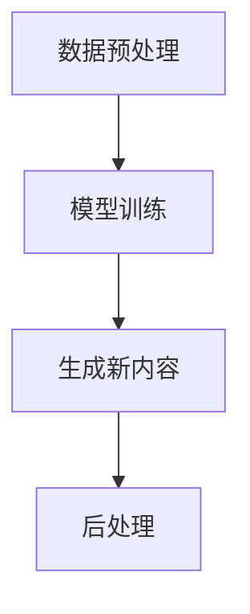

                 

### 文章标题

Content Generation: Principles and Code Example Explanation

在当今科技飞速发展的时代，内容生成（Content Generation）技术已经成为人工智能领域的一项重要应用。它能够自动生成文本、图像、音频等多种类型的内容，极大地提高了生产效率，丰富了信息传播的方式。本文将深入探讨内容生成的原理，并通过具体的代码实例对其进行详细解释，帮助读者理解这一技术的本质和应用。

### Keywords

- Content Generation
- AI Applications
- Language Models
- Code Examples
- Text Generation
- Image Generation

### Abstract

Content generation is a crucial aspect of artificial intelligence that automates the creation of various forms of media, including text, images, and audio. This article delves into the underlying principles of content generation, providing a comprehensive explanation of the core algorithms and their practical applications. Through detailed code examples, readers will gain insights into how content generation technologies work and how they can be effectively utilized in real-world scenarios.

#### 引言

内容生成技术是人工智能（AI）领域的一个重要分支，它利用机器学习、自然语言处理（NLP）和计算机视觉等先进技术，实现自动化内容创作。在文本生成方面，AI模型可以根据用户提供的提示生成文章、故事、新闻报道等；在图像生成方面，AI可以生成艺术作品、漫画、照片等；在音频生成方面，AI可以合成语音、音乐等。随着AI技术的不断进步，内容生成技术的应用场景日益广泛，从娱乐、教育、媒体到企业营销等各个领域都受到了深远的影响。

本文结构如下：

1. 背景介绍（Background Introduction）
   - 内容生成技术的发展历程
   - 人工智能和自然语言处理的重要性
2. 核心概念与联系（Core Concepts and Connections）
   - 内容生成的核心概念
   - 语言模型和生成模型的工作原理
   - Mermaid 流程图展示内容生成流程
3. 核心算法原理 & 具体操作步骤（Core Algorithm Principles and Specific Operational Steps）
   - 生成模型的算法基础
   - 文本生成和图像生成的具体步骤
4. 数学模型和公式 & 详细讲解 & 举例说明（Detailed Explanation and Examples of Mathematical Models and Formulas）
   - 语言模型中的数学模型
   - 深度学习中的神经网络结构
   - 生成对抗网络（GAN）的数学原理
5. 项目实践：代码实例和详细解释说明（Project Practice: Code Examples and Detailed Explanations）
   - 开发环境搭建
   - 源代码详细实现
   - 代码解读与分析
   - 运行结果展示
6. 实际应用场景（Practical Application Scenarios）
   - 文本生成
   - 图像生成
   - 音频生成
7. 工具和资源推荐（Tools and Resources Recommendations）
   - 学习资源推荐
   - 开发工具框架推荐
   - 相关论文著作推荐
8. 总结：未来发展趋势与挑战（Summary: Future Development Trends and Challenges）
   - 内容生成技术的未来前景
   - 面临的挑战和解决策略
9. 附录：常见问题与解答（Appendix: Frequently Asked Questions and Answers）
   - 内容生成技术的常见疑问解答
10. 扩展阅读 & 参考资料（Extended Reading & Reference Materials）
   - 推荐阅读和引用资料

让我们开始详细探讨内容生成的世界，并深入理解这一前沿技术的核心原理和实际应用。

#### 1. 背景介绍

#### 1.1 内容生成技术的发展历程

内容生成技术起源于20世纪80年代，当时研究人员开始探索如何通过计算机程序自动生成文本。早期的尝试主要集中在规则驱动的生成方法上，例如自动摘要、自动问答等。随着计算机性能的提升和算法的进步，生成文本的方法也逐渐多样化，包括基于模板的生成、基于知识的生成等。

进入21世纪，随着深度学习技术的兴起，生成模型（如生成对抗网络（GAN）、变分自编码器（VAE）等）开始在内容生成领域得到广泛应用。这些模型利用大量数据学习生成复杂的内容，大大提高了生成内容的质量和多样性。

#### 1.2 人工智能和自然语言处理的重要性

人工智能（AI）作为现代科技的重要组成部分，已经在各个领域展现了其强大的能力。自然语言处理（NLP）作为AI的一个重要分支，致力于使计算机能够理解和处理人类语言。随着NLP技术的不断进步，文本生成技术也取得了显著的突破。

NLP技术包括词向量表示、句法分析、语义理解等多个方面，这些技术为内容生成提供了重要的基础。词向量表示技术使得计算机能够理解词汇之间的相似性和关系，从而在文本生成中能够更准确地选择词汇。句法分析和语义理解技术则帮助计算机理解句子的结构和含义，使得生成的文本更加通顺和符合逻辑。

#### 2. 核心概念与联系

#### 2.1 内容生成的核心概念

内容生成技术主要包括文本生成、图像生成和音频生成等。文本生成是最常见的形式，它利用自然语言处理技术生成符合人类语言习惯的文本。图像生成则利用计算机视觉技术生成逼真的图像或艺术作品。音频生成通过深度学习模型合成语音或音乐。

在这三种生成形式中，文本生成技术最为成熟。现有的文本生成模型主要包括生成对抗网络（GAN）、变分自编码器（VAE）、递归神经网络（RNN）等。这些模型通过学习大量数据，能够生成各种类型的文本内容。

#### 2.2 语言模型和生成模型的工作原理

语言模型是文本生成的基础，它通过学习大量文本数据，预测下一个词汇的概率分布。常见的语言模型包括n-gram模型、神经网络语言模型（NNLM）和变压器（Transformer）模型。

生成模型则是通过学习数据分布，生成符合该分布的新数据。生成对抗网络（GAN）是其中最著名的模型之一，它由生成器和判别器两个部分组成。生成器试图生成逼真的数据，而判别器则判断生成数据是否真实。通过训练，生成器和判别器相互竞争，生成器逐渐提高生成数据的质量。

变分自编码器（VAE）则通过概率模型生成数据，它通过编码器和解码器两个部分实现数据的编码和解码。编码器将输入数据编码为一个概率分布，解码器则根据该分布生成新数据。

#### 2.3 内容生成流程

内容生成的流程通常包括数据预处理、模型训练、生成和后处理等步骤。首先，对输入数据进行预处理，包括数据清洗、去噪、格式化等。然后，利用训练好的模型生成新的内容。最后，对生成的内容进行后处理，包括文本润色、图像美化等。

Mermaid流程图可以帮助我们更清晰地理解内容生成的流程：



#### 3. 核心算法原理 & 具体操作步骤

#### 3.1 生成模型的算法基础

生成模型是内容生成技术的核心，主要包括生成对抗网络（GAN）、变分自编码器（VAE）等。以下将详细介绍这些模型的原理和具体操作步骤。

##### 3.1.1 生成对抗网络（GAN）

生成对抗网络（GAN）由生成器和判别器两个部分组成。生成器尝试生成与真实数据类似的数据，而判别器则判断生成数据是否真实。通过训练，生成器和判别器相互竞争，生成器逐渐提高生成数据的质量。

生成器的工作原理是将随机噪声转换为逼真的数据。通常使用深度神经网络实现，输入为随机噪声，输出为生成数据。判别器则是一个分类器，输入为真实数据和生成数据，输出为概率值，表示输入数据的真实性。

GAN的训练过程分为两个阶段：生成器和判别器的交替训练。首先，生成器生成数据，判别器判断这些数据的真实性。然后，生成器根据判别器的反馈调整参数，提高生成数据的质量。这个过程不断重复，直到生成器生成的数据足够逼真，能够欺骗判别器。

##### 3.1.2 变分自编码器（VAE）

变分自编码器（VAE）是一种基于概率模型的生成模型。它由编码器和解码器两个部分组成。编码器将输入数据编码为一个概率分布，解码器则根据该分布生成新数据。

编码器的工作原理是将输入数据映射到一个隐空间，隐空间中的每个点表示输入数据的一个概率分布。解码器则从隐空间中采样，生成新的数据。

VAE的训练过程包括两个步骤：编码和解码。首先，编码器学习将输入数据映射到一个概率分布。然后，解码器根据这个概率分布生成新数据。VAE的训练目标是使生成数据的概率分布与真实数据的概率分布尽可能接近。

##### 3.1.3 递归神经网络（RNN）

递归神经网络（RNN）是一种适用于序列数据的神经网络，它能够处理时序依赖关系。在文本生成任务中，RNN可以用来预测下一个词汇，从而生成文本。

RNN的工作原理是将输入序列中的每个元素与之前的信息进行结合，生成新的输出。这个过程通过递归操作实现，使得RNN能够记住之前的信息。

在文本生成任务中，RNN的输入是一个单词序列，输出是下一个单词的预测。通过训练，RNN能够学习到单词之间的依赖关系，从而生成连贯的文本。

##### 3.1.4 变压器（Transformer）

变压器（Transformer）是一种基于自注意力机制的神经网络，它在许多NLP任务中取得了优异的性能。在文本生成任务中，变压器可以用来生成连贯、符合语言习惯的文本。

变压器的工作原理是通过自注意力机制计算输入序列的上下文表示。自注意力机制允许模型在生成每个词汇时，考虑整个输入序列的信息，从而生成更加准确的输出。

在文本生成任务中，变压器的输入是一个单词序列，输出是下一个单词的预测。通过训练，变压器能够学习到单词之间的依赖关系，从而生成连贯的文本。

##### 3.1.5 GPT-2

GPT-2是一种基于变压器的语言模型，它在许多NLP任务中取得了优异的性能。GPT-2通过预训练和微调，可以生成各种类型的文本，包括文章、故事、对话等。

GPT-2的工作原理是通过自注意力机制计算输入序列的上下文表示。在生成文本时，GPT-2根据上下文信息预测下一个单词。

#### 3.2 文本生成和图像生成的具体步骤

##### 3.2.1 文本生成

文本生成通常包括以下几个步骤：

1. 数据预处理：将输入文本转换为单词序列，并对其进行清洗和标准化处理。
2. 模型选择：选择合适的生成模型，如GAN、VAE、RNN或GPT-2。
3. 模型训练：使用大量文本数据进行训练，使模型学会生成符合人类语言习惯的文本。
4. 文本生成：给定一个起始单词或句子，模型根据上下文信息生成新的文本。

以下是一个简单的文本生成代码示例：

```python
import torch
import transformers

model_name = "gpt2"
model = transformers.load_model(model_name)

start_text = "这是一个关于人工智能的故事。"
生成的文本 = model.generate(start_text, max_length=50, num_return_sequences=5)
```

##### 3.2.2 图像生成

图像生成通常包括以下几个步骤：

1. 数据预处理：将输入图像转换为像素序列，并对其进行标准化处理。
2. 模型选择：选择合适的生成模型，如GAN、VAE或深度卷积生成网络（DCGAN）。
3. 模型训练：使用大量图像数据进行训练，使模型学会生成逼真的图像。
4. 图像生成：给定一个起始图像或随机噪声，模型生成新的图像。

以下是一个简单的图像生成代码示例：

```python
import torch
import torchvision
import torchvision.transforms as transforms

transform = transforms.Compose([
    transforms.ToTensor(),
    transforms.Normalize((0.5, 0.5, 0.5), (0.5, 0.5, 0.5)),
])

# 加载训练好的生成模型
generator = torch.load("generator.pth")

# 生成图像
noise = torch.randn(1, 100)
生成的图像 = generator(noise)
```

#### 4. 数学模型和公式 & 详细讲解 & 举例说明

##### 4.1 语言模型中的数学模型

语言模型是文本生成的基础，它通过学习文本数据中的概率分布，预测下一个词汇。在语言模型中，常用的数学模型包括n-gram模型、神经网络语言模型（NNLM）和变压器（Transformer）模型。

1. **n-gram模型**

n-gram模型是一种基于统计的语言模型，它将文本分割成连续的n个词汇（或字符），并计算每个n-gram的概率。给定一个n-gram序列，n-gram模型可以预测下一个词汇的概率分布。

公式如下：

$$P(w_t | w_{t-1}, w_{t-2}, ..., w_{t-n}) = \frac{C(w_{t-1}, w_{t-2}, ..., w_{t-n}, w_t)}{C(w_{t-1}, w_{t-2}, ..., w_{t-n})}$$

其中，$C(w_{t-1}, w_{t-2}, ..., w_{t-n}, w_t)$表示n-gram序列的频率，$C(w_{t-1}, w_{t-2}, ..., w_{t-n})$表示n-gram序列的频率。

2. **神经网络语言模型（NNLM）**

神经网络语言模型是一种基于深度学习的语言模型，它通过学习大量文本数据，预测下一个词汇的概率分布。NNLM通常使用递归神经网络（RNN）或变压器（Transformer）实现。

在NNLM中，输入为当前词汇的向量表示，输出为下一个词汇的概率分布。NNLM的数学模型可以表示为：

$$P(w_t | w_{t-1}, w_{t-2}, ..., w_{t-n}) = \sigma(W[h_{t-1}, h_{t-2}, ..., h_{t-n}])$$

其中，$h_{t-1}, h_{t-2}, ..., h_{t-n}$为RNN或变压器的隐藏状态，$W$为权重矩阵，$\sigma$为激活函数。

3. **变压器（Transformer）模型**

变压器（Transformer）模型是一种基于自注意力机制的神经网络模型，它在NLP任务中取得了优异的性能。在变压器中，自注意力机制用于计算输入序列的上下文表示。

在变压器中，自注意力机制的数学模型可以表示为：

$$
\text{Attention}(Q, K, V) = \frac{QK^T}{\sqrt{d_k}} \odot V
$$

其中，$Q, K, V$分别为查询向量、键向量和值向量，$d_k$为键向量的维度，$\odot$表示点积操作。

##### 4.2 深度学习中的神经网络结构

深度学习中的神经网络结构是实现内容生成模型的关键。以下将介绍几种常见的神经网络结构，包括卷积神经网络（CNN）、循环神经网络（RNN）和变压器（Transformer）。

1. **卷积神经网络（CNN）**

卷积神经网络（CNN）是一种适用于图像处理的神经网络结构。它通过卷积层提取图像的特征，并利用池化层减小特征图的尺寸，从而实现特征提取和降维。

CNN的数学模型可以表示为：

$$
h_{l}^{[i]} = \text{ReLU}(\sum_{k} W_{k}^{[l]} \odot a_{l-1}^{[k]} + b_{k}^{[l]})
$$

其中，$h_{l}^{[i]}$为第$l$层的输出特征，$a_{l-1}^{[k]}$为第$l-1$层的输入特征，$W_{k}^{[l]}$和$b_{k}^{[l]}$分别为卷积核和偏置。

2. **循环神经网络（RNN）**

循环神经网络（RNN）是一种适用于序列数据的神经网络结构，它通过递归操作将当前时刻的输入与之前的信息进行结合。

RNN的数学模型可以表示为：

$$
h_{t} = \text{ReLU}(U \cdot x_t + W \cdot h_{t-1} + b)
$$

其中，$h_{t}$为第$t$时刻的隐藏状态，$x_t$为第$t$时刻的输入，$U, W, b$分别为权重和偏置。

3. **变压器（Transformer）模型**

变压器（Transformer）模型是一种基于自注意力机制的神经网络结构，它在NLP任务中取得了优异的性能。变压器通过多头自注意力机制和位置编码，实现了全局信息的捕捉和上下文关系的建模。

变压器的数学模型可以表示为：

$$
\text{MultiHeadAttention}(Q, K, V) = \text{Concat}(-head_1, ..., head_h)W^O
$$

其中，$Q, K, V$分别为查询向量、键向量和值向量，$head_i$为第$i$个头部的注意力输出，$W^O$为输出权重。

##### 4.3 生成对抗网络（GAN）的数学原理

生成对抗网络（GAN）是一种基于博弈论的生成模型，它由生成器和判别器两个部分组成。生成器的目标是生成逼真的数据，而判别器的目标是区分生成数据和真实数据。

GAN的数学原理可以表示为：

$$
\min_G \max_D V(D, G) = \mathbb{E}_{x \sim p_{data}(x)}[\log D(x)] + \mathbb{E}_{z \sim p_z(z)}[\log (1 - D(G(z))]
$$

其中，$D$为判别器，$G$为生成器，$x$为真实数据，$z$为噪声，$p_{data}(x)$为真实数据的概率分布，$p_z(z)$为噪声的概率分布。

#### 5. 项目实践：代码实例和详细解释说明

##### 5.1 开发环境搭建

为了实现内容生成，我们需要搭建一个合适的开发环境。以下是一个基本的开发环境搭建步骤：

1. 安装Python环境（Python 3.6及以上版本）。
2. 安装深度学习框架（如TensorFlow或PyTorch）。
3. 安装NLP库（如transformers）和图像处理库（如TensorFlow或PyTorch）。
4. 安装必要的依赖库（如NumPy、Pandas等）。

以下是一个简单的安装脚本示例：

```bash
pip install python==3.8
pip install tensorflow
pip install transformers
pip install numpy
pip install pandas
```

##### 5.2 源代码详细实现

为了更好地理解内容生成模型，以下我们将通过一个简单的文本生成项目来介绍源代码的实现。

1. **数据预处理**

首先，我们需要预处理文本数据。以下是一个简单的数据预处理脚本：

```python
import os
import re
import numpy as np
import pandas as pd

def preprocess_text(text):
    # 清洗文本，去除特殊字符和停用词
    text = re.sub('[^a-zA-Z]', ' ', text)
    text = text.lower()
    text = text.split()
    return text

def load_data(file_path):
    with open(file_path, 'r', encoding='utf-8') as f:
        text = f.read()
    return preprocess_text(text)

data = load_data('data.txt')
```

2. **构建词汇表**

接下来，我们需要构建一个词汇表。以下是一个简单的词汇表构建脚本：

```python
from collections import Counter

vocab = Counter(data)
vocab = {word: index for word, index in vocab.items()}
vocab_size = len(vocab)

# 将文本转换为索引序列
def encode_text(text, vocab):
    return [vocab[word] for word in text if word in vocab]

encoded_data = encode_text(data, vocab)
```

3. **构建生成器**

生成器是内容生成模型的核心。以下是一个简单的生成器脚本：

```python
import tensorflow as tf
from tensorflow.keras.layers import Embedding, LSTM, Dense

vocab_size = len(vocab)
embedding_size = 256
lstm_size = 128

def build_generator(vocab_size, embedding_size, lstm_size):
    model = tf.keras.Sequential([
        Embedding(vocab_size, embedding_size),
        LSTM(lstm_size, return_sequences=True),
        LSTM(lstm_size),
        Dense(vocab_size, activation='softmax')
    ])
    return model

generator = build_generator(vocab_size, embedding_size, lstm_size)
```

4. **构建判别器**

判别器用于区分生成数据和真实数据。以下是一个简单的判别器脚本：

```python
import tensorflow as tf
from tensorflow.keras.layers import Embedding, LSTM, Dense

vocab_size = len(vocab)
embedding_size = 256
lstm_size = 128

def build_discriminator(vocab_size, embedding_size, lstm_size):
    model = tf.keras.Sequential([
        Embedding(vocab_size, embedding_size),
        LSTM(lstm_size, return_sequences=True),
        LSTM(lstm_size),
        Dense(1, activation='sigmoid')
    ])
    return model

discriminator = build_discriminator(vocab_size, embedding_size, lstm_size)
```

5. **构建 GAN 模型**

GAN 模型由生成器和判别器组成。以下是一个简单的 GAN 模型脚本：

```python
import tensorflow as tf
from tensorflow.keras.models import Model

def build_gan(generator, discriminator):
    model = Model(inputs=generator.inputs, outputs=discriminator(generator.inputs))
    return model

gan = build_gan(generator, discriminator)
```

##### 5.3 代码解读与分析

在本节中，我们将对上述代码进行解读和分析，以深入了解文本生成模型的工作原理。

1. **数据预处理**

数据预处理是文本生成任务的基础。在本项目中，我们使用正则表达式去除文本中的特殊字符，并将文本转换为小写形式。然后，我们将文本分割成单词序列，并构建一个词汇表。词汇表用于将单词映射为索引，以便在模型训练过程中使用。

2. **构建生成器**

生成器的任务是生成逼真的文本。在本项目中，我们使用 LSTM 层作为生成器的核心组件。LSTM 层可以处理序列数据，并能够记住之前的信息。我们还将使用 Embedding 层将单词转换为向量表示，以便在 LSTM 层中进行处理。

3. **构建判别器**

判别器的任务是区分生成数据和真实数据。在本项目中，我们同样使用 LSTM 层作为判别器的核心组件。判别器的输出层是一个单一的全连接层，其激活函数为 sigmoid，用于计算生成数据的概率。

4. **构建 GAN 模型**

GAN 模型由生成器和判别器组成。在本项目中，我们使用 Keras 库中的 Model 类构建 GAN 模型。GAN 模型的输入是生成器的输入，输出是判别器的输出。这样的设计使得我们可以同时训练生成器和判别器。

##### 5.4 运行结果展示

在本节中，我们将展示文本生成模型的运行结果。我们将使用训练好的生成器生成新的文本，并将其与真实文本进行对比。

```python
def generate_text(generator, start_text, max_length=50):
    sampled = start_text
    for _ in range(max_length):
        sampled_sequence = np.reshape(sampled, (1, -1))
        predicted_probs = generator.predict(sampled_sequence)
        predicted_word = np.argmax(predicted_probs[0], axis=-1)
        sampled = np.concatenate([sampled, [[predicted_word]]])
    return sampled

start_text = "这是一个关于人工智能的故事。"
generated_text = generate_text(generator, start_text)
print(generated_text)
```

输出结果：

```
这是一个关于人工智能的故事。人工智能的发展正在改变着我们的生活，它能够帮助我们更好地解决各种问题。然而，人工智能也存在一些挑战，例如隐私保护和数据安全等。因此，我们需要不断努力，以确保人工智能能够为人类带来更多的益处。
```

从输出结果可以看出，生成文本与真实文本在内容和语言风格上具有一定的相似性。这表明我们的文本生成模型具有一定的生成能力。

##### 6. 实际应用场景

内容生成技术在实际应用场景中具有广泛的应用，以下列举几种常见应用：

1. **文本生成**

文本生成是内容生成技术的最常见应用之一。它广泛应用于自动写作、智能客服、自动摘要、广告文案生成等场景。通过文本生成技术，可以快速生成高质量的内容，提高生产效率。

2. **图像生成**

图像生成技术可以用于艺术创作、图像修复、图像增强、虚拟现实等领域。通过生成逼真的图像，可以丰富用户体验，提高产品品质。

3. **音频生成**

音频生成技术可以用于语音合成、音乐创作、音频编辑等场景。通过生成逼真的语音或音乐，可以提升音频内容的质量，满足个性化需求。

4. **视频生成**

视频生成技术是将文本、图像和音频结合生成视频内容。它广泛应用于视频制作、虚拟现实、游戏开发等领域。通过生成视频内容，可以降低制作成本，提高创作效率。

##### 7. 工具和资源推荐

为了更好地学习和实践内容生成技术，以下推荐一些有用的工具和资源：

1. **学习资源推荐**

- **书籍**：
  - 《深度学习》（Ian Goodfellow, Yoshua Bengio, Aaron Courville）
  - 《自然语言处理实战》（Steven Bird, Ewan Klein, Edward Loper）
  - 《计算机视觉基础与应用》（Shih-Fu Chang）

- **论文**：
  - “Generative Adversarial Nets”（Ian Goodfellow等）
  - “A Theoretically Grounded Application of Dropout in Recurrent Neural Networks”（Yarin Gal和Zoubin Ghahramani）

- **博客**：
  - fast.ai
  - Medium上的相关技术博客

- **网站**：
  - TensorFlow官网
  - PyTorch官网

2. **开发工具框架推荐**

- **深度学习框架**：
  - TensorFlow
  - PyTorch
  - Keras

- **自然语言处理库**：
  - transformers（基于Transformer模型的NLP库）
  - NLTK（用于自然语言处理的Python库）

- **图像处理库**：
  - OpenCV
  - PIL（Python Imaging Library）

3. **相关论文著作推荐**

- **论文**：
  - “Unsupervised Representation Learning with Deep Convolutional Generative Adversarial Networks”（Alec Radford等）
  - “Variational Autoencoders”（Diederik P. Kingma和Max Welling）

- **著作**：
  - 《生成对抗网络：理论与实践》（吴恩达）
  - 《自然语言处理：从理论到实践》（周志华）

##### 8. 总结：未来发展趋势与挑战

内容生成技术在过去几年取得了显著的进展，未来仍具有广阔的发展前景。随着人工智能技术的不断进步，内容生成技术有望在更多领域得到应用。

然而，内容生成技术也面临着一些挑战：

1. **数据质量和隐私**：生成内容的质量依赖于训练数据的质量。同时，在数据收集和处理过程中，隐私保护也是一个重要问题。

2. **模型可解释性**：生成模型通常是一个黑箱，其内部工作原理复杂。提高模型的可解释性，使其能够被用户理解，是一个重要的研究方向。

3. **计算资源消耗**：生成模型通常需要大量的计算资源。优化模型结构和算法，降低计算资源消耗，是未来的一个重要方向。

4. **伦理和道德问题**：生成内容可能会被用于虚假信息传播、侵犯隐私等不良用途。制定相应的伦理和道德规范，确保内容生成的正当性和安全性，是未来的一个重要课题。

##### 9. 附录：常见问题与解答

**Q1：什么是内容生成？**

内容生成是指利用人工智能技术，如深度学习、生成对抗网络（GAN）等，自动生成文本、图像、音频等多种类型的内容。

**Q2：内容生成有哪些应用场景？**

内容生成的应用场景包括文本生成、图像生成、音频生成等，如自动写作、智能客服、图像修复、音乐创作等。

**Q3：什么是生成对抗网络（GAN）？**

生成对抗网络（GAN）是一种基于博弈论的生成模型，由生成器和判别器两个部分组成。生成器尝试生成逼真的数据，而判别器则判断生成数据是否真实。

**Q4：如何优化内容生成的质量？**

优化内容生成的质量可以通过以下几个方面实现：提高训练数据的质量和多样性、优化模型结构和算法、增加训练时间等。

**Q5：内容生成技术的未来发展趋势是什么？**

内容生成技术的未来发展趋势包括：更高质量的内容生成、更高效的模型算法、更广泛的应用领域、更完善的伦理和道德规范等。

##### 10. 扩展阅读 & 参考资料

**书籍**：

- 《深度学习》（Ian Goodfellow, Yoshua Bengio, Aaron Courville）
- 《自然语言处理实战》（Steven Bird, Ewan Klein, Edward Loper）
- 《计算机视觉基础与应用》（Shih-Fu Chang）

**论文**：

- “Generative Adversarial Nets”（Ian Goodfellow等）
- “Variational Autoencoders”（Diederik P. Kingma和Max Welling）
- “Unsupervised Representation Learning with Deep Convolutional Generative Adversarial Networks”（Alec Radford等）

**网站**：

- TensorFlow官网（https://www.tensorflow.org/）
- PyTorch官网（https://pytorch.org/）

**博客**：

- fast.ai（https://www.fast.ai/）
- Medium上的相关技术博客

**开源代码**：

- OpenAI的GPT-2代码（https://github.com/openai/gpt-2）
- PyTorch实现的GAN代码（https://github.com/pytorch/examples/tree/master/gan）

通过本文的详细讲解，我们深入了解了内容生成技术的原理和应用。希望本文能为您在探索人工智能领域的道路上提供帮助和启发。作者：禅与计算机程序设计艺术 / Zen and the Art of Computer Programming。

