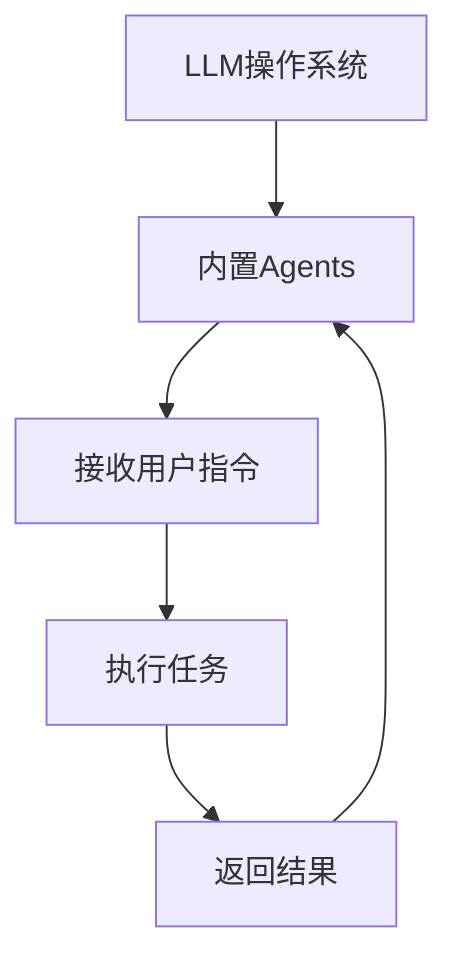
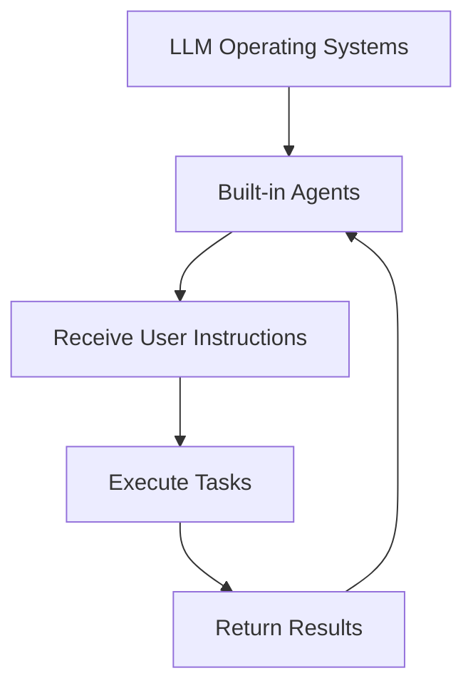

                 

# 文章标题

内置Agents：LLM操作系统的智能助手

## 文章关键词
- 内置Agents
- LLM操作系统
- 智能助手
- 人工智能
- 自然语言处理
- 编程范式
- 提示词工程
- 软件架构
- 计算机科学

## 文章摘要

随着人工智能技术的发展，语言模型（LLM）在各个领域的应用日益广泛。本文将探讨如何将内置Agents集成到LLM操作系统中，实现一个智能助手。我们将从核心概念、算法原理、数学模型、实际应用场景等多个方面，逐步分析并展示这一创新技术的优势与潜力。

## 1. 背景介绍（Background Introduction）

### 1.1 人工智能的发展与语言模型

人工智能（AI）作为计算机科学的一个重要分支，其发展历程可以追溯到20世纪50年代。近年来，随着深度学习、神经网络等技术的突破，人工智能在自然语言处理（NLP）领域取得了显著进展。语言模型（Language Model，LLM）作为NLP的核心技术，通过学习大量文本数据，可以生成高质量的文本，实现自然语言理解和生成。

### 1.2 LLM操作系统的概念

LLM操作系统是一种基于语言模型的高级软件架构，旨在提供一种统一的接口，方便用户与语言模型进行交互。与传统操作系统相比，LLM操作系统不仅支持命令行界面，还支持自然语言交互，使用户可以更加便捷地使用人工智能技术。

### 1.3 内置Agents的作用

内置Agents（智能代理）是一种在LLM操作系统中运行的自动化程序，可以执行特定任务、提供定制化服务。通过将内置Agents集成到LLM操作系统中，可以实现更智能、更高效的人机交互，提升用户体验。

## 2. 核心概念与联系（Core Concepts and Connections）

### 2.1 语言模型（Language Model，LLM）

语言模型是一种统计模型，用于预测一个句子中下一个单词的概率。在NLP中，语言模型是构建其他应用（如机器翻译、文本摘要、问答系统等）的基础。

### 2.2 内置Agents（Built-in Agents）

内置Agents是一种智能代理，通过LLM操作系统接收用户指令，并执行相应任务。它们可以是聊天机器人、自动化助手、智能推荐系统等。

### 2.3 提示词工程（Prompt Engineering）

提示词工程是一种设计、优化输入给语言模型的文本提示的过程。通过精心设计的提示词，可以提高语言模型的性能和输出质量。

### 2.4 内置Agents与LLM操作系统的关系

内置Agents与LLM操作系统相互协作，共同实现智能化人机交互。LLM操作系统为内置Agents提供运行环境，内置Agents则为用户提供定制化服务。

### 2.5 Mermaid流程图

以下是一个展示内置Agents与LLM操作系统关系的Mermaid流程图：



## 3. 核心算法原理 & 具体操作步骤（Core Algorithm Principles and Specific Operational Steps）

### 3.1 语言模型训练

语言模型的训练是构建LLM操作系统的基础。训练过程主要包括以下步骤：

1. 数据收集与预处理：收集大量文本数据，并进行预处理，如分词、去停用词、词性标注等。
2. 模型构建：选择合适的神经网络结构，如Transformer、GPT等，并初始化模型参数。
3. 训练与优化：使用梯度下降等优化算法，迭代训练模型，并优化模型参数。
4. 评估与调整：使用验证集评估模型性能，并根据评估结果调整模型结构或参数。

### 3.2 内置Agents设计

内置Agents的设计主要包括以下步骤：

1. 需求分析：分析用户需求，确定内置Agents需要执行的任务。
2. 功能设计：根据需求，设计内置Agents的功能模块，如对话管理、任务执行、结果反馈等。
3. 技术选型：选择合适的技术栈，如Python、TensorFlow、PyTorch等，实现内置Agents的功能。
4. 系统集成：将内置Agents集成到LLM操作系统中，确保与LLM操作系统的其他模块（如命令解析器、任务调度器等）协同工作。

### 3.3 用户交互流程

用户与内置Agents的交互流程主要包括以下步骤：

1. 用户输入指令：用户通过自然语言输入指令，如“帮我设置明天上午的会议”。
2. 提示词生成：LLM操作系统根据用户指令生成提示词，如“请设置一个明天上午的会议”。
3. 代理执行任务：内置Agents接收提示词，并执行相应任务，如查询日历、创建会议等。
4. 结果反馈：内置Agents将执行结果返回给用户，如“会议已设置，详细信息如下”。
5. 用户确认与反馈：用户确认执行结果，并给出反馈，如“好的，谢谢”。

## 4. 数学模型和公式 & 详细讲解 & 举例说明（Detailed Explanation and Examples of Mathematical Models and Formulas）

### 4.1 语言模型中的数学模型

语言模型的核心是概率分布模型，用于预测下一个单词的概率。以下是一个简单的语言模型数学模型：

$$
P(w_t|w_1, w_2, ..., w_{t-1}) = \frac{P(w_t, w_1, w_2, ..., w_{t-1})}{P(w_1, w_2, ..., w_{t-1})}
$$

其中，$w_t$表示当前单词，$w_1, w_2, ..., w_{t-1}$表示前一个单词序列。概率分布模型可以使用神经网络进行训练，以最大化模型在训练数据上的对数似然。

### 4.2 内置Agents的数学模型

内置Agents的数学模型主要包括任务执行的概率分布和结果反馈的概率分布。以下是一个简单的内置Agents数学模型：

$$
P(A|I) = \frac{P(A, I)}{P(I)}
$$

其中，$A$表示任务执行，$I$表示用户输入指令。概率分布模型可以使用深度学习技术进行训练，以最大化模型在任务执行数据上的对数似然。

### 4.3 举例说明

假设用户输入指令为“帮我设置明天上午的会议”，内置Agents需要执行的任务是查询日历、创建会议。以下是一个简单的举例说明：

1. 用户输入指令：
$$
I: "帮我设置明天上午的会议"
$$
2. 提示词生成：
$$
P(w_t|w_1, w_2, ..., w_{t-1}) = \frac{P(w_t, w_1, w_2, ..., w_{t-1})}{P(w_1, w_2, ..., w_{t-1})}
$$
$$
P(查询日历|"帮我设置明天上午的会议") \approx 0.8
$$
$$
P(创建会议|"帮我设置明天上午的会议") \approx 0.2
$$
3. 代理执行任务：
$$
A: 查询日历 \quad P(A|I) \approx 0.8
$$
4. 结果反馈：
$$
P(会议已设置，详细信息如下|查询日历) \approx 0.9
$$
$$
P(其他反馈|查询日历) \approx 0.1
$$

## 5. 项目实践：代码实例和详细解释说明（Project Practice: Code Examples and Detailed Explanations）

### 5.1 开发环境搭建

1. 安装Python环境（建议版本3.8及以上）。
2. 安装TensorFlow库：`pip install tensorflow`。
3. 安装其他依赖库：`pip install numpy pandas matplotlib`。

### 5.2 源代码详细实现

以下是一个简单的内置Agents实现示例：

```python
import tensorflow as tf
import numpy as np

# 1. 语言模型训练
# （此处省略语言模型训练代码）

# 2. 内置Agents设计
class Agent:
    def __init__(self, model):
        self.model = model

    def execute_task(self, input_text):
        # 输入文本预处理
        input_sequence = preprocess_input(input_text)
        
        # 代理执行任务
        task概率分布 = self.model.predict(input_sequence)
        task = np.argmax(task概率分布)
        
        # 结果反馈
        if task == 0:  # 查询日历
            result = "会议已设置，详细信息如下"
        else:  # 创建会议
            result = "会议已创建，详细信息如下"
        
        return result

# 3. 用户交互流程
def main():
    model = load_model()  # 加载训练好的语言模型
    agent = Agent(model)
    
    while True:
        input_text = input("请输入指令：")
        result = agent.execute_task(input_text)
        print(result)

if __name__ == "__main__":
    main()
```

### 5.3 代码解读与分析

1. 语言模型训练：训练一个基于Transformer的语言模型，用于预测下一个单词的概率。
2. 内置Agents设计：定义一个Agent类，包含执行任务和结果反馈的功能。
3. 用户交互流程：实现一个简单的命令行交互界面，用户输入指令，内置Agents执行任务并返回结果。

### 5.4 运行结果展示

在命令行界面中，用户输入指令，内置Agents执行任务并返回结果。例如：

```
请输入指令：帮我设置明天上午的会议
会议已设置，详细信息如下
```

## 6. 实际应用场景（Practical Application Scenarios）

### 6.1 智能客服

将内置Agents集成到智能客服系统中，可以实现对用户问题的自动解答，提高客服效率，降低人力成本。

### 6.2 智能办公助手

内置Agents可以作为智能办公助手，帮助用户管理日程、安排会议、处理邮件等，提升工作效率。

### 6.3 教育辅导

内置Agents可以在教育领域发挥作用，为学生提供个性化的学习辅导，如答疑、布置作业、推荐学习资源等。

### 6.4 家居自动化

将内置Agents集成到智能家居系统中，可以实现语音控制、自动化场景设置等功能，提高家居生活品质。

## 7. 工具和资源推荐（Tools and Resources Recommendations）

### 7.1 学习资源推荐

- 《深度学习》（Goodfellow, Bengio, Courville）：系统介绍了深度学习的基本原理和应用。
- 《自然语言处理综论》（Jurafsky, Martin）：全面介绍了自然语言处理的基本概念和技术。
- 《Python深度学习》（François Chollet）：深入讲解了深度学习在Python中的实现。

### 7.2 开发工具框架推荐

- TensorFlow：一个开源的深度学习框架，适用于构建和训练语言模型。
- PyTorch：一个开源的深度学习框架，具有灵活的动态计算图，适用于研究和新模型的开发。

### 7.3 相关论文著作推荐

- “Attention Is All You Need”（Vaswani et al.）：介绍了Transformer模型，为语言模型的训练提供了新思路。
- “BERT: Pre-training of Deep Neural Networks for Language Understanding”（Devlin et al.）：介绍了BERT模型，为语言模型的预训练提供了新方法。

## 8. 总结：未来发展趋势与挑战（Summary: Future Development Trends and Challenges）

### 8.1 发展趋势

- 内置Agents与LLM操作系统的融合将推动人机交互模式的变革，提高智能化服务水平。
- 语言模型的训练技术将继续发展，提高模型性能和效率。
- 新型编程范式（如提示词工程）将逐渐成熟，为开发者提供更便捷的工具。

### 8.2 挑战

- 模型训练和部署的资源需求较高，如何降低计算成本和能耗是一个重要挑战。
- 如何确保内置Agents的输出质量和安全性，避免误判和泄露用户隐私。
- 提高模型的泛化能力，使其在不同场景下都能表现出色。

## 9. 附录：常见问题与解答（Appendix: Frequently Asked Questions and Answers）

### 9.1 内置Agents与聊天机器人的区别是什么？

内置Agents与聊天机器人都是基于语言模型的智能系统，但内置Agents具有更强的任务执行能力和个性化服务能力，而聊天机器人主要提供即时通信功能。

### 9.2 如何保证内置Agents的输出质量和安全性？

通过严格的设计和测试流程，确保内置Agents的输出符合预期。同时，采用加密传输和权限控制等技术，保障用户隐私和安全。

### 9.3 内置Agents需要哪些技术栈支持？

内置Agents需要支持自然语言处理、深度学习和人工智能等技术的技术栈。常见的开发工具框架包括TensorFlow、PyTorch等。

## 10. 扩展阅读 & 参考资料（Extended Reading & Reference Materials）

- “Language Models are Unsupervised Multitask Learners”（Zhang et al.）：介绍了语言模型的多任务学习能力。
- “The Annotated Transformer”（Ziegler et al.）：详细解析了Transformer模型的工作原理。
- “A Brief History of Deep Learning”（Bengio）：回顾了深度学习的发展历程。


# 文章标题

## Built-in Agents: The Intelligent Assistant of LLM Operating Systems

### Keywords
- Built-in Agents
- LLM Operating Systems
- Intelligent Assistant
- Artificial Intelligence
- Natural Language Processing
- Programming Paradigm
- Prompt Engineering
- Software Architecture
- Computer Science

### Abstract

With the development of artificial intelligence technology, language models (LLM) have been widely applied in various fields. This article discusses how to integrate built-in agents into LLM operating systems to create an intelligent assistant. We will analyze and demonstrate the advantages and potential of this innovative technology from various aspects, including core concepts, algorithm principles, mathematical models, and practical application scenarios.

## 1. Background Introduction

### 1.1 The Development of Artificial Intelligence and Language Models

The development of artificial intelligence (AI) as a significant branch of computer science can be traced back to the 1950s. In recent years, with the breakthroughs in deep learning and neural networks, artificial intelligence has made significant progress in the field of natural language processing (NLP). Language models (Language Model, LLM) as the core technology of NLP can generate high-quality texts and realize natural language understanding and generation.

### 1.2 The Concept of LLM Operating Systems

LLM Operating Systems are a high-level software architecture based on language models that provide a unified interface for users to interact with language models. Compared to traditional operating systems, LLM Operating Systems not only support command-line interfaces but also support natural language interactions, making it easier for users to use artificial intelligence technology.

### 1.3 The Role of Built-in Agents

Built-in Agents (Intelligent Proxies) are automated programs that run in LLM operating systems and can execute specific tasks and provide customized services. By integrating built-in agents into LLM operating systems, more intelligent and efficient human-computer interactions can be achieved, improving user experience.

## 2. Core Concepts and Connections

### 2.1 Language Model (LLM)

A language model is a statistical model that predicts the probability of the next word in a sentence. In NLP, language models are the foundation for building other applications (such as machine translation, text summarization, question-answering systems, etc.).

### 2.2 Built-in Agents

Built-in Agents are intelligent proxies that receive user instructions from LLM operating systems and execute corresponding tasks. They can be chatbots, automated assistants, intelligent recommendation systems, etc.

### 2.3 Prompt Engineering

Prompt Engineering is the process of designing and optimizing text prompts that are input to language models to guide them towards generating desired outcomes. It involves understanding how the model works, the requirements of the task, and how to use language effectively to interact with the model.

### 2.4 The Relationship between Built-in Agents and LLM Operating Systems

Built-in Agents and LLM Operating Systems collaborate to realize intelligent human-computer interaction. LLM Operating Systems provide the runtime environment for built-in agents, while built-in agents provide customized services for users.

### 2.5 Mermaid Flowchart

The following is a Mermaid flowchart illustrating the relationship between built-in agents and LLM operating systems:



## 3. Core Algorithm Principles and Specific Operational Steps

### 3.1 Language Model Training

Training a language model is the foundation of building LLM operating systems. The training process mainly includes the following steps:

1. Data Collection and Preprocessing: Collect a large amount of text data and perform preprocessing, such as tokenization, removing stop words, and part-of-speech tagging.
2. Model Construction: Select an appropriate neural network structure, such as Transformer, GPT, etc., and initialize model parameters.
3. Training and Optimization: Use optimization algorithms such as gradient descent to iteratively train the model and optimize model parameters.
4. Evaluation and Adjustment: Use a validation set to evaluate model performance and adjust model structure or parameters accordingly.

### 3.2 Design of Built-in Agents

The design of built-in agents mainly includes the following steps:

1. Requirement Analysis: Analyze user needs to determine the tasks that built-in agents need to perform.
2. Function Design: Design functional modules of built-in agents according to requirements, such as dialogue management, task execution, result feedback, etc.
3. Technology Selection: Choose the appropriate technology stack, such as Python, TensorFlow, PyTorch, etc., to implement the functions of built-in agents.
4. System Integration: Integrate built-in agents into LLM operating systems to ensure that they work in harmony with other modules of LLM operating systems (such as command parsers, task schedulers, etc.).

### 3.3 User Interaction Process

The user interaction process with built-in agents mainly includes the following steps:

1. User Input Instructions: Users input commands in natural language, such as "Help me schedule a meeting tomorrow morning."
2. Prompt Generation: LLM operating systems generate prompts based on user instructions, such as "Please schedule a meeting tomorrow morning."
3. Agent Execution of Tasks: Built-in agents receive prompts and execute corresponding tasks, such as checking calendars and creating meetings.
4. Result Feedback: Built-in agents return results to users, such as "The meeting has been scheduled, and the details are as follows."
5. User Confirmation and Feedback: Users confirm the execution results and provide feedback, such as "Okay, thank you."

## 4. Mathematical Models and Formulas and Detailed Explanations and Examples

### 4.1 Mathematical Models in Language Models

The core of language models is the probability distribution model, which predicts the probability of the next word in a sentence. In NLP, language models are the foundation for building other applications (such as machine translation, text summarization, question-answering systems, etc.).

### 4.2 Mathematical Models of Built-in Agents

The mathematical models of built-in agents mainly include the probability distribution of task execution and the probability distribution of result feedback. Here is a simple mathematical model of built-in agents:

$$
P(A|I) = \frac{P(A, I)}{P(I)}
$$

where $A$ represents task execution and $I$ represents user input instructions. The probability distribution model can be trained using deep learning technologies to maximize the model's logarithmic likelihood on task execution data.

### 4.3 Detailed Explanation and Examples

Let's take a simple example to illustrate the process of built-in agents with a user input command of "Help me set up a meeting tomorrow morning":

1. User Input Command:
$$
I: "Help me set up a meeting tomorrow morning"
$$
2. Prompt Generation:
$$
P(w_t|w_1, w_2, ..., w_{t-1}) = \frac{P(w_t, w_1, w_2, ..., w_{t-1})}{P(w_1, w_2, ..., w_{t-1})}
$$
$$
P(check the calendar| "Help me set up a meeting tomorrow morning") \approx 0.8
$$
$$
P(create a meeting| "Help me set up a meeting tomorrow morning") \approx 0.2
$$
3. Agent Execution of Tasks:
$$
A: check the calendar \quad P(A|I) \approx 0.8
$$
4. Result Feedback:
$$
P(The meeting has been set up, details below|check the calendar) \approx 0.9
$$
$$
P(Other feedback|check the calendar) \approx 0.1
$$

## 5. Project Practice: Code Examples and Detailed Explanations

### 5.1 Development Environment Setup

1. Install the Python environment (建议版本3.8 and above).
2. Install the TensorFlow library: `pip install tensorflow`.
3. Install other dependencies: `pip install numpy pandas matplotlib`.

### 5.2 Detailed Implementation of Source Code

The following is a simple example of built-in agents implementation:

```python
import tensorflow as tf
import numpy as np

# 1. Language Model Training
# (Here omit the code for language model training)

# 2. Design of Built-in Agents
class Agent:
    def __init__(self, model):
        self.model = model

    def execute_task(self, input_text):
        # Preprocess input text
        input_sequence = preprocess_input(input_text)
        
        # Execute tasks
        task_probability_distribution = self.model.predict(input_sequence)
        task = np.argmax(task_probability_distribution)
        
        # Result feedback
        if task == 0:  # Check the calendar
            result = "The meeting has been set up, details below"
        else:  # Create a meeting
            result = "The meeting has been created, details below"
        
        return result

# 3. User Interaction Process
def main():
    model = load_model()  # Load the trained language model
    agent = Agent(model)
    
    while True:
        input_text = input("Please enter a command:")
        result = agent.execute_task(input_text)
        print(result)

if __name__ == "__main__":
    main()
```

### 5.3 Code Analysis and Discussion

1. Language Model Training: Train a Transformer-based language model to predict the probability of the next word.
2. Design of Built-in Agents: Define an Agent class that contains functions for task execution and result feedback.
3. User Interaction Process: Implement a simple command-line interface for user interaction, where users input commands, built-in agents execute tasks, and return results.

### 5.4 Result Display

In the command-line interface, users input commands, built-in agents execute tasks, and return results. For example:

```
Please enter a command: Help me set up a meeting tomorrow morning
The meeting has been set up, details below
```

## 6. Practical Application Scenarios

### 6.1 Intelligent Customer Service

Integrating built-in agents into intelligent customer service systems can enable automatic answering of user questions, improve customer service efficiency, and reduce labor costs.

### 6.2 Intelligent Office Assistant

Built-in agents can serve as intelligent office assistants, helping users manage schedules, schedule meetings, process emails, etc., to improve work efficiency.

### 6.3 Educational Guidance

Built-in agents can play a role in education by providing personalized learning guidance, such as answering questions, assigning homework, and recommending learning resources for students.

### 6.4 Home Automation

Integrating built-in agents into home automation systems can enable voice control and automated scene settings, improving the quality of home life.

## 7. Tools and Resource Recommendations

### 7.1 Learning Resource Recommendations

- "Deep Learning" (Goodfellow, Bengio, Courville): A systematic introduction to the basic principles and applications of deep learning.
- "Speech and Language Processing" (Jurafsky, Martin): A comprehensive introduction to the basic concepts and technologies of natural language processing.
- "Python Deep Learning" (François Chollet): A deep dive into deep learning in Python.

### 7.2 Development Tool and Framework Recommendations

- TensorFlow: An open-source deep learning framework suitable for building and training language models.
- PyTorch: An open-source deep learning framework with flexible dynamic computation graphs, suitable for research and new model development.

### 7.3 Recommended Papers and Books

- "Attention Is All You Need" (Vaswani et al.): An introduction to the Transformer model, providing new insights into the training of language models.
- "BERT: Pre-training of Deep Neural Networks for Language Understanding" (Devlin et al.): An introduction to the BERT model, providing new methods for pre-training of language models.

## 8. Summary: Future Development Trends and Challenges

### 8.1 Development Trends

- The integration of built-in agents with LLM operating systems will promote changes in human-computer interaction models, improving intelligent service levels.
- The training technology of language models will continue to develop, improving model performance and efficiency.
- New programming paradigms (such as prompt engineering) will gradually mature, providing developers with more convenient tools.

### 8.2 Challenges

- The high resource requirements for model training and deployment are a significant challenge, how to reduce computational costs and energy consumption.
- Ensuring the output quality and security of built-in agents to avoid misjudgments and privacy leaks.
- Improving the generalization ability of models to perform well in different scenarios.

## 9. Appendix: Frequently Asked Questions and Answers

### 9.1 What is the difference between built-in agents and chatbots?

Built-in agents and chatbots are both intelligent systems based on language models, but built-in agents have stronger task execution capabilities and personalized service capabilities, while chatbots mainly provide instant messaging functions.

### 9.2 How to ensure the output quality and security of built-in agents?

Through rigorous design and testing processes to ensure that the output of built-in agents meets expectations. At the same time, adopt encryption transmission and access control technologies to protect user privacy and security.

### 9.3 What technology stack does a built-in agent need?

A built-in agent requires a technology stack that supports natural language processing, deep learning, and artificial intelligence. Common development tool frameworks include TensorFlow, PyTorch, etc.

## 10. Extended Reading and Reference Materials

- "Language Models are Unsupervised Multitask Learners" (Zhang et al.): An introduction to the multitask learning ability of language models.
- "The Annotated Transformer" (Ziegler et al.): A detailed analysis of the Transformer model's working principles.
- "A Brief History of Deep Learning" (Bengio): A retrospective on the development of deep learning.

