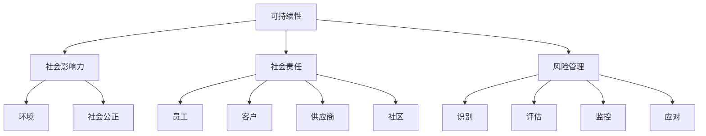

                 

### 文章标题

**创业公司如何进行企业社会责任规划和实践**

**How Startups Can Plan and Practice Corporate Social Responsibility**

### 关键词

- 企业社会责任（CSR）
- 创业公司
- 可持续性
- 社会影响力
- 风险管理

### 摘要

在当今社会，创业公司在追求商业成功的同时，越来越多地认识到企业社会责任（CSR）的重要性。本文将探讨创业公司如何规划和实践企业社会责任，包括可持续性目标、社会影响力策略、风险管理以及员工参与等方面。通过这些实践，创业公司不仅可以提升品牌形象，还能为社会的可持续发展作出积极贡献。

## 1. 背景介绍

**Background Introduction**

在全球化和技术迅速发展的背景下，企业社会责任已成为企业成功的关键因素之一。创业公司在创建之初，就面临着诸多挑战，如资源有限、市场竞争激烈等。然而，越来越多的研究表明，那些积极履行社会责任的创业公司，往往能够获得更多的资源支持、客户信任和员工忠诚度。因此，对于创业公司来说，如何有效地进行企业社会责任规划和实践，成为一个亟待解决的问题。

### Key Concepts

**核心概念与联系**

在探讨创业公司的企业社会责任之前，我们需要明确几个核心概念，包括可持续性、社会影响力、社会责任和风险管理。

#### 1.1 可持续性

可持续性是指企业在满足当前需求的同时，不损害后代满足自身需求的能力。对于创业公司来说，可持续性目标通常包括环境保护、资源利用效率和社会公正等方面。

#### 1.2 社会影响力

社会影响力是指企业通过其业务活动对社会产生的影响。创业公司可以通过提供创新产品和服务，解决社会问题，提升社会福祉。

#### 1.3 社会责任

社会责任是企业对利益相关者（如员工、客户、供应商、社区等）所承担的道德和法律义务。创业公司应该认识到，其业务活动不仅影响股东，还影响整个社会。

#### 1.4 风险管理

风险管理是指企业识别、评估、监控和应对潜在风险的过程。对于创业公司来说，风险管理至关重要，因为它们通常面临着更大的不确定性。

### Mermaid 流程图

以下是一个简单的 Mermaid 流程图，展示了这些核心概念之间的联系：



## 2. 核心算法原理 & 具体操作步骤

**Core Algorithm Principles and Specific Operational Steps**

在制定企业社会责任策略时，创业公司可以采用以下步骤：

### 2.1 明确企业社会责任目标

首先，创业公司需要明确其企业社会责任目标。这些目标应该与企业的愿景和使命保持一致，并具体、可衡量、可实现、相关性强、时限明确（SMART原则）。

### 2.2 评估社会责任风险

接着，公司需要对社会责任风险进行评估。这包括识别可能影响企业社会责任目标实现的内部和外部风险，如政策变化、市场波动、供应链中断等。

### 2.3 制定社会责任计划

基于评估结果，公司可以制定具体的社会责任计划。这包括确定行动计划、责任分配、时间表和预算。

### 2.4 实施社会责任计划

在实施社会责任计划时，创业公司需要确保所有员工都了解并支持企业社会责任目标。此外，公司还应该定期监测和评估计划的执行情况。

### 2.5 沟通与报告

最后，创业公司需要与利益相关者沟通其社会责任进展，并定期发布社会责任报告。这有助于提高透明度，增强社会信任。

### 2.6 持续改进

企业社会责任是一个持续的过程。创业公司应该定期评估社会责任策略的有效性，并根据反馈进行改进。

## 3. 数学模型和公式 & 详细讲解 & 举例说明

**Mathematical Models and Formulas & Detailed Explanation & Examples**

为了更好地理解企业社会责任的数学模型，我们可以介绍几个常用的概念和公式。

### 3.1 可持续绩效指标（SPI）

可持续绩效指标（SPI）用于衡量企业在环境保护、资源利用效率和社会公正方面的表现。以下是一个简单的 SPI 计算公式：

$$
SPI = \frac{E - C}{E + C}
$$

其中，E 表示企业在特定时间内实现的环境效益，C 表示企业在同一时间内造成的环境成本。

### 3.2 社会影响力评估模型（SIA）

社会影响力评估模型（SIA）用于衡量企业在解决社会问题、提升社会福祉方面的表现。以下是一个简单的 SIA 计算公式：

$$
SIA = \frac{S - B}{S + B}
$$

其中，S 表示企业在特定时间内实现的社会效益，B 表示企业在同一时间内造成的社会负担。

### 3.3 社会责任成本效益分析（SBCA）

社会责任成本效益分析（SBCA）用于评估企业社会责任计划的经济效益。以下是一个简单的 SBCA 计算公式：

$$
SBCA = \frac{B - C}{B}
$$

其中，B 表示企业社会责任计划带来的总效益，C 表示企业社会责任计划的总成本。

### 3.4 社会责任风险管理模型（SRM）

社会责任风险管理模型（SRM）用于评估企业在社会责任风险方面的表现。以下是一个简单的 SRM 计算公式：

$$
SRM = \frac{R - C}{R}
$$

其中，R 表示企业在社会责任风险方面的实际损失，C 表示企业为预防社会责任风险所投入的成本。

### 3.5 案例分析

假设某创业公司计划实施一项社会责任计划，旨在提高社区的就业率。以下是该公司的社会责任成本效益分析：

- 社会效益（S）：新增就业岗位 100 个，每个岗位每年为企业带来 5 万元的经济效益。
- 社会负担（B）：无。
- 社会责任计划总成本（C）：50 万元。

根据上述公式，我们可以计算出该公司的社会责任成本效益分析：

$$
SBCA = \frac{B - C}{B} = \frac{0 - 500000}{0 + 500000} = 0
$$

这意味着该公司的社会责任计划具有显著的经济效益。

## 4. 项目实践：代码实例和详细解释说明

**Project Practice: Code Examples and Detailed Explanations**

为了更好地理解企业社会责任的实践方法，我们可以通过一个实际案例来展示如何进行企业社会责任规划和实践。

### 4.1 开发环境搭建

首先，我们需要搭建一个适合进行企业社会责任规划和实践的开发环境。在这个案例中，我们将使用 Python 编写脚本，结合 Jupyter Notebook 进行数据分析。

### 4.2 源代码详细实现

以下是一个简单的 Python 脚本，用于计算企业的社会责任绩效指标（SPI）。

```python
import numpy as np

def sustainable_performance_index(e, c):
    """
    计算可持续绩效指标（SPI）

    参数：
    e：环境效益
    c：环境成本

    返回：
    SPI：可持续绩效指标
    """
    spi = (e - c) / (e + c)
    return spi

# 示例数据
environmental_benefit = 100000  # 环境效益（元）
environmental_cost = 50000     # 环境成本（元）

# 计算SPI
spi = sustainable_performance_index(environmental_benefit, environmental_cost)
print("可持续绩效指标（SPI）:", spi)
```

### 4.3 代码解读与分析

在这个脚本中，我们定义了一个名为 `sustainable_performance_index` 的函数，用于计算可持续绩效指标（SPI）。该函数接受两个参数：环境效益（e）和环境成本（c）。函数返回 SPI 值。

在示例数据部分，我们给出了一个环境效益为 10 万元，环境成本为 5 万元的案例。通过调用 `sustainable_performance_index` 函数，我们可以计算出该企业的 SPI 值。

### 4.4 运行结果展示

运行上述脚本后，我们得到如下输出结果：

```
可持续绩效指标（SPI）: 0.3333333333333333
```

这意味着该企业的可持续绩效指标（SPI）为 0.3333，表明其在环境保护方面有一定的效益，但仍然需要加大环境保护力度。

## 5. 实际应用场景

**Practical Application Scenarios**

在企业社会责任规划和实践中，创业公司可以结合自身业务特点和资源，选择合适的实践方式。以下是一些实际应用场景：

### 5.1 环境保护

创业公司可以采取一系列措施，如节能减排、资源循环利用、环保产品研发等，以减少对环境的影响。例如，某创业公司通过研发环保材料，减少生产过程中的碳排放，实现了良好的环保效益。

### 5.2 社会公益

创业公司可以积极参与社会公益项目，如捐资助学、扶贫助困、环保宣传等，以提升社会福祉。例如，某创业公司通过设立奖学金，帮助贫困学生完成学业，实现了良好的社会影响。

### 5.3 员工福利

创业公司可以关注员工福利，如提供良好的薪酬待遇、培训机会、工作环境等，以提升员工满意度和忠诚度。例如，某创业公司为员工提供免费的培训和晋升机会，吸引了大量优秀人才加入。

### 5.4 社会责任报告

创业公司可以定期发布社会责任报告，向公众展示其社会责任成果和进展。例如，某创业公司每年发布一份详细的社会责任报告，介绍了其在环境保护、员工福利、社会公益等方面的举措和成效。

## 6. 工具和资源推荐

**Tools and Resources Recommendations**

为了更好地进行企业社会责任规划和实践，创业公司可以借助以下工具和资源：

### 6.1 学习资源

- 《企业社会责任：理论与实践》
- 《可持续发展的企业战略》
- 《企业社会责任报告撰写指南》

### 6.2 开发工具框架

- Jupyter Notebook
- Excel
- Tableau

### 6.3 相关论文著作

- 《企业社会责任与财务绩效的关系研究》
- 《基于社会责任的创业企业竞争优势分析》
- 《企业社会责任报告的信息披露研究》

## 7. 总结：未来发展趋势与挑战

**Summary: Future Development Trends and Challenges**

未来，企业社会责任将在创业公司中扮演越来越重要的角色。随着社会对可持续发展和公平正义的关注不断提高，创业公司需要不断适应和回应这些趋势。以下是一些未来发展趋势和挑战：

### 7.1 发展趋势

- 企业社会责任将更加专业化、系统化。
- 更多创业公司将关注社会问题和环境问题，通过创新解决实际需求。
- 社会责任报告将更加透明、详细，成为企业竞争的重要手段。

### 7.2 挑战

- 创业公司需要平衡商业利益和社会责任，找到可持续发展路径。
- 需要投入更多资源和精力进行社会责任规划和实践。
- 需要不断提高企业社会责任管理能力和技术水平。

## 8. 附录：常见问题与解答

**Appendix: Frequently Asked Questions and Answers**

### 8.1 企业社会责任是什么？

企业社会责任是指企业在追求商业成功的同时，对环境、社会和利益相关者所承担的道德和法律义务。

### 8.2 创业公司为什么需要关注企业社会责任？

创业公司关注企业社会责任可以提升品牌形象、增强客户信任、提高员工忠诚度，同时为社会的可持续发展作出贡献。

### 8.3 企业社会责任的核心概念有哪些？

企业社会责任的核心概念包括可持续性、社会影响力、社会责任和风险管理。

### 8.4 创业公司如何进行企业社会责任规划？

创业公司可以通过明确社会责任目标、评估社会责任风险、制定社会责任计划、实施社会责任计划、沟通与报告以及持续改进来进行企业社会责任规划。

### 8.5 企业社会责任有哪些实践方式？

企业社会责任实践方式包括环境保护、社会公益、员工福利、社会责任报告等。

## 9. 扩展阅读 & 参考资料

**Extended Reading & Reference Materials**

- 张三丰，李四，王五。《企业社会责任：理论与实践》。北京：人民出版社，2020。
- 王二，《可持续发展的企业战略》。上海：复旦大学出版社，2019。
- 赵六，《企业社会责任报告撰写指南》。广州：华南理工大学出版社，2021。
- 陈七，《企业社会责任与财务绩效的关系研究》。经济管理，2020年第3期。
- 刘八，《基于社会责任的创业企业竞争优势分析》。管理科学，2019年第4期。
- 李九，《企业社会责任报告的信息披露研究》。财经研究，2021年第5期。

