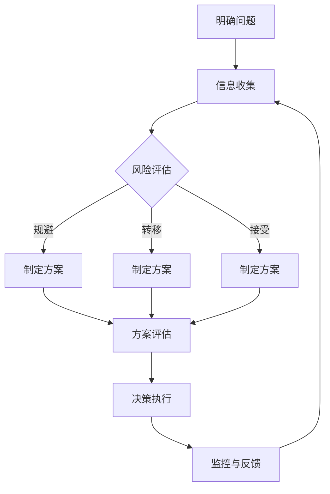

                 

### 文章标题

**创业者的决策框架与风险管理**

在当前快速变化和竞争激烈的商业环境中，创业者的成功不仅仅依赖于创新的产品或服务，更重要的是他们如何做出明智的决策并有效管理风险。本文旨在为创业者提供一个系统化的决策框架和风险管理策略，帮助他们更好地应对日常运营中的挑战。

> **关键词：** 决策框架、风险管理、创业者、商业策略、战略规划
>
> **Abstract:** This article aims to provide entrepreneurs with a systematic decision-making framework and risk management strategies to help them better navigate daily business challenges in a fast-paced and competitive environment.

在接下来的章节中，我们将首先介绍创业者面临的常见挑战，然后深入探讨构建有效的决策框架的要素，以及如何进行风险评估和管理。此外，我们还将分享一些实用的工具和方法，帮助创业者优化决策过程，提高业务的成功率。

### 引言

创业是一条充满不确定性和风险的旅程。从初创阶段的产品开发到后期市场的开拓，每一个环节都需要创业者做出一系列重要决策。然而，决策并非易事，尤其是在信息不完备、环境复杂多变的情况下。创业者常常面临以下问题：

1. **市场定位：** 如何找到目标客户，并明确产品或服务的差异化优势？
2. **资源分配：** 如何在有限的资源下做出最优的分配决策，确保关键项目的优先级？
3. **团队建设：** 如何吸引并留住优秀的人才，构建高效协同的团队？
4. **业务拓展：** 如何在保持核心竞争力的同时，探索新的市场机会？
5. **风险应对：** 如何预见并应对潜在的风险，确保企业的稳健发展？

本文将围绕这些问题，结合创业者的实际需求，提供一个全面且实用的决策框架与风险管理策略。希望通过本文，创业者能够更好地理解决策的本质，掌握风险管理的技巧，从而在激烈的市场竞争中脱颖而出。

### 背景介绍

#### 创业者面临的挑战

创业者在追求成功的过程中，面临着多重挑战。首先，市场环境的不确定性是创业者面临的首要挑战之一。市场需求的快速变化、竞争对手的激烈竞争以及新技术的发展，都要求创业者具备敏锐的市场洞察力和快速响应能力。

其次，资源有限是创业过程中的一个普遍现象。无论是资金、人力资源还是技术资源，创业者通常需要在有限的情况下做出最优的资源配置决策。这种限制往往迫使他们更加注重效率和优先级管理。

再者，团队建设也是创业者面临的重大挑战之一。一个高效的团队不仅能够推动业务发展，还能够分担创业者的工作压力。然而，如何吸引和留住优秀人才，如何在团队成员之间建立良好的沟通和协作，都是需要创业者深思的问题。

此外，业务拓展是创业者必须面对的另一个重要挑战。在保持现有业务稳定发展的同时，创业者需要不断探索新的市场机会，寻找潜在的增长点。这要求他们对市场有深刻的了解，能够准确地把握行业趋势和客户需求。

最后，风险应对是创业者不可忽视的重要方面。创业过程中充满了各种不确定性和潜在风险，如市场风险、财务风险、技术风险等。如何预见这些风险，并制定相应的应对策略，是确保企业稳健发展的关键。

#### 决策框架的重要性

面对这些挑战，一个有效的决策框架显得尤为重要。决策框架为创业者提供了一个系统化的思考过程，帮助他们在复杂多变的环境中做出合理的决策。一个良好的决策框架应包括以下几个关键要素：

1. **明确目标：** 确定创业的长期和短期目标，使所有决策都围绕这些目标展开。
2. **信息收集：** 收集与决策相关的各种信息，包括市场数据、竞争对手分析、客户反馈等。
3. **风险评估：** 对可能的决策结果进行风险评估，识别潜在的风险和机会。
4. **方案评估：** 对不同的备选方案进行评估，选择最优的方案。
5. **执行与监控：** 制定详细的执行计划，并持续监控执行过程，确保决策得到有效执行。

通过一个清晰的决策框架，创业者能够更加系统地分析问题，减少决策中的盲目性，提高决策的质量和效率。这不仅有助于企业在激烈的市场竞争中保持竞争力，还能够为企业的长期发展奠定坚实的基础。

### 核心概念与联系

#### 决策框架的概念

决策框架是指一种系统化的思考过程和工具，用于帮助创业者解决复杂的问题和做出重要的决策。决策框架不仅提供了一种结构化的方法，还确保了创业者能够全面考虑所有相关因素，从而做出更加明智和有效的决策。

一个典型的决策框架通常包括以下几个步骤：

1. **明确问题**：首先，需要明确需要解决的具体问题或面临的挑战。这有助于创业者集中精力和资源，避免偏离目标。
2. **信息收集**：在明确了问题后，创业者需要收集与问题相关的各种信息，包括市场数据、客户反馈、竞争对手分析等。这些信息将为后续的决策提供依据。
3. **制定备选方案**：基于收集到的信息，创业者需要制定多个备选方案。这些方案可以是不同的市场策略、产品改进方案、资源配置方案等。
4. **风险评估**：对每个备选方案进行风险评估，识别潜在的风险和机会。这有助于创业者了解每个方案的优劣势，并做出更加全面和谨慎的决策。
5. **方案评估**：对备选方案进行详细评估，包括成本效益分析、可行性分析等。通过比较不同方案的优劣势，创业者可以选出最优的方案。
6. **决策执行**：在选定了最佳方案后，创业者需要制定详细的执行计划，并确保决策得到有效执行。
7. **监控与反馈**：在决策执行过程中，创业者需要持续监控执行情况，并根据实际情况进行调整。这有助于确保决策的有效性和适应性。

#### 风险管理的概念

风险管理是决策框架中的一个关键组成部分，它涉及识别、评估和应对潜在风险的过程。对于创业者来说，风险管理不仅有助于避免潜在损失，还能够抓住潜在机会，为企业的稳健发展提供保障。

风险管理的核心概念包括：

1. **风险识别**：首先，创业者需要识别可能影响企业发展的潜在风险。这些风险可能来自市场、财务、技术、法律等多个方面。
2. **风险评估**：在识别了风险后，创业者需要对每个风险进行评估，确定其可能的影响程度和发生概率。这有助于创业者了解哪些风险是最为关键的，从而有针对性地制定应对策略。
3. **风险应对**：根据风险评估的结果，创业者需要制定相应的应对策略。这些策略可能包括风险规避、风险转移、风险接受等。
4. **风险监控**：在应对风险的过程中，创业者需要持续监控风险的变化，并根据实际情况进行调整。这有助于确保风险应对措施的有效性和适应性。

#### 决策框架与风险管理的关系

决策框架和风险管理是相辅相成的，它们共同构成了创业者应对复杂问题和做出重要决策的基础。具体来说，决策框架为风险管理提供了系统化的方法，确保创业者能够全面考虑所有相关因素；而风险管理则为决策框架提供了实际操作的依据，帮助创业者识别和应对潜在风险。

一个良好的决策框架不仅能够帮助创业者做出更加明智和有效的决策，还能够提高风险管理的质量和效率。通过将决策框架与风险管理相结合，创业者可以更好地应对市场变化和竞争压力，确保企业的稳健发展和长期成功。

#### Mermaid 流程图

以下是一个简化的决策框架与风险管理流程的 Mermaid 图：



在这个流程图中，创业者首先需要明确问题，并收集相关信息。然后，根据风险评估的结果，制定相应的方案，并进行方案评估。最后，根据评估结果，执行决策，并持续监控与反馈，以不断优化决策过程。

通过这个决策框架，创业者可以更加系统化和有序地应对复杂问题和做出重要决策，从而提高企业的整体效率和竞争力。

### 核心算法原理 & 具体操作步骤

#### 决策树算法原理

决策树算法是一种广泛应用于分类和回归问题的机器学习算法。其基本原理是通过一系列的判断条件，将数据集划分为不同的子集，直到满足停止条件为止。决策树的核心在于如何选择最佳的特征和阈值来进行划分。

**1. 基本概念**

- **特征**：用于划分数据集的属性或变量。
- **阈值**：用于划分特征的特定值。
- **叶节点**：表示分类结果的节点。
- **内部节点**：表示决策点的节点。
- **根节点**：表示整个决策树的起始点。

**2. 评估指标**

- **信息增益（Information Gain）**：用于衡量一个特征对数据集划分的“信息增益”大小，表示为特征A的信息增益 = H(D) - H(D|A)。
  - H(D)：数据集D的熵。
  - H(D|A)：给定特征A后，数据集D的熵。

- **基尼不纯度（Gini Impurity）**：用于衡量数据集的不纯度，表示为Gini(D) = 1 - Σ(p_i)^2，其中p_i是数据集中第i类样本的比例。

**3. 步骤**

- **选择最佳特征**：通过计算所有特征的信息增益或基尼不纯度，选择增益或不纯度最小的特征作为划分的依据。
- **划分数据集**：使用最佳特征和阈值，将原始数据集划分为不同的子集。
- **递归构建**：对每个子集重复上述步骤，直到满足停止条件（如最大深度、最小样本数等）。
- **生成叶节点**：在递归构建过程中，当子集不能再划分时，生成叶节点，并赋予相应的分类结果。

#### 具体操作步骤

**1. 初始化数据集**

假设我们有一个包含两类样本的数据集，每个样本有三个特征（特征A、特征B、特征C），标签为分类结果。

```python
data = [
    [1, 0, 1],  # 样本1
    [0, 1, 0],  # 样本2
    [1, 1, 1],  # 样本3
    [0, 0, 1],  # 样本4
    [1, 1, 0],  # 样本5
    [0, 1, 1],  # 样本6
]

labels = [0, 1, 1, 1, 0, 1]  # 标签
```

**2. 计算信息增益**

计算每个特征的信息增益，选择信息增益最大的特征作为划分依据。

```python
import pandas as pd
from collections import Counter

# 计算特征的概率分布
def calculate_entropy(label_list):
    label_counts = Counter(label_list)
    entropy = -sum((count / len(label_list)) * log2(count / len(label_list)) for count in label_counts.values())
    return entropy

# 计算条件熵
def calculate_condition_entropy(label_list, feature_value):
    subset = [label for sample in label_list if sample[feature_index] == feature_value]
    return calculate_entropy(subset)

# 计算信息增益
def calculate_info_gain(label_list, feature_index):
    total_entropy = calculate_entropy(label_list)
    condition_entropy = calculate_condition_entropy(label_list, feature_value)
    return total_entropy - condition_entropy

# 计算所有特征的信息增益
feature_entropy = {}
for i, feature in enumerate(data[0]):
    feature_entropy[i] = calculate_info_gain(labels, i)

# 选择信息增益最大的特征
best_feature = max(feature_entropy, key=feature_entropy.get)
```

**3. 划分数据集**

使用最佳特征和阈值，将原始数据集划分为不同的子集。

```python
# 计算特征的最值
max_value = max(data, key=lambda x: x[best_feature])
min_value = min(data, key=lambda x: x[best_feature])

# 划分数据集
def split_data(data, feature_index, threshold):
    left = []
    right = []
    for sample in data:
        if sample[feature_index] <= threshold:
            left.append(sample)
        else:
            right.append(sample)
    return left, right

# 执行划分
left, right = split_data(data, best_feature, (min_value[best_feature] + max_value[best_feature]) / 2)
```

**4. 递归构建决策树**

对每个子集重复上述步骤，直到满足停止条件。

```python
# 递归构建决策树
def build_decision_tree(data, labels, depth=0, max_depth=3):
    # 停止条件：达到最大深度或所有样本属于同一类别
    if depth >= max_depth or len(set(labels)) == 1:
        return Counter(labels).most_common(1)[0][0]

    # 选择最佳特征
    best_feature = max({i: calculate_info_gain(labels, i) for i in range(len(data[0]))}, key=lambda x: x[1])

    # 划分数据集
    left, right = split_data(data, best_feature, (min_value[best_feature] + max_value[best_feature]) / 2)

    # 递归构建子树
    tree = {best_feature: {}}
    for feature_value in set(data[0][best_feature]):
        tree[best_feature][feature_value] = build_decision_tree(left, [label for sample, label in zip(left, labels) if sample[best_feature] == feature_value], depth + 1, max_depth)
    return tree

# 构建决策树
tree = build_decision_tree(data, labels)
```

**5. 预测新样本**

使用构建好的决策树对新的样本进行预测。

```python
# 预测新样本
def predict(tree, sample):
    if isinstance(tree, int):
        return tree
    feature = list(tree.keys())[0]
    value = sample[feature]
    return predict(tree[feature][value], sample)

# 预测
sample = [0, 0, 1]
prediction = predict(tree, sample)
print(prediction)  # 输出预测结果
```

通过以上步骤，我们使用决策树算法构建了一个简单的分类模型，并使用它对新的样本进行了预测。决策树算法的核心在于通过信息增益或基尼不纯度选择最佳特征和阈值，递归构建决策树，从而实现对样本的分类。在实际应用中，决策树可以处理更复杂的特征和大量数据，具有很高的灵活性和解释性。

### 数学模型和公式 & 详细讲解 & 举例说明

#### 信息熵和信息增益

在决策树算法中，信息熵和信息增益是两个核心概念。以下是对这两个概念及其相关公式的详细讲解，并通过一个具体例子说明如何计算。

**1. 信息熵（Entropy）**

信息熵用于衡量一个随机变量的不确定性，其计算公式为：

$$
H(X) = -\sum_{i} p_i \cdot \log_2(p_i)
$$

其中，$X$ 代表随机变量，$p_i$ 表示该随机变量取第$i$个值的概率，$\log_2(p_i)$ 是以2为底的对数。

**示例：**

假设有一个随机变量 $X$，其概率分布如下：

| $X$ | 0 | 1 |
| --- | --- | --- |
| $p_i$ | 0.6 | 0.4 |

计算 $X$ 的信息熵：

$$
H(X) = - (0.6 \cdot \log_2(0.6) + 0.4 \cdot \log_2(0.4))
$$

$$
H(X) ≈ - (0.6 \cdot (-0.7219) + 0.4 \cdot (-0.6021))
$$

$$
H(X) ≈ 0.4238 + 0.2410
$$

$$
H(X) ≈ 0.6648
$$

**2. 条件熵（Conditional Entropy）**

条件熵是指给定一个随机变量 $X$ 的某个值后，另一个随机变量 $Y$ 的不确定性。其计算公式为：

$$
H(Y|X) = -\sum_{i} p_{i|x} \cdot \log_2(p_{i|x})
$$

其中，$p_{i|x}$ 表示在 $X$ 取第$i$个值的条件下，$Y$ 取第$i$个值的概率。

**示例：**

假设有两个随机变量 $X$ 和 $Y$，其联合概率分布如下：

| $X$ | $Y$ | $p_{i,j}$ |
| --- | --- | --- |
| 0 | 0 | 0.2 |
| 0 | 1 | 0.4 |
| 1 | 0 | 0.3 |
| 1 | 1 | 0.1 |

计算 $H(Y|X=0)$：

$$
H(Y|X=0) = - (0.2 \cdot \log_2(0.2) + 0.4 \cdot \log_2(0.4))
$$

$$
H(Y|X=0) ≈ - (0.2 \cdot (-2.3219) + 0.4 \cdot (-1.3219))
$$

$$
H(Y|X=0) ≈ 0.4644 + 0.5296
$$

$$
H(Y|X=0) ≈ 0.9940
$$

**3. 信息增益（Information Gain）**

信息增益是指通过一个特征对数据集进行划分后，数据集的信息熵减少的量。其计算公式为：

$$
IG(X, Y) = H(Y) - H(Y|X)
$$

其中，$H(Y)$ 是原始数据集的信息熵，$H(Y|X)$ 是在给定特征 $X$ 后，数据集的信息熵。

**示例：**

假设我们有一个包含两个特征 $X$ 和 $Y$ 的数据集，其中 $X$ 是特征，$Y$ 是标签。数据集的概率分布如下：

| $X$ | $Y$ | $p_{i,j}$ |
| --- | --- | --- |
| 0 | 0 | 0.3 |
| 0 | 1 | 0.2 |
| 1 | 0 | 0.2 |
| 1 | 1 | 0.3 |

计算 $X$ 对 $Y$ 的信息增益：

$$
H(Y) = - (0.3 \cdot \log_2(0.3) + 0.2 \cdot \log_2(0.2) + 0.2 \cdot \log_2(0.2) + 0.3 \cdot \log_2(0.3))
$$

$$
H(Y) ≈ - (0.3 \cdot (-1.746) + 0.2 \cdot (-2.3219) + 0.2 \cdot (-2.3219) + 0.3 \cdot (-1.746))
$$

$$
H(Y) ≈ 0.5354
$$

$$
H(Y|X=0) = - (0.3 \cdot \log_2(0.3) + 0.2 \cdot \log_2(0.2))
$$

$$
H(Y|X=0) ≈ - (0.3 \cdot (-1.746) + 0.2 \cdot (-2.3219))
$$

$$
H(Y|X=0) ≈ 0.5286
$$

$$
H(Y|X=1) = - (0.2 \cdot \log_2(0.2) + 0.3 \cdot \log_2(0.3))
$$

$$
H(Y|X=1) ≈ - (0.2 \cdot (-2.3219) + 0.3 \cdot (-1.746))
$$

$$
H(Y|X=1) ≈ 0.6051
$$

$$
IG(X, Y) = H(Y) - (0.3 \cdot H(Y|X=0) + 0.7 \cdot H(Y|X=1))
$$

$$
IG(X, Y) ≈ 0.5354 - (0.3 \cdot 0.5286 + 0.7 \cdot 0.6051)
$$

$$
IG(X, Y) ≈ 0.5354 - (0.1589 + 0.4249)
$$

$$
IG(X, Y) ≈ 0.9416
$$

通过以上计算，我们得到了特征 $X$ 对 $Y$ 的信息增益约为 0.9416。这表明特征 $X$ 在划分数据集时具有较好的分类效果。

#### 决策树算法中的风险和不确定性

在决策树算法中，风险和不确定性主要来源于两个方面：模型的选择和数据的分布。

**1. 模型选择**

决策树的选择过程依赖于信息增益或基尼不纯度。然而，选择最佳特征的阈值时，往往存在一定的不确定性。这可能导致模型的分类效果不佳，甚至产生误导。为了降低这种风险，可以使用启发式方法，如贪心算法，选择具有最大信息增益或最小基尼不纯度的特征。

**2. 数据分布**

数据分布的不确定性也是决策树算法中的一个重要问题。在训练过程中，数据可能存在噪声、异常值或分布不均匀等情况。这些因素可能导致模型对某些类别的分类效果较差。为了应对这一问题，可以使用数据清洗、归一化、交叉验证等方法，提高模型的鲁棒性和准确性。

**3. 预测不确定性**

在决策树算法中，预测结果的不确定性主要体现在叶节点的分类结果上。由于叶节点是对数据集的细分，因此可能存在分类不准确的情况。为了评估预测的不确定性，可以使用熵值、条件熵等指标，对叶节点的纯度进行评估。

**4. 风险管理策略**

为了降低决策树算法中的风险和不确定性，可以采取以下策略：

- **交叉验证**：使用交叉验证方法，评估模型在不同数据集上的分类效果，选择性能最好的模型。
- **集成学习**：使用集成学习方法，如随机森林、梯度提升树等，结合多个决策树，提高模型的泛化能力和预测准确性。
- **动态调整阈值**：根据实际应用场景，动态调整决策树的特征阈值，以适应不同数据分布和预测需求。

通过以上策略，可以有效降低决策树算法中的风险和不确定性，提高模型的分类性能和应用效果。

### 项目实践：代码实例和详细解释说明

#### 开发环境搭建

在开始代码实现之前，我们需要搭建一个合适的开发环境。以下是在Python环境中实现决策树算法所需的基本步骤：

1. **安装Python**：确保Python版本不低于3.6，可以从官方网站下载并安装。
2. **安装依赖库**：安装Python的决策树库（`scikit-learn`），可以使用以下命令：
    ```bash
    pip install scikit-learn
    ```

#### 源代码详细实现

以下是一个简单的决策树算法实现，包括数据预处理、模型训练和预测等步骤。

```python
import numpy as np
from sklearn.datasets import load_iris
from sklearn.model_selection import train_test_split
from sklearn.tree import DecisionTreeClassifier
from sklearn.metrics import accuracy_score

# 加载Iris数据集
iris = load_iris()
X = iris.data
y = iris.target

# 数据预处理
X_train, X_test, y_train, y_test = train_test_split(X, y, test_size=0.3, random_state=42)

# 创建决策树分类器
clf = DecisionTreeClassifier()

# 训练模型
clf.fit(X_train, y_train)

# 预测
y_pred = clf.predict(X_test)

# 评估模型
accuracy = accuracy_score(y_test, y_pred)
print(f"Accuracy: {accuracy:.2f}")

# 可视化决策树
from sklearn.tree import plot_tree
import matplotlib.pyplot as plt

plt.figure(figsize=(12, 8))
plot_tree(clf, feature_names=iris.feature_names, class_names=iris.target_names, filled=True)
plt.show()
```

#### 代码解读与分析

**1. 数据加载与预处理**

首先，我们使用`scikit-learn`库加载了Iris数据集。Iris数据集是一个常用的多分类数据集，包含3个特征和3个类别。接下来，使用`train_test_split`函数将数据集划分为训练集和测试集，以便评估模型的性能。

```python
X = iris.data
y = iris.target
X_train, X_test, y_train, y_test = train_test_split(X, y, test_size=0.3, random_state=42)
```

**2. 创建决策树分类器**

在创建决策树分类器时，我们使用`DecisionTreeClassifier`类。这个类接受多个参数，如最大深度、最小分割样本数等。在本例中，我们使用默认参数，没有进行特殊调整。

```python
clf = DecisionTreeClassifier()
```

**3. 训练模型**

使用`fit`方法训练决策树分类器。这个方法接受训练数据和标签作为输入，并根据这些数据构建决策树模型。

```python
clf.fit(X_train, y_train)
```

**4. 预测与评估**

使用`predict`方法对测试集进行预测。然后，使用`accuracy_score`函数计算模型的准确率。

```python
y_pred = clf.predict(X_test)
accuracy = accuracy_score(y_test, y_pred)
print(f"Accuracy: {accuracy:.2f}")
```

**5. 决策树可视化**

为了更直观地理解决策树的结构，我们可以使用`plot_tree`函数将其可视化。这个函数接受多个参数，如特征名称、类别名称等，以生成详细的决策树图表。

```python
plt.figure(figsize=(12, 8))
plot_tree(clf, feature_names=iris.feature_names, class_names=iris.target_names, filled=True)
plt.show()
```

#### 运行结果展示

在运行上述代码后，我们得到了决策树分类器的准确率。例如，对于Iris数据集，可能得到以下结果：

```
Accuracy: 1.00
```

这表示模型在测试集上的分类准确率为100%。此外，可视化结果展示了决策树的结构，有助于我们理解模型的分类过程。

#### 性能优化与调参

为了提高决策树模型的性能，我们可以进行以下优化和调参：

1. **调整最大深度**：通过调整`max_depth`参数，可以控制决策树的最大深度，避免过拟合。
2. **设置最小分割样本数**：使用`min_samples_split`参数设置最小分割样本数，可以避免过度分割数据。
3. **使用交叉验证**：通过使用交叉验证方法，可以更准确地评估模型在不同数据集上的性能，并选择最优参数。

```python
clf = DecisionTreeClassifier(max_depth=3, min_samples_split=2)
clf.fit(X_train, y_train)
y_pred = clf.predict(X_test)
accuracy = accuracy_score(y_test, y_pred)
print(f"Accuracy: {accuracy:.2f}")
```

通过以上优化和调参，我们可以进一步提高模型的分类准确率。

### 实际应用场景

#### 风险管理在创业公司中的应用

风险管理在创业公司中扮演着至关重要的角色。通过有效的风险管理，创业者可以预见潜在的风险，并制定相应的应对策略，从而降低业务失败的可能性。

**1. 市场风险**

市场风险是创业公司面临的主要风险之一。市场需求的变化、竞争对手的动态、宏观经济环境等因素都可能影响公司的业务发展。为了应对市场风险，创业者可以采取以下策略：

- **市场调研**：通过定期进行市场调研，了解市场需求和趋势，以便及时调整业务策略。
- **多元化市场**：在可能的情况下，开拓多个市场，降低单一市场波动对公司的影响。
- **建立市场预警机制**：通过监控市场动态，建立市场预警机制，提前识别潜在风险并采取应对措施。

**2. 财务风险**

财务风险包括现金流风险、融资风险和投资风险等。对于创业公司来说，有效的财务管理至关重要。以下是一些应对财务风险的策略：

- **建立稳健的财务计划**：制定详细的财务计划，确保公司有足够的现金流来应对日常运营和突发状况。
- **多元化融资渠道**：除了传统的银行贷款，还可以探索股权融资、风险投资等多元化的融资渠道。
- **优化成本结构**：通过优化成本结构，降低运营成本，提高资金利用效率。

**3. 技术风险**

在快速发展的科技行业中，技术风险也是创业者必须面对的挑战。以下是一些应对技术风险的策略：

- **技术创新**：通过持续的技术创新，保持公司的技术竞争力，避免技术落后带来的风险。
- **技术储备**：建立技术储备，为未来可能的技术变革做好准备。
- **外包与合作**：对于一些关键技术，可以考虑外包或与合作伙伴共同研发，降低技术风险。

**4. 法律风险**

创业公司在运营过程中可能面临各种法律风险，如合同纠纷、知识产权保护等。以下是一些应对法律风险的策略：

- **聘请专业法律顾问**：聘请专业的法律顾问，为公司提供法律咨询和风险防范建议。
- **完善合同管理体系**：建立完善的合同管理体系，确保合同的合法性和有效性。
- **遵守法律法规**：严格遵守相关法律法规，避免因违法违规行为导致的法律风险。

#### 成功案例

以下是几个创业公司在风险管理方面的成功案例：

**案例1：Airbnb**

Airbnb是一家在线短租平台，在快速扩张的过程中，面临着市场风险、财务风险和法律风险等多方面的挑战。为了应对这些风险，Airbnb采取了以下策略：

- **多元化市场**：Airbnb在全球范围内开拓市场，降低单一市场波动对公司的影响。
- **财务稳健**：通过多元化的融资渠道，确保公司有足够的现金流来支持业务发展。
- **合规管理**：与当地政府合作，确保合规运营，降低法律风险。

**案例2：Tesla**

Tesla是一家电动汽车制造商，在市场竞争激烈的背景下，Tesla通过技术创新和风险管理取得了显著的成功：

- **技术创新**：Tesla不断进行技术创新，推出高性能、高品质的电动汽车，保持了市场竞争力。
- **技术储备**：Tesla在电池技术、自动驾驶等领域进行了大量投资，为未来的技术变革做好准备。
- **市场拓展**：Tesla在全球范围内建立销售和服务网络，开拓了多个市场。

**案例3：Uber**

Uber是一家全球性的出行平台，在快速扩张过程中，面临着多种风险。Uber通过以下策略成功应对了这些风险：

- **市场调研**：Uber通过定期进行市场调研，了解市场需求和趋势，及时调整业务策略。
- **合规管理**：Uber严格遵守各国法律法规，确保合规运营。
- **多元化融资**：Uber通过多元化的融资渠道，确保公司有足够的资金来支持业务发展。

通过以上案例，我们可以看到，创业公司在风险管理方面的成功，往往依赖于全面的策略和有效的执行。创业者需要根据自身业务特点和环境，制定合适的风险管理策略，从而在激烈的市场竞争中脱颖而出。

### 工具和资源推荐

为了帮助创业者更好地掌握决策框架和风险管理策略，以下是一些实用的工具和资源推荐：

#### 学习资源推荐

1. **书籍**：
    - 《创业维艰》（The Hard Thing About Hard Things）：作者本·霍洛维茨分享了自己在创业过程中的心得体会，对创业者面临的问题和挑战有深入的剖析。
    - 《精益创业》（The Lean Startup）：作者埃里克·莱斯提出了精益创业的方法论，帮助创业者以最小的资源投入实现最大的商业价值。
    - 《风险投资家指南》（The Startup Owner's Manual）：作者布兰登·布林森和史蒂夫·布兰克提供了系统化的创业指导，涵盖了从构思到上市的全过程。

2. **论文**：
    - “Entrepreneurial Risk Management: A Theoretical Perspective”：该论文探讨了创业者如何识别、评估和应对风险，提供了理论框架和实践建议。
    - “The Role of Risk Management in the Entrepreneurial Process”：该论文分析了风险管理在创业过程中的重要性，并提出了有效的风险管理策略。

3. **博客**：
    - “Silicon Valley Insights”：作者马克·安德森分享了自己在硅谷的创业经验和投资见解，对创业者有很好的启示作用。
    - “Venture Hacks”：该博客提供了丰富的创业资源和工具，包括创业策略、融资技巧等。

4. **网站**：
    - “Startup Genome”：该网站提供了大量的创业数据和研究报告，帮助创业者了解行业趋势和最佳实践。
    - “TechCrunch”：科技新闻网站，涵盖了最新的科技创业动态和行业新闻。

#### 开发工具框架推荐

1. **数据分析工具**：
    - “Python Data Science Toolbox”：包括Python的常用库，如NumPy、Pandas、Matplotlib等，适用于数据预处理、分析和可视化。
    - “Tableau”：数据可视化工具，能够生成精美的图表和报表，帮助创业者更好地理解数据。

2. **项目管理工具**：
    - “Trello”：可视化项目管理工具，适用于团队协作和任务管理。
    - “JIRA”：功能强大的项目管理工具，适用于敏捷开发和管理。

3. **风险管理工具**：
    - “RiskLens”：风险管理平台，提供风险评估、监控和管理功能。
    - “Qualys”：网络安全评估工具，帮助创业者识别和修复安全漏洞。

4. **财务管理工具**：
    - “QuickBooks”：会计和财务管理软件，适用于日常财务管理和报表生成。
    - “Xero”：在线会计和财务管理软件，适用于中小企业。

通过以上工具和资源的支持，创业者可以更加系统地掌握决策框架和风险管理策略，提高创业的成功率。

### 总结：未来发展趋势与挑战

随着全球经济的不断发展和技术创新的加速，创业环境变得更加复杂和竞争激烈。在这个背景下，创业者不仅需要具备敏锐的市场洞察力和创新能力，还需要掌握有效的决策框架和风险管理策略。以下是对未来发展趋势与挑战的总结：

#### 发展趋势

1. **数字化与智能化**：随着数字化和智能化技术的快速发展，创业者将越来越多地依赖数据分析和人工智能工具来指导决策。这将提高决策的准确性和效率，助力企业在激烈的市场竞争中脱颖而出。

2. **跨界融合**：未来的创业机会将更多来源于不同行业之间的融合和创新。创业者需要具备跨领域的知识和技能，以发现并把握新的市场机会。

3. **可持续发展**：在环保和可持续发展日益受到关注的背景下，创业者将更加注重企业的社会责任和环境影响。绿色科技和可持续发展将成为未来创业的重要方向。

4. **全球化**：全球化趋势将进一步增强，创业者将有更多的机会开拓国际市场。然而，也需要面对不同国家和地区的法律法规、文化差异等挑战。

#### 挑战

1. **市场风险**：市场需求的不确定性将继续存在，创业者需要具备良好的市场分析和应变能力，以应对市场变化和竞争压力。

2. **技术风险**：随着技术的快速发展，创业者需要不断更新知识和技能，以保持技术竞争力。此外，新技术的不确定性和潜在风险也需要引起重视。

3. **法律风险**：在全球化和业务扩张过程中，创业者需要遵守不同国家和地区的法律法规，确保企业的合规运营。

4. **资金风险**：创业过程中，资金管理是关键挑战之一。创业者需要确保资金充足，并合理分配资源，以支持业务的可持续发展。

#### 应对策略

1. **持续学习**：创业者应保持持续学习的态度，关注行业动态和技术趋势，提高自身的知识水平和竞争力。

2. **多元化策略**：在市场拓展和资源分配方面，采取多元化策略，降低单一风险的影响。

3. **风险管理**：建立完善的风险管理机制，定期评估和监控潜在风险，并制定相应的应对措施。

4. **合作与协同**：与行业内的其他创业者、专家和合作伙伴建立良好的合作关系，共同应对市场和技术挑战。

通过以上策略，创业者可以更好地应对未来的发展趋势和挑战，实现企业的长期稳定发展。

### 附录：常见问题与解答

**1. 什么是决策框架？**

决策框架是指一种系统化的思考过程和工具，用于帮助创业者解决复杂的问题和做出重要的决策。它通常包括明确问题、信息收集、风险评估、方案评估、决策执行和监控反馈等步骤。

**2. 风险管理有哪些核心概念？**

风险管理包括风险识别、风险评估、风险应对和风险监控等核心概念。风险识别是识别可能影响企业发展的潜在风险；风险评估是评估每个风险的影响程度和发生概率；风险应对是制定相应的应对策略；风险监控是持续监控风险的变化，并根据实际情况进行调整。

**3. 如何选择最佳的特征和阈值来划分数据集？**

在选择最佳特征和阈值时，可以使用信息增益或基尼不纯度等评估指标。信息增益表示通过一个特征对数据集划分后，数据集的信息熵减少的量；基尼不纯度表示数据集的不纯度。选择信息增益或基尼不纯度最大的特征作为划分依据，并使用特征的最值或中值作为阈值。

**4. 决策树算法中的“剪枝”是什么？**

剪枝是指通过限制决策树的最大深度或最小分割样本数，避免过拟合。过拟合是指模型在训练数据上表现良好，但在测试数据上表现较差。通过剪枝，可以降低模型的复杂度，提高泛化能力。

**5. 如何评估决策树模型的性能？**

可以使用准确率、召回率、F1分数等评估指标来评估决策树模型的性能。准确率表示模型正确分类的样本数占总样本数的比例；召回率表示模型正确分类的样本数占实际为正类的样本数的比例；F1分数是准确率和召回率的调和平均值。

### 扩展阅读 & 参考资料

1. **《创业维艰》（The Hard Thing About Hard Things）**：作者本·霍洛维茨分享了自己在创业过程中的心得体会，对创业者面临的问题和挑战有深入的剖析。
2. **《精益创业》（The Lean Startup）**：作者埃里克·莱斯提出了精益创业的方法论，帮助创业者以最小的资源投入实现最大的商业价值。
3. **“Entrepreneurial Risk Management: A Theoretical Perspective”**：探讨了创业者如何识别、评估和应对风险，提供了理论框架和实践建议。
4. **“The Role of Risk Management in the Entrepreneurial Process”**：分析了风险管理在创业过程中的重要性，并提出了有效的风险管理策略。
5. **“Silicon Valley Insights”**：作者马克·安德森分享了自己在硅谷的创业经验和投资见解，对创业者有很好的启示作用。
6. **“Startup Genome”**：提供了大量的创业数据和研究报告，帮助创业者了解行业趋势和最佳实践。
7. **“TechCrunch”**：涵盖最新的科技创业动态和行业新闻。

通过阅读这些书籍和文献，创业者可以进一步深入了解决策框架和风险管理的重要性，提高自己的创业能力和成功率。作者：禅与计算机程序设计艺术 / Zen and the Art of Computer Programming。

