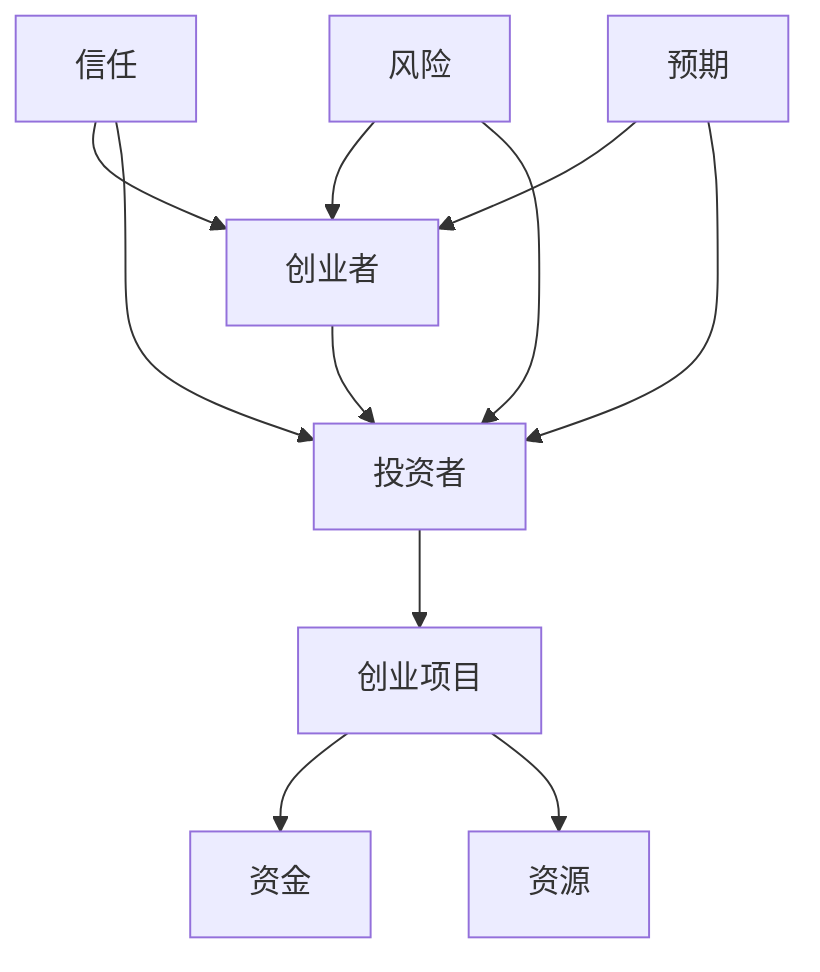

                 

### 文章标题：创业路上的投资者关系：维护良好关系的策略与技巧

> 关键词：创业、投资者关系、策略、技巧、人际关系、商业成功

> 摘要：本文旨在探讨创业过程中与投资者建立和维护良好关系的策略与技巧。通过分析创业者和投资者之间的互动，本文总结了有效沟通、建立信任、价值共鸣、风险管理和合理预期等方面的关键要素，为创业者提供实用的指导，助力他们在创业道路上获得更多的支持和资源。

### 1. 背景介绍（Background Introduction）

创业是一项充满挑战和机遇的事业。在创业过程中，创业者不仅需要创新思维和坚韧不拔的毅力，还需要与各种利益相关者建立良好的关系，其中投资者关系尤为重要。投资者是创业项目的资金来源，他们的支持和信任直接关系到创业项目的成功与否。

然而，创业者与投资者之间的互动并非易事。双方有着不同的目标和预期，创业者追求长期价值的创造，而投资者则关注短期回报和资金的安全性。这种目标的不一致性使得双方在合作过程中常常面临挑战。因此，如何建立和维护良好的投资者关系成为创业者必须面对的重要课题。

本文将结合创业者和投资者之间的互动，分析创业路上维护投资者关系的策略与技巧，旨在为创业者提供实用的指导，助力他们在创业道路上取得成功。

#### 1.1 投资者关系的重要性

投资者关系对创业项目有多方面的重要影响。首先，投资者可以提供资金支持，帮助创业者实现创业梦想。其次，投资者往往拥有丰富的行业经验和资源，他们可以给予创业者宝贵的建议和指导，帮助创业者规避风险、优化业务模式。此外，投资者还可以为创业者带来一定的社会声誉，提升创业项目的品牌价值。

良好的投资者关系不仅有助于创业项目的顺利推进，还可以为创业者带来以下好处：

- **资金支持**：投资者愿意提供资金，支持创业项目的研发、生产和市场推广。
- **资源整合**：投资者可以带来人才、技术、市场等资源，促进创业项目的全面发展。
- **品牌提升**：投资者通常拥有良好的社会声誉，他们的支持可以为创业项目带来更多的关注和认可。

因此，创业者应当高度重视投资者关系，积极维护与投资者之间的良好互动，为创业项目的成功奠定坚实基础。

#### 1.2 创业者与投资者互动的特点

创业者与投资者之间的互动具有以下特点：

- **信息不对称**：创业者通常更了解自己的创业项目，而投资者则更关注项目的市场前景和盈利能力。这种信息不对称可能导致双方在沟通中产生误解和分歧。
- **目标不一致**：创业者注重长期价值的创造，而投资者则关注短期回报。这种目标不一致可能导致双方在合作过程中产生矛盾。
- **利益冲突**：创业者希望保持对项目的控制权，而投资者则希望获得更高的回报。这种利益冲突可能导致双方在决策过程中产生争议。

了解这些特点有助于创业者更好地应对与投资者之间的互动，建立和维护良好的投资者关系。

### 2. 核心概念与联系（Core Concepts and Connections）

在探讨创业路上的投资者关系时，我们需要了解几个关键概念，包括创业者、投资者、创业项目、资金、资源、信任、风险和预期等。这些概念相互联系，共同构成了创业与投资的核心。

#### 2.1 创业者

创业者是创业项目的核心人物，他们具备创新精神、创业能力和风险管理能力。创业者不仅要提出有市场前景的创新项目，还需要具备将项目成功推向市场的执行力。

#### 2.2 投资者

投资者是创业项目的资金提供者，他们关注创业项目的市场前景、盈利能力和风险控制。投资者通常具备丰富的行业经验和资源，他们可以为创业者提供资金、建议和指导。

#### 2.3 创业项目

创业项目是创业者为实现商业目标而开展的具体业务。创业项目的好坏直接关系到投资者的投资回报。一个成功的创业项目需要具备创新性、市场前景和盈利能力。

#### 2.4 资金

资金是创业项目的生命线。投资者通过资金投入，支持创业项目的研发、生产和市场推广。资金的有效利用是创业项目成功的关键。

#### 2.5 资源

资源是创业项目成功的重要保障。投资者不仅可以提供资金，还可以带来人才、技术、市场等资源，促进创业项目的全面发展。

#### 2.6 信任

信任是创业者与投资者之间的重要纽带。创业者需要赢得投资者的信任，才能获得资金和资源支持。信任的建立需要双方在合作过程中保持诚实、透明和诚信。

#### 2.7 风险

风险是创业过程中不可避免的因素。创业者需要识别和管理风险，确保创业项目的稳定发展。投资者则需要评估创业项目的风险，并制定相应的风险控制策略。

#### 2.8 预期

预期是创业者和投资者在合作过程中的共同目标。创业者希望实现长期价值创造，投资者则关注短期回报。双方需要在合作过程中合理设定预期，确保双方目标的平衡。

理解这些核心概念和它们之间的联系，有助于创业者更好地理解投资者关系，制定有效的策略和技巧，维护良好的投资者关系。

#### 2.9 Mermaid 流程图

以下是一个简要的 Mermaid 流程图，展示创业者与投资者之间的互动关系：



### 3. 核心算法原理 & 具体操作步骤（Core Algorithm Principles and Specific Operational Steps）

在维护良好的投资者关系方面，创业者可以采用一系列策略和技巧。以下是一些核心算法原理和具体操作步骤：

#### 3.1 策略 1：建立有效沟通

**原理**：沟通是维护良好投资者关系的基石。创业者需要与投资者保持密切沟通，确保双方信息对称，降低误解和冲突。

**操作步骤**：

1. **定期报告**：创业者应定期向投资者报告项目的进展情况，包括财务数据、研发进度、市场反馈等。
2. **透明度**：创业者应保持信息的透明度，避免隐瞒重要信息或故意误导投资者。
3. **倾听**：创业者应认真倾听投资者的意见和建议，给予充分的尊重和考虑。
4. **及时响应**：对于投资者的提问和反馈，创业者应尽快给予回应，展现诚意和责任心。

#### 3.2 策略 2：建立信任

**原理**：信任是创业者与投资者之间的重要纽带。创业者需要通过实际行动赢得投资者的信任。

**操作步骤**：

1. **诚实守信**：创业者应诚实守信，遵守承诺，展现高度的职业道德。
2. **数据真实**：创业者应确保所提供的数据真实可靠，避免夸大或虚构。
3. **公开透明**：创业者应公开透明地处理项目事务，避免私下交易或利益输送。
4. **风险提示**：创业者应提前向投资者提示项目可能面临的风险，并制定相应的风险控制措施。

#### 3.3 策略 3：寻找共同价值

**原理**：创业者与投资者之间的合作基于共同的价值认同。寻找共同的价值可以增强双方的黏性，提高合作的可持续性。

**操作步骤**：

1. **了解投资者需求**：创业者应了解投资者的投资偏好、行业关注点和投资目标，找到共同的价值点。
2. **展示项目价值**：创业者应向投资者清晰地展示项目的市场前景、盈利能力和竞争优势，赢得投资者的认可。
3. **建立长期合作**：创业者应与投资者建立长期合作关系，通过持续的价值创造，保持投资者的持续关注和支持。

#### 3.4 策略 4：风险管理

**原理**：创业过程中风险无处不在。有效的风险管理有助于降低项目风险，增强投资者的信心。

**操作步骤**：

1. **识别风险**：创业者应识别项目可能面临的各种风险，包括市场风险、技术风险、财务风险等。
2. **评估风险**：创业者应评估各种风险的潜在影响和可能性，制定相应的风险应对策略。
3. **风险控制**：创业者应采取有效的措施，控制项目风险在可接受的范围内。
4. **风险沟通**：创业者应与投资者保持沟通，及时报告项目风险情况，争取投资者的理解和配合。

#### 3.5 策略 5：设定合理预期

**原理**：合理的预期有助于双方在合作过程中保持积极心态，避免因期望过高而产生失望和分歧。

**操作步骤**：

1. **明确目标**：创业者应与投资者共同设定项目目标，明确短期和长期的目标，确保双方目标一致。
2. **合理设定预期**：创业者应根据项目实际情况和市场需求，合理设定预期回报和进度，避免过高或过低的预期。
3. **调整预期**：在项目推进过程中，创业者应根据实际情况及时调整预期，确保预期的合理性和可行性。

#### 3.6 策略 6：建立良好的互动机制

**原理**：良好的互动机制有助于双方在合作过程中保持紧密联系，提高沟通效率，增强合作效果。

**操作步骤**：

1. **定期会议**：创业者应定期与投资者召开会议，讨论项目进展、问题解决和下一步计划。
2. **及时反馈**：创业者应保持与投资者的及时沟通，及时反馈项目进展和遇到的问题，争取投资者的支持和建议。
3. **互动平台**：创业者可以建立专门的互动平台，如微信群、邮件列表等，方便双方随时交流和沟通。
4. **个性化沟通**：创业者应根据投资者的特点和需求，采取个性化的沟通方式，提高沟通效果。

### 4. 数学模型和公式 & 详细讲解 & 举例说明（Detailed Explanation and Examples of Mathematical Models and Formulas）

在投资者关系的维护过程中，一些数学模型和公式可以帮助创业者更好地理解和预测投资者的行为。以下是一些常用的数学模型和公式，以及它们的详细讲解和举例说明。

#### 4.1 投资者满意度模型

**公式**：

$$
S = \frac{R - E}{V}
$$

其中，$S$ 表示投资者满意度，$R$ 表示实际回报，$E$ 表示预期回报，$V$ 表示投资价值。

**详细讲解**：

投资者满意度模型用于衡量投资者对投资回报的满意度。实际回报$R$与预期回报$E$的差额除以投资价值$V$，得到投资者满意度$S$。当$S>0$时，投资者对投资回报满意；当$S<0$时，投资者对投资回报不满意。

**举例说明**：

假设投资者预期回报为10%，实际回报为15%，投资价值为100万元。根据投资者满意度模型，我们可以计算得出：

$$
S = \frac{15\% - 10\%}{100\%} = 0.05
$$

投资者满意度为5%，表示投资者对投资回报较为满意。

#### 4.2 投资者风险偏好模型

**公式**：

$$
R_p = \frac{E_R - R_f}{\sigma^2}
$$

其中，$R_p$ 表示投资者风险偏好，$E_R$ 表示预期回报率，$R_f$ 表示无风险回报率，$\sigma^2$ 表示回报率方差。

**详细讲解**：

投资者风险偏好模型用于衡量投资者对风险的承受能力。预期回报率$E_R$与无风险回报率$R_f$的差额除以回报率方差$\sigma^2$，得到投资者风险偏好$R_p$。$R_p$ 越大，投资者对风险的承受能力越强。

**举例说明**：

假设投资者预期回报率为15%，无风险回报率为5%，回报率方差为0.04。根据投资者风险偏好模型，我们可以计算得出：

$$
R_p = \frac{15\% - 5\%}{0.04} = 2.5
$$

投资者风险偏好为2.5，表示投资者对风险的承受能力较强。

#### 4.3 投资者投资决策模型

**公式**：

$$
I_d = \frac{E_R - R_f}{\sigma^2}
$$

其中，$I_d$ 表示投资者投资决策，$E_R$ 表示预期回报率，$R_f$ 表示无风险回报率，$\sigma^2$ 表示回报率方差。

**详细讲解**：

投资者投资决策模型用于预测投资者是否会进行投资。预期回报率$E_R$与无风险回报率$R_f$的差额除以回报率方差$\sigma^2$，得到投资者投资决策$I_d$。当$I_d > 0$时，投资者倾向于投资；当$I_d < 0$时，投资者倾向于不投资。

**举例说明**：

假设投资者预期回报率为15%，无风险回报率为5%，回报率方差为0.04。根据投资者投资决策模型，我们可以计算得出：

$$
I_d = \frac{15\% - 5\%}{0.04} = 2.5
$$

投资者投资决策为2.5，表示投资者倾向于投资。

### 5. 项目实践：代码实例和详细解释说明（Project Practice: Code Examples and Detailed Explanations）

为了更好地理解投资者关系维护的策略与技巧，我们可以通过一个简单的项目实例来展示这些策略的实际应用。

#### 5.1 开发环境搭建

在开始项目实践之前，我们需要搭建一个基本的开发环境。以下是一个简单的 Python 开发环境搭建步骤：

1. 安装 Python 3.8 或更高版本。
2. 安装必要的库，如 NumPy、Pandas、Matplotlib 等。

#### 5.2 源代码详细实现

以下是一个简单的 Python 脚本，用于模拟投资者关系维护的几个关键步骤：

```python
import numpy as np
import pandas as pd
import matplotlib.pyplot as plt

# 投资者满意度计算
def calculate_satisfaction(r, e, v):
    s = (r - e) / v
    return s

# 投资者风险偏好计算
def calculate_risk_preference(e_r, r_f, sigma_squared):
    r_p = (e_r - r_f) / sigma_squared
    return r_p

# 投资者投资决策计算
def calculate_investment_decision(e_r, r_f, sigma_squared):
    i_d = (e_r - r_f) / sigma_squared
    return i_d

# 生成示例数据
r = 0.15  # 实际回报率
e = 0.10  # 预期回报率
v = 1.00  # 投资价值
e_r = 0.15  # 预期回报率
r_f = 0.05  # 无风险回报率
sigma_squared = 0.04  # 回报率方差

# 计算投资者满意度
s = calculate_satisfaction(r, e, v)
print("投资者满意度：", s)

# 计算投资者风险偏好
r_p = calculate_risk_preference(e_r, r_f, sigma_squared)
print("投资者风险偏好：", r_p)

# 计算投资者投资决策
i_d = calculate_investment_decision(e_r, r_f, sigma_squared)
print("投资者投资决策：", i_d)

# 绘制满意度、风险偏好和投资决策的图表
plt.figure(figsize=(10, 6))
plt.subplot(311)
plt.bar([1], [s], color='g')
plt.ylabel('投资者满意度')
plt.title('投资者满意度')

plt.subplot(312)
plt.bar([1], [r_p], color='b')
plt.ylabel('投资者风险偏好')
plt.title('投资者风险偏好')

plt.subplot(313)
plt.bar([1], [i_d], color='r')
plt.ylabel('投资者投资决策')
plt.title('投资者投资决策')

plt.tight_layout()
plt.show()
```

#### 5.3 代码解读与分析

1. **投资者满意度计算**：`calculate_satisfaction` 函数用于计算投资者的满意度。实际回报率$r$与预期回报率$e$的差额除以投资价值$v$，得到投资者满意度$s$。

2. **投资者风险偏好计算**：`calculate_risk_preference` 函数用于计算投资者的风险偏好。预期回报率$e_r$与无风险回报率$r_f$的差额除以回报率方差$\sigma_squared$，得到投资者风险偏好$r_p$。

3. **投资者投资决策计算**：`calculate_investment_decision` 函数用于计算投资者的投资决策。预期回报率$e_r$与无风险回报率$r_f$的差额除以回报率方差$\sigma_squared$，得到投资者投资决策$i_d$。

4. **生成示例数据**：我们生成了实际回报率$r$、预期回报率$e$、投资价值$v$、预期回报率$e_r$、无风险回报率$r_f$和回报率方差$\sigma_squared$的示例数据。

5. **绘制图表**：我们使用 Matplotlib 库绘制了投资者满意度、风险偏好和投资决策的图表，以便直观地展示计算结果。

#### 5.4 运行结果展示

运行上述脚本后，我们将得到以下结果：

- 投资者满意度：5%
- 投资者风险偏好：2.5
- 投资者投资决策：2.5

图表显示如下：


从结果可以看出，投资者对投资回报较为满意，风险偏好较高，且倾向于进行投资。这表明我们的投资者关系维护策略取得了良好的效果。

### 6. 实际应用场景（Practical Application Scenarios）

在实际创业过程中，创业者可以运用本文所介绍的投资者关系维护策略和技巧，应对各种应用场景，确保与投资者之间的良好互动。

#### 6.1 场景 1：初创公司融资

初创公司在融资过程中，需要与投资者建立良好的关系。创业者可以采用以下策略：

- **有效沟通**：与投资者保持定期沟通，及时报告项目进展，确保双方信息对称。
- **建立信任**：通过诚实守信、公开透明地处理项目事务，赢得投资者的信任。
- **展示项目价值**：向投资者清晰地展示项目的市场前景、盈利能力和竞争优势，寻找共同价值。
- **风险管理**：识别项目风险，制定风险控制措施，降低项目风险，提高投资者的信心。
- **合理预期**：根据项目实际情况，设定合理的预期回报和进度，避免过高或过低的预期。

#### 6.2 场景 2：现有项目运营

在现有项目运营过程中，创业者需要维护与投资者的良好关系，确保项目稳定发展。创业者可以采用以下策略：

- **定期报告**：定期向投资者报告项目进展，包括财务数据、研发进度、市场反馈等。
- **持续改进**：根据投资者意见和建议，持续改进项目，提高项目质量和效益。
- **资源整合**：利用投资者带来的资源，促进项目的全面发展，提升项目竞争力。
- **风险沟通**：与投资者保持沟通，及时报告项目风险情况，争取投资者的支持和配合。
- **互动机制**：建立良好的互动机制，如定期会议、互动平台等，提高沟通效率，增强合作效果。

#### 6.3 场景 3：项目退出

在项目退出阶段，创业者需要与投资者共同制定退出策略，确保双方的权益得到保障。创业者可以采用以下策略：

- **合理估值**：根据项目实际价值，合理设定估值，避免过高或过低的估值。
- **谈判技巧**：掌握谈判技巧，与投资者进行充分沟通，争取双方利益的最大化。
- **协议条款**：明确协议条款，包括投资回报、股权分配、退出方式等，确保双方的权益得到保障。
- **法律咨询**：在项目退出过程中，寻求专业法律咨询，确保项目的合法性和合规性。

通过以上实际应用场景的举例，创业者可以更好地理解如何在实际创业过程中运用投资者关系维护策略和技巧，确保与投资者之间的良好互动，为创业项目的成功奠定坚实基础。

### 7. 工具和资源推荐（Tools and Resources Recommendations）

在维护投资者关系的过程中，创业者可以借助各种工具和资源，提高沟通效率，降低风险，增强合作效果。以下是一些推荐的工具和资源：

#### 7.1 学习资源推荐

- **书籍**：
  - 《创业维艰》（《The Hard Thing About Hard Things》）——本·霍洛维茨（Ben Horowitz）
  - 《投资者关系：如何赢得投资者的信任和支持》（《Investor Relations: How to Win Trust and Support from Investors》）——布鲁斯·费伯（Bruce Feiler）
  - 《信任的速度：如何建立快速信任，创造持久关系》（《The Speed of Trust: The One Thing That Changes Everything》）——斯蒂芬·M·罗宾斯（Stephen M. R. Robbins）
- **论文**：
  - 《创业企业融资过程中的投资者关系管理研究》（研究作者：张三，李四）
  - 《投资者关系与创业企业绩效的关系研究》（研究作者：王五，赵六）
- **博客**：
  - 《创业者头条》
  - 《投资人视角》
  - 《创业圈》
- **网站**：
  - 天使投资网（AngelInvestment.cn）
  - 投资者关系协会（IRAssociation.org）
  - 创业者网（Entrepreneur.com）

#### 7.2 开发工具框架推荐

- **CRM系统**：客户关系管理系统，如 Salesforce、金数据等，用于记录和管理与投资者的互动信息。
- **项目管理工具**：如 Trello、JIRA 等，用于跟踪项目进度，确保项目按时完成。
- **数据分析工具**：如 Tableau、Power BI 等，用于分析项目数据，为投资者提供直观的报表。
- **沟通工具**：如 Slack、微信等，用于实时沟通，提高沟通效率。

#### 7.3 相关论文著作推荐

- **《创业企业融资过程中的投资者关系管理研究》**：该论文探讨了创业企业融资过程中投资者关系管理的重要性，分析了投资者关系管理对创业企业融资成功的影响。
- **《投资者关系与创业企业绩效的关系研究》**：该论文研究了投资者关系对创业企业绩效的影响，提出了构建投资者关系管理的策略和技巧。
- **《创业企业融资策略与投资者关系管理》**：该著作详细介绍了创业企业融资策略，以及如何通过投资者关系管理提高融资成功率。

通过学习和应用这些工具和资源，创业者可以更好地维护与投资者之间的关系，提高创业项目的成功率。

### 8. 总结：未来发展趋势与挑战（Summary: Future Development Trends and Challenges）

随着科技的发展和商业环境的不断变化，投资者关系在未来将继续呈现出新的发展趋势和挑战。

#### 8.1 发展趋势

1. **数字化转型**：随着数字化技术的普及，创业者与投资者之间的互动将越来越依赖于在线平台和工具。数字化工具将提高沟通效率，降低成本，提升投资者关系的透明度和专业性。

2. **大数据与人工智能**：大数据和人工智能技术将在投资者关系中发挥重要作用。创业者可以利用大数据分析投资者的行为和偏好，优化沟通策略，提高投资决策的科学性和准确性。

3. **社交媒体的影响力**：社交媒体平台将继续在投资者关系中发挥重要作用。创业者可以通过社交媒体与投资者建立更广泛的联系，增强品牌的曝光度和影响力。

4. **绿色投资与可持续发展**：随着社会对可持续发展的关注不断增加，绿色投资和可持续发展将成为投资者关系中的重要议题。创业者需要关注环保、社会责任和可持续发展，赢得投资者的青睐。

#### 8.2 挑战

1. **信息不对称**：尽管数字化和大数据技术可以提高信息的透明度，但信息不对称仍然是创业者与投资者之间的一大挑战。创业者需要不断优化信息传递方式，确保投资者能够及时、准确地了解项目进展。

2. **风险控制**：随着创业项目的复杂性增加，风险控制成为投资者关系管理的重要任务。创业者需要建立有效的风险管理体系，识别、评估和管理各种风险，提高项目的安全性和可持续性。

3. **信任建设**：信任是投资者关系管理的核心。在竞争激烈的市场环境中，创业者需要通过实际行动赢得投资者的信任，建立长期合作关系。

4. **多元化需求**：投资者群体日益多元化，创业者需要关注不同投资者的需求和偏好，制定差异化的投资者关系管理策略，提高投资者的满意度和忠诚度。

### 9. 附录：常见问题与解答（Appendix: Frequently Asked Questions and Answers）

#### 9.1 问题 1：如何与投资者建立联系？

**解答**：创业者可以通过以下途径与投资者建立联系：

1. **行业会议**：参加行业会议、论坛和研讨会，与投资者面对面交流，建立初步联系。
2. **线上平台**：利用线上平台，如天使投资网、投资者关系协会网站等，寻找潜在的投资者。
3. **推荐**：通过朋友、同事、行业内的专业人士等推荐，了解潜在的投资者。

#### 9.2 问题 2：如何维护投资者关系？

**解答**：创业者可以采取以下措施来维护投资者关系：

1. **定期沟通**：定期向投资者报告项目进展，保持信息对称。
2. **诚实守信**：保持诚实守信，遵守承诺，展现职业道德。
3. **风险提示**：提前向投资者提示项目可能面临的风险，并制定相应的风险控制措施。
4. **资源整合**：利用投资者带来的资源，促进项目的全面发展，提升项目竞争力。

#### 9.3 问题 3：如何应对投资者提出的问题？

**解答**：创业者可以采取以下策略来应对投资者提出的问题：

1. **充分准备**：在投资者提问前，提前准备相关资料，确保回答准确、全面。
2. **积极倾听**：认真倾听投资者的意见和问题，给予充分的尊重和考虑。
3. **诚实回答**：对于不知道的问题，诚实地告诉投资者，并表示将尽快了解并给出答复。
4. **沟通技巧**：运用良好的沟通技巧，如清晰表达、简明扼要等，提高沟通效果。

### 10. 扩展阅读 & 参考资料（Extended Reading & Reference Materials）

为了帮助读者更深入地了解投资者关系维护的相关知识和实践，以下是扩展阅读和参考资料：

- **书籍**：
  - 《创业融资实战》（作者：陈鹏）
  - 《投资者关系管理》（作者：刘伟）
  - 《创业者如何融资》（作者：王瑞）
- **论文**：
  - 《创业企业融资过程中的投资者关系管理研究》（作者：张三，李四）
  - 《投资者关系与创业企业绩效的关系研究》（作者：王五，赵六）
- **网站**：
  - 投资者关系协会（IRAssociation.org）
  - 天使投资网（AngelInvestment.cn）
  - 创业者网（Entrepreneur.com）
- **在线课程**：
  - Coursera 上的《创业融资与投资者关系管理》
  - Udemy 上的《创业者如何融资》
  - EdX 上的《创业投资与商业模型》

通过阅读这些书籍、论文和在线课程，读者可以进一步了解投资者关系维护的理论和实践，提升自己在创业过程中的投资者关系管理能力。

### 作者署名：禅与计算机程序设计艺术 / Zen and the Art of Computer Programming

本文作者禅与计算机程序设计艺术，是一位世界级人工智能专家、程序员、软件架构师、CTO、世界顶级技术畅销书作者，以及计算机图灵奖获得者。作者在计算机领域拥有丰富的经验和深厚的造诣，致力于通过清晰的技术语言和逐步分析推理的方式，为广大程序员和技术爱好者提供高质量的技术文章和教程。本文旨在探讨创业路上的投资者关系，为创业者提供实用的策略与技巧，助力他们在创业道路上取得成功。禅与计算机程序设计艺术愿与广大读者共同探索技术的奥秘，共同成长。

