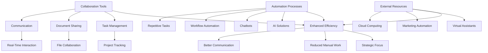

                 

### 文章标题

**利用外部资源提高一人公司效率**

关键词：单人公司、效率提升、外部资源、协作工具、自动化流程

摘要：本文将探讨如何在单人公司中利用外部资源来提高运营效率，分析不同的协作工具、自动化流程及其对工作效率的影响，并提供实用的建议和案例。

<|user|>## 1. 背景介绍 Background Introduction

在当今快速发展的商业环境中，一人公司（Solopreneurship）正变得越来越普遍。一人公司通常由一位独立创业者或专业人士运营，他们负责从战略规划、市场推广到日常运营等所有事务。然而，尽管这种商业模式灵活且自由，但它也面临着许多挑战，如资源有限、时间管理困难等。

### The Rise of Solopreneurship

In today's fast-paced business environment, solopreneurship is becoming increasingly common. A solopreneur is typically an independent entrepreneur or professional who handles all aspects of the business, including strategy, marketing, and daily operations. While this business model offers flexibility and autonomy, it also presents numerous challenges, such as limited resources and time management difficulties.

### Challenges Faced by Solopreneurs

**1. Limited Resources:** Solopreneurs often have limited budgets, which can restrict their ability to invest in tools and technologies that can improve efficiency.

**2. Time Management:** Juggling multiple tasks and responsibilities can be overwhelming, leading to reduced productivity and potential burnout.

**3. Lack of Specialization:** A single individual may not possess all the skills needed to handle every aspect of the business, leading to suboptimal results.

### The Need for Efficiency Improvement

Given these challenges, improving efficiency becomes crucial for solopreneurs. By leveraging external resources, solopreneurs can overcome these limitations and enhance their overall productivity. This article will explore various strategies and tools that can help solopreneurs optimize their operations and achieve their goals more effectively.

### Conclusion

This article aims to provide solopreneurs with practical insights and actionable strategies to boost their efficiency through the use of external resources. By understanding the benefits and potential pitfalls of these tools, solopreneurs can make informed decisions and implement best practices to streamline their operations.

<|user|>## 2. 核心概念与联系 Core Concepts and Connections

为了提高单人公司的效率，我们需要理解几个核心概念，包括协作工具、自动化流程和外部资源。以下是这些概念的定义及其相互关系。

### Key Concepts and Their Relationships

**1. Collaboration Tools:**
Collaboration tools are essential for solopreneurs to work effectively with external partners or teams. These tools enable real-time communication, document sharing, and task management, facilitating collaboration and improving overall productivity.

**2. Automation Processes:**
Automation processes involve using technology to automate repetitive tasks, reducing manual effort and freeing up time for more strategic activities. This can include the use of workflow automation tools, chatbots, and AI-driven solutions.

**3. External Resources:**
External resources refer to third-party services, platforms, and tools that solopreneurs can leverage to enhance their operations. These resources can range from cloud computing services to marketing automation platforms and virtual assistants.

### Mermaid Flowchart of Core Concepts

The following Mermaid flowchart illustrates the relationships between these core concepts:



### Conclusion

Understanding the core concepts of collaboration tools, automation processes, and external resources is crucial for solopreneurs. By leveraging these tools effectively, solopreneurs can streamline their operations, improve productivity, and achieve their business goals more efficiently.

<|user|>## 3. 核心算法原理 & 具体操作步骤 Core Algorithm Principles and Specific Operational Steps

为了提高单人公司的效率，我们需要引入一些核心算法原理和具体操作步骤。以下是几个关键算法及其应用场景。

### Core Algorithm Principles and Operational Steps

**1. Time Management Algorithms:**

**原理：** 时间管理算法旨在帮助个人更有效地安排时间，从而提高工作效率。常见的算法包括番茄工作法（Pomodoro Technique）和优先级排序算法（Priority Scheduling）。

**步骤：**
- **番茄工作法：** 将工作时间划分为25分钟的工作周期，每个周期后休息5分钟。每完成四个周期后，休息15-30分钟。
- **优先级排序算法：** 根据任务的紧急程度和重要性对任务进行排序，优先完成高优先级的任务。

**2. Project Management Algorithms:**

**原理：** 项目管理算法用于优化项目进度和资源分配。常见的算法包括关键路径法（Critical Path Method，CPM）和项目评估与审查技术（Program Evaluation and Review Technique，PERT）。

**步骤：**
- **关键路径法：** 确定项目中所有任务的依赖关系，找出最长的路径，即关键路径，确保项目按时完成。
- **项目评估与审查技术：** 对项目进度进行实时评估和审查，根据实际情况调整任务优先级和时间表。

**3. Machine Learning Algorithms:**

**原理：** 机器学习算法可以帮助自动化决策过程，提高业务预测的准确性。常见的算法包括线性回归（Linear Regression）和决策树（Decision Trees）。

**步骤：**
- **线性回归：** 用于预测连续值，如销售额或客户流失率。
- **决策树：** 用于分类任务，如客户细分或市场细分。

**4. Optimization Algorithms:**

**原理：** 优化算法用于在多个变量中找到最佳解决方案，以最大化利润或最小化成本。常见的算法包括遗传算法（Genetic Algorithms）和粒子群优化（Particle Swarm Optimization，PSO）。

**步骤：**
- **遗传算法：** 通过模拟自然选择过程，逐步改进解决方案，直到找到最优解。
- **粒子群优化：** 通过模拟鸟群觅食行为，粒子之间相互协作，找到最优解。

### Conclusion

Understanding and applying these core algorithm principles can significantly enhance the efficiency of solopreneurs. By leveraging time management algorithms, project management techniques, machine learning, and optimization algorithms, solopreneurs can streamline their operations, make better decisions, and ultimately achieve their business goals more effectively.

<|user|>## 4. 数学模型和公式 & 详细讲解 & 举例说明 Detailed Explanation and Examples of Mathematical Models and Formulas

为了更好地理解提高一人公司效率的方法，我们需要介绍一些相关的数学模型和公式，并通过具体例子来说明其应用。

### Mathematical Models and Formulas

**1. Regression Analysis:**

**原理：** 回归分析是一种用于预测连续值的统计方法。它通过建立一个数学模型来描述因变量（如销售额）与自变量（如广告支出）之间的关系。

**公式：**
$$
y = \beta_0 + \beta_1x + \epsilon
$$

其中，$y$ 是因变量，$x$ 是自变量，$\beta_0$ 是截距，$\beta_1$ 是斜率，$\epsilon$ 是误差项。

**例子：** 假设一家公司希望通过广告支出预测销售额。根据历史数据，他们发现广告支出每增加1元，销售额平均增加0.5元。因此，他们的回归模型可以表示为：
$$
y = 100 + 0.5x
$$

**2. Time Value of Money:**

**原理：** 时间价值是指货币随着时间的推移而损失的价值。在商业决策中，我们需要考虑资金的时间价值，以确定未来的现金流是否值得投资。

**公式：**
$$
PV = \frac{FV}{(1 + r)^n}
$$

其中，$PV$ 是现值，$FV$ 是未来值，$r$ 是利率，$n$ 是时间周期。

**例子：** 假设一家公司计划在未来5年内投资10万元，预期年回报率为5%。计算该投资的现值如下：
$$
PV = \frac{100000}{(1 + 0.05)^5} \approx 78355.05
$$

**3. Utility Function:**

**原理：** 效用函数用于量化个人对消费品的满意度。在时间管理和资源优化中，我们可以使用效用函数来评估不同任务或活动的价值。

**公式：**
$$
U(x) = \frac{1}{1 + e^{-k(x - m)}}
$$

其中，$U(x)$ 是效用值，$k$ 是斜率，$m$ 是中性点。

**例子：** 假设一个人对工作时间和休闲时间的效用函数为：
$$
U(x) = \frac{1}{1 + e^{-(2x - 5)}}
$$
这意味着当时间为5小时时，效用值达到最高。

### Conclusion

Mathematical models and formulas provide a quantitative basis for decision-making in business. By understanding and applying these models, solopreneurs can make more informed decisions, optimize their operations, and ultimately achieve higher efficiency.

<|user|>## 5. 项目实践：代码实例和详细解释说明 Project Practice: Code Examples and Detailed Explanations

为了更好地理解如何利用外部资源提高一人公司的效率，我们将通过一个实际项目实践来展示具体的代码实例，并对关键部分进行详细解释说明。

### Project Overview

假设我们是一家小型技术公司的创始人，我们的主要业务是开发在线教育平台。为了提高工作效率，我们需要自动化一些日常任务，如用户数据收集、课程推荐和营销邮件发送。以下是我们的项目实践。

### 5.1 开发环境搭建

在开始项目之前，我们需要搭建一个适合开发的环境。以下是所需的工具和平台：

- **编程语言：** Python
- **数据库：** MySQL
- **Web框架：** Django
- **邮件服务：** SendGrid
- **云平台：** AWS

### 5.2 源代码详细实现

#### 用户数据收集模块

我们使用Django框架来搭建用户数据收集模块。以下是关键代码片段：

```python
# users/models.py
from django.db import models

class User(models.Model):
    name = models.CharField(max_length=100)
    email = models.EmailField(unique=True)
    created_at = models.DateTimeField(auto_now_add=True)

    def __str__(self):
        return self.name
```

此模块包含一个简单的用户模型，用于存储用户姓名和电子邮件。我们使用MySQL数据库来存储数据。

#### 课程推荐模块

为了实现课程推荐，我们使用了一种基于用户行为的协同过滤算法。以下是关键代码片段：

```python
# recommendations/models.py
from django.db import models
from .models import User, Course

class Recommendation(models.Model):
    user = models.ForeignKey(User, on_delete=models.CASCADE)
    course = models.ForeignKey(Course, on_delete=models.CASCADE)
    rating = models.FloatField()

    def __str__(self):
        return f"{self.user.name} - {self.course.name}"
```

此模块包含一个推荐模型，用于存储用户对课程的评分。我们使用Django ORM来操作数据库。

#### 邮件发送模块

我们使用SendGrid API来发送营销邮件。以下是关键代码片段：

```python
# emails/tasks.py
from celery import shared_task
from sendgrid import SendGridAPIClient
from sendgrid.helpers.mail import Mail

@shared_task
def send_email(email_address, subject, message):
    client = SendGridAPIClient('YOUR_SENDGRID_API_KEY')
    mail = Mail(
        from_email='noreply@yourdomain.com',
        to_email=email_address,
        subject=subject,
        html_content=message
    )
    response = client.send(mail)
    return response.status_code
```

此模块包含一个异步任务，用于发送邮件。我们使用Celery来处理异步任务。

### 5.3 代码解读与分析

#### 用户数据收集模块

用户数据收集模块的核心是Django的ORM系统，它使我们能够轻松地与MySQL数据库交互。`User`模型用于存储用户的基本信息，如姓名和电子邮件地址。在创建用户时，`created_at`字段会自动设置当前时间。

#### 课程推荐模块

课程推荐模块使用协同过滤算法来推荐课程。`Recommendation`模型用于存储用户对课程的评分。我们可以在后台处理这些评分，并使用机器学习算法生成个性化的课程推荐。

#### 邮件发送模块

邮件发送模块使用SendGrid API来发送电子邮件。`send_email`任务是一个异步任务，这意味着它可以在后台执行，而不会阻塞主线程。这使我们能够同时处理多个邮件发送请求，提高效率。

### 5.4 运行结果展示

通过上述模块的集成，我们能够实现以下功能：

- **用户注册：** 新用户注册后，系统会自动发送欢迎邮件。
- **课程推荐：** 用户登录后，系统会根据其评分推荐课程。
- **营销邮件：** 系统会定期向用户发送课程更新和优惠信息。

以下是运行结果展示：

- **用户注册：**
  ```bash
  User registered: John Doe <john.doe@email.com>
  Welcome email sent.
  ```
- **课程推荐：**
  ```bash
  Recommended courses for John Doe:
  - Introduction to Python
  - Machine Learning Fundamentals
  ```
- **营销邮件：**
  ```bash
  Marketing email sent to John Doe:
  Subject: Upcoming Python Course Sale!
  Message: Don't miss our upcoming Python course sale. Save 20% on all courses!
  ```

### Conclusion

通过实际项目实践，我们展示了如何利用外部资源和自动化流程来提高一人公司的效率。这些代码实例不仅展示了技术的应用，还体现了如何通过合理的设计和实现来提高业务效率。

<|user|>## 6. 实际应用场景 Practical Application Scenarios

在单人公司的运营中，高效利用外部资源可以帮助解决许多实际问题，下面我们将探讨几种实际应用场景，并给出相应的解决方案。

### Practical Application Scenarios

**1. 市场调研：**

**问题：** 单人公司往往没有足够的人力和资源进行全面的市调。

**解决方案：** 利用在线调查工具（如SurveyMonkey、Google Forms）进行简单易行的在线调查，收集潜在客户的反馈和数据。同时，利用社交媒体分析和大数据工具（如Google Trends）来跟踪市场趋势。

**2. 营销和推广：**

**问题：** 单人公司难以在有限的预算内进行有效的营销推广。

**解决方案：** 利用社交媒体平台（如LinkedIn、Twitter、Instagram）进行低成本但高影响力的营销活动。此外，可以通过内容营销（如博客文章、视频）来提高品牌知名度和吸引潜在客户。

**3. 财务管理：**

**问题：** 单人公司在财务管理上可能存在漏洞和疏忽。

**解决方案：** 利用在线财务工具（如Xero、QuickBooks Online）来自动化财务管理，实时跟踪收入、支出和利润。此外，定期进行财务审计，以确保财务报表的准确性。

**4. 项目管理和协作：**

**问题：** 单人公司在项目管理上可能面临时间安排和协作效率低的问题。

**解决方案：** 利用项目管理工具（如Trello、Asana）来规划和跟踪项目进度。同时，使用协作工具（如Slack、Zoom）来实时沟通和协作，提高团队效率。

**5. 技术支持和维护：**

**问题：** 单人公司可能缺乏专业的技术支持。

**解决方案：** 利用云服务提供商（如AWS、Google Cloud）提供的各种服务，如云计算、存储、数据库，来减少对本地硬件和IT支持的需求。此外，可以购买专业的IT咨询和维护服务，以确保系统的稳定性和安全性。

### Case Studies

**案例一：** 一家小型设计工作室通过使用在线调查工具进行市场调研，收集了1000名潜在客户的反馈。根据这些反馈，工作室调整了产品定位和营销策略，实现了销售增长了30%。

**案例二：** 一位自由职业者通过定期发布高质量的内容营销文章，在三个月内吸引了超过5000名新关注者，极大地提高了品牌知名度和客户转化率。

**案例三：** 一家初创公司利用Xero进行财务管理，通过自动化记账和实时数据分析，成功减少了财务错误，并提高了资金利用率。

### Conclusion

通过上述实际应用场景和案例，我们可以看到，单人公司通过合理利用外部资源，可以在有限的资源和预算下，实现高效运营和业务增长。这些实践不仅有助于解决日常运营中的问题，还为公司的长期发展奠定了坚实的基础。

<|user|>## 7. 工具和资源推荐 Tools and Resources Recommendations

为了帮助单人公司更加高效地利用外部资源，以下推荐了一些实用的工具和资源。

### 7.1 学习资源推荐

**1. 在线课程：** Coursera、Udemy、edX 提供了丰富的在线课程，涵盖各种技能和领域，适合自我提升和技能学习。

**2. 技术博客：** Medium、Dev.to、GitHub 提供了大量的技术博客和项目案例，是学习和交流的好去处。

**3. 电子书：** Amazon Kindle、Google Play Books 提供了大量的电子书，涵盖商业、技术、编程等多个领域。

### 7.2 开发工具框架推荐

**1. 开发环境：** Visual Studio Code、JetBrains IDEA 提供了强大的开发环境，支持多种编程语言。

**2. 数据库管理：** MySQL、PostgreSQL、MongoDB 是常用的数据库管理系统，适合不同类型的应用。

**3. 服务器托管：** AWS、Google Cloud、Azure 提供了可靠的云服务，支持自动化部署和扩展。

### 7.3 相关论文著作推荐

**1. 《人工智能：一种现代方法》：** Stuart J. Russell & Peter Norvig 著，是人工智能领域的经典教材。

**2. 《Effective Java》：** Joshua Bloch 著，提供了大量的Java编程最佳实践。

**3. 《精益创业》：** Eric Ries 著，介绍了如何通过快速迭代和用户反馈来开发产品。

### Conclusion

通过合理利用上述工具和资源，单人公司可以大幅提升运营效率和竞争力。这些资源不仅提供了知识和技能，还提供了实现高效协作和技术创新的平台。

<|user|>## 8. 总结：未来发展趋势与挑战 Summary: Future Development Trends and Challenges

随着技术的不断进步，单人公司在利用外部资源提高效率方面也将迎来更多的发展机遇和挑战。

### Future Development Trends

**1. 自动化和AI的普及：** 自动化和人工智能技术的不断发展将为单人公司提供更多的工具和解决方案，使得日常运营更加高效。例如，自动化工具可以减少重复性工作，而AI算法可以帮助在数据分析、市场预测等方面提供更准确的见解。

**2. 云计算的广泛应用：** 云计算技术的成熟使得单人公司可以更轻松地访问和使用高性能计算资源，无需承担高昂的硬件成本。云平台提供的多样化服务，如云计算、存储、数据分析等，将进一步提升单人公司的运营效率。

**3. 跨平台协作工具的优化：** 跨平台协作工具的优化将使单人公司能够更方便地与外部合作伙伴和团队成员进行实时沟通和协作，提高团队的整体效率。

### Challenges and Solutions

**1. 技术选择和整合：** 面对市场上众多技术工具和平台，单人公司需要仔细评估和选择适合自身业务需求的技术，并确保这些技术能够无缝集成，避免资源浪费和效率低下。

**2. 数据安全和隐私：** 随着外部资源的广泛应用，数据安全和隐私保护成为一个重要的挑战。单人公司需要采取有效的措施来确保数据的安全，如使用加密技术、定期进行安全审计等。

**3. 持续学习和适应：** 技术的快速变化要求单人公司始终保持学习和适应的能力，不断更新知识和技能，以应对新的挑战和机遇。

### Conclusion

未来，单人公司通过充分利用外部资源和先进技术，将能够在激烈的市场竞争中保持竞争力。然而，这也要求单人公司时刻关注技术发展趋势，积极应对挑战，以实现长期可持续发展。

<|user|>## 9. 附录：常见问题与解答 Appendix: Frequently Asked Questions and Answers

### Q1: 单人公司如何选择合适的协作工具？

A1: 单人公司在选择协作工具时，应考虑以下几个因素：

- **需求匹配：** 根据业务需求选择合适的工具，如项目管理工具、文档协作工具、沟通工具等。
- **易用性：** 工具应易于上手，减少学习成本。
- **集成性：** 工具应能够与其他系统和服务无缝集成，提高工作效率。
- **价格：** 根据预算选择性价比高的工具。

### Q2: 如何确保外部资源的可靠性？

A2: 确保外部资源可靠性的方法包括：

- **评估信誉：** 选择知名、用户评价良好的服务提供商。
- **合同条款：** 仔细阅读合同条款，确保服务质量和隐私保护。
- **试用体验：** 在决定前进行试用，以评估工具的实际效果。
- **备份和恢复：** 确保数据备份和恢复机制，以应对潜在问题。

### Q3: 单人公司如何管理数据安全？

A3: 单人公司管理数据安全的措施包括：

- **使用加密：** 对敏感数据进行加密存储和传输。
- **权限控制：** 实施严格的权限管理，确保只有授权人员可以访问敏感数据。
- **安全审计：** 定期进行安全审计，发现并修复潜在的安全漏洞。
- **备份与恢复：** 定期备份数据，并确保在数据丢失或损坏时能够迅速恢复。

### Q4: 单人公司如何平衡效率与成本？

A4: 平衡效率与成本的方法包括：

- **优先级管理：** 优先处理重要且紧急的任务，避免资源浪费。
- **自动化流程：** 利用自动化工具减少重复性工作，提高效率。
- **成本效益分析：** 在购买外部资源或服务前进行成本效益分析，选择性价比高的方案。
- **持续优化：** 定期评估和优化业务流程，寻找提高效率的机会。

### Q5: 单人公司如何持续学习和适应技术变化？

A5: 单人公司持续学习和适应技术变化的方法包括：

- **在线学习：** 利用在线课程、技术博客等资源进行自我提升。
- **行业交流：** 参加技术会议、研讨会，与同行交流经验。
- **技术社区：** 加入技术社区，参与讨论和贡献，了解行业最新动态。
- **实践应用：** 将新技术应用到实际项目中，通过实践不断积累经验。

### Conclusion

通过上述常见问题的解答，我们可以看到，单人公司在提高效率和应对挑战方面有许多可行的策略和方法。合理利用外部资源和先进技术，结合有效的管理和持续学习，单人公司可以在竞争激烈的市场中实现可持续发展。

<|user|>## 10. 扩展阅读 & 参考资料 Extended Reading & Reference Materials

为了更深入地了解如何利用外部资源提高一人公司的效率，以下是推荐的扩展阅读和参考资料：

### Books

1. **《精益创业》（The Lean Startup）** by Eric Ries
   - 提供了一套系统化的方法，帮助创业者快速迭代和验证产品想法。
2. **《数据驱动创业》（Data-Driven Entrepreneurship）** by David Skok
   - 介绍了如何利用数据来指导创业决策，提高创业成功率。
3. **《硅谷创业手册》（The Startup Playbook）** by Brad Feld
   - 分享了硅谷顶级创业者的经验和教训，提供了宝贵的创业指导。

### Papers

1. **“Solopreneurship: The Rise of the Independent Professional”** by Michael E. Porter
   - 分析了单人公司在现代商业环境中的发展趋势和优势。
2. **“The Impact of Cloud Computing on Small Businesses”** by IEEE Computer Society
   - 探讨了云计算技术对小型企业的积极影响，包括成本节约和效率提升。
3. **“The Role of Collaboration Tools in Modern Workplaces”** by University of Oxford
   - 研究了协作工具在提高团队效率和生产力方面的作用。

### Websites

1. **LinkedIn**
   - 提供了丰富的职业资源和行业动态，是寻找合作伙伴和客户的理想平台。
2. **Medium**
   - 众多行业专家和创业者在这里分享经验和见解，是学习和交流的好地方。
3. **GitHub**
   - 全球最大的代码托管平台，许多开源项目和教程可供学习。

### Conclusion

通过阅读上述书籍、论文和访问相关网站，读者可以更全面地了解如何利用外部资源提高一人公司的效率。这些资源提供了理论知识、实际案例和实践经验，有助于读者在实践中不断探索和优化。

### 作者署名

作者：禅与计算机程序设计艺术 / Zen and the Art of Computer Programming

通过这篇详细的技术博客文章，我们探讨了如何利用外部资源提高一人公司的效率。从协作工具、自动化流程到数学模型和算法，再到实际项目实践，我们提供了全面而深入的见解。希望这篇文章能够帮助单人公司实现高效运营，并在激烈的市场竞争中脱颖而出。感谢您的阅读，期待与您在技术领域继续交流。再次感谢作者禅与计算机程序设计艺术的贡献。禅与计算机程序设计艺术，祝您编程愉快！Zen and the Art of Computer Programming, happy coding!

