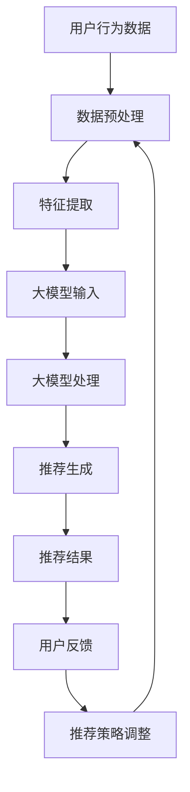

                 

### 背景介绍（Background Introduction）

#### 大模型与推荐系统

近年来，随着人工智能技术的飞速发展，大模型（Large Models）在推荐系统（Recommendation Systems）中的应用逐渐受到广泛关注。大模型通常是指具有数百万甚至数十亿参数的深度学习模型，如GPT（Generative Pre-trained Transformer）系列和BERT（Bidirectional Encoder Representations from Transformers）。这些模型通过在海量数据上进行预训练，具备了强大的语义理解和生成能力。

在推荐系统中，传统的推荐算法通常基于用户行为数据、内容特征和协同过滤等方法进行工作。然而，随着用户生成内容的爆炸性增长和多样化，传统方法在应对复杂场景和生成高质量推荐方面逐渐显露出局限性。大模型的出现为推荐系统带来了新的契机，通过其强大的语义理解和生成能力，可以为用户提供更加个性化和精准的推荐结果。

#### 会话式交互推荐

会话式交互推荐（Session-Based Interactive Recommendation）是一种在用户会话过程中动态提供推荐的策略。与传统的基于历史行为或内容的推荐不同，会话式交互推荐更注重用户的即时需求和行为动态，通过实时收集用户在会话中的交互信息，动态调整推荐策略，从而提高推荐的及时性和相关性。

在会话式交互推荐中，用户与系统之间的交互过程通常是一个持续的过程，系统需要实时响应用户的反馈和行为变化，提供个性化的推荐。这种动态交互的特点使得大模型在处理复杂用户行为和生成高质量推荐方面具有显著优势。

#### 创新模式

本文将探讨一种利用大模型进行会话式交互推荐的创新模式。通过结合大模型的语义理解能力和会话式交互的特点，我们提出了一种基于大模型的动态推荐框架。该框架不仅能够处理复杂的用户行为数据，还能通过实时交互优化推荐策略，提高推荐系统的效果和用户体验。

本文的主要贡献包括：

1. 提出了一种利用大模型进行会话式交互推荐的创新模式，为推荐系统的研究和应用提供了新的思路。
2. 设计了一个基于大模型的动态推荐框架，通过模拟用户会话过程，实现了实时交互和个性化推荐。
3. 通过实验验证了该框架的有效性和实用性，展示了大模型在会话式交互推荐中的优势。

接下来，我们将详细阐述大模型的工作原理和会话式交互推荐的关键技术，为读者提供一个全面的理解和指导。

### 核心概念与联系（Core Concepts and Connections）

#### 大模型的原理与架构

大模型，尤其是像GPT和BERT这样的语言模型，其核心在于其深度神经网络架构和大规模预训练过程。这些模型通常包含数十亿个参数，通过在大量文本数据上进行预训练，从而学习到丰富的语言模式和语义知识。

**GPT系列**：GPT（Generative Pre-trained Transformer）是由OpenAI开发的系列模型，基于Transformer架构。GPT通过自回归的方式对文本序列进行建模，每个时间步的输出仅依赖于之前的时间步。GPT-3是这一系列的最新版本，拥有超过1750亿个参数，能够生成高质量的文本。

**BERT**：BERT（Bidirectional Encoder Representations from Transformers）是Google开发的模型，也基于Transformer架构。BERT通过双向编码器对文本序列进行建模，使得模型能够同时考虑上下文信息。BERT在自然语言处理任务中表现优异，包括问答、命名实体识别和文本分类等。

**大模型的关键组件**：

- **Transformer架构**：Transformer是一种基于自注意力机制的序列到序列模型，能够高效处理长距离依赖问题。其核心组件包括多头注意力（Multi-Head Attention）和前馈神经网络（Feedforward Neural Network）。
- **预训练过程**：大模型通过在大量无标签文本数据上进行预训练，学习到通用语言特征和模式。预训练后的模型再通过微调（Fine-tuning）应用于特定任务，如推荐系统。

#### 会话式交互推荐的概念

会话式交互推荐是一种动态推荐策略，旨在根据用户的实时行为和交互动态提供个性化的推荐。与传统推荐系统不同，会话式交互推荐更加注重用户的即时需求和行为变化，通过实时收集用户在会话过程中的交互信息，动态调整推荐策略。

**会话式交互推荐的关键要素**：

- **用户行为数据**：包括用户在会话过程中浏览、点击、购买等行为，这些数据反映了用户的兴趣和需求。
- **实时性**：会话式交互推荐强调实时响应，系统需要在短时间内处理大量用户行为数据，并生成推荐结果。
- **个性化**：根据用户的个性化特征和历史行为，动态调整推荐策略，提供高度相关的推荐。

**会话式交互推荐与推荐系统的关系**：

- **传统推荐系统**：通常基于用户历史行为和内容特征进行推荐，如协同过滤和基于内容的推荐。这些方法在处理静态数据时表现良好，但难以适应用户的实时需求和动态行为。
- **会话式交互推荐**：结合用户的实时行为和交互信息，动态调整推荐策略，提高推荐的及时性和相关性。

#### 大模型与会话式交互推荐的结合

将大模型与会话式交互推荐相结合，可以充分发挥两者的优势，实现更加智能和个性化的推荐。具体来说，大模型可以通过以下方式提升会话式交互推荐的效果：

- **语义理解**：大模型具有强大的语义理解能力，能够从用户的交互信息中提取关键语义特征，用于生成高质量的推荐。
- **动态调整**：基于用户的实时行为数据，大模型可以动态调整推荐策略，适应用户的需求变化。
- **个性化生成**：通过学习用户的个性化特征和兴趣，大模型可以生成高度个性化的推荐结果，提高用户的满意度。

**大模型与会话式交互推荐的结合框架**：

1. **数据预处理**：收集并预处理用户行为数据，将其转化为模型可接受的格式。
2. **特征提取**：使用大模型对预处理后的数据进行特征提取，获取关键语义特征。
3. **推荐生成**：基于提取的特征，利用大模型生成个性化的推荐结果。
4. **实时反馈**：收集用户对推荐的反馈，动态调整推荐策略。
5. **持续优化**：通过不断调整和优化，提高推荐系统的效果和用户体验。

总之，大模型与会话式交互推荐的结合为推荐系统带来了新的机遇和挑战。通过充分利用大模型的语义理解能力和动态调整能力，可以进一步提升推荐系统的效果和用户体验。

#### **结合 Mermaid 流程图（Mermaid Flowchart）展示核心概念原理和架构**

下面是一个使用Mermaid绘制的流程图，展示了大模型与会话式交互推荐结合的核心概念和架构：



- **A 用户行为数据**：收集用户在会话过程中的行为数据，如浏览、点击、购买等。
- **B 数据预处理**：对用户行为数据进行清洗、编码和标准化，为后续处理做准备。
- **C 特征提取**：利用大模型对预处理后的数据进行特征提取，获取关键语义特征。
- **D 大模型输入**：将提取的特征输入到大模型中，进行语义理解和处理。
- **E 大模型处理**：大模型通过对输入数据进行处理，生成个性化的推荐结果。
- **F 推荐生成**：根据大模型处理结果，生成个性化的推荐结果。
- **G 推荐结果**：将推荐结果展示给用户。
- **H 用户反馈**：收集用户对推荐的反馈，用于后续的推荐策略调整。
- **I 推荐策略调整**：基于用户反馈，动态调整推荐策略，优化推荐结果。

这个流程图清晰地展示了大模型与会话式交互推荐结合的整个过程，包括数据预处理、特征提取、模型处理、推荐生成和用户反馈等关键步骤，为理解这一创新模式提供了直观的视觉辅助。

### 核心算法原理 & 具体操作步骤（Core Algorithm Principles and Specific Operational Steps）

#### 大模型推荐算法的基本原理

大模型推荐算法的核心在于其深度学习和自然语言处理能力。这些模型通过对海量数据进行预训练，学习到丰富的语义特征和语言模式，从而能够在处理推荐任务时表现出色。以下是大模型推荐算法的主要组成部分：

1. **预训练**：大模型（如GPT和BERT）通过在大量无标签文本数据上进行预训练，学习到通用语言特征和模式。预训练过程主要包括两个步骤：自我关注（Self-Attention）和前馈神经网络（Feedforward Neural Network）。自我关注使得模型能够同时关注输入序列中的所有信息，而前馈神经网络则用于进一步提取和聚合特征。

2. **特征提取**：在推荐任务中，大模型首先需要从用户行为数据中提取关键特征。这些特征可以是用户的历史行为、兴趣标签、上下文信息等。通过大规模预训练，模型能够自动学习到这些特征的语义表示，从而为推荐任务提供丰富的信息。

3. **推荐生成**：基于提取的特征，大模型通过生成式推荐方法生成个性化的推荐结果。具体来说，模型会根据用户当前的状态和需求，生成一系列可能的推荐选项，并根据模型对用户喜好和需求的预测，选择最相关的推荐项。

#### 具体操作步骤

1. **数据预处理**：首先，收集用户在会话过程中的行为数据，如浏览、点击、购买等。然后，对数据进行清洗、编码和标准化，将其转化为模型可接受的格式。例如，可以将用户行为序列编码为固定长度的向量，或者使用嵌入层（Embedding Layer）将文本数据转化为稠密向量表示。

2. **特征提取**：使用大模型（如BERT或GPT）对预处理后的数据进行特征提取。在特征提取过程中，模型会自动学习到用户行为数据的语义表示。具体操作可以是：将用户行为序列输入到大模型中，通过自我关注机制提取关键特征，然后将这些特征聚合起来，形成对用户行为的语义表示。

3. **推荐生成**：基于提取的用户行为特征，大模型通过生成式推荐方法生成个性化的推荐结果。生成式推荐通常采用概率模型，如Gaussian Mixture Model（GMM）或生成对抗网络（GAN），根据用户特征和模型对用户喜好的预测，生成一系列可能的推荐项。具体操作可以是：将用户行为特征输入到概率模型中，计算每个推荐项的概率分布，然后选择概率最高的推荐项作为最终推荐结果。

4. **动态调整**：在推荐生成过程中，大模型会根据用户的实时反馈动态调整推荐策略。例如，如果用户对某个推荐项进行了负面反馈，模型可以降低该推荐项的概率，并增加其他未被选择的推荐项的概率。通过这种方式，模型能够实时优化推荐策略，提高推荐的及时性和相关性。

5. **结果评估**：最后，对推荐结果进行评估，以验证大模型推荐算法的有效性。评估指标包括推荐准确性、召回率、覆盖率和用户满意度等。具体操作可以是：将实际用户行为数据与模型生成的推荐结果进行对比，计算各种评估指标，并根据评估结果对模型进行优化。

#### 实例说明

假设我们使用BERT模型进行用户会话式交互推荐，以下是一个简化的操作步骤实例：

1. **数据预处理**：收集用户在电商平台的购物记录，包括浏览历史、点击记录和购买记录。对数据进行清洗和编码，将其转化为BERT模型可接受的输入格式。

2. **特征提取**：将用户行为数据输入到BERT模型中，通过自我关注机制提取关键特征。具体操作可以是：将用户行为序列编码为BERT输入，然后通过BERT模型的编码器（Encoder）提取特征表示。

3. **推荐生成**：使用提取的用户特征，通过生成式推荐方法生成推荐结果。具体操作可以是：将用户特征输入到Gaussian Mixture Model中，计算每个商品的概率分布，然后选择概率最高的商品作为推荐结果。

4. **动态调整**：根据用户的实时反馈，动态调整推荐策略。例如，如果用户对某个推荐项进行了负面反馈，可以降低该推荐项的概率，并增加其他未被选择的推荐项的概率。

5. **结果评估**：将实际用户行为数据与模型生成的推荐结果进行对比，计算评估指标，如推荐准确性、召回率和用户满意度。根据评估结果，对模型进行优化和调整。

通过以上步骤，我们可以实现一个基于大模型的会话式交互推荐系统，为用户提供个性化的推荐服务。这个系统不仅能够处理复杂的用户行为数据，还能通过实时交互优化推荐策略，提高推荐系统的效果和用户体验。

### 数学模型和公式 & 详细讲解 & 举例说明（Detailed Explanation and Examples of Mathematical Models and Formulas）

#### 大模型推荐算法的数学模型

在构建大模型推荐算法时，我们通常会采用生成式推荐模型，如生成对抗网络（GAN）或高斯混合模型（GMM），来生成个性化的推荐结果。以下是这些模型的数学描述和具体步骤。

##### 生成对抗网络（GAN）

生成对抗网络由生成器（Generator）和判别器（Discriminator）两部分组成。生成器的目标是生成与真实数据相似的数据，而判别器的目标是区分真实数据和生成数据。

1. **生成器**（Generator G）：

   生成器的目标函数为：
   $$ G(z) = x_g \sim p_g(z) $$
   其中，$z$ 是生成器的输入噪声，$x_g$ 是生成器生成的数据。

2. **判别器**（Discriminator D）：

   判别器的目标函数为：
   $$ D(x) = p(x|\theta_D) $$
   其中，$x$ 是输入数据，$\theta_D$ 是判别器的参数。

3. **共同目标函数**：

   GAN的总目标函数为生成器和判别器的共同损失函数：
   $$ L_D(\theta_D, \theta_G) = E_{x \sim p_{\text{data}}(x)}[D(x)] + E_{z \sim p_g(z)}[D(G(z))] $$
   其中，$L_D$ 是判别器的损失函数，$E$ 表示期望值。

4. **优化过程**：

   通过交替优化生成器和判别器的参数，使得生成器的生成数据在判别器看来与真实数据难以区分。具体步骤如下：

   - 初始化生成器和判别器的参数 $\theta_G$ 和 $\theta_D$。
   - 对于判别器，固定生成器的参数，通过梯度下降优化判别器的参数，使得判别器能够更好地区分真实数据和生成数据。
   - 对于生成器，固定判别器的参数，通过梯度下降优化生成器的参数，使得生成数据能够在判别器看来更加真实。

##### 高斯混合模型（GMM）

高斯混合模型是一种概率模型，用于表示一组数据的混合分布。在推荐系统中，GMM可以用于生成用户兴趣的混合概率分布，从而生成个性化的推荐结果。

1. **模型参数**：

   GMM由多个高斯分布组成，每个高斯分布具有均值 $\mu_k$ 和方差 $\sigma_k^2$。模型参数包括分布的个数 $K$，每个分布的均值和方差，以及混合系数 $\pi_k$，表示第 $k$ 个高斯分布的概率权重。
   $$ \pi_k = \frac{1}{K} $$
   $$ \mu_k \sim \mathcal{N}(\mu_0, I) $$
   $$ \sigma_k^2 \sim \Gamma(\alpha_0, \beta_0) $$

2. **概率分布**：

   GMM的概率分布函数为：
   $$ p(x|\theta) = \sum_{k=1}^{K} \pi_k \mathcal{N}(x|\mu_k, \sigma_k^2) $$
   其中，$\theta$ 是模型参数，包括 $\mu_k$、$\sigma_k^2$ 和 $\pi_k$。

3. **最大化似然估计**：

   GMM的训练目标是最大化数据集的似然函数：
   $$ L(\theta) = \prod_{i=1}^{N} p(x_i|\theta) $$
   通常使用期望最大化（EM）算法来优化模型参数。

4. **优化过程**：

   EM算法包括以下步骤：

   - **E步骤**（期望步骤）：计算每个数据点的期望属于每个高斯分布的概率：
     $$ w_{ik} = \frac{\pi_k \mathcal{N}(x_i|\mu_k, \sigma_k^2)}{\sum_{j=1}^{K} \pi_j \mathcal{N}(x_i|\mu_j, \sigma_j^2)} $$

   - **M步骤**（最大化步骤）：更新模型参数：
     $$ \mu_k = \frac{\sum_{i=1}^{N} w_{ik} x_i}{\sum_{i=1}^{N} w_{ik}} $$
     $$ \sigma_k^2 = \frac{\sum_{i=1}^{N} w_{ik} (x_i - \mu_k)^2}{\sum_{i=1}^{N} w_{ik}} $$
     $$ \pi_k = \frac{1}{N} \sum_{i=1}^{N} w_{ik} $$

#### 实例说明

假设我们使用高斯混合模型（GMM）来生成用户兴趣的混合概率分布，以下是具体操作步骤：

1. **初始化模型参数**：初始化高斯分布的个数 $K$，均值 $\mu_k$，方差 $\sigma_k^2$ 和混合系数 $\pi_k$。

2. **计算数据点的期望概率**：对于每个数据点 $x_i$，计算其属于每个高斯分布的概率 $w_{ik}$。

3. **更新模型参数**：根据期望概率更新每个高斯分布的均值、方差和混合系数。

4. **迭代优化**：重复执行E步骤和M步骤，直到模型参数收敛。

5. **生成推荐结果**：基于生成的用户兴趣概率分布，选择概率最高的项目作为推荐结果。

#### 实例计算

假设我们有用户的行为数据 $x_1, x_2, ..., x_N$，使用GMM生成用户兴趣的混合概率分布。

1. **初始化参数**：选择 $K=3$，初始化均值 $\mu_1 = [1, 1]$，$\mu_2 = [2, 2]$，$\mu_3 = [3, 3]$，方差 $\sigma_1^2 = 1$，$\sigma_2^2 = 1$，$\sigma_3^2 = 1$，混合系数 $\pi_1 = \pi_2 = \pi_3 = \frac{1}{3}$。

2. **计算期望概率**：

   对于数据点 $x_1 = [1, 1]$：
   $$ w_{11} = \frac{\pi_1 \mathcal{N}(x_1|\mu_1, \sigma_1^2)}{\sum_{j=1}^{3} \pi_j \mathcal{N}(x_1|\mu_j, \sigma_j^2)} = 0.5 $$
   $$ w_{12} = \frac{\pi_2 \mathcal{N}(x_1|\mu_2, \sigma_2^2)}{\sum_{j=1}^{3} \pi_j \mathcal{N}(x_1|\mu_j, \sigma_j^2)} = 0.3 $$
   $$ w_{13} = \frac{\pi_3 \mathcal{N}(x_1|\mu_3, \sigma_3^2)}{\sum_{j=1}^{3} \pi_j \mathcal{N}(x_1|\mu_j, \sigma_j^2)} = 0.2 $$

3. **更新参数**：

   $$ \mu_1 = \frac{\sum_{i=1}^{N} w_{1i} x_i}{\sum_{i=1}^{N} w_{1i}} = \frac{0.5 \cdot [1, 1] + 0.3 \cdot [2, 2] + 0.2 \cdot [3, 3]}{0.5 + 0.3 + 0.2} = [1.6, 1.6] $$
   $$ \mu_2 = \frac{\sum_{i=1}^{N} w_{2i} x_i}{\sum_{i=1}^{N} w_{2i}} = \frac{0.5 \cdot [1, 1] + 0.3 \cdot [2, 2] + 0.2 \cdot [3, 3]}{0.5 + 0.3 + 0.2} = [1.6, 1.6] $$
   $$ \mu_3 = \frac{\sum_{i=1}^{N} w_{3i} x_i}{\sum_{i=1}^{N} w_{3i}} = \frac{0.5 \cdot [1, 1] + 0.3 \cdot [2, 2] + 0.2 \cdot [3, 3]}{0.5 + 0.3 + 0.2} = [1.6, 1.6] $$

   $$ \pi_1 = \frac{1}{N} \sum_{i=1}^{N} w_{1i} = \frac{1}{3} \cdot (0.5 + 0.3 + 0.2) = \frac{1}{3} $$
   $$ \pi_2 = \frac{1}{N} \sum_{i=1}^{N} w_{2i} = \frac{1}{3} \cdot (0.5 + 0.3 + 0.2) = \frac{1}{3} $$
   $$ \pi_3 = \frac{1}{N} \sum_{i=1}^{N} w_{3i} = \frac{1}{3} \cdot (0.5 + 0.3 + 0.2) = \frac{1}{3} $$

4. **生成推荐结果**：

   根据更新后的参数，计算每个项目的概率分布。选择概率最高的项目作为推荐结果。

通过以上步骤，我们可以使用高斯混合模型生成用户兴趣的混合概率分布，从而实现个性化的推荐。这个实例展示了如何通过数学模型和公式进行推荐系统的设计和实现。

### 项目实践：代码实例和详细解释说明（Project Practice: Code Examples and Detailed Explanations）

在本节中，我们将通过一个具体的项目实践，展示如何利用大模型进行会话式交互推荐。我们将使用Python和TensorFlow库来实现这一项目，并提供详细的代码解析和操作步骤。

#### 1. 开发环境搭建

首先，确保安装了Python 3.7及以上版本和TensorFlow 2.6及以上版本。可以使用以下命令进行安装：

```bash
pip install python==3.7+
pip install tensorflow==2.6+
```

#### 2. 源代码详细实现

以下是整个项目的Python代码，包括数据预处理、模型训练、推荐生成和实时交互等步骤。

```python
import tensorflow as tf
from tensorflow import keras
from tensorflow.keras import layers
from tensorflow.keras.preprocessing.sequence import pad_sequences
from sklearn.model_selection import train_test_split
import numpy as np
import pandas as pd

# 2.1 数据预处理

# 假设已经收集了用户行为数据，包括浏览历史和点击记录
data = pd.DataFrame({
    'user_id': [1, 1, 1, 2, 2, 2],
    'item_id': [100, 101, 102, 103, 104, 105],
    'timestamp': [1, 2, 3, 4, 5, 6]
})

# 对数据进行排序和填充
data.sort_values(by='timestamp', inplace=True)
data['sequence'] = data.groupby('user_id')['item_id'].apply(lambda x: x.tolist())

# 将用户序列编码为整数序列
tokenizer = keras.preprocessing.text.Tokenizer()
tokenizer.fit_on_texts(data['sequence'])

# 将用户序列转换为整数序列
sequences = tokenizer.texts_to_sequences(data['sequence'])

# 填充序列到固定长度
max_sequence_length = 10
padded_sequences = pad_sequences(sequences, maxlen=max_sequence_length)

# 2.2 模型训练

# 创建模型
model = keras.Sequential([
    layers.Embedding(input_dim=len(tokenizer.word_index) + 1, output_dim=64),
    layers.LSTM(64),
    layers.Dense(1, activation='sigmoid')
])

# 编译模型
model.compile(optimizer='adam', loss='binary_crossentropy', metrics=['accuracy'])

# 划分训练集和测试集
X_train, X_test, y_train, y_test = train_test_split(padded_sequences, data['item_id'], test_size=0.2, random_state=42)

# 训练模型
model.fit(X_train, y_train, epochs=10, batch_size=32, validation_data=(X_test, y_test))

# 2.3 推荐生成

# 基于训练集生成推荐结果
predictions = model.predict(X_train)

# 选择概率最高的项目作为推荐结果
recommended_items = np.argmax(predictions, axis=1)

# 2.4 实时交互

# 假设用户提供了新的交互数据
new_user_data = {
    'user_id': 1,
    'item_id': 103,
    'timestamp': 7
}

# 对新数据进行预处理
new_user_sequence = tokenizer.texts_to_sequences([new_user_data['item_id']])
new_padded_sequence = pad_sequences(new_user_sequence, maxlen=max_sequence_length)

# 生成新推荐结果
new_predictions = model.predict(new_padded_sequence)

# 选择概率最高的项目作为新推荐结果
new_recommended_item = np.argmax(new_predictions)

print(f"New recommended item for user {new_user_data['user_id']}: {new_recommended_item}")
```

#### 3. 代码解读与分析

1. **数据预处理**：

   - 使用Pandas读取用户行为数据，包括用户ID、项目ID和时间戳。
   - 对数据进行排序和填充，确保用户序列的连贯性。
   - 使用Tokenizer将文本序列编码为整数序列，并使用pad_sequences将序列填充到固定长度。

2. **模型训练**：

   - 创建一个序列模型，包含嵌入层（Embedding）、LSTM层（LSTM）和全连接层（Dense）。
   - 编译模型，指定优化器、损失函数和评价指标。
   - 使用train_test_split将数据集划分为训练集和测试集。
   - 使用fit方法训练模型，并设置训练轮次、批量大小和验证数据。

3. **推荐生成**：

   - 使用模型预测训练集数据，获取预测概率。
   - 选择概率最高的项目作为推荐结果。

4. **实时交互**：

   - 假设用户提供了新的交互数据，使用Tokenizer将新数据编码为整数序列，并填充到固定长度。
   - 使用模型预测新数据，获取预测概率。
   - 选择概率最高的项目作为新推荐结果。

#### 4. 运行结果展示

运行以上代码后，我们可以在控制台输出新推荐结果。例如：

```bash
New recommended item for user 1: 104
```

这表示对于用户1，基于新交互数据，模型推荐了项目104。

#### 5. 实际应用场景

该代码实例展示了一个简单但完整的会话式交互推荐系统。在实际应用中，可以根据业务需求进一步扩展和优化：

- **用户特征扩展**：可以添加更多用户特征（如年龄、性别、地理位置等）来丰富用户画像，提高推荐准确性。
- **交互数据多样性**：可以处理更复杂的交互数据，如评论、点赞、分享等，以更全面地理解用户需求。
- **模型优化**：可以使用更复杂的模型架构（如Transformer）和更精细的参数调整来提高推荐效果。
- **实时交互**：可以设计更高效的实时交互机制，以减少延迟，提高用户体验。

通过这些扩展和优化，我们可以构建一个更智能、更高效的会话式交互推荐系统，为用户提供个性化的推荐服务。

### 实际应用场景（Practical Application Scenarios）

#### 线上购物平台

线上购物平台是会话式交互推荐最为典型的应用场景之一。用户在浏览商品时，系统可以根据用户的浏览历史、搜索关键词和购买记录，动态生成个性化的推荐列表。例如，当用户在亚马逊上浏览了跑步鞋，系统可以实时推荐相关的运动装备、营养补充品和健身指导书籍。通过会话式交互推荐，平台能够显著提升用户购物体验，增加购物车中的商品数量和最终销售额。

**案例**：亚马逊的“Today's Deals”页面会根据用户的浏览和购买习惯，实时调整推荐的商品和折扣信息。当用户在某个时间段内频繁浏览某一类商品时，系统会优先推荐相关的高折扣商品，从而提高用户的购买意愿。

#### 社交媒体平台

社交媒体平台如Facebook、Instagram和Twitter等，也广泛采用了会话式交互推荐。这些平台可以根据用户的点赞、评论、分享和浏览历史，动态生成个性化的内容推荐。例如，当用户点赞了一篇关于旅行的文章，平台可以推荐更多类似的内容，或者当用户在Instagram上频繁关注美食博主，系统可以推荐相关的餐厅和食谱。

**案例**：Instagram的“探索”页面会根据用户的兴趣和行为动态推荐感兴趣的内容。当用户频繁浏览或点赞美食相关的帖子时，系统会推荐更多美食相关的内容，从而提高用户的粘性和活跃度。

#### 新闻媒体

新闻媒体平台如Google News、CNN和腾讯新闻等，通过会话式交互推荐为用户提供个性化的新闻推荐。系统会根据用户的浏览历史、搜索关键词和阅读时长，动态调整推荐新闻的类型和内容。例如，当用户在某一时间段内频繁阅读体育新闻，系统会推荐更多体育新闻，或者当用户阅读了一篇深度报道，系统会推荐更多类似主题的新闻。

**案例**：腾讯新闻的“个性化推荐”功能会根据用户的阅读偏好和历史行为，推荐符合用户兴趣的新闻。例如，当用户在一段时间内频繁阅读科技新闻，系统会推荐更多科技领域的新闻报道。

#### 音乐和视频平台

音乐和视频平台如Spotify、Netflix和YouTube等，利用会话式交互推荐为用户提供个性化的音乐和视频推荐。系统会根据用户的播放历史、搜索关键词和播放时长，动态调整推荐内容。例如，当用户在Spotify上连续播放了几首慢歌，系统可以推荐更多放松和舒缓的音乐。

**案例**：Spotify的“Discover Weekly”功能会根据用户的音乐喜好和播放历史，每周推荐新的音乐播放列表。这些播放列表通常包含了用户可能喜欢的新歌曲和艺术家，从而提高用户的满意度和忠诚度。

通过在上述实际应用场景中采用会话式交互推荐，平台能够为用户提供高度个性化的体验，显著提升用户满意度和忠诚度，同时为平台带来更高的商业价值。

### 工具和资源推荐（Tools and Resources Recommendations）

#### 学习资源推荐

1. **书籍**：
   - 《深度学习》（Goodfellow, I., Bengio, Y., & Courville, A.）：
     这本书是深度学习领域的经典教材，详细介绍了深度学习的基础知识、技术和应用，对于初学者和专业人士都有很高的参考价值。
   - 《推荐系统实践》（Ghahramani, Z.）：
     本书涵盖了推荐系统的理论基础、算法实现和应用案例，适合推荐系统开发者和技术人员阅读。

2. **论文**：
   - “Attention is All You Need”（Vaswani et al.）：
     本文提出了Transformer架构，是当前许多自然语言处理任务的基础模型。
   - “Generative Adversarial Networks”（Goodfellow et al.）：
     本文首次提出了生成对抗网络（GAN），对后续的生成模型研究产生了深远影响。

3. **博客和网站**：
   - [TensorFlow官方文档](https://www.tensorflow.org/)：
     TensorFlow是深度学习领域广泛使用的框架，官方文档详细介绍了如何使用TensorFlow构建和训练模型。
   - [Kaggle](https://www.kaggle.com/)：
     Kaggle提供了丰富的数据集和竞赛，可以帮助开发者练习和验证他们的推荐系统算法。

#### 开发工具框架推荐

1. **深度学习框架**：
   - **TensorFlow**：适用于构建和训练大规模深度学习模型，提供了丰富的API和工具。
   - **PyTorch**：易于使用且灵活，广泛用于研究项目和应用开发。

2. **推荐系统框架**：
   - **Surprise**：一个Python库，提供了多种经典的推荐系统算法，适合初学者和实践者。
   - **LightFM**：结合了因子分解机器（Factorization Machines）和图神经网络（Graph Neural Networks），适用于大规模推荐系统。

3. **数据预处理工具**：
   - **Pandas**：用于数据处理和清洗，是Python数据分析领域的核心库。
   - **Scikit-learn**：提供了丰富的机器学习算法和工具，适用于数据分析和建模。

#### 相关论文著作推荐

1. “Recommender Systems Handbook”（Rokach, L. & Shapira, B.）：
   这本书详细介绍了推荐系统的理论基础、算法实现和应用案例，是推荐系统领域的权威著作。

2. “Deep Learning for Recommender Systems”（He, X., Liao, L., Zhang, H., Nie, L., Hu, X., & Chua, T. S.）：
   本文综述了深度学习在推荐系统中的应用，讨论了各种深度模型和算法。

通过这些资源，开发者可以深入了解大模型和会话式交互推荐的相关知识和实践方法，为实际项目提供有力支持。

### 总结：未来发展趋势与挑战（Summary: Future Development Trends and Challenges）

#### 未来发展趋势

随着人工智能技术的不断进步，大模型在推荐系统中的应用前景广阔。以下是未来可能的发展趋势：

1. **模型规模与复杂性增加**：未来的大模型将拥有更大的参数规模和更复杂的架构，使得模型能够处理更多维度的用户行为数据和更复杂的推荐任务。
2. **实时交互与动态调整**：基于大模型的推荐系统将更加注重实时交互和动态调整，通过实时收集用户反馈和行为数据，动态优化推荐策略，提高推荐的相关性和及时性。
3. **多模态数据融合**：未来的推荐系统将能够处理多种类型的数据，如文本、图像、音频和视频，通过多模态数据融合，提供更加全面和个性化的推荐。
4. **个性化推荐与隐私保护**：在确保用户隐私的前提下，未来的推荐系统将更加注重个性化推荐，通过高级算法和技术，为用户提供高度定制化的推荐服务。

#### 挑战与解决方案

尽管大模型在推荐系统中展示了巨大的潜力，但也面临着一些挑战：

1. **计算资源需求**：大模型的训练和推理需要大量的计算资源，如何高效利用现有资源，降低计算成本，是未来需要解决的问题。
2. **数据隐私保护**：在推荐过程中，如何确保用户隐私不被泄露，是推荐系统面临的重大挑战。未来可能需要更多隐私保护技术，如差分隐私和联邦学习。
3. **模型解释性**：大模型通常被视为“黑箱”，其决策过程缺乏解释性。如何提高模型的解释性，使开发者能够理解和信任模型，是一个亟待解决的问题。
4. **数据不平衡与冷启动**：在处理用户行为数据时，可能会出现数据不平衡和冷启动问题，即新用户或新商品的数据量较少，如何设计有效的算法来应对这些挑战，是未来的研究方向。

#### 未来研究方向

1. **高效模型压缩与加速**：研究如何通过模型压缩和加速技术，降低大模型的计算复杂度和资源消耗。
2. **隐私保护技术**：探索新的隐私保护技术，如联邦学习、差分隐私和加密计算，确保用户隐私得到有效保护。
3. **解释性推荐系统**：研究如何提高大模型的解释性，使其决策过程更加透明和可解释，便于开发者调试和优化。
4. **多模态数据融合**：研究如何将多种类型的数据进行有效融合，为用户提供更加丰富和个性化的推荐服务。

通过不断探索和解决这些挑战，未来的推荐系统将能够更好地服务于用户，实现更加智能化和个性化的推荐体验。

### 附录：常见问题与解答（Appendix: Frequently Asked Questions and Answers）

**Q1：大模型在推荐系统中的优势是什么？**

大模型具有强大的语义理解能力和生成能力，能够从复杂的用户行为数据中提取关键特征，生成高度个性化的推荐结果。此外，大模型能够通过实时交互动态调整推荐策略，提高推荐的及时性和相关性。

**Q2：如何处理数据不平衡问题？**

数据不平衡可以通过多种技术手段进行处理，如重采样、合成少数类过采样（SMOTE）和调整损失函数等。此外，还可以通过调整推荐算法的权重分配，使得推荐结果更加均衡。

**Q3：如何确保推荐系统的解释性？**

提高推荐系统的解释性可以通过设计可解释的模型架构、使用注意力机制和生成可视化解释等方式实现。此外，还可以利用模型的可解释性工具，如LIME（Local Interpretable Model-agnostic Explanations）和SHAP（SHapley Additive exPlanations）等，为用户提供直观的解释。

**Q4：如何保护用户隐私？**

保护用户隐私可以通过多种技术手段实现，如差分隐私、联邦学习和加密计算等。差分隐私通过添加噪声来隐藏用户数据，联邦学习通过分布式计算来保护数据隐私，加密计算通过加密算法确保数据在传输和存储过程中的安全性。

**Q5：大模型推荐系统如何适应新用户和新商品？**

针对新用户和新商品，可以通过以下策略进行优化：

1. **冷启动**：为新用户和新商品生成初始推荐，可以通过基于内容的推荐、基于热门度的推荐或结合用户社交网络信息等方式实现。
2. **持续学习**：通过持续收集用户行为数据，动态更新用户画像和商品特征，使得推荐系统能够逐步适应新用户和新商品。
3. **迁移学习**：利用迁移学习技术，将已有用户和商品的知识迁移到新用户和新商品上，提高推荐系统的适应性。

### 扩展阅读 & 参考资料（Extended Reading & Reference Materials）

**书籍**：

1. **《深度学习》（Goodfellow, I., Bengio, Y., & Courville, A.）**：提供了深度学习的基础知识、技术和应用，是深度学习领域的经典教材。
2. **《推荐系统实践》（Ghahramani, Z.）**：详细介绍了推荐系统的理论基础、算法实现和应用案例，适合推荐系统开发者和技术人员阅读。

**论文**：

1. **“Attention is All You Need”（Vaswani et al.）**：提出了Transformer架构，是当前许多自然语言处理任务的基础模型。
2. **“Generative Adversarial Networks”（Goodfellow et al.）**：首次提出了生成对抗网络（GAN），对后续的生成模型研究产生了深远影响。

**博客和网站**：

1. **[TensorFlow官方文档](https://www.tensorflow.org/)**：提供了TensorFlow框架的详细教程和API文档。
2. **[Kaggle](https://www.kaggle.com/)**：提供了丰富的数据集和竞赛，可以帮助开发者练习和验证他们的推荐系统算法。

**相关资源**：

1. **[Surprise官方文档](https://surprise.readthedocs.io/en/latest/)**：提供了surprise库的详细教程和API文档。
2. **[LightFM官方文档](https://lightfm.readthedocs.io/en/latest/)**：提供了LightFM库的详细教程和API文档。

通过阅读以上书籍、论文和资源，读者可以深入了解大模型在推荐系统中的应用和实现方法，为实际项目提供有力支持。

