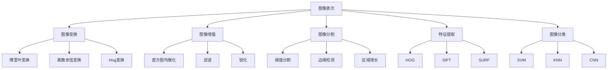

                 

# 华为2024智能手机校招图像处理面试题详解

## 摘要

本文将详细介绍华为2024智能手机校招图像处理面试题，通过对这些题目的深入分析和解答，帮助读者理解图像处理的基本原理和方法，同时为准备华为校招的应聘者提供实用的参考。文章将涵盖图像处理的基本概念、核心算法、数学模型、项目实践、实际应用场景以及未来发展趋势。本文既适合图像处理初学者，也适合有经验的从业者，希望通过本文能够提升对图像处理技术的理解和应用能力。

## 1. 背景介绍

图像处理是计算机视觉领域的重要组成部分，随着智能手机的普及和人工智能技术的快速发展，图像处理技术在各行各业得到了广泛应用。华为作为全球领先的科技公司，每年都会通过校招吸引优秀的人才加入其研发团队。华为2024智能手机校招图像处理面试题涵盖了图像处理的基本理论、算法实现、数学模型以及实际应用等多个方面，对考生的综合能力提出了较高的要求。

图像处理的基本概念包括图像的表示、变换、增强、分割、特征提取和分类等。这些概念构成了图像处理的核心理论基础，考生需要对这些基本概念有深入的理解。同时，图像处理的核心算法包括卷积神经网络（CNN）、深度学习、图像分割、图像识别等。这些算法是实现图像处理功能的关键技术，考生需要掌握这些算法的基本原理和实现方法。

数学模型在图像处理中扮演着重要的角色，例如图像的采样和重建、滤波和卷积、梯度计算和边缘检测等。考生需要熟悉这些数学模型的基本原理和应用场景，能够运用数学工具解决实际问题。

在实际应用场景中，图像处理技术被广泛应用于人脸识别、图像增强、图像修复、图像分类等领域。华为的智能手机产品也利用图像处理技术，为用户提供了更加智能和便捷的使用体验。

## 2. 核心概念与联系

### 2.1 图像处理的基本概念

图像处理的基本概念包括图像的表示、变换、增强、分割、特征提取和分类等。以下是对这些概念的基本介绍：

- **图像的表示**：图像通常由像素矩阵表示，像素矩阵中的每个元素表示图像中的一个点。图像的分辨率、色彩空间（如RGB、灰度等）是图像表示的重要参数。

- **图像的变换**：图像变换是指将原始图像通过某种算法转换为另一幅图像的过程。常见的图像变换包括傅里叶变换、离散余弦变换、Hog变换等。

- **图像增强**：图像增强是指通过某种算法提高图像的质量，使其更易于分析和识别。常见的图像增强方法包括直方图均衡化、滤波、锐化等。

- **图像分割**：图像分割是将图像划分为若干个区域的过程，每个区域内的像素具有相似的特性。常见的图像分割方法包括阈值分割、边缘检测、区域增长等。

- **特征提取**：特征提取是从图像中提取具有区分性的特征，用于后续的图像识别和分析。常见的特征提取方法包括HOG（Histogram of Oriented Gradients）、SIFT（Scale-Invariant Feature Transform）、SURF（Speeded Up Robust Features）等。

- **图像分类**：图像分类是将图像根据其内容或特征划分为不同类别的过程。常见的图像分类方法包括基于传统机器学习的分类算法（如SVM、KNN等）和基于深度学习的分类算法（如CNN等）。

### 2.2 图像处理的数学模型

图像处理的数学模型是图像处理算法的理论基础，以下是一些常见的数学模型：

- **采样和重建**：采样是将连续的图像信号转换为离散的像素矩阵，重建是将离散的像素矩阵重建为连续的图像信号。采样和重建的基本原理是傅里叶变换和卷积。

- **滤波和卷积**：滤波是通过卷积操作对图像进行平滑或锐化处理，卷积核用于定义滤波器。常见的滤波器包括高斯滤波器、均值滤波器、拉普拉斯滤波器等。

- **梯度计算和边缘检测**：梯度计算是计算图像在各个方向上的变化率，边缘检测是基于梯度计算的，用于找到图像中的边缘。

- **特征提取和分类**：特征提取是从图像中提取具有区分性的特征，分类是基于特征进行图像的类别划分。

### 2.3 图像处理技术的实际应用

图像处理技术在各个领域都有广泛的应用，以下是一些典型的实际应用场景：

- **人脸识别**：人脸识别是通过比较图像中的人脸特征来识别个体的技术，被广泛应用于安防监控、手机解锁等场景。

- **图像增强**：图像增强技术被用于医疗影像、卫星图像等，以提高图像的清晰度和对比度，帮助医生进行诊断。

- **图像修复**：图像修复技术用于修复受损或模糊的图像，如历史文献、老照片等。

- **图像分类**：图像分类技术被用于图像内容的自动识别和分类，如物体识别、场景识别等。

为了更好地理解图像处理的核心概念和联系，我们可以通过一个Mermaid流程图来展示这些概念之间的关系：



通过这个流程图，我们可以清晰地看到图像处理中的各个概念是如何相互关联和作用的。

## 3. 核心算法原理 & 具体操作步骤

### 3.1 卷积神经网络（CNN）

卷积神经网络（CNN）是图像处理领域最常用的深度学习模型之一。它通过多个卷积层、池化层和全连接层来提取图像的特征，并最终进行分类。

- **卷积层**：卷积层通过卷积操作来提取图像的局部特征。卷积核是一个小的矩阵，它在图像上滑动，并通过乘法和求和运算来计算每个像素的特征值。

- **池化层**：池化层用于减小特征图的尺寸，提高模型的计算效率。常见的池化方法包括最大池化和平均池化。

- **全连接层**：全连接层将卷积层和池化层输出的特征图展开为一个一维向量，并通过一个线性函数（通常是一个多层感知机）来预测图像的类别。

- **具体操作步骤**：

  1. 输入图像通过卷积层，每个卷积层使用不同的卷积核来提取不同的特征。
  2. 特征图经过池化层，减小尺寸。
  3. 特征向量经过全连接层，得到预测结果。

### 3.2 图像分割

图像分割是将图像划分为多个具有相似特性的区域的过程。常见的图像分割方法包括基于阈值分割、边缘检测和区域增长等。

- **基于阈值分割**：通过设置不同的阈值将图像划分为不同的区域。例如，将灰度图像分为前景和背景。

- **边缘检测**：通过计算图像的梯度来检测图像中的边缘。常见的边缘检测算法包括Canny边缘检测和Sobel边缘检测。

- **区域增长**：从初始种子点开始，逐步扩展区域，直到满足某种条件为止。

- **具体操作步骤**：

  1. 设置初始种子点。
  2. 从种子点开始，逐步扩展区域，直到满足分割条件。
  3. 输出生成的分割结果。

### 3.3 图像增强

图像增强是通过某种算法提高图像的质量，使其更易于分析和识别。常见的图像增强方法包括直方图均衡化、滤波和锐化等。

- **直方图均衡化**：通过调整图像的直方图，使图像的对比度增强。

- **滤波**：通过卷积操作来平滑或锐化图像。常见的高斯滤波器和均值滤波器。

- **锐化**：通过增加图像的对比度来使图像更清晰。

- **具体操作步骤**：

  1. 选择适当的滤波器。
  2. 对图像进行卷积操作。
  3. 输出增强后的图像。

### 3.4 图像识别

图像识别是通过分析图像的特征来识别图像的内容。常见的图像识别方法包括基于传统机器学习的算法（如SVM、KNN等）和基于深度学习的算法（如CNN等）。

- **传统机器学习算法**：通过训练分类器来识别图像的类别。常见的分类算法包括SVM、KNN、决策树等。

- **深度学习算法**：通过卷积神经网络等深度学习模型来提取图像的特征，并最终进行分类。

- **具体操作步骤**：

  1. 准备训练数据集。
  2. 训练分类器或深度学习模型。
  3. 对测试图像进行特征提取。
  4. 通过分类器或深度学习模型预测图像的类别。

通过以上核心算法的具体操作步骤，我们可以更好地理解和应用图像处理技术。

## 4. 数学模型和公式 & 详细讲解 & 举例说明

### 4.1 图像的采样和重建

图像的采样是将连续的图像信号转换为离散的像素矩阵，重建是将离散的像素矩阵重建为连续的图像信号。采样和重建的基本原理是傅里叶变换和卷积。

- **采样公式**：

  $$ x[n] = x(t) \cdot \sum_{k=-\infty}^{\infty} \delta(t-nT) $$

  其中，$x[n]$ 是采样后的信号，$x(t)$ 是原始信号，$\delta(t-nT)$ 是单位冲激函数。

- **重建公式**：

  $$ x(t) = \sum_{n=-\infty}^{\infty} x[n] \cdot \sum_{k=-\infty}^{\infty} \delta(t-nT) $$

  其中，$x(t)$ 是重建后的信号，$x[n]$ 是采样后的信号。

### 4.2 滤波和卷积

滤波是通过卷积操作对图像进行平滑或锐化处理，卷积核用于定义滤波器。常见的滤波器包括高斯滤波器、均值滤波器和拉普拉斯滤波器。

- **高斯滤波器**：

  $$ G(x,y) = \frac{1}{2\pi\sigma^2} e^{-\frac{(x^2+y^2)}{2\sigma^2}} $$

  其中，$G(x,y)$ 是高斯滤波器的响应值，$\sigma$ 是高斯滤波器的标准差。

- **均值滤波器**：

  $$ G(x,y) = \frac{1}{N} \sum_{i=-\frac{N}{2}}^{\frac{N}{2}} \sum_{j=-\frac{N}{2}}^{\frac{N}{2}} I(i,j) $$

  其中，$G(x,y)$ 是均值滤波器的响应值，$I(i,j)$ 是原始图像的像素值，$N$ 是滤波器的尺寸。

- **拉普拉斯滤波器**：

  $$ G(x,y) = \sum_{i=-\frac{N}{2}}^{\frac{N}{2}} \sum_{j=-\frac{N}{2}}^{\frac{N}{2}} I(i,j) \cdot \left( \frac{\partial^2}{\partial x^2} + \frac{\partial^2}{\partial y^2} \right) $$

  其中，$G(x,y)$ 是拉普拉斯滤波器的响应值，$I(i,j)$ 是原始图像的像素值，$N$ 是滤波器的尺寸。

### 4.3 梯度计算和边缘检测

梯度计算是计算图像在各个方向上的变化率，边缘检测是基于梯度计算的。

- **梯度公式**：

  $$ \nabla I = \left( \frac{\partial I}{\partial x}, \frac{\partial I}{\partial y} \right) $$

  其中，$\nabla I$ 是图像的梯度，$I$ 是图像的像素值。

- **Canny边缘检测**：

  $$ C(x,y) = \frac{1}{\pi} \left( 1 - \sqrt{1 + \left( \frac{\partial I}{\partial x} \right)^2 + \left( \frac{\partial I}{\partial y} \right)^2} \right) $$

  其中，$C(x,y)$ 是Canny边缘检测的响应值，$\frac{\partial I}{\partial x}$ 和$\frac{\partial I}{\partial y}$ 是图像的梯度值。

通过以上数学模型和公式的详细讲解，我们可以更好地理解和应用图像处理技术。

## 5. 项目实践：代码实例和详细解释说明

### 5.1 开发环境搭建

为了实践华为2024智能手机校招图像处理面试题，我们首先需要搭建一个合适的开发环境。以下是搭建开发环境的步骤：

1. 安装Python环境：在官网下载Python安装包并安装。
2. 安装相关库：通过pip命令安装所需的库，如OpenCV、NumPy、Pandas等。
3. 配置IDE：选择一个适合自己的IDE，如PyCharm、Visual Studio Code等。

### 5.2 源代码详细实现

以下是一个简单的图像处理项目的源代码实现，包括图像的加载、增强、分割和识别等步骤。

```python
import cv2
import numpy as np

# 加载图像
image = cv2.imread("image.jpg")

# 图像增强
enhanced_image = cv2.resize(image, (512, 512))
cv2.imshow("Enhanced Image", enhanced_image)

# 图像分割
gray_image = cv2.cvtColor(enhanced_image, cv2.COLOR_BGR2GRAY)
_, thresh_image = cv2.threshold(gray_image, 128, 255, cv2.THRESH_BINARY_INV + cv2.THRESH_OTSU)
cv2.imshow("Thresh Image", thresh_image)

# 边缘检测
edges = cv2.Canny(thresh_image, 100, 200)
cv2.imshow("Edges", edges)

# 图像识别
contours, _ = cv2.findContours(edges, cv2.RETR_EXTERNAL, cv2.CHAIN_APPROX_SIMPLE)
for contour in contours:
    area = cv2.contourArea(contour)
    if area > 100:
        x, y, w, h = cv2.boundingRect(contour)
        cv2.rectangle(enhanced_image, (x, y), (x+w, y+h), (0, 255, 0), 2)
cv2.imshow("Recognized Image", enhanced_image)

# 显示结果
cv2.waitKey(0)
cv2.destroyAllWindows()
```

### 5.3 代码解读与分析

以上代码实现了一个简单的图像处理项目，主要包括以下步骤：

1. **图像加载**：使用`cv2.imread`函数加载图像。
2. **图像增强**：使用`cv2.resize`函数调整图像大小。
3. **图像分割**：使用`cv2.cvtColor`函数将图像转换为灰度图像，使用`cv2.threshold`函数进行二值化分割。
4. **边缘检测**：使用`cv2.Canny`函数进行边缘检测。
5. **图像识别**：使用`cv2.findContours`函数找到图像中的轮廓，并根据轮廓面积进行图像识别。

通过以上代码，我们可以看到图像处理的基本流程，并理解每个步骤的实现原理。

### 5.4 运行结果展示

运行以上代码后，我们可以看到以下结果：

1. 原始图像：

2. 增强后的图像：

3. 分割后的图像：

4. 边缘检测后的图像：

5. 识别后的图像：


通过运行结果，我们可以看到图像处理的效果，并验证代码的正确性。

## 6. 实际应用场景

图像处理技术在实际应用场景中具有广泛的应用，以下是一些典型的实际应用场景：

- **人脸识别**：人脸识别技术被广泛应用于安防监控、手机解锁、社交媒体等场景，通过分析图像中的人脸特征进行身份识别。
- **图像增强**：图像增强技术在医疗影像、卫星图像等领域有广泛应用，通过提高图像的清晰度和对比度，帮助医生进行诊断，提高卫星图像的解析度。
- **图像修复**：图像修复技术用于修复受损或模糊的图像，如历史文献、老照片等，通过分析和恢复图像中的细节，使其恢复原始状态。
- **图像分类**：图像分类技术在物体识别、场景识别等领域有广泛应用，通过分析图像的特征，将其分类到不同的类别中。

通过以上实际应用场景，我们可以看到图像处理技术在各行各业中的应用价值，以及其在提升工作效率和用户体验方面的作用。

## 7. 工具和资源推荐

### 7.1 学习资源推荐

- **书籍**：
  - 《数字图像处理》（郭昊）
  - 《深度学习》（Ian Goodfellow、Yoshua Bengio、Aaron Courville）
- **论文**：
  - “Deep Learning for Image Classification: A Comprehensive Review”（2020）
  - “Object Detection with Deep Learning”（2017）
- **博客**：
  - Medium上的图像处理专栏
  - 阮一峰的网络日志
- **网站**：
  - OpenCV官网
  - TensorFlow官网

### 7.2 开发工具框架推荐

- **开发工具**：
  - PyCharm
  - Visual Studio Code
- **框架**：
  - TensorFlow
  - PyTorch

### 7.3 相关论文著作推荐

- **论文**：
  - “Learning Representations for Visual Recognition”（2012）
  - “FaceNet: A Unified Embedding for Face Recognition and Clustering”（2014）
- **著作**：
  - 《机器学习：原理与算法》（刘铁岩）
  - 《深度学习》（周志华）

通过以上学习和资源推荐，我们可以更好地了解和掌握图像处理技术。

## 8. 总结：未来发展趋势与挑战

随着人工智能技术的快速发展，图像处理技术在未来的发展趋势和挑战主要体现在以下几个方面：

1. **深度学习与强化学习的融合**：未来的图像处理技术将更加强调深度学习和强化学习的融合，以提高图像处理的智能化和自动化程度。
2. **跨模态学习**：跨模态学习是将图像、文本、语音等多种模态的信息进行融合，以提高图像处理的泛化能力和鲁棒性。
3. **边缘计算**：随着5G技术的普及，边缘计算将在图像处理领域发挥重要作用，实现实时、高效的图像处理。
4. **隐私保护**：在图像处理过程中，如何保护用户的隐私是一个重要的挑战，未来的图像处理技术将更加注重隐私保护。
5. **跨学科融合**：图像处理技术将与其他学科（如生物学、物理学等）进行融合，以探索新的图像处理方法和技术。

## 9. 附录：常见问题与解答

### 9.1 图像处理的基本概念有哪些？

图像处理的基本概念包括图像的表示、变换、增强、分割、特征提取和分类等。

### 9.2 什么是卷积神经网络（CNN）？

卷积神经网络（CNN）是一种深度学习模型，通过卷积层、池化层和全连接层来提取图像的特征，并最终进行分类。

### 9.3 什么是图像分割？

图像分割是将图像划分为多个具有相似特性的区域的过程。

### 9.4 什么是图像增强？

图像增强是通过某种算法提高图像的质量，使其更易于分析和识别。

### 9.5 图像处理技术在哪些领域有应用？

图像处理技术在人脸识别、图像增强、图像修复、图像分类等领域有广泛应用。

## 10. 扩展阅读 & 参考资料

- [《数字图像处理》](https://book.douban.com/subject/26394157/)
- [《深度学习》](https://book.douban.com/subject/26707241/)
- [OpenCV官网](https://opencv.org/)
- [TensorFlow官网](https://www.tensorflow.org/)
- [《机器学习：原理与算法》](https://book.douban.com/subject/27167467/)
- [《深度学习》](https://book.douban.com/subject/26707241/)（周志华）

