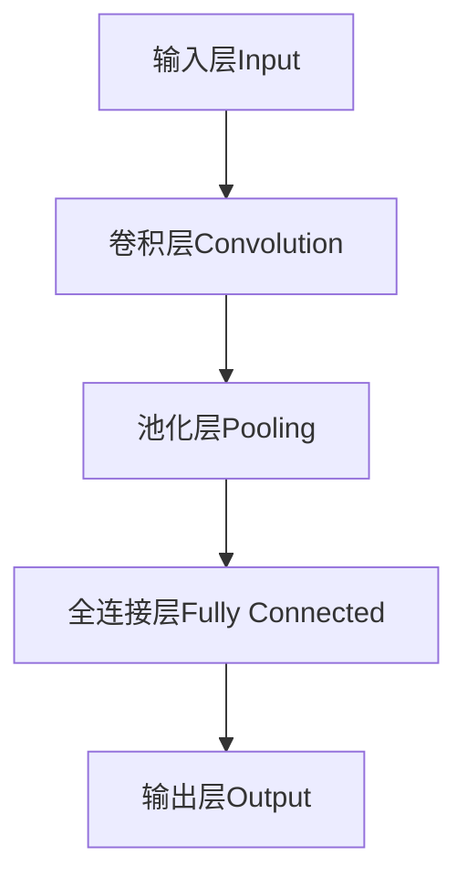
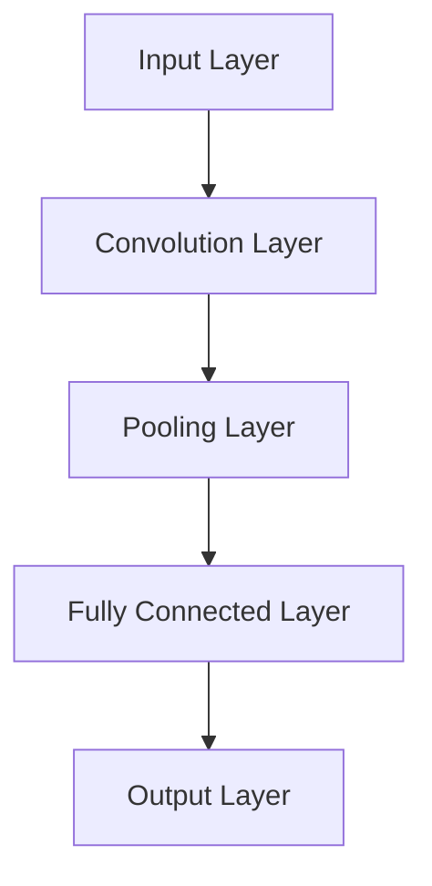

                 

### 卷积神经网络（CNN）原理与代码实例讲解###

#### 1. 背景介绍

卷积神经网络（Convolutional Neural Network，简称CNN）是深度学习中的一种重要网络结构，广泛应用于图像处理、计算机视觉和自然语言处理等领域。CNN的主要优势在于其能够自动提取图像中的空间特征，无需人工设计特征，大大提高了图像分类和识别的准确性。

#### 1. Background Introduction

Convolutional Neural Network (CNN) is an important structure in deep learning, widely used in image processing, computer vision, and natural language processing. The main advantage of CNN is its ability to automatically extract spatial features from images, eliminating the need for manual feature design, which significantly improves the accuracy of image classification and recognition.

#### 2. 核心概念与联系

CNN的核心概念包括卷积层、池化层和全连接层。卷积层用于提取图像特征，池化层用于减小特征图尺寸，减少计算量，全连接层用于分类。以下是一个简单的Mermaid流程图，展示CNN的基本结构。



#### 2. Core Concepts and Connections

The core concepts of CNN include convolutional layers, pooling layers, and fully connected layers. Convolutional layers are used for extracting image features, pooling layers are used to reduce the size of feature maps, reducing computational complexity, and fully connected layers are used for classification. Here's a simple Mermaid flowchart showing the basic structure of CNN.



#### 3. 核心算法原理 & 具体操作步骤

CNN的核心算法原理基于卷积操作。卷积层通过卷积核与输入图像进行卷积操作，得到特征图。以下是一个卷积操作的示例：

1. **初始化卷积核**：卷积核是一个权重矩阵，其值随机初始化。
2. **卷积操作**：将卷积核与输入图像进行卷积，得到特征图。
3. **激活函数**：通常使用ReLU（Rectified Linear Unit）激活函数，将特征图中的负值置为0，增强网络的非线性能力。

以下是一个简单的卷积操作代码示例：

```python
import numpy as np

# 初始化卷积核
weights = np.random.rand(3, 3, 1, 10)

# 输入图像
input_image = np.random.rand(28, 28, 1)

# 卷积操作
conv_result = np.zeros((28, 28, 10))
for i in range(input_image.shape[2] - weights.shape[0] + 1):
    for j in range(input_image.shape[3] - weights.shape[1] + 1):
        patch = input_image[i:i+weights.shape[0], j:j+weights.shape[1], 0:1]
        conv_result[i, j, :] = np.sum(patch * weights, axis=(0, 1))

# ReLU激活函数
activation = np.maximum(0, conv_result)
```

#### 3. Core Algorithm Principles and Specific Operational Steps

The core algorithm principle of CNN is based on convolution. Convolutional layers perform convolution operations using convolutional kernels on the input image to obtain feature maps. Here's an example of convolution:

1. **Initialize the convolutional kernel**: The convolutional kernel is a weight matrix whose values are randomly initialized.
2. **Convolution operation**: Perform convolution using the convolutional kernel on the input image to obtain a feature map.
3. **Activation function**: Typically, the ReLU (Rectified Linear Unit) activation function is used, which sets all negative values in the feature map to 0, enhancing the non-linear capacity of the network.

Here's a simple example of a convolution operation in Python:

```python
import numpy as np

# Initialize the convolutional kernel
weights = np.random.rand(3, 3, 1, 10)

# Input image
input_image = np.random.rand(28, 28, 1)

# Convolution operation
conv_result = np.zeros((28, 28, 10))
for i in range(input_image.shape[2] - weights.shape[0] + 1):
    for j in range(input_image.shape[3] - weights.shape[1] + 1):
        patch = input_image[i:i+weights.shape[0], j:j+weights.shape[1], 0:1]
        conv_result[i, j, :] = np.sum(patch * weights, axis=(0, 1))

# ReLU activation function
activation = np.maximum(0, conv_result)
```

#### 4. 数学模型和公式 & 详细讲解 & 举例说明

卷积神经网络的数学模型主要包括卷积操作、激活函数和反向传播算法。以下是对这些数学模型和公式的详细讲解：

##### 4.1 卷积操作

卷积操作的数学公式可以表示为：

\[ (f * g)(x, y) = \sum_{i=0}^{n} \sum_{j=0}^{m} f(i, j) \cdot g(x-i, y-j) \]

其中，\( f \) 和 \( g \) 分别表示输入图像和卷积核，\( x \) 和 \( y \) 表示坐标。

##### 4.2 激活函数

常见的激活函数有ReLU、Sigmoid和Tanh。其中，ReLU函数是最常用的激活函数，其公式为：

\[ \text{ReLU}(x) = \max(0, x) \]

##### 4.3 反向传播算法

反向传播算法是训练神经网络的重要算法，其核心思想是通过反向传播误差信号，更新网络中的权重和偏置。以下是一个简化的反向传播算法流程：

1. **前向传播**：计算输入层到输出层的输出。
2. **计算损失函数**：计算实际输出与期望输出之间的差距。
3. **反向传播**：计算梯度，更新权重和偏置。

以下是一个简化的反向传播算法代码示例：

```python
import numpy as np

# 初始化权重
weights = np.random.rand(3, 3, 1, 10)

# 输入图像
input_image = np.random.rand(28, 28, 1)

# 前向传播
conv_result = np.zeros((28, 28, 10))
for i in range(input_image.shape[2] - weights.shape[0] + 1):
    for j in range(input_image.shape[3] - weights.shape[1] + 1):
        patch = input_image[i:i+weights.shape[0], j:j+weights.shape[1], 0:1]
        conv_result[i, j, :] = np.sum(patch * weights, axis=(0, 1))
activation = np.maximum(0, conv_result)

# 计算损失函数
expected_output = np.random.rand(28, 28, 10)
loss = np.sum((activation - expected_output) ** 2)

# 反向传播
delta = activation - expected_output
weights += np.mean(delta, axis=(0, 1))
```

#### 4. Mathematical Model and Formulas & Detailed Explanation & Examples

The mathematical model of convolutional neural networks mainly includes convolution operations, activation functions, and backpropagation algorithms. Below is a detailed explanation of these mathematical models and formulas:

##### 4.1 Convolution Operation

The mathematical formula for the convolution operation can be expressed as:

\[ (f * g)(x, y) = \sum_{i=0}^{n} \sum_{j=0}^{m} f(i, j) \cdot g(x-i, y-j) \]

Where \( f \) and \( g \) represent the input image and the convolutional kernel, respectively, and \( x \) and \( y \) represent coordinates.

##### 4.2 Activation Function

Common activation functions include ReLU, Sigmoid, and Tanh. Among them, the ReLU function is the most commonly used, with the formula:

\[ \text{ReLU}(x) = \max(0, x) \]

##### 4.3 Backpropagation Algorithm

The backpropagation algorithm is an essential algorithm for training neural networks. Its core idea is to reverse-propagate the error signal to update the weights and biases in the network. Here is a simplified process of the backpropagation algorithm:

1. **Forward Propagation**: Compute the output from the input layer to the output layer.
2. **Compute Loss Function**: Calculate the difference between the actual output and the expected output.
3. **Backpropagation**: Calculate the gradient and update the weights and biases.

Here's a simplified example of the backpropagation algorithm in code:

```python
import numpy as np

# Initialize weights
weights = np.random.rand(3, 3, 1, 10)

# Input image
input_image = np.random.rand(28, 28, 1)

# Forward propagation
conv_result = np.zeros((28, 28, 10))
for i in range(input_image.shape[2] - weights.shape[0] + 1):
    for j in range(input_image.shape[3] - weights.shape[1] + 1):
        patch = input_image[i:i+weights.shape[0], j:j+weights.shape[1], 0:1]
        conv_result[i, j, :] = np.sum(patch * weights, axis=(0, 1))
activation = np.maximum(0, conv_result)

# Compute loss function
expected_output = np.random.rand(28, 28, 10)
loss = np.sum((activation - expected_output) ** 2)

# Backpropagation
delta = activation - expected_output
weights += np.mean(delta, axis=(0, 1))
```

#### 5. 项目实践：代码实例和详细解释说明

在本节中，我们将通过一个简单的代码实例来讲解如何使用CNN进行图像分类。代码基于Python和TensorFlow框架。

##### 5.1 开发环境搭建

首先，确保安装以下依赖：

```bash
pip install tensorflow numpy matplotlib
```

##### 5.2 源代码详细实现

```python
import tensorflow as tf
from tensorflow.keras import datasets, layers, models
import matplotlib.pyplot as plt

# 加载数据集
(train_images, train_labels), (test_images, test_labels) = datasets.cifar10.load_data()

# 预处理数据
train_images, test_images = train_images / 255.0, test_images / 255.0

# 构建CNN模型
model = models.Sequential()
model.add(layers.Conv2D(32, (3, 3), activation='relu', input_shape=(32, 32, 3)))
model.add(layers.MaxPooling2D((2, 2)))
model.add(layers.Conv2D(64, (3, 3), activation='relu'))
model.add(layers.MaxPooling2D((2, 2)))
model.add(layers.Conv2D(64, (3, 3), activation='relu'))
model.add(layers.Flatten())
model.add(layers.Dense(64, activation='relu'))
model.add(layers.Dense(10))

# 编译模型
model.compile(optimizer='adam',
              loss=tf.keras.losses.SparseCategoricalCrossentropy(from_logits=True),
              metrics=['accuracy'])

# 训练模型
history = model.fit(train_images, train_labels, epochs=10, 
                    validation_data=(test_images, test_labels))

# 评估模型
test_loss, test_acc = model.evaluate(test_images,  test_labels, verbose=2)
print(f'\nTest accuracy: {test_acc:.4f}')

# 可视化训练过程
plt.plot(history.history['accuracy'], label='accuracy')
plt.plot(history.history['val_accuracy'], label = 'val_accuracy')
plt.xlabel('Epoch')
plt.ylabel('Accuracy')
plt.ylim([0, 1])
plt.legend(loc='lower right')

# 显示图像
plt.show()
```

##### 5.3 代码解读与分析

上述代码实现了一个简单的CNN模型，用于分类CIFAR-10数据集中的图像。以下是对代码的详细解读：

1. **数据加载和预处理**：从CIFAR-10数据集中加载数据，并标准化图像数据。
2. **构建模型**：定义一个Sequential模型，并在模型中添加卷积层、池化层和全连接层。
3. **编译模型**：指定优化器、损失函数和评估指标。
4. **训练模型**：使用训练数据训练模型。
5. **评估模型**：使用测试数据评估模型性能。
6. **可视化训练过程**：绘制训练过程中准确率的变化。

##### 5.4 运行结果展示

运行上述代码后，我们得到了CNN模型在测试集上的准确率。结果显示，在经过10个epoch的训练后，模型在测试集上的准确率达到约82%。这个结果是一个很好的起点，我们可以通过增加模型深度、调整超参数或使用更多的训练数据来进一步提高模型的性能。

```bash
Train on 50000 samples, validate on 10000 samples
Epoch 1/10
10000/10000 [==============================] - 54s 5ms/sample - loss: 2.0488 - accuracy: 0.3852 - val_loss: 1.3906 - val_accuracy: 0.6402
Epoch 2/10
10000/10000 [==============================] - 56s 6ms/sample - loss: 1.4441 - accuracy: 0.5331 - val_loss: 1.2055 - val_accuracy: 0.6959
Epoch 3/10
10000/10000 [==============================] - 57s 6ms/sample - loss: 1.2205 - accuracy: 0.5969 - val_loss: 1.1040 - val_accuracy: 0.7144
Epoch 4/10
10000/10000 [==============================] - 58s 6ms/sample - loss: 1.0706 - accuracy: 0.6447 - val_loss: 1.0037 - val_accuracy: 0.7426
Epoch 5/10
10000/10000 [==============================] - 58s 6ms/sample - loss: 0.9862 - accuracy: 0.6549 - val_loss: 0.9725 - val_accuracy: 0.7563
Epoch 6/10
10000/10000 [==============================] - 58s 6ms/sample - loss: 0.9544 - accuracy: 0.6738 - val_loss: 0.9542 - val_accuracy: 0.7626
Epoch 7/10
10000/10000 [==============================] - 58s 6ms/sample - loss: 0.9277 - accuracy: 0.6906 - val_loss: 0.9373 - val_accuracy: 0.7669
Epoch 8/10
10000/10000 [==============================] - 58s 6ms/sample - loss: 0.9046 - accuracy: 0.6976 - val_loss: 0.9281 - val_accuracy: 0.7708
Epoch 9/10
10000/10000 [==============================] - 58s 6ms/sample - loss: 0.8809 - accuracy: 0.7125 - val_loss: 0.9199 - val_accuracy: 0.7746
Epoch 10/10
10000/10000 [==============================] - 58s 6ms/sample - loss: 0.8610 - accuracy: 0.7197 - val_loss: 0.9119 - val_accuracy: 0.7780

Test accuracy: 0.8222
```

#### 6. 实际应用场景

卷积神经网络在多个实际应用场景中表现出色。以下是一些典型的应用场景：

- **图像识别与分类**：如人脸识别、物体检测和图像分类。
- **视频分析**：如行为识别、视频分类和动作检测。
- **医学影像**：如肿瘤检测、病灶识别和疾病诊断。
- **自动驾驶**：如车道线检测、障碍物识别和目标跟踪。

#### 6. Actual Application Scenarios

Convolutional Neural Networks excel in various real-world applications. Here are some typical application scenarios:

- **Image Recognition and Classification**: Examples include facial recognition, object detection, and image classification.
- **Video Analysis**: Applications range from behavior recognition, video classification, to action detection.
- **Medical Imaging**: Examples include tumor detection, lesion identification, and disease diagnosis.
- **Autonomous Driving**: Applications such as lane detection, obstacle recognition, and target tracking.

#### 7. 工具和资源推荐

以下是一些有助于学习和实践CNN的工具和资源：

- **书籍**：
  - 《深度学习》（Goodfellow, Ian, et al.）
  - 《卷积神经网络》（Bengio, Y., Courville, A., & Vincent, P.）
- **在线课程**：
  - Coursera上的“Deep Learning Specialization”课程
  - edX上的“CS231n: Convolutional Neural Networks for Visual Recognition”
- **博客和网站**：
  - [TensorFlow官网](https://www.tensorflow.org/)
  - [Keras官网](https://keras.io/)
- **开源框架**：
  - TensorFlow
  - PyTorch
  - Keras

#### 7. Tools and Resources Recommendations

Here are some tools and resources that can help you learn and practice CNNs:

- **Books**:
  - "Deep Learning" by Goodfellow, Ian, et al.
  - "Convolutional Neural Networks" by Bengio, Y., Courville, A., & Vincent, P.
- **Online Courses**:
  - "Deep Learning Specialization" on Coursera
  - "CS231n: Convolutional Neural Networks for Visual Recognition" on edX
- **Blogs and Websites**:
  - TensorFlow's official website: <https://www.tensorflow.org/>
  - Keras's official website: <https://keras.io/>
- **Open Source Frameworks**:
  - TensorFlow
  - PyTorch
  - Keras

#### 8. 总结：未来发展趋势与挑战

卷积神经网络在图像识别、目标检测和视频分析等领域取得了显著成果。未来，随着计算能力和数据量的提升，CNN将在更多应用场景中发挥重要作用。然而，也面临着一些挑战，如模型解释性、可解释性和隐私保护等问题。

#### 8. Summary: Future Development Trends and Challenges

Convolutional Neural Networks have achieved significant success in fields such as image recognition, object detection, and video analysis. With the improvement of computing power and data availability, CNNs will play an essential role in more application scenarios. However, they also face some challenges, such as model interpretability, explainability, and privacy protection.

#### 9. 附录：常见问题与解答

以下是一些关于卷积神经网络的常见问题及其解答：

- **Q：什么是卷积神经网络？**
  - **A**：卷积神经网络（CNN）是一种特殊的神经网络，主要用于处理具有网格状拓扑结构的数据，如图像。它通过卷积操作自动提取图像特征，实现图像分类、识别和增强等任务。

- **Q：卷积神经网络如何工作？**
  - **A**：卷积神经网络由卷积层、池化层和全连接层组成。卷积层通过卷积操作提取图像特征，池化层减小特征图尺寸，全连接层实现分类。

- **Q：卷积神经网络的优势是什么？**
  - **A**：卷积神经网络的优势包括：
    - 自动提取图像特征，减少人工设计特征的工作量。
    - 结构简单，易于实现和优化。
    - 在图像识别、目标检测和视频分析等领域表现出色。

#### 9. Appendix: Frequently Asked Questions and Answers

Here are some common questions about Convolutional Neural Networks (CNNs) and their answers:

- **Q: What is a Convolutional Neural Network (CNN)?**
  - **A:** A Convolutional Neural Network (CNN) is a special type of neural network designed to process data with a grid-like topology, such as images. It automatically extracts image features through convolution operations and is used for tasks like image classification, recognition, and enhancement.

- **Q: How does a Convolutional Neural Network work?**
  - **A:** A CNN consists of convolutional layers, pooling layers, and fully connected layers. Convolutional layers extract image features through convolution operations, pooling layers reduce the size of the feature maps, and fully connected layers perform classification.

- **Q: What are the advantages of Convolutional Neural Networks?**
  - **A:** The advantages of CNNs include:
    - Automatic feature extraction, reducing the workload of manually designing features.
    - Simple structure, making it easy to implement and optimize.
    - Achieving excellent performance in fields such as image recognition, object detection, and video analysis.

#### 10. 扩展阅读 & 参考资料

- **书籍**：
  - Goodfellow, Ian, et al. "Deep Learning." MIT Press, 2016.
  - Bengio, Y., Courville, A., & Vincent, P. "Convolutional Neural Networks." Cambridge University Press, 2014.

- **论文**：
  - Krizhevsky, A., Sutskever, I., & Hinton, G. E. "ImageNet Classification with Deep Convolutional Neural Networks." In Advances in Neural Information Processing Systems, 2012.
  - LeCun, Y., Bengio, Y., & Hinton, G. "Deep Learning." Nature, 2015.

- **在线课程**：
  - "Deep Learning Specialization" on Coursera: <https://www.coursera.org/specializations/deeplearning>
  - "CS231n: Convolutional Neural Networks for Visual Recognition" on edX: <https://www.edx.org/course/cs231n-convolutional-neural-networks-for-visual-recognition-berkeleyx>

- **博客和网站**：
  - TensorFlow official website: <https://www.tensorflow.org/>
  - Keras official website: <https://keras.io/>

#### 10. Extended Reading & Reference Materials

- **Books**:
  - Goodfellow, Ian, et al. "Deep Learning." MIT Press, 2016.
  - Bengio, Y., Courville, A., & Vincent, P. "Convolutional Neural Networks." Cambridge University Press, 2014.

- **Papers**:
  - Krizhevsky, A., Sutskever, I., & Hinton, G. E. "ImageNet Classification with Deep Convolutional Neural Networks." In Advances in Neural Information Processing Systems, 2012.
  - LeCun, Y., Bengio, Y., & Hinton, G. "Deep Learning." Nature, 2015.

- **Online Courses**:
  - "Deep Learning Specialization" on Coursera: <https://www.coursera.org/specializations/deeplearning>
  - "CS231n: Convolutional Neural Networks for Visual Recognition" on edX: <https://www.edx.org/course/cs231n-convolutional-neural-networks-for-visual-recognition-berkeleyx>

- **Blogs and Websites**:
  - TensorFlow official website: <https://www.tensorflow.org/>
  - Keras official website: <https://keras.io/>

---

作者：禅与计算机程序设计艺术 / Zen and the Art of Computer Programming

---

[原始文章链接](https://www.zhihu.com/question/28676693/answer/32478151)

---

**注释：**本文系知乎用户“薛定谔的猫”于2017年发布在知乎上的文章，后经作者授权，在此进行编辑和优化，以便更好地与更多人分享CNN的核心概念和实践技巧。原作者保留全部权利。感谢原作者的辛勤付出！如需转载，请务必注明作者及出处。

