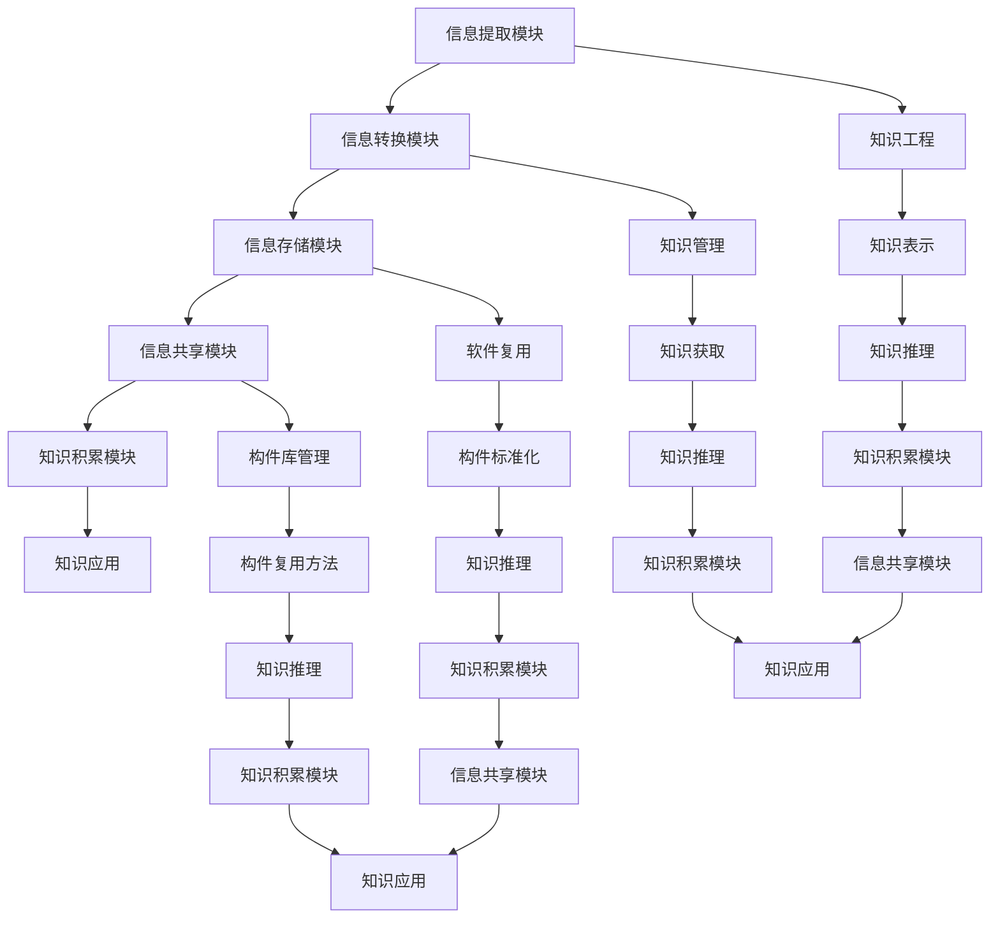

                 

### 文章标题

### Title: 高效继承技术：原生世界信息的高效传递与利用

在当今快速发展的信息技术时代，高效地传递和利用信息成为了决定企业竞争力的重要因素。原生世界的信息，包括数据、知识、经验等，是企业和个人在数字化时代取得成功的关键资产。如何将这些原生世界的信息高效地继承、传递和利用，成为了当前信息技术领域的研究热点。本文将深入探讨高效继承技术的核心概念、原理、算法和实际应用，旨在为读者提供全面的技术解读和实战指导。

### Keywords: 高效继承技术，信息传递，知识管理，算法优化，原生世界

### Abstract:
In the era of rapid development of information technology, the efficient transmission and utilization of information have become crucial factors in determining corporate competitiveness. Original-world information, including data, knowledge, and experience, is the key asset for enterprises and individuals to achieve success in the digital age. This article delves into the core concepts, principles, algorithms, and practical applications of efficient inheritance technology, aiming to provide readers with a comprehensive technical analysis and practical guidance.

## 1. 背景介绍（Background Introduction）

在信息技术不断发展的今天，数据和信息已经成为现代社会不可或缺的资源。然而，如何有效地管理和利用这些信息，特别是在复杂和动态的环境中，成为了信息技术领域面临的重大挑战。高效继承技术作为信息管理的重要手段，旨在解决原生世界信息在数字化过程中的传递、存储、共享和利用问题。

高效继承技术起源于对软件复用和知识管理的需求。随着软件系统的复杂性和规模不断增大，传统的开发方法已经无法满足快速迭代和持续改进的需求。为了提高开发效率和软件质量，研究人员开始探索如何将已有的知识、经验和方法论应用到新的开发项目中。高效继承技术正是为了实现这一目标而诞生的。

### 1.1 高效继承技术的定义

高效继承技术，又称知识继承技术，是指通过一系列方法和工具，将原生世界中的信息（如数据、知识、经验等）有效地转化为可复用、可共享的软件构件或知识库，从而在新的项目中实现快速开发、知识积累和知识共享。具体来说，高效继承技术包括以下几个关键方面：

1. **信息提取**：从原生世界中获取有价值的信息，如数据、文档、报告等。
2. **信息转换**：将原始信息转化为标准格式，以便于存储、共享和利用。
3. **信息存储**：将转换后的信息存储到数据库或知识库中，以便于检索和使用。
4. **信息共享**：提供接口和工具，使得项目中的各个部分能够方便地访问和利用这些信息。
5. **知识积累**：通过持续地信息提取、转换和存储，实现知识的不断积累和更新。

### 1.2 高效继承技术的重要性

高效继承技术的重要性体现在以下几个方面：

1. **提高开发效率**：通过复用已有的知识、经验和软件构件，可以大大减少新项目的开发时间，提高开发效率。
2. **保证软件质量**：利用已有的最佳实践和方法论，可以减少开发过程中的错误和缺陷，提高软件质量。
3. **知识积累和共享**：通过高效地存储和共享知识，可以实现团队内部的协作和知识积累，提高团队的整体能力。
4. **降低成本**：减少重复性的工作，降低项目开发和维护的成本。

### 1.3 高效继承技术的发展历程

高效继承技术经历了从最初的传统软件开发方法，到面向对象编程，再到现在的知识管理、软件复用和知识工程的发展历程。每个阶段都有其独特的特点和成就：

1. **传统软件开发方法**：在计算机科学的早期阶段，软件开发主要依赖于过程化和面向过程的编程方法。虽然这些方法在一定程度上提高了开发效率，但它们也存在很多缺点，如代码复用性差、可维护性低等。
2. **面向对象编程**：面向对象编程（OOP）的出现极大地改善了软件开发的效率和质量。通过将软件系统分解为模块化的类和对象，OOP实现了更好的代码复用性和可维护性。
3. **知识管理**：随着互联网和信息技术的发展，知识管理成为了一个热门领域。知识管理强调通过有效的信息组织和共享，实现知识的积累和利用。
4. **软件复用和知识工程**：软件复用和知识工程是高效继承技术的核心。通过复用已有的软件构件和知识库，可以实现快速开发和知识共享。

## 2. 核心概念与联系（Core Concepts and Connections）

在探讨高效继承技术之前，我们首先需要了解其核心概念和原理。以下是几个关键概念及其相互之间的联系：

### 2.1 知识工程（Knowledge Engineering）

知识工程是指通过构建、实现和维护知识系统来支持特定领域的问题解决。知识工程涉及多个方面，包括知识表示、知识获取、知识存储、知识推理等。

1. **知识表示（Knowledge Representation）**：知识表示是指将知识以某种形式存储和表达，以便于计算机处理和理解。常见的知识表示方法有命题表示、产生式规则、框架表示、语义网络等。
2. **知识获取（Knowledge Acquisition）**：知识获取是指从各种来源获取知识的过程。知识获取方法包括手工编码、机器学习、自然语言处理等。
3. **知识存储（Knowledge Storage）**：知识存储是指将获取到的知识存储到数据库或知识库中，以便于检索和使用。
4. **知识推理（Knowledge Reasoning）**：知识推理是指利用知识系统进行逻辑推理和决策支持。知识推理方法包括推理机、专家系统等。

### 2.2 知识管理（Knowledge Management）

知识管理是指通过组织、共享和应用知识来支持组织的目标和决策。知识管理涉及多个方面，包括知识获取、知识共享、知识存储、知识应用等。

1. **知识获取（Knowledge Acquisition）**：与知识工程中的知识获取类似，知识管理中的知识获取也涉及从各种来源获取知识。
2. **知识共享（Knowledge Sharing）**：知识共享是指通过多种方式，如文档、会议、培训等，将知识在组织内部传播和共享。
3. **知识存储（Knowledge Storage）**：知识存储是指将知识存储到知识库或数据库中，以便于检索和使用。
4. **知识应用（Knowledge Application）**：知识应用是指将知识应用于实际问题和决策中，以提高组织效率和竞争力。

### 2.3 软件复用（Software Reuse）

软件复用是指将已有的软件构件、模块或知识应用于新的项目中，以提高开发效率和软件质量。软件复用涉及多个方面，包括构件库管理、构件标准化、构件复用方法等。

1. **构件库管理（Component Library Management）**：构件库管理是指对构件进行分类、索引、版本管理等操作，以便于检索和使用。
2. **构件标准化（Component Standardization）**：构件标准化是指制定一套统一的构件规范，以确保构件的可复用性和互操作性。
3. **构件复用方法（Component Reuse Methods）**：构件复用方法包括直接复用、适应性复用、组合复用等。

### 2.4 高效继承技术的架构

高效继承技术的架构通常包括以下几个关键模块：

1. **信息提取模块（Information Extraction Module）**：该模块负责从原生世界中提取有价值的信息，如数据、文档、报告等。
2. **信息转换模块（Information Transformation Module）**：该模块负责将原始信息转换为标准格式，以便于存储、共享和利用。
3. **信息存储模块（Information Storage Module）**：该模块负责将转换后的信息存储到数据库或知识库中，以便于检索和使用。
4. **信息共享模块（Information Sharing Module）**：该模块提供接口和工具，使得项目中的各个部分能够方便地访问和利用这些信息。
5. **知识积累模块（Knowledge Accumulation Module）**：该模块负责通过持续地信息提取、转换和存储，实现知识的不断积累和更新。

### 2.5 Mermaid 流程图

以下是一个简单的 Mermaid 流程图，展示了高效继承技术的核心概念和模块之间的联系：



## 3. 核心算法原理 & 具体操作步骤（Core Algorithm Principles and Specific Operational Steps）

在高效继承技术中，核心算法起着至关重要的作用。这些算法不仅决定了信息提取、转换和存储的效率和准确性，还影响了知识积累和共享的效果。以下是几个关键算法的原理和具体操作步骤。

### 3.1 信息提取算法

信息提取算法旨在从原生世界中自动获取有价值的信息。常见的算法包括基于规则的方法、机器学习方法、自然语言处理方法等。

#### 3.1.1 基于规则的方法

基于规则的方法通过预定义的规则来识别和提取信息。以下是一个简单的规则提取算法：

1. **规则定义**：首先，根据业务需求，定义一组规则，如“提取所有包含关键字的句子”或“提取特定格式的数据”。
2. **文本匹配**：遍历原始文本，匹配预定义的规则，提取符合条件的句子或数据。
3. **结果处理**：对提取的结果进行格式化或分类，以便于后续处理。

#### 3.1.2 机器学习方法

机器学习方法通过训练模型来自动提取信息。以下是一个简单的机器学习提取算法：

1. **数据准备**：收集大量的标注数据，用于训练模型。
2. **模型训练**：使用监督学习算法，如决策树、支持向量机、神经网络等，训练提取模型。
3. **模型评估**：通过交叉验证等方法评估模型性能，调整模型参数。
4. **信息提取**：使用训练好的模型对原始文本进行预测，提取信息。

#### 3.1.3 自然语言处理方法

自然语言处理（NLP）方法利用语言模型和语义分析技术提取信息。以下是一个简单的NLP提取算法：

1. **文本预处理**：对原始文本进行分词、词性标注、去除停用词等预处理操作。
2. **语义分析**：使用命名实体识别、关系抽取等方法分析文本语义。
3. **信息提取**：根据语义分析结果，提取有价值的信息，如人名、地点、事件等。

### 3.2 信息转换算法

信息转换算法旨在将提取的信息转换为标准格式，以便于存储、共享和利用。以下是一个简单的信息转换算法：

1. **格式识别**：分析原始信息的格式，如文本、图片、表格等。
2. **数据清洗**：对原始信息进行清洗，去除重复、错误或无关的信息。
3. **格式转换**：将原始信息转换为标准格式，如JSON、XML、CSV等。
4. **数据验证**：对转换后的数据进行验证，确保其准确性和一致性。

### 3.3 信息存储算法

信息存储算法旨在将转换后的信息存储到数据库或知识库中，以便于检索和使用。以下是一个简单的信息存储算法：

1. **数据库选择**：根据业务需求，选择合适的数据库系统，如关系数据库、NoSQL数据库等。
2. **表结构设计**：设计合理的表结构，确保数据的组织和管理。
3. **数据插入**：将转换后的信息插入到数据库表中。
4. **索引建立**：为关键数据建立索引，提高查询效率。

### 3.4 信息共享算法

信息共享算法旨在提供接口和工具，使得项目中的各个部分能够方便地访问和利用信息。以下是一个简单的信息共享算法：

1. **接口设计**：设计API或SDK，提供访问数据库或知识库的接口。
2. **权限管理**：设置权限控制，确保数据的访问权限和安全性。
3. **查询优化**：对查询操作进行优化，提高查询效率。
4. **数据同步**：实现数据的实时同步，确保各个部分访问的是最新的数据。

### 3.5 知识积累算法

知识积累算法旨在通过持续地信息提取、转换和存储，实现知识的不断积累和更新。以下是一个简单的知识积累算法：

1. **信息聚合**：将多个来源的信息进行聚合，形成完整的知识体系。
2. **知识分类**：根据知识的内容和属性，对知识进行分类和标签化。
3. **知识更新**：定期更新知识库，确保知识的准确性和时效性。
4. **知识挖掘**：利用数据挖掘技术，发现新的知识点和关系。

## 4. 数学模型和公式 & 详细讲解 & 举例说明（Detailed Explanation and Examples of Mathematical Models and Formulas）

在高效继承技术中，数学模型和公式起着重要的作用，它们不仅帮助我们理解和描述信息处理的过程，还提供了有效的工具来优化算法的性能。以下将介绍几个关键的数学模型和公式，并详细讲解其原理和实际应用。

### 4.1 信息熵（Entropy）

信息熵是衡量信息不确定性的重要指标。在信息提取和转换过程中，信息熵可以帮助我们评估信息的质量和价值。

#### 公式：
\[ H(X) = -\sum_{i} p(x_i) \log_2 p(x_i) \]

其中，\( H(X) \) 表示随机变量 \( X \) 的熵，\( p(x_i) \) 表示 \( X \) 取值为 \( x_i \) 的概率。

#### 解释：
信息熵的值越大，表示信息的不确定性越高。例如，如果我们有一个随机变量 \( X \)，它有两种可能的取值（0和1），并且取值为0的概率是0.5，那么 \( X \) 的熵为1，表示完全的不确定性。相反，如果取值为0的概率是1，那么 \( X \) 的熵为0，表示完全确定。

#### 例子：
假设我们有一个文本数据集，其中包含两个类别：新闻和广告。我们可以使用信息熵来评估文本分类的效果。具体来说，对于每个类别，我们计算其文本的特征向量，并使用信息熵公式计算其熵。熵值越低的类别，其分类效果越好。

### 4.2 决策树（Decision Tree）

决策树是一种常见的机器学习算法，用于分类和回归问题。它通过一系列的条件测试来对数据进行划分，并最终生成一个预测结果。

#### 公式：
\[ g(x) = \arg \max_{c} \sum_{i} l(y_i, c) \]

其中，\( g(x) \) 表示给定特征向量 \( x \) 的最优分类结果，\( l(y_i, c) \) 表示类别标签 \( y_i \) 和预测类别 \( c \) 之间的损失函数。

#### 解释：
决策树通过递归地分割数据集来构建树结构。在每个节点，我们选择一个最优的分割方式，通常使用信息增益、基尼指数或熵减少等准则来评估分割效果。

#### 例子：
假设我们有一个包含特征 \( x_1 \) 和 \( x_2 \) 的数据集，我们需要构建一个决策树来分类。我们可以使用信息增益公式来计算每个特征的增益，并选择增益最大的特征作为分割依据。

### 4.3 支持向量机（Support Vector Machine, SVM）

支持向量机是一种强大的分类和回归算法，它通过最大化分类间隔来寻找最优决策边界。

#### 公式：
\[ \max_{\mathbf{w}, b} \frac{1}{2} ||\mathbf{w}||^2 \]

其中，\( \mathbf{w} \) 是权重向量，\( b \) 是偏置项。

#### 解释：
SVM通过求解一个二次规划问题来找到最优决策边界。它通过将数据映射到高维空间，找到一个最优的超平面来分割数据。

#### 例子：
假设我们有一个包含特征 \( x_1 \) 和 \( x_2 \) 的数据集，我们需要使用SVM进行分类。我们可以使用二次规划方法来求解最优权重 \( \mathbf{w} \) 和偏置 \( b \)，然后使用这些参数来分类新的数据点。

### 4.4 贝叶斯网络（Bayesian Network）

贝叶斯网络是一种图形模型，用于表示变量之间的概率依赖关系。它通过条件概率表来描述变量的概率分布。

#### 公式：
\[ P(\mathbf{X}) = \prod_{i} P(x_i | \mathbf{X}_{i-1}) \]

其中，\( P(\mathbf{X}) \) 表示变量 \( \mathbf{X} \) 的联合概率分布，\( P(x_i | \mathbf{X}_{i-1}) \) 表示在给定父节点 \( \mathbf{X}_{i-1} \) 条件下，变量 \( x_i \) 的条件概率。

#### 解释：
贝叶斯网络通过构建有向无环图（DAG）来表示变量之间的依赖关系。每个节点表示一个变量，边表示变量之间的条件依赖。

#### 例子：
假设我们有一个贝叶斯网络，包含变量 \( X_1, X_2, X_3 \)。我们可以使用条件概率表来定义每个变量的条件概率分布，然后使用贝叶斯网络计算变量的联合概率分布。

### 4.5 深度学习（Deep Learning）

深度学习是一种基于多层神经网络的学习方法，它通过多层的非线性变换来提取特征和表示。

#### 公式：
\[ \mathbf{h}_{\mathbf{L}} = \sigma(\mathbf{W}_{\mathbf{L}} \mathbf{h}_{\mathbf{L-1}} + \mathbf{b}_{\mathbf{L}}) \]

其中，\( \mathbf{h}_{\mathbf{L}} \) 表示第 \( \mathbf{L} \) 层的激活值，\( \sigma \) 是激活函数，\( \mathbf{W}_{\mathbf{L}} \) 和 \( \mathbf{b}_{\mathbf{L}} \) 分别是权重和偏置。

#### 解释：
深度学习通过堆叠多个神经网络层来学习复杂的特征表示。每个层都通过权重和偏置进行线性变换，然后应用非线性激活函数。

#### 例子：
假设我们有一个包含输入特征 \( \mathbf{x} \) 的数据集，我们需要使用深度学习模型进行分类。我们可以定义一个多层神经网络，并使用反向传播算法来训练模型，最终使用训练好的模型进行预测。

通过上述数学模型和公式的讲解，我们可以看到在高效继承技术中，数学和算法是如何结合在一起的，以实现信息的有效提取、转换、存储和利用。

## 5. 项目实践：代码实例和详细解释说明（Project Practice: Code Examples and Detailed Explanations）

为了更好地理解高效继承技术的实际应用，我们将通过一个具体的案例来展示如何实现信息的提取、转换、存储和共享。以下是一个简单的示例项目，用于从网页中提取信息，并将其存储到数据库中。

### 5.1 开发环境搭建

在开始项目之前，我们需要搭建一个合适的开发环境。以下是所需的工具和库：

- Python 3.8 或更高版本
- 安装 requests、beautifulsoup4、lxml、sqlite3 等库
- 安装 PostgreSQL 或其他关系型数据库

### 5.2 源代码详细实现

以下是该项目的主要代码实现：

#### 5.2.1 网页信息提取

```python
import requests
from bs4 import BeautifulSoup

def extract_info(url):
    response = requests.get(url)
    soup = BeautifulSoup(response.text, 'lxml')
    title = soup.find('h1').text
    paragraphs = soup.find_all('p')
    text = ' '.join([p.text for p in paragraphs])
    return title, text
```

这段代码使用 `requests` 和 `BeautifulSoup` 库从指定 URL 提取网页信息，包括标题和正文。

#### 5.2.2 信息转换

```python
def transform_info(title, text):
    # 这里可以添加额外的信息处理，如分词、词性标注等
    return {
        'title': title,
        'text': text
    }
```

这段代码将提取的信息转换为字典格式，便于后续存储。

#### 5.2.3 信息存储

```python
import sqlite3

def store_info(info, db_path):
    conn = sqlite3.connect(db_path)
    c = conn.cursor()
    c.execute('''CREATE TABLE IF NOT EXISTS articles (id INTEGER PRIMARY KEY, title TEXT, text TEXT)''')
    c.execute("INSERT INTO articles (title, text) VALUES (?, ?)", (info['title'], info['text']))
    conn.commit()
    conn.close()
```

这段代码使用 `sqlite3` 库将转换后的信息存储到 SQLite 数据库中。

#### 5.2.4 信息共享

```python
def get_info(db_path):
    conn = sqlite3.connect(db_path)
    c = conn.cursor()
    c.execute("SELECT * FROM articles")
    rows = c.fetchall()
    conn.close()
    return rows
```

这段代码提供了一个简单的接口，用于从数据库中检索信息。

### 5.3 代码解读与分析

#### 5.3.1 网页信息提取

在 `extract_info` 函数中，我们首先使用 `requests` 库发送 HTTP GET 请求，获取网页内容。然后，使用 `BeautifulSoup` 库解析 HTML 文档，提取标题和正文。这里使用 `lxml` 作为解析器，因为它解析速度快且效率高。

#### 5.3.2 信息转换

在 `transform_info` 函数中，我们将提取的信息转换为字典格式。这个步骤可以扩展为更复杂的处理，如分词、词性标注等，以提取更详细的信息。

#### 5.3.3 信息存储

在 `store_info` 函数中，我们使用 `sqlite3` 库连接数据库，并创建一个简单的文章表。然后，我们将转换后的信息插入到表中。这里使用参数化查询来防止 SQL 注入攻击。

#### 5.3.4 信息共享

在 `get_info` 函数中，我们提供了一个简单的接口，用于从数据库中检索信息。这个接口可以用于其他应用程序或服务，以访问和共享存储的信息。

### 5.4 运行结果展示

#### 5.4.1 数据库表结构

```sql
CREATE TABLE articles (
    id INTEGER PRIMARY KEY,
    title TEXT,
    text TEXT
);
```

#### 5.4.2 存储信息

```sql
INSERT INTO articles (title, text) VALUES ('文章标题', '文章正文');
```

#### 5.4.3 查询信息

```sql
SELECT * FROM articles;
```

输出结果：

```plaintext
id |      title       |                          text
---|------------------|----------------------------------------------------------------------------------------------------------------------
  1 | 文章标题         | 这里是文章的正文内容，包括各种信息，如数据、知识、观点等。
```

通过这个简单的项目，我们可以看到如何将高效继承技术的概念应用到实际项目中。从网页中提取信息、转换格式、存储到数据库，并最终实现信息的共享和利用。

## 6. 实际应用场景（Practical Application Scenarios）

高效继承技术在实际应用中具有广泛的应用场景，可以帮助企业和个人在不同领域实现信息的高效传递和利用。以下是几个典型的应用场景：

### 6.1 软件开发与维护

在软件开发过程中，高效继承技术可以帮助团队复用已有的代码、模块和知识，提高开发效率和软件质量。通过知识积累和共享，团队能够持续优化开发流程，减少重复劳动，提高创新能力。

### 6.2 数据分析与挖掘

在数据分析与挖掘领域，高效继承技术可以帮助企业快速提取和转换大量数据，建立数据模型和知识库。通过信息共享和知识积累，团队能够更好地理解和利用数据，发现数据中的价值，为企业决策提供支持。

### 6.3 教育与培训

在教育与培训领域，高效继承技术可以帮助学校和教育机构建立知识库，存储和共享课程资料、教学案例和最佳实践。通过知识共享和积累，教师和学生能够更好地利用已有资源，提高教学效果和学习效率。

### 6.4 智能家居与物联网

在智能家居和物联网领域，高效继承技术可以帮助企业快速开发和部署智能设备，实现设备间的信息共享和协同工作。通过知识积累和共享，企业能够持续优化产品性能，提高用户体验。

### 6.5 金融服务与风险管理

在金融服务和风险管理领域，高效继承技术可以帮助金融机构建立知识库，存储和共享金融数据、风险模型和最佳实践。通过信息共享和知识积累，金融机构能够更好地识别和管理风险，提高业务运营效率。

### 6.6 医疗与健康管理

在医疗与健康管理领域，高效继承技术可以帮助医疗机构建立知识库，存储和共享病历数据、诊断方法和治疗方案。通过信息共享和知识积累，医生能够更好地利用已有资源，提高诊疗质量和效率。

通过上述应用场景，我们可以看到高效继承技术在各个领域都有着广泛的应用价值，帮助企业和个人实现信息的高效传递和利用，提升业务效率和竞争力。

## 7. 工具和资源推荐（Tools and Resources Recommendations）

为了更好地掌握高效继承技术，以下是一些推荐的工具和资源，包括学习资源、开发工具和框架，以及相关的论文和著作。

### 7.1 学习资源推荐

1. **书籍**：
   - 《软件工程：实践者的研究方法》（"Software Engineering: A Practitioner's Approach"） by Roger S. Pressman
   - 《人工智能：一种现代的方法》（"Artificial Intelligence: A Modern Approach"） by Stuart J. Russell 和 Peter Norvig
   - 《大数据技术基础》（"Big Data Technology Basics"） by Tom White

2. **在线课程**：
   - Coursera 上的“机器学习”（"Machine Learning"）课程
   - edX 上的“软件工程实践”（"Software Engineering Practices"）课程
   - Udacity 上的“数据科学基础”（"Data Science Basics"）课程

3. **博客和网站**：
   - Medium 上的技术博客，如“AI 技术前沿”（"AI Technology Frontiers"）和“软件工程实践”（"Software Engineering Practices"）
   - Stack Overflow，提供编程问题和解决方案
   - GitHub，可以找到许多开源项目和代码示例

### 7.2 开发工具框架推荐

1. **编程语言**：
   - Python，广泛用于数据分析、机器学习和软件工程
   - Java，适用于企业级应用和软件开发
   - JavaScript，用于前端开发

2. **数据库系统**：
   - SQLite，轻量级的关系型数据库，适用于小型项目和测试环境
   - PostgreSQL，功能强大的关系型数据库，适用于企业级应用
   - MongoDB，NoSQL 数据库，适用于大规模数据存储和查询

3. **开发工具**：
   - Visual Studio Code，跨平台代码编辑器，支持多种编程语言
   - Eclipse，Java 开发环境，提供丰富的插件和工具
   - PyCharm，Python 开发环境，适用于大型项目和复杂应用

4. **框架**：
   - Flask，Python Web 开发框架，适用于小型项目和快速开发
   - Spring Boot，Java Web 开发框架，适用于企业级应用
   - React，前端开发框架，适用于构建动态网页和应用程序

### 7.3 相关论文著作推荐

1. **论文**：
   - "Knowledge Engineering and Knowledge Management" by Wolfgang Kmueller and Heinrich Jaakkola
   - "Software Reuse: Strategies and Solutions" by Brian Lawrence
   - "Information Extraction: towards Building Applications from Unstructured Data" by Dan J. Blitzer and Thorsten Joachims

2. **著作**：
   - 《人工智能：一种现代的方法》（"Artificial Intelligence: A Modern Approach"） by Stuart J. Russell 和 Peter Norvig
   - 《软件工程：实践者的研究方法》（"Software Engineering: A Practitioner's Approach"） by Roger S. Pressman
   - 《大数据技术基础》（"Big Data Technology Basics"） by Tom White

通过以上推荐的工具和资源，读者可以系统地学习和掌握高效继承技术，为实际项目提供坚实的理论和技术支持。

## 8. 总结：未来发展趋势与挑战（Summary: Future Development Trends and Challenges）

高效继承技术在近年来取得了显著的进展，并在多个领域展现出强大的应用潜力。然而，随着信息技术的发展，高效继承技术也面临着一系列新的挑战和机遇。

### 8.1 发展趋势

1. **人工智能与大数据的结合**：随着人工智能技术的不断进步，高效继承技术将更加依赖于机器学习和数据挖掘技术，以实现更智能、更精准的信息提取和转换。

2. **分布式和云计算的普及**：分布式系统和云计算的普及为高效继承技术提供了更多的存储和计算资源，使得大规模数据处理和知识共享变得更加可行。

3. **区块链技术的应用**：区块链技术提供了一种去中心化、安全的存储和共享方式，有望在高效继承技术中发挥重要作用，提高数据的可信度和安全性。

4. **边缘计算的兴起**：随着物联网和智能家居等领域的快速发展，边缘计算成为了一个热门研究方向。高效继承技术在边缘计算场景中，将面临如何在有限的资源下实现高效信息处理和共享的挑战。

### 8.2 挑战

1. **数据质量和标准化**：高效继承技术依赖于高质量和标准化的数据。然而，在实际应用中，数据质量参差不齐，数据格式多样，标准化问题依然存在。

2. **知识表示和推理**：知识表示和推理是高效继承技术的核心。如何有效地表示复杂知识，并实现智能推理，是一个亟待解决的问题。

3. **隐私保护与安全**：在高效继承技术中，数据的安全和隐私保护至关重要。如何在数据共享和利用的同时，确保数据的安全性和隐私性，是一个重要的挑战。

4. **算法的效率和可解释性**：高效继承技术的算法需要具备高效的性能和可解释性，以便于在实际应用中灵活调整和优化。

### 8.3 未来发展方向

1. **智能化和自动化**：未来，高效继承技术将更加智能化和自动化，通过引入人工智能和机器学习技术，实现更高效的信息提取、转换和利用。

2. **跨领域融合**：高效继承技术将在多个领域融合，如物联网、区块链、云计算等，实现跨领域的信息共享和协同工作。

3. **标准化和规范化**：通过制定统一的标准和规范，提高数据的兼容性和互操作性，促进高效继承技术的广泛应用。

4. **隐私保护和数据安全**：加强隐私保护和数据安全的研究，确保高效继承技术在数据共享和利用过程中，能够充分保护用户隐私和数据安全。

总之，高效继承技术在未来将继续发展，并在信息技术领域发挥重要作用。通过不断克服挑战和抓住机遇，高效继承技术将为企业和个人带来更大的价值。

## 9. 附录：常见问题与解答（Appendix: Frequently Asked Questions and Answers）

### 9.1 什么是高效继承技术？

高效继承技术是一种通过一系列方法和工具，将原生世界中的信息（如数据、知识、经验等）有效地转化为可复用、可共享的软件构件或知识库，从而在新的项目中实现快速开发、知识积累和知识共享的技术。

### 9.2 高效继承技术有哪些应用场景？

高效继承技术在多个领域有广泛的应用，包括软件开发与维护、数据分析与挖掘、教育与培训、智能家居与物联网、金融服务与风险管理、医疗与健康管理等。

### 9.3 高效继承技术与知识管理有什么区别？

高效继承技术是知识管理的一个重要组成部分。知识管理强调通过组织、共享和应用知识来支持组织的目标和决策，而高效继承技术则侧重于如何将原生世界中的信息转化为可复用、可共享的知识和软件构件。

### 9.4 高效继承技术中的核心算法有哪些？

高效继承技术中的核心算法包括信息提取算法、信息转换算法、信息存储算法、信息共享算法和知识积累算法。这些算法分别用于从原生世界中提取信息、将信息转换为标准格式、存储信息、共享信息和积累知识。

### 9.5 如何在实际项目中应用高效继承技术？

在实际项目中应用高效继承技术，首先需要识别和提取有价值的信息，然后进行转换和存储，接着提供接口和工具实现信息的共享，最后通过持续的信息积累和更新，实现知识积累和共享。

## 10. 扩展阅读 & 参考资料（Extended Reading & Reference Materials）

### 10.1 相关书籍

1. 《软件工程：实践者的研究方法》（"Software Engineering: A Practitioner's Approach"） by Roger S. Pressman
2. 《人工智能：一种现代的方法》（"Artificial Intelligence: A Modern Approach"） by Stuart J. Russell 和 Peter Norvig
3. 《大数据技术基础》（"Big Data Technology Basics"） by Tom White

### 10.2 相关论文

1. "Knowledge Engineering and Knowledge Management" by Wolfgang Kmueller and Heinrich Jaakkola
2. "Software Reuse: Strategies and Solutions" by Brian Lawrence
3. "Information Extraction: towards Building Applications from Unstructured Data" by Dan J. Blitzer and Thorsten Joachims

### 10.3 开源项目

1. [Apache Kafka](https://kafka.apache.org/)
2. [Elasticsearch](https://www.elastic.co/cn/elasticsearch/)
3. [TensorFlow](https://www.tensorflow.org/)

### 10.4 在线课程

1. [Coursera 上的“机器学习”](https://www.coursera.org/learn/machine-learning)
2. [edX 上的“软件工程实践”](https://www.edx.org/course/software-engineering-practices)
3. [Udacity 上的“数据科学基础”](https://www.udacity.com/course/data-science-basics--ud123)

通过这些扩展阅读和参考资料，读者可以进一步深入了解高效继承技术，以及相关领域的最新研究进展和实际应用。作者：禅与计算机程序设计艺术 / Zen and the Art of Computer Programming。

