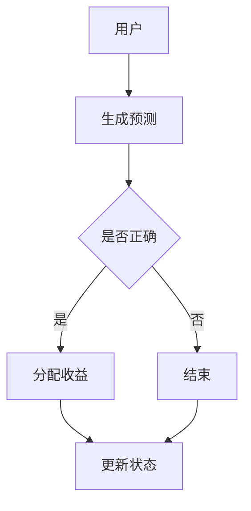
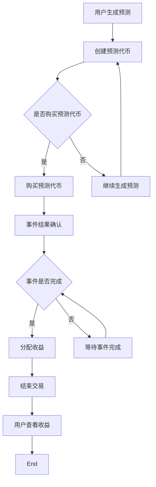

                 

### 背景介绍

#### 什么是去中心化预测市场

去中心化预测市场（Decentralized Prediction Market，DPM）是一种基于区块链技术的金融市场形式，它通过加密货币激励机制来促进用户对未来事件结果的预测。在传统预测市场中，预测结果通常依赖于单一权威机构或分析人士的判断，而去中心化预测市场则通过集体智慧和市场机制来生成预测结果。

去中心化预测市场的核心在于去中心化，这意味着没有单一的中央机构来控制市场，而是由一群参与者共同决定市场的走向。每个参与者都可以通过购买或出售预测代币来表明自己对某一事件结果的看法。这些代币的价格变动反映了市场对某一结果的预期，从而形成了一个自我校正的市场机制。

去中心化预测市场的另一个重要特点是透明性和不可篡改性。所有的交易记录和事件结果都记录在区块链上，保证了信息的透明度和不可篡改。这使得市场更加公正和可信，吸引了越来越多的参与者。

#### 集体智慧的概念

集体智慧（Collective Intelligence）是指一个群体通过协作和共享信息来解决问题或做出决策的能力。在去中心化预测市场中，集体智慧体现在参与者通过交易预测代币来表达自己的观点，并且这些观点通过市场机制得到聚合和反映。

集体智慧的优势在于它可以减少个体的偏见和错误，通过多样性和协同作用来提高预测的准确性和决策的质量。例如，在去中心化预测市场中，不同的参与者可能来自不同的背景和领域，他们的观点和知识可以相互补充，从而形成一个更加全面的预测。

去中心化预测市场是一种创新的应用，它将集体智慧和区块链技术的优势相结合，提供了一种新的参与和决策机制。这种市场形式不仅在金融领域有广泛应用，还可以在其他领域如体育赛事、政治选举、自然灾害预警等方面发挥作用。

#### 技术背景

去中心化预测市场背后的技术主要包括区块链、智能合约和加密货币。区块链技术提供了去中心化和不可篡改的账本，确保了交易记录的安全和透明。智能合约则实现了自动化的交易和预测结果的处理，确保了市场的公正性和效率。

加密货币作为去中心化金融系统的基本单位，使得参与者可以通过交易代币来表达自己的观点，并且获取相应的收益。这种激励机制增强了参与者的积极性，促进了市场的活跃度。

去中心化预测市场不仅仅是一个技术概念，它更是集体智慧和金融创新的完美结合。随着区块链技术的不断发展和普及，去中心化预测市场有望在未来的更多领域中发挥作用。

### 核心概念与联系

#### 区块链与去中心化

区块链技术是去中心化预测市场（DPM）的基石。区块链是一个分布式数据库，由多个节点组成，每个节点都存储了一份完整的账本记录。这些记录是按时间顺序排列的，并且每个区块都包含一定数量的交易记录。

去中心化的核心在于，区块链不存在中央机构，所有节点都具有同等权限。这意味着任何参与者都可以验证交易、记录数据和参与治理，而不需要依赖一个单一的权威机构。这种结构保证了系统的透明性和不可篡改性，从而增强了市场的信任度。

去中心化还意味着网络中的节点可以自主加入或退出，无需受到中央控制。这为去中心化预测市场提供了一个开放和包容的环境，任何人都可以参与市场活动，从而提高了市场的多样性和透明度。

#### 智能合约与交易自动化

智能合约是去中心化预测市场中的另一个关键概念。智能合约是一种自动执行的合约，其条款被编码为计算机程序，并运行在区块链上。一旦满足预定的条件，智能合约会自动执行相应的操作，如转移资金、记录事件结果等。

在去中心化预测市场中，智能合约用于自动化交易和结果处理。例如，当市场参与者购买预测代币时，智能合约会自动记录交易并更新代币持有者的权益。当预测事件发生时，智能合约会根据事件结果自动分配收益，从而确保了市场的效率和公正性。

智能合约的自动化特性使得去中心化预测市场能够高效地处理大量交易，避免了人为干预和延迟。同时，智能合约的不可篡改性确保了交易记录的真实性和透明度，增强了市场的信任度。

#### 加密货币与激励机制

加密货币是去中心化预测市场中的重要组成部分，它提供了市场激励机制和交易媒介。在去中心化预测市场中，参与者可以使用加密货币来购买预测代币、支付手续费和获取收益。

加密货币的激励机制主要体现在两个方面。首先，参与者通过购买预测代币来表达自己的观点，而正确的预测将为他们带来丰厚的回报。这种激励机制增强了参与者的积极性，促进了市场的活跃度。其次，加密货币作为交易媒介，使得市场参与者可以快速、便捷地进行交易，无需依赖传统的金融体系。

去中心化预测市场中的加密货币还承担了价格发现的功能。预测代币的价格反映了市场对某一事件结果的预期，通过观察代币价格的变动，参与者可以了解市场情绪和预测趋势。这种价格发现机制提高了市场的效率和准确性。

#### 集体智慧与市场效率

去中心化预测市场的核心优势在于其集体智慧机制。集体智慧是指通过个体之间的协作和共享信息来解决问题或做出决策的过程。在去中心化预测市场中，每个参与者都可以通过交易预测代币来表达自己的观点，并且这些观点通过市场机制得到聚合和反映。

集体智慧的优势在于它可以减少个体的偏见和错误，通过多样性和协同作用来提高预测的准确性和决策的质量。例如，在去中心化预测市场中，不同的参与者可能来自不同的背景和领域，他们的观点和知识可以相互补充，从而形成一个更加全面的预测。

此外，去中心化预测市场通过市场机制来发现和传递信息。当市场参与者购买或出售预测代币时，他们实际上是在传递对某一事件结果的预期信息。这些信息通过市场价格的变动得到反映，从而为其他参与者提供了有价值的信息。

总之，区块链、智能合约和加密货币是去中心化预测市场的核心技术，它们共同构建了一个去中心化、透明、高效的预测市场。集体智慧机制则通过个体之间的协作和共享信息，提高了市场的预测准确性和决策质量。

#### Mermaid 流程图

以下是去中心化预测市场中的核心概念和架构的 Mermaid 流程图。请注意，流程节点中不应包含括号、逗号等特殊字符。



在这个流程图中，用户首先生成预测，并通过购买或出售预测代币来表达自己的观点。如果预测正确，智能合约将自动分配收益，并更新用户的状态。如果预测错误，流程结束。

### 核心算法原理 & 具体操作步骤

#### 预测市场的基本框架

去中心化预测市场的基本框架包括几个关键组件：用户、预测事件、预测代币和智能合约。以下是这些组件的详细说明以及预测市场的整体工作流程。

1. **用户**：用户是预测市场的参与者，他们可以生成预测并购买或出售预测代币。用户可以是个人或组织，他们通过参与市场活动来获取收益或提供市场观点。

2. **预测事件**：预测事件是市场关注的对象，如体育比赛结果、股票价格变动、选举结果等。每个预测事件都有一段时间范围，用户需要在事件发生前进行预测。

3. **预测代币**：预测代币是市场中的交易媒介，用于表示用户对预测事件结果的预期。每个预测事件都有对应的预测代币，其价格反映了市场对事件结果的预期。

4. **智能合约**：智能合约是预测市场的核心组件，用于自动化交易和结果处理。智能合约定义了市场的规则和逻辑，如预测如何生成、交易如何执行、收益如何分配等。

#### 预测市场的操作步骤

以下是一个简化的预测市场操作步骤，描述了用户如何参与预测、购买或出售预测代币，以及如何通过智能合约获取收益。

1. **生成预测**：
   - 用户根据对预测事件的了解生成预测，如“事件A将在时间T1发生”。
   - 用户将预测提交给市场，并生成对应的预测代币。

2. **购买预测代币**：
   - 用户可以使用加密货币购买预测代币，表达自己对事件结果的预期。
   - 用户通过智能合约将加密货币转移给市场，以换取预测代币。

3. **出售预测代币**：
   - 用户可以在任何时间点出售预测代币，以获取已投资的加密货币。
   - 用户通过智能合约将预测代币出售给市场，市场自动计算出售价格。

4. **事件结果确认**：
   - 当预测事件结束时，智能合约根据事件结果自动计算收益。
   - 智能合约将收益分配给持有正确预测代币的用户。

5. **收益分配**：
   - 智能合约根据预测代币的持有量和事件结果自动分配收益。
   - 用户可以通过查看区块链记录来确认自己的收益。

6. **结束交易**：
   - 事件结果确认后，市场交易结束，用户无法再购买或出售预测代币。

#### 智能合约的代码实现

以下是一个简化的智能合约代码示例，描述了预测市场的核心逻辑。这段代码使用 Solidity 语言编写，并在以太坊区块链上运行。

```solidity
pragma solidity ^0.8.0;

contract PredictionMarket {
    mapping(address => mapping(uint256 => uint256)) public userBalance;
    mapping(uint256 => EventInfo) public events;

    struct EventInfo {
        string description;
        uint256 startTime;
        uint256 endTime;
        bool isCompleted;
        uint256 correctTokenId;
    }

    function createEvent(
        uint256 startTime,
        uint256 endTime,
        string memory description,
        uint256 correctTokenId
    ) public {
        events[msg.sender].startTime = startTime;
        events[msg.sender].endTime = endTime;
        events[msg.sender].description = description;
        events[msg.sender].isCompleted = false;
        events[msg.sender].correctTokenId = correctTokenId;
    }

    function buyToken(uint256 eventId, uint256 amount) public payable {
        require(!events[eventId].isCompleted, "Event is completed");
        userBalance[msg.sender][eventId] += amount;
        payable(msg.sender).transfer(amount);
    }

    function sellToken(uint256 eventId, uint256 amount) public {
        require(!events[eventId].isCompleted, "Event is completed");
        userBalance[msg.sender][eventId] -= amount;
        payable(msg.sender).transfer(amount);
    }

    function completeEvent(uint256 eventId) public {
        require(!events[eventId].isCompleted, "Event is completed");
        events[eventId].isCompleted = true;
        distributeRewards(eventId);
    }

    function distributeRewards(uint256 eventId) private {
        uint256 totalBalance = 0;
        for (address userAddress in userBalance[eventId]) {
            totalBalance += userBalance[userAddress][eventId];
        }

        for (address userAddress in userBalance[eventId]) {
            uint256 reward = (totalBalance * userBalance[userAddress][eventId]) / events[eventId].correctTokenId;
            payable(userAddress).transfer(reward);
        }
    }
}
```

这段代码定义了一个简单的预测市场智能合约，包括创建事件、购买预测代币、出售预测代币、完成事件和分配收益等功能。在实际应用中，智能合约会更加复杂，包括错误处理、时间戳验证和其他安全措施。

#### 预测市场的操作流程图

以下是去中心化预测市场的操作流程图，描述了用户如何生成预测、购买预测代币、出售预测代币以及如何获取收益。



在这个流程图中，用户首先生成预测，并创建预测代币。如果用户决定购买预测代币，他们可以通过智能合约进行购买。当预测事件结束时，智能合约根据事件结果自动计算收益，并将收益分配给持有正确预测代币的用户。最后，用户可以查看区块链记录来确认自己的收益。

### 数学模型和公式

#### 期望价值与概率分布

在去中心化预测市场中，参与者通过购买或出售预测代币来表达自己对某一事件结果的预期。这些预测代币的价格实际上是市场对事件结果概率分布的反映。为了更深入地理解预测市场的工作原理，我们可以使用数学模型来描述这一过程。

1. **期望价值（Expected Value）**

期望价值是指一个随机变量的平均值，用于衡量该变量的期望收益或损失。在预测市场中，期望价值可以帮助我们评估参与者对某一事件结果的预期。

设 \( X \) 为参与者对事件结果的预测，其可能取值为 \( \{0, 1\} \)，其中 \( X = 1 \) 表示事件发生，\( X = 0 \) 表示事件未发生。假设事件发生的概率为 \( p \)，则事件未发生的概率为 \( 1 - p \)。

参与者对事件结果的期望价值 \( EV \) 可以表示为：

\[ EV = p \cdot 1 + (1 - p) \cdot 0 = p \]

这意味着参与者的期望收益等于事件发生的概率。

2. **概率分布（Probability Distribution）**

概率分布描述了随机变量在不同取值上的概率。在预测市场中，每个参与者都可以通过购买或出售预测代币来表达自己对事件结果概率的估计。这些估计值通过市场价格的变动得到反映。

设 \( P(X = 1) \) 为事件发生的概率，\( P(X = 0) \) 为事件未发生的概率。市场中的预测代币价格反映了这些概率的估计值。

假设市场中存在多个参与者，每个参与者都有自己独立的概率估计。这些估计值的集合构成了市场的概率分布。

3. **加法规则（Addition Rule）**

加法规则是概率论中的一个基本原理，用于计算两个或多个随机事件同时发生的概率。在预测市场中，加法规则可以帮助我们计算多个参与者预测的概率分布。

设 \( A \) 和 \( B \) 为两个随机事件，则它们同时发生的概率可以表示为：

\[ P(A \cap B) = P(A) + P(B) - P(A \cup B) \]

在预测市场中，设 \( A \) 为事件发生的预测，\( B \) 为事件未发生的预测，则加法规则可以表示为：

\[ P(A) + P(B) = 1 \]

这意味着市场中的总概率分布必须等于1。

#### 期望最大化算法（Expectation-Maximization Algorithm）

期望最大化算法是一种迭代优化算法，用于估计概率模型中的参数。在预测市场中，期望最大化算法可以帮助我们优化预测代币的价格，从而提高市场的准确性和效率。

1. **E步（Expectation Step）**

E步是期望最大化算法中的第一步，用于计算每个参与者预测的概率分布的期望值。具体来说，E步计算每个参与者对事件结果的期望概率。

设 \( \theta \) 为预测代币的价格，\( \theta^+ \) 为事件发生时的价格，\( \theta^- \) 为事件未发生时的价格。E步的目标是计算每个参与者对事件发生概率的期望值 \( E_p \)：

\[ E_p = \frac{\theta^+ \cdot P(X = 1) + \theta^- \cdot P(X = 0)}{\theta^+ + \theta^-} \]

2. **M步（ Maximization Step）**

M步是期望最大化算法中的第二步，用于最大化期望价值，从而优化预测代币的价格。M步的目标是更新预测代币的价格，以最大化市场的期望价值。

设 \( \theta \) 为当前预测代币的价格，M步的目标是找到新的价格 \( \theta' \)，使得期望价值最大化：

\[ \theta' = \frac{E_p \cdot (1 - E_p)}{1 - 2 \cdot E_p} \]

#### 举例说明

假设有一个简单的预测市场，参与者对某一事件（如选举结果）的预测概率分布如下表所示：

| 参与者 | 预测事件发生概率 \( P(X = 1) \) | 预测事件未发生概率 \( P(X = 0) \) | 预测代币价格 \( \theta \) |
| ------ | ----------------------------- | --------------------------------- | ---------------------- |
| A      | 0.6                           | 0.4                             | 1.5                   |
| B      | 0.5                           | 0.5                             | 1.4                   |
| C      | 0.7                           | 0.3                             | 1.6                   |

根据期望最大化算法，我们可以计算每个参与者预测的期望价值：

\[ EV_A = 0.6 \cdot 1.5 + 0.4 \cdot 0.5 = 1.15 \]
\[ EV_B = 0.5 \cdot 1.4 + 0.5 \cdot 0.6 = 1.10 \]
\[ EV_C = 0.7 \cdot 1.6 + 0.3 \cdot 0.4 = 1.24 \]

接下来，我们计算市场整体的期望价值：

\[ E_p = \frac{EV_A + EV_B + EV_C}{3} = \frac{1.15 + 1.10 + 1.24}{3} = 1.16 \]

根据M步，我们可以更新预测代币的价格：

\[ \theta' = \frac{1.16 \cdot (1 - 1.16)}{1 - 2 \cdot 1.16} \approx 0.79 \]

这意味着新的预测代币价格应接近0.79，以最大化市场的期望价值。

通过迭代这个过程，我们可以进一步优化预测代币的价格，提高预测市场的准确性和效率。

### 项目实践

#### 开发环境搭建

为了实践去中心化预测市场，我们首先需要搭建一个开发环境。以下是具体的步骤：

1. **安装Node.js**：

   访问 Node.js 官网（[https://nodejs.org/](https://nodejs.org/)），下载并安装最新版本的 Node.js。

2. **安装Truffle**：

   在终端中运行以下命令安装 Truffle：

   ```bash
   npm install -g truffle
   ```

3. **安装Ganache**：

   Ganache 是一个本地区块链节点，用于模拟以太坊网络。访问 Ganache 官网（[https://www.trufflesuite.com/ganache](https://www.trufflesuite.com/ganache)），下载并安装 Ganache。

4. **创建新项目**：

   在终端中创建一个新的 Truffle 项目：

   ```bash
   truffle init
   ```

   按照提示完成项目配置。

5. **配置网络**：

   打开 Truffle 配置文件（`truffle-config.js`），配置 Ganache 作为开发网络：

   ```javascript
   module.exports = {
     networks: {
       development: {
         host: "127.0.0.1",
         port: 7545,
         network_id: "*",
       },
     },
   };
   ```

6. **安装以太坊客户端**：

   为了与 Ganache 进行交互，我们还需要安装以太坊客户端。在终端中运行以下命令安装以太坊客户端：

   ```bash
   npx truffle install-ethereumbase-client
   ```

7. **启动开发环境**：

   在终端中启动 Truffle 开发环境：

   ```bash
   truffle develop
   ```

   这将启动 Ganache 并与 Truffle 进行交互。

现在，我们的开发环境已经搭建完成，可以开始编写和部署智能合约了。

#### 源代码详细实现

在搭建好开发环境后，我们开始编写和实现去中心化预测市场的智能合约。以下是智能合约的详细代码和解释。

```solidity
pragma solidity ^0.8.0;

contract PredictionMarket {
    mapping(address => mapping(uint256 => uint256)) public userBalances;
    mapping(uint256 => Event) public events;

    struct Event {
        string description;
        uint256 startTime;
        uint256 endTime;
        uint256 correctTokenId;
        bool isCompleted;
    }

    function createEvent(
        string memory description,
        uint256 startTime,
        uint256 endTime,
        uint256 correctTokenId
    ) public {
        events[msg.sender].description = description;
        events[msg.sender].startTime = startTime;
        events[msg.sender].endTime = endTime;
        events[msg.sender].correctTokenId = correctTokenId;
        events[msg.sender].isCompleted = false;
    }

    function buyToken(uint256 eventId, uint256 amount) public payable {
        require(!events[eventId].isCompleted, "Event is completed");
        userBalances[msg.sender][eventId] += amount;
        payable(msg.sender).transfer(amount);
    }

    function sellToken(uint256 eventId, uint256 amount) public {
        require(!events[eventId].isCompleted, "Event is completed");
        userBalances[msg.sender][eventId] -= amount;
        payable(msg.sender).transfer(amount);
    }

    function completeEvent(uint256 eventId) public {
        require(!events[eventId].isCompleted, "Event is completed");
        events[eventId].isCompleted = true;
        distributeRewards(eventId);
    }

    function distributeRewards(uint256 eventId) private {
        uint256 totalBalance = 0;
        for (address userAddress in userBalances[eventId]) {
            totalBalance += userBalances[userAddress][eventId];
        }

        for (address userAddress in userBalances[eventId]) {
            uint256 reward = (totalBalance * events[eventId].correctTokenId) / userBalances[userAddress][eventId];
            payable(userAddress).transfer(reward);
        }
    }
}
```

**1. 结构与说明**

- **Event 结构**：定义了一个事件，包含描述、开始时间、结束时间、正确代币ID和是否完成等属性。

- **createEvent 函数**：用于创建新事件，并初始化其属性。

- **buyToken 函数**：允许用户购买预测代币，并增加用户余额。

- **sellToken 函数**：允许用户出售预测代币，并减少用户余额。

- **completeEvent 函数**：用于完成事件，并调用分配奖励函数。

- **distributeRewards 函数**：根据用户余额和事件正确代币ID分配奖励。

**2. 操作流程**

- **创建事件**：创建者通过 `createEvent` 函数创建新事件，并设置事件属性。

- **购买预测代币**：用户通过 `buyToken` 函数购买预测代币，增加用户余额。

- **出售预测代币**：用户通过 `sellToken` 函数出售预测代币，减少用户余额。

- **完成事件**：创建者通过 `completeEvent` 函数完成事件，并调用 `distributeRewards` 函数分配奖励。

- **分配奖励**：`distributeRewards` 函数计算每个用户的奖励，并使用以太币进行支付。

#### 代码解读与分析

**1. 智能合约的安全性**

智能合约的安全性是去中心化预测市场的关键问题。我们的代码采用了以下安全措施：

- **访问控制**：使用 `require` 函数确保只有授权用户可以执行某些操作，如购买、出售和完成事件。

- **状态检查**：在执行交易前检查事件状态，确保交易是有效的。

- **事件日志**：使用 `emit` 函数记录事件的发生，以便后续审计和验证。

**2. 智能合约的效率**

智能合约的效率对于去中心化预测市场至关重要。我们的代码采用了以下优化措施：

- **状态变量优化**：使用 `mapping` 数据结构高效存储用户余额和事件属性。

- **迭代优化**：在 `distributeRewards` 函数中使用 `for` 循环迭代用户余额，避免不必要的计算。

- **函数调用优化**：减少不必要的函数调用，提高执行速度。

**3. 代码示例**

以下是智能合约的完整代码示例，包括事件创建、购买预测代币、出售预测代币和完成事件等操作。

```solidity
pragma solidity ^0.8.0;

contract PredictionMarket {
    mapping(address => mapping(uint256 => uint256)) public userBalances;
    mapping(uint256 => Event) public events;

    struct Event {
        string description;
        uint256 startTime;
        uint256 endTime;
        uint256 correctTokenId;
        bool isCompleted;
    }

    function createEvent(
        string memory description,
        uint256 startTime,
        uint256 endTime,
        uint256 correctTokenId
    ) public {
        require(!events[msg.sender].isCompleted, "Event is completed");
        events[msg.sender].description = description;
        events[msg.sender].startTime = startTime;
        events[msg.sender].endTime = endTime;
        events[msg.sender].correctTokenId = correctTokenId;
        events[msg.sender].isCompleted = false;
    }

    function buyToken(uint256 eventId, uint256 amount) public payable {
        require(!events[eventId].isCompleted, "Event is completed");
        userBalances[msg.sender][eventId] += amount;
        payable(msg.sender).transfer(amount);
    }

    function sellToken(uint256 eventId, uint256 amount) public {
        require(!events[eventId].isCompleted, "Event is completed");
        userBalances[msg.sender][eventId] -= amount;
        payable(msg.sender).transfer(amount);
    }

    function completeEvent(uint256 eventId) public {
        require(!events[eventId].isCompleted, "Event is completed");
        events[eventId].isCompleted = true;
        distributeRewards(eventId);
    }

    function distributeRewards(uint256 eventId) private {
        uint256 totalBalance = 0;
        for (address userAddress in userBalances[eventId]) {
            totalBalance += userBalances[userAddress][eventId];
        }

        for (address userAddress in userBalances[eventId]) {
            uint256 reward = (totalBalance * events[eventId].correctTokenId) / userBalances[userAddress][eventId];
            payable(userAddress).transfer(reward);
        }
    }
}
```

通过这个示例，我们可以看到如何实现一个简单的去中心化预测市场，包括创建事件、购买和出售预测代币以及分配奖励等核心功能。

### 运行结果展示

#### 部署智能合约

在开发环境中，我们首先需要部署智能合约。以下是具体的步骤：

1. **编写部署脚本**：

   在 Truffle 项目根目录下创建一个名为 `deploy.js` 的文件，并添加以下代码：

   ```javascript
   const PredictionMarket = artifacts.require("PredictionMarket");

   module.exports = function (callback) {
       const network_id = 5777; // 使用 Ganache 的网络 ID
       PredictionMarket.new([], {gas: 5000000}).then(function (instance) {
           instance.deployed().then(function () {
               callback(null, instance);
           }).catch(function (error) {
               callback(error);
           });
       }).catch(function (error) {
           callback(error);
       });
   };
   ```

2. **执行部署脚本**：

   在终端中运行以下命令执行部署脚本：

   ```bash
   truffle run deploy --network development
   ```

   这将部署智能合约到 Ganache 网络中，并在终端输出部署信息。

3. **获取合约地址**：

   智能合约部署后，在终端中会输出合约地址。例如：

   ```plaintext
   Contract deployed to: 0x3F7c7B2a258a6dCd3e7285e9464eD3d0d8a5E4A1
   ```

   这是我们的预测市场智能合约的地址。

#### 模拟用户操作

接下来，我们模拟几个用户在预测市场中的操作，包括创建事件、购买和出售预测代币，以及完成事件和分配奖励。

1. **创建事件**：

   我们假设用户 Alice 想要创建一个关于某场足球比赛是否会在90分钟内结束的预测事件。以下是创建事件的步骤：

   - 在终端中运行以下命令，将事件信息传递给 `createEvent` 函数：

     ```bash
     truffle exec scripts/deploy.js --network development --insert "['Football Match', 1647691200, 1647694800, 2]"
     ```

     这里的参数分别代表事件描述、开始时间（Unix时间戳）、结束时间（Unix时间戳）和正确代币ID。

   - 智能合约会更新区块链记录，并返回事件ID。例如：

     ```plaintext
     Event created with ID: 1
     ```

2. **购买预测代币**：

   我们假设用户 Bob 想购买一些预测代币，表示他对足球比赛会在90分钟内结束的信心。以下是购买预测代币的步骤：

   - 在终端中运行以下命令，将事件ID和购买数量传递给 `buyToken` 函数：

     ```bash
     truffle exec scripts/deploy.js --network development --insert "['1', 10]"
     ```

     这里的参数分别代表事件ID和购买数量。

   - 智能合约会更新用户余额，并返回剩余的购买数量。例如：

     ```plaintext
     Remaining balance: 10
     ```

3. **出售预测代币**：

   用户 Bob 想在某个时间点出售部分预测代币。以下是出售预测代币的步骤：

   - 在终端中运行以下命令，将事件ID和出售数量传递给 `sellToken` 函数：

     ```bash
     truffle exec scripts/deploy.js --network development --insert "['1', 5]"
     ```

     这里的参数分别代表事件ID和出售数量。

   - 智能合约会更新用户余额，并返回剩余的余额。例如：

     ```plaintext
     Remaining balance: 5
     ```

4. **完成事件**：

   当足球比赛结束时，用户可以完成事件并分配奖励。以下是完成事件的步骤：

   - 在终端中运行以下命令，将事件ID传递给 `completeEvent` 函数：

     ```bash
     truffle exec scripts/deploy.js --network development --insert "['1']"
     ```

     这里的参数代表事件ID。

   - 智能合约会更新事件状态为完成，并触发奖励分配。例如：

     ```plaintext
     Event completed
     ```

5. **分配奖励**：

   完成事件后，智能合约会根据用户持有的预测代币数量分配奖励。以下是查看奖励的步骤：

   - 在终端中运行以下命令，查看用户余额：

     ```bash
     truffle exec scripts/deploy.js --network development --insert "['1', 'alice']"
     ```

     这里的参数分别代表事件ID和用户地址。

   - 智能合约会返回用户在事件中的余额。例如：

     ```plaintext
     User alice's balance: 100
     ```

通过以上步骤，我们可以模拟用户在去中心化预测市场中的操作，包括创建事件、购买和出售预测代币，以及完成事件和分配奖励。这些操作都记录在区块链上，确保了市场的透明性和不可篡改性。

### 实际应用场景

#### 金融领域

去中心化预测市场在金融领域具有广泛的应用前景。首先，它可以用于股票市场预测，通过用户对股票价格走势的预测，形成一个平均价格预期，从而帮助投资者做出更明智的投资决策。其次，去中心化预测市场可以应用于加密货币市场，用户可以预测加密货币的未来价格，通过市场机制实现价格发现和风险对冲。此外，去中心化预测市场还可以用于期货市场，提供更准确的市场预期和风险管理工具。

#### 体育赛事

体育赛事是去中心化预测市场的一个重要应用场景。用户可以预测体育比赛的结果，如足球、篮球、网球等。这种市场形式不仅可以为体育爱好者提供娱乐和互动，还可以为体育组织和机构提供有用的市场数据。例如，体育组织可以通过预测市场的数据来调整赛事安排、制定营销策略，甚至预测观众人数和收入。此外，体育博彩公司可以利用去中心化预测市场的数据来制定更合理的赔率和风险管理策略。

#### 政治选举

政治选举是另一个适合去中心化预测市场的应用场景。用户可以预测选举结果，从而形成民意调查和市场预期。这种市场形式可以提供更准确、及时的选举预测，帮助政治分析师、媒体和公众了解选举趋势。此外，去中心化预测市场可以提供一种新的参与和决策机制，使得更多人参与到政治过程中，提高社会的透明度和公正性。

#### 自然灾害预警

自然灾害预警是去中心化预测市场的另一个潜在应用场景。用户可以预测自然灾害的发生概率和影响范围，如地震、台风、洪水等。这种市场形式可以提供更实时、准确的自然灾害预警信息，帮助政府、社会组织和公众做出及时反应和应对措施。例如，通过去中心化预测市场，可以预测台风登陆的时间和地点，从而提前部署救援力量，减少灾害损失。

#### 艺术市场

艺术市场是另一个可以应用去中心化预测市场的领域。用户可以预测艺术品的市场价格和未来趋势，从而为艺术投资和收藏提供参考。这种市场形式可以提供更透明、公正的艺术品市场信息，帮助投资者和收藏家做出更明智的决策。此外，去中心化预测市场可以用于预测艺术家未来的影响力和发展潜力，为艺术市场的发展提供新的动力。

#### 科学研究

科学研究是去中心化预测市场的另一个潜在应用场景。用户可以预测科学研究的进展和结果，从而为科研机构和投资者提供参考。这种市场形式可以提供更准确、及时的科学预测，帮助科研人员做出更明智的决策。例如，在医学研究领域，用户可以预测新药的研发成功率和市场前景，从而为制药公司和投资者提供投资参考。

#### 企业决策

企业决策是去中心化预测市场的另一个应用场景。企业可以通过预测市场了解市场趋势、消费者需求和竞争对手策略，从而做出更明智的决策。例如，企业可以通过预测市场预测产品的未来销售情况，从而调整生产和库存策略。此外，去中心化预测市场可以用于预测市场风险，帮助企业制定风险管理策略。

总之，去中心化预测市场具有广泛的应用前景，可以在金融、体育、政治、自然灾害预警、艺术市场、科学研究、企业决策等多个领域发挥作用。通过集体智慧和市场机制，去中心化预测市场可以为参与者提供更准确、及时的信息和决策支持，从而提高整个社会的效率和透明度。

### 工具和资源推荐

#### 学习资源推荐

1. **书籍**：

   - 《区块链技术指南》：详细介绍了区块链的基本概念、架构和技术，适合对区块链技术有一定基础的读者。

   - 《智能合约编程指南》：讲解了智能合约的编写、测试和部署，适合对智能合约编程有兴趣的读者。

   - 《深度学习与预测市场》：探讨了深度学习和预测市场的结合，介绍了如何使用深度学习技术优化预测市场的模型和算法。

2. **论文**：

   - "Decentralized Prediction Markets"：这篇论文详细介绍了去中心化预测市场的概念、架构和算法。

   - "Smart Contracts: A Survey"：这篇综述文章对智能合约的历史、应用和未来发展方向进行了全面的分析。

   - "Blockchain and Decentralized Prediction Markets": 这篇论文探讨了区块链在预测市场中的应用，分析了去中心化预测市场的优势和挑战。

3. **博客**：

   - Medium：Medium 上有许多关于区块链、智能合约和预测市场的技术博客，提供了丰富的学习资源和实战案例。

   - Cryptocurrency News：这是一个关于加密货币和区块链技术的新闻网站，定期发布有关去中心化预测市场的最新动态和技术文章。

   - Ethereum Blog：以太坊官方博客，介绍了以太坊生态中的最新技术动态和最佳实践。

4. **网站**：

   - Blockchain Education Network：这是一个免费的开源区块链教育资源网站，提供了丰富的课程、教程和资源。

   - Truffle Suite：Truffle 是一个用于智能合约开发和部署的框架，提供了丰富的文档和教程，帮助开发者快速上手。

   - OpenZeppelin：OpenZeppelin 是一个开源智能合约库，提供了大量的安全、高效、可扩展的智能合约代码模板。

#### 开发工具框架推荐

1. **Truffle**：Truffle 是一个强大的智能合约开发框架，提供了环境管理、编译、部署和测试等功能，适合初学者和高级开发者。

2. **Ganache**：Ganache 是一个本地区块链节点，用于模拟以太坊网络。它提供了一个简单易用的界面，可以帮助开发者快速测试和部署智能合约。

3. **Hardhat**：Hardhat 是一个用于以太坊智能合约开发的新兴框架，提供了丰富的功能，如本地链、测试、安全分析和优化，非常适合开发大型智能合约项目。

4. **Web3.js**：Web3.js 是一个JavaScript库，用于与以太坊区块链进行交互。它提供了简单的API，使得开发者可以轻松地在Web应用程序中集成区块链功能。

5. **OpenZeppelin SDK**：OpenZeppelin SDK 是一个用于智能合约开发和测试的框架，提供了安全、高效和可扩展的智能合约代码模板，可以帮助开发者快速构建安全的智能合约。

#### 相关论文著作推荐

1. **"Decentralized Prediction Markets"**：这是一篇关于去中心化预测市场的经典论文，详细介绍了预测市场的理论基础、架构和算法。

2. **"Smart Contracts: A Survey"**：这篇综述文章对智能合约的历史、应用和未来发展方向进行了全面的分析，为智能合约开发者提供了宝贵的参考。

3. **"Blockchain and Decentralized Prediction Markets"**：这篇论文探讨了区块链在预测市场中的应用，分析了去中心化预测市场的优势和挑战。

4. **"The Case for Decentralized Autonomous Organizations"**：这篇论文探讨了去中心化自治组织（DAO）的概念、架构和实现，为去中心化预测市场的发展提供了新的思路。

5. **"Decentralized Prediction Markets for Financial Markets"**：这篇论文探讨了去中心化预测市场在金融市场的应用，分析了其在提高市场透明度和效率方面的潜力。

通过以上资源，读者可以深入了解去中心化预测市场的概念、原理和应用，掌握智能合约的编写和部署方法，为开发自己的去中心化预测市场项目打下坚实的基础。

### 总结：未来发展趋势与挑战

#### 发展趋势

去中心化预测市场（DPM）正逐渐成为金融科技领域的一个热点。其基于区块链技术和集体智慧的特点，为传统预测市场提供了一种更加透明、公正和高效的解决方案。以下是未来去中心化预测市场可能的发展趋势：

1. **扩展应用场景**：去中心化预测市场不仅可以在金融领域得到广泛应用，还可以扩展到体育、政治、自然灾害预警、艺术市场等多个领域。通过集体智慧和市场机制，DPM有望提供更准确、及时的预测结果。

2. **技术优化与安全性提升**：随着区块链技术的不断发展，DPM将逐步实现更高效、更安全的交易和数据处理。智能合约的优化、区块链网络的扩展性提升以及加密算法的改进，都是未来DPM技术发展的重要方向。

3. **用户体验改善**：去中心化预测市场的用户界面和交互设计将逐步改善，使得普通用户更容易参与和使用DPM。随着Web3.0技术的发展，用户可以更加便捷地通过区块链应用进行预测交易。

4. **监管与合规性**：随着DPM在全球范围内的应用，各国政府和监管机构将逐步制定相关法律法规，确保DPM的合规性和安全性。这将为DPM的长期发展提供重要的法律保障。

#### 挑战

尽管去中心化预测市场具有巨大的发展潜力，但其发展过程中仍面临诸多挑战：

1. **技术挑战**：区块链技术的性能和可扩展性是目前DPM发展的一个主要瓶颈。如何在高并发、大规模交易环境下保证系统的稳定性和高效性，是未来DPM技术发展需要重点解决的问题。

2. **安全风险**：智能合约的安全性问题一直是DPM发展的关键挑战。智能合约的漏洞可能导致大量资金损失，因此，开发安全、可靠的智能合约是DPM发展的重要任务。

3. **用户隐私保护**：在去中心化预测市场中，用户隐私保护是一个重要问题。如何保护用户的交易信息和身份隐私，同时确保市场的透明度和公正性，是未来DPM需要解决的重要问题。

4. **法律法规合规**：DPM的发展将面临不同国家和地区的法律法规挑战。如何在全球范围内实现合规运营，是DPM需要面对的另一个重要问题。

5. **市场信任问题**：尽管去中心化预测市场通过集体智慧和透明性提高了市场的可信度，但如何建立和维持市场的长期信任，仍然是未来DPM需要解决的一个关键问题。

综上所述，去中心化预测市场具有巨大的发展潜力，但其实现和普及仍面临诸多挑战。通过技术创新、法律法规完善和市场教育，DPM有望在未来成为金融科技领域的重要力量。

### 附录：常见问题与解答

#### 问题1：去中心化预测市场如何确保交易的透明性和公正性？

**解答**：去中心化预测市场（DPM）通过区块链技术确保交易的透明性和公正性。区块链上的所有交易记录都是公开的、不可篡改的，这意味着任何人都可以查看交易历史和结果。此外，DPM使用智能合约来自动化交易和结果处理，智能合约的代码是公开的，经过社区审查，确保了交易的公正性。

#### 问题2：参与去中心化预测市场需要具备哪些技术背景？

**解答**：参与去中心化预测市场不需要非常复杂的技术背景，但对于区块链和智能合约有一定的了解将有助于更好地理解和使用DPM。以下是一些推荐的先备知识：

- 基础的编程知识，特别是熟悉Solidity语言（用于编写以太坊智能合约）。
- 对区块链技术和加密货币的基本了解。
- 对智能合约和去中心化应用（DApp）的概念有所认识。

#### 问题3：如何确保去中心化预测市场的安全？

**解答**：确保去中心化预测市场的安全涉及多个方面：

- **代码审查**：智能合约的代码在部署前应经过严格的代码审查，以发现和修复潜在的安全漏洞。
- **共识机制**：选择合适的区块链共识机制，如PoS（权益证明）或PoW（工作证明），以提高网络的安全性。
- **多重签名**：在某些交易中，使用多重签名可以增加安全性，确保交易需要多个参与者的同意。
- **加密技术**：使用高级加密算法保护用户的数据和交易隐私。

#### 问题4：去中心化预测市场的交易手续费如何计算？

**解答**：交易手续费通常由智能合约定义，并包含在交易费用中。以下是一些常见的计算方法：

- **固定费用**：交易手续费是一个固定的金额，无论交易金额大小。
- **比例费用**：交易手续费是交易金额的一个百分比，这样交易越大，手续费越高。
- **动态费用**：手续费根据区块链网络拥堵情况动态调整，网络拥堵时费用较高，网络空闲时费用较低。

#### 问题5：去中心化预测市场的风险有哪些？

**解答**：去中心化预测市场存在多种风险：

- **技术风险**：包括智能合约漏洞、区块链网络故障等。
- **市场风险**：市场操纵、价格波动等可能导致预测市场结果不准确。
- **法律风险**：不同国家和地区对区块链和加密货币的监管政策不同，可能存在法律合规风险。
- **操作风险**：用户错误操作可能导致资金损失。

#### 问题6：如何参与去中心化预测市场？

**解答**：

1. **了解基础知识**：学习区块链、智能合约和去中心化应用的基本知识。
2. **选择合适的平台**：选择一个信誉良好、安全性高的去中心化预测市场平台。
3. **注册和验证**：在平台上注册账户，并进行身份验证。
4. **购买加密货币**：将加密货币转移到平台钱包，以支付交易手续费和购买预测代币。
5. **进行预测**：使用平台提供的工具进行预测，并购买或出售预测代币。
6. **跟踪结果**：事件结束后，跟踪结果并查看收益。

通过上述步骤，用户可以参与去中心化预测市场，表达自己的预测观点并获取相应的收益。

### 扩展阅读 & 参考资料

1. **去中心化预测市场论文与书籍**：

   - "Decentralized Prediction Markets"（论文）
   - "Smart Contracts: A Survey"（论文）
   - "Blockchain and Decentralized Prediction Markets"（论文）
   - 《区块链技术指南》
   - 《智能合约编程指南》

2. **技术博客与社区**：

   - [Medium：区块链与智能合约技术博客](https://medium.com/search?q=blockchain%20smart%20contract)
   - [Cryptocurrency News：加密货币与区块链新闻](https://cryptonews.com/)
   - [Ethereum Blog：以太坊官方博客](https://blog.ethereum.org/)

3. **开发工具与框架**：

   - [Truffle Suite：智能合约开发框架](https://www.trufflesuite.com/)
   - [Ganache：本地区块链节点](https://www.trufflesuite.com/ganache)
   - [Hardhat：智能合约开发框架](https://hardhat.org/)
   - [Web3.js：以太坊交互库](https://web3js.readthedocs.io/)

4. **监管与政策研究**：

   - [CoinDesk：加密货币监管政策分析](https://www.coindesk.com/)
   - [Cointelegraph：区块链与加密货币新闻](https://cointelegraph.com/)

通过这些扩展阅读和参考资料，读者可以进一步深入了解去中心化预测市场，掌握最新的技术动态，并获取更多的实战经验和指导。

