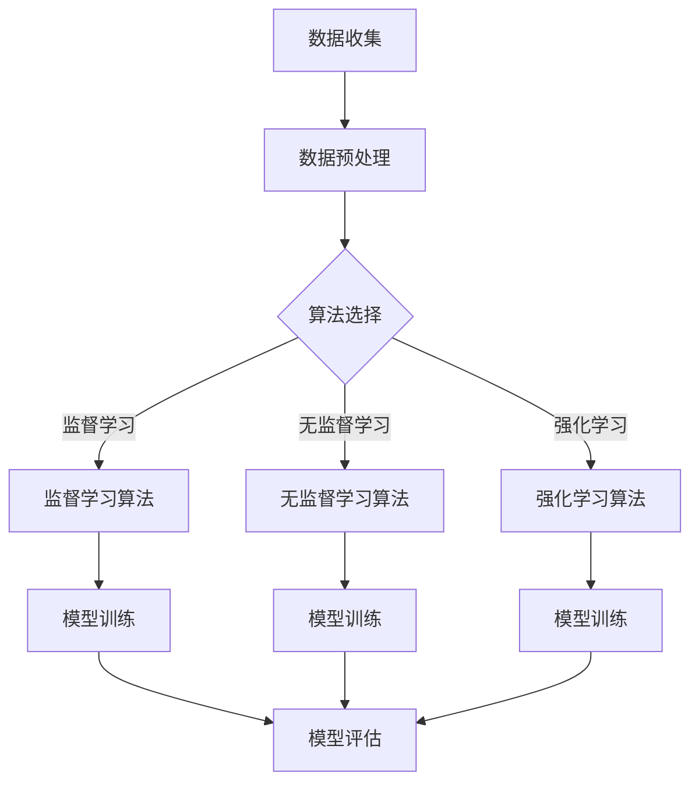

                 

### 文章标题

**图灵奖与AI算法的突破**

在当今科技日新月异的时代，人工智能（AI）已经成为推动技术进步的重要力量。图灵奖，被誉为计算机科学界的“诺贝尔奖”，是表彰在计算机科学领域做出卓越贡献的科学家们的最高荣誉。本文将深入探讨图灵奖在AI算法领域的突破，从历史背景、核心概念到具体实现，带您了解这一领域的发展轨迹和创新思维。

### Keywords:
- 图灵奖
- 人工智能
- 算法突破
- 计算机科学
- 算法创新

### Abstract:
This article explores the breakthroughs in AI algorithms awarded by the Turing Prize, highlighting the historical context, core concepts, and specific implementations. It aims to provide a comprehensive overview of the development trajectory and innovative thinking in this field.

### <a name="1-背景介绍"></a>1. 背景介绍（Background Introduction）

图灵奖是由英国计算机科学家艾伦·图灵的同事和朋友们在1966年设立的，旨在表彰对计算机科学领域作出杰出贡献的个人。它不仅仅局限于理论研究，还涵盖了算法、软件、硬件等各个领域。自设立以来，图灵奖已经评选出众多在计算机科学领域做出卓越贡献的科学家，他们在各自的领域中推动了技术的进步。

在人工智能领域，图灵奖多次见证了算法的重大突破。1983年，约翰·霍普菲尔德因其在神经网络和大脑模型方面的贡献获得了图灵奖。2001年，约翰·麦卡锡因其在人工智能基础理论和应用方面的工作荣获此殊荣。2013年，希拉里·米林顿-库珀因其在计算机科学和人工智能领域开创性的技术成果获得了图灵奖。

这些获奖者不仅在理论层面上取得了重大成就，他们的研究也直接推动了人工智能技术的实际应用，从机器学习到自然语言处理，再到计算机视觉等。图灵奖的评选标准高度严谨，这确保了获奖者在各自领域的贡献具有深远的影响力。

### <a name="2-核心概念与联系"></a>2. 核心概念与联系（Core Concepts and Connections）

#### 2.1 AI算法的基本概念

人工智能算法是指计算机程序，它们能够通过模拟人类智能行为，完成学习、推理、识别和决策等任务。这些算法的核心是机器学习，机器学习分为监督学习、无监督学习和强化学习等类型。每种类型都有其独特的应用场景和实现方法。

监督学习算法通过给定输入和输出数据，学习数据之间的映射关系。这种学习方式广泛应用于图像识别、语音识别和推荐系统等领域。无监督学习算法则从未标记的数据中学习特征和模式，典型应用包括聚类分析和降维。强化学习算法通过不断尝试和反馈，学习如何在特定环境中做出最优决策，广泛应用于游戏、机器人控制和自动驾驶等领域。

#### 2.2 图灵奖与AI算法的关系

图灵奖的设立旨在表彰在计算机科学领域做出杰出贡献的科学家。AI算法作为计算机科学的一个重要分支，自然成为了图灵奖关注的焦点。获奖者在AI算法领域的贡献不仅推动了理论的发展，也推动了技术的实际应用。

例如，约翰·霍普菲尔德通过引入人工神经网络的概念，为机器学习领域奠定了基础。他的研究成果直接影响了现代深度学习的发展。约翰·麦卡锡则在人工智能基础理论和应用方面做出了开创性的工作，他的研究为自然语言处理和智能系统的发展提供了重要的理论支持。

#### 2.3 AI算法的架构与实现

AI算法的实现通常涉及多个层次。首先是数据收集和预处理，这一步确保了训练数据的质量和完整性。接下来是算法选择和优化，这一步决定了算法的性能和适用范围。最后是模型评估和部署，这一步评估了算法在实际应用中的效果，并确保其稳定运行。

以下是一个简单的AI算法架构的Mermaid流程图：



通过这种结构化的方法，AI算法能够从数据中学习，并不断优化，从而实现智能化的功能。

### <a name="3-核心算法原理"></a>3. 核心算法原理 & 具体操作步骤（Core Algorithm Principles and Specific Operational Steps）

#### 3.1 机器学习算法

机器学习算法是AI的核心，它通过构建数学模型，从数据中学习并做出预测或决策。以下是几种常见的机器学习算法及其具体操作步骤：

##### 3.1.1 监督学习算法

监督学习算法是最常见的机器学习算法之一，它通过已标记的训练数据学习特征映射关系。

1. **数据收集**：收集并整理输入数据和相应的输出标签。
2. **数据预处理**：对输入数据进行清洗、归一化等处理。
3. **算法选择**：选择适合的数据集的监督学习算法，如线性回归、决策树、支持向量机等。
4. **模型训练**：使用训练数据对模型进行训练，更新模型参数。
5. **模型评估**：使用测试数据评估模型性能，调整模型参数。
6. **模型部署**：将训练好的模型部署到实际应用场景中。

##### 3.1.2 无监督学习算法

无监督学习算法从未标记的数据中学习特征和模式。

1. **数据收集**：收集未标记的数据集。
2. **数据预处理**：对数据进行预处理，如降维、标准化等。
3. **算法选择**：选择适合的数据集的无监督学习算法，如K均值聚类、主成分分析等。
4. **模型训练**：对模型进行训练，找到数据中的模式和分布。
5. **模型评估**：通过评估指标（如聚类有效性指数）评估模型效果。
6. **模型应用**：将训练好的模型应用于实际问题，如数据降维、异常检测等。

##### 3.1.3 强化学习算法

强化学习算法通过不断尝试和反馈学习最优策略。

1. **环境定义**：定义环境，包括状态空间、动作空间和奖励机制。
2. **初始策略**：初始化策略，如随机策略或贪婪策略。
3. **模型训练**：通过与环境交互，不断更新策略，最大化累积奖励。
4. **策略评估**：评估训练好的策略在测试环境中的表现。
5. **策略优化**：根据评估结果调整策略，优化性能。
6. **模型部署**：将训练好的策略部署到实际应用中。

#### 3.2 深度学习算法

深度学习算法是机器学习的一种重要分支，通过多层神经网络进行特征提取和学习。

1. **数据收集**：收集大量的训练数据，如图像、文本等。
2. **数据预处理**：对数据进行预处理，如数据增强、归一化等。
3. **模型构建**：构建深度神经网络模型，包括输入层、隐藏层和输出层。
4. **模型训练**：使用训练数据对模型进行训练，优化模型参数。
5. **模型评估**：使用测试数据评估模型性能，调整模型参数。
6. **模型部署**：将训练好的模型部署到实际应用场景中。

#### 3.3 自然语言处理算法

自然语言处理（NLP）算法是AI领域的另一个重要分支，它使计算机能够理解、生成和处理人类语言。

1. **数据收集**：收集大量的语言数据，如文本、语音等。
2. **数据预处理**：对数据进行预处理，如分词、词性标注等。
3. **模型构建**：构建NLP模型，如词向量模型、递归神经网络、变换器等。
4. **模型训练**：使用训练数据对模型进行训练，优化模型参数。
5. **模型评估**：使用测试数据评估模型性能，调整模型参数。
6. **模型部署**：将训练好的模型部署到实际应用场景中，如文本分类、机器翻译等。

### <a name="4-数学模型和公式"></a>4. 数学模型和公式 & 详细讲解 & 举例说明（Detailed Explanation and Examples of Mathematical Models and Formulas）

#### 4.1 监督学习中的线性回归模型

线性回归模型是一种简单但强大的监督学习算法，它通过拟合一条直线来预测连续的输出值。

$$y = \beta_0 + \beta_1 \cdot x$$

其中，$y$ 是预测值，$x$ 是输入特征，$\beta_0$ 和 $\beta_1$ 是模型的参数。

1. **数据收集**：收集一组输入输出数据，如房价和面积的关系。
2. **数据预处理**：对数据进行归一化处理。
3. **模型构建**：构建线性回归模型。
4. **模型训练**：使用最小二乘法（Least Squares Method）优化模型参数。
5. **模型评估**：计算预测值和实际值的均方误差（Mean Squared Error）。
6. **模型应用**：使用训练好的模型预测新的输入值。

#### 4.2 无监督学习中的K均值聚类算法

K均值聚类算法是一种基于距离度量的聚类算法，它将数据分为K个簇，使得每个簇内部的距离尽可能小。

$$\text{Objective Function} = \sum_{i=1}^{K} \sum_{x \in S_i} \sum_{j=1}^{D} (x_j - \mu_{ij})^2$$

其中，$S_i$ 是第$i$个簇的数据集，$\mu_{ij}$ 是第$i$个簇在第$j$个特征上的均值。

1. **数据收集**：收集一组无标签数据。
2. **数据预处理**：对数据进行标准化处理。
3. **模型构建**：初始化K个聚类中心。
4. **模型训练**：迭代更新聚类中心，直到收敛。
5. **模型评估**：计算簇内距离和簇间距离。
6. **模型应用**：将新的数据点分配到相应的簇。

#### 4.3 强化学习中的Q学习算法

Q学习算法是一种基于值函数的强化学习算法，它通过学习状态-动作值函数来选择最优动作。

$$Q(s, a) = \sum_{s'} p(s' | s, a) [R(s', a) + \gamma \max_{a'} Q(s', a')]$$

其中，$s$ 是当前状态，$a$ 是当前动作，$s'$ 是下一状态，$R$ 是即时奖励，$\gamma$ 是折扣因子。

1. **环境定义**：定义环境，包括状态空间和动作空间。
2. **初始策略**：初始化策略。
3. **模型训练**：通过与环境交互，更新状态-动作值函数。
4. **策略评估**：评估训练好的策略在测试环境中的表现。
5. **策略优化**：根据评估结果调整策略。
6. **模型部署**：将训练好的策略部署到实际应用中。

### <a name="5-项目实践"></a>5. 项目实践：代码实例和详细解释说明（Project Practice: Code Examples and Detailed Explanations）

#### 5.1 开发环境搭建

在开始项目实践之前，我们需要搭建一个合适的开发环境。以下是搭建基于Python的机器学习项目环境的基本步骤：

1. **安装Python**：下载并安装Python 3.8或更高版本。
2. **安装Jupyter Notebook**：在命令行中运行`pip install notebook`。
3. **安装机器学习库**：在命令行中运行`pip install scikit-learn pandas numpy matplotlib`。

#### 5.2 源代码详细实现

以下是一个使用Scikit-learn库进行线性回归的示例代码：

```python
# 导入必要的库
import numpy as np
import pandas as pd
from sklearn.linear_model import LinearRegression
from sklearn.model_selection import train_test_split
from sklearn.metrics import mean_squared_error
import matplotlib.pyplot as plt

# 加载数据
data = pd.read_csv('house_prices.csv')
X = data[['area']]  # 输入特征：房屋面积
y = data['price']   # 输出特征：房屋价格

# 划分训练集和测试集
X_train, X_test, y_train, y_test = train_test_split(X, y, test_size=0.2, random_state=42)

# 构建线性回归模型
model = LinearRegression()
model.fit(X_train, y_train)

# 训练模型
y_pred = model.predict(X_test)

# 评估模型
mse = mean_squared_error(y_test, y_pred)
print('均方误差:', mse)

# 可视化结果
plt.scatter(X_test, y_test, color='blue', label='真实值')
plt.plot(X_test, y_pred, color='red', label='预测值')
plt.xlabel('房屋面积')
plt.ylabel('房屋价格')
plt.legend()
plt.show()
```

#### 5.3 代码解读与分析

这段代码首先导入了Python中的几个常用库，包括Numpy、Pandas、Scikit-learn和Matplotlib。接下来，从CSV文件中加载房价数据，并划分训练集和测试集。然后，使用线性回归模型进行训练，并对测试集进行预测。最后，计算预测的均方误差，并绘制预测值和真实值的散点图。

通过这段代码，我们可以看到机器学习项目的典型流程，包括数据加载、模型构建、模型训练和模型评估。这种方法可以广泛应用于各种数据分析和预测任务。

#### 5.4 运行结果展示

在运行上述代码后，我们将得到一个显示预测值和真实值之间差异的散点图。通过这个图表，我们可以直观地看到线性回归模型的预测效果。通常，预测值和真实值之间的差异越小，模型的性能越好。

### <a name="6-实际应用场景"></a>6. 实际应用场景（Practical Application Scenarios）

AI算法在现实世界中有广泛的应用，以下是一些典型的实际应用场景：

#### 6.1 医疗诊断

AI算法可以用于医疗诊断，从疾病预测到个性化治疗方案推荐。通过分析大量的医学数据，AI模型可以帮助医生做出更准确的诊断，提高治疗效果。

#### 6.2 金融服务

在金融服务领域，AI算法被用于信用评分、风险控制和投资建议。通过分析用户的财务和行为数据，AI模型可以帮助金融机构做出更明智的决策。

#### 6.3 交通运输

自动驾驶技术依赖于AI算法，通过实时分析路况和环境数据，自动驾驶系统能够做出快速、准确的驾驶决策，提高交通效率和安全性。

#### 6.4 智能家居

智能家居设备通过AI算法实现自动化控制和智能化互动。例如，智能音箱可以通过语音识别和自然语言处理技术，实现语音控制和智能回答。

### <a name="7-工具和资源推荐"></a>7. 工具和资源推荐（Tools and Resources Recommendations）

#### 7.1 学习资源推荐

**书籍**：

1. 《深度学习》（Ian Goodfellow、Yoshua Bengio和Aaron Courville著）- 介绍深度学习的理论基础和实践应用。
2. 《Python机器学习》（Sebastian Raschka著）- 介绍使用Python进行机器学习的实用技巧和代码示例。

**论文**：

1. "Deep Learning"（Ian Goodfellow等著）- 介绍深度学习的历史、理论和方法。
2. "Reinforcement Learning: An Introduction"（Richard S. Sutton和Barto, Andrew G.著）- 介绍强化学习的基本概念和应用。

**博客和网站**：

1. [TensorFlow官网](https://www.tensorflow.org/) - 提供TensorFlow的教程、文档和社区支持。
2. [Kaggle](https://www.kaggle.com/) - 提供丰富的机器学习竞赛和数据集，适合进行实践和学习。

#### 7.2 开发工具框架推荐

**开发工具**：

1. **Jupyter Notebook** - 用于编写和运行代码，适合进行机器学习和数据科学项目。
2. **Visual Studio Code** - 面向Python的强大代码编辑器，支持多种编程语言。

**框架和库**：

1. **TensorFlow** - 用于构建和训练深度学习模型。
2. **Scikit-learn** - 用于机器学习的经典库，提供多种常用的算法和工具。
3. **PyTorch** - 用于构建和训练深度学习模型，特别适合研究工作。

#### 7.3 相关论文著作推荐

**论文**：

1. "A Fast and Scalable System for Training LSTMs on Large Data Sets"（Sutskever et al.）- 介绍大规模训练循环神经网络的方法。
2. "Incorporating Language into Image Description with Neural Networks"（Donahue et al.）- 介绍将自然语言处理与计算机视觉相结合的方法。

**著作**：

1. 《机器学习实战》（Peter Harrington著）- 介绍机器学习的实际应用和代码实现。
2. 《深度学习入门》（弗朗索瓦·肖莱著）- 介绍深度学习的理论基础和应用案例。

### <a name="8-总结"></a>8. 总结：未来发展趋势与挑战（Summary: Future Development Trends and Challenges）

AI算法在过去的几十年里取得了显著的进展，但未来的发展仍然面临许多挑战。以下是一些发展趋势和挑战：

#### 发展趋势：

1. **深度学习**：深度学习在图像识别、自然语言处理和语音识别等领域取得了巨大成功，未来将继续扩展到更多应用领域。
2. **自主性**：随着算法的进步，AI系统的自主性将提高，能够进行更复杂的决策和任务执行。
3. **多模态学习**：未来的AI系统将能够同时处理多种类型的数据（如图像、文本和语音），实现更全面的理解和交互。

#### 挑战：

1. **数据隐私**：随着数据收集和分析的增加，数据隐私保护成为重要挑战。
2. **解释性**：目前许多AI模型缺乏解释性，未来需要开发更具解释性的算法，使人们能够理解模型的决策过程。
3. **可扩展性**：随着数据量的增加，如何高效地训练和部署大规模的AI系统是一个重要挑战。

### <a name="9-常见问题与解答"></a>9. 附录：常见问题与解答（Appendix: Frequently Asked Questions and Answers）

**Q1：什么是图灵奖？**
A1：图灵奖是由英国计算机科学家艾伦·图灵的同事和朋友们在1966年设立的，旨在表彰对计算机科学领域作出杰出贡献的个人，被誉为计算机科学界的“诺贝尔奖”。

**Q2：AI算法有哪些类型？**
A2：AI算法主要包括监督学习、无监督学习和强化学习。监督学习通过已标记的数据学习特征映射关系，无监督学习从未标记的数据中学习模式，强化学习通过不断尝试和反馈学习最优策略。

**Q3：深度学习算法的核心是什么？**
A3：深度学习算法的核心是多层神经网络，通过逐层提取特征，实现对复杂数据的建模和预测。

**Q4：如何构建一个简单的线性回归模型？**
A4：构建线性回归模型通常包括数据收集、数据预处理、模型训练、模型评估和模型部署等步骤。使用Scikit-learn库，可以通过`LinearRegression()`函数创建线性回归模型，并使用`fit()`方法进行训练。

**Q5：如何评估一个机器学习模型的性能？**
A5：评估机器学习模型性能的方法包括计算预测值和实际值之间的误差指标，如均方误差（MSE）、准确率（Accuracy）和召回率（Recall）等。通过这些指标，可以评估模型的预测能力和泛化能力。

### <a name="10-扩展阅读"></a>10. 扩展阅读 & 参考资料（Extended Reading & Reference Materials）

**扩展阅读**：

1. 《深度学习》（Ian Goodfellow、Yoshua Bengio和Aaron Courville著）- 介绍深度学习的理论基础和应用。
2. 《机器学习》（Tom Mitchell著）- 介绍机器学习的基本概念和方法。
3. 《强化学习》（Richard S. Sutton和Barto, Andrew G.著）- 介绍强化学习的基本概念和应用。

**参考资料**：

1. [TensorFlow官网](https://www.tensorflow.org/) - 提供TensorFlow的教程、文档和社区支持。
2. [Scikit-learn官网](https://scikit-learn.org/) - 提供Scikit-learn的教程、文档和代码示例。
3. [Kaggle](https://www.kaggle.com/) - 提供丰富的机器学习竞赛和数据集，适合进行实践和学习。

通过本文的深入探讨，我们希望读者能够对图灵奖在AI算法领域的突破有更全面的理解，并对未来人工智能的发展趋势和挑战有更深入的思考。在计算机科学不断进步的今天，人工智能无疑将继续推动技术的创新和变革。希望本文能为读者提供有价值的参考和启示。

### 结语

**作者：禅与计算机程序设计艺术 / Zen and the Art of Computer Programming**

在人工智能的浩瀚宇宙中，每一个算法的创新都是一颗闪耀的星星。图灵奖作为计算机科学领域的最高荣誉，见证了这些星星的诞生和闪耀。通过本文的探讨，我们希望能让读者对AI算法的发展历程、核心原理和实际应用有更深入的认识。未来，随着技术的不断进步，人工智能将开启更多新的可能，为我们的世界带来无尽的惊喜和变革。让我们一起期待并迎接这个充满机遇和挑战的新时代。

