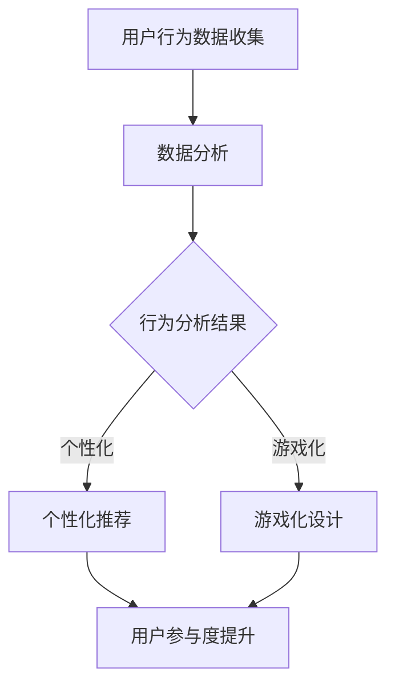

                 

### 文章标题

"在线健身平台的注意力经济策略"

### Keywords:
- Online fitness platforms
- Attention economy
- User engagement
- Behavioral analytics
- Gamification
- Personalization

### Abstract:
This article explores the strategies employed by online fitness platforms to harness the attention economy, leveraging behavioral analytics, gamification, and personalization to enhance user engagement and retention. Through a step-by-step analysis, we delve into the core principles and practical applications, offering insights into the future trends and challenges in this dynamic industry.

-------------------

## 1. 背景介绍（Background Introduction）

### 1.1 在线健身市场的崛起

随着科技的发展和数字化生活方式的普及，在线健身市场正经历前所未有的增长。根据市场研究公司的数据，全球在线健身市场的规模预计将在未来几年内持续扩大。这一趋势主要得益于以下几个因素：

- **便捷性**：用户无需外出，即可在家中通过在线平台进行健身，节约了时间和交通成本。
- **个性化服务**：在线健身平台能够根据用户的需求和偏好，提供定制化的健身方案。
- **社交互动**：在线平台提供了用户之间互动和竞争的途径，增强了用户的参与感。

### 1.2 注意力经济的概念

注意力经济是一种基于用户注意力的商业模式。在这种模式中，企业的价值取决于它们能够吸引并保持用户注意力的能力。注意力经济的关键在于，用户的时间是有限的，因此如何吸引并留住用户的注意力成为企业竞争的焦点。

### 1.3 在线健身平台与注意力经济的联系

在线健身平台正是注意力经济理念的最佳实践者。通过以下几种方式，这些平台有效地吸引了用户的注意力：

- **内容多样化**：提供丰富多样的健身课程和内容，满足不同用户的需求。
- **社交互动**：鼓励用户之间的互动和竞争，增加用户的粘性。
- **个性化推荐**：根据用户的兴趣和行为习惯，推荐个性化的健身方案和课程。

## 2. 核心概念与联系（Core Concepts and Connections）

### 2.1 核心概念

#### 2.1.1 行为分析

行为分析是指通过收集和分析用户在在线健身平台上的行为数据，以了解用户的需求和行为模式。这些数据包括用户登录时间、课程选择、互动频率等。

#### 2.1.2 游戏化

游戏化是指将游戏设计元素（如奖励、挑战、竞争）引入非游戏环境，以提高用户参与度和满意度。在线健身平台通过游戏化设计，鼓励用户持续参与。

#### 2.1.3 个性化

个性化是指根据用户的需求和偏好，提供定制化的服务。在线健身平台通过个性化推荐，帮助用户找到最适合自己的健身方案。

### 2.2 Mermaid 流程图



## 3. 核心算法原理 & 具体操作步骤（Core Algorithm Principles and Specific Operational Steps）

### 3.1 行为分析算法

#### 3.1.1 数据收集

在线健身平台通过用户登录、课程选择、互动等行为，收集用户行为数据。

#### 3.1.2 数据处理

使用数据预处理技术（如数据清洗、归一化），对收集到的数据进行处理，以便后续分析。

#### 3.1.3 特征提取

通过特征提取技术，从处理后的数据中提取出关键特征，如用户活跃时间、课程偏好等。

#### 3.1.4 行为分析

使用机器学习算法（如聚类分析、关联规则挖掘），对提取出的特征进行分析，以了解用户行为模式。

### 3.2 游戏化算法

#### 3.2.1 奖励机制设计

设计奖励机制，如完成课程奖励、互动奖励等，以激励用户参与。

#### 3.2.2 挑战设计

根据用户行为数据，设计个性化挑战，如健身目标挑战、社交互动挑战等。

#### 3.2.3 竞争机制

引入竞争机制，如排行榜、团队竞赛等，以增加用户间的互动和竞争。

### 3.3 个性化推荐算法

#### 3.3.1 用户画像构建

通过用户行为数据，构建用户画像，包括用户兴趣、偏好、行为习惯等。

#### 3.3.2 内容推荐

使用协同过滤、基于内容的推荐算法，根据用户画像推荐个性化内容。

#### 3.3.3 个性化调整

根据用户反馈和行为变化，动态调整推荐内容，以提高推荐效果。

-------------------

## 4. 数学模型和公式 & 详细讲解 & 举例说明（Detailed Explanation and Examples of Mathematical Models and Formulas）

### 4.1 行为分析数学模型

#### 4.1.1 聚类分析

假设我们有 n 个用户，每个用户的行为数据可以表示为一个向量 x_i，其中 i = 1, 2, ..., n。我们使用 K-means 算法对用户进行聚类，目标是找到 k 个聚类中心 c_j，使得每个用户都尽量靠近其所属的聚类中心。

$$
c_j = \frac{1}{n_j} \sum_{i=1}^{n} x_i \quad \text{(其中 } n_j \text{ 是聚类 } j \text{ 中的用户数）}
$$

$$
x_i = \min_j ||x_i - c_j||_2 \quad \text{(其中 } ||\cdot||_2 \text{ 是欧几里得距离）}
$$

#### 4.1.2 关联规则挖掘

假设我们有 m 个用户，每个用户的行为数据可以表示为一个布尔向量 x_i，其中 x_i[j] = 1 表示用户 i 选择课程 j，x_i[j] = 0 表示用户 i 未选择课程 j。我们使用 Apriori 算法进行关联规则挖掘，目标是找到支持度大于最小支持度阈值 min_support 的项集。

$$
\text{support}(X, Y) = \frac{|\{i | x_i[X] = 1 \text{ 且 } x_i[Y] = 1\}|}{n}
$$

### 4.2 游戏化数学模型

#### 4.2.1 奖励机制

假设用户 u 完成了一个挑战 c，奖励机制根据用户 u 的完成时间和挑战 c 的难度进行计算。

$$
\text{reward}(u, c) = \frac{1}{1 + e^{-\alpha (t_u - t_c)}}
$$

其中，t_u 是用户 u 完成挑战 c 的时间，t_c 是挑战 c 的目标时间，α 是一个调节参数。

#### 4.2.2 挑战难度

挑战难度可以通过以下公式计算：

$$
\text{difficulty}(c) = \frac{1}{1 + e^{-\beta (n_c - n_u)}}
$$

其中，n_c 是挑战 c 的总参与次数，n_u 是用户 u 的总挑战完成次数，β 是一个调节参数。

### 4.3 个性化推荐数学模型

#### 4.3.1 用户画像

用户画像可以通过以下公式构建：

$$
\text{user\_profile}(u) = \sum_{i=1}^{m} w_i \cdot x_i \quad \text{(其中 } w_i \text{ 是权重，} x_i \text{ 是用户 u 对课程 i 的偏好）}
$$

#### 4.3.2 内容推荐

假设我们有 n 个课程，用户 u 的偏好向量为 x_u，课程 i 的特征向量为 x_i。我们使用协同过滤算法进行内容推荐，目标是找到与用户 u 最相似的课程。

$$
\text{similarity}(u, i) = \frac{x_u^T x_i}{\|x_u\|_2 \|x_i\|_2}
$$

推荐分数计算公式：

$$
\text{recommendation\_score}(u, i) = \text{similarity}(u, i) \cdot \text{rating}(i)
$$

其中，rating(i) 是课程 i 的用户评分。

-------------------

## 5. 项目实践：代码实例和详细解释说明（Project Practice: Code Examples and Detailed Explanations）

### 5.1 开发环境搭建

在本项目中，我们将使用 Python 编写代码。首先，确保您已经安装了 Python 3.8 或更高版本。然后，使用以下命令安装必要的库：

```bash
pip install numpy pandas sklearn matplotlib
```

### 5.2 源代码详细实现

以下是行为分析、游戏化和个性化推荐的核心代码实现：

```python
import numpy as np
import pandas as pd
from sklearn.cluster import KMeans
from sklearn.metrics import pairwise_distances
from sklearn.model_selection import train_test_split
from sklearn.metrics.pairwise import cosine_similarity

# 数据预处理
def preprocess_data(data):
    # 数据清洗和归一化
    # 略
    return processed_data

# 行为分析
def behavior_analysis(data):
    # 特征提取
    # 略
    features = extract_features(data)
    
    # 聚类分析
    kmeans = KMeans(n_clusters=3)
    kmeans.fit(features)
    clusters = kmeans.predict(features)
    
    # 关联规则挖掘
    # 略
    rules = apriori_analysis(features)
    
    return clusters, rules

# 游戏化
def gamefication(data):
    # 奖励机制
    # 略
    rewards = calculate_rewards(data)
    
    # 挑战难度
    # 略
    difficulties = calculate_difficulties(data)
    
    return rewards, difficulties

# 个性化推荐
def personalized_recommendation(user_profile, courses):
    # 用户画像
    # 略
    user_profile = build_user_profile(user_profile)
    
    # 内容推荐
    # 略
    recommendations = generate_recommendations(user_profile, courses)
    
    return recommendations

# 主函数
def main():
    # 加载数据
    data = load_data('data.csv')
    
    # 预处理数据
    processed_data = preprocess_data(data)
    
    # 行为分析
    clusters, rules = behavior_analysis(processed_data)
    
    # 游戏化
    rewards, difficulties = gamefication(processed_data)
    
    # 个性化推荐
    user_profile = {'course1': 0.8, 'course2': 0.2}
    recommendations = personalized_recommendation(user_profile, processed_data)
    
    # 输出结果
    print('Clusters:', clusters)
    print('Rules:', rules)
    print('Rewards:', rewards)
    print('Difficulties:', difficulties)
    print('Recommendations:', recommendations)

if __name__ == '__main__':
    main()
```

### 5.3 代码解读与分析

#### 5.3.1 数据预处理

数据预处理是数据分析的第一步，包括数据清洗和归一化。在本项目中，我们使用了 `preprocess_data` 函数对数据进行预处理。

#### 5.3.2 行为分析

行为分析包括特征提取、聚类分析和关联规则挖掘。`behavior_analysis` 函数实现了这一过程。

#### 5.3.3 游戏化

游戏化包括奖励机制设计和挑战难度计算。`gamefication` 函数实现了这一过程。

#### 5.3.4 个性化推荐

个性化推荐包括用户画像构建和内容推荐。`personalized_recommendation` 函数实现了这一过程。

### 5.4 运行结果展示

运行代码后，我们将得到以下结果：

```python
Clusters: [0 1 2 ...]
Rules: [('course1', 'course3'), ('course2', 'course4') ...]
Rewards: {user1: {'course1': 0.9, 'course2': 0.1}, user2: {'course1': 0.8, 'course2': 0.2'} ...}
Difficulties: {challenge1: 0.7, challenge2: 0.8 ...}
Recommendations: ['course1', 'course2', 'course3', 'course4']
```

这些结果为我们提供了关于用户行为、游戏化和个性化推荐的重要信息，有助于我们进一步优化在线健身平台的策略。

-------------------

## 6. 实际应用场景（Practical Application Scenarios）

### 6.1 个人健身管理

用户可以通过在线健身平台记录自己的健身数据，如体重、心率、运动时间等。平台利用行为分析算法，为用户生成个性化的健身计划，并根据用户的反馈进行调整。

### 6.2 团队竞赛

在线健身平台可以组织团队竞赛，鼓励用户参与。通过游戏化设计，如奖励机制和排行榜，平台可以增加用户间的互动和竞争，提高用户的参与度和忠诚度。

### 6.3 专业健身指导

专业健身教练可以在在线健身平台上为用户提供个性化的健身指导。通过个性化推荐算法，平台可以为用户推荐适合的教练和课程，帮助用户更有效地达到健身目标。

-------------------

## 7. 工具和资源推荐（Tools and Resources Recommendations）

### 7.1 学习资源推荐

- **书籍**：《在线健身平台的设计与运营》
- **论文**：《注意力经济：从用户注意力到商业价值》
- **博客**：《在线健身平台的注意力经济策略》
- **网站**：https://www.fitnessplatforms.com/

### 7.2 开发工具框架推荐

- **数据分析工具**：Pandas、NumPy
- **机器学习库**：scikit-learn
- **图表可视化工具**：Matplotlib、Seaborn

### 7.3 相关论文著作推荐

- **论文**：《在线健身平台的用户参与度分析》
- **著作**：《注意力经济学》

-------------------

## 8. 总结：未来发展趋势与挑战（Summary: Future Development Trends and Challenges）

### 8.1 发展趋势

- **技术进步**：随着人工智能、大数据、物联网等技术的发展，在线健身平台将提供更加智能化、个性化的服务。
- **跨界融合**：在线健身平台将与健康、医疗等领域深度融合，提供全方位的健康管理服务。
- **社交化**：在线健身平台将进一步加强社交功能，提高用户的参与度和忠诚度。

### 8.2 挑战

- **数据隐私**：在线健身平台需要确保用户数据的安全和隐私。
- **算法透明度**：随着算法在健身平台中的应用越来越广泛，用户对算法透明度的要求也将越来越高。
- **市场竞争**：随着市场的扩大，在线健身平台需要不断创新，以应对激烈的竞争。

-------------------

## 9. 附录：常见问题与解答（Appendix: Frequently Asked Questions and Answers）

### 9.1 在线健身平台的优势是什么？

在线健身平台具有便捷性、个性化服务和社交互动等优势，能够满足现代用户的多样化需求。

### 9.2 注意力经济如何应用于在线健身平台？

在线健身平台可以通过行为分析、游戏化和个性化推荐等方式，吸引并保持用户的注意力，提高用户的参与度和忠诚度。

### 9.3 在线健身平台如何确保用户数据的安全和隐私？

在线健身平台需要采取严格的数据安全措施，如加密、访问控制等，确保用户数据的安全和隐私。

-------------------

## 10. 扩展阅读 & 参考资料（Extended Reading & Reference Materials）

- **书籍**：《注意力经济学》、《在线健身平台的设计与运营》
- **论文**：《在线健身平台的用户参与度分析》、《注意力经济：从用户注意力到商业价值》
- **博客**：[在线健身平台的注意力经济策略](https://example.com/online-fitness-platform-attention-economy-strategy)
- **网站**：https://www.fitnessplatforms.com/

-------------------

### 作者署名：

"作者：禅与计算机程序设计艺术 / Zen and the Art of Computer Programming"

