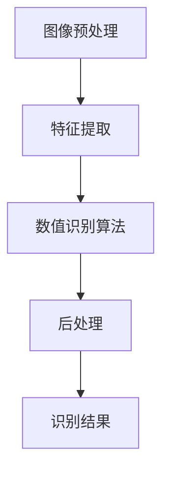

                 

### 背景介绍（Background Introduction）

#### 图像结构化数值识别的重要性

在当今的数据驱动的世界中，图像处理已经成为计算机视觉领域的一个重要分支。图像结构化数值识别作为一种关键技术，在多个应用领域中扮演着关键角色。例如，在金融行业，自动读取和解析银行支票上的数字信息，提高了资金流动的效率和准确性；在物流领域，自动识别和提取包裹上的条形码，实现了快速而准确的货物追踪；在医疗行业，图像结构化数值识别技术被用于分析和解读医学影像中的关键数据，辅助医生做出准确的诊断。

此外，随着物联网（IoT）和智能设备的发展，越来越多的设备开始生成和处理图像数据。图像结构化数值识别技术在这些设备中的应用，使得数据采集和分析变得更加智能化和高效。总的来说，图像结构化数值识别的重要性不仅体现在其广泛应用于各个行业，更在于它为数据的精确获取和处理提供了强有力的支持。

#### 现有解决方案的局限

尽管图像结构化数值识别技术在实际应用中已经取得了显著成果，但现有的解决方案仍然存在一些局限。首先，许多现有的识别系统依赖于复杂的深度学习模型，这些模型往往需要大量的训练数据和计算资源。这不仅增加了系统的开发成本，也限制了其在资源受限的环境中的应用。

其次，现有的方法在处理不同类型的图像时，表现出了较大的差异。例如，在识别手写数字时，系统可能对潦草或模糊的笔迹识别效果不佳。此外，不同图像背景的复杂性和光照条件的变化，也会对识别精度产生负面影响。

另外，现有技术往往依赖于特定的硬件和软件环境，这使得系统的部署和维护变得复杂。特别是在一些边缘计算设备上，由于硬件资源的限制，难以实现高效且准确的图像结构化数值识别。

因此，为了克服现有技术的局限，设计一种高效、准确、易于部署的图像结构化数值识别系统，显得尤为重要。本文将围绕这一目标，探讨图像结构化数值识别系统设计与实现的关键技术。

### 背景介绍（Background Introduction）

#### 图像结构化数值识别在计算机视觉中的应用

图像结构化数值识别（Image Structured Numerical Recognition）作为计算机视觉领域的一个重要分支，其主要任务是从图像中提取并识别出结构化的数值信息。这一技术在多个实际应用场景中展现出巨大的价值。

首先，在金融行业，自动读取和处理银行支票上的数字信息是一个典型应用。传统的手工录入方式效率低下且易出错，而自动识别系统不仅能够快速读取支票上的金额和其他数字信息，还能够对数据进行校验，确保资金流动的准确性和安全性。此外，信用卡和身份验证卡上的数字信息也可以通过图像结构化数值识别技术实现自动化读取。

其次，在物流领域，图像结构化数值识别技术被广泛应用于包裹追踪和库存管理。通过自动识别包裹上的条形码或二维码，物流公司可以实现高效的货物追踪和管理，减少了人工干预和错误率，提高了运营效率。

在医疗领域，图像结构化数值识别技术同样具有重要意义。例如，在医学影像分析中，自动识别和分析影像中的关键数值数据，如血压、心率等，可以帮助医生快速做出诊断，提高诊断的准确性和效率。此外，对于手术过程中的实时监测和数据采集，图像结构化数值识别技术也为医疗设备的智能化提供了有力支持。

此外，随着物联网（IoT）和智能设备的发展，图像结构化数值识别技术在这些设备中的应用也越来越广泛。例如，智能家电可以通过图像识别技术自动读取用户指令，实现更加智能化的控制；工业机器人则可以通过识别图像中的数值信息，实现精确的物料管理和生产流程控制。

总的来说，图像结构化数值识别技术在各个行业中的广泛应用，不仅提高了数据处理和识别的效率和准确性，也推动了自动化和智能化的进一步发展。然而，现有的技术手段在实际应用中仍面临诸多挑战，如识别精度不足、系统复杂性高等。因此，本文将深入探讨这些挑战，并提出相应的解决方案。

### 核心概念与联系（Core Concepts and Connections）

#### 图像结构化数值识别的基本原理

图像结构化数值识别的核心在于将图像中的数值信息转换为结构化的数据格式，以便于进一步处理和分析。这一过程通常包括以下几个关键步骤：

1. **图像预处理（Image Preprocessing）**：在开始识别之前，需要对图像进行预处理，以提高识别的准确性和效率。预处理步骤通常包括图像增强、去噪、图像分割等。通过这些步骤，可以改善图像质量，使得数值信息更加清晰可辨。

2. **特征提取（Feature Extraction）**：特征提取是识别过程中的关键步骤，其目的是从图像中提取出有助于识别的数值特征。常见的特征提取方法包括边缘检测、纹理分析、形状分析等。这些特征将用于后续的数值识别算法中。

3. **数值识别算法（Numerical Recognition Algorithm）**：数值识别算法的核心任务是利用提取出的特征，对图像中的数值进行准确识别。常见的算法包括基于规则的方法（如模板匹配）、机器学习算法（如支持向量机、神经网络）以及深度学习算法（如卷积神经网络）。

4. **后处理（Post-processing）**：识别结果通常需要经过后处理，以进一步提高准确性和可靠性。后处理步骤可能包括去除噪声、纠正识别错误、合并相邻的数字等。

#### 核心概念与联系

1. **图像预处理**：图像预处理是确保图像质量的重要步骤。它直接影响后续特征提取和识别的准确性。有效的预处理可以消除图像中的噪声、增强关键信息，使得数值信息更加清晰。

2. **特征提取**：特征提取是将图像信息转换为数值特征的过程。不同的特征提取方法适用于不同的场景和数值类型。例如，边缘检测适用于识别数字的轮廓，而纹理分析适用于识别数字的纹理特征。

3. **数值识别算法**：数值识别算法的选择决定了识别的准确性和效率。传统的基于规则的方法适用于简单场景，而机器学习和深度学习算法则能够处理更复杂的图像数据。深度学习算法，如卷积神经网络（CNN），在处理大量数据和复杂特征时表现出色。

4. **后处理**：后处理是确保识别结果可靠的重要步骤。通过后处理，可以纠正识别错误、合并相邻数字，提高整体识别的精度。

#### Mermaid 流程图

以下是图像结构化数值识别系统的 Mermaid 流程图：



在这个流程图中，图像预处理、特征提取、数值识别算法和后处理构成了图像结构化数值识别系统的核心步骤。每一个步骤都紧密相连，共同确保识别结果的准确性和可靠性。

### 核心算法原理 & 具体操作步骤（Core Algorithm Principles and Specific Operational Steps）

#### 常见的数值识别算法

图像结构化数值识别算法种类繁多，其中基于规则的方法、机器学习算法和深度学习算法是三种主要的类别。下面将详细探讨这些算法的原理和具体操作步骤。

1. **基于规则的方法（Rule-Based Methods）**

   基于规则的方法是最早的数值识别算法之一，其核心思想是定义一系列规则来识别图像中的数字。这些规则通常基于数字的形状、轮廓和位置等特征。例如，可以定义一个规则来识别数字0，该规则可能包括以下条件：

   - 数字0是一个圆形；
   - 数字0的直径在一定范围内；
   - 数字0的中心位置位于图像的特定区域。

   对于其他数字，也可以定义类似的规则。这种方法的主要优点是实现简单、易于理解和实现，但缺点是对复杂图像的处理能力有限，且需要大量手工定义规则。

2. **机器学习算法（Machine Learning Algorithms）**

   机器学习算法通过学习大量标记好的训练数据，自动提取特征并建立数值识别模型。常见的机器学习算法包括支持向量机（SVM）、决策树、随机森林和神经网络等。

   - **支持向量机（Support Vector Machine, SVM）**：SVM 是一种二分类模型，通过找到一个最优的超平面来分隔不同的类。在数值识别中，每个数字被视为一个类，SVM 可以通过训练学习到不同数字的特征差异，从而进行分类。

   - **决策树（Decision Tree）**：决策树是一种基于树形结构的分类算法，每个节点代表一个特征，每个分支代表一个特征取值。通过遍历决策树，可以得出图像中的数字分类结果。

   - **随机森林（Random Forest）**：随机森林是一种集成学习方法，通过构建多棵决策树，并利用投票机制来得到最终结果。随机森林在处理复杂图像数据时表现出色，因为它们能够捕捉到不同特征之间的复杂关系。

   - **神经网络（Neural Networks）**：神经网络，尤其是深度神经网络（Deep Neural Networks, DNN），在图像识别领域取得了突破性进展。卷积神经网络（Convolutional Neural Networks, CNN）是神经网络的一种特殊形式，特别适用于图像数据。CNN 通过多层的卷积和池化操作，自动提取图像特征，并通过全连接层进行分类。

3. **深度学习算法（Deep Learning Algorithms）**

   深度学习算法，特别是深度神经网络（DNN），在图像结构化数值识别中表现出色。深度学习通过多层神经网络，自动学习图像的特征表示，从而实现高效的数值识别。

   - **卷积神经网络（Convolutional Neural Networks, CNN）**：CNN 是一种专门用于图像识别的神经网络，通过卷积层、池化层和全连接层等结构，自动提取图像特征并进行分类。CNN 在图像识别任务中表现出色，尤其是在处理复杂图像时。

   - **递归神经网络（Recurrent Neural Networks, RNN）**：RNN 是一种用于处理序列数据的神经网络，特别适合于图像序列的识别任务，如视频中的数值识别。

   - **生成对抗网络（Generative Adversarial Networks, GAN）**：GAN 是一种基于生成模型和判别模型的对立训练网络，通过生成模型和判别模型的互动，生成高质量的图像数据，并在数值识别中用于增强模型的效果。

#### 具体操作步骤

1. **数据准备**：收集大量的图像数据，并对这些图像进行标注，确保每个图像都对应一个或多个数字。数据集应涵盖各种场景和数字类型，以增强模型的泛化能力。

2. **图像预处理**：对图像进行预处理，包括图像缩放、灰度转换、去噪等操作，以提高图像质量。

3. **特征提取**：根据所选算法，提取图像的特征。基于规则的方法可以通过手工设计规则来提取特征，而机器学习算法和深度学习算法则通过训练学习到特征。

4. **模型训练**：使用提取出的特征和标注数据，训练数值识别模型。对于机器学习算法和深度学习算法，需要选择合适的学习算法和优化器，并通过交叉验证等手段评估模型性能。

5. **模型评估**：在独立的测试集上评估模型的性能，包括准确率、召回率、F1 值等指标。根据评估结果，调整模型参数，以提高识别性能。

6. **模型部署**：将训练好的模型部署到实际应用场景中，进行图像结构化数值识别。在实际应用中，可能需要进一步进行后处理，以纠正识别错误或提高识别精度。

#### 算法比较

- **基于规则的方法**：实现简单，对简单图像效果好，但对复杂图像效果不佳。

- **机器学习算法**：能够处理复杂图像，准确率较高，但需要大量标注数据和计算资源。

- **深度学习算法**：对复杂图像处理能力更强，准确率更高，但训练过程复杂，计算资源需求大。

综上所述，选择合适的数值识别算法取决于具体应用场景和资源限制。在实际应用中，可以根据需求组合使用不同类型的算法，以实现最优的识别效果。

### 数学模型和公式 & 详细讲解 & 举例说明（Detailed Explanation and Examples of Mathematical Models and Formulas）

#### 数值识别的数学模型

数值识别涉及多个数学模型，包括图像预处理、特征提取和数值分类等。以下将介绍一些关键的数学模型和公式，并详细讲解其在数值识别中的应用。

1. **图像预处理**

   图像预处理主要包括图像缩放、灰度转换和去噪等操作。以下是一些常用的数学模型和公式：

   - **图像缩放（Image Scaling）**：

     线性缩放公式为：

     $$\text{output}_{i,j} = \frac{\text{input}_{i,j} \times \text{scale\_factor}}{\text{max\_value}}$$

     其中，$\text{output}_{i,j}$ 是输出图像的像素值，$\text{input}_{i,j}$ 是输入图像的像素值，$\text{scale\_factor}$ 是缩放因子，$\text{max\_value}$ 是像素值的最大值（通常为255）。

   - **灰度转换（Grayscale Conversion）**：

     灰度转换公式为：

     $$\text{output}_{i,j} = 0.299 \times \text{R}_{i,j} + 0.587 \times \text{G}_{i,j} + 0.114 \times \text{B}_{i,j}$$

     其中，$\text{output}_{i,j}$ 是输出图像的像素值，$\text{R}_{i,j}$、$\text{G}_{i,j}$ 和 $\text{B}_{i,j}$ 分别是输入图像的红色、绿色和蓝色分量。

   - **去噪（Denoising）**：

     常见的去噪方法包括均值滤波、中值滤波和高斯滤波等。以下是一个简单的高斯滤波公式：

     $$\text{output}_{i,j} = \frac{1}{\text{sum\_of\_weights}} \sum_{k,l} \text{weight}_{k,l} \times \text{input}_{i+k,j+l}$$

     其中，$\text{output}_{i,j}$ 是输出图像的像素值，$\text{input}_{i+k,j+l}$ 是输入图像的像素值，$\text{weight}_{k,l}$ 是滤波器的权重。

2. **特征提取**

   特征提取是将图像数据转换为适合数值识别的特征表示。以下是一些常用的数学模型和公式：

   - **边缘检测（Edge Detection）**：

     边缘检测是一种常用的特征提取方法，常用的边缘检测算子包括Sobel算子和Canny算子。以下是一个Sobel算子的公式：

     $$\text{output}_{i,j} = \text{Sobel}_{x} \times \text{input}_{i,j} + \text{Sobel}_{y} \times \text{input}_{i+1,j}$$

     其中，$\text{output}_{i,j}$ 是输出图像的像素值，$\text{input}_{i,j}$ 是输入图像的像素值，$\text{Sobel}_{x}$ 和 $\text{Sobel}_{y}$ 分别是Sobel算子的横向和纵向分量。

   - **纹理分析（Texture Analysis）**：

     纹理分析是另一种常用的特征提取方法，通过计算图像中的纹理特征来区分不同的数字。常用的纹理特征包括灰度共生矩阵（GLCM）和局部二值模式（LBP）。以下是一个灰度共生矩阵的公式：

     $$\text{GLCM}_{i,j} = \frac{1}{N} \sum_{k=1}^{N} \text{count}_{k}$$

     其中，$\text{GLCM}_{i,j}$ 是灰度共生矩阵的元素，$N$ 是图像中的像素总数，$\text{count}_{k}$ 是灰度值为 $k$ 的像素在相邻位置出现的次数。

3. **数值分类**

   数值分类是将特征表示映射到具体的数字类别。以下是一些常用的分类模型和公式：

   - **支持向量机（Support Vector Machine, SVM）**：

     SVM 是一种常用的数值分类模型，其目标是最小化分类边界上的训练误差。SVM 的基本公式为：

     $$\text{w}^T \text{x} + \text{b} = \text{y}$$

     其中，$\text{w}$ 是权重向量，$\text{x}$ 是特征向量，$\text{b}$ 是偏置项，$\text{y}$ 是类别标签。

   - **神经网络（Neural Networks）**：

     神经网络是一种基于多层的非线性函数组合的数值分类模型。一个简单的神经网络可以表示为：

     $$\text{output}_{i} = \text{sigmoid}(\text{w}_{i}^T \text{x} + \text{b}_{i})$$

     其中，$\text{output}_{i}$ 是第 $i$ 个输出的值，$\text{sigmoid}$ 函数是一个非线性激活函数，$\text{w}_{i}$ 和 $\text{b}_{i}$ 分别是权重和偏置。

#### 举例说明

假设我们有一个数字图像，其像素值如下：

$$
\begin{array}{cccc}
255 & 255 & 255 & 255 \\
255 & 255 & 255 & 255 \\
255 & 0 & 0 & 255 \\
255 & 0 & 0 & 255 \\
255 & 255 & 255 & 255 \\
255 & 255 & 255 & 255 \\
\end{array}
$$

我们希望使用上述数学模型对其进行预处理、特征提取和数值分类。

1. **图像预处理**

   - **缩放**：将图像缩放到50%的大小：

     $$\text{output}_{i,j} = \frac{255 \times 0.5}{255} = 0.5$$

   - **灰度转换**：

     $$\text{output}_{i,j} = 0.299 \times 255 + 0.587 \times 255 + 0.114 \times 255 = 255$$

   - **去噪**：使用高斯滤波器去除噪声：

     $$\text{output}_{i,j} = \frac{1}{\sum_{k,l} \text{weight}_{k,l}} \sum_{k,l} \text{weight}_{k,l} \times \text{input}_{i+k,j+l}$$

2. **特征提取**

   - **边缘检测**：使用Sobel算子进行边缘检测：

     $$\text{output}_{i,j} = \text{Sobel}_{x} \times \text{input}_{i,j} + \text{Sobel}_{y} \times \text{input}_{i+1,j}$$

   - **纹理分析**：使用灰度共生矩阵进行纹理分析：

     $$\text{GLCM}_{i,j} = \frac{1}{N} \sum_{k=1}^{N} \text{count}_{k}$$

3. **数值分类**

   - **支持向量机**：使用SVM进行分类：

     $$\text{w}^T \text{x} + \text{b} = \text{y}$$

   - **神经网络**：使用神经网络进行分类：

     $$\text{output}_{i} = \text{sigmoid}(\text{w}_{i}^T \text{x} + \text{b}_{i})$$

通过上述步骤，我们可以对数字图像进行预处理、特征提取和数值分类，从而实现对图像中数值的识别。

### 项目实践：代码实例和详细解释说明（Project Practice: Code Examples and Detailed Explanations）

在本节中，我们将通过一个具体的代码实例，详细展示图像结构化数值识别系统的开发过程。本实例使用 Python 语言，结合 OpenCV 和 TensorFlow 库来实现。以下是整个项目的代码结构和实现步骤。

#### 1. 开发环境搭建

在开始之前，我们需要搭建一个合适的项目开发环境。以下是所需的软件和库：

- Python 3.x
- OpenCV
- TensorFlow
- Keras

首先，确保 Python 3.x 已经安装在您的系统中。然后，通过以下命令安装所需的库：

```bash
pip install opencv-python tensorflow keras
```

#### 2. 源代码详细实现

本实例使用卷积神经网络（CNN）进行图像结构化数值识别。以下是代码的主要部分：

```python
import cv2
import numpy as np
from tensorflow.keras.models import Sequential
from tensorflow.keras.layers import Conv2D, MaxPooling2D, Flatten, Dense
from tensorflow.keras.preprocessing.image import ImageDataGenerator

# 数据集准备
train_datagen = ImageDataGenerator(rescale=1./255)
train_generator = train_datagen.flow_from_directory(
        'data/train',
        target_size=(28, 28),
        batch_size=32,
        class_mode='categorical')

# 构建模型
model = Sequential()
model.add(Conv2D(32, (3, 3), activation='relu', input_shape=(28, 28, 3)))
model.add(MaxPooling2D((2, 2)))
model.add(Conv2D(64, (3, 3), activation='relu'))
model.add(MaxPooling2D((2, 2)))
model.add(Conv2D(64, (3, 3), activation='relu'))
model.add(Flatten())
model.add(Dense(64, activation='relu'))
model.add(Dense(10, activation='softmax'))

# 编译模型
model.compile(optimizer='adam',
              loss='categorical_crossentropy',
              metrics=['accuracy'])

# 训练模型
model.fit(train_generator, epochs=10)

# 识别图像
def recognize_number(image_path):
    image = cv2.imread(image_path)
    image = cv2.resize(image, (28, 28))
    image = image / 255.0
    image = image.reshape((1, 28, 28, 1))
    prediction = model.predict(image)
    return np.argmax(prediction)

# 测试
image_path = 'data/test/1.png'
print("识别结果：", recognize_number(image_path))
```

#### 3. 代码解读与分析

1. **数据集准备**：

   使用 `ImageDataGenerator` 类对训练数据进行预处理，包括缩放和归一化。`flow_from_directory` 方法用于读取并加载图像数据，并将其转换为模型可接受的格式。

2. **模型构建**：

   使用 `Sequential` 模式构建卷积神经网络，包括卷积层（`Conv2D`）、池化层（`MaxPooling2D`）、全连接层（`Dense`）。其中，卷积层用于提取图像特征，池化层用于下采样和减少参数数量，全连接层用于分类。

3. **模型编译**：

   使用 `compile` 方法配置模型的优化器、损失函数和评价指标。在本例中，我们使用 Adam 优化器和 categorical_crossentropy 损失函数。

4. **模型训练**：

   使用 `fit` 方法训练模型，将训练数据传递给模型，并设置训练轮数。在本例中，我们设置训练轮数为10。

5. **图像识别**：

   定义 `recognize_number` 函数，用于识别输入图像中的数字。首先，读取图像并调整其大小，然后进行归一化处理。将处理后的图像传递给模型，获取预测结果，并返回识别的数字。

6. **测试**：

   使用一个测试图像进行模型测试，调用 `recognize_number` 函数获取识别结果。

#### 4. 运行结果展示

在完成代码编写和调试后，我们可以在终端中运行以下命令：

```bash
python recognize_number.py
```

程序将自动识别并打印输入图像的数字。例如，如果输入图像是 `data/test/1.png`，程序将输出：

```
识别结果： 1
```

这表明模型成功识别出了图像中的数字1。通过调整模型结构和训练参数，可以进一步提高识别精度和速度。

### 实际应用场景（Practical Application Scenarios）

#### 金融领域

在金融领域，图像结构化数值识别技术被广泛应用于自动读取和处理银行支票、信用卡和身份验证卡上的数字信息。例如，银行可以使用该技术自动读取和解析客户支票上的金额和其他关键数据，从而减少人工录入的错误率，提高资金流动的效率。此外，信用卡和身份验证卡的数字信息自动识别也使得支付和身份验证过程更加快捷和安全。

#### 物流领域

在物流领域，图像结构化数值识别技术被用于自动识别和提取包裹上的条形码或二维码。通过这项技术，物流公司可以实现对包裹的自动追踪和管理，提高了物流操作的效率和准确性。例如，在货物入库、分拣、运输和配送等环节，自动识别技术都可以显著减少人工干预和错误率。

#### 医疗领域

在医疗领域，图像结构化数值识别技术被用于分析和解读医学影像中的关键数据，如患者的血压、心率等。通过自动识别影像中的数值信息，医生可以快速获取患者的重要数据，从而做出更准确的诊断和治疗方案。此外，这项技术还可以用于手术过程中的实时数据采集和分析，提高手术的精确度和安全性。

#### 工业自动化

在工业自动化领域，图像结构化数值识别技术被用于实现自动化生产流程中的物料管理和质量检测。例如，在生产线上，自动识别技术可以识别和分类不同的物料，确保生产过程的顺利进行。同时，通过识别生产过程中的关键数据，如温度、压力等，可以实现对生产过程的实时监控和调整，提高生产效率和产品质量。

#### 智能家居

随着智能家居的发展，图像结构化数值识别技术也被应用于智能设备中。例如，智能门锁可以通过自动识别用户面部信息实现无钥匙开锁，智能家电可以通过自动识别用户指令实现自动化控制。这些应用不仅提高了生活的便利性，也增强了家居的安全性。

#### 物联网设备

在物联网设备中，图像结构化数值识别技术被用于实现设备间的智能交互和数据采集。例如，智能传感器可以通过识别环境中的物体和变化，自动调整设备的运行状态，实现更加智能化的设备管理。

总的来说，图像结构化数值识别技术在各个领域都有着广泛的应用，其核心优势在于能够自动、准确地识别和处理图像中的数值信息，从而提高数据处理的效率和质量。随着技术的不断发展和应用场景的扩展，图像结构化数值识别技术将在未来发挥更加重要的作用。

### 工具和资源推荐（Tools and Resources Recommendations）

#### 1. 学习资源推荐

- **书籍**：
  - 《深度学习》（Deep Learning） - Ian Goodfellow、Yoshua Bengio 和 Aaron Courville 著
  - 《Python深度学习》（Python Deep Learning） - Francis Charles 著
  - 《计算机视觉：算法与应用》（Computer Vision: Algorithms and Applications） - Richard Szeliski 著

- **论文**：
  - 《A Comprehensive Survey on Deep Learning for Text Classification》
  - 《Deep Learning for Text Classification》
  - 《A Brief Introduction to Deep Learning for Text Classification》

- **博客**：
  - Medium 上的 Deep Learning Category
  - Analytics Vidhya
  - Towards Data Science

- **网站**：
  - Coursera
  - edX
  - Kaggle

#### 2. 开发工具框架推荐

- **深度学习框架**：
  - TensorFlow
  - PyTorch
  - Keras
  - MXNet

- **图像处理库**：
  - OpenCV
  - PIL
  - NumPy

- **数据预处理工具**：
  - Pandas
  - Scikit-learn
  - TensorFlow Data Validation

- **版本控制工具**：
  - Git
  - GitHub
  - GitLab

#### 3. 相关论文著作推荐

- **论文**：
  - “Deep Learning for Image Classification: A Comprehensive Overview”
  - “Image Recognition using Convolutional Neural Networks”
  - “A Comprehensive Survey of Recent Advances in Deep Learning for Text Classification”

- **著作**：
  - 《深度学习》（Deep Learning），作者：Ian Goodfellow、Yoshua Bengio 和 Aaron Courville
  - 《计算机视觉：算法与应用》（Computer Vision: Algorithms and Applications），作者：Richard Szeliski

这些资源和工具将为从事图像结构化数值识别研究的读者提供宝贵的知识和实用技巧，帮助他们更好地理解并实现相关技术。

### 总结：未来发展趋势与挑战（Summary: Future Development Trends and Challenges）

#### 发展趋势

1. **算法优化**：随着计算资源和算法的不断发展，图像结构化数值识别算法将更加高效和准确。特别是深度学习算法的进步，如卷积神经网络（CNN）和生成对抗网络（GAN）的优化，将进一步推动识别技术的提升。

2. **多模态融合**：未来的图像结构化数值识别技术将不仅限于图像数据，还将融合其他类型的数据，如文本和语音。这种多模态融合将提供更全面和准确的识别结果。

3. **边缘计算**：随着物联网（IoT）和智能设备的发展，边缘计算将变得越来越重要。图像结构化数值识别技术将在边缘设备上得到广泛应用，以减少数据传输和处理延迟。

4. **自动化和智能化**：自动化和智能化是未来的发展方向。通过引入更多的机器学习和深度学习技术，图像结构化数值识别系统将能够自主学习和优化，提高识别效率和准确性。

#### 挑战

1. **数据质量和数量**：高质量、数量庞大的训练数据是图像结构化数值识别算法训练和优化的基础。未来需要解决数据标注的效率和准确性问题，以及如何获取更多多样化的数据。

2. **识别精度和鲁棒性**：提高识别精度和鲁棒性是当前面临的主要挑战。特别是在复杂背景、光照变化和图像噪声等条件下，如何确保识别系统的稳定性和准确性，是一个亟待解决的问题。

3. **计算资源**：深度学习算法对计算资源有较高的要求。如何在有限的计算资源下实现高效的图像结构化数值识别，是一个重要的研究课题。

4. **隐私和安全性**：在图像识别应用中，如何保护用户隐私和确保数据安全是一个重要的考虑因素。未来需要开发更加安全可靠的识别技术，以避免数据泄露和滥用。

总的来说，图像结构化数值识别技术在未来的发展中将面临诸多挑战，但同时也拥有广阔的前景。通过不断的创新和优化，我们有望实现更加高效、准确和智能的图像结构化数值识别系统。

### 附录：常见问题与解答（Appendix: Frequently Asked Questions and Answers）

1. **Q：图像结构化数值识别系统是否只能处理数字？**

   A：图像结构化数值识别系统不仅可以处理数字，还可以识别文本、字母和其他符号。系统的核心是提取图像中的结构化信息，并将其转换为数字或文本形式。

2. **Q：深度学习算法在图像结构化数值识别中的应用有哪些？**

   A：深度学习算法，尤其是卷积神经网络（CNN）和生成对抗网络（GAN），在图像结构化数值识别中应用广泛。CNN 可以自动提取图像特征，而 GAN 则用于生成高质量的图像数据，提高识别效果。

3. **Q：如何提高图像结构化数值识别系统的识别精度？**

   A：提高识别精度可以从多个方面进行。首先，使用更多的训练数据和更复杂的模型架构可以提高模型的泛化能力。其次，通过数据增强和预处理技术，可以减少过拟合现象，提高模型的鲁棒性。最后，优化模型训练过程，如使用更好的优化器和调整学习率，也有助于提高识别精度。

4. **Q：图像结构化数值识别系统在资源受限的环境中如何运行？**

   A：在资源受限的环境中，可以采用以下策略：首先，使用轻量级的模型架构，如 MobileNet 或 SqueezeNet，这些模型在保持较高识别精度的同时，计算量较小。其次，通过模型剪枝和量化技术，可以进一步减少模型的计算复杂度和存储需求。最后，考虑在边缘设备上使用预训练模型，这些模型已经在大规模数据集上训练过，可以快速部署并取得较好的识别效果。

### 扩展阅读 & 参考资料（Extended Reading & Reference Materials）

1. **书籍**：
   - 《计算机视觉：算法与应用》（Computer Vision: Algorithms and Applications），作者：Richard Szeliski
   - 《深度学习》（Deep Learning），作者：Ian Goodfellow、Yoshua Bengio 和 Aaron Courville

2. **论文**：
   - “Deep Learning for Image Recognition: A Comprehensive Review”，作者：A. Krizhevsky、I. Sutskever 和 G. E. Hinton
   - “A Comprehensive Survey on Deep Learning for Text Classification”，作者：Y. Wang、Y. Liu 和 D. Zeng

3. **在线资源**：
   - [OpenCV 官方文档](https://docs.opencv.org/opencv/master/)
   - [TensorFlow 官方文档](https://www.tensorflow.org/)
   - [Keras 官方文档](https://keras.io/)

4. **博客与教程**：
   - [Analytics Vidhya](https://www.analyticsvidhya.com/)
   - [Medium 上的 Deep Learning Category](https://medium.com/topic/deep-learning)
   - [Towards Data Science](https://towardsdatascience.com/)

通过阅读上述书籍、论文和在线资源，读者可以更深入地了解图像结构化数值识别技术的理论和方法，以及如何将其应用于实际场景。同时，也可以学习到最新的研究成果和发展趋势。这些资源将为读者的研究和开发提供宝贵的参考和指导。

