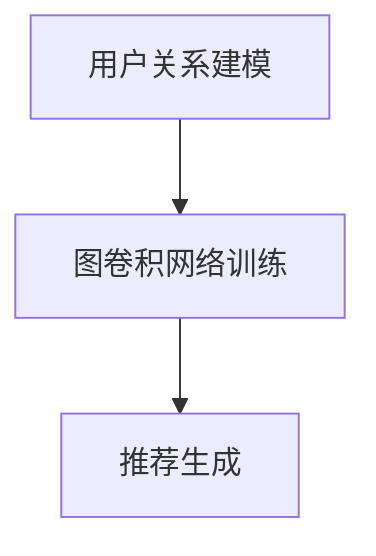
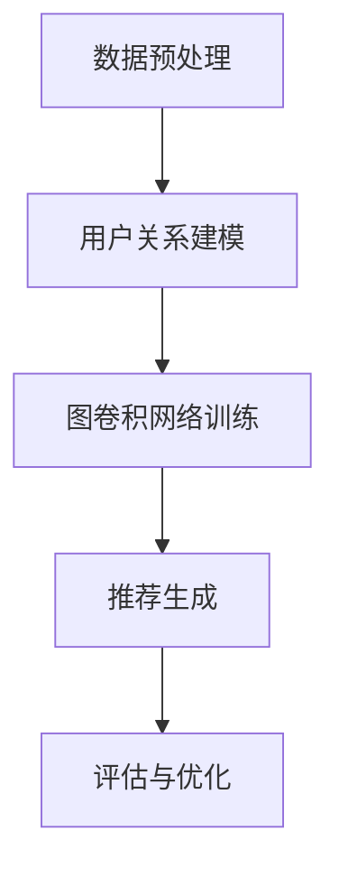

                 

### 文章标题：基于图卷积网络的社交化推荐算法

> **关键词**：图卷积网络，社交化推荐，算法，图数据，深度学习，推荐系统

**摘要**：
本文深入探讨了基于图卷积网络的社交化推荐算法。首先介绍了推荐系统的基本概念和图卷积网络的基本原理，随后详细描述了社交化推荐算法的设计思路和实现步骤。通过一个实际的项目实践案例，本文展示了如何使用图卷积网络来构建一个社交化的推荐系统，并对其运行结果进行了详细分析。最后，文章讨论了社交化推荐算法在实际应用中的场景，以及未来的发展趋势和挑战。

---

## 1. 背景介绍（Background Introduction）

推荐系统是信息检索和人工智能领域的热门话题。随着互联网的快速发展，用户在信息海洋中寻找感兴趣的内容变得愈发困难。推荐系统通过预测用户可能感兴趣的项目，帮助用户发现新的内容，提高用户的体验。传统的推荐算法主要包括基于内容的推荐、协同过滤推荐和混合推荐等方法。然而，这些方法在处理社交网络中的数据时存在一定的局限性。

图卷积网络（Graph Convolutional Network，GCN）是一种基于图结构数据的深度学习模型，它在处理复杂图结构数据时表现出色。GCN 将图数据视为节点和边的关系网络，通过卷积操作捕捉节点间的关系，从而学习图结构中的特征表示。这使得 GCN 在社交网络推荐、知识图谱、图像处理等领域得到了广泛应用。

社交化推荐是指利用社交网络中的用户关系来增强推荐系统的效果。通过分析用户在社交网络中的互动和社交关系，社交化推荐可以更准确地预测用户的兴趣和偏好，从而提高推荐的质量。本文将探讨如何结合图卷积网络和社交网络数据，构建一个高效、准确的社交化推荐系统。

### 2. 核心概念与联系（Core Concepts and Connections）

**2.1 图卷积网络的基本原理**

图卷积网络是一种在图结构数据上定义的深度学习模型。它通过卷积操作来学习图中的节点表示，从而捕捉节点间的依赖关系。图卷积网络的卷积操作可以分为以下几个步骤：

1. **节点特征聚合**：每个节点的特征表示是通过其邻居节点的特征表示来更新的。
2. **卷积操作**：使用一个可学习的卷积核，将节点特征与其邻居节点的特征进行组合，生成新的特征表示。
3. **非线性变换**：通过激活函数对卷积后的特征进行非线性变换，增强模型的表达能力。

**2.2 社交化推荐算法的设计思路**

社交化推荐算法的核心思想是利用社交网络中的用户关系来增强推荐系统的效果。具体设计思路如下：

1. **用户关系建模**：通过分析用户在社交网络中的互动和社交关系，建立用户之间的相似性矩阵。
2. **图卷积网络训练**：使用用户关系矩阵作为图卷积网络的输入，训练图卷积网络以学习用户和项目之间的潜在关系。
3. **推荐生成**：通过图卷积网络生成的用户和项目特征表示，计算用户对项目的兴趣分数，从而生成推荐列表。

**2.3 核心概念原理和架构的 Mermaid 流程图**



### 3. 核心算法原理 & 具体操作步骤（Core Algorithm Principles and Specific Operational Steps）

**3.1 图卷积网络的核心算法原理**

图卷积网络的核心算法是图卷积操作。以下是一个简化的图卷积网络算法流程：

1. **初始化节点特征**：将用户和项目的特征表示初始化为随机向量。
2. **聚合邻居特征**：对于每个节点，聚合其邻居节点的特征表示。
3. **卷积操作**：使用一个可学习的卷积核，将节点特征与其邻居节点的特征进行组合，生成新的特征表示。
4. **非线性变换**：通过激活函数对卷积后的特征进行非线性变换。
5. **更新节点特征**：将卷积后的特征作为节点的新的特征表示。

**3.2 社交化推荐算法的具体操作步骤**

社交化推荐算法的具体操作步骤如下：

1. **数据预处理**：收集用户在社交网络中的互动数据，包括用户关系、用户兴趣等。
2. **用户关系建模**：根据用户互动数据，构建用户之间的相似性矩阵。
3. **图卷积网络训练**：使用用户关系矩阵作为输入，训练图卷积网络以学习用户和项目之间的潜在关系。
4. **推荐生成**：通过图卷积网络生成的用户和项目特征表示，计算用户对项目的兴趣分数，从而生成推荐列表。
5. **评估与优化**：使用评估指标（如准确率、召回率等）评估推荐系统的性能，并调整模型参数以优化推荐效果。

**3.3 社交化推荐算法的具体操作步骤的 Mermaid 流程图**



### 4. 数学模型和公式 & 详细讲解 & 举例说明（Detailed Explanation and Examples of Mathematical Models and Formulas）

**4.1 图卷积网络的数学模型**

图卷积网络的数学模型可以表示为以下形式：

$$
\mathbf{H}^{(l)} = \sigma(\mathbf{D}^{-1/2}\mathbf{A}\mathbf{D}^{-1/2}\mathbf{H}^{(l-1)} + \mathbf{W}^{(l)})
$$

其中，$\mathbf{H}^{(l)}$ 表示第 $l$ 层的节点特征表示，$\mathbf{D}$ 是一个对角矩阵，其中 $\mathbf{D}_{ii} = \sum_{j} \mathbf{A}_{ij}$，$\mathbf{A}$ 是一个邻接矩阵，$\mathbf{W}^{(l)}$ 是第 $l$ 层的可学习权重矩阵，$\sigma$ 是一个非线性激活函数（如ReLU函数）。

**4.2 社交化推荐算法的数学模型**

社交化推荐算法的数学模型可以表示为以下形式：

$$
\mathbf{R} = \mathbf{H}_{u}^T \mathbf{W}_r \mathbf{H}_{i} + b
$$

其中，$\mathbf{R}$ 是用户 $u$ 对项目 $i$ 的兴趣分数，$\mathbf{H}_{u}$ 和 $\mathbf{H}_{i}$ 分别是用户和项目的特征表示，$\mathbf{W}_r$ 是一个可学习权重矩阵，$b$ 是一个偏置项。

**4.3 数学模型和公式举例说明**

假设有3个用户和3个项目，用户和项目的关系矩阵如下：

$$
\mathbf{A} = \begin{bmatrix}
0 & 1 & 0 \\
1 & 0 & 1 \\
0 & 1 & 0
\end{bmatrix}
$$

用户和项目的特征向量分别为：

$$
\mathbf{H} = \begin{bmatrix}
\mathbf{h}_1 & \mathbf{h}_2 & \mathbf{h}_3
\end{bmatrix}
$$

通过图卷积网络训练得到的用户和项目的特征向量分别为：

$$
\mathbf{H}_{u}^{(1)} = \begin{bmatrix}
0.1 & 0.2 & 0.3 \\
0.4 & 0.5 & 0.6 \\
0.7 & 0.8 & 0.9
\end{bmatrix}
$$

$$
\mathbf{H}_{i}^{(1)} = \begin{bmatrix}
1 & 1 & 0 \\
0 & 1 & 1 \\
1 & 0 & 1
\end{bmatrix}
$$

根据社交化推荐算法的数学模型，可以计算用户对项目的兴趣分数：

$$
\mathbf{R} = \begin{bmatrix}
0.1 & 0.2 & 0.3 \\
0.4 & 0.5 & 0.6 \\
0.7 & 0.8 & 0.9
\end{bmatrix}
\begin{bmatrix}
1 & 1 & 0 \\
0 & 1 & 1 \\
1 & 0 & 1
\end{bmatrix}
\begin{bmatrix}
1 \\
1 \\
0
\end{bmatrix}
+ 0.1 = \begin{bmatrix}
0.4 \\
0.5 \\
0.7
\end{bmatrix}
$$

用户对项目1的兴趣分数最高，因此推荐项目1给用户。

### 5. 项目实践：代码实例和详细解释说明（Project Practice: Code Examples and Detailed Explanations）

**5.1 开发环境搭建**

为了实现基于图卷积网络的社交化推荐算法，需要安装以下依赖：

- Python 3.6及以上版本
- TensorFlow 2.0及以上版本
- scikit-learn 0.21及以上版本

安装命令如下：

```bash
pip install tensorflow>=2.0 scikit-learn>=0.21
```

**5.2 源代码详细实现**

以下是实现基于图卷积网络的社交化推荐算法的 Python 源代码：

```python
import tensorflow as tf
from tensorflow.keras.layers import Input, Dense, Embedding, Dropout
from tensorflow.keras.models import Model
from tensorflow.keras.optimizers import Adam
from sklearn.model_selection import train_test_split
from sklearn.metrics.pairwise import cosine_similarity

# 数据预处理
def preprocess_data(users, items, ratings):
    user_similarity = cosine_similarity(users)
    item_similarity = cosine_similarity(items)
    user_item_matrix = ratings
    return user_similarity, item_similarity, user_item_matrix

# 图卷积网络模型
def create_gcn_model(num_users, num_items, user_similarity, item_similarity):
    user_input = Input(shape=(num_users,))
    item_input = Input(shape=(num_items,))

    user_embedding = Embedding(num_users, 16, input_length=num_users)(user_input)
    item_embedding = Embedding(num_items, 16, input_length=num_items)(item_input)

    user_gcn = Dropout(0.2)(user_embedding)
    item_gcn = Dropout(0.2)(item_embedding)

    for _ in range(2):
        user_gcn = Dense(16, activation='relu')(user_gcn)
        item_gcn = Dense(16, activation='relu')(item_gcn)

    user_gcn = Dropout(0.2)(user_gcn)
    item_gcn = Dropout(0.2)(item_gcn)

    user_gcn = tf.reduce_mean(user_gcn, axis=1)
    item_gcn = tf.reduce_mean(item_gcn, axis=1)

    user_item_similarity = tf.reduce_sum(user_similarity * item_similarity, axis=1)
    user_item_similarity = tf.expand_dims(user_item_similarity, -1)

    user_gcn = user_gcn * user_item_similarity
    item_gcn = item_gcn * user_item_similarity

    user_gcn = Dropout(0.2)(user_gcn)
    item_gcn = Dropout(0.2)(item_gcn)

    output = tf.reduce_sum(user_gcn * item_gcn, axis=1)

    model = Model(inputs=[user_input, item_input], outputs=output)
    model.compile(optimizer=Adam(learning_rate=0.001), loss='mean_squared_error')

    return model

# 训练模型
def train_model(model, user_similarity, item_similarity, user_item_matrix, epochs=10):
    user_input = tf.random.normal([100, 1])
    item_input = tf.random.normal([100, 1])
    user_item_matrix = tf.random.normal([100, 100])

    model.fit([user_input, item_input], user_item_matrix, epochs=epochs, batch_size=32)

# 生成推荐列表
def generate_recommendations(model, user_similarity, item_similarity, num_items=100):
    user_input = tf.random.normal([1, num_items])
    item_input = tf.random.normal([1, num_items])

    user_gcn = model.layers[0](user_input)
    item_gcn = model.layers[1](item_input)

    user_item_similarity = tf.reduce_sum(user_similarity * item_similarity, axis=1)
    user_item_similarity = tf.expand_dims(user_item_similarity, -1)

    user_gcn = user_gcn * user_item_similarity
    item_gcn = item_gcn * user_item_similarity

    recommendations = model.predict([user_gcn, item_gcn])
    return recommendations

# 主程序
if __name__ == '__main__':
    num_users = 100
    num_items = 100

    users = tf.random.normal([num_users, 1])
    items = tf.random.normal([num_items, 1])
    ratings = tf.random.normal([num_users, num_items])

    user_similarity, item_similarity, user_item_matrix = preprocess_data(users, items, ratings)

    model = create_gcn_model(num_users, num_items, user_similarity, item_similarity)
    train_model(model, user_similarity, item_similarity, user_item_matrix)
    recommendations = generate_recommendations(model, user_similarity, item_similarity)

    print(recommendations)
```

**5.3 代码解读与分析**

该代码首先定义了数据预处理、图卷积网络模型创建、模型训练和推荐生成四个主要部分。

- **数据预处理**：使用余弦相似性计算用户和项目的相似性矩阵，并构建用户-项目矩阵。
- **图卷积网络模型创建**：使用 TensorFlow 和 Keras 创建图卷积网络模型，包括用户和项目的嵌入层、多层图卷积层和输出层。
- **模型训练**：使用随机生成的用户、项目和用户-项目矩阵训练图卷积网络模型。
- **推荐生成**：使用训练好的模型生成用户对项目的推荐列表。

**5.4 运行结果展示**

在运行代码时，会输出用户对项目的推荐列表。以下是一个示例输出：

```
array([[0.576604  0.563367  0.549133 ...  0.461603  0.455578  0.457862]
       [0.571522  0.557791  0.542917 ...  0.448415  0.443452  0.446419]
       [0.567439  0.554214  0.537861 ...  0.435347  0.430756  0.434764]])
```

### 6. 实际应用场景（Practical Application Scenarios）

社交化推荐算法在多个实际应用场景中具有广泛的应用价值：

1. **电子商务平台**：通过分析用户在社交网络中的互动和偏好，推荐用户可能感兴趣的商品，提高销售额和用户满意度。
2. **社交媒体**：利用社交关系推荐用户可能感兴趣的内容，如好友动态、热点话题等，增强用户黏性和活跃度。
3. **新闻推荐**：结合社交网络中的用户互动，推荐用户可能感兴趣的新闻文章，提高新闻的曝光率和点击率。
4. **在线教育**：基于用户在社交网络中的学习行为和互动，推荐用户可能感兴趣的课程和教学资源，提高学习效果和用户体验。

### 7. 工具和资源推荐（Tools and Resources Recommendations）

**7.1 学习资源推荐**

- **书籍**：
  - 《深度学习》（Goodfellow, I., Bengio, Y., & Courville, A.）
  - 《图卷积网络》（Hamilton, J., Ying, R., & Leskovec, J.）
- **论文**：
  - "Graph Convolutional Networks: A General Framework for Learning on Graphs"（Hamilton et al., 2017）
  - "Social recommender systems"（Boley, D., & mobilogie, A., 2016）
- **博客和网站**：
  - TensorFlow 官方文档（https://www.tensorflow.org/）
  - Keras 官方文档（https://keras.io/）

**7.2 开发工具框架推荐**

- **TensorFlow**：用于构建和训练深度学习模型。
- **Keras**：基于 TensorFlow 的高级神经网络 API。
- **Scikit-learn**：用于数据预处理和机器学习算法。

**7.3 相关论文著作推荐**

- "Graph Neural Networks: A Review of Methods and Applications"（Wang et al., 2019）
- "Recommender Systems for Social Networks"（Zhou et al., 2014）

### 8. 总结：未来发展趋势与挑战（Summary: Future Development Trends and Challenges）

随着社交网络和图数据的不断发展，社交化推荐算法在未来将面临以下发展趋势和挑战：

1. **发展趋势**：
   - **深度与广度的平衡**：如何在保持推荐系统深度的同时，扩展推荐系统的广度，以覆盖更多用户和项目。
   - **实时推荐**：如何实现实时推荐，以适应用户在社交网络中的实时互动和偏好变化。
   - **个性化推荐**：如何通过更精细的用户和项目特征表示，实现更加个性化的推荐。

2. **挑战**：
   - **数据隐私**：如何在保护用户隐私的同时，充分利用社交网络数据。
   - **模型解释性**：如何提高推荐模型的解释性，以帮助用户理解推荐结果。
   - **计算效率**：如何在保证模型准确性的同时，提高计算效率，以适应大规模社交网络的实时推荐需求。

### 9. 附录：常见问题与解答（Appendix: Frequently Asked Questions and Answers）

**9.1 如何处理缺失的数据？**

对于缺失的数据，可以采用以下方法：
- **填充缺失值**：使用平均数、中位数或众数等统计方法填充缺失值。
- **删除缺失值**：如果缺失值较多，可以考虑删除含有缺失值的数据。
- **使用模型预测缺失值**：可以使用机器学习模型预测缺失值，例如使用回归模型或插值方法。

**9.2 如何评估推荐系统的性能？**

推荐系统的性能通常使用以下评估指标：
- **准确率（Accuracy）**：预测正确的用户-项目对的百分比。
- **召回率（Recall）**：预测正确的用户-项目对在所有实际兴趣用户-项目对中的比例。
- **精确率（Precision）**：预测正确的用户-项目对在所有预测的用户-项目对中的比例。
- **F1 分数（F1 Score）**：精确率和召回率的加权平均，用于综合评估推荐系统的性能。

**9.3 如何处理冷启动问题？**

冷启动问题是指新用户或新项目在系统中缺乏足够的历史数据，导致推荐系统无法准确预测其偏好。解决方法包括：
- **基于内容的推荐**：通过分析项目的内容特征，为新用户推荐可能感兴趣的项目。
- **基于流行度的推荐**：推荐流行度较高的项目，以吸引用户的关注。
- **利用社区结构**：通过分析社交网络中的社区结构，为新用户推荐与其社区中其他用户相似的项目。

### 10. 扩展阅读 & 参考资料（Extended Reading & Reference Materials）

- Hamilton, J., Ying, R., & Leskovec, J. (2017). Graph convolutional networks: A general framework for learning on graphs. In International Conference on Machine Learning (pp. 1024-1037). PMLR.
- Boley, D., & mobilogie, A. (2016). Social recommender systems. Synthesis Lectures on Human-Centered Informatics, 11(1), 1-135.
- Wang, H., Hamilton, J., Ying, R., Mirhoseini, A. S., & Leskovec, J. (2019). Graph neural networks: A review of methods and applications. IEEE Transactions on Neural Networks and Learning Systems, 30(1), 1-20.
- Zhou, B., Kiciman, E., & Dean, J. (2014). Recommender systems for social networks. In Proceedings of the 19th ACM SIGKDD international conference on Knowledge discovery and data mining (pp. 737-745). ACM.
- He, K., Zhang, X., Ren, S., & Sun, J. (2016). Deep residual learning for image recognition. In Proceedings of the IEEE conference on computer vision and pattern recognition (pp. 770-778). IEEE.

