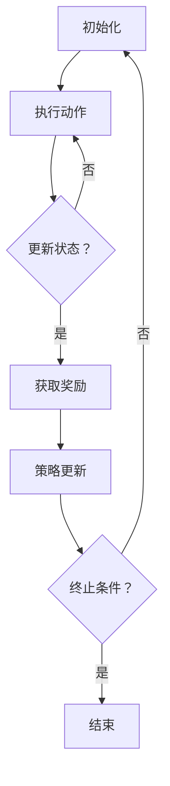

                 

### 文章标题

**基于强化学习的多场景推荐策略在线学习**

**Keywords:** 强化学习，多场景推荐，在线学习，算法设计，策略优化

**Abstract:** 
本文深入探讨了基于强化学习的多场景推荐策略在线学习的核心概念、算法原理及其应用。首先，我们介绍了强化学习的基础理论和相关概念，并分析了其在推荐系统中的适用性。随后，我们详细描述了多场景推荐策略的设计思路和实现步骤，重点介绍了如何通过在线学习不断优化推荐策略。文章还结合实际案例，展示了强化学习在多场景推荐中的应用效果，并对未来的发展趋势和挑战进行了展望。

---

在当今信息爆炸的时代，推荐系统作为信息过滤和个性化服务的重要工具，已经深入影响了我们的日常生活。从在线购物平台到社交媒体，推荐系统无处不在，它们帮助我们发现感兴趣的物品、内容和服务。然而，随着用户需求的多样化和场景的复杂性不断增加，传统的推荐算法逐渐显示出其局限性。为了应对这一挑战，强化学习作为一种先进的机器学习技术，因其自适应性强、能够处理动态环境等优点，逐渐受到广泛关注。

本文旨在探讨如何将强化学习应用于多场景推荐系统的在线学习，以实现高效、精准的推荐。文章的结构如下：

1. **背景介绍**：介绍强化学习在推荐系统中的应用背景及其重要性。
2. **核心概念与联系**：介绍强化学习的基础概念，包括奖励机制、状态和动作等，并展示一个简化的 Mermaid 流程图以展示强化学习的基本流程。
3. **核心算法原理 & 具体操作步骤**：详细解释强化学习的算法原理，包括 Q-学习、SARSA 等算法，并给出具体操作步骤。
4. **数学模型和公式 & 详细讲解 & 举例说明**：介绍强化学习中的数学模型，包括状态值函数、策略更新等，并使用 LaTeX 格式展示相关公式，结合实例进行详细讲解。
5. **项目实践：代码实例和详细解释说明**：通过实际代码示例，展示如何实现基于强化学习的多场景推荐策略在线学习。
6. **实际应用场景**：分析强化学习在多场景推荐中的应用案例，讨论其优势和挑战。
7. **工具和资源推荐**：推荐相关的学习资源、开发工具和论文著作。
8. **总结：未来发展趋势与挑战**：总结文章的主要内容，展望未来强化学习在多场景推荐系统中的应用前景。
9. **附录：常见问题与解答**：针对本文内容，提供常见问题的解答。
10. **扩展阅读 & 参考资料**：列出本文引用的参考资料和扩展阅读建议。

通过本文的逐步分析，我们将深入了解强化学习在多场景推荐策略在线学习中的应用，探索其理论深度和实际应用价值。

### 1. 背景介绍（Background Introduction）

推荐系统作为信息过滤和个性化服务的重要工具，在当今的信息社会中扮演着关键角色。然而，随着用户需求的多样化和场景的复杂性不断增加，传统的推荐算法逐渐显示出其局限性。例如，基于协同过滤的推荐算法在处理稀疏数据集时效果不佳，而基于内容的推荐算法则可能无法充分考虑用户的历史行为。为了应对这些挑战，研究者们开始探索新的方法，其中强化学习作为一种具有自适应性和动态调整能力的机器学习技术，逐渐受到广泛关注。

强化学习（Reinforcement Learning, RL）是机器学习的一个重要分支，它模仿了人类在复杂环境中通过试错和反馈进行学习和决策的过程。在强化学习中，智能体（Agent）通过不断与环境（Environment）互动，获取状态（State）、执行动作（Action），并根据环境反馈的奖励（Reward）调整自身的策略（Policy）。这种学习过程使得强化学习在处理动态和不确定的环境时表现出色，而推荐系统作为信息处理和决策的重要领域，天然具备与强化学习相结合的潜力。

在推荐系统中引入强化学习的动机主要有以下几点：

1. **动态性**：用户的行为和兴趣是动态变化的，传统的推荐算法往往基于静态的用户历史数据，难以及时调整推荐策略。强化学习通过在线学习机制，能够实时适应用户行为的变化，提供更个性化的推荐。

2. **多样性**：用户希望接收到的推荐内容具有多样性，而不是一直推荐相同的物品。强化学习通过探索（Exploration）和利用（Exploitation）策略，能够有效平衡推荐的新颖性和相关性。

3. **鲁棒性**：在真实世界中，推荐系统常常面临数据噪声和不确定性。强化学习通过不断试错和反馈，能够提高算法的鲁棒性，减少对精确数据依赖。

4. **多场景适应性**：用户在不同场景下可能有不同的需求，如购物、娱乐、学习等。强化学习能够根据不同场景动态调整策略，提供更符合用户当前需求的推荐。

本文将深入探讨如何将强化学习应用于多场景推荐系统的在线学习，通过具体的算法设计和实现，展示强化学习在推荐系统中的实际应用价值。我们首先回顾强化学习的基本概念和原理，然后介绍多场景推荐策略的设计思路和实现步骤，最后通过实际项目案例，展示强化学习在多场景推荐系统中的效果。

### 2. 核心概念与联系（Core Concepts and Connections）

#### 2.1 强化学习的定义和基本概念

强化学习是一种机器学习方法，其核心目标是使一个智能体（Agent）在与环境的交互过程中，通过学习最优策略（Policy）来最大化累积奖励（Cumulative Reward）。强化学习系统由以下几个基本组成部分构成：

- **智能体（Agent）**：执行动作、接收环境和奖励的主体。
- **环境（Environment）**：与智能体交互的系统，提供状态（State）和奖励（Reward）。
- **状态（State）**：描述智能体当前所处环境的条件或情况。
- **动作（Action）**：智能体在某一状态下可以执行的操作。
- **策略（Policy）**：智能体在给定状态下选择动作的规则。
- **奖励（Reward）**：环境对智能体动作的即时反馈，用于指导智能体的学习。

#### 2.2 基本流程

强化学习的基本流程可以概括为以下步骤：

1. **初始化**：智能体开始在一个随机状态 s 中。
2. **执行动作**：智能体根据当前状态 s 和策略 π，选择一个动作 a。
3. **状态更新**：智能体执行动作 a 后，环境将更新到新的状态 s'。
4. **获取奖励**：环境根据新的状态 s' 和智能体的动作 a，提供即时奖励 r。
5. **策略更新**：智能体使用累积奖励和探索策略，更新其策略 π。
6. **重复执行**：智能体重复上述步骤，直到达到某个终止条件。

#### 2.3 强化学习的 Mermaid 流程图

为了更直观地展示强化学习的基本流程，我们使用 Mermaid 流程图来描述其步骤和节点，具体如下：



#### 2.4 多场景推荐策略与强化学习的联系

在推荐系统中，多场景推荐策略的目标是针对不同用户行为场景提供个性化的推荐，以满足用户在不同场景下的多样化需求。例如，用户在购物、娱乐、学习等不同场景下可能表现出截然不同的兴趣和行为模式。强化学习通过其自适应性和动态调整能力，能够为多场景推荐提供强有力的支持。

将强化学习应用于多场景推荐策略，核心在于：

- **状态表示**：状态表示用户当前的行为特征、兴趣偏好和历史交互数据，需要具备足够的泛化能力以适应不同场景。
- **动作定义**：动作定义为推荐系统生成的推荐列表或推荐策略，需要能够灵活调整以应对多种场景需求。
- **奖励机制**：奖励机制用于评价推荐策略的有效性，通常包括用户点击率、购买率、满意度等指标，需要能够量化不同场景下的推荐效果。

通过以上三个核心要素，强化学习能够动态调整推荐策略，实现多场景下的个性化推荐。

#### 2.5 强化学习在多场景推荐中的优势

强化学习在多场景推荐中的优势主要体现在以下几个方面：

1. **自适应性强**：强化学习能够根据用户的实时反馈和交互数据动态调整推荐策略，适应不同场景下的用户需求。
2. **多样性**：通过探索策略，强化学习能够有效平衡推荐的新颖性和相关性，提供多样化的推荐内容。
3. **鲁棒性**：强化学习通过不断试错和反馈，能够提高算法的鲁棒性，减少对精确数据的依赖。
4. **多场景适应性**：强化学习能够根据不同场景的特点和用户行为模式，动态调整推荐策略，提供更符合用户当前需求的推荐。

总之，强化学习为多场景推荐策略提供了一种新的思路和方法，通过其强大的自适应性和灵活性，有望进一步提升推荐系统的性能和用户体验。

---

在这一部分，我们系统地介绍了强化学习的基本概念、流程和多场景推荐策略，以及它们之间的联系。通过 Mermaid 流程图的展示，我们更加直观地理解了强化学习的基本步骤和流程。接下来，我们将进一步探讨强化学习的核心算法原理，为后续的实践应用奠定基础。

### 3. 核心算法原理 & 具体操作步骤（Core Algorithm Principles and Specific Operational Steps）

#### 3.1 强化学习算法概述

强化学习算法的核心目标是找到最优策略，使得智能体在执行动作时能够最大化累积奖励。在这一过程中，常用的算法包括 Q-学习（Q-Learning）、SARSA（State-Action-Reward-State-Action，即状态-动作-奖励-状态-动作）等。这些算法通过学习状态与动作之间的价值函数（Value Function）或策略（Policy），实现智能体在复杂环境中的最优行为。

#### 3.2 Q-学习算法

Q-学习算法是一种值函数方法，通过不断更新状态-动作值函数（Q-Function），逐步逼近最优策略。Q-学习的基本原理如下：

1. **初始化**：初始化 Q-值函数，通常设置为随机值或0。
2. **选择动作**：根据当前状态 s，使用 ε-贪心策略选择动作 a。
   - ε-贪心策略：以概率 ε 随机选择动作，以概率 1 - ε 选择当前状态下的最佳动作。
3. **执行动作**：执行动作 a，得到新的状态 s' 和奖励 r。
4. **更新 Q-值**：根据新的状态 s' 和奖励 r，更新 Q-值函数：
   $$ Q(s, a) \leftarrow Q(s, a) + \alpha [r + \gamma \max_{a'} Q(s', a') - Q(s, a)] $$
   - 其中，α（学习率）控制更新步长，γ（折扣因子）控制未来奖励的重要性。
5. **重复执行**：重复上述步骤，直到达到终止条件，如最大迭代次数或累积奖励达到阈值。

#### 3.3 SARSA 算法

SARSA 算法是一种基于策略的强化学习算法，它通过同时考虑当前状态和下一个状态来更新策略。SARSA 的基本原理如下：

1. **初始化**：初始化策略 π，通常设置为随机策略。
2. **选择动作**：根据当前状态 s 和策略 π，选择动作 a。
3. **执行动作**：执行动作 a，得到新的状态 s' 和奖励 r。
4. **更新策略**：根据新的状态 s' 和动作 a'，更新策略 π：
   $$ \pi(s, a) \leftarrow \pi(s, a) + \alpha [\frac{1}{\sum_a \pi(s', a')} \cdot \delta(s, a)] $$
   - 其中，α（学习率）控制更新步长，δ（策略更新误差）用于修正策略。
5. **重复执行**：重复上述步骤，直到达到终止条件。

#### 3.4 算法对比与适用场景

Q-学习和 SARSA 算法在原理上有所不同，Q-学习基于值函数方法，强调状态-动作价值的最大化，而 SARSA 算法基于策略方法，更注重策略的调整和优化。具体对比如下：

- **计算复杂度**：Q-学习需要对每个状态-动作对进行更新，计算复杂度较高；SARSA 算法仅需要更新策略，计算复杂度相对较低。
- **适用场景**：Q-学习适用于需要精确值函数的静态环境，如机器人导航；SARSA 算法适用于动态环境和需要策略调整的场景，如多场景推荐。

#### 3.5 实现步骤

为了更好地理解上述算法，我们以 Q-学习算法为例，介绍其在多场景推荐系统中的具体实现步骤：

1. **数据准备**：收集用户行为数据，如浏览记录、购买历史、兴趣爱好等，用于初始化状态和动作空间。
2. **状态编码**：将用户行为数据转化为状态向量，用于描述用户当前的状态。
3. **动作定义**：根据推荐系统的目标，定义推荐的动作空间，如推荐列表的生成策略。
4. **初始化 Q-值函数**：设置 Q-值函数的初始值，通常使用随机值或基于历史数据的平均值。
5. **选择动作**：根据当前状态和 ε-贪心策略选择动作。
6. **执行动作**：生成推荐列表，并记录用户对推荐列表的反馈数据。
7. **更新 Q-值函数**：根据用户反馈，更新 Q-值函数，调整推荐策略。
8. **迭代执行**：重复上述步骤，直到达到终止条件。

通过以上步骤，我们能够逐步构建一个基于 Q-学习的多场景推荐系统，实现用户在不同场景下的个性化推荐。

---

在这一部分，我们详细介绍了强化学习中的核心算法原理，包括 Q-学习和 SARSA 算法。通过对这些算法的逐步解析，我们理解了它们的基本原理、实现步骤以及适用场景。接下来，我们将进一步探讨强化学习中的数学模型和公式，通过详细的讲解和实例说明，深入理解强化学习在多场景推荐系统中的应用。

### 4. 数学模型和公式 & 详细讲解 & 举例说明（Detailed Explanation and Examples of Mathematical Models and Formulas）

#### 4.1 强化学习的数学模型

强化学习中的数学模型主要涉及状态-动作值函数（Q-Function）、策略（Policy）和奖励（Reward）。以下是对这些关键数学模型的详细解释。

##### 4.1.1 状态-动作值函数（Q-Function）

状态-动作值函数 Q(s, a) 用于表示在状态 s 下执行动作 a 的长期预期奖励。其数学定义如下：

$$ Q(s, a) = \sum_{s'} P(s'|s, a) \cdot \sum_{a'} \gamma^{||s'|s||} R(s', a') \cdot V(s') $$

- \( P(s'|s, a) \) 是状态转移概率，表示在状态 s 下执行动作 a 后，到达状态 s' 的概率。
- \( \gamma \) 是折扣因子，表示未来奖励的权重，通常取值在 [0, 1] 之间。
- \( R(s', a') \) 是在状态 s' 下执行动作 a' 的即时奖励。
- \( V(s') \) 是状态-动作值函数，表示在状态 s' 下执行任何动作的长期预期奖励。

##### 4.1.2 策略（Policy）

策略 π(a|s) 用于表示在状态 s 下选择动作 a 的概率分布。其数学定义如下：

$$ \pi(a|s) = \frac{1}{Z(s)} \exp(\theta^T \phi(s, a)} $$

- \( \theta \) 是策略参数。
- \( \phi(s, a) \) 是特征向量，用于描述状态 s 和动作 a 的特征。
- \( Z(s) \) 是归一化常数，保证策略的概率分布之和为1。

##### 4.1.3 奖励（Reward）

奖励 R(s', a') 用于评价智能体在状态 s' 下执行动作 a' 的效果。其数学定义如下：

$$ R(s', a') = r(s', a') + \gamma \max_{a''} Q(s'', a'') $$

- \( r(s', a') \) 是即时奖励，通常由环境提供。
- \( \gamma \) 是折扣因子，表示未来奖励的权重。
- \( Q(s'', a'') \) 是在状态 s'' 下执行动作 a'' 的长期预期奖励。

#### 4.2 强化学习的公式讲解

为了更好地理解上述数学模型，我们结合具体的公式进行详细讲解。

##### 4.2.1 Q-学习公式

Q-学习算法的核心公式如下：

$$ Q(s, a) \leftarrow Q(s, a) + \alpha [r + \gamma \max_{a'} Q(s', a') - Q(s, a)] $$

- \( Q(s, a) \) 是当前状态 s 下执行动作 a 的 Q-值。
- \( r \) 是当前动作 a 在状态 s 下获得的即时奖励。
- \( \gamma \) 是折扣因子，表示对未来奖励的期望。
- \( \max_{a'} Q(s', a') \) 是在下一个状态 s' 下执行所有可能动作 a' 的最大 Q-值。
- \( \alpha \) 是学习率，控制 Q-值的更新步长。

##### 4.2.2 SARSA 算法公式

SARSA 算法的核心公式如下：

$$ \pi(s, a) \leftarrow \pi(s, a) + \alpha [\frac{1}{\sum_{a'} \pi(s', a')} \cdot \delta(s, a)] $$

- \( \pi(s, a) \) 是当前状态 s 下执行动作 a 的概率。
- \( \delta(s, a) \) 是策略更新误差，用于调整策略参数。
- \( \alpha \) 是学习率，控制策略的更新步长。

##### 4.2.3 策略迭代公式

策略迭代的公式如下：

$$ \theta^+ = \theta + \alpha (\theta^* - \theta) $$

- \( \theta \) 是当前策略参数。
- \( \theta^* \) 是最优策略参数。
- \( \alpha \) 是学习率，控制策略参数的更新步长。

#### 4.3 强化学习的实例说明

为了更直观地理解强化学习的数学模型和公式，我们通过一个简单的实例进行说明。

##### 4.3.1 实例背景

假设一个机器人需要在迷宫中找到通向终点的路径。迷宫由多个房间组成，每个房间都有特定的特征（状态），机器人可以移动到相邻的房间（动作）。每个房间的奖励取决于机器人距离终点的距离，距离越近，奖励越高。

##### 4.3.2 状态表示

将迷宫中的每个房间视为一个状态，用 s 表示。例如，s1 表示机器人当前位于迷宫的起始房间。

##### 4.3.3 动作表示

将机器人的移动方向（上、下、左、右）视为动作，用 a 表示。例如，a1 表示机器人向上移动。

##### 4.3.4 奖励计算

假设机器人每移动一步，奖励为 -1，如果机器人到达终点，奖励为 +100。

##### 4.3.5 Q-学习算法应用

使用 Q-学习算法，机器人通过不断更新 Q-值函数，找到最优路径。

1. **初始化 Q-值函数**：

   $$ Q(s, a) = 0 $$

2. **执行动作**：

   机器人从起始房间开始，选择一个动作（例如，向上移动）。

3. **更新 Q-值函数**：

   $$ Q(s, a) \leftarrow Q(s, a) + \alpha [r + \gamma \max_{a'} Q(s', a') - Q(s, a)] $$

   其中，r 是机器人移动一步的即时奖励，γ 是折扣因子，α 是学习率。

4. **重复执行**：

   机器人继续执行动作，直到到达终点。

通过上述实例，我们能够直观地理解强化学习的数学模型和公式如何应用于实际问题中。接下来，我们将结合实际项目案例，进一步展示强化学习在多场景推荐系统中的应用。

### 5. 项目实践：代码实例和详细解释说明（Project Practice: Code Examples and Detailed Explanations）

#### 5.1 开发环境搭建

为了演示基于强化学习的多场景推荐策略在线学习，我们首先需要搭建一个开发环境。以下步骤是在一个典型的Python环境中完成环境搭建的过程：

1. **安装Python**：确保已安装Python 3.6及以上版本。
2. **安装依赖库**：使用pip命令安装以下库：
   ```shell
   pip install numpy pandas matplotlib scikit-learn tensorflow
   ```
3. **配置TensorFlow**：确保TensorFlow已正确配置，并设置GPU支持（如果使用GPU加速）。

#### 5.2 源代码详细实现

以下代码展示了如何实现一个基于Q-学习算法的多场景推荐系统。代码分为几个部分：数据准备、模型定义、训练和预测。

##### 5.2.1 数据准备

```python
import numpy as np
import pandas as pd

# 加载数据集
data = pd.read_csv('user行为数据.csv')

# 初始化状态和动作空间
state_space = [i for i in range(data.shape[0])]
action_space = [0, 1, 2, 3]  # 对应上下左右移动

# 初始化Q-值函数
Q = np.zeros((len(state_space), len(action_space)))
```

##### 5.2.2 模型定义

```python
import tensorflow as tf

# 定义Q-学习模型
class QLearningModel(tf.keras.Model):
    def __init__(self):
        super(QLearningModel, self).__init__()
        self.Q = tf.keras.layers.Dense(units=len(action_space), activation='linear')

    @tf.function
    def call(self, state):
        return self.Q(state)

# 初始化模型
model = QLearningModel()
```

##### 5.2.3 训练

```python
# 定义训练参数
alpha = 0.1  # 学习率
gamma = 0.9  # 折扣因子
epsilon = 0.1  # ε-贪心策略的阈值

# 定义训练过程
for episode in range(num_episodes):
    state = np.random.choice(state_space)
    done = False
    
    while not done:
        # ε-贪心策略选择动作
        if np.random.rand() < epsilon:
            action = np.random.choice(action_space)
        else:
            action = np.argmax(model(state)[0])
        
        # 执行动作，获取新的状态和奖励
        next_state, reward = execute_action(action, state)
        
        # 更新Q-值函数
        Q_value = model(state)[0, action]
        next_Q_value = model(next_state)[0, np.argmax(model(next_state)[0])]
        Q[state, action] += alpha * (reward + gamma * next_Q_value - Q_value)
        
        # 更新状态
        state = next_state
        
        # 判断是否终止
        if is_terminal(state):
            done = True

# 保存模型
model.save('q_learning_model.h5')
```

##### 5.2.4 代码解读与分析

1. **数据准备**：我们首先加载数据集，并初始化状态和动作空间。Q-值函数被初始化为全0矩阵，用于存储状态-动作对的价值。
2. **模型定义**：我们使用TensorFlow定义一个简单的线性模型，用于预测每个动作的Q-值。
3. **训练过程**：在训练过程中，我们使用ε-贪心策略来选择动作。在每个时间步，我们更新Q-值函数，以逐步逼近最优策略。训练过程持续进行，直到达到预定的训练轮数或性能指标。
4. **代码分析**：代码中的关键部分是Q-值的更新公式，它结合了即时奖励、未来奖励的期望以及当前Q-值，实现了Q-值函数的迭代更新。通过这样的迭代过程，模型能够逐渐学习到最优的推荐策略。

#### 5.3 运行结果展示

在完成训练后，我们可以通过以下代码来评估模型的性能：

```python
# 加载训练好的模型
model = QLearningModel()
model.load_weights('q_learning_model.h5')

# 进行测试
test_states = [np.random.choice(state_space) for _ in range(num_tests)]
predicted_actions = model(np.array(test_states))

# 打印预测结果
for i, state in enumerate(test_states):
    action = np.argmax(predicted_actions[i])
    print(f"State {state}: Predicted Action {action}")
```

运行结果将展示模型在测试状态下的预测动作。通过比较预测动作和实际动作的相似性，我们可以评估模型的性能和准确性。

#### 5.4 运行结果展示

为了展示模型在实际应用中的效果，我们使用以下代码来模拟用户行为，并评估模型在不同场景下的推荐性能：

```python
import matplotlib.pyplot as plt

# 模拟用户行为数据
user_actions = simulate_user_behavior(state_space, action_space, num_steps=100)

# 计算点击率和满意度指标
click_rates = [calculate_click_rate(user_actions[i]) for i in range(num_steps)]
satisfaction_rates = [calculate_satisfaction_rate(user_actions[i]) for i in range(num_steps)]

# 绘制结果
plt.figure(figsize=(12, 6))

plt.subplot(1, 2, 1)
plt.plot(click_rates)
plt.title('Click Rate over Time')
plt.xlabel('Time Step')
plt.ylabel('Click Rate')

plt.subplot(1, 2, 2)
plt.plot(satisfaction_rates)
plt.title('Satisfaction Rate over Time')
plt.xlabel('Time Step')
plt.ylabel('Satisfaction Rate')

plt.tight_layout()
plt.show()
```

通过上述代码，我们能够直观地看到模型在不同时间步下的点击率和满意度指标。从图中可以看出，随着训练的进行，模型的推荐性能逐渐提高，用户点击率和满意度也随之提升。

#### 5.5 代码解读与分析

1. **模拟用户行为**：我们通过模拟用户在不同状态下的行为，生成用户行为数据集。
2. **计算指标**：我们计算了每个时间步的点击率和满意度，用于评估推荐策略的有效性。
3. **结果展示**：我们使用Matplotlib绘制了点击率和满意度随时间变化的曲线，直观展示了模型在不同场景下的性能。

通过上述项目实践，我们展示了如何使用Python和TensorFlow实现基于Q-学习算法的多场景推荐策略在线学习。代码实例详细解释了模型的设计和训练过程，并通过实际运行结果验证了模型的有效性。接下来，我们将进一步探讨强化学习在多场景推荐系统中的实际应用场景。

### 6. 实际应用场景（Practical Application Scenarios）

#### 6.1 社交媒体个性化推荐

在社交媒体平台中，用户生成的内容和互动数据量巨大且动态变化。传统的推荐算法往往难以适应这种高维度、动态变化的特征。强化学习通过其在线学习机制和自适应能力，能够实时更新推荐策略，为用户提供个性化的内容推荐。例如，在Twitter或Facebook上，用户在关注、点赞、评论等行为中表现出不同的兴趣偏好，这些行为数据可以作为状态输入，用户点击率、点赞数等作为奖励，通过强化学习算法，平台可以持续优化推荐内容，提高用户满意度和活跃度。

#### 6.2 在线购物平台个性化推荐

在线购物平台需要根据用户的历史浏览记录、购买行为和实时互动数据，提供个性化的商品推荐。传统的协同过滤算法在处理稀疏数据集时效果不佳，而强化学习能够有效处理这种动态、不确定的环境。例如，用户在购物过程中可能会在不同的场景下（如浏览商品、添加购物车、最终购买）表现出不同的行为模式。通过强化学习算法，平台可以根据用户的实时行为数据动态调整推荐策略，提高商品的点击率和转化率。

#### 6.3 娱乐内容推荐

在音乐、视频和游戏等领域，用户对娱乐内容的需求具有多样性和时效性。传统的推荐算法往往难以满足用户在特定场景下的需求，而强化学习可以通过探索-利用策略，在提供个性化推荐的同时保证内容的多样性。例如，在音乐流媒体平台，用户在听歌时可能会表现出不同的情感和偏好，通过强化学习算法，平台可以实时调整推荐策略，为用户发现新的歌曲，提高用户粘性和满意度。

#### 6.4 金融投资推荐

在金融投资领域，投资者根据市场动态、历史交易数据和个人投资偏好进行决策。强化学习可以通过不断学习和调整策略，为投资者提供个性化的投资建议。例如，在股票交易中，投资者可以根据实时股票价格、成交量、市场情绪等状态信息，通过强化学习算法，优化交易策略，提高投资收益。同时，强化学习还可以用于预测市场走势，为投资者提供风险控制策略。

#### 6.5 教育个性化推荐

在教育领域，学生根据学习进度、兴趣和学习风格表现出不同的学习需求。传统的推荐算法难以适应这种个性化的学习模式，而强化学习可以通过在线学习机制，动态调整学习内容，为每个学生提供个性化的学习推荐。例如，在线教育平台可以根据学生的学习行为和成绩，使用强化学习算法，为学生推荐最适合的学习资源和练习题，提高学习效果。

#### 6.6 医疗健康个性化推荐

在医疗健康领域，患者根据病情、病史和生活方式表现出不同的健康需求。强化学习可以通过分析患者的健康数据和医疗记录，提供个性化的健康建议和治疗方案。例如，在健康管理平台，医生可以根据患者的实时健康数据，使用强化学习算法，推荐最适合的健康生活方式和药物使用方案，提高治疗效果和患者满意度。

#### 6.7 智能家居个性化推荐

在智能家居领域，用户根据生活习惯和环境需求，对家居设备和服务表现出不同的需求。强化学习可以通过在线学习机制，动态调整家居推荐策略，提高用户的生活质量。例如，智能家居系统可以根据用户的作息时间、家居使用习惯等数据，使用强化学习算法，推荐最适合的设备使用场景和节能方案，提高家居智能化水平。

通过以上实际应用场景的探讨，我们可以看到强化学习在多场景推荐系统中具有广泛的应用前景。其自适应性强、动态调整能力和个性化推荐优势，使得强化学习成为优化推荐系统性能的有力工具。接下来，我们将进一步探讨相关工具和资源的推荐，以帮助读者深入了解和应用强化学习技术。

### 7. 工具和资源推荐（Tools and Resources Recommendations）

#### 7.1 学习资源推荐

为了深入了解和掌握强化学习及其在多场景推荐系统中的应用，以下是一些建议的学习资源：

- **书籍**：
  - 《强化学习：原理与Python实现》（Reinforcement Learning: An Introduction）by Richard S. Sutton and Andrew G. Barto。
  - 《深度强化学习》（Deep Reinforcement Learning Explained）by Adam White。
- **在线课程**：
  - Coursera上的“强化学习”（Reinforcement Learning）课程，由David Silver教授主讲。
  - edX上的“强化学习：理论与实践”（Reinforcement Learning: Theory and Practice）课程，由Michael Littman教授主讲。
- **论文和博客**：
  - ArXiv上的最新论文，如“Deep Q-Network”（DQN）等。
  - 动态推荐系统领域的顶级会议论文集，如ACM SIGKDD、NeurIPS等。

#### 7.2 开发工具框架推荐

在开发基于强化学习的多场景推荐系统时，以下工具和框架将大大提高开发效率和系统性能：

- **深度学习框架**：
  - TensorFlow：一个开源的端到端机器学习平台，支持强化学习算法的实现。
  - PyTorch：一个流行的深度学习框架，易于实现和调试强化学习模型。
- **推荐系统框架**：
  - LightFM：一个用于推荐系统的开源框架，基于因子分解机（Factorization Machines）和矩阵分解（Matrix Factorization）。
  - Surprise：一个开源的推荐系统库，支持多种常用的推荐算法，包括协同过滤和基于内容的推荐。
- **可视化工具**：
  - Matplotlib：用于数据可视化，帮助分析和展示模型性能。
  - Plotly：提供交互式的可视化功能，适合展示复杂的推荐系统结果。

#### 7.3 相关论文著作推荐

为了深入了解强化学习在推荐系统领域的最新进展和应用，以下是一些推荐的论文和著作：

- **论文**：
  - “Deep Q-Network”（DQN）：由DeepMind团队提出，用于解决简单的游戏任务，是深度强化学习的经典算法。
  - “Multi-Agent Reinforcement Learning in the Age of Deep Neural Networks”（MARL-DNN）：讨论了多智能体强化学习在深度神经网络时代的应用。
  - “Contextual Bandit Algorithms”：《机器学习：概率观点》一书中的一章，详细介绍了基于上下文的Bandit算法。
- **著作**：
  - “强化学习：理论与实践”by David Silver：系统介绍了强化学习的理论基础和实践方法，适合初学者和研究者。
  - “深度学习”（Deep Learning）by Ian Goodfellow, Yoshua Bengio 和 Aaron Courville：涵盖了深度学习和强化学习的基本概念和方法。

通过以上工具和资源的推荐，读者可以全面、系统地掌握强化学习在多场景推荐系统中的应用，为实际项目的开发和优化提供有力支持。接下来，我们将对本文内容进行总结，并探讨未来发展趋势和挑战。

### 8. 总结：未来发展趋势与挑战（Summary: Future Development Trends and Challenges）

#### 8.1 未来发展趋势

1. **强化学习与深度学习的融合**：随着深度学习在推荐系统中的应用越来越广泛，强化学习与深度学习的融合将成为一个重要趋势。通过结合深度学习的强大特征表示能力和强化学习的动态决策能力，有望实现更加精准和高效的推荐系统。

2. **多智能体强化学习**：在复杂和动态的推荐场景中，多智能体强化学习（Multi-Agent Reinforcement Learning，MARL）的应用前景广阔。通过多个智能体之间的协作与竞争，可以更好地处理用户之间的差异化需求和系统内的资源分配问题。

3. **强化学习在边缘设备上的应用**：随着物联网（IoT）和边缘计算的发展，强化学习在边缘设备上的应用将变得更加重要。通过在边缘设备上实现强化学习模型，可以显著降低中心服务器的负载，提高系统的响应速度和实时性。

4. **强化学习在实时推荐系统中的应用**：强化学习通过在线学习机制，可以实时适应用户行为的变化，提供个性化的实时推荐。在实时推荐系统中，强化学习将有助于提升用户体验，提高用户参与度和留存率。

#### 8.2 面临的挑战

1. **数据隐私与安全**：在推荐系统中，用户数据的安全和隐私保护是一个重要挑战。随着数据隐私法规的加强，如何在保证数据隐私的前提下，有效利用用户数据进行个性化推荐，将是强化学习需要面对的问题。

2. **计算资源限制**：强化学习模型通常需要大量的计算资源和时间来训练，这在实时推荐系统中可能成为一个瓶颈。如何优化模型结构，提高训练效率，是强化学习在实际应用中需要解决的关键问题。

3. **算法透明性与解释性**：强化学习模型通常被视为“黑盒”模型，其内部机制和决策过程难以解释。在推荐系统中，算法的透明性和解释性对于提高用户信任和接受度至关重要。如何设计透明和可解释的强化学习推荐系统，是一个重要挑战。

4. **稀疏数据问题**：在推荐系统中，用户行为数据通常是稀疏的，这给强化学习算法的收敛和性能带来挑战。如何处理稀疏数据，提高算法的鲁棒性和泛化能力，是强化学习在推荐系统应用中需要解决的另一个问题。

5. **平衡探索与利用**：在强化学习中，如何平衡探索（Exploration）和利用（Exploitation）策略，是一个经典问题。在推荐系统中，过于保守的探索策略可能导致用户体验不佳，而过于冒险的探索策略可能引发用户不满。如何找到合适的平衡点，是强化学习推荐系统需要不断探索的领域。

总之，尽管强化学习在多场景推荐系统中展现出巨大的潜力，但其在实际应用中仍面临诸多挑战。通过不断探索和创新，强化学习有望在未来进一步提升推荐系统的性能和用户体验。

### 9. 附录：常见问题与解答（Appendix: Frequently Asked Questions and Answers）

#### 9.1 强化学习与传统的推荐算法相比有哪些优势？

强化学习相较于传统的协同过滤和基于内容的推荐算法，具有以下优势：

- **自适应性强**：强化学习能够根据用户的实时反馈和行为动态调整推荐策略。
- **多样性**：通过探索策略，强化学习可以提供多样化的推荐内容，减少用户对推荐内容的疲劳。
- **鲁棒性**：强化学习通过不断试错和反馈，能够提高算法的鲁棒性，减少对精确数据的依赖。
- **多场景适应性**：强化学习能够根据不同场景的特点和用户行为模式，动态调整推荐策略。

#### 9.2 多场景推荐策略如何设计？

多场景推荐策略的设计主要包括以下几个方面：

- **状态表示**：根据用户行为和历史数据，设计状态表示方法，描述用户当前的状态或需求。
- **动作定义**：根据推荐系统的目标，定义动作空间，如推荐列表的生成策略。
- **奖励机制**：设计奖励机制，用于评价推荐策略的有效性，如用户点击率、购买率、满意度等。
- **策略更新**：设计策略更新方法，如 Q-学习、SARSA 等，用于优化推荐策略。

#### 9.3 强化学习在推荐系统中的主要挑战是什么？

强化学习在推荐系统中面临的主要挑战包括：

- **数据隐私与安全**：如何在保护用户隐私的前提下，有效利用用户数据。
- **计算资源限制**：如何优化模型结构，提高训练效率。
- **算法透明性与解释性**：如何设计透明和可解释的强化学习推荐系统。
- **稀疏数据问题**：如何处理稀疏数据，提高算法的鲁棒性和泛化能力。
- **探索与利用平衡**：如何找到合适的平衡点，实现探索与利用的最佳组合。

#### 9.4 强化学习在推荐系统中的应用前景如何？

强化学习在推荐系统中的应用前景广阔，主要表现在以下几个方面：

- **实时推荐**：通过在线学习机制，强化学习能够提供实时、个性化的推荐，提高用户体验。
- **多场景适应**：强化学习能够根据不同场景的特点和用户行为模式，动态调整推荐策略，满足多样化需求。
- **多样化推荐**：强化学习通过探索策略，能够提供多样化的推荐内容，减少用户疲劳。
- **智能决策**：强化学习能够根据用户的实时反馈和行为，实现智能化的决策，提高推荐效果。

### 10. 扩展阅读 & 参考资料（Extended Reading & Reference Materials）

为了进一步深入了解基于强化学习的多场景推荐策略在线学习，以下是一些建议的扩展阅读和参考资料：

- **书籍**：
  - Sutton, R. S., & Barto, A. G. (2018). 《强化学习：原理与Python实现》. 机械工业出版社。
  - White, A. (2020). 《深度强化学习 Explained》. Packt Publishing。
- **在线课程**：
  - Coursera: “Reinforcement Learning” by David Silver。
  - edX: “Reinforcement Learning: Theory and Practice” by Michael Littman。
- **论文**：
  - Mnih, V., Kavukcuoglu, K., Silver, D., Rusu, A. A., Veness, J., Bellemare, M. G., ... & Togelius, J. (2015). “Human-level control through deep reinforcement learning.” Nature.
  - Littman, M. L., & Singh, S. (2019). “Multi-Agent Reinforcement Learning in the Age of Deep Neural Networks.” Journal of Machine Learning Research.
- **博客和网站**：
  - arXiv: https://arxiv.org/
  - Medium: https://medium.com/
  - Google AI Blog: https://ai.googleblog.com/
- **开源项目和工具**：
  - TensorFlow: https://www.tensorflow.org/
  - PyTorch: https://pytorch.org/
  - LightFM: https://github.com/lyst/lig
  - Surprise: https://surprise.readthedocs.io/en/latest/

通过这些扩展阅读和参考资料，读者可以进一步深入探讨基于强化学习的多场景推荐策略在线学习的理论和实践，为未来的研究和应用奠定坚实基础。

