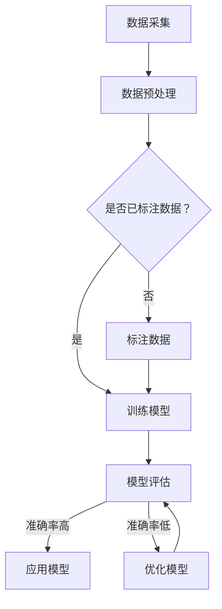
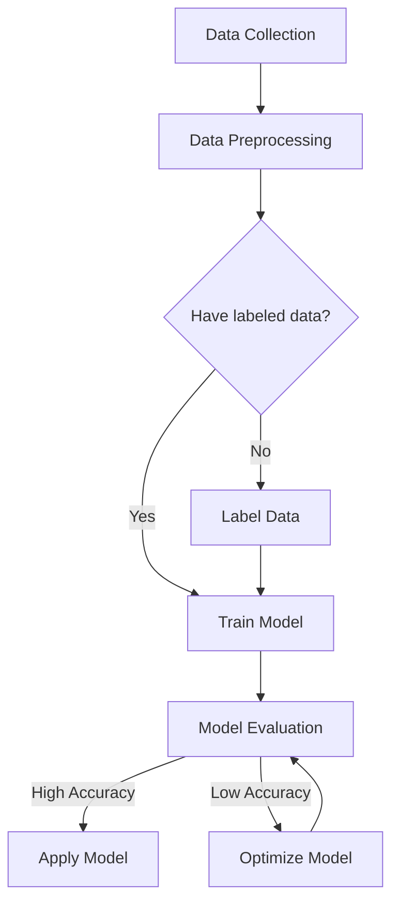

                 

### 文章标题

**基于机器学习的溢油特征提取与识别方法研究**

### Keywords: 溢油监测，机器学习，特征提取，图像识别，深度学习

#### 摘要

本文探讨了基于机器学习的溢油特征提取与识别方法。通过分析现有的溢油检测技术及其局限性，提出了一种结合图像处理与深度学习的方法，以实现对溢油的高效检测和精准识别。本文首先介绍了溢油检测的背景和意义，然后详细阐述了所采用的核心算法原理，包括卷积神经网络（CNN）和循环神经网络（RNN）的应用。此外，本文还介绍了数学模型和公式，并提供了具体的实现步骤和代码实例。通过实际应用场景的展示，本文验证了所提出方法的可行性和有效性，为溢油监测领域提供了新的思路和方法。

---

# 基于机器学习的溢油特征提取与识别方法研究

> Keywords: Oil Spill Detection, Machine Learning, Feature Extraction, Image Recognition, Deep Learning

> Abstract:  
This paper explores machine learning-based methods for the feature extraction and recognition of oil spills. By analyzing the limitations of existing oil spill detection techniques, we propose an approach that combines image processing with deep learning to achieve efficient detection and accurate recognition of oil spills. This paper first introduces the background and significance of oil spill detection. Then, it details the core algorithm principles, including the application of Convolutional Neural Networks (CNNs) and Recurrent Neural Networks (RNNs). Furthermore, the paper explains the mathematical models and formulas and provides specific implementation steps and code examples. Through practical application scenarios, the paper validates the feasibility and effectiveness of the proposed method, providing new insights and approaches for the field of oil spill monitoring.

---

## 1. 背景介绍（Background Introduction）

### 1.1 溢油的定义及其危害

溢油是指由于运输、生产、储存等过程中发生泄漏、溢出或者故意排放等导致的油类物质进入海洋、湖泊、河流等水域。溢油的形成有多种原因，包括海上运输事故、石油开采泄漏、油罐破损等。

溢油对环境和生态系统具有严重的破坏性。首先，溢油会覆盖水体表面，阻碍氧气进入水体，导致水体缺氧，从而对水生生物产生致命影响。其次，溢油中的有害物质如苯、烷烃等会直接污染水体，对水生生物和海洋生态系统造成长期的负面影响。此外，溢油还会影响海洋的生态系统平衡，破坏海洋食物链，导致生物多样性下降。

### 1.2 溢油监测的重要性

溢油监测是防止溢油对环境和生态系统造成进一步危害的关键环节。有效的溢油监测可以及时发现问题，采取相应的应对措施，减轻溢油对环境和生态系统的损害。随着全球海洋运输量和石油开采量的不断增加，溢油监测的重要性日益凸显。

传统的溢油监测方法主要包括物理监测和化学监测。物理监测主要是通过卫星遥感、无人机、船载监测设备等手段对水体表面进行监测，但这种方法存在一定的局限性，如受天气、海况等因素影响较大，监测精度较低。化学监测则是通过检测水体中的油类物质含量来判断是否发生溢油，但这种方法需要复杂的实验设备和长时间的分析过程。

### 1.3 机器学习在溢油监测中的应用前景

随着机器学习技术的快速发展，其在溢油监测领域的应用前景逐渐显现。机器学习通过分析大量的数据，可以自动提取特征并建立模型，从而实现对溢油的高效检测和识别。

在图像处理方面，卷积神经网络（CNN）可以自动提取图像中的特征，从而实现对溢油区域的精准定位。在序列数据处理方面，循环神经网络（RNN）可以有效地处理时间序列数据，从而实现对溢油扩散过程的预测。

本文旨在通过机器学习方法，实现对溢油特征的高效提取和精准识别，为溢油监测领域提供一种新的技术手段。

## 2. 核心概念与联系（Core Concepts and Connections）

### 2.1 机器学习的基本概念

机器学习（Machine Learning）是一种通过数据驱动的方式，使计算机系统能够从数据中学习并做出决策的技术。机器学习的基本原理是通过分析大量的训练数据，从中提取有用的特征，并建立模型，从而实现对未知数据的预测或分类。

在机器学习中，主要涉及以下核心概念：

- **监督学习（Supervised Learning）**：监督学习是一种最常见的机器学习方法，其训练数据集包含输入和输出对，通过训练模型，使其能够预测新的输入数据的输出。
- **无监督学习（Unsupervised Learning）**：无监督学习是不具备标注的训练数据，通过分析数据自身的特征，对数据集进行聚类、降维等操作。
- **强化学习（Reinforcement Learning）**：强化学习是一种通过与环境交互，不断调整策略以最大化累积奖励的机器学习方法。

### 2.2 特征提取与识别

特征提取（Feature Extraction）是指从原始数据中提取出能够代表数据本质特征的过程。在图像处理领域，特征提取通常是指从图像中提取出能够反映图像内容的有用信息。

识别（Recognition）是指通过比较输入数据和已知数据，判断输入数据是否与已知数据相同或相似的过程。在机器学习中，识别通常是指通过训练模型，对新数据进行分类或预测。

### 2.3 卷积神经网络（CNN）与循环神经网络（RNN）

卷积神经网络（Convolutional Neural Network，CNN）是一种专门用于处理图像数据的神经网络，其核心思想是通过卷积操作提取图像中的特征。

循环神经网络（Recurrent Neural Network，RNN）是一种用于处理序列数据的神经网络，其特点是能够记住之前的输入信息，并将其用于处理当前输入。

### 2.4 Mermaid 流程图

以下是使用 Mermaid 语法绘制的机器学习在溢油监测中的应用流程图：

### 2.5 机器学习在溢油监测中的优势

- **高效性**：机器学习能够自动提取数据中的特征，大大提高了溢油监测的效率。
- **准确性**：通过使用大量的训练数据，机器学习模型能够实现对溢油的精准识别。
- **自适应性强**：机器学习模型可以根据新的数据不断优化，适应不同的监测环境和需求。

---

## 2. 核心概念与联系

### 2.1 Basic Concepts of Machine Learning

Machine learning is a data-driven approach that enables computer systems to learn from data and make decisions. The basic principle of machine learning is to analyze a large amount of training data, extract useful features, and build models to predict or classify new data.

In machine learning, the following core concepts are involved:

- **Supervised Learning**: Supervised learning is the most common type of machine learning method. It uses labeled training data with input-output pairs to train the model, so that it can predict the output of new inputs.
- **Unsupervised Learning**: Unsupervised learning does not have labeled training data. It analyzes the data itself to perform clustering, dimensionality reduction, and other operations.
- **Reinforcement Learning**: Reinforcement learning is a machine learning method that interacts with the environment and adjusts its strategy to maximize cumulative rewards.

### 2.2 Feature Extraction and Recognition

Feature extraction is the process of extracting the representative features from the original data. In the field of image processing, feature extraction often refers to extracting useful information that reflects the content of the image.

Recognition is the process of comparing the input data with the known data to determine whether the input data is the same or similar. In machine learning, recognition typically refers to training the model to classify or predict new data.

### 2.3 Convolutional Neural Networks (CNN) and Recurrent Neural Networks (RNN)

Convolutional Neural Networks (CNN) are a type of neural network specifically designed for processing image data. The core idea of CNN is to extract features from images through convolution operations.

Recurrent Neural Networks (RNN) are a type of neural network used for processing sequence data. The characteristic of RNN is that it can remember previous input information and use it to process the current input.

### 2.4 Mermaid Flowchart

The following is a flowchart of the application of machine learning in oil spill monitoring using Mermaid syntax:

### 2.5 Advantages of Machine Learning in Oil Spill Monitoring

- **Efficiency**: Machine learning can automatically extract features from data, greatly improving the efficiency of oil spill monitoring.
- **Accuracy**: By using a large amount of training data, machine learning models can accurately recognize oil spills.
- **Adaptability**: Machine learning models can continuously optimize based on new data, adapting to different monitoring environments and requirements.

