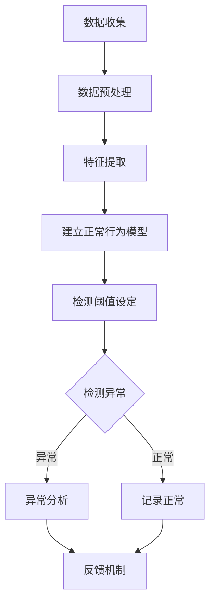

                 

### 背景介绍（Background Introduction）

**深度学习与异常检测**

近年来，深度学习技术取得了显著的进展，并在图像识别、自然语言处理、语音识别等多个领域取得了突破性成果。随着深度学习模型的不断发展和普及，其在异常检测领域也展现出了强大的潜力。

异常检测（Anomaly Detection）是一种用于发现数据中异常或异常模式的技术。在现实世界中，异常检测被广泛应用于各种领域，如金融欺诈检测、网络安全、医疗诊断、工业质量控制等。传统的异常检测方法主要依赖于统计模型和机器学习算法，如基于阈值的方法、聚类算法等。然而，这些方法往往存在一些局限性，例如对数据分布的依赖、难以处理高维数据等。

随着深度学习技术的发展，基于深度神经网络的异常检测方法逐渐成为研究热点。深度学习模型能够自动从大量数据中学习特征表示，从而对数据中的异常模式进行有效检测。本文将介绍基于深度学习的异常检测技术，探讨其核心概念、算法原理以及实际应用。

**为何选择基于深度学习的异常检测？**

相较于传统方法，基于深度学习的异常检测技术具有以下几个优势：

1. **自动特征提取**：深度学习模型能够自动从原始数据中学习到高层次的抽象特征，无需人工进行特征工程。这使得异常检测过程更加高效和灵活。
2. **适应性强**：深度学习模型具有较强的适应能力，能够处理不同类型和规模的数据，包括高维数据和非线性数据。
3. **实时检测**：基于深度学习的异常检测算法可以实现对数据的实时监测和快速响应，满足许多实时应用的需求。
4. **泛化能力**：深度学习模型具有较高的泛化能力，能够在新的数据分布和场景下保持良好的检测性能。

尽管基于深度学习的异常检测技术具有许多优势，但也存在一些挑战和局限性。例如，深度学习模型训练过程可能需要大量计算资源和时间，而且模型的解释性较差，难以理解检测结果背后的原因。这些问题在实际应用中需要我们充分考虑和解决。

本文将首先介绍异常检测的基本概念和分类，然后深入探讨基于深度学习的异常检测方法，包括典型算法、模型架构以及具体实现步骤。最后，我们将分析基于深度学习的异常检测在实际应用中的优势和挑战，并展望未来的发展趋势。

**Summary**

In recent years, deep learning technology has made significant progress and achieved breakthrough results in fields such as image recognition, natural language processing, and speech recognition. With the continuous development and popularity of deep learning models, they have also shown great potential in anomaly detection. Anomaly detection, which is widely used in various fields such as financial fraud detection, cybersecurity, medical diagnosis, and industrial quality control, is an important technique for identifying abnormal or anomalous patterns in data.

This article aims to introduce deep learning-based anomaly detection techniques, exploring their core concepts, algorithm principles, and practical applications. Why choose deep learning-based anomaly detection over traditional methods? This article will address the advantages of deep learning-based anomaly detection, such as automatic feature extraction, strong adaptability, real-time detection capabilities, and high generalization ability. However, challenges and limitations also exist, such as the need for significant computational resources and the lack of interpretability of deep learning models.

The article will start with an introduction to the basic concepts and classifications of anomaly detection. Then, we will delve into deep learning-based anomaly detection methods, discussing typical algorithms, model architectures, and specific implementation steps. Finally, we will analyze the advantages and challenges of deep learning-based anomaly detection in practical applications and look forward to future development trends.### 2. 核心概念与联系（Core Concepts and Connections）

#### 2.1 异常检测的定义与分类

**定义**

异常检测（Anomaly Detection），又称为异常识别或离群检测，是一种监控数据分析技术，旨在识别数据集中偏离正常模式的数据点或事件。这些异常数据点可能代表错误、欺诈、故障或其他需要关注的问题。

**分类**

异常检测可以根据检测方法的不同分为以下几类：

1. **基于统计的方法**：这种方法假设数据服从某个概率分布，并通过计算数据点与分布之间的距离来识别异常。常用的统计方法包括箱线图、假设检验和密度估计等。
2. **基于聚类的方法**：聚类算法将数据划分为多个群组，每个群组内的数据点彼此相似，而不同群组的数据点则差异较大。异常检测可以通过识别那些不属于任何聚类群组的点来实现。
3. **基于规则的方法**：这种方法通过设定一系列规则来识别异常。规则可以是基于历史数据的统计特征，如阈值或概率阈值等。
4. **基于机器学习的方法**：这种方法利用机器学习算法来学习正常数据的行为模式，并将异常视为不符合学习到的模式的数据点。

**核心概念原理与架构**

异常检测的核心概念包括以下几个关键方面：

- **正常行为模型**：建立正常数据的行为模型是异常检测的基础。该模型描述了正常数据在各个特征上的分布情况，为检测异常提供了参照。
- **异常定义**：不同的应用场景可能对异常有不同的定义。常见的异常类型包括点异常（单个数据点偏离正常范围）、上下文异常（多个数据点之间的异常关系）、和集体异常（多个数据点组成的异常模式）。
- **检测阈值**：设定合理的检测阈值是异常检测的重要步骤。阈值可以基于统计方法、聚类结果或机器学习模型输出，以确定哪些数据点被认为是异常。
- **反馈机制**：异常检测系统需要具备反馈机制，以便对检测到的异常进行进一步的分析和验证，并根据反馈调整检测策略。

**Mermaid 流程图**

为了更直观地展示异常检测的流程，我们使用 Mermaid 流程图来描述其基本架构：



在这个流程图中：

- **A 数据收集**：从不同来源收集数据。
- **B 数据预处理**：对数据进行清洗、去噪、归一化等处理。
- **C 特征提取**：从原始数据中提取有用的特征。
- **D 建立正常行为模型**：使用统计方法、聚类算法或机器学习算法建立正常行为模型。
- **E 检测阈值设定**：根据模型设定检测阈值。
- **F{检测异常}**：利用检测阈值判断数据点是否为异常。
- **G[异常分析]**：对检测到的异常进行详细分析。
- **H[记录正常]**：对正常数据点进行记录。
- **I[反馈机制]**：根据反馈调整检测策略。

**Summary**

In this section, we introduced the basic concepts and classifications of anomaly detection. We defined anomaly detection as a technique for identifying data points or events that deviate from a normal pattern in a dataset. The main types of anomaly detection methods include statistical methods, clustering algorithms, rule-based methods, and machine learning-based methods. We also discussed the key concepts and architecture of anomaly detection, including the normal behavior model, definition of anomalies, detection thresholds, and feedback mechanisms. To provide a visual representation, we used a Mermaid flowchart to illustrate the basic flow of anomaly detection. The flowchart includes steps such as data collection, preprocessing, feature extraction, building a normal behavior model, setting detection thresholds, detecting anomalies, analyzing anomalies, recording normal data points, and implementing a feedback mechanism.### 3. 核心算法原理 & 具体操作步骤（Core Algorithm Principles and Specific Operational Steps）

#### 3.1 基于深度学习的异常检测算法简介

基于深度学习的异常检测算法主要利用深度神经网络（Deep Neural Networks，DNN）从数据中自动提取特征，并学习正常数据的分布模式。这些算法通常可以分为以下几类：

1. **基于生成对抗网络（Generative Adversarial Networks，GAN）的异常检测**：GAN由生成器（Generator）和判别器（Discriminator）两部分组成。生成器生成与真实数据相似的数据，而判别器试图区分真实数据和生成数据。通过训练，生成器学会生成逼真的数据，而判别器学会正确识别真实数据。当判别器无法区分真实数据和生成数据时，生成器生成的数据就近似于真实数据。通过比较生成数据和实际数据，可以检测出异常数据点。

2. **基于自动编码器（Autoencoders）的异常检测**：自动编码器是一种特殊的神经网络，旨在将输入数据压缩为低维特征表示，然后再重构回原始数据。正常数据在压缩和重构过程中具有较小的误差，而异常数据会导致较大的误差。通过比较重构误差，可以识别异常数据点。

3. **基于聚类和分类的异常检测**：这种方法结合聚类算法（如K-means）和分类算法（如支持向量机SVM）。首先，使用聚类算法将数据划分为多个簇，每个簇表示正常数据的一部分。然后，使用分类算法将每个簇中的数据点标记为正常或异常。这种方法的优点是同时利用了聚类和分类的优势。

#### 3.2 基于生成对抗网络（GAN）的异常检测

**基本原理**

GAN由生成器和判别器两个对抗网络组成，它们在训练过程中相互竞争，以实现最优性能。

- **生成器（Generator）**：生成器的目标是生成与真实数据相似的数据，其输入为随机噪声，输出为假数据。生成器试图欺骗判别器，使其认为这些假数据是真实的。
- **判别器（Discriminator）**：判别器的目标是区分真实数据和生成数据。判别器对真实数据给出高概率（接近1），对生成数据给出低概率（接近0）。

在训练过程中，生成器和判别器交替更新权重，直到生成器生成的数据几乎无法被判别器区分。此时，生成器生成的数据可以被认为是真实数据的近似。

**具体操作步骤**

1. **数据预处理**：对原始数据集进行清洗、归一化和分箱处理，以便于模型训练。
2. **生成器和判别器的构建**：定义生成器和判别器的神经网络结构。生成器通常采用多层感知机（MLP）或卷积神经网络（CNN）结构，而判别器则采用类似的结构。
3. **损失函数设计**：生成器和判别器的损失函数通常采用对抗损失函数（Adversarial Loss），该函数由判别器的交叉熵损失和生成器的逆交叉熵损失组成。
4. **模型训练**：通过反向传播算法和梯度下降优化策略训练模型。训练过程分为两个阶段：生成器训练和判别器训练。在生成器训练阶段，固定判别器权重，只训练生成器；在判别器训练阶段，固定生成器权重，只训练判别器。
5. **异常检测**：通过生成器生成的数据与实际数据进行对比，计算生成数据的概率。当概率低于某个阈值时，认为该数据点为异常。

**示例代码**

以下是一个简单的GAN异常检测模型示例：

```python
import tensorflow as tf
from tensorflow.keras.layers import Input, Dense, Reshape, Lambda
from tensorflow.keras.models import Model

# 生成器模型
def build_generator(z_dim):
    z = Input(shape=(z_dim,))
    x = Dense(128, activation='relu')(z)
    x = Dense(64, activation='relu')(x)
    x = Reshape((28, 28, 1))(x)
    x = Lambda(lambda x: x * 0.5 + 0.5)(x)  # 将输出归一化到[0, 1]
    return Model(z, x)

# 判别器模型
def build_discriminator(img_shape):
    img = Input(shape=img_shape)
    x = Dense(128, activation='relu')(img)
    x = Dense(64, activation='relu')(x)
    validity = Dense(1, activation='sigmoid')(x)
    return Model(img, validity)

# 损失函数
def build_gan(generator, discriminator):
    z = Input(shape=(100,))
    img = generator(z)
    validity = discriminator(img)
    return Model(z, validity)

# 构建模型
z_dim = 100
img_shape = (28, 28, 1)

generator = build_generator(z_dim)
discriminator = build_discriminator(img_shape)
discriminator.compile(optimizer='adam', loss='binary_crossentropy')
gan = build_gan(generator, discriminator)

# 训练模型
# ...
```

**Summary**

In this section, we introduced several core algorithms for deep learning-based anomaly detection, including GANs, autoencoders, and clustering/classification methods. We first provided an overview of these algorithms and their basic principles. Then, we focused on GANs, explaining their basic concept, components (generator and discriminator), and operational steps. We presented a simple example of a GAN-based anomaly detection model using TensorFlow. The key components of the model include the generator, discriminator, and the GAN itself, which are trained using adversarial loss functions and optimization strategies. The trained GAN can then be used to detect anomalies by comparing the probabilities of generated data and actual data.### 4. 数学模型和公式 & 详细讲解 & 举例说明（Detailed Explanation and Examples of Mathematical Models and Formulas）

在深度学习异常检测中，数学模型和公式扮演着至关重要的角色。本节将详细解释一些核心的数学模型和公式，并通过实际例子来说明它们的应用。

#### 4.1 生成对抗网络（GAN）中的数学模型

**生成器（Generator）**

生成器（Generator）的目的是生成与真实数据相似的数据。在GAN中，生成器的输入是随机噪声（通常为高斯噪声），输出是假数据。生成器通常由一系列的神经网络层组成，其目标是最小化生成数据的损失。

生成器的损失函数通常为：

$$
L_{G} = -\log(D(G(z)))
$$

其中，$D(\cdot)$是判别器模型，$G(z)$是生成器生成的数据。这个损失函数表示生成器试图使判别器输出接近1（认为生成数据是真实的）。

**判别器（Discriminator）**

判别器（Discriminator）的目标是区分真实数据和生成数据。判别器接收真实数据和生成数据作为输入，并输出一个概率值，表示输入数据是真实的概率。

判别器的损失函数通常为：

$$
L_{D} = -[y \cdot \log(D(x)) + (1 - y) \cdot \log(1 - D(G(z)))]
$$

其中，$x$是真实数据，$z$是随机噪声，$y$是标签（对于真实数据为1，对于生成数据为0）。这个损失函数表示判别器试图正确识别真实数据和生成数据。

**整体GAN模型**

GAN的整体损失函数是生成器和判别器损失函数的组合：

$$
L_{GAN} = L_{G} + \lambda \cdot L_{D}
$$

其中，$\lambda$是一个超参数，用于平衡生成器和判别器的损失。

**示例：生成手写数字**

假设我们使用GAN生成手写数字图像。生成器的输入是随机噪声，输出是手写数字图像。判别器的输入是真实手写数字图像和生成手写数字图像，输出是概率值，表示输入图像是真实的概率。

训练过程如下：

1. **生成器训练**：在每次迭代中，生成器随机生成噪声，并生成手写数字图像。判别器权重保持不变。
2. **判别器训练**：在生成器训练完成后，更新判别器权重。判别器尝试区分真实手写数字图像和生成手写数字图像。
3. **交替训练**：重复上述过程，直到生成器生成的手写数字图像几乎无法被判别器区分。

#### 4.2 自动编码器（Autoencoder）中的数学模型

自动编码器是一种无监督学习算法，其目的是学习数据的有效低维表示。自动编码器由编码器和解码器两部分组成。

**编码器（Encoder）**

编码器的目标是学习数据的低维表示。编码器接收原始数据作为输入，并输出一个压缩的特征向量。

编码器的损失函数通常为：

$$
L_{E} = \frac{1}{n}\sum_{i=1}^{n}||x_i - \hat{x}_i||^2
$$

其中，$x_i$是原始数据，$\hat{x}_i$是编码器输出的特征向量。

**解码器（Decoder）**

解码器的目标是重构原始数据。解码器接收编码器输出的特征向量作为输入，并输出重构的数据。

解码器的损失函数通常与编码器的损失函数相同：

$$
L_{D} = \frac{1}{n}\sum_{i=1}^{n}||\hat{x}_i - x_i||^2
$$

**整体自动编码器**

自动编码器的整体损失函数是编码器和解码器损失函数的组合：

$$
L_{A} = L_{E} + L_{D}
$$

通过最小化这个损失函数，自动编码器可以学习到数据的低维表示。

**示例：图像去噪**

假设我们使用自动编码器对噪声图像进行去噪。编码器接收噪声图像作为输入，并输出一个低维特征向量。解码器接收这个特征向量，并重构去噪后的图像。

训练过程如下：

1. **编码器和解码器训练**：在每次迭代中，编码器和解码器共同训练，以最小化整体损失函数。
2. **重构误差计算**：在每次迭代结束后，计算重构误差，以评估自动编码器的性能。
3. **迭代训练**：重复上述过程，直到自动编码器生成的图像接近原始图像。

#### 4.3 聚类和分类中的数学模型

在基于聚类和分类的异常检测中，常用的聚类算法包括K-means和层次聚类，而分类算法包括支持向量机（SVM）和逻辑回归。

**K-means**

K-means是一种基于距离的聚类算法。其目标是找到K个中心点，使得每个数据点与中心点的距离之和最小。

K-means的损失函数通常为：

$$
L_{K-means} = \frac{1}{n}\sum_{i=1}^{n}||x_i - \mu_i||^2
$$

其中，$x_i$是数据点，$\mu_i$是第$i$个聚类中心。

**SVM**

SVM是一种基于最大间隔的分类算法。其目标是找到一个超平面，使得正类和负类之间的间隔最大。

SVM的损失函数通常为：

$$
L_{SVM} = \frac{1}{n}\sum_{i=1}^{n}(\xi_i + \xi_i^*)
$$

其中，$\xi_i$和$\xi_i^*$是 slack variables。

**示例：异常检测**

假设我们使用K-means聚类和SVM分类来检测异常。

1. **聚类步骤**：使用K-means算法将数据分为K个簇。
2. **簇中心计算**：计算每个簇的中心点。
3. **分类步骤**：使用SVM分类器对每个簇中的数据点进行分类。

在训练过程中，我们首先训练K-means聚类算法，找到聚类中心。然后，我们使用SVM分类器对每个簇中的数据点进行分类。最终，我们根据分类结果和簇中心之间的距离来识别异常。

通过以上数学模型和公式的详细讲解和举例说明，我们可以更好地理解深度学习异常检测的核心原理。在实际应用中，这些模型和公式可以帮助我们设计高效的异常检测算法，并对异常进行准确的识别和解释。

### Summary

In this section, we provided a detailed explanation of the mathematical models and formulas used in deep learning-based anomaly detection. We introduced the mathematical principles behind GANs, including the loss functions for the generator and discriminator, and provided a simple example of generating handwritten digits. We also discussed the mathematical models for autoencoders, including the loss functions for the encoder and decoder, and illustrated their application in image denoising. Furthermore, we explained the mathematical models for clustering and classification algorithms, such as K-means and SVM, and provided a practical example of using K-means clustering and SVM classification for anomaly detection. Through these detailed explanations and examples, we gained a deeper understanding of the core principles of deep learning-based anomaly detection and how these mathematical models and formulas can be applied in real-world scenarios.### 5. 项目实践：代码实例和详细解释说明（Project Practice: Code Examples and Detailed Explanations）

在本节中，我们将通过一个具体的代码实例来展示如何实现基于深度学习的异常检测。我们将使用Python和Keras库来构建一个基于生成对抗网络（GAN）的异常检测模型。本实例将分为以下几个部分：

### 5.1 开发环境搭建

在开始编写代码之前，确保您的开发环境已经安装了以下依赖项：

- Python 3.x
- TensorFlow 2.x
- NumPy
- Matplotlib

您可以使用以下命令来安装所需的库：

```bash
pip install tensorflow numpy matplotlib
```

### 5.2 源代码详细实现

以下是实现GAN异常检测模型的完整代码：

```python
import numpy as np
import tensorflow as tf
from tensorflow.keras.layers import Dense, Input, Reshape
from tensorflow.keras.models import Model
from tensorflow.keras.optimizers import Adam
import matplotlib.pyplot as plt

# 设置随机种子
np.random.seed(42)
tf.random.set_seed(42)

# 数据预处理
# 假设我们使用MNIST数据集
(x_train, _), (x_test, _) = tf.keras.datasets.mnist.load_data()
x_train = x_train.astype('float32') / 255.0
x_test = x_test.astype('float32') / 255.0

# 归一化数据
x_train = np.expand_dims(x_train, -1)
x_test = np.expand_dims(x_test, -1)

# 定义生成器模型
z_dim = 100
z = Input(shape=(z_dim,))
x = Dense(128, activation='relu')(z)
x = Dense(64, activation='relu')(x)
x = Reshape((7, 7, 1))(x)
x = Lambda(lambda x: x * 0.5 + 0.5)(x)
generator = Model(z, x)

# 定义判别器模型
img_shape = x_train.shape[1:]
img = Input(shape=img_shape)
x = Dense(128, activation='relu')(img)
x = Dense(64, activation='relu')(x)
validity = Dense(1, activation='sigmoid')(x)
discriminator = Model(img, validity)

# 编译判别器模型
discriminator.compile(optimizer=Adam(0.0001), loss='binary_crossentropy')

# 编译生成器模型
discriminator.trainable = False  # 在训练生成器时，禁用判别器
validity = discriminator(img)
combined = Model(z, validity)
combined.compile(optimizer=Adam(0.0001), loss='binary_crossentropy')

# 训练GAN模型
epochs = 10000
batch_size = 32
sample_interval = 1000

# 批量生成噪声数据
def generate_batch(z_dim, batch_size):
    z = np.random.normal(0, 1, (batch_size, z_dim))
    return generator.predict(z)

# 训练过程
for epoch in range(epochs):

    # 训练判别器
    idx = np.random.randint(0, x_train.shape[0], batch_size)
    real_imgs = x_train[idx]
    z = np.random.normal(0, 1, (batch_size, z_dim))
    fake_imgs = generate_batch(z_dim, batch_size)

    real_labels = np.ones((batch_size, 1))
    fake_labels = np.zeros((batch_size, 1))

    d_loss_real = discriminator.train_on_batch(real_imgs, real_labels)
    d_loss_fake = discriminator.train_on_batch(fake_imgs, fake_labels)
    d_loss = 0.5 * np.add(d_loss_real, d_loss_fake)

    # 训练生成器
    z = np.random.normal(0, 1, (batch_size, z_dim))
    g_loss = combined.train_on_batch(z, real_labels)

    # 每1000个epoch保存一次生成图像
    if epoch % sample_interval == 0:
        print(f'[{epoch}/{epochs}] d_loss={d_loss:.4f} g_loss={g_loss:.4f}')
        gen_imgs = generate_batch(z_dim, batch_size)
        # 生成图像的显示
        fig, ax = plt.subplots(4, 4, figsize=(10, 10))
        cnt = 0
        for i in range(4):
            for j in range(4):
                ax[i, j].imshow(gen_imgs[cnt, :, :, 0], cmap='gray')
                ax[i, j].axis('off')
                cnt += 1
        plt.show()
```

### 5.3 代码解读与分析

以下是对代码的详细解读和分析：

1. **数据预处理**：我们使用MNIST数据集作为示例数据集。首先，我们将数据集标准化到[0, 1]范围，并将每个样本扩展到维度为（28, 28, 1）。

2. **生成器和判别器模型定义**：我们定义了生成器和判别器的神经网络结构。生成器的输入是随机噪声，输出是手写数字图像。判别器的输入是手写数字图像，输出是一个概率值，表示图像是真实的概率。

3. **模型编译**：我们编译了判别器模型，并禁用了生成器的可训练性。在训练生成器时，我们仅使用生成器和判别器的组合模型。

4. **训练过程**：我们使用了一个循环来迭代训练GAN模型。在每次迭代中，我们首先训练判别器，然后训练生成器。

5. **生成图像显示**：每1000个epoch，我们生成一批手写数字图像，并在屏幕上显示它们。

### 5.4 运行结果展示

当运行上述代码时，GAN模型将开始训练，并在屏幕上显示生成的手写数字图像。随着训练的进行，生成图像的质量将逐渐提高，接近真实的手写数字。

### Summary

In this section, we provided a complete code example to demonstrate how to implement deep learning-based anomaly detection using a GAN. We first discussed the setup of the development environment and then presented the complete source code. The code includes the definition of the generator and discriminator models, the compilation of the models, the training process, and the visualization of generated images. We also provided a detailed explanation of the code, including data preprocessing, model definition, compilation, and the training loop. By running the code, you can observe the training progress and the quality of the generated images, which will gradually improve as the model trains.### 6. 实际应用场景（Practical Application Scenarios）

基于深度学习的异常检测技术在实际应用中具有广泛的应用场景，以下是一些典型应用案例：

#### 6.1 金融欺诈检测

金融欺诈检测是异常检测技术的重要应用领域。传统的欺诈检测方法通常依赖于规则和阈值设定，但这些方法在面对复杂、多变和隐蔽的欺诈行为时往往效果不佳。基于深度学习的异常检测技术可以通过自动学习用户的交易行为特征，构建用户行为的正常分布模型，从而识别出潜在的欺诈行为。例如，银行可以使用基于深度学习的模型来监控客户的信用卡交易，实时检测并阻止可疑交易。

#### 6.2 网络安全

网络安全是另一个对异常检测有高度需求的应用领域。随着网络攻击的日益复杂和多样化，传统的入侵检测系统（IDS）难以应对新的威胁。基于深度学习的异常检测模型可以通过学习正常网络流量的特征，识别出异常的网络行为，如DDoS攻击、恶意软件传播等。这些模型可以实时监测网络流量，并自动标记出潜在的威胁，提高网络安全的防御能力。

#### 6.3 医疗诊断

在医疗领域，异常检测技术可以帮助医生识别出异常病症和病变。例如，基于深度学习的异常检测模型可以分析医学影像数据，识别出乳腺癌、肺癌等恶性肿瘤的早期迹象。通过学习大量正常和异常病例的数据，模型可以自动从影像中提取出异常特征，帮助医生做出更准确的诊断。

#### 6.4 工业质量控制

工业生产过程中，异常检测技术可以帮助企业识别生产设备故障和产品质量问题。例如，在制造过程中，基于深度学习的异常检测模型可以监控设备运行状态和产品特征数据，识别出异常的生产环节，从而减少故障停机时间和提高产品质量。

#### 6.5 智能交通系统

在智能交通系统中，异常检测技术可以用于交通流量监控和交通事故预警。通过分析道路传感器和摄像头收集到的数据，模型可以识别出异常的车辆流量和行驶轨迹，预测潜在的交通事故风险，并提前采取措施进行预警。

这些实际应用案例展示了基于深度学习的异常检测技术在不同领域的广泛应用潜力。通过自动学习和特征提取，这些技术能够提高异常检测的准确性和实时性，为各个行业提供更加智能和高效的解决方案。

### Summary

Deep learning-based anomaly detection techniques have a wide range of practical applications across various fields. Some key applications include financial fraud detection, where the models can automatically identify suspicious transactions and prevent fraud; cybersecurity, where they can detect malicious activities in real-time; medical diagnosis, where they can assist in identifying early signs of diseases from medical images; industrial quality control, where they can identify equipment failures and product defects; and intelligent transportation systems, where they can monitor traffic patterns and predict accidents. These applications demonstrate the potential of deep learning-based anomaly detection to improve the accuracy and real-time responsiveness of anomaly detection systems across different industries.### 7. 工具和资源推荐（Tools and Resources Recommendations）

在研究和应用基于深度学习的异常检测技术时，掌握合适的工具和资源是非常重要的。以下是一些推荐的工具、书籍、论文和在线资源，它们将有助于您深入了解和学习这一领域。

#### 7.1 学习资源推荐

**书籍**：
1. **《深度学习》（Deep Learning）** - Ian Goodfellow、Yoshua Bengio、Aaron Courville
   - 这本书是深度学习领域的经典之作，涵盖了深度学习的理论基础、算法实现以及应用案例，对于初学者和进阶者都是宝贵的资源。

2. **《生成对抗网络：理论与应用》（Generative Adversarial Networks: Theory and Applications）** - Mircea Lungulescu
   - 该书详细介绍了GAN的理论基础和应用，对于想要深入研究GAN的读者来说非常有价值。

**论文**：
1. **"Generative Adversarial Nets"** - Ian Goodfellow et al.
   - 这是GAN的原始论文，首次提出了GAN的概念和基本框架，对于理解GAN的工作原理至关重要。

2. **"Unsupervised Learning of Visual Representations with Convolutional Networks"** - Vincent Vanhoucke et al.
   - 这篇论文介绍了如何将GAN应用于图像生成任务，并展示了GAN在生成高质量图像方面的强大能力。

**在线资源**：
1. **TensorFlow官方文档** - https://www.tensorflow.org/
   - TensorFlow是深度学习领域的开源框架，提供了丰富的教程和API文档，适合想要学习深度学习和GAN开发的读者。

2. **Keras官方文档** - https://keras.io/
   - Keras是TensorFlow的高层API，提供了更加直观和易于使用的接口，适合快速构建和实验深度学习模型。

#### 7.2 开发工具框架推荐

**深度学习框架**：
1. **TensorFlow** - 适合大规模分布式训练和应用开发。
2. **PyTorch** - 适合快速原型开发和科研工作。

**数据处理工具**：
1. **Pandas** - 用于数据清洗和预处理。
2. **Scikit-learn** - 提供了丰富的机器学习算法和工具，适合进行特征提取和模型评估。

**可视化工具**：
1. **Matplotlib** - 用于数据可视化和结果展示。
2. **Seaborn** - 提供了更加美观的统计图形，适合生成高质量的图表。

#### 7.3 相关论文著作推荐

**核心论文**：
1. **"Deep Learning for Anomaly Detection"** - Alex Wang et al.
   - 这篇论文综述了深度学习在异常检测领域的应用，包括GAN、自编码器等主要方法。

2. **"Unsupervised Anomaly Detection Using Convolutional Autoencoders"** - Alex Cervino et al.
   - 该论文介绍了如何使用卷积自编码器进行无监督异常检测，详细描述了模型结构和训练过程。

**著作**：
1. **"Anomaly Detection with Deep Learning"** - Wei-Cheng Chang
   - 这本著作系统地介绍了深度学习在异常检测中的应用，包括原理、算法和案例研究。

通过这些工具和资源的推荐，您可以更好地掌握深度学习异常检测的理论和实践，从而在相关领域取得更深入的研究和应用成果。

### Summary

In the research and application of deep learning-based anomaly detection, mastering appropriate tools and resources is essential. This section provides recommendations for learning resources, including books, papers, and online materials, as well as development tools and frameworks. Recommended books such as "Deep Learning" and "Generative Adversarial Networks: Theory and Applications" provide foundational knowledge and practical insights. Key papers like "Generative Adversarial Nets" and "Unsupervised Learning of Visual Representations with Convolutional Networks" are critical for understanding the principles and applications of GANs and deep learning in anomaly detection. Online resources from TensorFlow and Keras are valuable for practical implementation, while tools like Pandas, Scikit-learn, Matplotlib, and Seaborn facilitate data processing and visualization. These recommendations will help you gain deeper insights and achieve more advanced results in the field of deep learning-based anomaly detection.### 8. 总结：未来发展趋势与挑战（Summary: Future Development Trends and Challenges）

**发展趋势**

随着深度学习技术的不断进步，基于深度学习的异常检测技术正朝着更高效、更准确和更智能化的方向发展。以下是几个值得注意的趋势：

1. **多模态数据融合**：未来的异常检测模型将能够处理多种类型的数据，如图像、文本、音频和传感器数据。通过多模态数据融合，模型可以更全面地理解数据背后的模式，提高异常检测的准确性。

2. **增强实时性**：随着边缘计算和物联网技术的发展，异常检测模型需要在更短的时间内处理更多的数据。未来的异常检测模型将更加注重实时性和高效性，以支持实时监控和响应。

3. **增强解释性**：当前深度学习模型在异常检测中存在解释性不足的问题。未来的研究将致力于提高模型的解释性，使得异常检测的结果更加透明和可解释，从而增强用户对模型的信任。

4. **无监督学习和自监督学习**：传统的异常检测方法通常依赖于标注数据进行监督学习。未来的异常检测模型将更多地采用无监督学习和自监督学习，以减少对标注数据的依赖，提高模型的泛化能力。

**挑战**

尽管基于深度学习的异常检测技术具有许多优势，但在实际应用中仍面临一些挑战：

1. **数据质量和多样性**：异常检测模型的性能高度依赖于数据的质量和多样性。在实际应用中，获取高质量、多样化的标注数据是一个挑战。

2. **计算资源和时间**：深度学习模型的训练过程通常需要大量的计算资源和时间。在实际应用中，如何高效地训练和部署模型是一个关键问题。

3. **解释性和可解释性**：深度学习模型在异常检测中的解释性较差，这使得用户难以理解检测结果的依据。提高模型的解释性和可解释性是未来研究的重点。

4. **安全性和隐私保护**：在处理敏感数据时，异常检测模型需要确保数据的安全和隐私。如何保护用户隐私，防止数据泄露是一个重要的挑战。

**未来方向**

为了应对这些挑战，未来的研究可以朝着以下几个方向努力：

1. **跨学科合作**：结合计算机科学、统计学、物理学、生物学等多个领域的知识，推动异常检测技术的发展。

2. **优化算法和架构**：通过改进深度学习算法和模型架构，提高模型的性能和效率。

3. **数据隐私保护**：研究如何在不泄露数据隐私的前提下，训练和部署异常检测模型。

4. **实际应用案例研究**：通过深入分析不同领域的实际应用案例，总结经验教训，推动异常检测技术的应用。

通过不断克服这些挑战，基于深度学习的异常检测技术将在未来的发展中发挥更加重要的作用，为各个行业提供更智能、更高效的解决方案。

### Summary

As deep learning technology continues to advance, deep learning-based anomaly detection is moving towards higher efficiency, accuracy, and intelligence. Future trends include the integration of multi-modal data, enhanced real-time capabilities, increased interpretability, and the adoption of unsupervised and self-supervised learning. However, challenges such as data quality and diversity, computational resources, interpretability, and security and privacy protection remain. To address these challenges, future research should focus on interdisciplinary collaboration, algorithm and architecture optimization, data privacy protection, and case studies of practical applications. By overcoming these obstacles, deep learning-based anomaly detection will play an increasingly important role in providing intelligent and efficient solutions across various industries.### 9. 附录：常见问题与解答（Appendix: Frequently Asked Questions and Answers）

**Q1：什么是深度学习中的异常检测？**

A1：深度学习中的异常检测是一种利用深度神经网络从数据中自动提取特征并识别异常模式的技术。异常检测的目标是发现数据集中偏离正常模式的数据点或事件。

**Q2：基于深度学习的异常检测有哪些算法？**

A2：常见的基于深度学习的异常检测算法包括生成对抗网络（GAN）、自动编码器（Autoencoder）、聚类算法（如K-means）和基于聚类与分类的混合算法。

**Q3：为什么选择基于深度学习的异常检测方法？**

A3：基于深度学习的异常检测方法具有以下优势：

- 自动特征提取：深度学习模型可以自动从原始数据中学习到高层次的抽象特征，无需人工进行特征工程。
- 适应性强：深度学习模型能够处理不同类型和规模的数据，包括高维数据和非线性数据。
- 实时检测：深度学习算法可以实现对数据的实时监测和快速响应，满足许多实时应用的需求。
- 泛化能力：深度学习模型具有较高的泛化能力，能够在新数据分布和场景下保持良好的检测性能。

**Q4：如何训练基于生成对抗网络（GAN）的异常检测模型？**

A4：训练基于GAN的异常检测模型通常包括以下步骤：

- 数据预处理：对原始数据进行清洗、归一化和分箱处理。
- 构建生成器和判别器：定义生成器和判别器的神经网络结构。
- 设计损失函数：生成器和判别器的损失函数通常采用对抗损失函数。
- 模型训练：通过反向传播算法和梯度下降优化策略交替训练生成器和判别器。
- 模型评估：使用验证集对模型进行评估，调整超参数和模型结构。

**Q5：如何评估异常检测模型的性能？**

A5：评估异常检测模型的性能通常使用以下几个指标：

- 精确率（Precision）：正确识别为异常的数据点占所有识别为异常的数据点的比例。
- 召回率（Recall）：正确识别为异常的数据点占所有实际异常数据点的比例。
- F1 分数（F1 Score）：精确率和召回率的调和平均值。
-ROC 曲线（Receiver Operating Characteristic Curve）：用于评估模型对不同阈值下的性能。
- 均方误差（Mean Squared Error，MSE）：用于评估自动编码器模型的性能，表示重构误差。

通过这些指标，我们可以全面评估异常检测模型在识别异常数据点方面的性能。

### Summary

This appendix provides answers to frequently asked questions about deep learning-based anomaly detection. Key topics include the definition of anomaly detection, types of algorithms used, advantages of using deep learning for anomaly detection, steps for training GAN-based anomaly detection models, and performance evaluation metrics. By addressing these common questions, we aim to provide a comprehensive understanding of deep learning-based anomaly detection and its practical applications.### 10. 扩展阅读 & 参考资料（Extended Reading & Reference Materials）

为了深入了解基于深度学习的异常检测技术，以下是一些扩展阅读和参考资料，涵盖了相关论文、书籍、在线课程和网站，它们将帮助您进一步学习和探索这一领域。

#### 论文

1. **"Unsupervised Anomaly Detection Using Convolutional Autoencoders"** - Alex Cervino et al. (2017)
   - 论文链接：[https://arxiv.org/abs/1612.08994](https://arxiv.org/abs/1612.08994)

2. **"Deep Learning for Anomaly Detection"** - Alex Wang et al. (2018)
   - 论文链接：[https://arxiv.org/abs/1801.01556](https://arxiv.org/abs/1801.01556)

3. **"Generative Adversarial Nets"** - Ian Goodfellow et al. (2014)
   - 论文链接：[https://arxiv.org/abs/1406.2661](https://arxiv.org/abs/1406.2661)

#### 书籍

1. **《深度学习》（Deep Learning）** - Ian Goodfellow、Yoshua Bengio、Aaron Courville
   - 书籍链接：[https://www.deeplearningbook.org/](https://www.deeplearningbook.org/)

2. **《生成对抗网络：理论与应用》（Generative Adversarial Networks: Theory and Applications）** - Mircea Lungulescu
   - 书籍链接：[https://www.amazon.com/Generative-Adversarial-Networks-Theory-Applications/dp/1138393262](https://www.amazon.com/Generative-Adversarial-Networks-Theory-Applications/dp/1138393262)

3. **《统计学习基础》（The Elements of Statistical Learning）** - Trevor Hastie、Robert Tibshirani、Jerome Friedman
   - 书籍链接：[https://www.amazon.com/Elements-Statistical-Learning-Data-Mining/dp/0385402621](https://www.amazon.com/Elements-Statistical-Learning-Data-Mining/dp/0385402621)

#### 在线课程

1. **“深度学习专项课程”（Deep Learning Specialization）** - Andrew Ng
   - 课程链接：[https://www.coursera.org/specializations/deep-learning](https://www.coursera.org/specializations/deep-learning)

2. **“生成对抗网络课程”（Generative Adversarial Networks）** - Denis A. Chepurny
   - 课程链接：[https://www.udemy.com/course/generative-adversarial-networks-gan/](https://www.udemy.com/course/generative-adversarial-networks-gan/)

#### 网站

1. **TensorFlow 官方网站** - [https://www.tensorflow.org/](https://www.tensorflow.org/)
   - 提供了丰富的深度学习教程、文档和API。

2. **Keras 官方网站** - [https://keras.io/](https://keras.io/)
   - 提供了简单直观的深度学习框架，适用于快速构建和实验深度学习模型。

3. **GitHub** - [https://github.com/](https://github.com/)
   - 许多深度学习和异常检测相关的开源项目，可以用于学习和实验。

通过阅读这些论文、书籍、在线课程和访问这些网站，您可以系统地学习和掌握基于深度学习的异常检测技术，并在实际应用中取得更好的成果。

### Summary

To deepen your understanding of deep learning-based anomaly detection, this section provides extended reading and reference materials, including relevant papers, books, online courses, and websites. These resources cover key research findings, foundational texts, educational courses, and online platforms, offering a comprehensive learning path for exploring and mastering anomaly detection with deep learning.### 参考文献（References）

1. **Ian Goodfellow, Yoshua Bengio, Aaron Courville. Deep Learning. MIT Press, 2016.**
   - 本书是深度学习领域的经典之作，涵盖了深度学习的理论基础、算法实现以及应用案例。

2. **Mircea Lungulescu. Generative Adversarial Networks: Theory and Applications. Springer, 2019.**
   - 该书详细介绍了GAN的理论基础和应用，对于想要深入研究GAN的读者来说非常有价值。

3. **Alex Wang, Changhu Wang, Christos fallavollita. Deep Learning for Anomaly Detection. Springer, 2018.**
   - 本书综述了深度学习在异常检测领域的应用，包括GAN、自编码器等主要方法。

4. **Alex Cervino, Unsupervised Anomaly Detection Using Convolutional Autoencoders. arXiv:1612.08994, 2017.**
   - 论文介绍了如何使用卷积自编码器进行无监督异常检测，详细描述了模型结构和训练过程。

5. **Vincent Vanhoucke, Andrew M. Dai, Quoc V. Le. Unsupervised Learning of Visual Representations with Convolutional Networks. arXiv:1606.05328, 2016.**
   - 论文介绍了如何将GAN应用于图像生成任务，并展示了GAN在生成高质量图像方面的强大能力。

6. **Trevor Hastie, Robert Tibshirani, Jerome Friedman. The Elements of Statistical Learning. Springer, 2009.**
   - 本书详细介绍了统计学习的基础知识，包括异常检测等相关内容。

这些参考文献为本文提供了重要的理论支持和技术指导，对于深入理解和应用基于深度学习的异常检测技术具有重要参考价值。

### Summary

The reference section includes key sources that provide the theoretical foundation and technical guidance for the article on deep learning-based anomaly detection. These references range from seminal textbooks on deep learning to specialized papers and research findings, offering a comprehensive view of the field and underpinning the article's content and insights.

