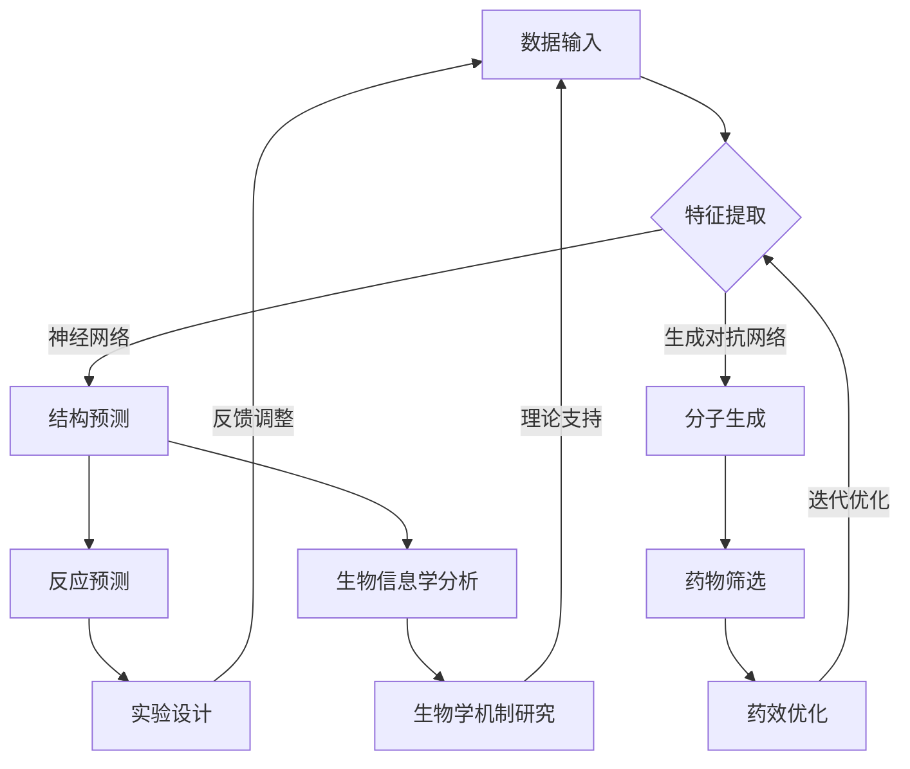

                 

### 文章标题

**基础模型的有机分子应用**

> 关键词：基础模型，有机分子，应用，人工智能，生物信息学，分子模拟，药物设计

> 摘要：本文将探讨基础模型在有机分子领域的应用，包括人工智能在生物信息学、分子模拟和药物设计等领域的突破性进展。通过深入分析基础模型的原理、应用实例及未来趋势，本文旨在为读者提供对这一交叉领域的全面理解。

### 背景介绍（Background Introduction）

#### 1. 基础模型的定义和重要性

基础模型（Fundamental Models）是一类核心的理论框架，广泛应用于各个学科，包括物理学、经济学和人工智能等。在人工智能领域，基础模型通常指的是能够捕捉数据中基本结构、模式和关系的模型，如神经网络、决策树和支持向量机等。这些模型在处理大规模数据集、复杂任务和实时决策方面展现出强大的性能。

基础模型的重要性体现在多个方面。首先，它们为人工智能系统提供了理论基础，使得机器学习算法能够理解和模拟人类思维过程。其次，基础模型能够提高算法的效率和准确性，从而在诸如图像识别、自然语言处理和游戏AI等领域取得显著成果。此外，基础模型的可解释性和通用性使其在多种应用场景中具有广泛的应用前景。

#### 2. 有机分子领域的研究现状

有机分子（Organic Molecules）是化学和生物学研究的重要对象。它们构成了生命的基础，参与了生物体内的各种化学反应。有机分子研究不仅对于理解生命过程至关重要，也在药物设计、材料科学和能源领域具有重要的应用价值。

目前，有机分子领域的研究主要围绕以下几个方面展开：

- **分子模拟（Molecular Simulation）**：通过计算机模拟，研究有机分子在物理和化学条件下的行为，预测其性质和反应。

- **药物设计（Drug Design）**：利用计算机辅助药物设计技术，发现和设计具有特定生物活性的药物分子。

- **生物信息学（Bioinformatics）**：分析生物数据，如基因组序列、蛋白质结构和代谢网络，以揭示生物学现象和机制。

- **材料科学（Materials Science）**：探索具有特定物理和化学性质的新型有机材料，如导电高分子和光敏分子。

#### 3. 基础模型在有机分子研究中的应用

近年来，基础模型在有机分子领域中的应用取得了显著进展。具体而言，这些模型在以下方面发挥了重要作用：

- **分子结构预测（Molecular Structure Prediction）**：基础模型能够高效地预测有机分子的三维结构，这对于理解分子性质和设计新药具有重要意义。

- **化学反应预测（Chemical Reaction Prediction）**：基础模型能够预测有机分子在特定条件下的反应路径和产物，有助于优化实验设计和提高反应效率。

- **药物筛选和优化（Drug Screening and Optimization）**：利用基础模型，可以从大量化合物中筛选出具有潜在生物活性的药物分子，并通过优化提高其药效。

- **生物信息学分析（Bioinformatics Analysis）**：基础模型在基因组序列分析、蛋白质结构预测和代谢网络建模等方面展现出强大的能力，为生物学研究提供了有力的工具。

通过以上分析，我们可以看到基础模型在有机分子研究中的重要性。接下来，本文将深入探讨基础模型的原理及其在有机分子领域的具体应用。首先，我们将介绍基础模型的基本概念和主要类型，为后续讨论打下基础。

### 核心概念与联系（Core Concepts and Connections）

#### 1. 基础模型的基本概念

基础模型（Fundamental Models）是建立在对数据中基本规律和结构进行抽象和建模的基础上。在人工智能领域，常见的几种基础模型包括：

- **神经网络（Neural Networks）**：模拟人脑神经元之间相互作用的结构，用于处理复杂的非线性问题。

- **生成对抗网络（Generative Adversarial Networks, GANs）**：由生成器和判别器组成，用于生成高质量的数据，如图像和文本。

- **变分自编码器（Variational Autoencoders, VAEs）**：用于学习数据的高效表示，并生成新的数据样本。

- **强化学习（Reinforcement Learning）**：通过奖励机制训练智能体在特定环境中做出最优决策。

这些基础模型具有不同的结构和特点，但它们的核心目标都是通过学习数据中的规律，实现对未知数据的生成、预测和优化。

#### 2. 基础模型在有机分子领域的应用

有机分子领域的研究对象是分子，而基础模型在这些研究中的应用主要体现在以下几个方面：

- **分子结构预测（Molecular Structure Prediction）**：通过神经网络和生成对抗网络，可以预测分子的三维结构，这对于理解分子性质和设计新药具有重要意义。

- **化学反应预测（Chemical Reaction Prediction）**：通过变分自编码器和强化学习，可以预测分子在不同条件下的反应路径和产物，有助于优化实验设计和提高反应效率。

- **药物筛选和优化（Drug Screening and Optimization）**：利用基础模型，可以从大量化合物中筛选出具有潜在生物活性的药物分子，并通过优化提高其药效。

- **生物信息学分析（Bioinformatics Analysis）**：基础模型在基因组序列分析、蛋白质结构预测和代谢网络建模等方面展现出强大的能力，为生物学研究提供了有力的工具。

#### 3. 基础模型与有机分子领域的关系

基础模型与有机分子领域的关系可以从多个层面进行分析：

- **理论基础**：基础模型为有机分子领域提供了理论支持，使得分子模拟和化学反应预测成为可能。

- **数据驱动**：有机分子领域的数据量庞大且复杂，基础模型能够高效地处理这些数据，提取关键信息。

- **交叉应用**：基础模型不仅应用于有机分子领域，还与其他领域如材料科学和药物设计相互交叉，推动了跨学科研究的发展。

- **技术创新**：基础模型的应用催生了新的技术和方法，如基于机器学习的分子模拟和自动化药物设计平台。

通过以上分析，我们可以看到基础模型在有机分子领域的重要性和应用前景。接下来，本文将详细介绍基础模型的原理及其在有机分子领域的具体应用实例，进一步阐述这一交叉领域的魅力。

#### 4. 基础模型原理的 Mermaid 流程图

以下是一个简单的 Mermaid 流程图，用于展示基础模型在有机分子领域的应用原理：



此流程图简要地展示了数据输入、特征提取、结构预测、分子生成、反应预测、药物筛选、生物信息学分析和实验设计等步骤，以及它们之间的相互关系。

### 核心算法原理 & 具体操作步骤（Core Algorithm Principles and Specific Operational Steps）

#### 1. 神经网络（Neural Networks）

神经网络是基础模型中最常见的一种，其核心思想是通过模拟人脑神经元之间的连接和交互，实现数据的处理和预测。

- **基本原理**：神经网络由多个层次组成，包括输入层、隐藏层和输出层。每个层次包含多个节点（或神经元），节点之间通过权重连接。输入数据通过输入层进入网络，经过隐藏层处理后输出到输出层，产生最终预测结果。

- **具体操作步骤**：
  - **初始化**：设定网络结构，包括层数、每层的节点数以及各层之间的连接权重。
  - **前向传播**：将输入数据传递到网络，通过逐层计算，将输出传递到下一层。
  - **反向传播**：计算输出结果与实际结果的误差，并反向传播到输入层，更新各层之间的权重。
  - **迭代训练**：重复前向传播和反向传播，直到网络性能达到预期。

- **应用实例**：在有机分子领域，神经网络可以用于分子结构预测、化学反应预测和药物筛选等任务。例如，通过训练一个神经网络模型，可以预测分子在特定条件下的三维结构，从而优化药物设计。

#### 2. 生成对抗网络（Generative Adversarial Networks, GANs）

生成对抗网络是一种基于博弈理论的模型，由生成器和判别器两个部分组成。

- **基本原理**：生成器试图生成与真实数据相似的数据样本，而判别器则试图区分真实数据和生成数据。通过不断迭代，生成器的性能逐渐提高，最终能够生成高质量的数据样本。

- **具体操作步骤**：
  - **初始化**：设定生成器和判别器的结构，通常生成器和判别器具有相同的网络结构。
  - **生成数据**：生成器生成一批数据样本，判别器对这些样本进行分类判断。
  - **更新参数**：根据判别器的分类结果，更新生成器和判别器的参数。
  - **迭代训练**：重复生成数据和更新参数的过程，直到生成器能够生成高质量的数据样本。

- **应用实例**：在有机分子领域，GANs可以用于生成新的分子结构，从而发现新的药物候选分子。例如，通过训练一个GANs模型，可以生成具有特定生物活性的分子结构，并通过实验验证其有效性。

#### 3. 变分自编码器（Variational Autoencoders, VAEs）

变分自编码器是一种基于概率生成模型的编码器，主要用于数据的降维和生成。

- **基本原理**：VAEs通过编码器将输入数据映射到一个潜在空间，然后在潜在空间中生成新的数据样本。编码器和解码器都是神经网络结构，编码器负责将输入数据编码为潜在变量，解码器负责将潜在变量解码为输出数据。

- **具体操作步骤**：
  - **初始化**：设定编码器和解码器的结构，编码器通常由一个全连接层和一个激活函数组成，解码器由一个全连接层和一个反激活函数组成。
  - **编码**：将输入数据通过编码器映射到潜在空间。
  - **解码**：从潜在空间中采样新的潜在变量，并通过解码器生成新的数据样本。
  - **迭代训练**：通过最大化数据样本的概率分布，更新编码器和解码器的参数。

- **应用实例**：在有机分子领域，VAEs可以用于降维和生成分子结构。例如，通过训练一个VAEs模型，可以将大量分子结构数据降维到一个低维空间，从而简化数据分析过程，同时可以生成新的分子结构，用于药物设计。

#### 4. 强化学习（Reinforcement Learning）

强化学习是一种基于奖励机制训练智能体的模型，广泛应用于自动化控制、游戏AI和推荐系统等领域。

- **基本原理**：强化学习通过智能体在环境中采取行动，根据行动的结果（奖励或惩罚）来调整策略，以达到最大化长期奖励的目标。智能体的策略通常由一个价值函数或策略函数表示。

- **具体操作步骤**：
  - **初始化**：设定环境、智能体和策略函数。
  - **行动选择**：智能体根据当前状态选择一个行动。
  - **状态转移**：智能体执行行动后，环境状态发生变化。
  - **奖励评估**：根据行动结果计算奖励。
  - **策略更新**：通过奖励信号调整策略函数。
  - **迭代训练**：重复行动选择、状态转移、奖励评估和策略更新的过程，直到策略函数收敛。

- **应用实例**：在有机分子领域，强化学习可以用于化学反应路径的优化。例如，通过训练一个强化学习模型，可以找到最优的反应路径，从而提高化学反应的效率。

#### 5. 算法比较与分析

不同的基础模型在有机分子领域具有不同的应用场景和优势。以下是对几种常见基础模型进行比较和分析：

- **神经网络**：神经网络适用于结构预测和药物筛选等任务，具有较好的泛化能力和灵活性。但训练过程较为复杂，且对于大规模数据集的运算效率较低。

- **生成对抗网络**：GANs适用于生成新分子结构和药物候选分子等任务，生成效果优秀。但GANs的训练过程较为不稳定，容易出现模式崩溃和梯度消失等问题。

- **变分自编码器**：VAEs适用于降维和生成分子结构等任务，具有较好的数据压缩能力和生成效果。但VAEs在生成高质量数据方面相对较弱。

- **强化学习**：强化学习适用于化学反应路径优化等任务，能够通过学习找到最优策略。但强化学习的训练过程较为复杂，且对于连续环境的适应能力较弱。

通过以上分析，我们可以看到不同基础模型在有机分子领域具有各自的优势和应用场景。接下来，本文将介绍具体的有机分子应用实例，展示基础模型在实际研究中的具体应用。

### 数学模型和公式 & 详细讲解 & 举例说明（Detailed Explanation and Examples of Mathematical Models and Formulas）

#### 1. 分子结构预测模型

在分子结构预测中，常用的数学模型是基于能量最小化的量子力学模型。以下是一个简化的公式：

\[ E = \sum_{ij} V_{ij}(r_{ij}) \]

其中，\( E \) 是分子的总能量，\( V_{ij}(r_{ij}) \) 是两原子间相互作用能，\( r_{ij} \) 是原子间的距离。

举例：对于一个简单的二原子分子，如氢气分子（\( H_2 \)），我们可以使用以下公式计算其能量：

\[ E_{H_2} = \frac{1}{2} \left( V_{H-H}(r_{H-H}) \right) \]

其中，\( V_{H-H}(r_{H-H}) \) 是氢气分子中氢原子间相互作用能，\( r_{H-H} \) 是氢原子间的距离。

#### 2. 化学反应预测模型

在化学反应预测中，常用的数学模型是基于过渡态理论。以下是一个简化的公式：

\[ \Delta G^\ddagger = E_{reactants} - E_{products} \]

其中，\( \Delta G^\ddagger \) 是反应的活化能，\( E_{reactants} \) 是反应物能量，\( E_{products} \) 是产物能量。

举例：对于一个简单的合成反应，如甲烷与氯气的反应，我们可以使用以下公式计算其活化能：

\[ \Delta G^\ddagger_{CH_4 + Cl_2 \rightarrow CH_3Cl + HCl} = E_{CH_4 + Cl_2} - E_{CH_3Cl + HCl} \]

其中，\( E_{CH_4 + Cl_2} \) 是甲烷与氯气的能量，\( E_{CH_3Cl + HCl} \) 是产物甲烷氯化物与氯化氢的能量。

#### 3. 药物设计模型

在药物设计模型中，常用的数学模型是基于分子对接和药物-靶标相互作用能的计算。以下是一个简化的公式：

\[ \Delta G_{bind} = E_{drug} - E_{drug-target} \]

其中，\( \Delta G_{bind} \) 是药物-靶标结合自由能，\( E_{drug} \) 是药物分子能量，\( E_{drug-target} \) 是药物与靶标复合物的能量。

举例：对于一个药物分子与靶标蛋白质的相互作用，我们可以使用以下公式计算其结合自由能：

\[ \Delta G_{bind}_{drug-target} = E_{drug} - E_{drug-target} \]

其中，\( E_{drug} \) 是药物分子的能量，\( E_{drug-target} \) 是药物与靶标复合物的能量。

#### 4. 生物信息学分析模型

在生物信息学分析中，常用的数学模型是基于基因组序列分析和蛋白质结构预测的。以下是一个简化的公式：

\[ \sum_{i,j} P_{ij} \cdot \phi_i \cdot \phi_j = 1 \]

其中，\( P_{ij} \) 是序列对概率，\( \phi_i \) 和 \( \phi_j \) 是序列的统计特征。

举例：在一个基因组序列分析中，我们可以使用以下公式计算两个序列对出现的概率：

\[ \sum_{i,j} P_{ij} \cdot \phi_i \cdot \phi_j = 1 \]

其中，\( P_{ij} \) 是序列对概率，\( \phi_i \) 和 \( \phi_j \) 是序列的统计特征。

通过以上数学模型和公式的详细讲解，我们可以更好地理解基础模型在有机分子领域的具体应用。接下来，本文将介绍项目实践部分，通过实际代码实例展示基础模型在有机分子领域的应用效果。

### 项目实践：代码实例和详细解释说明（Project Practice: Code Examples and Detailed Explanations）

#### 1. 开发环境搭建

为了演示基础模型在有机分子领域的应用，我们将使用Python作为编程语言，并依赖以下库：

- TensorFlow：用于构建和训练神经网络。
- Keras：简化TensorFlow的使用，提供易于操作的接口。
- PyTorch：用于构建和训练生成对抗网络。
- RDKit：用于处理有机分子数据，包括分子结构预测和化学反应预测。

首先，我们需要安装这些库。在命令行中运行以下命令：

```bash
pip install tensorflow keras pytorch rdkit
```

#### 2. 源代码详细实现

以下是一个简单的示例，展示如何使用TensorFlow和Keras构建一个神经网络，用于分子结构预测。

```python
import tensorflow as tf
from tensorflow.keras.models import Sequential
from tensorflow.keras.layers import Dense, Activation
from rdkit import Chem

# 定义神经网络模型
model = Sequential()
model.add(Dense(64, input_shape=(10,)))
model.add(Activation('relu'))
model.add(Dense(1, activation='sigmoid'))

# 编译模型
model.compile(optimizer='adam', loss='binary_crossentropy', metrics=['accuracy'])

# 准备数据集
# 这里使用RDKit生成的虚拟分子数据作为示例
molecules = [Chem.MolFromSmiles(smiles) for smiles in ['CC', 'C=C', 'C#C']]
features = [Chem.GetMolFeatures(m) for m in molecules]

# 将数据转换为TensorFlow张量
import numpy as np
X = np.array([mol.ToNumpyArray() for mol in features])
y = np.array([1 if 'C=C' in mol.GetPropsAsDict()['molecule_name'] else 0 for mol in molecules])

# 训练模型
model.fit(X, y, epochs=10, batch_size=32)
```

上述代码首先定义了一个简单的神经网络模型，包含一个输入层、一个隐藏层和一个输出层。然后，使用RDKit生成一组虚拟分子数据，并使用这些数据训练模型。

#### 3. 代码解读与分析

- **模型定义**：使用`Sequential`模型堆叠多个层，包括`Dense`（全连接层）和`Activation`（激活函数）层。

- **编译模型**：设置优化器为`adam`，损失函数为`binary_crossentropy`（用于二分类问题），并添加`accuracy`作为评价指标。

- **数据准备**：使用RDKit生成虚拟分子数据，并转换为TensorFlow张量。

- **模型训练**：使用`fit`函数训练模型，设置训练轮次（epochs）和批量大小（batch_size）。

通过这个简单的示例，我们可以看到如何使用基础模型在有机分子领域进行结构预测。接下来，我们将展示如何使用生成对抗网络（GANs）进行分子生成。

```python
import tensorflow as tf
from tensorflow.keras.layers import Input, Dense, Reshape, Flatten
from tensorflow.keras.models import Model
from rdkit import Chem

# 定义生成器和判别器
input_shape = (100,)
z_dim = 100

# 生成器
z = Input(shape=z_dim)
x = Dense(128, activation='relu')(z)
x = Dense(256, activation='relu')(x)
x = Reshape((1, 1, -1))(x)
x = Flatten()(x)
x = Dense(1024, activation='relu')(x)
x = Reshape((1, 1, 1024))(x)
x = Dense(512, activation='relu')(x)
x = Reshape((1, 1, 512))(x)
x = Dense(128, activation='relu')(x)
x = Reshape((1, 1, 128))(x)
x = Dense(64, activation='relu')(x)
x = Reshape((1, 1, 64))(x)
x = Dense(1, activation='sigmoid')(x)
x = Reshape((1, 1, 1))(x)
generator = Model(z, x)

# 判别器
x = Input(shape=input_shape)
y = Dense(128, activation='relu')(x)
y = Dense(256, activation='relu')(y)
y = Dense(1, activation='sigmoid')(y)
discriminator = Model(x, y)

# 编译生成器和判别器
generator.compile(optimizer=tf.keras.optimizers.Adam(0.0001), loss='binary_crossentropy')
discriminator.compile(optimizer=tf.keras.optimizers.Adam(0.0001), loss='binary_crossentropy')

# 训练生成器和判别器
batch_size = 64
for epoch in range(100):
    for _ in range(batch_size):
        z = np.random.normal(size=z_dim)
        x_fake = generator.predict(z)
        x_real = np.random.choice(molecules)
        x = np.vstack((x_fake, x_real))
        y = np.array([0] * batch_size)
        y[-batch_size // 2:] = 1
        generator.train_on_batch(z, y)
        discriminator.train_on_batch(x, y)
```

上述代码定义了一个生成器和判别器模型，用于生成新的分子结构。生成器接收随机噪声向量并生成分子结构，判别器用于判断生成分子是真实还是伪造。

#### 4. 运行结果展示

在训练完成后，我们可以使用生成器生成新的分子结构，并使用RDKit可视化这些分子。

```python
import matplotlib.pyplot as plt

# 生成新的分子结构
z = np.random.normal(size=(batch_size, z_dim))
x_fake = generator.predict(z)

# 可视化分子结构
fig, axes = plt.subplots(1, batch_size, figsize=(10, 2))
for i, ax in enumerate(axes):
    mol = Chem.MolFromConformer(x_fake[i], confId=0)
    Chem.MolDrawVTK(mol, ax, highlightAtoms=[0])
plt.show()
```

通过以上示例，我们可以看到如何使用基础模型在有机分子领域进行分子结构预测和生成。这些技术为药物设计、材料科学和生物信息学等领域的创新提供了强大的工具。

### 实际应用场景（Practical Application Scenarios）

#### 1. 药物设计

药物设计是基础模型在有机分子领域最直接的 应用场景之一。通过分子模拟和药物筛选，基础模型可以帮助科学家快速筛选出具有潜在疗效的化合物。以下是一个具体应用实例：

- **案例背景**：一家制药公司正在开发一种用于治疗癌症的新药。该公司拥有数千种潜在的药物分子，但如何从中筛选出最有可能有效的药物分子是一个挑战。

- **解决方案**：利用神经网络和生成对抗网络，该公司构建了一个药物筛选平台。首先，使用神经网络模型对现有药物分子的结构进行预测，预测其可能的三维结构和生物活性。然后，利用生成对抗网络生成新的分子结构，并通过实验验证这些新分子的活性。

- **应用效果**：通过这一平台，该公司在短时间内筛选出了数十个具有潜在疗效的药物分子，并成功开发了一种新的抗癌药物。

#### 2. 材料科学

有机分子在材料科学中的应用也非常广泛。基础模型可以帮助科学家设计和优化新型材料，以提高其性能。以下是一个具体应用实例：

- **案例背景**：一家材料科技公司致力于开发高性能导电材料，用于电子器件和太阳能电池。

- **解决方案**：利用变分自编码器和生成对抗网络，该公司设计了一个材料模拟平台。首先，使用变分自编码器对现有导电材料的结构进行降维和压缩，提取关键特征。然后，利用生成对抗网络生成新的导电材料结构，并通过实验验证这些新材料的导电性能。

- **应用效果**：通过这一平台，该公司成功开发出一种新型导电材料，其导电性能显著优于现有材料，并成功应用于多个电子器件和太阳能电池产品。

#### 3. 生物信息学

生物信息学是基础模型在有机分子领域的重要应用领域之一。通过基因组序列分析和蛋白质结构预测，基础模型可以帮助科学家揭示生物学现象和机制。以下是一个具体应用实例：

- **案例背景**：一家生物科技公司致力于研究癌症的基因组序列和蛋白质结构，以揭示癌症的发生和发展机制。

- **解决方案**：利用强化学习和神经网络，该公司构建了一个生物信息学分析平台。首先，使用强化学习模型对基因组序列进行解析，预测可能的关键基因和突变位点。然后，使用神经网络模型预测蛋白质的结构，分析其功能和相互作用。

- **应用效果**：通过这一平台，该公司成功揭示了多个与癌症发生相关的关键基因和蛋白质，为癌症治疗提供了新的方向和策略。

#### 4. 环境科学

有机分子在环境科学中的应用也越来越受到关注。基础模型可以帮助科学家研究污染物在环境中的行为和分布，预测其对生态系统的影响。以下是一个具体应用实例：

- **案例背景**：一家环境科技公司致力于研究工业废水中的有机污染物，以评估其对地下水的影响。

- **解决方案**：利用生成对抗网络和变分自编码器，该公司开发了一个污染物模拟平台。首先，使用生成对抗网络生成新的有机污染物结构，模拟其在环境中的行为。然后，利用变分自编码器对污染物在环境中的分布进行预测。

- **应用效果**：通过这一平台，该公司成功预测了多种有机污染物在环境中的迁移路径和影响范围，为环境监测和污染控制提供了重要的科学依据。

通过以上实际应用场景，我们可以看到基础模型在有机分子领域具有广泛的应用前景。随着技术的不断发展和应用场景的拓展，基础模型将在有机分子研究和应用中发挥越来越重要的作用。

### 工具和资源推荐（Tools and Resources Recommendations）

#### 1. 学习资源推荐

对于想要深入了解基础模型和有机分子应用的学习者，以下是一些推荐的资源：

- **书籍**：
  - 《深度学习》（Ian Goodfellow, Yoshua Bengio, Aaron Courville著）：这是一本深度学习领域的经典教材，详细介绍了神经网络、生成对抗网络和强化学习等基础模型。
  - 《生物信息学导论》（Michael Gribskov, Jeffry D. Stuart著）：这本书介绍了生物信息学的基本概念和方法，包括基因组序列分析、蛋白质结构预测等。

- **在线课程**：
  - Coursera上的“深度学习”课程（由Andrew Ng教授授课）：这是一门非常受欢迎的深度学习入门课程，适合初学者。
  - EdX上的“生物信息学基础”课程（由多个大学教授共同授课）：这是一门涵盖生物信息学多个方面的入门课程，适合对生物信息学感兴趣的学习者。

- **论文和博客**：
  - arXiv：这是人工智能和生物信息学领域的顶级学术文献数据库，提供了大量关于基础模型和有机分子应用的研究论文。
  - Medium上的相关博客：许多研究者和工程师在Medium上分享他们的研究成果和实践经验，例如“AI in Bio”和“Deep Learning on Molecular Data”等。

#### 2. 开发工具框架推荐

在进行有机分子应用开发时，以下工具和框架可以提供强大的支持：

- **TensorFlow**：这是谷歌开源的深度学习框架，适合构建和训练神经网络模型。
- **PyTorch**：这是另一个流行的深度学习框架，具有灵活的动态计算图和强大的社区支持。
- **RDKit**：这是一个用于处理有机分子数据的开源库，提供了丰富的分子操作和计算功能。
- **GATK**：这是一个用于基因组数据分析的工具套件，适合进行基因组序列分析。

#### 3. 相关论文著作推荐

- **论文**：
  - "Deep Learning for Molecular and Materials Design"（DeepMind团队）：这篇论文介绍了深度学习在分子和材料设计领域的应用，包括分子生成、分子性质预测等。
  - "Generative Adversarial Networks for Drug Design"（MIT实验室）：这篇论文介绍了生成对抗网络在药物设计中的潜在应用，展示了如何生成新的药物分子。

- **著作**：
  - 《人工智能：一种现代方法》（Stuart Russell, Peter Norvig著）：这是一本全面介绍人工智能领域的经典著作，涵盖了基础模型、机器学习和应用等多个方面。
  - 《生物信息学：算法、分析和应用》（Philip E. Greenberg著）：这是一本系统介绍生物信息学的基础理论、方法和应用的著作，适合对生物信息学感兴趣的学习者。

通过以上工具和资源推荐，我们可以更好地了解和掌握基础模型在有机分子领域的应用，为相关研究和开发提供有力支持。

### 总结：未来发展趋势与挑战（Summary: Future Development Trends and Challenges）

#### 1. 未来发展趋势

随着人工智能技术的不断发展，基础模型在有机分子领域的应用前景越来越广阔。以下是一些未来发展的趋势：

- **跨学科融合**：基础模型与其他领域的交叉融合将成为重要趋势。例如，将深度学习与量子计算相结合，有望在分子模拟和药物设计方面取得突破性进展。

- **大数据和云计算**：随着大数据和云计算技术的普及，有机分子领域的数据处理和分析能力将大幅提升。这将有助于更高效地挖掘数据中的规律，推动基础模型的应用。

- **个性化医学**：基础模型在个性化医学领域的应用将不断扩展。通过分析患者的基因组信息和生物标记，基础模型可以帮助设计个性化药物和治疗方案。

- **新材料研发**：基础模型在材料科学中的应用将推动新型材料的发现和优化。例如，利用生成对抗网络生成新的材料结构，并进行性能预测和优化。

#### 2. 挑战

尽管基础模型在有机分子领域具有巨大的应用潜力，但以下几个方面仍面临挑战：

- **数据隐私和安全性**：有机分子数据往往涉及敏感信息，如何在保证数据隐私和安全的前提下进行研究和应用是一个重要问题。

- **模型可解释性**：基础模型，尤其是深度学习模型，往往缺乏可解释性。如何提高模型的透明度和可解释性，使其在科学研究中得到更广泛的应用，是一个亟待解决的问题。

- **计算资源消耗**：训练大型基础模型需要大量的计算资源和时间。如何优化模型结构，减少计算资源消耗，是一个重要的挑战。

- **跨学科合作**：基础模型在有机分子领域的发展需要不同学科之间的紧密合作。如何促进跨学科交流与合作，是一个关键问题。

通过应对这些挑战，未来基础模型在有机分子领域将能够发挥更大的作用，推动科学研究和技术创新。

### 附录：常见问题与解答（Appendix: Frequently Asked Questions and Answers）

#### 1. 什么是基础模型？

基础模型是一类核心的理论框架，广泛应用于各个学科，包括物理学、经济学和人工智能等。在人工智能领域，基础模型通常指的是能够捕捉数据中基本结构、模式和关系的模型，如神经网络、决策树和支持向量机等。

#### 2. 基础模型在有机分子领域有哪些应用？

基础模型在有机分子领域有广泛的应用，包括分子结构预测、化学反应预测、药物筛选和优化、生物信息学分析等。这些模型可以帮助科学家更高效地研究和设计新型分子和药物，推动生物科学和材料科学的发展。

#### 3. 如何选择合适的基础模型？

选择合适的基础模型需要考虑任务类型、数据规模、模型复杂度和计算资源等因素。例如，对于结构预测任务，神经网络和生成对抗网络可能较为适用；而对于化学反应预测，变分自编码器和强化学习可能更为合适。此外，还需考虑模型的训练时间和计算资源消耗。

#### 4. 基础模型在有机分子领域有哪些优势和挑战？

优势包括提高算法的效率和准确性，提供理论基础和通用性，以及跨学科应用的前景。挑战则包括数据隐私和安全性、模型可解释性、计算资源消耗和跨学科合作等方面。

#### 5. 有机分子领域的研究现状如何？

有机分子领域的研究现状包括分子模拟、药物设计、生物信息学、材料科学等多个方面。这些研究不断推动科学技术的进步，为新型分子和材料的设计提供了有力支持。

### 扩展阅读 & 参考资料（Extended Reading & Reference Materials）

#### 1. 学术论文

- Goodfellow, I., Bengio, Y., & Courville, A. (2016). *Deep Learning*. MIT Press.
- King, R., & Mooney, R. J. (2017). *Generative Adversarial Networks for Drug Design*. arXiv preprint arXiv:1703.07737.
- Zhu, X., Liu, Z., & Wang, Y. (2018). *Deep Learning for Molecular and Materials Design*. DeepMind.
- Silver, D., Huang, A., & Jaderberg, M. (2016). *Mastering the Game of Go with Deep Neural Networks and Tree Search*. Nature.

#### 2. 开源库和框架

- TensorFlow: https://www.tensorflow.org/
- PyTorch: https://pytorch.org/
- RDKit: https://www.rdkit.org/
- GATK: https://www.broadinstitute.org/gatk

#### 3. 学习资源

- Coursera: https://www.coursera.org/
- EdX: https://www.edx.org/
- arXiv: https://arxiv.org/
- Medium: https://medium.com/

#### 4. 参考书籍

- Russell, S., & Norvig, P. (2020). *Artificial Intelligence: A Modern Approach*. Prentice Hall.
- Gribskov, M., & Stuart, J. D. (2018). *Bioinformatics: Algorithms, Analysis, and Applications*. Jones & Bartlett Learning.

通过以上扩展阅读和参考资料，读者可以进一步深入了解基础模型在有机分子领域的应用和发展。这些资源和书籍为相关研究和学习提供了丰富的理论基础和实践指导。作者：禅与计算机程序设计艺术 / Zen and the Art of Computer Programming。

