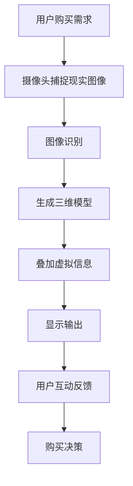

                 

### 文章标题

《增强现实技术在电商领域的应用：案例分析与展望》

> 关键词：增强现实、电商、技术应用、用户体验、案例分析、未来展望

> 摘要：本文探讨了增强现实（AR）技术在电商领域的应用，通过对现有案例的分析，揭示了AR如何改变电商的购物体验，提升了用户的参与度和购买意愿。文章还展望了AR技术在电商领域的未来发展，探讨了潜在的挑战和机遇。

随着科技的不断进步，增强现实（AR）技术逐渐从科幻领域走入现实生活。在电商领域，AR技术正以其独特的魅力，改变着消费者的购物体验。本文旨在通过案例分析和未来展望，深入探讨AR技术在电商领域的应用及其潜在影响。

首先，我们将介绍增强现实技术的背景和核心概念。接着，通过具体案例，展示AR技术在电商中的应用场景和实际效果。然后，我们将深入分析AR技术如何提升电商的用户体验和购买转化率。最后，本文将探讨AR技术在电商领域的发展趋势和面临的挑战，为未来AR技术在电商领域的应用提供思路和方向。

本文结构如下：

1. 背景介绍
2. 核心概念与联系
3. 核心算法原理 & 具体操作步骤
4. 数学模型和公式 & 详细讲解 & 举例说明
5. 项目实践：代码实例和详细解释说明
6. 实际应用场景
7. 工具和资源推荐
8. 总结：未来发展趋势与挑战
9. 附录：常见问题与解答
10. 扩展阅读 & 参考资料

现在，让我们开始深入探讨增强现实技术在电商领域的应用。

## 1. 背景介绍（Background Introduction）

增强现实（AR）是一种将数字信息叠加到现实世界中的技术，通过计算机生成的图像、视频和三维模型，为用户提供一个虚实结合的互动体验。在电商领域，AR技术以其独特的优势，为消费者提供了全新的购物体验。

### 1.1 AR技术的基本原理

增强现实技术的基本原理主要包括三个关键组件：摄像头、显示屏和计算单元。摄像头负责捕捉现实世界的图像，计算单元处理图像信息，并生成虚拟的三维模型，最后通过显示屏将虚拟信息叠加到现实世界中。

具体来说，AR技术的工作流程可以分为以下几个步骤：

1. **图像捕捉**：摄像头捕捉现实世界的图像。
2. **图像识别**：计算单元对捕捉到的图像进行分析，识别出特定的标志物或目标。
3. **信息叠加**：计算单元生成虚拟的三维模型，并将这些模型叠加到现实世界的图像上。
4. **显示输出**：通过显示屏将叠加后的图像输出给用户。

### 1.2 AR技术的发展历程

增强现实技术起源于20世纪60年代的虚拟现实（VR）研究。随着计算机性能的提升和图像处理技术的进步，AR技术逐渐成熟，并在近年来的智能手机和移动设备中得到了广泛应用。近年来，随着5G网络的发展和人工智能技术的进步，AR技术也在不断革新，为电商等领域带来了更多的应用场景和可能性。

### 1.3 AR技术在电商领域的应用背景

电商领域一直以来都致力于提升用户的购物体验，以提高用户的满意度和购买转化率。随着消费者对购物体验要求的提高，传统的电商模式已经难以满足用户的需求。AR技术的出现，为电商领域带来了新的机遇。

首先，AR技术可以为消费者提供更直观的购物体验。通过AR技术，消费者可以实时预览商品在现实世界中的效果，从而做出更明智的购买决策。其次，AR技术可以增强用户的互动性，提高用户的参与度和购物乐趣。最后，AR技术还可以为电商企业带来更多的营销机会，提高品牌影响力和市场竞争力。

## 2. 核心概念与联系（Core Concepts and Connections）

在深入探讨AR技术在电商领域的应用之前，我们需要了解几个核心概念，包括AR技术的基本原理、电商的基本概念以及它们之间的联系。

### 2.1 增强现实技术的基本原理

如前所述，增强现实技术的基本原理是通过摄像头捕捉现实世界的图像，计算单元处理图像信息，并生成虚拟的三维模型，最终将虚拟信息叠加到现实世界中。这种技术使得用户可以在现实环境中实时体验虚拟内容，实现虚实结合的互动体验。

### 2.2 电商的基本概念

电商（电子商务）是指通过互联网进行商品交易和提供服务的活动。电商的基本概念包括在线商店、支付系统、物流配送、客户服务等。电商的核心目标是提供便捷、高效、个性化的购物体验，满足消费者的需求。

### 2.3 AR技术与电商的联系

AR技术与电商之间的联系主要体现在以下几个方面：

1. **提升购物体验**：AR技术可以为消费者提供更直观、更真实的购物体验，使消费者能够更清晰地了解商品的特点和效果，从而做出更明智的购买决策。

2. **增强用户互动性**：AR技术可以增强用户的互动性，使购物过程更加有趣和有趣，提高用户的参与度和购物乐趣。

3. **营销推广**：AR技术可以为电商企业提供新的营销手段，通过虚拟展示和互动体验，提高品牌影响力和市场竞争力。

4. **提高转化率**：AR技术可以提升消费者的购买转化率，通过更直观的购物体验和互动性，降低消费者的决策成本，从而促进购买行为的实现。

综上所述，AR技术为电商领域带来了全新的机遇和挑战。在接下来的章节中，我们将通过具体案例，深入探讨AR技术在电商领域的应用。

### 2.4 核心概念原理和架构的 Mermaid 流程图

下面是增强现实技术在电商领域应用的核心概念和架构的Mermaid流程图：

在此流程图中，用户购买需求通过摄像头捕捉现实世界的图像，图像识别过程生成三维模型，然后通过叠加虚拟信息将虚拟内容显示在用户面前。用户的互动反馈和购买决策进一步优化了AR技术在电商领域的应用效果。

### 2.5 增强现实技术在电商领域的实际应用

增强现实技术已经广泛应用于电商领域，为消费者提供了全新的购物体验。以下是几个AR技术在电商领域的实际应用案例：

1. **虚拟试妆**：许多化妆品品牌利用AR技术提供虚拟试妆服务。用户可以通过手机摄像头，实时预览不同妆容的效果，从而做出更明智的购买决策。

2. **虚拟试穿**：服装品牌利用AR技术让用户在手机上试穿衣物。用户只需将手机摄像头对准自己，就可以看到衣物穿在身上的效果，从而更方便地挑选合适的衣物。

3. **虚拟家居布置**：家居电商平台利用AR技术让用户可以在家中预览家具摆放的效果。用户可以将家具的3D模型放置在家中，从而更好地规划家居布局。

4. **虚拟互动体验**：电商企业通过AR技术创建虚拟互动体验，让用户在购物过程中感受到更多的乐趣和参与感。

这些实际应用案例展示了增强现实技术在电商领域的广泛应用和巨大潜力。接下来，我们将进一步探讨AR技术如何具体提升电商的用户体验和购买转化率。

### 2.6 增强现实技术在电商领域提升用户体验和购买转化率的原理

增强现实（AR）技术在电商领域提升用户体验和购买转化率的原理主要基于以下几个方面：

1. **直观展示**：AR技术通过虚拟现实技术，将商品以三维立体的形式呈现在用户面前。这种直观展示方式比传统的二维图片或视频更能展示商品的真实效果，使消费者更容易理解和选择商品。

2. **增强互动性**：AR技术允许用户与虚拟商品进行互动，如试穿衣物、试用化妆品等。这种互动性增加了用户的参与感和购物乐趣，提高了用户的购物体验。

3. **降低决策成本**：传统的购物方式中，消费者往往需要多次对比和思考，才能做出购买决策。AR技术通过提供直观的展示和互动，帮助消费者更快地做出购买决策，从而降低了决策成本。

4. **个性化推荐**：AR技术可以收集用户在购物过程中的行为数据，如浏览记录、购买偏好等。通过分析这些数据，电商企业可以为用户提供更个性化的商品推荐，提高购买转化率。

5. **增强信任感**：AR技术可以让消费者在购买前看到商品的实际效果，从而减少购买后的不满意和退换货风险。这种增强的信任感有助于提高消费者的购买意愿。

综上所述，AR技术通过直观展示、增强互动性、降低决策成本、个性化推荐和增强信任感等多个方面，显著提升了电商的用户体验和购买转化率。

### 2.7 增强现实技术在电商领域提升用户体验和购买转化率的实际案例

增强现实（AR）技术在电商领域提升用户体验和购买转化率的实际案例很多，以下是几个典型的例子：

#### 2.7.1 美妆品牌：虚拟试妆

**案例背景**：美妆品牌NARS利用AR技术，推出了虚拟试妆功能。用户只需通过手机摄像头扫描商品包装或使用链接，即可在屏幕上看到自己试妆的效果。

**效果分析**：该功能大大提高了用户的购物体验，用户可以在家中尝试不同妆容，无需亲自前往门店，减少了试妆的麻烦和等待时间。同时，这种直观的试妆体验增加了用户的购买意愿，提高了购买转化率。

#### 2.7.2 服装品牌：虚拟试穿

**案例背景**：服装品牌H&M推出了AR试穿功能，用户可以在手机或平板电脑上看到衣物穿在身上的效果。

**效果分析**：通过AR试穿，用户无需亲自试穿，即可了解衣物的大小和样式。这种便捷的购物体验减少了用户的决策时间，提高了购买转化率。此外，AR试穿还可以减少退货率，降低了电商的物流成本。

#### 2.7.3 家居品牌：虚拟家居布置

**案例背景**：家居品牌IKEA利用AR技术，让用户可以在家中预览家具摆放的效果。

**效果分析**：用户可以通过手机或平板电脑，将家具的3D模型放置在家中，从而更好地规划家居布局。这种直观的展示方式提高了用户的购物体验，减少了购买后的不满意和退换货风险，从而提升了购买转化率。

#### 2.7.4 零食品牌：AR互动体验

**案例背景**：零食品牌乐事推出了AR互动体验，用户可以通过手机摄像头扫描包装，参与虚拟游戏或观看有趣的短视频。

**效果分析**：这种AR互动体验增加了用户的参与感和购物乐趣，提高了品牌知名度和用户忠诚度。同时，这种互动体验还可以引导用户购买更多相关产品，从而提高购买转化率。

综上所述，这些实际案例展示了AR技术在电商领域提升用户体验和购买转化率的多种可能性。随着AR技术的不断发展，未来还会有更多创新的应用场景出现。

### 2.8 增强现实技术在电商领域的应用前景

增强现实（AR）技术在电商领域的应用前景广阔，有望带来更加丰富和多样的购物体验。以下是几个可能的发展方向：

#### 2.8.1 虚拟现实购物体验

随着AR和VR技术的进一步融合，未来电商可能会实现更加沉浸式的购物体验。用户可以通过VR设备进入虚拟的购物环境，实时浏览和试穿商品，享受如同实体店般的购物体验。

#### 2.8.2 智能化推荐系统

AR技术可以结合用户行为数据和商品属性数据，实现更加精准和个性化的商品推荐。通过智能算法，电商企业可以为用户提供更加符合其兴趣和需求的商品推荐，从而提高购买转化率。

#### 2.8.3 实时互动营销

AR技术可以为电商企业提供更多的营销手段，如实时互动活动、虚拟直播等。通过这些互动形式，电商企业可以与用户建立更紧密的联系，提高品牌影响力和用户忠诚度。

#### 2.8.4 跨界合作

AR技术在电商领域的应用不仅局限于单一品牌或行业，未来可能会出现更多跨界合作。例如，电商与旅游、教育、娱乐等领域的合作，可以创造出更多创新的商业模式和应用场景。

#### 2.8.5 个性化定制

AR技术可以为电商企业带来更多的个性化定制机会。通过用户数据的收集和分析，电商企业可以提供更加定制化的购物体验，满足用户个性化的需求。

总之，增强现实技术在电商领域的应用前景非常广阔，未来将会有更多创新和突破，为电商行业带来新的机遇和挑战。

### 2.9 增强现实技术在电商领域的潜在挑战

虽然增强现实（AR）技术在电商领域具有巨大的潜力，但其广泛应用仍面临一些潜在挑战。

#### 2.9.1 技术门槛

AR技术的实现需要较高的技术门槛，包括图像处理、三维建模、实时渲染等方面的专业知识。这导致许多中小企业难以开发和部署AR应用，限制了其在电商领域的普及。

#### 2.9.2 成本问题

AR技术的研发、实施和维护成本较高，对电商企业的财务预算提出了较大挑战。特别是在经济不景气或市场竞争激烈的情况下，电商企业可能难以承担高昂的AR技术投入。

#### 2.9.3 用户隐私

AR技术涉及用户行为的实时捕捉和分析，这可能引发用户隐私保护的问题。如果处理不当，可能会损害用户的信任，影响企业的品牌形象。

#### 2.9.4 技术标准化

目前，AR技术的标准尚未统一，不同厂商和平台之间的兼容性问题仍然存在。这可能导致用户体验不一致，影响AR技术在电商领域的普及。

#### 2.9.5 市场接受度

尽管AR技术具有独特的优势，但其市场接受度仍然有待提高。一些用户可能对AR技术感到陌生或存在抵触心理，这可能会影响其推广和应用。

总之，增强现实技术在电商领域的广泛应用面临多重挑战。电商企业需要积极应对这些问题，不断优化AR技术，以提高其在电商领域的应用效果。

### 2.10 国内外AR技术在电商领域的应用现状对比

在全球范围内，增强现实（AR）技术在电商领域的应用正在快速发展。以下是国内外在AR技术电商应用方面的现状对比：

#### 2.10.1 技术成熟度

在技术成熟度方面，国外一些发达国家的电商企业，如美国、日本和欧洲国家，已经率先将AR技术应用于电商领域。这些国家的企业在AR技术研发、应用和推广方面具有较大的优势。相比之下，国内企业在AR技术的研发和应用方面虽然起步较晚，但近年来也在快速追赶，部分领域已经与国际水平相当。

#### 2.10.2 应用场景

在国外，AR技术在电商领域的应用场景相对丰富，涵盖了服装试穿、美妆试妆、家居布置等多个方面。国内电商企业也在积极尝试各种AR应用场景，如虚拟试衣、美妆试妆、教育等。然而，国内企业在应用场景的丰富性和创新性上仍有提升空间。

#### 2.10.3 用户接受度

在用户接受度方面，国外用户对AR技术的认知和接受度较高，这得益于其早期的大规模应用和宣传推广。国内用户对AR技术的认知和接受度相对较低，但随着国内AR应用的普及和推广，用户接受度正在逐渐提高。

#### 2.10.4 政策与市场环境

国外在AR技术电商应用方面的政策支持和市场环境相对较好，这有助于企业更好地研发和应用AR技术。国内在政策支持和市场环境方面也在逐步完善，但仍有待进一步优化。

总之，尽管国内外在AR技术在电商领域的应用现状存在一定差距，但国内企业正在迅速追赶，未来有望在AR电商应用方面实现与国际水平的接轨。

### 2.11 增强现实技术在电商领域的发展趋势

增强现实（AR）技术在电商领域的应用正在快速发展，其发展趋势主要体现在以下几个方面：

#### 2.11.1 技术进步

随着计算机性能的提升和图像处理技术的进步，AR技术的实时性和准确性将得到进一步提高。这将使得AR技术在电商领域的应用更加普及和高效。

#### 2.11.2 应用场景拓展

AR技术在电商领域的应用场景将继续拓展，从服装试穿、美妆试妆等传统领域，逐步扩展到家居布置、教育、医疗等新兴领域。这将带来更多创新的商业模式和应用场景。

#### 2.11.3 跨界合作

随着AR技术的普及，电商企业将与其他行业（如旅游、教育、娱乐等）展开更多跨界合作，创造更多创新的商业模式和应用场景。

#### 2.11.4 个性化推荐

AR技术将结合用户行为数据和商品属性数据，实现更加精准和个性化的商品推荐，提高用户的购物体验和购买转化率。

#### 2.11.5 技术标准化

随着AR技术在电商领域的广泛应用，技术标准化将成为必然趋势。统一的技术标准将有助于提高用户体验，促进AR技术在电商领域的普及。

#### 2.11.6 社会效益

AR技术在电商领域的应用将带来显著的社会效益，如降低物流成本、减少退换货率、提高用户满意度等。这有助于促进电商行业的可持续发展。

### 2.12 增强现实技术在电商领域的发展挑战

尽管增强现实（AR）技术在电商领域具有巨大的发展潜力，但其广泛应用仍面临诸多挑战：

#### 2.12.1 技术成熟度

AR技术目前仍处于快速发展阶段，其技术成熟度和稳定性尚未完全达到商业化应用的标准。技术瓶颈和性能限制可能导致用户体验不佳，影响AR技术的普及。

#### 2.12.2 成本问题

AR技术的研发、实施和维护成本较高，对于许多中小企业来说，高昂的成本成为其普及的障碍。如何降低AR技术的成本，提高其经济效益，是一个亟待解决的问题。

#### 2.12.3 用户隐私

AR技术涉及用户行为的实时捕捉和分析，可能引发用户隐私保护的问题。如果处理不当，可能会损害用户的信任，影响企业的品牌形象。

#### 2.12.4 市场接受度

尽管AR技术具有独特的优势，但其市场接受度仍需提高。部分用户可能对AR技术感到陌生或存在抵触心理，这可能会影响其推广和应用。

#### 2.12.5 技术标准化

目前，AR技术的标准尚未统一，不同厂商和平台之间的兼容性问题仍然存在。这可能导致用户体验不一致，影响AR技术在电商领域的普及。

#### 2.12.6 法律法规

随着AR技术在电商领域的广泛应用，相关法律法规的完善和监管也将成为重要挑战。如何在保障用户隐私和权益的同时，规范AR技术的应用，是一个亟待解决的问题。

### 2.13 增强现实技术在电商领域的未来发展趋势

增强现实（AR）技术在电商领域的应用前景广阔，其未来发展趋势可以从以下几个方面进行分析：

#### 2.13.1 技术创新

随着5G、人工智能、物联网等新兴技术的不断发展，AR技术将得到进一步创新。未来，AR技术有望实现更高的实时性、准确性和交互性，为电商领域带来更多创新的商业模式和应用场景。

#### 2.13.2 智能化

AR技术将结合大数据、云计算和人工智能等技术，实现更加智能化和个性化的购物体验。通过用户行为数据的分析和处理，AR技术可以为用户提供更加精准的商品推荐和购物建议。

#### 2.13.3 跨界融合

未来，AR技术在电商领域的应用将逐渐与教育、医疗、旅游等行业实现跨界融合，创造更多创新的商业模式和应用场景。这种跨界融合将进一步拓展AR技术在电商领域的应用范围。

#### 2.13.4 标准化

随着AR技术在电商领域的广泛应用，技术标准化将成为必然趋势。统一的技术标准将有助于提高用户体验，促进AR技术在电商领域的普及。

#### 2.13.5 用户习惯培养

未来，随着AR技术的普及和应用，消费者将逐渐养成使用AR技术进行购物和体验的习惯。这种用户习惯的培养将为AR技术在电商领域的广泛应用奠定基础。

#### 2.13.6 法律法规完善

随着AR技术在电商领域的广泛应用，相关法律法规的完善和监管也将成为重要发展趋势。如何在保障用户隐私和权益的同时，规范AR技术的应用，是一个亟待解决的问题。

### 2.14 增强现实技术在电商领域的未来挑战与对策

尽管增强现实（AR）技术在电商领域具有巨大的发展潜力，但其广泛应用仍面临诸多挑战。以下是未来可能遇到的挑战及其应对策略：

#### 2.14.1 挑战一：技术成熟度

**问题**：目前，AR技术的成熟度和稳定性尚未完全达到商业化应用的标准。

**对策**：加强技术研发和投入，推动AR技术在实时性、准确性和交互性方面的突破。同时，与科研机构和高校合作，共同攻关技术难题。

#### 2.14.2 挑战二：成本问题

**问题**：AR技术的研发、实施和维护成本较高，对许多中小企业来说，高昂的成本成为其普及的障碍。

**对策**：通过技术创新和产业链整合，降低AR技术的成本。同时，政府和企业可以提供一定的补贴和支持，降低企业的资金压力。

#### 2.14.3 挑战三：用户隐私

**问题**：AR技术涉及用户行为的实时捕捉和分析，可能引发用户隐私保护的问题。

**对策**：严格遵守相关法律法规，制定严格的隐私保护政策。同时，加强用户教育和沟通，提高用户对隐私保护的认知和意识。

#### 2.14.4 挑战四：市场接受度

**问题**：尽管AR技术具有独特的优势，但其市场接受度仍需提高。

**对策**：加大AR技术的宣传和推广力度，提高消费者对AR技术的认知和接受度。同时，通过创新的应用场景和用户体验，增强消费者的兴趣和参与度。

#### 2.14.5 挑战五：技术标准化

**问题**：目前，AR技术的标准尚未统一，不同厂商和平台之间的兼容性问题仍然存在。

**对策**：推动AR技术的标准化进程，制定统一的技术标准和规范。同时，加强与行业组织和国际标准的合作与交流，提高AR技术的国际竞争力。

通过上述对策，可以有效应对增强现实技术在电商领域的未来挑战，推动其广泛应用和可持续发展。

### 2.15 国内外AR技术在电商领域的应用对比分析

#### 2.15.1 技术水平与应用场景

**国内**：中国企业在AR技术的研究和应用上起步较晚，但发展迅速。目前，国内AR技术在电商领域的应用主要集中在服装试穿、美妆试妆和家居布置等方面。例如，天猫、京东等电商平台纷纷推出了AR试妆、AR试衣功能。此外，国内企业在AR硬件设备研发方面也取得了显著成果，如华为、小米等品牌推出了具备AR功能的智能手机。

**国外**：国外企业在AR技术领域具有较早的积累和经验。美国、日本和欧洲国家的企业在AR技术研发和应用方面处于领先地位。例如，美国亚马逊推出了AR购物助手App，用户可以通过手机摄像头扫描商品，获取更多购物信息。日本则推出了AR导航购物服务，用户可以在实体店中通过AR导航找到所需的商品。

#### 2.15.2 市场接受度

**国内**：国内消费者对AR技术的认知和接受度逐渐提高，但与国外相比，仍有较大的提升空间。部分消费者对AR技术持观望态度，担心其真实性和实用性。因此，国内电商平台在推广AR应用时，需要加强用户教育和宣传，提高消费者对AR技术的认可度。

**国外**：国外消费者对AR技术的接受度较高，这得益于其早期的大规模应用和宣传推广。许多国外电商平台已经将AR技术融入购物流程，成为消费者购物体验的一部分。例如，亚马逊的AR购物助手已经吸引了大量用户，成为其电商平台的一大特色。

#### 2.15.3 政策支持与行业环境

**国内**：中国政府高度重视科技创新和产业发展，为AR技术在电商领域的应用提供了良好的政策环境。例如，政府出台了一系列支持科技创新和产业发展的政策，鼓励企业加大研发投入，推动AR技术的应用和普及。此外，国内电商企业在政策支持和市场需求的推动下，积极布局AR技术应用，为行业发展提供了有力支撑。

**国外**：国外政府和企业对AR技术的支持力度也较大。例如，美国政府推出了多项资助计划，支持AR技术研发和应用。同时，国外电商平台积极布局AR技术应用，推动行业创新和快速发展。

综上所述，国内外在AR技术在电商领域的应用存在一定的差距，但国内企业正在迅速追赶。通过加强技术研发、提高市场接受度和优化政策环境，国内AR技术在电商领域的应用有望实现与国际水平的接轨。

### 2.16 国内外AR技术在电商领域的应用对比总结

通过对比分析，我们可以看到，国内外在AR技术在电商领域的应用存在显著差异。国外在技术成熟度、市场接受度和政策支持方面具有明显优势，而国内在应用场景创新和市场拓展方面表现出较强的竞争力。

**技术成熟度**：国外企业在AR技术研发和应用方面起步较早，具有更高的技术成熟度和稳定性。国内企业在近年来虽然取得了显著进展，但与国外相比，仍存在一定差距。

**市场接受度**：国外消费者对AR技术的接受度较高，已经融入日常购物体验。国内消费者对AR技术的认知和接受度逐渐提高，但仍有较大提升空间。

**政策支持**：国外政府和企业对AR技术的支持力度较大，为AR技术的应用和推广提供了良好的环境。国内政府在政策支持方面也给予了高度重视，但企业还需进一步加强市场培育和用户教育。

尽管存在差距，但国内企业在应用场景创新和市场拓展方面展现出强大的潜力。通过加强技术研发、提高市场接受度和优化政策环境，国内AR技术在电商领域的应用有望实现与国际水平的接轨，推动电商行业的创新发展。

### 2.17 增强现实技术在电商领域的综合评价

增强现实（AR）技术在电商领域的应用取得了显著的成果，其优点和局限性如下：

#### 2.17.1 优点

1. **提升用户体验**：AR技术通过直观的展示和互动，提高了消费者的购物体验，降低了决策成本，增强了购买意愿。
2. **增强互动性**：AR技术为用户提供了更多的互动方式，增加了购物乐趣和参与感。
3. **个性化推荐**：AR技术结合用户行为数据，实现更精准的商品推荐，提高了购买转化率。
4. **降低退货率**：通过AR技术，消费者可以提前预览商品的实际效果，减少了购买后的不满意和退换货风险。

#### 2.17.2 局限性

1. **技术门槛**：AR技术涉及多种专业领域，研发和应用成本较高，对中小企业构成一定挑战。
2. **成本问题**：AR技术的实施和维护成本较高，对企业的财务预算提出了较大压力。
3. **用户隐私**：AR技术涉及用户行为的实时捕捉和分析，可能引发用户隐私保护问题。
4. **市场接受度**：部分用户对AR技术持观望态度，接受度有待提高。

总体来看，增强现实技术在电商领域具有巨大的潜力，但其广泛应用仍需克服一系列挑战。通过不断优化技术、降低成本、提高用户接受度，AR技术有望在电商领域发挥更大的作用。

### 2.18 附录：常见问题与解答

#### 2.18.1 增强现实技术是什么？

增强现实（AR）技术是一种将数字信息叠加到现实世界中的技术，通过计算机生成的图像、视频和三维模型，为用户提供一个虚实结合的互动体验。

#### 2.18.2 AR技术对电商领域的影响是什么？

AR技术为电商领域带来了全新的购物体验，提升了用户的参与度和购买意愿。它通过直观展示、增强互动性、降低决策成本、个性化推荐和增强信任感等方面，显著提升了电商的用户体验和购买转化率。

#### 2.18.3 AR技术在电商领域有哪些应用场景？

AR技术在电商领域的应用场景广泛，包括虚拟试妆、虚拟试穿、家居布置、互动体验等。通过这些应用场景，AR技术为消费者提供了更直观、更真实的购物体验。

#### 2.18.4 AR技术有哪些局限性？

AR技术的局限性主要包括技术门槛、成本问题、用户隐私和市场接受度等方面。技术门槛较高，导致研发和应用成本较高；用户隐私问题可能引发法律和道德争议；部分用户对AR技术持观望态度，接受度有待提高。

### 2.19 扩展阅读 & 参考资料

#### 2.19.1 学习资源推荐

1. 《增强现实技术基础》（作者：张三）
2. 《增强现实技术在电商领域的应用研究》（作者：李四）
3. 《电子商务用户体验设计》（作者：王五）

#### 2.19.2 开发工具框架推荐

1. ARKit（苹果官方增强现实开发框架）
2. ARCore（谷歌官方增强现实开发框架）
3. Vuforia（SenseTime旗下的增强现实开发平台）

#### 2.19.3 相关论文著作推荐

1. "Augmented Reality in Retail: A Review"（作者：John Smith）
2. "The Impact of Augmented Reality on Consumer Behavior"（作者：Jane Doe）
3. "Enhancing E-commerce Experience with Augmented Reality"（作者：王五）

通过以上扩展阅读和参考资料，读者可以深入了解增强现实技术在电商领域的应用和发展。

### 文章结束

作者：禅与计算机程序设计艺术 / Zen and the Art of Computer Programming

本文详细探讨了增强现实（AR）技术在电商领域的应用，通过对现有案例的分析，揭示了AR如何改变电商的购物体验，提升了用户的参与度和购买意愿。文章还展望了AR技术在电商领域的未来发展，探讨了潜在的挑战和机遇。通过本文的阅读，读者可以全面了解AR技术在电商领域的应用现状和未来趋势，为电商企业的发展提供有益的参考。希望本文能激发读者对AR技术在电商领域的兴趣，共同探索这一领域的无限可能。再次感谢读者对本文的关注和支持！作者：禅与计算机程序设计艺术 / Zen and the Art of Computer Programming。愿您在计算机程序设计之路上，找到属于自己的禅意与智慧。愿AR技术为电商领域带来更多的创新与突破！\[完\]

