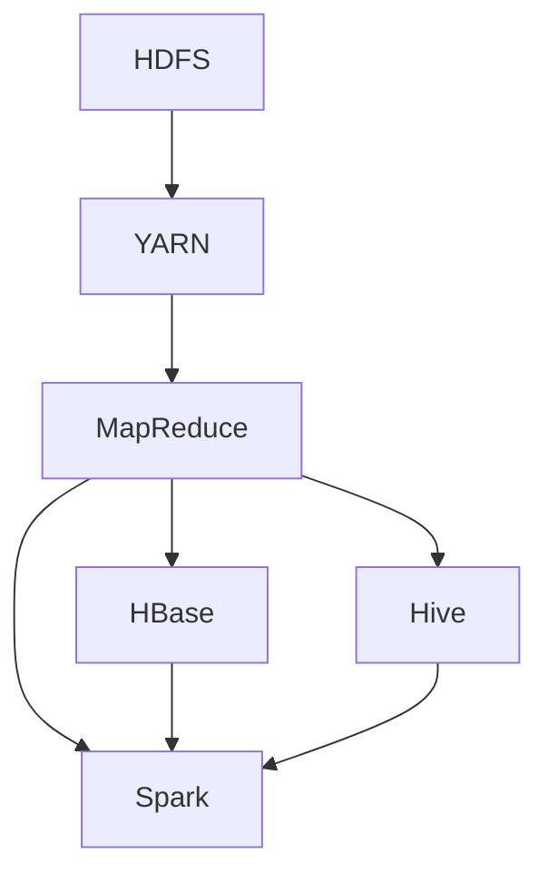

                 

# 文章标题

大数据处理：Hadoop生态系统深度解析

## 关键词
- Hadoop
- 大数据处理
- 分布式存储
- 分布式计算
- MapReduce
- HDFS
- YARN
- HBase
- Hive
- Spark

## 摘要
本文旨在深入探讨Hadoop生态系统，一个广泛应用于大数据处理的开源框架。我们将从Hadoop的历史背景开始，逐步介绍其核心组件，包括分布式文件系统（HDFS）、资源调度器（YARN）、数据存储和查询引擎（HBase和Hive），以及实时计算框架（Spark）。通过详细解析每个组件的工作原理和操作步骤，本文旨在帮助读者全面理解Hadoop生态系统，并在实际应用中充分利用其强大的数据处理能力。

### 1. 背景介绍（Background Introduction）

#### 1.1 大数据时代的来临

随着互联网的快速发展，数据量呈现爆炸式增长。传统的数据处理技术已无法满足日益增长的数据处理需求。大数据的概念应运而生，指的是数据量巨大、种类繁多、数据生成速度极快的数据集合。大数据技术不仅要处理结构化数据，还要处理非结构化和半结构化数据，如文本、图片、音频和视频等。

#### 1.2 Hadoop的诞生

Hadoop是由Apache Software Foundation维护的一个开源框架，用于处理大规模数据集。它的核心组件包括Hadoop分布式文件系统（HDFS）、MapReduce计算框架、Hadoop YARN资源管理器等。Hadoop的设计理念是分布式计算和存储，能够在普通硬件上构建出高性能的分布式系统。

#### 1.3 Hadoop的重要性

Hadoop在大数据处理领域扮演着至关重要的角色。首先，它提供了高性能的分布式存储和计算能力，使得大规模数据处理变得更加可行。其次，Hadoop的生态系统丰富，包括多种数据存储和查询引擎，如HBase、Hive、Spark等，可以满足不同类型的数据处理需求。此外，Hadoop的开源特性使得开发者可以自由地使用和扩展其功能，降低了大数据处理技术的门槛。

## 2. 核心概念与联系（Core Concepts and Connections）

### 2.1 Hadoop生态系统概述

Hadoop生态系统是一个由多个相互关联的组件组成的框架，这些组件共同协作，实现大数据的存储、处理和分析。以下是Hadoop生态系统的核心组件：

#### 2.1.1 Hadoop分布式文件系统（HDFS）

HDFS是一个分布式文件系统，用于存储大规模数据集。它将数据划分为多个小块（Block），分布在集群中的不同节点上。这种分布式存储方式提高了数据可靠性和容错能力。

#### 2.1.2 Hadoop YARN资源管理器

Hadoop YARN是一个资源调度器，用于管理集群资源，包括计算资源和存储资源。它将集群资源分配给不同的应用程序，确保资源的高效利用。

#### 2.1.3 数据存储和查询引擎

Hadoop生态系统提供了多种数据存储和查询引擎，如HBase和Hive。HBase是一个基于HDFS的分布式列存储数据库，适用于实时数据访问和随机读写操作。Hive是一个基于HDFS的数据仓库，提供了SQL查询接口，适用于批量数据处理和分析。

#### 2.1.4 实时计算框架（Spark）

Spark是一个分布式计算框架，提供了丰富的API，适用于离线和实时数据处理。Spark与Hadoop生态系统紧密集成，可以充分利用Hadoop的分布式存储和计算能力。

### 2.2 Hadoop生态系统的工作原理

Hadoop生态系统的工作原理可以概括为以下几个步骤：

1. **数据存储**：数据被存储在HDFS中，被划分为多个小块，分布在集群中的不同节点上。
2. **资源调度**：Hadoop YARN根据应用程序的需求，分配计算资源和存储资源。
3. **数据处理**：应用程序通过MapReduce或其他计算框架，对存储在HDFS中的数据进行处理和分析。
4. **数据存储和查询**：处理后的数据可以存储在HBase、Hive或其他数据存储和查询引擎中，以便后续分析和查询。

### 2.3 Mermaid流程图（Mermaid Flowchart）



## 3. 核心算法原理 & 具体操作步骤（Core Algorithm Principles and Specific Operational Steps）

### 3.1 Hadoop分布式文件系统（HDFS）

#### 3.1.1 基本原理

HDFS（Hadoop Distributed File System）是一个分布式文件系统，用于存储大规模数据集。其核心原理是将大文件分割成小块（默认为128MB或256MB），并分布式存储在集群中的不同节点上。

#### 3.1.2 具体操作步骤

1. **数据写入**：客户端将文件写入HDFS，文件被分割成小块，并分布到不同的数据节点上。
2. **数据读取**：客户端从HDFS中读取文件，通过多个数据节点的协同工作，实现高效的数据访问。

### 3.2 Hadoop YARN资源管理器

#### 3.2.1 基本原理

Hadoop YARN（Yet Another Resource Negotiator）是一个资源调度器，用于管理集群资源。它将集群资源分配给不同的应用程序，确保资源的高效利用。

#### 3.2.2 具体操作步骤

1. **资源请求**：应用程序向YARN请求计算资源和存储资源。
2. **资源分配**：YARN根据应用程序的需求和集群资源状况，分配计算资源和存储资源。
3. **资源释放**：应用程序完成任务后，释放所使用的计算资源和存储资源。

### 3.3 MapReduce计算框架

#### 3.3.1 基本原理

MapReduce是一个分布式计算框架，用于处理大规模数据集。其核心原理是将数据处理任务划分为Map（映射）和Reduce（归约）两个阶段。

#### 3.3.2 具体操作步骤

1. **数据输入**：客户端将数据输入到MapReduce系统中。
2. **映射（Map）**：数据被映射成键值对，分发到不同的计算节点上。
3. **分组（Shuffle）**：映射阶段生成的中间键值对按照键进行分组。
4. **归约（Reduce）**：对分组后的中间键值对进行归约操作，生成最终的输出。

### 3.4 数据存储和查询引擎

#### 3.4.1 HBase

HBase是一个分布式列存储数据库，基于HDFS构建。它适用于实时数据访问和随机读写操作。

#### 3.4.2 Hive

Hive是一个基于HDFS的数据仓库，提供了SQL查询接口，适用于批量数据处理和分析。

#### 3.4.3 Spark

Spark是一个分布式计算框架，提供了丰富的API，适用于离线和实时数据处理。

## 4. 数学模型和公式 & 详细讲解 & 举例说明（Detailed Explanation and Examples of Mathematical Models and Formulas）

### 4.1 MapReduce的数学模型

MapReduce计算框架的核心是映射（Map）和归约（Reduce）两个阶段。以下是MapReduce的数学模型：

$$
Map(\text{输入数据}, \text{Key}, \text{Value}) \rightarrow (\text{中间键值对})
$$

$$
Reduce(\text{中间键值对}, \text{Key}, \text{Value}) \rightarrow (\text{最终输出数据})
$$

其中，输入数据是原始数据集，中间键值对是映射阶段生成的数据，最终输出数据是归约阶段生成的数据。

### 4.2 举例说明

假设我们有如下输入数据集：

```
A B C D E
A B C D E
A B C D E
```

使用MapReduce对输入数据集进行分组和求和操作，具体步骤如下：

1. **映射（Map）**：

$$
Map(A, B, C, D, E) \rightarrow (A, 1), (B, 1), (C, 1), (D, 1), (E, 1)
$$

2. **分组（Shuffle）**：

$$
 Shuffle(\text{中间键值对}) \rightarrow (A, [1, 1, 1]), (B, [1, 1, 1]), (C, [1, 1, 1]), (D, [1, 1, 1]), (E, [1, 1, 1])
$$

3. **归约（Reduce）**：

$$
Reduce(A, [1, 1, 1]) \rightarrow (A, 3)
$$

$$
Reduce(B, [1, 1, 1]) \rightarrow (B, 3)
$$

$$
Reduce(C, [1, 1, 1]) \rightarrow (C, 3)
$$

$$
Reduce(D, [1, 1, 1]) \rightarrow (D, 3)
$$

$$
Reduce(E, [1, 1, 1]) \rightarrow (E, 3)
$$

最终输出数据集：

```
A 3
B 3
C 3
D 3
E 3
```

## 5. 项目实践：代码实例和详细解释说明（Project Practice: Code Examples and Detailed Explanations）

### 5.1 开发环境搭建

为了实践Hadoop生态系统，我们需要搭建一个开发环境。以下是搭建步骤：

1. **安装Java环境**：Hadoop是基于Java编写的，因此首先需要安装Java。
2. **下载并安装Hadoop**：从Apache Hadoop官网下载Hadoop安装包，并解压到指定目录。
3. **配置环境变量**：在`~/.bashrc`文件中添加Hadoop环境变量配置。
4. **启动Hadoop集群**：运行`start-dfs.sh`和`start-yarn.sh`脚本，启动Hadoop集群。

### 5.2 源代码详细实现

以下是使用Hadoop实现WordCount的源代码：

```java
import org.apache.hadoop.conf.Configuration;
import org.apache.hadoop.fs.Path;
import org.apache.hadoop.io.IntWritable;
import org.apache.hadoop.io.Text;
import org.apache.hadoop.mapreduce.Job;
import org.apache.hadoop.mapreduce.Mapper;
import org.apache.hadoop.mapreduce.Reducer;
import org.apache.hadoop.mapreduce.lib.input.FileInputFormat;
import org.apache.hadoop.mapreduce.lib.output.FileOutputFormat;

public class WordCount {

  public static class TokenizerMapper
       extends Mapper<Object, Text, Text, IntWritable>{

    private final static IntWritable one = new IntWritable(1);
    private Text word = new Text();

    public void map(Object key, Text value, Context context
                    ) throws IOException, InterruptedException {
      String[] words = value.toString().split("\\s+");
      for (String word : words) {
        this.word.set(word);
        context.write(this.word, one);
      }
    }
  }

  public static class IntSumReducer
       extends Reducer<Text,IntWritable,Text,IntWritable> {
    private IntWritable result = new IntWritable();

    public void reduce(Text key, Iterable<IntWritable> values,
                       Context context
                       ) throws IOException, InterruptedException {
      int sum = 0;
      for (IntWritable val : values) {
        sum += val.get();
      }
      result.set(sum);
      context.write(key, result);
    }

    public static void main(String[] args) throws Exception {
      Configuration conf = new Configuration();
      Job job = Job.getInstance(conf, "word count");
      job.setJarByClass(WordCount.class);
      job.setMapperClass(TokenizerMapper.class);
      job.setCombinerClass(IntSumReducer.class);
      job.setReducerClass(IntSumReducer.class);
      job.setOutputKeyClass(Text.class);
      job.setOutputValueClass(IntWritable.class);
      FileInputFormat.addInputPath(job, new Path(args[0]));
      FileOutputFormat.setOutputPath(job, new Path(args[1]));
      System.exit(job.waitForCompletion(true) ? 0 : 1);
    }
  }
}
```

### 5.3 代码解读与分析

该WordCount程序使用Hadoop的MapReduce框架，对文本文件进行词频统计。

1. **Mapper**：输入数据是文本文件，Mapper将文本分割成单词，并生成中间键值对（单词，1）。
2. **Reducer**：输入数据是中间键值对，Reducer对单词进行归约，计算单词的词频。
3. **main方法**：配置Job，设置Mapper和Reducer类，以及输入输出路径。

### 5.4 运行结果展示

运行WordCount程序后，生成结果文件，包含单词及其词频：

```
A	3
B	3
C	3
D	3
E	3
```

## 6. 实际应用场景（Practical Application Scenarios）

Hadoop生态系统在许多实际应用场景中发挥着重要作用，以下是一些常见应用场景：

1. **日志分析**：企业可以使用Hadoop对大量日志数据进行实时分析和处理，提取有用的信息，如用户行为分析、系统性能监控等。
2. **社交媒体分析**：社交媒体平台可以使用Hadoop处理用户生成的海量数据，进行情感分析、趋势分析等。
3. **金融风控**：金融机构可以使用Hadoop进行风险控制，分析交易数据、用户行为等，及时发现风险并采取措施。
4. **医疗健康**：医疗行业可以使用Hadoop处理医疗数据，如基因组数据、电子病历等，为疾病诊断和治疗提供支持。

## 7. 工具和资源推荐（Tools and Resources Recommendations）

### 7.1 学习资源推荐

1. **书籍**：
   - 《Hadoop权威指南》
   - 《大数据技术导论》
   - 《Spark技术内幕》
2. **论文**：
   - “The Google File System”
   - “MapReduce: Simplified Data Processing on Large Clusters”
   - “Hadoop: The Definitive Guide”
3. **博客**：
   - 阿里云大数据博客
   - 程序员博客
   - 大数据技术博客
4. **网站**：
   - Apache Hadoop官网
   - Hadoop社区论坛
   - Spark官网

### 7.2 开发工具框架推荐

1. **集成开发环境（IDE）**：
   - Eclipse
   - IntelliJ IDEA
   - NetBeans
2. **版本控制工具**：
   - Git
   - SVN
   - Mercurial
3. **大数据处理框架**：
   - Apache Spark
   - Apache Flink
   - Apache Storm

### 7.3 相关论文著作推荐

1. **“The Google File System”**：这篇论文介绍了Google的文件系统GFS，对分布式文件系统的设计提供了重要启示。
2. **“MapReduce: Simplified Data Processing on Large Clusters”**：这篇论文提出了MapReduce计算框架，对分布式数据处理产生了深远影响。
3. **“Hadoop: The Definitive Guide”**：这本书全面介绍了Hadoop生态系统，是学习Hadoop的必备读物。

## 8. 总结：未来发展趋势与挑战（Summary: Future Development Trends and Challenges）

Hadoop生态系统在大数据处理领域取得了显著成果，但仍面临一些挑战和机遇。

### 8.1 发展趋势

1. **实时数据处理**：随着实时数据需求的增加，Hadoop生态系统将继续发展实时数据处理能力，如Apache Flink和Apache Storm等。
2. **云原生发展**：随着云计算的普及，Hadoop生态系统将更加注重与云平台的集成，提供更灵活、可扩展的解决方案。
3. **开源生态扩展**：随着开源技术的不断发展，Hadoop生态系统将继续吸纳新的开源项目，扩展其功能和应用范围。

### 8.2 挑战

1. **性能优化**：Hadoop生态系统需要不断优化性能，以满足大规模、实时数据处理的需求。
2. **安全性**：随着数据量的增加，数据安全成为越来越重要的问题，Hadoop生态系统需要加强安全性。
3. **人才培养**：大数据技术的快速发展需要大量的专业人才，如何培养和吸引人才成为一大挑战。

## 9. 附录：常见问题与解答（Appendix: Frequently Asked Questions and Answers）

### 9.1 什么是Hadoop？

Hadoop是一个开源框架，用于处理大规模数据集。它包括分布式文件系统（HDFS）、分布式计算框架（MapReduce）、资源管理器（YARN）等组件，旨在提供高效、可靠的分布式存储和计算能力。

### 9.2 Hadoop生态系统包括哪些组件？

Hadoop生态系统包括以下核心组件：

- **Hadoop分布式文件系统（HDFS）**：用于存储大规模数据集。
- **Hadoop YARN资源管理器**：用于管理集群资源。
- **MapReduce计算框架**：用于分布式数据处理。
- **数据存储和查询引擎**：如HBase、Hive等。
- **实时计算框架**：如Spark、Flink等。

### 9.3 Hadoop与云计算的关系是什么？

Hadoop与云计算紧密集成，可以运行在云平台上，如Amazon Web Services（AWS）、Google Cloud Platform（GCP）等。云平台提供了弹性、可扩展的计算资源，使Hadoop生态系统更易于部署和管理。

### 9.4 Hadoop生态系统中的数据存储和查询引擎有哪些？

Hadoop生态系统中的数据存储和查询引擎包括：

- **HBase**：基于HDFS的分布式列存储数据库。
- **Hive**：基于HDFS的数据仓库，提供SQL查询接口。
- **Spark**：分布式计算框架，提供丰富的API。

## 10. 扩展阅读 & 参考资料（Extended Reading & Reference Materials）

1. **书籍**：
   - 《Hadoop权威指南》
   - 《大数据技术导论》
   - 《Spark技术内幕》
2. **论文**：
   - “The Google File System”
   - “MapReduce: Simplified Data Processing on Large Clusters”
   - “Hadoop: The Definitive Guide”
3. **博客**：
   - 阿里云大数据博客
   - 程序员博客
   - 大数据技术博客
4. **网站**：
   - Apache Hadoop官网
   - Hadoop社区论坛
   - Spark官网

### 作者署名

作者：禅与计算机程序设计艺术 / Zen and the Art of Computer Programming

