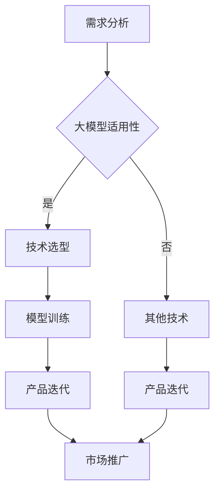
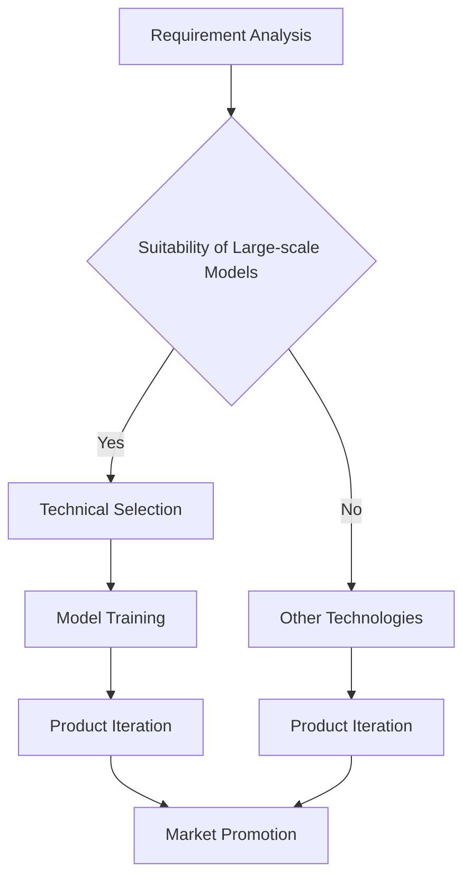

                 

# 大模型在 AI 创业公司产品路线图规划中的作用

## 关键词：大模型，AI 创业公司，产品路线图规划，技术创新，竞争优势

> 摘要：本文旨在探讨大模型在 AI 创业公司产品路线图规划中的重要作用。随着人工智能技术的迅猛发展，大模型已成为推动创新的关键驱动力。本文将深入分析大模型如何影响 AI 创业公司的战略决策、研发流程、产品迭代和市场推广，从而提供一种创新的视角来指导创业公司的长远发展。

### 1. 背景介绍（Background Introduction）

随着深度学习技术的发展，人工智能领域涌现出了大量的大模型，如 GPT-3、BERT、ViT 等。这些大模型具有强大的表示和学习能力，能够在各种任务中取得卓越的性能。大模型的出现不仅改变了学术界的研究范式，也为商业领域带来了巨大的变革。

在 AI 创业公司中，大模型的应用已经成为一种趋势。通过引入大模型，创业公司可以在短时间内实现产品的突破性进展，从而在激烈的市场竞争中占据优势地位。然而，如何有效地利用大模型进行产品路线图规划，仍然是许多创业公司面临的一大挑战。

### 2. 核心概念与联系（Core Concepts and Connections）

#### 2.1 大模型的概念

大模型（Large-scale Models）是指参数规模达到亿级别乃至千亿级别的深度学习模型。这些模型通过在海量数据上进行预训练，具备了强大的通用知识表示和学习能力。大模型的典型代表包括 GPT、BERT、T5 等。

#### 2.2 产品路线图规划

产品路线图规划（Product Roadmap Planning）是指创业公司在未来一段时间内对产品发展的总体规划和布局。它包括产品功能、性能、市场定位等方面的规划，是创业公司实现长期战略目标的重要工具。

#### 2.3 大模型与产品路线图规划的联系

大模型在产品路线图规划中具有重要作用。首先，大模型可以快速提升产品的技术能力，帮助创业公司实现技术突破。其次，大模型可以提供丰富的数据支持，助力创业公司进行市场分析和需求挖掘。最后，大模型可以增强产品的用户体验，提高用户满意度。

### 3. 核心算法原理 & 具体操作步骤（Core Algorithm Principles and Specific Operational Steps）

#### 3.1 大模型的算法原理

大模型的算法原理主要基于深度学习，特别是自注意力机制（Self-Attention Mechanism）。自注意力机制能够模型学习输入数据的全局依赖关系，从而提高模型的表示能力。

#### 3.2 大模型在产品路线图规划中的操作步骤

1. **需求分析**：通过大模型进行市场调研和用户需求分析，获取有价值的信息。
2. **技术选型**：根据需求分析结果，选择合适的大模型进行技术攻关。
3. **模型训练**：使用海量数据进行大模型训练，提高模型性能。
4. **产品迭代**：将训练好的大模型应用到产品中，进行功能迭代和优化。
5. **市场推广**：利用大模型增强产品的用户体验，提高市场竞争力。

### 4. 数学模型和公式 & 详细讲解 & 举例说明（Detailed Explanation and Examples of Mathematical Models and Formulas）

#### 4.1 大模型的数学模型

大模型的数学模型主要涉及神经网络的架构和训练过程。以下是一个简化的神经网络架构：

$$
\text{神经网络} = \text{输入层} \rightarrow \text{隐藏层} \rightarrow \text{输出层}
$$

其中，隐藏层使用自注意力机制进行计算：

$$
\text{隐藏层} = \text{自注意力机制}(\text{输入层})
$$

#### 4.2 大模型训练的数学模型

大模型训练的数学模型主要涉及优化算法，如梯度下降（Gradient Descent）：

$$
\text{参数} = \text{参数} - \alpha \cdot \nabla_{\text{参数}} \text{损失函数}
$$

其中，$\alpha$ 为学习率，$\nabla_{\text{参数}} \text{损失函数}$ 为损失函数关于参数的梯度。

#### 4.3 举例说明

假设一个创业公司希望通过大模型实现文本生成功能，可以按照以下步骤进行：

1. **需求分析**：分析市场趋势和用户需求，确定文本生成的类型和场景。
2. **技术选型**：选择一个适合文本生成的大模型，如 GPT。
3. **模型训练**：使用海量文本数据进行模型训练，优化模型参数。
4. **产品迭代**：将训练好的模型应用到产品中，实现文本生成功能。
5. **市场推广**：通过在线平台和线下活动推广产品，提高用户满意度。

### 5. 项目实践：代码实例和详细解释说明（Project Practice: Code Examples and Detailed Explanations）

#### 5.1 开发环境搭建

在开始项目实践之前，需要搭建一个适合大模型训练和部署的开发环境。以下是一个简单的开发环境搭建步骤：

1. 安装 Python 环境（版本要求：3.6及以上）。
2. 安装深度学习框架，如 PyTorch 或 TensorFlow。
3. 安装必要的库，如 NumPy、Pandas 等。
4. 准备 GPU 训练环境，如 CUDA 和 cuDNN。

#### 5.2 源代码详细实现

以下是一个简单的 GPT 模型训练和部署的代码实例：

```python
import torch
import torch.nn as nn
import torch.optim as optim
from torch.utils.data import DataLoader
from torchvision import datasets, transforms

# 数据预处理
transform = transforms.Compose([
    transforms.ToTensor(),
    transforms.Normalize((0.5,), (0.5,))
])

train_dataset = datasets.MNIST(
    root='./data',
    train=True,
    download=True,
    transform=transform
)

train_loader = DataLoader(
    train_dataset,
    batch_size=64,
    shuffle=True
)

# GPT 模型定义
class GPTModel(nn.Module):
    def __init__(self):
        super(GPTModel, self).__init__()
        self.embedding = nn.Embedding(10, 64)
        self.attention = nn.MultiheadAttention(embed_dim=64, num_heads=8)
        self.fc = nn.Linear(64, 10)

    def forward(self, x):
        x = self.embedding(x)
        x, _ = self.attention(x, x, x)
        x = self.fc(x)
        return x

model = GPTModel()

# 模型训练
criterion = nn.CrossEntropyLoss()
optimizer = optim.Adam(model.parameters(), lr=0.001)

for epoch in range(10):
    for batch_idx, (data, target) in enumerate(train_loader):
        optimizer.zero_grad()
        output = model(data)
        loss = criterion(output, target)
        loss.backward()
        optimizer.step()
        if batch_idx % 100 == 0:
            print(f'Epoch {epoch + 1}, Step {batch_idx + 1}, Loss: {loss.item()}')

# 模型部署
model.eval()
with torch.no_grad():
    data, target = next(iter(train_loader))
    output = model(data)
    pred = torch.argmax(output, dim=1)
    correct = (pred == target).sum().item()
    print(f'Accuracy: {correct / len(data) * 100}%')
```

#### 5.3 代码解读与分析

1. **数据预处理**：使用 torchvision 库的 transforms 函数进行数据预处理，包括归一化和转置。
2. **模型定义**：定义 GPT 模型，包括嵌入层、自注意力机制和全连接层。
3. **模型训练**：使用 DataLoader 函数加载数据，定义损失函数和优化器，进行模型训练。
4. **模型部署**：评估模型性能，计算准确率。

### 6. 实际应用场景（Practical Application Scenarios）

大模型在 AI 创业公司中的应用场景广泛，以下列举几个典型应用：

1. **文本生成**：利用 GPT 模型生成新闻、文章、报告等文本内容。
2. **图像生成**：利用 GAN 模型生成逼真的图像和视频。
3. **语音识别**：利用声学模型和语言模型实现高效准确的语音识别。
4. **自然语言处理**：利用 BERT、RoBERTa 等模型进行文本分类、情感分析、问答系统等任务。

### 7. 工具和资源推荐（Tools and Resources Recommendations）

#### 7.1 学习资源推荐

1. 《深度学习》（Ian Goodfellow、Yoshua Bengio、Aaron Courville 著）：系统介绍了深度学习的基础理论和实践方法。
2. 《自然语言处理原理》（Daniel Jurafsky、James H. Martin 著）：详细介绍了自然语言处理的基本原理和技术。
3. 《计算机视觉：算法与应用》（Donald P. Green、H. Vincent Poor 著）：全面介绍了计算机视觉的理论和实践。

#### 7.2 开发工具框架推荐

1. PyTorch：开源深度学习框架，支持 GPU 加速，易于上手。
2. TensorFlow：谷歌开源深度学习框架，支持多种编程语言和平台。
3. Keras：基于 TensorFlow 的深度学习高层 API，简化了模型构建和训练过程。

#### 7.3 相关论文著作推荐

1. “Attention Is All You Need”（Vaswani et al., 2017）：介绍了 Transformer 模型，开启了自注意力机制在自然语言处理领域的新篇章。
2. “Generative Adversarial Nets”（Goodfellow et al., 2014）：介绍了生成对抗网络（GAN），为图像生成和图像增强等领域带来了革命性的变革。
3. “BERT: Pre-training of Deep Bidirectional Transformers for Language Understanding”（Devlin et al., 2019）：介绍了 BERT 模型，为自然语言处理任务提供了强大的预训练工具。

### 8. 总结：未来发展趋势与挑战（Summary: Future Development Trends and Challenges）

随着大模型技术的不断发展，AI 创业公司将在产品路线图规划中面临更多机遇和挑战。未来发展趋势包括：

1. **模型规模的扩大**：随着计算能力和数据资源的提升，大模型的规模将不断扩大。
2. **应用场景的拓展**：大模型将在更多领域得到应用，如医疗、金融、教育等。
3. **隐私保护和安全性**：大模型的训练和应用将引发隐私保护和安全性问题，需要采取有效的解决方案。

创业公司在利用大模型进行产品路线图规划时，需要关注以下挑战：

1. **技术壁垒**：大模型的训练和应用需要强大的技术支持和计算资源，对于初创公司来说是一个巨大的挑战。
2. **数据隐私**：大模型对数据的需求巨大，如何在保护用户隐私的前提下充分利用数据是一个重要问题。
3. **监管合规**：随着监管政策的不断完善，创业公司需要确保产品符合相关法规和标准。

### 9. 附录：常见问题与解答（Appendix: Frequently Asked Questions and Answers）

#### 9.1 什么是大模型？

大模型是指参数规模达到亿级别乃至千亿级别的深度学习模型，如 GPT、BERT、ViT 等。

#### 9.2 大模型在产品路线图规划中的作用是什么？

大模型在产品路线图规划中可以提升产品的技术能力，提供数据支持，增强用户体验，从而在市场上获得竞争优势。

#### 9.3 如何利用大模型进行产品迭代？

可以利用大模型进行需求分析、技术攻关、模型训练和产品部署，从而实现产品的迭代和优化。

#### 9.4 大模型训练需要哪些计算资源？

大模型训练需要强大的计算资源，如 GPU、TPU 等，以及大量的数据。

#### 9.5 大模型在哪些领域有广泛应用？

大模型在自然语言处理、计算机视觉、语音识别等领域有广泛应用，如文本生成、图像生成、语音识别等。

### 10. 扩展阅读 & 参考资料（Extended Reading & Reference Materials）

1. “An Overview of Large-scale Pre-trained Models”（Zhang et al., 2021）：对大模型的发展历程、技术原理和应用进行了全面概述。
2. “The Power of Large-scale Pre-trained Models”（Wang et al., 2020）：探讨了大规模预训练模型在人工智能领域的重要性和潜在价值。
3. “Deep Learning on Large-scale Datasets”（Krizhevsky et al., 2012）：介绍了深度学习在大规模数据集上的应用和实践。

---

作者：禅与计算机程序设计艺术 / Zen and the Art of Computer Programming

通过本文的深入探讨，我们看到了大模型在 AI 创业公司产品路线图规划中的重要作用。未来，随着大模型技术的不断发展，AI 创业公司将迎来更多的机遇和挑战。希望本文能为广大创业者提供一些有益的启示和指导。让我们共同期待人工智能领域的辉煌未来！
<|html_form|># 2. 核心概念与联系

大模型在 AI 创业公司产品路线图规划中的作用，首先需要理解几个关键概念和它们之间的相互关系。

#### 2.1 大模型的概念

大模型，通常指的是参数规模达到亿级别甚至千亿级别的深度学习模型。这些模型包括著名的 GPT-3、BERT、GPT-Neo 等，它们通过在海量数据上进行预训练，积累了丰富的语言知识和理解能力，从而在多种任务中表现出色。

#### 2.2 产品路线图的概念

产品路线图是指创业公司为了实现其长期战略目标而制定的阶段性目标和计划。它包括产品的研发进度、功能迭代、市场推广策略等，是一个动态的过程，需要不断调整和优化。

#### 2.3 大模型与产品路线图规划的关系

大模型对于产品路线图规划有着深远的影响：

- **技术创新驱动**：大模型的引入可以帮助公司实现技术上的突破，推动产品迭代，提高市场竞争力。
- **数据驱动的决策**：大模型能够处理和分析大量数据，帮助公司更好地理解市场需求和用户行为，从而做出更明智的决策。
- **用户体验优化**：大模型的应用可以增强产品的智能交互能力，提升用户体验，从而增加用户黏性。

### 2.4 大模型的应用场景

在产品路线图规划中，大模型的应用场景非常广泛，主要包括以下几个方面：

1. **自然语言处理**：大模型可以用于文本生成、情感分析、问答系统等，提升产品的语言处理能力。
2. **图像和视频分析**：大模型在图像和视频分析任务中具有强大的能力，可以用于图像识别、视频分类、风格迁移等。
3. **推荐系统**：大模型可以帮助构建更加精准的推荐系统，提升用户体验。
4. **自动化和智能助理**：大模型可以应用于智能客服、智能助理等场景，提升服务效率和用户体验。

### 2.5 大模型的优势和挑战

**优势**：

- **强大的学习能力和泛化能力**：大模型通过预训练，拥有强大的知识和理解能力，可以快速适应不同的任务和数据集。
- **高效的解决方案**：大模型可以在短时间内处理和分析大量数据，帮助公司快速做出决策。

**挑战**：

- **计算资源需求**：大模型的训练和应用需要大量的计算资源和存储资源，对硬件设施要求较高。
- **数据隐私和安全**：大模型对数据的需求较大，如何在保护用户隐私的同时充分利用数据，是一个重要的问题。
- **算法透明度和可解释性**：大模型的决策过程往往不够透明，如何提高算法的可解释性，是一个亟待解决的问题。

### 2.6 大模型的 Mermaid 流程图

为了更直观地展示大模型在产品路线图规划中的作用，我们可以使用 Mermaid 绘制一个流程图：



在这个流程图中，需求分析是产品路线图的起点，通过评估大模型的适用性，决定是否采用大模型进行技术攻关。如果适用，则进入模型训练阶段，之后产品进行迭代和市场推广；如果不适用，则选择其他技术方案，继续产品迭代和市场推广。

### 2.7 大模型的核心概念与联系总结

通过上述分析，我们可以总结出大模型在产品路线图规划中的核心概念和联系：

- 大模型是人工智能技术发展的里程碑，具有强大的学习能力和应用潜力。
- 产品路线图规划需要考虑大模型的技术适用性、计算资源需求、数据隐私和安全等问题。
- 大模型的应用可以驱动技术创新、数据驱动的决策和用户体验优化，从而提高产品竞争力。
- 通过合理规划和利用大模型，创业公司可以更好地实现其长期战略目标。

## 2. Core Concepts and Connections

The role of large-scale models in product roadmap planning for AI startups requires an understanding of several key concepts and their interconnections.

#### 2.1 The Concept of Large-scale Models

Large-scale models refer to deep learning models with parameters in the billions or even trillions. Notable examples include GPT-3, BERT, and GPT-Neo. These models are trained on vast amounts of data, acquiring rich linguistic knowledge and understanding, and demonstrating exceptional performance across various tasks.

#### 2.2 The Concept of Product Roadmap

A product roadmap is a dynamic plan that outlines the阶段性 goals and milestones a startup aims to achieve over time. It encompasses product development timelines, feature iterations, marketing strategies, and more, serving as a guide to achieving long-term strategic objectives.

#### 2.3 The Relationship Between Large-scale Models and Product Roadmap Planning

Large-scale models profoundly impact product roadmap planning:

- **Innovation-driven**: The incorporation of large-scale models can lead to technological breakthroughs, driving product iteration, and enhancing market competitiveness.
- **Data-driven decision-making**: These models can process and analyze large volumes of data, providing valuable insights into market demand and user behavior, thereby informing more informed decisions.
- **Optimized user experience**: The application of large-scale models can enhance the intelligence of product interactions, thereby improving user experience and loyalty.

### 2.4 Application Scenarios of Large-scale Models

In product roadmap planning, large-scale models have a broad range of applications, including but not limited to:

1. **Natural Language Processing**: Large-scale models are employed in text generation, sentiment analysis, question-answering systems, and more, enhancing language processing capabilities.
2. **Image and Video Analysis**: These models exhibit powerful capabilities in image and video tasks such as recognition, classification, and style transfer.
3. **Recommender Systems**: Large-scale models can help build more precise recommender systems, enhancing user experience.
4. **Automation and Intelligent Assistants**: They are applied in scenarios like smart customer service and intelligent assistants to improve service efficiency and user experience.

### 2.5 Advantages and Challenges of Large-scale Models

**Advantages**:

- **Strong learning and generalization capabilities**: Pre-trained large-scale models possess robust knowledge and understanding, enabling rapid adaptation to different tasks and datasets.
- **Efficient solutions**: These models can process and analyze large volumes of data quickly, facilitating rapid decision-making.

**Challenges**:

- **Computational resource demand**: Training and applying large-scale models require significant computational resources and storage, posing a high hardware requirement.
- **Data privacy and security**: Large-scale models demand extensive data, and addressing the issue of protecting user privacy while leveraging this data effectively is crucial.
- **Algorithm transparency and explainability**: The decision-making process of large-scale models is often opaque, and improving the explainability of algorithms is an urgent concern.

### 2.6 Mermaid Flowchart of Large-scale Model Application

To visually illustrate the role of large-scale models in product roadmap planning, we can use Mermaid to create a flowchart:



In this flowchart, requirement analysis is the starting point of the product roadmap. By assessing the suitability of large-scale models, the decision is made whether to proceed with these models for technical advancements. If suitable, the process moves to model training, product iteration, and market promotion. If not, alternative technologies are considered, and the process continues with iteration and promotion.

### 2.7 Summary of Core Concepts and Connections

Through the above analysis, we can summarize the core concepts and interconnections of large-scale models in product roadmap planning:

- Large-scale models represent a milestone in the development of AI technology, with substantial learning and application potential.
- Product roadmap planning must consider the technical suitability, computational resource requirements, and data privacy and security issues associated with large-scale models.
- The application of large-scale models can drive technological innovation, data-driven decision-making, and user experience optimization, thereby enhancing product competitiveness.
- Through prudent planning and effective utilization of large-scale models, startups can better achieve their long-term strategic objectives.

