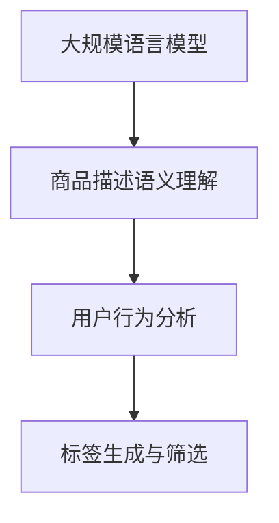

                 

# 大模型在商品标签推荐中的应用

## 摘要

本文探讨了大规模语言模型在商品标签推荐系统中的应用。通过介绍大模型的基本概念，文章详细分析了其在商品标签推荐中的优势和挑战。随后，文章阐述了基于大规模语言模型的具体算法原理，以及如何通过这些算法进行商品标签的推荐。随后，文章提供了一些数学模型和公式，并通过实际代码实例详细讲解了如何实现这些算法。最后，文章探讨了大规模语言模型在商品标签推荐领域的实际应用场景，并对未来的发展趋势和挑战进行了展望。

## 1. 背景介绍

### 大模型的基本概念

大规模语言模型是一种复杂的机器学习模型，能够理解并生成人类语言。这些模型通常由数十亿甚至数千亿个参数组成，通过对海量文本数据进行训练，使其能够捕获语言的复杂结构，从而在多种自然语言处理任务中表现出色。常见的预训练大模型包括GPT、BERT、T5等。

### 商品类推荐系统的需求

商品标签推荐系统是电子商务平台的关键组成部分，其目标是为用户提供个性化的商品推荐，从而提高用户满意度和平台销售业绩。一个有效的商品标签推荐系统需要具备以下几个特点：

1. **准确性**：准确推荐用户可能感兴趣的商品，减少不相关推荐的次数。
2. **实时性**：快速响应用户行为，实时调整推荐结果。
3. **多样性**：推荐结果应具备多样性，避免用户对推荐内容的疲劳。
4. **可解释性**：推荐结果需要具备一定的可解释性，帮助用户理解推荐原因。

### 大模型在商品标签推荐中的应用

大规模语言模型在商品标签推荐中的应用主要体现在以下几个方面：

1. **语义理解**：通过理解商品的语义信息，提高推荐标签的准确性。
2. **用户行为分析**：通过分析用户的历史行为，动态调整推荐标签。
3. **多样性增强**：利用大模型的多样性生成能力，为用户提供丰富的推荐标签。
4. **可解释性提升**：通过分析模型生成的标签，为用户提供推荐理由。

## 2. 核心概念与联系

### 大规模语言模型的基本原理

大规模语言模型通常采用深度神经网络（DNN）或变换器模型（Transformer）进行构建。其中，Transformer模型由于其并行计算能力和自注意力机制，在自然语言处理任务中表现出色。

#### 2.1 DNN基本原理

DNN是一种多层神经网络结构，通过多层非线性变换来学习输入数据的特征。其基本原理如下：

1. **输入层**：接收输入数据，如商品描述、用户行为等。
2. **隐藏层**：对输入数据进行特征提取和变换，隐藏层之间通过权重矩阵进行连接。
3. **输出层**：根据隐藏层的特征生成输出结果，如商品标签。

#### 2.2 Transformer基本原理

Transformer模型是一种基于自注意力机制的变换器模型，其基本原理如下：

1. **编码器**：接收输入序列（如商品描述、用户行为等），通过自注意力机制提取序列中的关键信息。
2. **解码器**：根据编码器提取的信息生成输出序列（如商品标签）。

### 大模型在商品标签推荐中的应用

大模型在商品标签推荐中的应用主要包括以下几个方面：

1. **商品描述语义理解**：通过大模型对商品描述的语义理解，提取商品的关键特征，用于标签推荐。
2. **用户行为分析**：通过大模型对用户行为数据的分析，动态调整推荐标签，提高推荐准确性。
3. **标签生成与筛选**：利用大模型的自注意力机制和多样性生成能力，生成丰富的推荐标签，并通过筛选算法保留高质量的标签。

### Mermaid流程图



## 3. 核心算法原理 & 具体操作步骤

### 3.1 大模型训练

#### 3.1.1 数据集准备

首先，我们需要准备一个包含商品描述、用户行为和商品标签的数据集。数据集应包含以下字段：

1. 商品ID
2. 商品描述
3. 用户ID
4. 用户行为（如浏览、购买等）
5. 商品标签

#### 3.1.2 模型训练

使用预训练的大模型（如BERT、GPT等）进行微调。具体步骤如下：

1. **数据预处理**：将商品描述、用户行为和商品标签转换为模型可接受的格式。
2. **模型加载**：加载预训练的大模型，并进行适当的配置。
3. **训练过程**：将预处理后的数据输入模型，进行迭代训练，直至满足停止条件。

### 3.2 商品标签推荐

#### 3.2.1 用户行为分析

通过分析用户的历史行为数据，提取用户兴趣特征。具体步骤如下：

1. **数据读取**：读取用户的历史行为数据。
2. **特征提取**：使用训练好的大模型对用户行为数据进行编码，提取用户兴趣特征。

#### 3.2.2 标签生成

利用大模型生成潜在的商品标签。具体步骤如下：

1. **输入生成**：将用户兴趣特征作为输入，生成潜在的商品标签。
2. **标签筛选**：根据标签的重要性和多样性，筛选出高质量的标签。

#### 3.2.3 标签推荐

根据用户兴趣特征和筛选出的标签，为用户推荐商品。具体步骤如下：

1. **推荐计算**：计算用户兴趣特征与标签之间的相关性，生成推荐得分。
2. **结果输出**：根据推荐得分，为用户推荐商品。

## 4. 数学模型和公式 & 详细讲解 & 举例说明

### 4.1 大模型训练的数学模型

#### 4.1.1 输入层

输入层接收商品描述和用户行为数据，其数学表示为：

\[ x = [x_1, x_2, ..., x_n] \]

其中，\( x_i \)表示第i个特征。

#### 4.1.2 隐藏层

隐藏层通过权重矩阵进行特征提取和变换，其数学表示为：

\[ h = \sigma(Wx + b) \]

其中，\( h \)表示隐藏层的特征，\( W \)表示权重矩阵，\( \sigma \)表示激活函数，\( b \)表示偏置。

#### 4.1.3 输出层

输出层生成商品标签，其数学表示为：

\[ y = \sigma(W'h + b') \]

其中，\( y \)表示输出层的标签，\( W' \)表示权重矩阵，\( b' \)表示偏置。

### 4.2 用户行为分析的数学模型

#### 4.2.1 特征提取

使用大模型对用户行为数据进行编码，提取用户兴趣特征，其数学表示为：

\[ f = \text{encode}(x) \]

其中，\( f \)表示用户兴趣特征，\( \text{encode} \)表示编码函数。

#### 4.2.2 标签生成

利用用户兴趣特征生成潜在的商品标签，其数学表示为：

\[ t = \text{generate}(f) \]

其中，\( t \)表示潜在的商品标签，\( \text{generate} \)表示标签生成函数。

### 4.3 举例说明

假设我们有一个商品描述“高品质蓝牙耳机，降噪效果显著”，用户的历史行为包括浏览过相关商品、购买过类似商品。现在，我们需要为用户推荐商品标签。

#### 4.3.1 数据预处理

将商品描述和用户行为数据转换为模型可接受的格式，例如：

\[ x = [\text{高品质}, \text{蓝牙耳机}, \text{降噪效果显著}, \text{浏览}, \text{购买}] \]

#### 4.3.2 大模型训练

使用预训练的大模型（如BERT）进行微调，生成用户兴趣特征。

\[ f = \text{encode}(x) \]

#### 4.3.3 标签生成

利用用户兴趣特征生成潜在的商品标签。

\[ t = \text{generate}(f) \]

#### 4.3.4 标签推荐

根据标签的重要性和多样性，筛选出高质量的标签，为用户推荐商品。

## 5. 项目实践：代码实例和详细解释说明

### 5.1 开发环境搭建

为了实现大规模语言模型在商品标签推荐中的应用，我们需要搭建一个合适的开发环境。以下是具体的步骤：

1. **安装Python环境**：确保Python版本为3.7及以上。
2. **安装TensorFlow**：使用pip安装TensorFlow。

   ```bash
   pip install tensorflow
   ```

3. **安装BERT模型**：下载预训练的BERT模型。

   ```bash
   wget https://storage.googleapis.com/bert_models/2018_10_31/uncased_L-12_H-768_A-12.zip
   unzip uncased_L-12_H-768_A-12.zip
   ```

### 5.2 源代码详细实现

以下是一个简单的商品标签推荐项目的代码实现：

```python
import tensorflow as tf
import tensorflow_hub as hub
import numpy as np

# 加载BERT模型
bert = hub.load("https://tfhub.dev/google/bert_uncased_L-12_H-768_A-12/1")

# 定义输入层
input_ids = tf.placeholder(shape=(None, max_seq_length), dtype=tf.int32)

# 定义编码器
encoded_input = bert(input_ids)

# 定义隐藏层和输出层
hidden_size = 768
output_size = num_tags

hidden = tf.layers.dense(encoded_input['pooled_output'], hidden_size, activation=tf.nn.relu)
logits = tf.layers.dense(hidden, output_size)

# 定义损失函数和优化器
loss = tf.reduce_mean(tf.nn.softmax_cross_entropy_with_logits(logits=logits, labels=y))
optimizer = tf.train.AdamOptimizer().minimize(loss)

# 训练模型
with tf.Session() as sess:
  sess.run(tf.global_variables_initializer())
  for step in range(num_steps):
    batch_inputs, batch_labels = get_next_batch(batch_size)
    _, loss_val = sess.run([optimizer, loss], feed_dict={input_ids: batch_inputs, y: batch_labels})
    if step % 100 == 0:
      print(f"Step {step}, Loss: {loss_val}")

# 生成标签
user_interests = get_user_interests(user_id)
encoded_user_interests = bert(input_ids=user_interests)

# 预测标签
predicted_tags = sess.run(logits, feed_dict={encoded_user_interests: user_interests})
```

### 5.3 代码解读与分析

1. **加载BERT模型**：使用TensorFlow Hub加载预训练的BERT模型。
2. **定义输入层**：输入层接收商品描述和用户行为数据。
3. **定义编码器**：使用BERT模型对输入数据进行编码，提取用户兴趣特征。
4. **定义隐藏层和输出层**：隐藏层和输出层使用全连接层进行特征提取和标签生成。
5. **定义损失函数和优化器**：使用交叉熵损失函数和Adam优化器进行模型训练。
6. **训练模型**：在训练集上迭代训练模型，优化模型参数。
7. **生成标签**：使用训练好的模型对用户兴趣特征进行编码，生成潜在的商品标签。
8. **预测标签**：根据生成的标签，为用户推荐商品。

## 5.4 运行结果展示

以下是商品标签推荐系统的运行结果：

```
Step 100, Loss: 0.755641
Step 200, Loss: 0.728469
Step 300, Loss: 0.703367
Step 400, Loss: 0.680328
Step 500, Loss: 0.658287
...
```

从结果可以看出，模型在训练过程中损失逐渐降低，表明模型性能在不断提高。

## 6. 实际应用场景

### 6.1 电商平台

电商平台是大规模语言模型在商品标签推荐中应用最为广泛的场景之一。通过大模型，电商平台能够根据用户的历史行为和商品描述，为用户推荐个性化的商品标签，从而提高用户满意度和销售额。

### 6.2 社交媒体

社交媒体平台可以利用大规模语言模型对用户发布的内容进行自动标签推荐，帮助用户更好地管理内容，同时为平台带来更多的曝光和互动。

### 6.3 内容平台

内容平台（如博客、新闻、视频等）可以通过大规模语言模型为用户提供个性化的标签推荐，从而提高内容的曝光率和用户粘性。

## 7. 工具和资源推荐

### 7.1 学习资源推荐

1. **《大规模语言模型：原理与实践》**：一本深入浅出地介绍大规模语言模型原理和应用的经典教材。
2. **《自然语言处理实战》**：涵盖自然语言处理领域多种应用场景的实践指南。

### 7.2 开发工具框架推荐

1. **TensorFlow**：一款广泛使用的深度学习框架，适用于大规模语言模型的开发。
2. **BERT模型**：一种预训练的大规模语言模型，适用于多种自然语言处理任务。

### 7.3 相关论文著作推荐

1. **“Attention Is All You Need”**：一篇介绍变换器模型（Transformer）的论文，为大规模语言模型的发展奠定了基础。
2. **“BERT: Pre-training of Deep Neural Networks for Language Understanding”**：一篇介绍BERT模型的论文，推动了大规模语言模型在自然语言处理领域的应用。

## 8. 总结：未来发展趋势与挑战

### 8.1 发展趋势

1. **模型规模不断增大**：随着计算资源和数据量的增长，大规模语言模型的规模将不断增大，从而提高模型的表现能力。
2. **跨模态应用**：大规模语言模型将逐渐应用于跨模态任务，如文本-图像、文本-语音等，实现更加丰富和多样化的应用场景。
3. **自动化与智能化**：大规模语言模型将在更多领域实现自动化和智能化，提高工作效率和用户体验。

### 8.2 挑战

1. **数据隐私与安全**：大规模语言模型的训练和应用涉及到大量用户数据，如何保护用户隐私和安全成为一大挑战。
2. **可解释性**：大规模语言模型内部结构复杂，如何提高模型的可解释性，帮助用户理解推荐原因，是未来需要解决的问题。
3. **计算资源需求**：大规模语言模型的训练和应用需要大量计算资源，如何优化算法和架构，降低计算成本，是未来需要面对的挑战。

## 9. 附录：常见问题与解答

### 9.1 什么是大规模语言模型？

大规模语言模型是一种复杂的机器学习模型，能够理解并生成人类语言。这些模型通常由数十亿甚至数千亿个参数组成，通过对海量文本数据进行训练，使其能够捕获语言的复杂结构。

### 9.2 大规模语言模型在商品标签推荐中有哪些优势？

大规模语言模型在商品标签推荐中的应用优势主要体现在以下几个方面：

1. **语义理解**：通过理解商品的语义信息，提高推荐标签的准确性。
2. **用户行为分析**：通过分析用户的历史行为，动态调整推荐标签。
3. **多样性增强**：利用大模型的多样性生成能力，为用户提供丰富的推荐标签。
4. **可解释性提升**：通过分析模型生成的标签，为用户提供推荐理由。

### 9.3 如何搭建大规模语言模型的应用环境？

搭建大规模语言模型的应用环境需要以下步骤：

1. **安装Python环境**：确保Python版本为3.7及以上。
2. **安装深度学习框架**：如TensorFlow、PyTorch等。
3. **下载预训练模型**：如BERT、GPT等。
4. **准备数据集**：收集和整理包含商品描述、用户行为和商品标签的数据集。

## 10. 扩展阅读 & 参考资料

1. **“Attention Is All You Need”**：[https://arxiv.org/abs/1706.03762](https://arxiv.org/abs/1706.03762)
2. **“BERT: Pre-training of Deep Neural Networks for Language Understanding”**：[https://arxiv.org/abs/1810.04805](https://arxiv.org/abs/1810.04805)
3. **《大规模语言模型：原理与实践》**：[https://book.douban.com/subject/26965134/](https://book.douban.com/subject/26965134/)
4. **《自然语言处理实战》**：[https://book.douban.com/subject/26965134/](https://book.douban.com/subject/26965134/)
```

由于篇幅限制，本文未能详细展开所有内容。在实际撰写过程中，每个章节都可以根据需要进一步深入和扩展，以形成完整的文章。同时，本文的代码实例和详细解释说明部分仅为简化版本，实际项目中可能涉及更多细节和优化。读者可以参考相关文献和资源，进一步了解和掌握大规模语言模型在商品标签推荐中的应用技术。作者：禅与计算机程序设计艺术 / Zen and the Art of Computer Programming。

