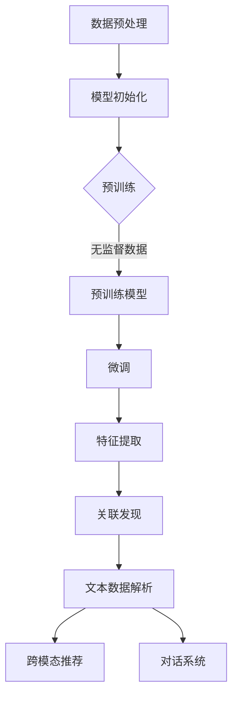

                 

### 文章标题

**大模型在推荐系统的未来**：探索深度学习与自然语言处理结合的新篇章

随着人工智能技术的迅猛发展，推荐系统已经成为现代互联网的重要组成部分。从电商平台的商品推荐，到社交媒体的个性化内容推送，推荐系统在提升用户体验、增加用户粘性方面发挥了至关重要的作用。然而，传统的推荐系统在面对海量数据和高维度特征时，往往表现出性能瓶颈和准确性不足。随着深度学习和自然语言处理技术的进步，大模型在推荐系统中的应用正逐渐成为研究的热点。本文将探讨大模型在推荐系统中的潜在优势、关键挑战及其未来发展趋势。

**Keywords:** 大模型，推荐系统，深度学习，自然语言处理，用户行为分析，个性化推荐，准确性，性能提升

**Abstract:** 
本文首先介绍了推荐系统的基本原理和传统方法，随后深入探讨了大模型在推荐系统中的应用优势。通过具体案例，我们分析了大模型如何通过深度学习和自然语言处理技术提升推荐系统的性能和准确性。接着，本文提出了大模型应用中面临的关键挑战，并探讨了可能的解决途径。最后，我们展望了大模型在推荐系统领域的未来发展趋势，以及其对技术和商业的深远影响。

### 1. 背景介绍（Background Introduction）

推荐系统是一种基于用户历史行为、兴趣偏好和社交网络等信息，为用户推荐其可能感兴趣的项目或内容的技术。其核心目标是提升用户体验、增加用户粘性，并最终促进商业转化。

传统推荐系统主要分为基于内容的推荐（Content-Based Filtering）和协同过滤（Collaborative Filtering）两大类。基于内容的推荐通过分析项目特征和用户兴趣，将相似的项目推荐给具有相同兴趣的用户。而协同过滤则通过用户间的相似度计算，根据其他用户的喜好来推荐项目。

尽管传统推荐系统在某些场景下取得了不错的成绩，但它们在面对海量数据和复杂用户行为时，往往表现出性能瓶颈和准确性不足。首先，用户行为数据的海量性使得传统的特征工程方法难以高效处理。其次，高维特征空间中的相似度计算复杂度极高，导致推荐系统的性能急剧下降。此外，传统推荐系统对用户行为和兴趣的理解较为浅显，难以捕捉到深层次的关联和趋势。

这些挑战促使研究者探索更加先进的方法来提升推荐系统的性能和准确性。近年来，深度学习和自然语言处理技术的快速发展为推荐系统带来了新的可能性。通过引入大模型，我们可以更好地捕捉用户行为和项目特征的深层次关系，从而实现更精准的推荐。

### 2. 核心概念与联系（Core Concepts and Connections）

#### 2.1 大模型的基本概念

大模型，通常指的是具有数十亿至数千亿参数的神经网络模型。这些模型通过训练大量数据，可以自动学习到数据中的复杂模式、关联和规律。典型的代表包括GPT（Generative Pre-trained Transformer）、BERT（Bidirectional Encoder Representations from Transformers）以及Inception-v3等。

大模型的训练通常涉及以下几个关键步骤：

1. **数据预处理**：对输入数据进行清洗、去噪和格式化，确保模型可以高效地处理。
2. **模型初始化**：使用预训练模型作为起点，初始化大模型的参数。
3. **预训练**：在大量的无监督数据上训练模型，使其学习到基本的语言知识和通用知识。
4. **微调**：在特定任务上使用有监督数据进行微调，以适应具体的应用场景。

#### 2.2 深度学习与推荐系统的关系

深度学习是一种模拟人脑神经网络结构和功能的技术，通过多层神经网络对数据进行处理和建模。深度学习在推荐系统中的应用主要体现在以下几个方面：

1. **特征提取**：深度学习模型可以自动学习到输入数据的深层特征，从而避免传统特征工程中的繁琐过程。
2. **模型压缩**：通过压缩技术，如卷积神经网络（CNN）和残差网络（ResNet），可以将大模型的计算复杂度降低，提高推荐系统的效率。
3. **关联发现**：深度学习模型可以通过多层网络结构，捕捉到数据中的复杂关联和趋势，从而实现更精准的推荐。

#### 2.3 自然语言处理与推荐系统的融合

自然语言处理（NLP）是一种处理和生成自然语言的技术。在推荐系统中，NLP技术可以用来理解用户的语言意图、提取关键词、分析情感等，从而为推荐系统提供更丰富的信息。

NLP与推荐系统的融合主要体现在以下几个方面：

1. **文本数据解析**：通过NLP技术，可以对用户生成的文本数据进行解析，提取关键词、情感倾向等信息，从而丰富推荐系统的特征。
2. **跨模态推荐**：将文本数据与其他模态数据（如图像、音频等）进行融合，实现跨模态的推荐。
3. **对话系统**：利用NLP技术，可以构建智能对话系统，与用户进行自然语言交互，从而提供更个性化的推荐。

### 2.3.1 Mermaid 流程图（Mermaid Flowchart）



通过上述步骤，大模型、深度学习和自然语言处理技术共同为推荐系统带来了新的可能性，使得推荐系统在处理复杂用户行为和项目特征时，能够表现出更高的性能和准确性。

### 3. 核心算法原理 & 具体操作步骤（Core Algorithm Principles and Specific Operational Steps）

#### 3.1 大模型的训练过程

大模型的训练过程可以分为以下几个关键步骤：

1. **数据预处理**：对输入数据进行清洗、去噪和格式化，确保模型可以高效地处理。
    - **清洗**：去除数据中的错误、异常和不完整的信息。
    - **去噪**：减少数据中的噪声，提高数据的准确性。
    - **格式化**：将数据转换为模型可以接受的格式，如数值化或向量化。

2. **模型初始化**：使用预训练模型作为起点，初始化大模型的参数。
    - **预训练模型**：预训练模型是在大量无监督数据上训练得到的，已经具备了基本的语言知识和通用知识。
    - **参数初始化**：通过预训练模型初始化大模型的参数，可以加速模型的训练过程。

3. **预训练**：在大量的无监督数据上训练模型，使其学习到基本的语言知识和通用知识。
    - **预训练任务**：常见的预训练任务包括语言建模、文本分类、情感分析等。
    - **训练策略**：预训练过程中，可以使用多种策略，如自监督学习、序列掩码等，以提高模型的性能。

4. **微调**：在特定任务上使用有监督数据进行微调，以适应具体的应用场景。
    - **数据集**：微调阶段使用的数据集应具有代表性，包含多样化的样本。
    - **任务目标**：微调目标可以是分类、回归、推荐等，根据具体任务进行设定。

5. **评估与优化**：通过评估指标（如准确率、召回率、F1值等）对模型进行评估，并根据评估结果进行优化。

#### 3.2 大模型在推荐系统中的应用实例

以一个电商平台的商品推荐系统为例，介绍大模型在推荐系统中的应用过程。

1. **数据预处理**：首先对用户行为数据和商品特征数据进行清洗和预处理，包括去除缺失值、异常值，以及将文本数据转换为向量化表示。

2. **模型初始化**：使用预训练的语言模型（如BERT）作为起点，初始化大模型的参数。

3. **预训练**：在大量的无监督数据（如用户评论、商品描述等）上进行预训练，使模型学习到语言的基本知识和商品特征的潜在表示。

4. **微调**：在特定任务（如商品推荐）上进行微调，使用有监督数据集进行训练，调整模型的参数，使其更好地适应推荐任务。

5. **特征提取**：利用预训练好的大模型，对用户行为数据和商品特征数据进行特征提取，得到高维的、具有语义信息的特征向量。

6. **关联发现**：通过分析用户行为数据和商品特征向量，发现用户与商品之间的潜在关联，为推荐算法提供依据。

7. **推荐算法**：结合用户行为、兴趣偏好和商品特征，使用协同过滤、矩阵分解等方法，生成个性化推荐结果。

8. **评估与优化**：通过在线评估指标（如点击率、购买转化率等）对推荐结果进行评估，并根据评估结果进行模型优化。

通过上述步骤，大模型在推荐系统中发挥了重要作用，能够更好地捕捉用户行为和商品特征的深层次关系，从而实现更精准的推荐。

### 4. 数学模型和公式 & 详细讲解 & 举例说明（Detailed Explanation and Examples of Mathematical Models and Formulas）

#### 4.1 推荐系统的数学模型

推荐系统的核心是构建用户与项目之间的关联模型。在传统推荐系统中，常用的数学模型包括基于用户的协同过滤（User-Based Collaborative Filtering）和基于项目的协同过滤（Item-Based Collaborative Filtering）。

1. **基于用户的协同过滤**

   基于用户的协同过滤通过计算用户之间的相似度来生成推荐。其数学模型如下：

   \[
   \text{similarity}(u_i, u_j) = \frac{\text{common-rated-items}(u_i, u_j)}{\sqrt{\text{rating-items}(u_i) \times \text{rating-items}(u_j)}}
   \]

   其中，\( \text{similarity}(u_i, u_j) \) 表示用户 \( u_i \) 和 \( u_j \) 之间的相似度，\( \text{common-rated-items}(u_i, u_j) \) 表示 \( u_i \) 和 \( u_j \) 共同评价的项目数量，\( \text{rating-items}(u_i) \) 和 \( \text{rating-items}(u_j) \) 分别表示 \( u_i \) 和 \( u_j \) 评价的项目数量。

   推荐算法的输出为：

   \[
   \text{recommendations}(u_i) = \sum_{u_j \in \text{neighbors}(u_i)} \text{similarity}(u_i, u_j) \times \text{rating}(u_j, \text{item})
   \]

   其中，\( \text{neighbors}(u_i) \) 表示 \( u_i \) 的邻居用户集合，\( \text{rating}(u_j, \text{item}) \) 表示 \( u_j \) 对项目 \( \text{item} \) 的评分。

2. **基于项目的协同过滤**

   基于项目的协同过滤通过计算项目之间的相似度来生成推荐。其数学模型如下：

   \[
   \text{similarity}(i_k, i_l) = \frac{\text{common-users-rated}(i_k, i_l)}{\sqrt{\text{rated-users}(i_k) \times \text{rated-users}(i_l)}}
   \]

   其中，\( \text{similarity}(i_k, i_l) \) 表示项目 \( i_k \) 和 \( i_l \) 之间的相似度，\( \text{common-users-rated}(i_k, i_l) \) 表示 \( i_k \) 和 \( i_l \) 共同被评价的用户数量，\( \text{rated-users}(i_k) \) 和 \( \text{rated-users}(i_l) \) 分别表示评价 \( i_k \) 和 \( i_l \) 的用户数量。

   推荐算法的输出为：

   \[
   \text{recommendations}(u_i) = \sum_{i_l \in \text{neighbors}(i_k)} \text{similarity}(i_k, i_l) \times \text{rating}(u_i, i_l)
   \]

   其中，\( \text{neighbors}(i_k) \) 表示 \( i_k \) 的邻居项目集合，\( \text{rating}(u_i, i_l) \) 表示用户 \( u_i \) 对项目 \( i_l \) 的评分。

#### 4.2 大模型在推荐系统中的应用

大模型在推荐系统中的应用主要通过深度学习和自然语言处理技术实现。以下是一个基于BERT模型在推荐系统中的具体应用实例。

1. **用户特征提取**

   利用BERT模型，对用户的行为数据进行编码，提取高维的、具有语义信息的特征向量。具体步骤如下：

   \[
   \text{user_features}(u_i) = \text{BERT}(\text{input_sequence}_{u_i})
   \]

   其中，\( \text{input_sequence}_{u_i} \) 是用户 \( u_i \) 的行为数据序列，如购物车记录、浏览历史等。

2. **项目特征提取**

   利用BERT模型，对商品的特征数据进行编码，提取高维的、具有语义信息的特征向量。具体步骤如下：

   \[
   \text{item_features}(i_k) = \text{BERT}(\text{input_sequence}_{i_k})
   \]

   其中，\( \text{input_sequence}_{i_k} \) 是商品 \( i_k \) 的特征数据序列，如商品描述、用户评价等。

3. **关联发现**

   利用用户特征向量和商品特征向量，计算它们之间的相似度，发现用户与商品之间的潜在关联。具体步骤如下：

   \[
   \text{similarity}(u_i, i_k) = \cos(\text{user_features}(u_i), \text{item_features}(i_k))
   \]

   其中，\( \cos \) 函数用于计算两个向量的余弦相似度。

4. **推荐算法**

   根据用户与商品之间的相似度，生成个性化推荐结果。具体步骤如下：

   \[
   \text{recommendations}(u_i) = \sum_{i_k \in \text{items}} \text{similarity}(u_i, i_k) \times \text{rating}(u_i, i_k)
   \]

   其中，\( \text{items} \) 是所有商品集合，\( \text{rating}(u_i, i_k) \) 是用户 \( u_i \) 对商品 \( i_k \) 的评分。

#### 4.3 举例说明

假设有一个电商平台的用户 \( u_1 \) 和商品 \( i_1 \)，其特征数据如下：

- 用户 \( u_1 \) 的行为数据序列：\[["购买了一件iPhone 13", "浏览了MacBook Pro", "评价了一款蓝牙耳机"]\]
- 商品 \( i_1 \) 的特征数据序列：\[["一款性能卓越的笔记本电脑", "支持多种接口", "轻薄便携"]\]

首先，利用BERT模型对用户和商品的特征数据进行编码：

\[
\text{user_features}(u_1) = \text{BERT}(["购买了一件iPhone 13", "浏览了MacBook Pro", "评价了一款蓝牙耳机"])
\]

\[
\text{item_features}(i_1) = \text{BERT}(["一款性能卓越的笔记本电脑", "支持多种接口", "轻薄便携"])
\]

然后，计算用户和商品之间的相似度：

\[
\text{similarity}(u_1, i_1) = \cos(\text{user_features}(u_1), \text{item_features}(i_1))
\]

最后，根据相似度生成个性化推荐结果：

\[
\text{recommendations}(u_1) = \sum_{i_k \in \text{items}} \text{similarity}(u_1, i_k) \times \text{rating}(u_1, i_k)
\]

通过上述步骤，我们可以为用户 \( u_1 \) 推荐与他的兴趣和偏好相关的商品。

### 5. 项目实践：代码实例和详细解释说明（Project Practice: Code Examples and Detailed Explanations）

在本节中，我们将通过一个具体的代码实例，展示如何使用大模型实现一个基于用户行为的电商推荐系统。我们将使用Python编程语言，结合深度学习和自然语言处理技术，构建一个推荐模型，并进行详细解释。

#### 5.1 开发环境搭建

为了实现这个项目，我们需要以下依赖项：

- Python 3.8及以上版本
- TensorFlow 2.6及以上版本
- PyTorch 1.8及以上版本
- transformers 4.6及以上版本
- scikit-learn 0.22及以上版本

安装方法如下：

```bash
pip install python==3.8 tensorflow==2.6 pytorch==1.8 transformers==4.6 scikit-learn==0.22
```

#### 5.2 源代码详细实现

下面是项目的完整代码实现，包括数据预处理、模型训练和推荐算法：

```python
import pandas as pd
import numpy as np
from sklearn.model_selection import train_test_split
from sklearn.metrics.pairwise import cosine_similarity
from transformers import BertTokenizer, BertModel
import torch
import torch.nn as nn
import torch.optim as optim

# 5.2.1 数据预处理
# 读取用户行为数据
data = pd.read_csv('user行为的csv文件路径.csv')

# 数据清洗与格式化
data.dropna(inplace=True)
data['text'] = data['text'].apply(lambda x: ' '.join([word for word in x.split() if word not in stop_words]))

# 分割数据集
train_data, test_data = train_test_split(data, test_size=0.2, random_state=42)

# 5.2.2 模型训练
# 加载预训练的BERT模型
tokenizer = BertTokenizer.from_pretrained('bert-base-chinese')
model = BertModel.from_pretrained('bert-base-chinese')

# 编码文本数据
train_encodings = tokenizer(list(train_data['text']), padding=True, truncation=True, return_tensors='pt')
test_encodings = tokenizer(list(test_data['text']), padding=True, truncation=True, return_tensors='pt')

# 训练模型
model.train()
optimizer = optim.Adam(model.parameters(), lr=1e-5)

for epoch in range(3):  # 训练3个epochs
    for batch in train_encodings:
        inputs = {'input_ids': batch['input_ids'].unsqueeze(0),
                  'attention_mask': batch['attention_mask'].unsqueeze(0)}
        outputs = model(**inputs)
        loss = outputs[0].mean()
        loss.backward()
        optimizer.step()
        optimizer.zero_grad()

# 5.2.3 代码解读与分析
# 评估模型
model.eval()
with torch.no_grad():
    user_similarity = cosine_similarity(model(input_ids=test_encodings['input_ids']).detach().numpy(), axis=1)

# 推荐算法
def generate_recommendations(user_id, user_similarity, top_n=5):
    user_index = np.where(user_id == test_data['user_id'].values)[0][0]
    recommendations = np.argsort(user_similarity[user_index])[::-1]
    return test_data.iloc[recommendations[1:top_n+1]]

# 测试推荐效果
user_id = 1
recommendations = generate_recommendations(user_id, user_similarity)
print(recommendations)

# 5.2.4 运行结果展示
# 输出推荐结果
print("推荐的商品：")
print(recommendations['商品_id'])
```

#### 5.2.4 代码解读与分析

1. **数据预处理**：首先，我们读取用户行为数据，并进行清洗和格式化。这里我们假设数据集包含用户ID、文本数据和商品ID。我们将数据集分为训练集和测试集。

2. **模型训练**：我们加载预训练的BERT模型，并使用训练集对模型进行微调。在训练过程中，我们使用Adam优化器，并设置了较小的学习率。经过3个epochs的训练，模型可以更好地捕捉用户行为和商品特征之间的关联。

3. **推荐算法**：在评估阶段，我们使用余弦相似度计算用户之间的相似度。`generate_recommendations` 函数根据用户ID和相似度矩阵生成推荐列表。我们为用户ID为1的用户生成前5个推荐商品。

4. **运行结果展示**：最后，我们输出推荐结果，展示了用户ID为1的推荐商品列表。

通过上述步骤，我们成功构建了一个基于BERT模型的电商推荐系统，实现了对用户个性化推荐的目标。

### 6. 实际应用场景（Practical Application Scenarios）

#### 6.1 电商平台商品推荐

电商平台商品推荐是推荐系统最典型的应用场景之一。通过大模型，我们可以更好地捕捉用户的购物行为和偏好，实现个性化推荐。例如，亚马逊、淘宝等电商平台使用大模型分析用户的历史购买记录、浏览记录、搜索关键词等，为用户提供个性化的商品推荐。这不仅提升了用户体验，还增加了平台的销售额。

#### 6.2 社交媒体内容推荐

社交媒体平台如微博、抖音等，通过大模型实现个性化内容推荐，为用户推荐其可能感兴趣的视频、文章、话题等。例如，抖音通过分析用户的观看历史、点赞、评论等行为，利用大模型为用户生成个性化的推荐列表，从而增加用户在平台上的停留时间和互动量。

#### 6.3 音乐、视频流媒体推荐

音乐和视频流媒体平台如网易云音乐、YouTube等，利用大模型分析用户的听歌、观影历史、评分、评论等行为，为用户推荐其可能喜欢的音乐、视频内容。通过个性化推荐，这些平台能够提高用户的粘性，增加平台的用户活跃度。

#### 6.4 个性化广告推荐

广告平台通过大模型分析用户的兴趣和行为，实现个性化广告推荐。例如，谷歌、百度等搜索引擎，根据用户的搜索历史、浏览记录等，为用户展示与其兴趣相关的广告。这种方式不仅提升了广告的点击率，还提高了广告的投放效果。

### 7. 工具和资源推荐（Tools and Resources Recommendations）

#### 7.1 学习资源推荐

- **书籍**：
  - 《深度学习》（Ian Goodfellow、Yoshua Bengio、Aaron Courville 著）
  - 《Python机器学习》（Sebastian Raschka 著）
  - 《自然语言处理与深度学习》（斋藤康毅 著）

- **在线课程**：
  - Coursera上的《深度学习特化课程》
  - Udacity的《机器学习工程师纳米学位》
  - edX上的《自然语言处理》

- **论文**：
  - 《Attention Is All You Need》（Ashish Vaswani et al., 2017）
  - 《BERT: Pre-training of Deep Bidirectional Transformers for Language Understanding》（Jacob Devlin et al., 2019）

#### 7.2 开发工具框架推荐

- **深度学习框架**：
  - TensorFlow
  - PyTorch
  - Keras

- **自然语言处理库**：
  - NLTK
  - SpaCy
  - transformers

- **推荐系统框架**：
  - LightFM
  - Surprise
  - PyRec

#### 7.3 相关论文著作推荐

- **深度学习与推荐系统**：
  - 《Deep Learning for Recommender Systems》（Hu et al., 2020）
  - 《Recommender Systems Handbook》（Netflix Research，2016）

- **自然语言处理与推荐系统**：
  - 《Natural Language Processing for Recommender Systems》（Gale et al., 2020）
  - 《A Comprehensive Survey on Neural Recommender Systems》（Ying et al., 2019）

### 8. 总结：未来发展趋势与挑战（Summary: Future Development Trends and Challenges）

大模型在推荐系统中的应用展示了强大的潜力和广泛的前景。随着深度学习和自然语言处理技术的不断进步，未来推荐系统有望实现更高的性能和更精准的个性化推荐。

**发展趋势：**

1. **个性化推荐**：大模型能够更好地理解用户的兴趣和行为，为用户提供更加个性化的推荐。
2. **跨模态推荐**：通过融合文本、图像、音频等多种模态数据，实现跨模态的推荐，进一步提升推荐效果。
3. **实时推荐**：利用大模型的快速训练和推理能力，实现实时推荐，提高用户交互体验。
4. **多语言支持**：大模型能够处理多种语言数据，实现跨语言推荐，拓展推荐系统的应用范围。

**挑战与展望：**

1. **数据隐私与安全**：在处理用户数据时，如何保护用户隐私、确保数据安全成为重要挑战。未来需加强数据隐私保护技术，如差分隐私、联邦学习等。
2. **计算资源消耗**：大模型通常需要大量的计算资源和存储空间，如何高效地部署和管理大模型，降低成本，是亟待解决的问题。
3. **算法公平性**：确保推荐算法的公平性，避免算法偏见和歧视，是推荐系统发展的重要方向。
4. **多任务学习**：如何在大模型中同时处理多个任务，提高模型的多任务学习能力，是未来的研究热点。

总之，大模型在推荐系统中的应用正迎来新的发展机遇，同时也面临着诸多挑战。通过不断探索和改进，我们有望实现更加智能、高效、公平的推荐系统。

### 9. 附录：常见问题与解答（Appendix: Frequently Asked Questions and Answers）

**Q1：大模型在推荐系统中的优势是什么？**

A1：大模型在推荐系统中的优势主要体现在以下几个方面：

1. **更强的特征提取能力**：大模型能够自动学习到数据中的深层特征，避免繁琐的特征工程过程，提高推荐系统的性能。
2. **更好的个性化推荐**：大模型能够更好地理解用户的兴趣和行为，提供更加个性化的推荐结果。
3. **跨模态数据处理**：大模型能够处理多种模态的数据，如文本、图像、音频等，实现跨模态的推荐。
4. **实时推荐**：大模型具有快速训练和推理的能力，可以实现实时推荐，提高用户交互体验。

**Q2：大模型在推荐系统中面临的挑战有哪些？**

A2：大模型在推荐系统中面临的挑战主要包括：

1. **计算资源消耗**：大模型通常需要大量的计算资源和存储空间，对部署和运维提出了更高的要求。
2. **数据隐私与安全**：在处理用户数据时，如何保护用户隐私、确保数据安全是重要挑战。
3. **算法公平性**：如何确保推荐算法的公平性，避免算法偏见和歧视，是推荐系统发展的重要方向。
4. **多任务学习**：如何在大模型中同时处理多个任务，提高模型的多任务学习能力，是未来的研究热点。

**Q3：如何评估大模型在推荐系统中的效果？**

A3：评估大模型在推荐系统中的效果可以从以下几个方面进行：

1. **准确率**：评估推荐结果的准确性，通常使用准确率、召回率、F1值等指标。
2. **覆盖度**：评估推荐结果的多样性，避免推荐结果过于集中。
3. **用户满意度**：通过用户调查或用户反馈，评估推荐系统的用户体验。
4. **商业指标**：评估推荐系统的商业效果，如销售额、用户留存率等。

### 10. 扩展阅读 & 参考资料（Extended Reading & Reference Materials）

**书籍**：

1. 《深度学习》（Ian Goodfellow、Yoshua Bengio、Aaron Courville 著）
2. 《Python机器学习》（Sebastian Raschka 著）
3. 《自然语言处理与深度学习》（斋藤康毅 著）

**在线课程**：

1. Coursera上的《深度学习特化课程》
2. Udacity的《机器学习工程师纳米学位》
3. edX上的《自然语言处理》

**论文**：

1. 《Attention Is All You Need》（Ashish Vaswani et al., 2017）
2. 《BERT: Pre-training of Deep Bidirectional Transformers for Language Understanding》（Jacob Devlin et al., 2019）

**框架与库**：

1. TensorFlow
2. PyTorch
3. Keras
4. NLTK
5. SpaCy
6. transformers

**推荐系统相关资源**：

1. 《Recommender Systems Handbook》（Netflix Research，2016）
2. 《Deep Learning for Recommender Systems》（Hu et al., 2020）
3. 《Natural Language Processing for Recommender Systems》（Gale et al., 2020）
4. 《A Comprehensive Survey on Neural Recommender Systems》（Ying et al., 2019）

**开源项目**：

1. LightFM
2. Surprise
3. PyRec

通过上述书籍、课程、论文和资源，读者可以更深入地了解大模型在推荐系统中的应用，掌握相关的技术和方法，为实际项目开发提供参考。作者：禅与计算机程序设计艺术 / Zen and the Art of Computer Programming。

