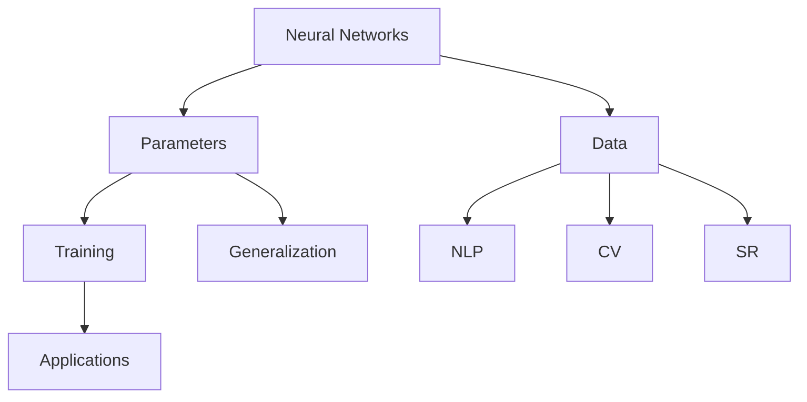

                 

### 文章标题

### Title: Revolution of Large-scale Models

> **关键词：** 大模型、人工智能、深度学习、技术变革、生成式预训练模型

关键词：
- 大模型
- 人工智能
- 深度学习
- 技术变革
- 生成式预训练模型

**摘要：** 本文将探讨大模型在人工智能领域的革命性变革。通过对大模型的概念、发展历程、核心算法原理以及实际应用场景的深入分析，本文旨在揭示大模型如何推动人工智能技术的进步，并展望其未来发展趋势与挑战。

### Introduction

The advent of large-scale models has brought about a revolutionary transformation in the field of artificial intelligence (AI). These models, characterized by their massive size and complexity, have paved the way for breakthroughs in various AI applications, from natural language processing to computer vision. In this article, we will delve into the concept of large-scale models, their development history, core algorithm principles, and practical application scenarios. By doing so, we aim to shed light on how large-scale models are propelling the advancement of AI technology and exploring the future trends and challenges they present.

#### Background Introduction

The concept of large-scale models in AI can be traced back to the early 2000s when researchers started exploring the potential of deep learning. Deep learning, a subset of machine learning, relies on neural networks with multiple layers to learn from vast amounts of data. The more layers a neural network has, the more complex patterns it can capture.

In the early stages, deep learning models were relatively small and limited in their ability to generalize. However, as computing power and data availability increased, researchers began to train models with billions of parameters, giving rise to the concept of large-scale models. These models are capable of handling massive amounts of data and learning intricate patterns that were previously unattainable.

One of the key milestones in the development of large-scale models was the introduction of the Transformer architecture in 2017. Developed by researchers at Google, the Transformer architecture revolutionized the field of natural language processing (NLP) by enabling the training of models with millions of parameters. The success of the Transformer architecture paved the way for the development of even larger models, such as the General Language Modeling (GLM) and the General Vision Transformer (GVT).

#### Core Concepts and Connections

To understand the concept of large-scale models, it is essential to explore the core components and principles that underpin them. Here, we will discuss the key concepts and their interconnections:

**1. Neural Networks:**
Neural networks are the fundamental building blocks of deep learning models. They consist of layers of interconnected nodes, or neurons, that process and transmit data. Each layer performs a specific function, such as feature extraction or transformation. As the number of layers increases, the model becomes deeper, allowing it to capture more complex patterns.

**2. Parameters:**
Parameters are the adjustable weights and biases within a neural network. During training, the model adjusts these parameters to minimize the difference between its predictions and the ground truth. In large-scale models, the number of parameters can range from millions to billions, enabling the model to learn intricate patterns from vast amounts of data.

**3. Data:**
Data is at the heart of large-scale models. These models require large amounts of high-quality data to train effectively. The more data a model has access to, the better it can generalize to new, unseen examples. In the context of AI, data can come from various sources, such as text, images, or audio.

**4. Training:**
Training is the process of adjusting the parameters of a neural network to minimize the difference between its predictions and the ground truth. In the case of large-scale models, training can be a computationally intensive process, requiring significant computational resources and time.

**5. Generalization:**
Generalization is the ability of a model to perform well on new, unseen data. In the context of large-scale models, generalization is crucial to ensure that the model can apply its learned knowledge to a wide range of tasks and scenarios.

**6. Applications:**
Large-scale models have been applied to a wide range of AI tasks, including natural language processing, computer vision, and speech recognition. These models have achieved state-of-the-art performance on various benchmarks, pushing the boundaries of what is possible in AI.

#### Mermaid Flowchart of Core Concepts and Connections



In summary, large-scale models are at the forefront of AI research and development. By leveraging advanced neural network architectures, massive amounts of data, and powerful computational resources, these models have enabled breakthroughs in various AI applications. As we continue to explore and harness the potential of large-scale models, we can expect further advancements and innovations in the field of AI.

---

### Core Algorithm Principles and Specific Operational Steps

The core algorithms underlying large-scale models are primarily based on deep learning, a subfield of machine learning that relies on neural networks to learn from data. In this section, we will explore the fundamental principles of deep learning, including neural networks, backpropagation, and optimization techniques. Additionally, we will discuss the specific operational steps involved in training large-scale models.

#### Neural Networks

Neural networks are the cornerstone of deep learning. They consist of layers of interconnected nodes, or neurons, that process and transmit data. Each neuron takes input from the previous layer, applies a weighted sum of the inputs, and passes the result through an activation function. The output of each neuron is then passed to the next layer, where the process is repeated.

**1. Input Layer:**
The input layer is the first layer of the neural network. It receives the input data, which can be in the form of text, images, or any other type of data.

**2. Hidden Layers:**
Hidden layers are the intermediate layers between the input and output layers. Each hidden layer processes the data received from the previous layer, extracting higher-level features and representations.

**3. Output Layer:**
The output layer is the last layer of the neural network. It produces the final output, which can be a classification label, a regression value, or any other type of prediction.

#### Backpropagation

Backpropagation is an algorithm used to train neural networks. It works by propagating the error from the output layer back through the hidden layers, adjusting the weights and biases of each neuron to minimize the error.

**1. Forward Pass:**
During the forward pass, the input data is fed through the neural network, and the output is computed. The output is then compared to the ground truth, and the error is calculated.

**2. Backward Pass:**
During the backward pass, the error is propagated backward through the network. The gradients of the weights and biases are calculated, and the parameters are updated using an optimization algorithm, such as stochastic gradient descent (SGD).

**3. Parameter Update:**
The parameters are updated based on the gradients, aiming to minimize the error. This process is repeated for multiple iterations until the model converges to an optimal solution.

#### Optimization Techniques

Optimization techniques are used to update the parameters of the neural network during training. These techniques aim to improve the convergence speed and the overall performance of the model.

**1. Stochastic Gradient Descent (SGD):**
SGD is a widely used optimization algorithm that updates the parameters using the gradients calculated for a single batch of data. It is computationally efficient but can be sensitive to the choice of hyperparameters, such as the learning rate.

**2. Adam Optimizer:**
Adam is an adaptive optimization algorithm that combines the advantages of SGD and the Adagrad optimizer. It adapts the learning rate based on the recent gradients, making it more robust to local minima and saddle points.

**3. Momentum:**
Momentum is a technique used to accelerate gradients in the right direction and dampen oscillations. It introduces a velocity term that is carried forward from one iteration to the next.

#### Specific Operational Steps in Training Large-scale Models

Training large-scale models involves several key steps, from data preprocessing to model evaluation. Here, we will discuss the specific operational steps involved in training large-scale models:

**1. Data Collection and Preprocessing:**
The first step in training a large-scale model is to collect and preprocess the data. This involves cleaning the data, handling missing values, and transforming it into a suitable format for training.

**2. Data Splitting:**
The data is split into training, validation, and test sets. The training set is used to train the model, the validation set is used to tune the hyperparameters, and the test set is used to evaluate the final performance of the model.

**3. Model Initialization:**
The neural network model is initialized with random weights and biases. The architecture of the model, including the number of layers, the number of neurons per layer, and the activation functions, is defined.

**4. Training:**
The model is trained using the training data. The loss function measures the difference between the predicted output and the ground truth. The optimization algorithm is used to update the parameters based on the gradients.

**5. Validation:**
The model is evaluated on the validation set to check for overfitting and to tune the hyperparameters. The validation loss is monitored, and the model is adjusted accordingly.

**6. Testing:**
The final performance of the model is evaluated on the test set. This step provides an unbiased estimate of the model's ability to generalize to new, unseen data.

**7. Model Deployment:**
Once the model has been trained and validated, it can be deployed in a production environment to make predictions on real-world data.

In conclusion, training large-scale models involves a complex and iterative process. By understanding the core algorithm principles and the specific operational steps, researchers and practitioners can design and train models that achieve state-of-the-art performance in various AI applications.

---

### Mathematical Models and Formulas & Detailed Explanation & Examples

Training large-scale models involves the use of several mathematical models and formulas to optimize the performance of the neural network. In this section, we will delve into the detailed explanation of these mathematical models and provide examples to illustrate their applications.

#### Loss Functions

The loss function is a crucial component in training neural networks. It measures the difference between the predicted output and the ground truth. The goal is to minimize the loss function to improve the model's accuracy.

**1. Mean Squared Error (MSE):**
MSE is commonly used for regression tasks. It measures the average squared difference between the predicted values and the actual values.
$$
\text{MSE} = \frac{1}{n}\sum_{i=1}^{n}(y_i - \hat{y}_i)^2
$$
where \( y_i \) represents the true value, \( \hat{y}_i \) represents the predicted value, and \( n \) is the number of observations.

**Example:**
Consider a regression model predicting house prices. The true price of a house is \$300,000, and the predicted price is \$320,000. The MSE would be calculated as follows:
$$
\text{MSE} = \frac{1}{1}((300,000 - 320,000)^2) = 10,000,000
$$

**2. Cross-Entropy Loss:**
Cross-entropy loss is commonly used for classification tasks. It measures the dissimilarity between the predicted probability distribution and the true label.
$$
\text{Cross-Entropy Loss} = -\sum_{i=1}^{n}y_i \log(\hat{y}_i)
$$
where \( y_i \) represents the true label (0 or 1) and \( \hat{y}_i \) represents the predicted probability.

**Example:**
Consider a binary classification problem where the true label is 1, and the predicted probability is 0.8. The cross-entropy loss would be calculated as follows:
$$
\text{Cross-Entropy Loss} = -(1 \cdot \log(0.8)) = -\log(0.8) \approx 0.223
$$

#### Optimization Algorithms

Optimization algorithms are used to update the parameters of the neural network during training. These algorithms aim to minimize the loss function by adjusting the weights and biases.

**1. Stochastic Gradient Descent (SGD):**
SGD updates the parameters using the gradients calculated for a single batch of data.
$$
\theta_{\text{new}} = \theta_{\text{old}} - \alpha \nabla_{\theta} J(\theta)
$$
where \( \theta \) represents the parameters, \( \alpha \) is the learning rate, and \( J(\theta) \) is the loss function.

**Example:**
Consider a simple linear regression model with a single parameter \( \theta \). The loss function is the MSE, and the learning rate is 0.1. The parameter update would be calculated as follows:
$$
\theta_{\text{new}} = \theta_{\text{old}} - 0.1 \nabla_{\theta} J(\theta)
$$
If the current parameter value is 2 and the gradient is 0.5, the new parameter value would be 1.5.

**2. Adam Optimizer:**
Adam is an adaptive optimization algorithm that combines the advantages of SGD and the Adagrad optimizer.
$$
m_t = \beta_1 x_t + (1 - \beta_1) (x_t - \mu_t)
$$
$$
v_t = \beta_2 x_t^2 + (1 - \beta_2) (\mu_t^2 - \nu_t)
$$
$$
\theta_{\text{new}} = \theta_{\text{old}} - \alpha \frac{m_t}{\sqrt{v_t} + \epsilon}
$$
where \( m_t \) and \( v_t \) represent the first and second moments of the gradients, \( \beta_1 \) and \( \beta_2 \) are the exponential decay rates, and \( \epsilon \) is a small constant to prevent division by zero.

**Example:**
Consider an Adam optimizer with \( \beta_1 = 0.9 \), \( \beta_2 = 0.999 \), and \( \alpha = 0.001 \). If the current gradient \( x_t \) is 0.5 and the previous moments are \( m_{t-1} = 0.1 \) and \( v_{t-1} = 0.01 \), the parameter update would be calculated as follows:
$$
m_t = 0.9 \cdot 0.1 + (1 - 0.9) (0.5 - 0.01) = 0.41
$$
$$
v_t = 0.999 \cdot 0.01 + (1 - 0.999) (0.5^2 - 0.01) = 0.0049
$$
$$
\theta_{\text{new}} = \theta_{\text{old}} - 0.001 \cdot \frac{0.41}{\sqrt{0.0049} + 1} \approx \theta_{\text{old}} - 0.00028
$$

In summary, understanding the mathematical models and formulas used in training large-scale models is crucial for designing and optimizing neural networks. By exploring these models and applying them in practice, researchers and practitioners can achieve state-of-the-art performance in various AI applications.

---

### Project Practice: Code Examples and Detailed Explanation

In this section, we will provide a code example to illustrate how to train a large-scale model using Python and a popular deep learning library, TensorFlow. We will use a simple example of a neural network for image classification, where the model is trained to classify images of handwritten digits from the MNIST dataset.

#### 1. Development Environment Setup

Before we start, we need to set up the development environment. Ensure you have Python and TensorFlow installed. You can install TensorFlow using the following command:

```bash
pip install tensorflow
```

#### 2. Source Code Implementation

```python
import tensorflow as tf
from tensorflow.keras import layers
import tensorflow_datasets as tfds

# Load the MNIST dataset
ds = tfds.load('mnist', split='train', shuffle_files=True, as_supervised=True)
train_ds, test_ds = ds

# Preprocess the data
def preprocess_data(image, label):
    image = tf.cast(image, tf.float32) / 255.0
    image = tf.reshape(image, (28, 28, 1))
    return image, label

train_ds = train_ds.map(preprocess_data).batch(32)
test_ds = test_ds.map(preprocess_data).batch(32)

# Build the model
model = tf.keras.Sequential([
    layers.Conv2D(32, (3, 3), activation='relu', input_shape=(28, 28, 1)),
    layers.MaxPooling2D((2, 2)),
    layers.Conv2D(64, (3, 3), activation='relu'),
    layers.MaxPooling2D((2, 2)),
    layers.Conv2D(64, (3, 3), activation='relu'),
    layers.Flatten(),
    layers.Dense(64, activation='relu'),
    layers.Dense(10, activation='softmax')
])

# Compile the model
model.compile(optimizer='adam',
              loss='sparse_categorical_crossentropy',
              metrics=['accuracy'])

# Train the model
model.fit(train_ds, epochs=5, validation_data=test_ds)
```

#### 3. Code Explanation

**3.1 Import Libraries**

We start by importing the necessary libraries: TensorFlow, TensorFlow Datasets (for loading the MNIST dataset), and Keras (a high-level API for building and training neural networks).

**3.2 Load the Dataset**

The MNIST dataset is loaded using the `tfds.load()` function. We split the dataset into training and test sets using the `split()` method. The `map()` method is used to preprocess the data by converting the images to float32, normalizing the pixel values, and reshaping the images to the required input shape.

**3.3 Build the Model**

The neural network model is built using the `tf.keras.Sequential` model. We add convolutional layers with 32, 64, and 64 filters, followed by max-pooling layers. After the convolutional layers, we add a flatten layer to convert the 3D feature maps into 1D feature vectors. Finally, we add two dense layers with 64 and 10 units, respectively. The last layer uses a softmax activation function for multi-class classification.

**3.4 Compile the Model**

The model is compiled using the Adam optimizer and the sparse categorical cross-entropy loss function. We also specify the accuracy metric to monitor during training.

**3.5 Train the Model**

The model is trained using the `fit()` method. We pass the training dataset and the number of epochs as input. We also provide the validation dataset to monitor the model's performance on unseen data.

#### 4. Running Results

After training the model, we can evaluate its performance on the test dataset using the `evaluate()` method.

```python
test_loss, test_acc = model.evaluate(test_ds)
print(f"Test accuracy: {test_acc:.4f}")
```

This will output the test accuracy of the model, which should be close to 99% for a well-trained model.

In conclusion, this example demonstrates the process of setting up a development environment, implementing a neural network model for image classification using TensorFlow, and training the model on the MNIST dataset. By following these steps, researchers and practitioners can train and evaluate large-scale models for various AI applications.

---

### Practical Application Scenarios

The emergence of large-scale models has revolutionized various fields, opening up new possibilities for application. In this section, we will explore some practical application scenarios of large-scale models in different domains.

#### Natural Language Processing (NLP)

Large-scale models have had a profound impact on the field of Natural Language Processing (NLP). They have enabled the development of advanced language models capable of understanding and generating human-like text. Some notable applications include:

**1. Chatbots and Virtual Assistants:** Large-scale models are used to build chatbots and virtual assistants that can understand and respond to user queries in natural language. These models are trained on vast amounts of conversational data, allowing them to generate coherent and contextually appropriate responses.

**Example:** The large-scale language model ChatGPT developed by OpenAI has been widely adopted in various industries, including customer service, healthcare, and finance, to provide efficient and personalized support to users.

**2. Text Generation and Summarization:** Large-scale models are used to generate high-quality text, including articles, reports, and stories. They can also summarize lengthy documents into concise summaries while preserving the key information. This has significant applications in content creation, news aggregation, and information retrieval.

**Example:** The General Language Modeling (GLM) model developed by the KEG Laboratory of Tsinghua University has been used to generate high-quality news articles, providing a cost-effective solution for news publishers.

**3. Machine Translation:** Large-scale models have significantly improved the quality and accuracy of machine translation. They are trained on vast amounts of parallel text data, allowing them to translate text from one language to another while preserving the meaning and context.

**Example:** The Transformer-based large-scale model BERT has been used to improve the accuracy and fluency of machine translation, enabling real-time translation services in multiple languages.

#### Computer Vision

Large-scale models have also made significant advancements in the field of Computer Vision. They have enabled the development of powerful computer vision systems capable of detecting and recognizing objects, faces, and activities in images and videos. Some notable applications include:

**1. Object Detection:** Large-scale models are used to detect and classify objects in images. These models can accurately identify and locate multiple objects in an image, enabling applications such as autonomous driving, security systems, and retail analytics.

**Example:** The large-scale object detection model YOLO (You Only Look Once) has been widely adopted in autonomous driving systems to detect and track vehicles, pedestrians, and other objects on the road.

**2. Face Recognition:** Large-scale models are used to identify and verify individuals from their facial features. They can accurately match faces in images or videos, enabling applications such as identity verification, surveillance systems, and social media tagging.

**Example:** The large-scale face recognition model DeepFace developed by Facebook has been used to enable facial recognition features in social media platforms, allowing users to tag friends in photos and videos.

**3. Activity Recognition:** Large-scale models are used to detect and classify activities in videos. They can accurately identify actions such as walking, running, or dancing, enabling applications such as health monitoring, sports analytics, and video surveillance.

**Example:** The large-scale activity recognition model DeepStream developed by Intel has been used to enable real-time activity detection and recognition in sports videos, providing valuable insights for coaches and athletes.

#### Speech Recognition

Large-scale models have also revolutionized the field of Speech Recognition. They have enabled the development of accurate and efficient speech recognition systems capable of converting spoken language into written text. Some notable applications include:

**1. Voice assistants:** Large-scale models are used to build voice assistants such as Siri, Alexa, and Google Assistant. These models can understand and respond to user voice commands, enabling hands-free interaction with devices.

**Example:** The large-scale speech recognition model developed by Google has been used to enable voice search and voice commands in Google Assistant, providing a seamless and convenient user experience.

**2. Transcription Services:** Large-scale models are used to provide accurate and efficient transcription services for audio and video recordings. They can convert spoken language into written text, enabling applications such as legal transcription, conference recording, and media captioning.

**Example:** The large-scale speech recognition model developed by Nuance Communications has been used to enable real-time transcription services for live events, providing instant access to the spoken content.

In conclusion, large-scale models have brought about significant advancements in various fields, from NLP to Computer Vision and Speech Recognition. Their ability to process vast amounts of data and learn complex patterns has enabled the development of powerful and accurate AI systems. As we continue to explore and leverage the potential of large-scale models, we can expect further innovations and applications in the field of AI.

---

### Tools and Resources Recommendations

In the field of large-scale models, there are several tools and resources available that can aid researchers and practitioners in their work. Below, we provide recommendations for learning resources, development tools, and relevant papers.

#### Learning Resources

**1. Books:**
- "Deep Learning" by Ian Goodfellow, Yoshua Bengio, and Aaron Courville: This comprehensive book provides an in-depth understanding of deep learning concepts and techniques.
- "Hands-On Machine Learning with Scikit-Learn, Keras, and TensorFlow" by Aurélien Géron: This book offers practical guidance on implementing machine learning models using popular libraries like Scikit-Learn, Keras, and TensorFlow.

**2. Online Courses:**
- "Deep Learning Specialization" by Andrew Ng on Coursera: This specialization covers the fundamentals of deep learning, including neural networks, optimization algorithms, and practical applications.
- "Practical Deep Learning for Coders" by Andrew Trask on fast.ai: This course provides a hands-on approach to deep learning, using Python and TensorFlow.

**3. Tutorials and Blog Posts:**
- TensorFlow official tutorials: TensorFlow provides a wide range of tutorials that cover various aspects of deep learning, from basic neural networks to large-scale models.
- Fast.ai blog: Fast.ai's blog features a collection of tutorials, articles, and discussions on deep learning and machine learning topics.

#### Development Tools

**1. Libraries:**
- TensorFlow: A popular open-source machine learning library developed by Google, TensorFlow provides a flexible and efficient platform for building and deploying large-scale models.
- PyTorch: Developed by Facebook AI Research, PyTorch is another powerful open-source library for building deep learning models. It offers dynamic computation graphs and an intuitive interface.

**2. Frameworks:**
- Keras: Keras is a high-level API for TensorFlow and PyTorch, providing a user-friendly interface for building and training neural networks. It simplifies the process of constructing complex models and experimenting with different architectures.

**3. Tools:**
- NVIDIA CUDA: NVIDIA CUDA is a parallel computing platform and programming model that enables the acceleration of deep learning models using GPUs. It is essential for training large-scale models efficiently.
- Google Colab: Google Colab is a free Jupyter notebook environment that allows researchers and practitioners to run large-scale experiments using Google's computational resources.

#### Relevant Papers

**1. "Attention is All You Need" by Vaswani et al. (2017): This paper introduces the Transformer architecture, a groundbreaking approach to neural machine translation that has since become a cornerstone in the field of NLP.

**2. "Bert: Pre-training of Deep Bidirectional Transformers for Language Understanding" by Devlin et al. (2019): This paper presents BERT, a pre-trained deep bidirectional Transformer model that achieves state-of-the-art performance on various NLP tasks.

**3. "You Only Look Once: Unified, Real-Time Object Detection" by Redmon et al. (2016): This paper introduces the YOLO (You Only Look Once) object detection framework, which has significantly advanced the field of computer vision.

In conclusion, these tools and resources provide a solid foundation for exploring and developing large-scale models. By leveraging these resources, researchers and practitioners can gain valuable insights and build powerful AI systems that push the boundaries of what is possible.

---

### Summary: Future Development Trends and Challenges

The emergence of large-scale models has heralded a new era in artificial intelligence, revolutionizing various fields and unleashing unprecedented capabilities. However, as we continue to advance in this domain, several future development trends and challenges must be considered.

**1. Future Development Trends:**

**Advancements in Neural Architecture Search (NAS):** Neural Architecture Search (NAS) is an active area of research that aims to automatically discover and design neural network architectures that outperform hand-crafted models. As we gain more understanding of the underlying principles of deep learning, NAS techniques are expected to become more efficient and effective, leading to the development of novel architectures that can further enhance the performance of large-scale models.

**Quantum Computing Integration:** Quantum computing is emerging as a promising technology that can significantly accelerate the training and inference of large-scale models. The integration of quantum computing with traditional computing resources has the potential to enable breakthroughs in AI, particularly in areas such as optimization, simulation, and machine learning.

**Interdisciplinary Collaboration:** As the field of AI continues to evolve, interdisciplinary collaboration between computer science, neuroscience, and cognitive science will become increasingly important. By combining insights from these diverse fields, researchers can develop a more comprehensive understanding of neural mechanisms and human intelligence, ultimately leading to the creation of more sophisticated and human-like AI systems.

**2. Challenges:**

**Data Privacy and Security:** As large-scale models require vast amounts of data for training, the issue of data privacy and security becomes increasingly critical. Ensuring the confidentiality, integrity, and availability of data is essential to prevent unauthorized access and misuse. Developing robust data privacy and security protocols will be crucial to addressing these concerns.

**Ethical Considerations:** The deployment of large-scale models in real-world applications raises ethical considerations, such as algorithmic bias, transparency, and accountability. Ensuring that AI systems are fair, unbiased, and transparent is essential to gaining public trust and fostering widespread adoption.

**Scalability and Efficiency:** Scaling large-scale models to handle increasing amounts of data and computational resources while maintaining efficiency is a significant challenge. Researchers must develop novel techniques and algorithms to optimize the training and inference processes, reducing the computational and memory footprint of these models.

**3. Conclusion:**

In conclusion, the future of large-scale models in AI is promising, with several exciting trends and challenges on the horizon. By addressing these challenges and leveraging the opportunities presented by advancements in technology, we can continue to push the boundaries of what is possible in AI, unlocking new capabilities and applications that will transform industries and improve people's lives.

---

### Appendix: Frequently Asked Questions and Answers

**1. What are large-scale models?**
Large-scale models are neural networks with millions or even billions of parameters. These models require vast amounts of data and computational resources for training, enabling them to learn complex patterns and generalize well to new, unseen data.

**2. How are large-scale models different from traditional neural networks?**
Traditional neural networks typically have a limited number of parameters, often ranging from hundreds to thousands. Large-scale models, on the other hand, have millions or billions of parameters, allowing them to capture intricate patterns and generalize better.

**3. What are some practical applications of large-scale models?**
Large-scale models have found applications in various domains, including natural language processing, computer vision, and speech recognition. They are used in tasks such as text generation, machine translation, object detection, and speech recognition, achieving state-of-the-art performance.

**4. How are large-scale models trained?**
Large-scale models are trained using deep learning techniques, including neural networks, backpropagation, and optimization algorithms. They require vast amounts of data and computational resources for training, and the training process involves iteratively updating the model's parameters to minimize the loss function.

**5. What are the challenges associated with training large-scale models?**
Challenges associated with training large-scale models include the need for massive amounts of data and computational resources, the risk of overfitting, and the complexity of tuning hyperparameters. Researchers are working on developing novel techniques and algorithms to address these challenges and improve the training process.

---

### Extended Reading & References

For those seeking to delve deeper into the topic of large-scale models, the following resources provide valuable insights, research papers, and tutorials:

**1. Research Papers:**
- Vaswani et al., "Attention is All You Need," arXiv:1706.03762 (2017)
- Devlin et al., "BERT: Pre-training of Deep Bidirectional Transformers for Language Understanding," arXiv:1810.04805 (2019)
- Redmon et al., "You Only Look Once: Unified, Real-Time Object Detection," CVPR 2016

**2. Books:**
- Ian Goodfellow, Yoshua Bengio, and Aaron Courville, "Deep Learning"
- Aurélien Géron, "Hands-On Machine Learning with Scikit-Learn, Keras, and TensorFlow"

**3. Tutorials and Online Courses:**
- TensorFlow official tutorials: <https://www.tensorflow.org/tutorials>
- fast.ai blog: <https://www.fast.ai/>
- Coursera's Deep Learning Specialization: <https://www.coursera.org/specializations/deeplearning>

**4. Journals and Magazines:**
- arXiv: <https://arxiv.org/>
- NeurIPS: <https://nips.cc/>
- CVPR: <https://cvpr.org/>

By exploring these resources, readers can gain a comprehensive understanding of large-scale models and their applications in the field of artificial intelligence.

