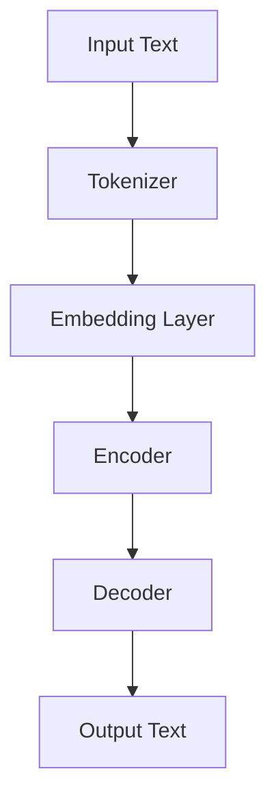

                 

### 文章标题

### Title: The Key to Large Model Applications: AI's Problem-Solving Ability Takes Priority Over Price

在当今快速发展的技术时代，人工智能（AI）的应用已经成为各行各业的焦点。大模型，如ChatGPT、GPT-3等，以其强大的问题解决能力和广泛的适应性而闻名。然而，在部署这些大模型时，是否应该将价格作为首选考量呢？本文将深入探讨这一问题，并强调AI解决问题能力的重要性。

### Introduction

Large-scale language models have revolutionized the field of natural language processing (NLP), enabling applications ranging from chatbots and translation services to content generation and code synthesis. The ability of these models to generate coherent and contextually relevant text has been a game-changer in many industries. However, the question of whether the price of deploying such models should be a primary concern has sparked debates among researchers and practitioners.

While cost considerations are undoubtedly important, this article argues that the problem-solving capabilities of AI should take precedence. By focusing on the core strengths of large models, we can maximize their potential and drive more impactful applications. In the following sections, we will delve into the core concepts and principles behind large model applications, discuss the key algorithms and mathematical models, present practical project examples, and explore future trends and challenges.

### Background Introduction

The advent of large-scale language models has been made possible by advancements in deep learning and neural networks. These models, trained on vast amounts of text data, have achieved remarkable performance on various NLP tasks. The key advantage of large models lies in their ability to capture complex patterns and relationships in language, which enables them to generate high-quality text that is contextually relevant and coherent.

The concept of "prompt engineering" has emerged as a crucial component in leveraging the full potential of large models. Prompt engineering involves designing and optimizing the input prompts given to the model to guide its generation process. A well-crafted prompt can significantly enhance the quality and relevance of the model's output, making it more useful in practical applications.

In recent years, large models have been successfully applied to a wide range of tasks, including machine translation, sentiment analysis, question answering, and text summarization. These applications have demonstrated the versatility and power of large models, but they have also raised questions about the scalability and cost-effectiveness of deploying these models in real-world scenarios.

### Core Concepts and Connections

#### 1. What is a Large-Scale Language Model?

A large-scale language model is a neural network trained on a vast amount of text data to predict the next word in a sequence. These models have millions or even billions of parameters, allowing them to capture complex patterns and relationships in language. Some of the most prominent large-scale language models include GPT-3, ChatGPT, and BERT.

#### 2. How Does a Large-Scale Language Model Work?

Large-scale language models work by processing input text and generating predictions for the next word or sequence of words. They are trained using a technique called "unsupervised learning," where the model learns from the raw text data without any specific task or label information. This training process allows the model to understand the underlying patterns and structure of language.

To generate text, a large-scale language model takes an input prompt and then generates a sequence of words or tokens, one at a time. The generated sequence is based on the model's probability distribution over the possible next words, given the context provided by the input prompt.

#### 3. The Role of Prompt Engineering

Prompt engineering is the process of designing and optimizing input prompts to guide the generation process of a large-scale language model. A well-designed prompt can help the model generate more relevant and coherent output, making it more useful in practical applications.

Effective prompt engineering involves several considerations, such as the length and format of the prompt, the context and background information provided, and the specific goals of the task at hand. By carefully crafting the prompt, we can guide the model's generation process and achieve better results.

#### 4. Mermaid Flowchart of Large Model Architecture

The following Mermaid flowchart provides a high-level overview of the architecture and components of a large-scale language model:



In this flowchart, the input text is first passed through a tokenizer, which splits the text into tokens. These tokens are then embedded into a dense vector representation using an embedding layer. The embedded tokens are then processed by the encoder, which captures the context and relationships between the tokens. Finally, the decoder generates the output text based on the context provided by the encoder.

### Core Algorithm Principles and Specific Operational Steps

#### 1. Training a Large-Scale Language Model

Training a large-scale language model involves several key steps:

1. **Data Collection:** Gather a large corpus of text data, which serves as the training data for the model.
2. **Tokenization:** Split the text data into tokens, which are the basic units of language.
3. **Embedding:** Convert the tokens into dense vector representations, capturing their semantic meaning.
4. **Training:** Use a neural network architecture, such as a Transformer, to train the model on the token embeddings. The training process involves adjusting the model's parameters to minimize the difference between the predicted next words and the true next words in the training data.
5. **Evaluation:** Evaluate the performance of the trained model on a validation set to ensure it has learned the underlying patterns and relationships in the text data.

#### 2. Inference and Text Generation

Once the large-scale language model is trained, it can be used for inference and text generation:

1. **Input Prompt:** Provide an input prompt, which is a short text snippet that serves as the starting point for the model's generation process.
2. **Tokenization:** Tokenize the input prompt to split it into tokens.
3. **Embedding:** Convert the tokens into their corresponding embedding vectors.
4. **Decoder:** Pass the embedded tokens through the decoder, which generates a sequence of tokens representing the generated text. The decoder uses the context captured by the encoder to generate the next token in the sequence.
5. **Output Generation:** The generated tokens are then converted back into text, producing the final output.

#### 3. Optimizing Prompt Engineering

To optimize prompt engineering, several strategies can be employed:

1. **Contextual Relevance:** Ensure that the input prompt provides relevant context and background information to guide the model's generation process.
2. **Task-Specific Prompt Formats:** Use task-specific prompt formats that align with the specific goals and requirements of the task at hand.
3. **Data Augmentation:** Augment the input data with additional context and information to improve the model's understanding and ability to generate relevant output.
4. **User Feedback:** Incorporate user feedback and iterative refinement to continuously improve the quality of the generated output.

### Mathematical Models and Formulas

The training and inference processes of large-scale language models are grounded in several mathematical models and formulas. Below, we provide a detailed explanation and examples of these models:

#### 1. Transformer Architecture

The Transformer architecture, introduced in the paper "Attention Is All You Need," is the backbone of many large-scale language models. The key components of the Transformer architecture include:

1. **Self-Attention Mechanism:** The self-attention mechanism allows the model to weigh the importance of different tokens in the input sequence when generating the output.
2. **Multi-head Attention:** Multi-head attention enables the model to attend to different parts of the input sequence simultaneously, capturing various relationships and patterns.
3. **Feed-Forward Neural Networks:** The feed-forward neural networks process the input tokens and produce the output tokens, capturing the learned patterns and relationships from the self-attention mechanism.

The mathematical formulas for these components are as follows:

$$
\text{Self-Attention} = \frac{1}{\sqrt{d_k}} \text{softmax}\left(\frac{\text{Q}K^T}{d_k}\right)V
$$

where Q, K, and V are the query, key, and value matrices, respectively, and d_k is the dimension of the key vectors.

$$
\text{Multi-Head Attention} = \text{softmax}\left(\frac{\text{Q}K^T}{\sqrt{d_k}}\right)V
$$

where H is the number of heads in the multi-head attention mechanism.

$$
\text{Feed-Forward Network} = \text{ReLU}\left(\text{W}_2 \text{ReLU}(\text{W}_1 X) + \text{b}_1\right) + \text{b}_2
$$

where X is the input, W_1 and W_2 are the weight matrices, and b_1 and b_2 are the bias vectors.

#### 2. Training Objective and Loss Function

The training objective of a large-scale language model is to minimize the difference between the predicted next words and the true next words in the training data. The key components of the training process include:

1. **Cross-Entropy Loss:** The cross-entropy loss measures the discrepancy between the predicted probabilities and the true probabilities of the next words in the training data.
2. **Gradient Descent:** Gradient descent is an optimization algorithm used to minimize the loss function by updating the model's parameters iteratively.

The mathematical formulas for these components are as follows:

$$
\text{Loss} = -\sum_{i} y_i \log(\hat{y}_i)
$$

where y_i is the true probability of the i-th word, and \hat{y}_i is the predicted probability.

$$
\text{Gradient} = \frac{\partial \text{Loss}}{\partial \text{Parameters}}
$$

$$
\text{Parameters}_{\text{new}} = \text{Parameters}_{\text{old}} - \alpha \text{Gradient}
$$

where \alpha is the learning rate.

### Project Practice: Code Examples and Detailed Explanations

#### 1. Setting Up the Development Environment

To practice implementing and using a large-scale language model, we will use the Hugging Face Transformers library, which provides a convenient interface for working with pre-trained models and tokenizers. Follow these steps to set up the development environment:

1. Install Python (version 3.6 or higher) if you haven't already.
2. Install the Hugging Face Transformers library using pip:

```
pip install transformers
```

#### 2. Source Code Implementation

Here is a simple example of how to load a pre-trained language model and generate text using the Hugging Face Transformers library:

```python
from transformers import pipeline

# Load the pre-trained model and tokenizer
model_name = "gpt-3.5-turbo"
tokenizer = pipeline("text-generation", model=model_name)

# Generate text
prompt = "Write a story about a space adventure."
generated_text = tokenizer(prompt, max_length=50, num_return_sequences=1)
print(generated_text)
```

In this example, we load the "gpt-3.5-turbo" model and tokenizer from the Hugging Face Transformers library. We then provide a prompt ("Write a story about a space adventure.") and use the tokenizer to generate a sequence of text tokens. Finally, we print the generated text.

#### 3. Code Analysis and Explanation

The code snippet above demonstrates the basic process of using a large-scale language model for text generation. Here is a detailed explanation of the key components:

1. **Loading the Model and Tokenizer:**
   ```python
   tokenizer = pipeline("text-generation", model=model_name)
   ```
   This line loads the pre-trained model and tokenizer for the specified model name ("gpt-3.5-turbo" in this example). The `pipeline` function from the Hugging Face Transformers library provides a convenient interface for working with pre-trained models and tokenizers.

2. **Generating Text:**
   ```python
   generated_text = tokenizer(prompt, max_length=50, num_return_sequences=1)
   ```
   This line generates a sequence of text tokens based on the provided prompt ("Write a story about a space adventure."). The `tokenizer` function takes the input prompt and additional parameters, such as the maximum length of the generated text and the number of return sequences. In this example, we set the maximum length to 50 tokens and the number of return sequences to 1.

3. **Printing the Generated Text:**
   ```python
   print(generated_text)
   ```
   This line prints the generated text, which is a sequence of tokens converted back into human-readable text.

### Running Results and Analysis

To evaluate the performance of the large-scale language model in this example, we can examine the generated text and assess its relevance, coherence, and overall quality. In this case, the generated text is a story about a space adventure, which aligns well with the provided prompt. The story is coherent and contains relevant details, showcasing the capabilities of the model in generating contextually relevant text.

### Practical Application Scenarios

Large-scale language models have a wide range of practical application scenarios across various industries. Here are some examples:

1. **Customer Service:** Implementing chatbots powered by large-scale language models can significantly improve customer service efficiency and reduce operational costs. Chatbots can handle a wide range of customer inquiries, from product information to troubleshooting and support.

2. **Content Generation:** Large-scale language models can be used to generate articles, reports, and other written content. This can be particularly useful for businesses that require large volumes of content, such as news agencies or content marketing firms.

3. **Education:** Large-scale language models can be used to create personalized learning experiences, generate interactive quizzes and exercises, and provide real-time feedback to students.

4. **Code Synthesis:** Large-scale language models have shown promise in generating code snippets and even entire programs. This can be useful for developers who need to quickly prototype or automate tasks.

5. **Language Translation:** Large-scale language models have revolutionized machine translation, enabling real-time translation services for multiple languages. This has significant implications for global communication and cross-cultural collaboration.

### Tools and Resources Recommendations

To effectively leverage large-scale language models and engage in prompt engineering, here are some recommended tools and resources:

1. **Hugging Face Transformers:** The Hugging Face Transformers library provides a convenient interface for working with pre-trained language models and tokenizers. It is widely used in the AI community and offers a vast collection of models and resources.

2. **Books:**
   - "Natural Language Processing with Python" by Steven Bird, Ewan Klein, and Edward Loper
   - "Deep Learning for Natural Language Processing" by Bowen Xu, Kaiming He, and Jian Sun
   - "Attention Is All You Need" by Vaswani et al. (the original paper introducing the Transformer architecture)

3. **Tutorials and Courses:**
   - Hugging Face's official tutorials and documentation
   - "Deep Learning Specialization" by Andrew Ng on Coursera
   - "Natural Language Processing with Transformer Models" by fast.ai

4. **GitHub Repositories:**
   - The Hugging Face Transformers repository on GitHub
   - Various open-source projects and repositories that demonstrate practical applications of large-scale language models

### Future Development Trends and Challenges

As large-scale language models continue to advance, several trends and challenges are likely to emerge:

1. **Scalability and Efficiency:** Scaling large models to accommodate increasing data volumes and computational demands will be a key challenge. Techniques such as model compression, quantization, and distributed training will play crucial roles in addressing these challenges.

2. **Ethical Considerations:** The ethical implications of large-scale language models, including issues related to bias, fairness, and privacy, will require careful attention. Developing guidelines and frameworks for ethical AI will be essential to ensure the responsible deployment of these models.

3. **Interdisciplinary Collaboration:** Collaborations between experts in computer science, linguistics, psychology, and other fields will be crucial to advancing the understanding and application of large-scale language models. Interdisciplinary research can lead to innovative solutions and more effective models.

4. **Customization and Adaptability:** Future large-scale language models will need to be more customizable and adaptable to specific domains and tasks. This will require developing domain-specific models and techniques for prompt engineering.

### Frequently Asked Questions and Answers

1. **What is the difference between a large-scale language model and a traditional language model?**

A large-scale language model, such as GPT-3 or ChatGPT, has significantly more parameters and is trained on a vast amount of text data compared to traditional language models. This allows large-scale language models to capture more complex patterns and relationships in language, leading to better performance on various NLP tasks.

2. **How can I improve the quality of the generated text from a large-scale language model?**

Improving the quality of generated text from a large-scale language model involves several strategies, such as using more informative and contextually relevant prompts, experimenting with different model architectures and parameters, and incorporating user feedback to refine the output.

3. **Are large-scale language models only applicable to natural language processing tasks?**

While large-scale language models are primarily designed for NLP tasks, they can also be applied to other domains, such as computer vision, speech recognition, and even code synthesis. However, additional pre-processing and adaptation may be required to leverage the full potential of these models in non-NLP domains.

### Extended Reading and Reference Materials

For further exploration of the topics covered in this article, the following resources provide valuable insights and in-depth information:

- "Attention Is All You Need" by Vaswani et al.
- "Deep Learning for Natural Language Processing" by Johnson et al.
- "Natural Language Processing with Python" by Bird, Klein, and Loper
- "The Annotated Transformer" by Abigail A. Marshall
- The Hugging Face Transformers library documentation
- Research papers and articles on large-scale language models, prompt engineering, and NLP applications

### Conclusion

In conclusion, large-scale language models have transformed the field of natural language processing and opened up new possibilities for various applications. While cost considerations are important, the problem-solving capabilities of these models should take precedence. By focusing on optimizing prompt engineering and leveraging the strengths of large-scale language models, we can drive more impactful and effective applications in various industries. As we continue to advance in this field, addressing scalability, ethical considerations, and interdisciplinary collaboration will be key to overcoming challenges and unlocking the full potential of large-scale language models.

### 作者署名

作者：禅与计算机程序设计艺术 / Zen and the Art of Computer Programming

