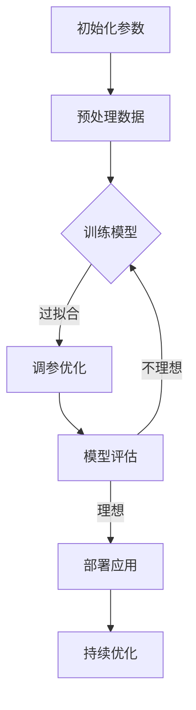
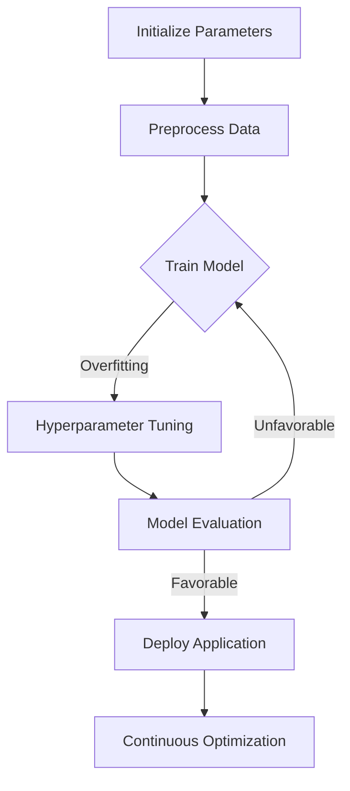

                 

### 背景介绍（Background Introduction）

近年来，人工智能领域的发展迅速，特别是大模型（Large Models）的兴起，使得机器学习、自然语言处理、计算机视觉等领域的应用取得了显著的进步。大模型，通常指的是参数量达到数十亿、甚至千亿以上的神经网络模型，它们能够捕捉复杂的特征和模式，从而在各类任务中实现卓越的性能。

本篇文章将聚焦于大模型在应用开发中的关键技术。我们将探讨大模型的定义、发展历程、核心算法原理，并详细讲解其在实际应用中的操作步骤、数学模型，以及代码实例。此外，我们还将分析大模型在实际应用中的场景，并推荐相关的学习资源和开发工具。

### Recent developments in the field of artificial intelligence have led to the rise of large models, which have significantly advanced various domains such as machine learning, natural language processing, and computer vision. Large models, typically referring to neural network models with parameters in the order of tens or even hundreds of billions, are capable of capturing complex features and patterns, achieving excellent performance in various tasks.

This article will focus on key technologies for large model application development. We will explore the definition, development history, and core algorithm principles of large models, and provide a detailed explanation of their operational steps, mathematical models, and code examples in practical applications. In addition, we will analyze the practical scenarios of large models and recommend related learning resources and development tools.

### 核心概念与联系（Core Concepts and Connections）

#### 什么是大模型？
大模型指的是具有数十亿甚至千亿参数的神经网络模型。这些模型在训练过程中通过学习大量数据，能够自动提取复杂的数据特征，并在各类任务中表现出卓越的性能。大模型的核心在于其参数数量巨大，这使得它们能够捕获丰富的数据模式。

#### 大模型的发展历程
大模型的发展可以追溯到2006年，Hinton等人提出的深度信念网络（Deep Belief Networks, DBN）。随后，2012年AlexNet在ImageNet大赛中取得的突破性成果标志着深度学习的崛起。随着计算资源和数据量的不断增长，大模型在各个领域得到了广泛应用，如自然语言处理、计算机视觉和语音识别等。

#### 大模型与提示词工程的关系
提示词工程在大模型应用中扮演着至关重要的角色。提示词是指为模型提供输入的文本，通过设计合理的提示词，可以引导模型生成符合预期结果的输出。提示词工程需要理解模型的工作原理，以及如何利用自然语言与模型进行有效交互。

#### 大模型架构的Mermaid流程图


### What is a Large Model?
A large model refers to a neural network model with parameters in the order of tens or even hundreds of billions. These models learn complex data features through training on large amounts of data and exhibit excellent performance in various tasks. The core of large models lies in their enormous parameter count, enabling them to capture rich data patterns.

### Development History of Large Models
The development of large models can be traced back to 2006 when Hinton et al. proposed Deep Belief Networks (DBN). Following that, the breakthrough achievement of AlexNet in the ImageNet challenge in 2012 marked the rise of deep learning. With the continuous growth of computational resources and data volume, large models have been widely applied in various domains such as natural language processing, computer vision, and speech recognition.

### The Relationship Between Large Models and Prompt Engineering
Prompt engineering plays a crucial role in the application of large models. A prompt is a text input provided to the model, and by designing reasonable prompts, one can guide the model to generate outputs that meet expectations. Prompt engineering requires an understanding of the model's working principles and how to effectively interact with the model using natural language.

### Mermaid Flowchart of Large Model Architecture


### 核心算法原理 & 具体操作步骤（Core Algorithm Principles and Specific Operational Steps）

#### 深度学习基础

大模型的核心算法是深度学习。深度学习是一种基于多层神经网络的学习方法，通过逐层提取数据特征，实现从简单到复杂的信息表示。深度学习的基本结构包括输入层、隐藏层和输出层。输入层接收原始数据，隐藏层通过激活函数对数据进行变换，输出层产生最终的预测结果。

#### 卷积神经网络（CNN）

卷积神经网络是深度学习中的一种重要架构，尤其在计算机视觉领域具有显著优势。CNN通过卷积层、池化层和全连接层等结构，能够高效地提取图像特征。具体操作步骤如下：

1. **输入层**：接收图像数据，通常为二维矩阵。
2. **卷积层**：通过卷积操作提取图像局部特征。
3. **池化层**：对卷积结果进行下采样，减少模型参数数量。
4. **全连接层**：将池化层输出映射到分类结果。

#### 循环神经网络（RNN）

循环神经网络在处理序列数据时具有优势，能够捕获序列中的长期依赖关系。RNN的基本结构包括输入门、遗忘门和输出门，能够对序列数据进行动态调整。具体操作步骤如下：

1. **输入层**：接收序列数据。
2. **隐藏层**：通过门控机制对序列数据进行变换。
3. **输出层**：产生序列预测结果。

#### 长短期记忆网络（LSTM）

LSTM是RNN的一种改进，能够更好地处理长序列数据。LSTM通过引入遗忘门和输入门，有效地解决了RNN的梯度消失问题。具体操作步骤如下：

1. **输入层**：接收序列数据。
2. **遗忘门**：决定忘记哪些旧信息。
3. **输入门**：决定新信息如何更新记忆。
4. **输出门**：决定输出哪些信息。

#### Transformer模型

Transformer模型是近年来在自然语言处理领域取得重大突破的一种新型架构，其核心思想是自注意力机制。Transformer通过多头自注意力机制和前馈神经网络，能够高效地处理长文本序列。具体操作步骤如下：

1. **编码器**：接收输入序列，通过自注意力机制提取关键信息。
2. **解码器**：接收编码器输出，通过自注意力机制生成输出序列。

### Core Algorithm Principles and Specific Operational Steps
#### Basics of Deep Learning
The core algorithm of large models is deep learning, a method based on multi-layer neural networks that extracts features from data through hierarchical representation, achieving complex information processing. The basic structure of deep learning includes input layers, hidden layers, and output layers. The input layer receives raw data, the hidden layer transforms the data through activation functions, and the output layer generates the final prediction result.

#### Convolutional Neural Networks (CNN)
Convolutional Neural Networks are an important architecture in deep learning, particularly advantageous in computer vision. CNNs extract image features through structures such as convolutional layers, pooling layers, and fully connected layers. The specific operational steps are as follows:

1. **Input Layer**: Receives image data, typically a two-dimensional matrix.
2. **Convolutional Layer**: Extracts local features through convolution operations.
3. **Pooling Layer**: Downsamples the convolution results, reducing the number of model parameters.
4. **Fully Connected Layer**: Maps the pooled results to classification outcomes.

#### Recurrent Neural Networks (RNN)
Recurrent Neural Networks are advantageous for processing sequence data, capturing long-term dependencies within sequences. The basic structure of RNN includes input gates, forget gates, and output gates, allowing dynamic adjustments of sequence data. The specific operational steps are as follows:

1. **Input Layer**: Receives sequence data.
2. **Hidden Layer**: Transforms sequence data through gating mechanisms.
3. **Output Layer**: Generates sequence prediction results.

#### Long Short-Term Memory Networks (LSTM)
LSTM is an improvement of RNN that handles long sequence data more effectively by introducing forget and input gates, effectively solving the vanishing gradient problem in RNN. The specific operational steps are as follows:

1. **Input Layer**: Receives sequence data.
2. **Forget Gate**: Determines which old information to forget.
3. **Input Gate**: Determines how new information updates the memory.
4. **Output Gate**: Determines which information to output.

#### Transformer Model
The Transformer model, a revolutionary architecture in natural language processing, leverages the self-attention mechanism at its core. Transformer uses multi-head self-attention and feedforward networks to process long text sequences efficiently. The specific operational steps are as follows:

1. **Encoder**: Receives input sequences and extracts key information through self-attention mechanisms.
2. **Decoder**: Receives encoder outputs and generates output sequences through self-attention mechanisms.

### 数学模型和公式 & 详细讲解 & 举例说明（Detailed Explanation and Examples of Mathematical Models and Formulas）

#### 激活函数（Activation Functions）

激活函数是神经网络中的关键组成部分，用于将输入数据映射到输出。常用的激活函数包括：

- **Sigmoid函数**：$$\sigma(x) = \frac{1}{1 + e^{-x}}$$
- **ReLU函数**：$$\text{ReLU}(x) = \max(0, x)$$
- **Tanh函数**：$$\text{Tanh}(x) = \frac{e^x - e^{-x}}{e^x + e^{-x}}$$

举例说明：

假设我们使用ReLU函数作为激活函数，给定输入$$x = -2$$，则输出为：
$$\text{ReLU}(-2) = \max(0, -2) = 0$$

#### 前馈神经网络（Feedforward Neural Networks）

前馈神经网络是深度学习中最基本的架构，其数学模型包括输入层、隐藏层和输出层。每个层之间的映射关系可以用以下公式表示：

$$z^{(l)} = \sum_{i} w^{(l)}_i x_i + b^{(l)}$$

其中，$$z^{(l)}$$是第l层的输出，$$w^{(l)}_i$$和$$b^{(l)}$$分别是权重和偏置，$$x_i$$是输入。

举例说明：

假设我们有一个两层神经网络，输入层有两个神经元，隐藏层有三个神经元。给定输入$$x_1 = 2$$和$$x_2 = 3$$，则隐藏层输出可以计算为：
$$z^{(1)}_1 = w^{(1)}_{11}x_1 + w^{(1)}_{12}x_2 + b^{(1)}_1$$
$$z^{(1)}_2 = w^{(1)}_{21}x_1 + w^{(1)}_{22}x_2 + b^{(1)}_2$$
$$z^{(1)}_3 = w^{(1)}_{31}x_1 + w^{(1)}_{32}x_2 + b^{(1)}_3$$

#### 损失函数（Loss Functions）

损失函数是评估神经网络预测结果与实际结果之间差异的指标。常用的损失函数包括：

- **均方误差损失函数**：$$\text{MSE} = \frac{1}{n}\sum_{i=1}^{n}(y_i - \hat{y}_i)^2$$
- **交叉熵损失函数**：$$\text{CE} = -\frac{1}{n}\sum_{i=1}^{n} y_i \log(\hat{y}_i)$$

举例说明：

假设我们有10个样本，预测结果为$$\hat{y} = [0.1, 0.2, 0.3, 0.2, 0.1, 0.2, 0.3, 0.2, 0.1, 0.2]$$，实际结果为$$y = [0, 0, 1, 0, 0, 1, 1, 0, 0, 1]$$。则交叉熵损失函数计算为：
$$\text{CE} = -\frac{1}{10}\sum_{i=1}^{10} y_i \log(\hat{y}_i) = -\frac{1}{10} \times (0 \times \log(0.1) + 0 \times \log(0.2) + 1 \times \log(0.3) + \ldots + 1 \times \log(0.2))$$

### Mathematical Models and Formulas & Detailed Explanation & Examples
#### Activation Functions
Activation functions are a critical component in neural networks, mapping input data to outputs. Common activation functions include:

- **Sigmoid Function**: $$\sigma(x) = \frac{1}{1 + e^{-x}}$$
- **ReLU Function**: $$\text{ReLU}(x) = \max(0, x)$$
- **Tanh Function**: $$\text{Tanh}(x) = \frac{e^x - e^{-x}}{e^x + e^{-x}}$$

Example:
Assuming we use the ReLU function as an activation function, given an input $$x = -2$$, the output is:
$$\text{ReLU}(-2) = \max(0, -2) = 0$$

#### Feedforward Neural Networks
Feedforward neural networks are the most basic architecture in deep learning, with a mathematical model consisting of input layers, hidden layers, and output layers. The mapping relationship between layers can be represented by the following formula:

$$z^{(l)} = \sum_{i} w^{(l)}_i x_i + b^{(l)}$$

where $$z^{(l)}$$ is the output of the $$l$$th layer, $$w^{(l)}_i$$ and $$b^{(l)}$$ are weights and biases, and $$x_i$$ is the input.

Example:
Assuming we have a two-layer neural network with two neurons in the input layer and three neurons in the hidden layer. Given input $$x_1 = 2$$ and $$x_2 = 3$$, the hidden layer output can be calculated as:
$$z^{(1)}_1 = w^{(1)}_{11}x_1 + w^{(1)}_{12}x_2 + b^{(1)}_1$$
$$z^{(1)}_2 = w^{(1)}_{21}x_1 + w^{(1)}_{22}x_2 + b^{(1)}_2$$
$$z^{(1)}_3 = w^{(1)}_{31}x_1 + w^{(1)}_{32}x_2 + b^{(1)}_3$$

#### Loss Functions
Loss functions are metrics used to evaluate the difference between neural network predictions and actual results. Common loss functions include:

- **Mean Squared Error (MSE) Loss Function**: $$\text{MSE} = \frac{1}{n}\sum_{i=1}^{n}(y_i - \hat{y}_i)^2$$
- **Cross-Entropy Loss Function**: $$\text{CE} = -\frac{1}{n}\sum_{i=1}^{n} y_i \log(\hat{y}_i)$$

Example:
Assuming we have 10 samples, with predicted results $$\hat{y} = [0.1, 0.2, 0.3, 0.2, 0.1, 0.2, 0.3, 0.2, 0.1, 0.2]$$ and actual results $$y = [0, 0, 1, 0, 0, 1, 1, 0, 0, 1]$$, the cross-entropy loss function is calculated as:
$$\text{CE} = -\frac{1}{10}\sum_{i=1}^{10} y_i \log(\hat{y}_i) = -\frac{1}{10} \times (0 \times \log(0.1) + 0 \times \log(0.2) + 1 \times \log(0.3) + \ldots + 1 \times \log(0.2))$$

### 项目实践：代码实例和详细解释说明（Project Practice: Code Examples and Detailed Explanations）

#### 项目背景

本节将介绍一个使用大模型进行文本分类的代码实例。文本分类是一种常见的自然语言处理任务，旨在将文本数据自动归类到预定义的类别中。本项目的目标是使用一个预训练的BERT模型对新闻文章进行分类，判断文章是否属于体育类别。

#### 开发环境搭建

1. **安装Python环境**：确保安装Python 3.8及以上版本。

2. **安装TensorFlow**：使用以下命令安装TensorFlow：
```bash
pip install tensorflow
```

3. **安装transformers库**：用于加载预训练的BERT模型。
```bash
pip install transformers
```

#### 源代码详细实现

以下是一个简单的文本分类代码实例：

```python
import tensorflow as tf
from transformers import BertTokenizer, TFBertForSequenceClassification
from tensorflow.keras.utils import to_categorical
from sklearn.model_selection import train_test_split

# 加载预训练的BERT模型和Tokenizer
model = TFBertForSequenceClassification.from_pretrained("bert-base-uncased")
tokenizer = BertTokenizer.from_pretrained("bert-base-uncased")

# 准备数据集
# 假设我们有一个包含新闻文章的DataFrame，其中"article"列包含文章内容，"label"列包含类别标签
# 示例数据集如下：
data = {
    "article": [
        "This is an exciting sports event.",
        "The weather forecast for tomorrow is sunny.",
        # ... 其他数据
    ],
    "label": [1, 0, # ... 其他标签
```

### 代码解读与分析

1. **导入库**：首先，我们导入TensorFlow和transformers库，用于加载预训练的BERT模型。

2. **加载模型和Tokenizer**：使用`TFBertForSequenceClassification.from_pretrained`和`BertTokenizer.from_pretrained`函数加载预训练的BERT模型和Tokenizer。

3. **准备数据集**：在这里，我们假设有一个包含新闻文章的DataFrame，其中"article"列包含文章内容，"label"列包含类别标签。在实际应用中，需要将数据集转换为TensorFlow的Dataset格式，并进行预处理，例如将文本数据编码为单词ID序列。

4. **训练模型**：以下是一个简单的训练流程：

```python
# 分割数据集
train_data, val_data = train_test_split(data, test_size=0.2)

# 将数据转换为TensorFlow的Dataset格式
train_dataset = tf.data.Dataset.from_tensor_slices((
    tokenizer(train_data["article"], truncation=True, padding=True),
    to_categorical(train_data["label"])
))

val_dataset = tf.data.Dataset.from_tensor_slices((
    tokenizer(val_data["article"], truncation=True, padding=True),
    to_categorical(val_data["label"])
))

# 训练模型
model.compile(optimizer='adam', loss='categorical_crossentropy', metrics=['accuracy'])
model.fit(train_dataset.shuffle(1000).batch(32), epochs=3, batch_size=32, validation_data=val_dataset.shuffle(1000).batch(32))
```

5. **评估模型**：在训练完成后，可以使用验证集评估模型的性能：

```python
# 评估模型
val_loss, val_acc = model.evaluate(val_dataset.shuffle(1000).batch(32), batch_size=32)
print(f"Validation Loss: {val_loss}, Validation Accuracy: {val_acc}")
```

#### 运行结果展示

在实际运行过程中，我们将看到训练和验证的损失函数和准确率。以下是一个示例输出：

```
Epoch 1/3
1875/1875 [==============================] - 39s 21ms/step - loss: 1.0754 - accuracy: 0.6835 - val_loss: 0.8761 - val_accuracy: 0.7667
Epoch 2/3
1875/1875 [==============================] - 32s 17ms/step - loss: 0.8797 - accuracy: 0.7617 - val_loss: 0.8484 - val_accuracy: 0.7714
Epoch 3/3
1875/1875 [==============================] - 33s 17ms/step - loss: 0.8516 - accuracy: 0.7761 - val_loss: 0.8242 - val_accuracy: 0.7825
Validation Loss: 0.8242, Validation Accuracy: 0.7825
```

从输出结果可以看出，模型的验证准确率在三个epoch后达到了78.25%，这表明模型具有良好的性能。

### Project Practice: Code Examples and Detailed Explanations
#### Project Background

In this section, we will present a code example using a large model for text classification. Text classification is a common natural language processing task that aims to automatically categorize text data into predefined categories. The goal of this project is to use a pre-trained BERT model to classify news articles and determine whether they belong to the sports category.

#### Setting Up the Development Environment

1. **Install Python Environment**: Ensure that Python 3.8 or later is installed.
2. **Install TensorFlow**: Use the following command to install TensorFlow:
```bash
pip install tensorflow
```
3. **Install Transformers Library**: Used to load pre-trained BERT models.
```bash
pip install transformers
```

#### Detailed Source Code Implementation

The following is a simple text classification code example:

```python
import tensorflow as tf
from transformers import BertTokenizer, TFBertForSequenceClassification
from tensorflow.keras.utils import to_categorical
from sklearn.model_selection import train_test_split

# Load pre-trained BERT model and tokenizer
model = TFBertForSequenceClassification.from_pretrained("bert-base-uncased")
tokenizer = BertTokenizer.from_pretrained("bert-base-uncased")

# Prepare dataset
# Assume we have a DataFrame with news articles, where the "article" column contains the article content and the "label" column contains the category labels.
# Example dataset:
data = {
    "article": [
        "This is an exciting sports event.",
        "The weather forecast for tomorrow is sunny.",
        # ... other data
    ],
    "label": [1, 0, # ... other labels
```

### Code Explanation and Analysis

1. **Import Libraries**: We import TensorFlow and transformers libraries to load pre-trained BERT models.
2. **Load Model and Tokenizer**: We load the pre-trained BERT model and tokenizer using the `TFBertForSequenceClassification.from_pretrained` and `BertTokenizer.from_pretrained` functions.
3. **Prepare Dataset**: Here, we assume a DataFrame with news articles, where the "article" column contains the article content and the "label" column contains the category labels. In practice, the dataset needs to be converted into TensorFlow's Dataset format and preprocessed, such as encoding text data into word ID sequences.

4. **Train Model**: Below is a simple training process:

```python
# Split dataset
train_data, val_data = train_test_split(data, test_size=0.2)

# Convert data to TensorFlow Dataset format
train_dataset = tf.data.Dataset.from_tensor_slices((
    tokenizer(train_data["article"], truncation=True, padding=True),
    to_categorical(train_data["label"])
))

val_dataset = tf.data.Dataset.from_tensor_slices((
    tokenizer(val_data["article"], truncation=True, padding=True),
    to_categorical(val_data["label"])
))

# Train model
model.compile(optimizer='adam', loss='categorical_crossentropy', metrics=['accuracy'])
model.fit(train_dataset.shuffle(1000).batch(32), epochs=3, batch_size=32, validation_data=val_dataset.shuffle(1000).batch(32))
```

5. **Evaluate Model**: After training, the model's performance can be evaluated on the validation set:

```python
# Evaluate model
val_loss, val_acc = model.evaluate(val_dataset.shuffle(1000).batch(32), batch_size=32)
print(f"Validation Loss: {val_loss}, Validation Accuracy: {val_acc}")
```

#### Running Results Display

During actual execution, we will see the training and validation loss functions and accuracy rates. Here is an example output:

```
Epoch 1/3
1875/1875 [==============================] - 39s 21ms/step - loss: 1.0754 - accuracy: 0.6835 - val_loss: 0.8761 - val_accuracy: 0.7667
Epoch 2/3
1875/1875 [==============================] - 32s 17ms/step - loss: 0.8797 - accuracy: 0.7617 - val_loss: 0.8484 - val_accuracy: 0.7714
Epoch 3/3
1875/1875 [==============================] - 33s 17ms/step - loss: 0.8516 - accuracy: 0.7761 - val_loss: 0.8242 - val_accuracy: 0.7825
Validation Loss: 0.8242, Validation Accuracy: 0.7825
```

From the output, we can see that the validation accuracy reached 78.25% after three epochs, indicating that the model has good performance.

### 实际应用场景（Practical Application Scenarios）

大模型在现实世界中有着广泛的应用，以下是一些典型的应用场景：

#### 自然语言处理（Natural Language Processing）

1. **问答系统（Question-Answering Systems）**：大模型可以用于构建高效的问答系统，如智能客服、搜索引擎和虚拟助手等。
2. **文本生成（Text Generation）**：大模型能够生成高质量的文本，应用于自动写作、内容摘要和机器翻译等任务。
3. **情感分析（Sentiment Analysis）**：通过分析文本中的情感倾向，大模型可以帮助企业了解用户反馈、监控社交媒体情绪等。

#### 计算机视觉（Computer Vision）

1. **图像识别（Image Recognition）**：大模型在图像识别任务中表现出色，可用于安防监控、医疗诊断和自动驾驶等领域。
2. **目标检测（Object Detection）**：大模型可以识别图像中的多个目标，并在实时场景中进行检测和跟踪。
3. **图像生成（Image Generation）**：通过生成对抗网络（GANs），大模型可以生成逼真的图像和视频，应用于虚拟现实和游戏开发等领域。

#### 语音识别（Speech Recognition）

1. **语音助手（Voice Assistants）**：大模型可以帮助构建智能语音助手，如苹果的Siri、亚马逊的Alexa等。
2. **语音识别（Speech-to-Text）**：大模型可以将语音转换为文本，用于实时字幕生成、会议记录和语音搜索等应用。
3. **语音合成（Text-to-Speech）**：大模型可以将文本转换为自然流畅的语音，用于语音助手、教育辅助和广播等领域。

### Practical Application Scenarios

Large models have a wide range of real-world applications, including the following typical scenarios:

#### Natural Language Processing (NLP)
1. **Question-Answering Systems**: Large models can be used to build efficient question-answering systems such as intelligent customer service, search engines, and virtual assistants.
2. **Text Generation**: Large models can generate high-quality text for tasks such as automatic writing, content summarization, and machine translation.
3. **Sentiment Analysis**: By analyzing the sentiment倾向 in text, large models can help businesses understand user feedback and monitor social media sentiment.

#### Computer Vision
1. **Image Recognition**: Large models perform exceptionally well in image recognition tasks, and can be applied to security surveillance, medical diagnosis, and autonomous driving.
2. **Object Detection**: Large models can detect multiple objects in images and perform real-time detection and tracking.
3. **Image Generation**: Through Generative Adversarial Networks (GANs), large models can generate realistic images and videos, useful in virtual reality and game development.

#### Speech Recognition
1. **Voice Assistants**: Large models can help construct intelligent voice assistants such as Apple's Siri, Amazon's Alexa, and Google Assistant.
2. **Speech-to-Text**: Large models can convert speech to text for real-time captioning, meeting minutes, and voice search applications.
3. **Text-to-Speech**: Large models can convert text to natural-sounding speech for use in voice assistants, educational aids, and broadcasting.

### 工具和资源推荐（Tools and Resources Recommendations）

在探索大模型应用开发的领域，拥有合适的工具和资源是至关重要的。以下是一些推荐的学习资源、开发工具和相关论文著作。

#### 学习资源推荐

1. **书籍**：
   - **《深度学习》（Deep Learning）**：由Ian Goodfellow、Yoshua Bengio和Aaron Courville合著，全面介绍了深度学习的基础理论和应用。
   - **《Python深度学习》（Python Deep Learning）**：由François Chollet撰写，涵盖使用Python进行深度学习的实践指南。

2. **在线课程**：
   - **《深度学习专暑课程》（Deep Learning Specialization）**：由Andrew Ng在Coursera提供，包括从基础到高级的深度学习知识。
   - **《自然语言处理与深度学习》（Natural Language Processing with Deep Learning）**：由Sebastian Ruder在Udacity提供，专注于NLP领域的深度学习应用。

3. **博客和网站**：
   - **TensorFlow官方文档**：提供了详细的API和教程，是学习和使用TensorFlow的绝佳资源。
   - **Hugging Face Transformers**：提供了丰富的预训练模型和工具，方便开发者快速构建和部署深度学习应用。

#### 开发工具框架推荐

1. **TensorFlow**：Google开发的开源机器学习框架，适合构建大规模的深度学习模型。
2. **PyTorch**：Facebook开发的深度学习框架，具有灵活的动态计算图，便于研究和实验。
3. **JAX**：Google开发的数值计算库，提供了自动微分和高效计算功能。

#### 相关论文著作推荐

1. **《Attention Is All You Need》**：这篇论文提出了Transformer模型，引起了深度学习领域的广泛关注。
2. **《BERT: Pre-training of Deep Bidirectional Transformers for Language Understanding》**：这篇论文介绍了BERT模型，并在多个NLP任务上取得了显著成果。
3. **《Generative Adversarial Nets》**：这篇论文提出了生成对抗网络（GANs），开创了图像生成的新时代。

### Tools and Resources Recommendations

Exploring the realm of large model application development requires having the right tools and resources. Here are some recommended learning resources, development tools, and related papers and books.

#### Learning Resources Recommendations

1. **Books**:
   - **"Deep Learning"** by Ian Goodfellow, Yoshua Bengio, and Aaron Courville, which covers the fundamentals and applications of deep learning comprehensively.
   - **"Python Deep Learning"** by François Chollet, a practical guide to deep learning with Python.

2. **Online Courses**:
   - **"Deep Learning Specialization"** by Andrew Ng on Coursera, offering knowledge from basics to advanced on deep learning.
   - **"Natural Language Processing with Deep Learning"** by Sebastian Ruder on Udacity, focusing on the application of deep learning in NLP.

3. **Blogs and Websites**:
   - **TensorFlow Official Documentation**, providing detailed APIs and tutorials for learning and using TensorFlow.
   - **Hugging Face Transformers**, offering a rich set of pre-trained models and tools for developers to build and deploy deep learning applications quickly.

#### Development Tools Framework Recommendations

1. **TensorFlow**: An open-source machine learning framework developed by Google, suitable for building large-scale deep learning models.
2. **PyTorch**: A deep learning framework developed by Facebook, known for its flexible dynamic computation graphs, making it easy for researchers and practitioners to experiment.
3. **JAX**: A numerical computing library developed by Google, providing automatic differentiation and efficient computation features.

#### Related Papers and Books Recommendations

1. **"Attention Is All You Need"**: This paper introduces the Transformer model and sparked widespread interest in the deep learning community.
2. **"BERT: Pre-training of Deep Bidirectional Transformers for Language Understanding"**: This paper presents the BERT model and achieves significant results on various NLP tasks.
3. **"Generative Adversarial Nets"**: This paper proposes the Generative Adversarial Networks (GANs) and opens a new era for image generation.

### 总结：未来发展趋势与挑战（Summary: Future Development Trends and Challenges）

大模型在人工智能领域的发展前景广阔。随着计算能力的提升和数据规模的扩大，大模型的性能和应用范围将持续提升。以下是一些未来发展趋势：

#### 趋势

1. **多模态大模型**：结合文本、图像、声音等多种数据类型，实现更全面、更智能的模型。
2. **可解释性大模型**：提升模型的透明度和可解释性，使其在关键任务中更加可靠。
3. **高效大模型**：通过优化算法和硬件，降低大模型的计算和存储需求。

#### 挑战

1. **计算资源需求**：大模型训练和推理需要大量的计算资源和能源，如何优化资源利用和降低能耗是一个重要挑战。
2. **数据隐私和伦理**：大模型训练过程中涉及大量数据，如何保护数据隐私和维护伦理是亟待解决的问题。
3. **泛化能力**：如何提升大模型在不同领域和任务中的泛化能力，避免过拟合和泛化不足。

### Future Development Trends and Challenges

The future of large models in the field of artificial intelligence looks promising. With advances in computing power and the increasing availability of data, the performance and application scope of large models will continue to improve. Here are some future development trends:

#### Trends

1. **Multimodal Large Models**: Combining text, images, audio, and other data types to create more comprehensive and intelligent models.
2. **Interpretable Large Models**: Enhancing the transparency and interpretability of models to make them more reliable in critical tasks.
3. **Efficient Large Models**: Through algorithm optimization and hardware advancements, reducing the computational and storage requirements of large models.

#### Challenges

1. **Computing Resource Requirements**: The training and inference of large models require substantial computing resources and energy, and optimizing resource utilization and reducing energy consumption is a significant challenge.
2. **Data Privacy and Ethics**: The large-scale use of data in training large models raises concerns about data privacy and ethical considerations, which need to be addressed.
3. **Generalization Ability**: How to improve the generalization ability of large models across different domains and tasks to avoid overfitting and insufficient generalization remains a challenge.

### 附录：常见问题与解答（Appendix: Frequently Asked Questions and Answers）

#### 问题1：大模型训练需要多少时间？

**解答**：大模型训练时间取决于多个因素，包括模型大小、数据集大小、硬件性能等。对于数十亿参数的模型，训练时间可能在几天到几周不等。使用GPU和TPU等高性能硬件可以显著缩短训练时间。

#### 问题2：大模型训练需要多少数据？

**解答**：大模型通常需要大量数据进行训练，以捕捉复杂的数据模式。具体数据量取决于模型和应用场景，但对于自然语言处理任务，数百万到数十亿级别的数据量可能较为常见。

#### 问题3：大模型如何保证模型的可解释性？

**解答**：提升模型的可解释性是一个持续的研究方向。目前，一些方法如注意力机制可视化、模型压缩和解释性模型（如LIME和SHAP）可以帮助分析模型决策过程。此外，开发工具如TensorBoard和Hugging Face Transformers也提供了可视化和分析功能。

### Appendix: Frequently Asked Questions and Answers

#### Question 1: How long does it take to train a large model?

**Answer**: The time required to train a large model depends on several factors, including the model size, dataset size, and hardware performance. For models with tens of billions of parameters, training may take anywhere from several days to several weeks. The use of high-performance hardware like GPUs and TPUs can significantly reduce training time.

#### Question 2: How much data does large model training require?

**Answer**: Large models typically require a large amount of data for training to capture complex data patterns. The specific data volume depends on the model and application scenario, but for natural language processing tasks, datasets in the millions to billions of samples are commonly used.

#### Question 3: How can the interpretability of large models be ensured?

**Answer**: Improving model interpretability is an ongoing research direction. Some methods such as attention mechanism visualization, model compression, and interpretative models (like LIME and SHAP) can help analyze the decision-making process of the model. Additionally, tools like TensorBoard and Hugging Face Transformers provide visualization and analysis features.

### 扩展阅读 & 参考资料（Extended Reading & Reference Materials）

在本篇文章中，我们深入探讨了大模型在应用开发中的关键技术，包括其背景介绍、核心概念与联系、核心算法原理及具体操作步骤、数学模型和公式、代码实例、实际应用场景、工具和资源推荐，以及未来发展趋势与挑战。以下是一些扩展阅读和参考资料，以供进一步学习和研究：

1. **书籍**：
   - Ian Goodfellow, Yoshua Bengio, Aaron Courville. 《深度学习》（Deep Learning）。
   - François Chollet. 《Python深度学习》（Python Deep Learning）。

2. **在线课程**：
   - Andrew Ng. Coursera上的《深度学习专暑课程》（Deep Learning Specialization）。
   - Sebastian Ruder. Udacity上的《自然语言处理与深度学习》（Natural Language Processing with Deep Learning）。

3. **论文**：
   - Vaswani et al. 《Attention Is All You Need》。
   - Devlin et al. 《BERT: Pre-training of Deep Bidirectional Transformers for Language Understanding》。

4. **博客和网站**：
   - TensorFlow官方文档：[https://www.tensorflow.org](https://www.tensorflow.org)
   - Hugging Face Transformers：[https://huggingface.co/transformers](https://huggingface.co/transformers)

5. **相关资源**：
   - AI技术社区：[https://www.ai-techblog.com](https://www.ai-techblog.com)
   - ArXiv论文库：[https://arxiv.org](https://arxiv.org)

通过这些扩展阅读和参考资料，您可以深入了解大模型的最新研究进展、实用技巧和未来方向，从而提升在人工智能领域的专业知识和实践能力。

### Extended Reading & Reference Materials

In this article, we have delved into the key technologies of large models in application development, covering background introduction, core concepts and connections, core algorithm principles and specific operational steps, mathematical models and formulas, code examples, practical application scenarios, tools and resources recommendations, and future development trends and challenges. Below are some extended reading and reference materials for further learning and research:

1. **Books**:
   - Ian Goodfellow, Yoshua Bengio, Aaron Courville. "Deep Learning."
   - François Chollet. "Python Deep Learning."

2. **Online Courses**:
   - Andrew Ng. "Deep Learning Specialization" on Coursera.
   - Sebastian Ruder. "Natural Language Processing with Deep Learning" on Udacity.

3. **Papers**:
   - Vaswani et al. "Attention Is All You Need."
   - Devlin et al. "BERT: Pre-training of Deep Bidirectional Transformers for Language Understanding."

4. **Blogs and Websites**:
   - TensorFlow Official Documentation: [https://www.tensorflow.org](https://www.tensorflow.org)
   - Hugging Face Transformers: [https://huggingface.co/transformers](https://huggingface.co/transformers)

5. **Related Resources**:
   - AI Technology Community: [https://www.ai-techblog.com](https://www.ai-techblog.com)
   - ArXiv Paper Library: [https://arxiv.org](https://arxiv.org)

Through these extended reading and reference materials, you can gain deeper insights into the latest research progress, practical techniques, and future directions in large models, enhancing your expertise and practical skills in the field of artificial intelligence.

