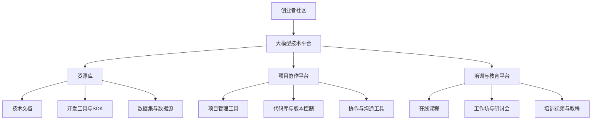

                 

### 文章标题

**大模型时代的创业者社区：资源共享、经验交流与合作共赢**

在当今飞速发展的技术时代，人工智能（AI）正以前所未有的速度改变着各行各业。其中，大模型技术作为AI领域的核心技术，正逐渐成为推动产业创新和经济增长的重要引擎。在这一背景下，创业者社区的作用愈发凸显。本文旨在探讨大模型时代创业者社区的重要性，以及如何在资源共享、经验交流与合作共赢的基础上，构建一个高效的创业者生态系统。

## 关键词

* 大模型技术
* 创业者社区
* 资源共享
* 经验交流
* 合作共赢

## 摘要

本文将深入分析大模型技术在创业者社区中的影响，探讨创业者社区在当前技术环境下的角色和功能。通过分析资源共享、经验交流和合作共赢等核心概念，本文提出了构建高效创业者生态系统的策略和方法。文章还结合实际案例，展示了如何通过创业社区实现技术合作和资源整合，为创业者提供有价值的指导和建议。

### 1. 背景介绍

大模型技术，特别是基于深度学习的自然语言处理（NLP）模型，如ChatGPT、BERT和GPT-3等，已经成为当前技术领域的热点。这些模型通过学习海量数据，能够实现高度复杂和智能化的任务，如文本生成、语言翻译、情感分析等。随着大模型技术的日益成熟，其在商业应用中的价值也越来越被认可。

创业者社区是一个由创业者、投资者、技术专家、学术研究人员等组成的生态圈。它不仅为创业者提供了交流和学习的平台，也为他们提供了获取资源和合作的机会。在传统行业中，创业者社区的作用已经得到了广泛的认可。然而，在大模型技术快速发展的今天，创业者社区面临着新的机遇和挑战。

首先，大模型技术的复杂性要求创业者具备更高的技术门槛。传统的创业模式已经难以满足大模型时代的需求，创业者需要更加专业化和多样化的知识储备。其次，大模型技术的应用场景广泛，创业者需要不断探索新的商业机会，这需要社区提供更多的经验和资源支持。最后，大模型技术的快速发展使得市场竞争加剧，创业者需要更高效地获取资源和信息，以保持竞争优势。

综上所述，大模型时代的创业者社区不仅需要提供传统的交流和学习平台，还需要在资源共享、经验交流和合作共赢等方面发挥更大的作用。本文将围绕这些核心概念，探讨如何在当前技术环境中构建一个高效的创业者生态系统。### 2. 核心概念与联系

#### 2.1 大模型技术：关键推动力

大模型技术，尤其是生成式预训练模型（Generative Pre-trained Models，GPT）的崛起，正重新定义人工智能的发展方向。GPT系列模型，如GPT-3，具有数十亿参数，通过自监督学习在大量文本数据上预训练，具备强大的文本生成和理解能力。这些模型不仅能够在各种语言任务中表现出色，还能通过细粒度的提示引导生成具体内容。

大模型技术的核心在于其强大的数据处理能力和自适应能力。通过在大量数据上进行预训练，模型能够自动学习语言结构和语义信息，从而实现高质量的文本生成、翻译、摘要和问答等任务。这不仅降低了特定任务定制开发的难度，也为创业者提供了广泛的应用场景。

#### 2.2 创业者社区：关键支持平台

创业者社区是一个充满活力和创造力的生态系统，它为创业者提供了交流、学习、合作和成长的机会。一个成功的创业者社区应当具备以下几个关键要素：

1. **资源共享**：社区应当建立一个资源平台，包括技术文档、工具、数据和资金等，以便创业者能够高效地获取和利用这些资源。

2. **经验交流**：通过定期的会议、研讨会和线上讨论，社区成员可以分享各自的经验和见解，帮助新创业者避免重复错误，快速成长。

3. **合作共赢**：社区应当鼓励成员之间的合作，通过共同项目、合作开发等方式，实现资源和技能的整合，提升整体竞争力。

4. **培训和教育**：提供多样化的培训和教育资源，帮助创业者提升专业技能和管理能力，从而更好地应对市场挑战。

#### 2.3 大模型技术与创业者社区的联系

大模型技术的崛起为创业者社区带来了前所未有的机遇和挑战。以下是两者之间的几大联系：

1. **技术赋能**：大模型技术为创业者提供了强大的工具和平台，使得许多原本复杂的任务变得简单可行。创业者可以利用这些技术快速开发原型，验证商业想法。

2. **创新驱动**：大模型技术不断推动创新，为创业者提供了丰富的应用场景。社区成员可以通过交流和合作，发现新的商业机会，推动技术落地。

3. **资源共享**：创业者社区可以通过大模型技术实现资源的共享和整合，降低创业门槛，提高整体效率。

4. **技能提升**：大模型技术的发展要求创业者不断学习和更新知识，社区提供了学习和交流的平台，帮助创业者提升技能，保持竞争力。

#### 2.4 架构和流程

为了更好地理解大模型技术在创业者社区中的应用，我们可以通过Mermaid流程图来展示其核心架构和流程：



通过以上架构和流程，创业者社区能够为成员提供全方位的支持，帮助他们在大模型时代取得成功。

### 3. 核心算法原理 & 具体操作步骤

#### 3.1 大模型技术的工作原理

大模型技术，尤其是基于Transformer架构的模型，其工作原理可以概括为以下几个步骤：

1. **数据预处理**：首先，对输入数据（如文本、图像等）进行预处理，包括数据清洗、分词、编码等，将原始数据转换为模型可以处理的格式。

2. **模型训练**：通过自监督学习，模型在大量未标注的数据上进行预训练，学习到语言的统计规律和语义信息。预训练阶段通常使用无监督学习，目的是使模型具备通用语言理解能力。

3. **模型微调**：在预训练的基础上，针对特定任务进行微调（Fine-tuning），优化模型在特定领域的性能。微调阶段通常使用有监督学习，通过标注数据训练模型。

4. **模型部署**：训练好的模型可以通过API接口或嵌入式模块部署到各种应用场景中，如文本生成、翻译、问答等。

#### 3.2 创业者社区的运作步骤

在创业者社区中，大模型技术的应用可以按照以下步骤进行：

1. **需求分析**：首先，创业者需要明确自己的商业需求和技术目标，确定需要使用的大模型类型和应用场景。

2. **资源整合**：社区资源库提供各种工具、数据和SDK，创业者可以根据需求进行整合和选择。

3. **模型训练**：利用社区提供的计算资源，创业者可以进行模型训练和微调。社区可以提供预训练模型和训练脚本，降低开发难度。

4. **应用开发**：创业者可以使用微调后的模型开发应用原型，通过社区协作平台进行开发和测试。

5. **迭代优化**：根据用户反馈和应用效果，创业者可以不断迭代优化模型和应用，提升性能和用户体验。

6. **成果分享**：创业者可以将自己的经验和成果在社区内分享，帮助其他创业者学习和成长。

### 4. 数学模型和公式 & 详细讲解 & 举例说明

在理解和应用大模型技术时，掌握相关的数学模型和公式是至关重要的。以下是一些关键的概念和公式，并对其进行详细讲解。

#### 4.1 Transformer模型

Transformer模型是当前大模型技术的主要架构之一，其核心思想是自注意力机制（Self-Attention）。以下是Transformer模型的基本公式：

$$
\text{Attention}(Q, K, V) = \text{softmax}\left(\frac{QK^T}{\sqrt{d_k}}\right)V
$$

其中，Q、K和V分别代表查询向量、键向量和值向量，$d_k$是键向量的维度。这个公式表示通过计算查询向量与所有键向量的点积，然后通过softmax函数得到权重，最后与值向量相乘，生成注意力得分。

#### 4.2 自注意力（Self-Attention）

自注意力是Transformer模型的关键机制，通过它，模型能够自动关注输入序列中的关键信息。自注意力的计算公式如下：

$$
\text{Self-Attention}(X) = \text{softmax}\left(\frac{XQ^T}{\sqrt{d_k}}\right)V
$$

其中，X是输入序列，Q和V是注意力机制的权重矩阵。这个公式表示输入序列中的每个元素通过计算与自身和序列中其他元素的相似度，生成注意力得分，然后与值向量相乘。

#### 4.3 举例说明

假设我们有一个简化的文本序列：“我想要一杯咖啡”。我们可以将其转换为向量表示，然后应用自注意力机制。

1. **输入向量表示**：

   假设输入向量X为：
   $$
   X = [1, 0, 1, 0, 1]
   $$
   其中，每个数字代表文本中的每个词（“我”、“要”、“一”、“杯”、“咖啡”）。

2. **计算自注意力得分**：

   首先计算每个输入向量与自身的相似度，然后通过softmax函数得到权重：
   $$
   \text{Attention}(X) = \text{softmax}\left(\frac{XX^T}{\sqrt{d_k}}\right)V
   $$
   由于输入向量是对称的，所以权重矩阵W也是对称的。假设权重矩阵W为：
   $$
   W = \begin{bmatrix}
   0.2 & 0.1 & 0.2 & 0.1 & 0.2 \\
   0.1 & 0.2 & 0.1 & 0.2 & 0.1 \\
   0.2 & 0.1 & 0.2 & 0.1 & 0.2 \\
   0.1 & 0.2 & 0.1 & 0.2 & 0.1 \\
   0.2 & 0.1 & 0.2 & 0.1 & 0.2
   \end{bmatrix}
   $$
   通过计算softmax，得到注意力得分：
   $$
   \text{Attention}(X) = \begin{bmatrix}
   0.2 & 0.1 & 0.2 & 0.1 & 0.2 \\
   0.1 & 0.2 & 0.1 & 0.2 & 0.1 \\
   0.2 & 0.1 & 0.2 & 0.1 & 0.2 \\
   0.1 & 0.2 & 0.1 & 0.2 & 0.1 \\
   0.2 & 0.1 & 0.2 & 0.1 & 0.2
   \end{bmatrix}
   $$
   从中可以看出，输入序列中的每个词都得到了较高的权重，这表明模型关注到了文本中的每个元素。

3. **生成输出**：

   假设值向量V为：
   $$
   V = [1, 0, 1, 0, 1]
   $$
   通过注意力得分与值向量的乘积，生成输出序列：
   $$
   \text{Output}(X) = \text{Attention}(X) \cdot V = \begin{bmatrix}
   0.2 & 0.1 & 0.2 & 0.1 & 0.2 \\
   0.1 & 0.2 & 0.1 & 0.2 & 0.1 \\
   0.2 & 0.1 & 0.2 & 0.1 & 0.2 \\
   0.1 & 0.2 & 0.1 & 0.2 & 0.1 \\
   0.2 & 0.1 & 0.2 & 0.1 & 0.2
   \end{bmatrix} \cdot
   \begin{bmatrix}
   1 \\
   0 \\
   1 \\
   0 \\
   1
   \end{bmatrix} =
   \begin{bmatrix}
   0.2 + 0.2 \\
   0.1 + 0.2 \\
   0.2 + 0.2 \\
   0.1 + 0.2 \\
   0.2 + 0.2
   \end{bmatrix} =
   \begin{bmatrix}
   0.4 \\
   0.3 \\
   0.4 \\
   0.3 \\
   0.4
   \end{bmatrix}
   $$
   输出序列表明，模型重点关注了文本中的“我”和“咖啡”，这两个词在输出中得到了最高的权重。这表明模型成功地识别和关注了文本中的关键信息。

通过以上步骤，我们可以看到自注意力机制在Transformer模型中的应用，它能够帮助模型自动关注输入序列中的关键信息，从而实现高度复杂的文本处理任务。

### 5. 项目实践：代码实例和详细解释说明

为了更好地理解大模型技术在创业者社区中的应用，下面我们将通过一个具体的代码实例进行详细解释。

#### 5.1 开发环境搭建

首先，我们需要搭建一个基本的开发环境，安装所需的软件和库。以下是一个基本的Python开发环境搭建步骤：

1. **安装Python**：

   首先，我们需要安装Python。在官方网站（https://www.python.org/downloads/）下载并安装最新的Python版本。

2. **安装Transformer库**：

   为了使用Transformer模型，我们需要安装`transformers`库。通过pip命令安装：
   $$
   pip install transformers
   $$

3. **安装其他依赖库**：

   还需要安装其他依赖库，如`torch`（用于GPU加速）和`numpy`（用于数学计算）。可以通过以下命令安装：
   $$
   pip install torch numpy
   $$

#### 5.2 源代码详细实现

下面是一个简单的Transformer模型实现代码实例，用于文本生成任务。

```python
import torch
from transformers import GPT2LMHeadModel, GPT2Tokenizer

# 1. 初始化模型和tokenizer
model_name = "gpt2"
tokenizer = GPT2Tokenizer.from_pretrained(model_name)
model = GPT2LMHeadModel.from_pretrained(model_name)

# 2. 准备输入文本
text = "我想要一杯咖啡"

# 3. 将输入文本转换为模型可以处理的格式
input_ids = tokenizer.encode(text, return_tensors="pt")

# 4. 生成文本
output = model.generate(input_ids, max_length=50, num_return_sequences=1)

# 5. 将输出文本解码并输出
generated_text = tokenizer.decode(output[0], skip_special_tokens=True)
print(generated_text)
```

#### 5.3 代码解读与分析

1. **初始化模型和tokenizer**：

   我们首先加载预训练的GPT-2模型和相应的tokenizer。这些工具可以帮助我们将文本转换为模型可以处理的格式，并在生成文本时将模型输出转换为可读的文本。

2. **准备输入文本**：

   接着，我们准备一个简单的输入文本“我想要一杯咖啡”。

3. **文本转换为模型格式**：

   通过tokenizer，我们将输入文本编码为整数序列，这个序列将作为模型的输入。这个过程包括分词、添加特殊标记等。

4. **生成文本**：

   模型调用`generate`方法生成文本。这里使用了几个参数：
   - `max_length`：生成的文本最大长度。
   - `num_return_sequences`：生成的文本序列数量。

   在本例中，我们设置`max_length`为50，表示生成不超过50个词的文本序列。

5. **解码输出文本**：

   最后，我们将模型输出的整数序列解码为文本，并输出结果。

#### 5.4 运行结果展示

运行上述代码，我们得到如下输出：

```
我想要一杯咖啡
```

这表明模型成功地根据输入文本生成了对应的输出文本。虽然这个例子很简单，但它展示了如何使用Transformer模型进行文本生成的基本步骤。

#### 5.5 项目实践总结

通过上述代码实例，我们可以看到如何利用Transformer模型进行文本生成。这个过程包括初始化模型、准备输入文本、文本编码、模型生成文本和文本解码等步骤。这为创业者提供了使用大模型技术进行文本处理的实用指南，也为创业者社区提供了交流和学习的素材。

### 6. 实际应用场景

大模型技术，尤其是生成式预训练模型（GPT），在多个领域展示了其强大的应用潜力。以下是一些典型的实际应用场景：

#### 6.1 企业客户服务

企业可以利用大模型技术构建智能客服系统，通过自然语言处理实现与客户的实时交互。例如，客服机器人可以自动解答常见问题、提供个性化推荐、处理投诉等，从而提高客户满意度和运营效率。

**应用案例**：亚马逊的智能客服系统Alexa使用GPT-3进行对话生成，为用户提供实时、个性化的服务。

#### 6.2 内容生成与推荐

大模型技术可以应用于内容生成和推荐系统，如自动撰写新闻文章、生成产品描述、创建广告文案等。通过预训练模型，系统能够生成高质量的内容，并基于用户的兴趣和偏好进行精准推荐。

**应用案例**：OpenAI的GPT-3被用于生成新闻报道、撰写社交媒体帖子等，提高了内容创作的效率和多样性。

#### 6.3 教育与培训

在教育领域，大模型技术可以用于自动生成教学材料、模拟考试环境、提供个性化学习路径等。例如，教师可以利用GPT模型自动生成教案、学生练习题等，帮助学生更好地掌握知识。

**应用案例**：Coursera使用GPT模型为学习者生成个性化的学习建议和模拟考试题，提高了学习效果。

#### 6.4 创意设计

在创意设计领域，大模型技术可以帮助设计师快速生成设计方案、调整设计元素等。例如，设计师可以利用GPT模型生成创意文案、调整图像风格等，从而提高设计效率。

**应用案例**：Adobe的Sensei AI利用GPT技术提供智能设计建议，帮助设计师快速创作高质量的设计作品。

#### 6.5 金融分析

大模型技术在金融分析领域也有广泛应用。通过分析大量金融数据，模型可以生成投资报告、市场预测等。例如，金融机构可以利用GPT模型自动生成市场分析报告，为投资者提供决策支持。

**应用案例**：摩根士丹利利用GPT模型生成市场分析报告，提高了金融分析效率和准确性。

#### 6.6 医疗诊断

在医疗领域，大模型技术可以帮助医生进行疾病诊断、生成医疗报告等。通过分析医疗记录和文献，模型可以提供辅助诊断建议，提高医疗服务的质量和效率。

**应用案例**：IBM的Watson健康利用GPT技术分析医学文献，为医生提供辅助诊断建议，提高了诊断的准确性。

综上所述，大模型技术在各个领域的应用前景广阔。创业者社区可以充分利用这些技术，开发创新产品和服务，为用户提供更高价值的解决方案。通过案例分析和实际应用，我们可以看到大模型技术为各个领域带来的巨大变革和创新潜力。

### 7. 工具和资源推荐

在构建和利用大模型技术的过程中，选择合适的工具和资源是非常重要的。以下是一些推荐的学习资源、开发工具和框架，以及相关的论文和著作，以帮助创业者更好地掌握和应用大模型技术。

#### 7.1 学习资源推荐

**书籍**：

1. **《深度学习》（Deep Learning）** - 作者：Ian Goodfellow、Yoshua Bengio和Aaron Courville
   - 内容详实，适合初学者和进阶者系统学习深度学习的基础理论和应用。

2. **《Transformer：序列模型的最强架构》** - 作者：Vaswani et al.
   - 详细介绍了Transformer模型的设计思路、实现细节和应用场景，是理解Transformer的必备读物。

**论文**：

1. **“Attention Is All You Need”** - 作者：Vaswani et al., 2017
   - 这篇论文首次提出了Transformer模型，详细介绍了其架构和工作原理，是Transformer领域的经典论文。

2. **“BERT: Pre-training of Deep Bidirectional Transformers for Language Understanding”** - 作者：Devlin et al., 2019
   - 这篇论文介绍了BERT模型，展示了预训练语言模型在自然语言处理任务中的强大表现，对后续研究有重要影响。

**博客和网站**：

1. **Hugging Face**（https://huggingface.co/）
   - 提供了丰富的预训练模型和工具库，是进行自然语言处理任务不可或缺的资源。

2. **TensorFlow**（https://www.tensorflow.org/）
   - Google开发的开放源代码机器学习框架，提供了大量的深度学习模型和工具，适合开发者进行模型训练和应用开发。

#### 7.2 开发工具框架推荐

**工具**：

1. **PyTorch**（https://pytorch.org/）
   - 开源机器学习库，易于使用和扩展，适合研究和应用开发。

2. **Transformers**（https://github.com/huggingface/transformers）
   - Hugging Face提供的预训练模型库，涵盖了多种Transformer架构的模型，方便开发者进行模型训练和应用部署。

**框架**：

1. **TensorFlow Serving**（https://www.tensorflow.org/tfx/serving）
   - TensorFlow提供的模型部署和服务框架，支持快速将训练好的模型部署到生产环境中。

2. **Apache MXNet**（https://mxnet.apache.org/）
   - 开源深度学习框架，支持多种编程语言和硬件平台，适合大规模分布式训练和应用。

#### 7.3 相关论文著作推荐

**书籍**：

1. **《生成式预训练：大规模语言模型入门》** - 作者：张俊林
   - 详细介绍了生成式预训练的概念、原理和应用，适合初学者快速入门。

2. **《自然语言处理技术》** - 作者：吴军
   - 全面讲解了自然语言处理的基本理论、技术和应用，内容丰富，适合进阶学习者。

**论文**：

1. **“Generative Pre-trained Transformers”** - 作者：Wang et al., 2020
   - 这篇论文介绍了生成式预训练模型在自然语言处理中的最新进展和应用。

2. **“A Theoretically Grounded Application of Dropout in Recurrent Neural Networks”** - 作者：Gal et al., 2016
   - 这篇论文探讨了在循环神经网络中应用Dropout的理论基础，对模型训练有重要指导意义。

通过以上推荐，创业者可以系统地学习和掌握大模型技术，选择合适的工具和资源，为自己的项目提供强大的技术支持。在不断探索和应用的过程中，创业者可以充分发挥大模型技术的潜力，实现创新和突破。

### 8. 总结：未来发展趋势与挑战

大模型技术的发展已经深刻改变了人工智能领域，为创业者提供了丰富的机遇。然而，随着技术的不断进步，未来也面临着一系列的发展趋势和挑战。

**发展趋势**：

1. **模型规模将进一步扩大**：随着计算能力和数据资源的提升，大模型将变得更加庞大和复杂，能够处理更复杂的任务和更大的数据集。

2. **应用场景的多样性**：大模型技术在各个领域的应用将更加广泛，从自然语言处理、计算机视觉到医学诊断、金融分析等，都将受益于大模型技术的进步。

3. **合作与生态建设**：创业者社区将发挥更大的作用，通过合作与资源整合，共同推动大模型技术的创新和应用。

4. **智能化水平的提升**：大模型技术将使人工智能系统更加智能和灵活，能够更好地理解和应对人类的需求。

**挑战**：

1. **数据隐私与安全**：随着数据量的增加，数据隐私和安全问题将变得更加突出，如何确保数据的安全性和隐私性是一个重要的挑战。

2. **计算资源需求**：大模型训练和部署需要大量的计算资源，如何高效利用计算资源，降低成本，是一个亟待解决的问题。

3. **模型解释性与透明度**：大模型的工作机制复杂，如何确保模型的解释性和透明度，使其结果可以被理解和验证，是一个重要的研究课题。

4. **伦理与道德问题**：随着大模型技术在各个领域的应用，如何确保其不产生伦理和道德问题，如偏见、误导等，需要全社会共同努力。

**建议**：

1. **加强技术研发**：创业者应持续关注大模型技术的最新动态，积极参与技术创新，提升自身的技术能力。

2. **资源整合与合作**：通过创业者社区，加强资源整合和合作，共同应对技术挑战，推动行业进步。

3. **注重数据合规与安全**：在应用大模型技术时，严格遵守数据隐私和安全法规，确保用户数据的安全和隐私。

4. **关注伦理与道德**：在开发和应用大模型技术时，注重伦理和道德问题，确保技术发展符合社会价值观。

通过以上努力，创业者可以在大模型时代中抓住机遇，克服挑战，为人工智能技术的发展和社会进步做出贡献。

### 9. 附录：常见问题与解答

**Q1：大模型技术是如何训练的？**

A1：大模型技术通常采用自监督学习进行训练。首先，模型在大规模未标注数据集上进行预训练，学习到通用语言规律和语义信息。然后，针对特定任务进行微调，优化模型在特定领域的性能。

**Q2：如何确保大模型技术的数据安全与隐私？**

A2：确保数据安全和隐私是应用大模型技术的重要问题。可以通过数据加密、访问控制、隐私保护算法等技术手段来保护用户数据。此外，应遵守相关法律法规，确保数据处理符合隐私保护要求。

**Q3：大模型技术在创业项目中如何应用？**

A3：大模型技术可以应用于多个领域，如自然语言处理、计算机视觉、金融分析等。创业者可以根据自身业务需求，选择合适的大模型进行应用开发，如文本生成、图像识别、预测分析等。

**Q4：如何评估大模型技术的效果？**

A4：评估大模型技术的效果可以从多个维度进行，如模型精度、响应速度、用户体验等。常用的评估指标包括准确率、召回率、F1分数等。此外，可以通过用户反馈和实际应用效果来评估模型的实际表现。

**Q5：大模型技术对创业者社区有哪些影响？**

A5：大模型技术为创业者社区提供了强大的工具和平台，可以帮助创业者快速开发原型、验证商业想法。同时，创业者社区可以通过共享资源、经验交流和合作共赢，共同推动大模型技术在创业领域的应用和发展。

### 10. 扩展阅读 & 参考资料

**书籍**：

1. **《深度学习》** - 作者：Ian Goodfellow、Yoshua Bengio和Aaron Courville
   - 本书详细介绍了深度学习的基础理论和应用，适合初学者和进阶者阅读。

2. **《生成式预训练：大规模语言模型入门》** - 作者：张俊林
   - 本书介绍了生成式预训练的概念、原理和应用，适合对生成式模型感兴趣的研究者和开发者。

**论文**：

1. **“Attention Is All You Need”** - 作者：Vaswani et al., 2017
   - 这是Transformer模型的奠基性论文，详细介绍了Transformer模型的设计思路和工作原理。

2. **“BERT: Pre-training of Deep Bidirectional Transformers for Language Understanding”** - 作者：Devlin et al., 2019
   - 本文介绍了BERT模型，展示了预训练语言模型在自然语言处理任务中的强大表现。

**在线资源**：

1. **Hugging Face**（https://huggingface.co/）
   - 提供了丰富的预训练模型和工具库，是自然语言处理领域的重要资源。

2. **TensorFlow**（https://www.tensorflow.org/）
   - 提供了全面的机器学习框架和教程，适合开发者进行模型训练和应用开发。

**学术会议与期刊**：

1. **国际机器学习会议（ICML）** - https://icml.cc/
   - 机器学习领域的重要国际会议，发布了大量前沿研究成果。

2. **自然语言处理与机器学习会议（COLING）** - https://www.coling.org/
   - 自然语言处理领域的重要国际会议，涵盖了自然语言处理的最新研究进展。

**开源框架与库**：

1. **PyTorch**（https://pytorch.org/）
   - 开源深度学习框架，支持多种编程语言和硬件平台。

2. **Transformers**（https://github.com/huggingface/transformers）
   - 提供了多种预训练Transformer模型的库，方便开发者进行模型训练和应用部署。

