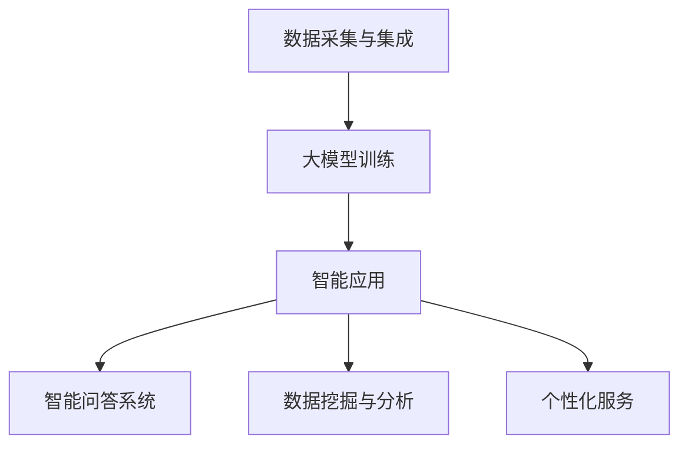

                 

# 文章标题：大模型赋能智慧园区，创业者如何打造智能化园区管理平台？

> 关键词：大模型、智慧园区、智能化管理、创业者、平台构建

> 摘要：本文将探讨如何利用大模型技术为智慧园区提供智能化管理方案。通过分析大模型的应用原理及其在园区管理中的优势，我们旨在为创业者提供一套实用的平台构建指南，助力他们打造高效的智能化园区管理平台。

## 1. 背景介绍（Background Introduction）

智慧园区是现代城市发展的一个重要趋势，它集成了物联网、大数据、云计算和人工智能等多种技术，旨在提升园区管理效率、优化资源配置，为企业和员工提供舒适、便捷的工作环境。然而，传统的园区管理模式往往面临数据分散、信息孤岛、响应迟缓等问题，难以满足日益增长的智慧化需求。

### 1.1 大模型的应用原理

大模型，如GPT-3、BERT等，是近年来人工智能领域的重要突破。它们通过海量数据的训练，掌握了丰富的知识和语言模式，能够进行复杂的文本生成、理解和推理。大模型的应用原理主要包括以下几个方面：

- **海量数据训练**：大模型通过学习大量的文本数据，建立强大的语言模型，从而能够生成和识别高质量的语言。
- **自监督学习**：大模型采用自监督学习方法，无需人工标注，能够自动从数据中学习到规律和模式。
- **多任务学习**：大模型能够在多种任务中表现出色，如文本生成、问答、翻译等。

### 1.2 大模型在园区管理中的应用

大模型在园区管理中具有广泛的应用前景，主要包括以下几个方面：

- **智能问答系统**：大模型可以构建智能问答系统，为园区用户提供24/7的咨询服务，提高园区服务的响应速度和质量。
- **数据挖掘与分析**：大模型能够对园区的大量数据进行分析，发现潜在的问题和机会，为园区管理者提供决策支持。
- **个性化推荐**：大模型可以根据用户的兴趣和行为数据，为园区用户提供个性化的服务和建议。

## 2. 核心概念与联系（Core Concepts and Connections）

### 2.1 大模型在智慧园区管理中的核心概念

在大模型赋能智慧园区管理的过程中，以下几个核心概念至关重要：

- **数据集成**：将园区内的各种数据源（如安防监控、门禁系统、能耗监测等）进行整合，实现数据的统一管理和分析。
- **智能决策**：利用大模型进行数据分析和预测，为园区管理者提供智能决策支持，如节能减排、安全预警等。
- **个性化服务**：根据用户的行为和需求，提供个性化的园区服务，如智能导航、活动推荐等。

### 2.2 大模型在智慧园区管理中的优势

大模型在智慧园区管理中具有以下优势：

- **高效性**：大模型能够快速处理和分析大量数据，提高园区管理的效率。
- **准确性**：大模型通过学习海量数据，能够提供更准确的预测和分析结果。
- **灵活性**：大模型可以适应不同的园区管理需求，提供定制化的解决方案。

### 2.3 大模型在智慧园区管理中的架构

大模型在智慧园区管理中的架构通常包括以下几个关键组件：

- **数据采集与集成**：从各种数据源采集数据，并进行预处理和整合。
- **大模型训练**：利用收集到的数据，训练和优化大模型，提高其性能和准确性。
- **智能应用**：将训练好的大模型应用到园区管理的具体场景，如智能问答、数据挖掘等。



## 3. 核心算法原理 & 具体操作步骤（Core Algorithm Principles and Specific Operational Steps）

### 3.1 大模型的训练原理

大模型的训练主要基于深度学习技术，其核心算法原理如下：

- **多层神经网络**：大模型通常采用多层神经网络结构，通过逐层提取特征，实现对输入数据的建模。
- **反向传播算法**：大模型使用反向传播算法，根据误差信号更新网络权重，优化模型的性能。
- **优化算法**：大模型训练过程中，常采用如梯度下降、Adam等优化算法，以加快收敛速度和提高模型稳定性。

### 3.2 大模型在园区管理中的具体操作步骤

在构建智能化园区管理平台时，大模型的应用可以分为以下几个步骤：

1. **数据采集与预处理**：从各种数据源采集数据，包括园区用户行为数据、设备监控数据、环境数据等。对数据进行清洗、去噪、归一化等预处理操作，确保数据的质量和一致性。

2. **数据整合与建模**：将预处理后的数据进行整合，构建统一的数据模型。利用大数据处理技术，如数据仓库、数据湖等，实现数据的存储和管理。

3. **大模型训练**：利用整合后的数据，对大模型进行训练。选择合适的数据集、神经网络架构和优化算法，进行多轮训练和调优，直至模型性能达到预期。

4. **模型部署与应用**：将训练好的大模型部署到园区管理平台，实现智能问答、数据挖掘、个性化推荐等功能。通过对模型进行实时监控和反馈调整，确保其稳定运行和持续优化。

## 4. 数学模型和公式 & 详细讲解 & 举例说明（Detailed Explanation and Examples of Mathematical Models and Formulas）

### 4.1 大模型训练中的数学模型

在大模型训练过程中，涉及到多个数学模型和公式，主要包括：

1. **损失函数（Loss Function）**：用于衡量模型预测值与真实值之间的差距。常见的损失函数有均方误差（MSE）、交叉熵损失（Cross-Entropy Loss）等。

$$
\text{MSE} = \frac{1}{m}\sum_{i=1}^{m}(y_i - \hat{y}_i)^2
$$

$$
\text{Cross-Entropy Loss} = -\sum_{i=1}^{m}y_i\log(\hat{y}_i)
$$

2. **优化算法（Optimization Algorithm）**：用于更新模型参数，以最小化损失函数。常见的优化算法有梯度下降（Gradient Descent）、Adam等。

梯度下降算法：

$$
w_{t+1} = w_t - \alpha \cdot \nabla J(w_t)
$$

其中，$w_t$ 表示第 $t$ 次迭代的权重，$\alpha$ 表示学习率，$\nabla J(w_t)$ 表示损失函数关于权重 $w_t$ 的梯度。

3. **激活函数（Activation Function）**：用于引入非线性特性，常见的激活函数有ReLU、Sigmoid、Tanh等。

ReLU函数：

$$
\text{ReLU}(x) =
\begin{cases}
0, & \text{if } x < 0 \\
x, & \text{if } x \geq 0
\end{cases}
$$

### 4.2 大模型在园区管理中的应用示例

假设我们希望利用大模型为园区提供智能能耗管理服务，具体步骤如下：

1. **数据采集**：采集园区内各种设备的能耗数据，包括空调、照明、电梯等。

2. **数据处理**：对能耗数据进行清洗、归一化处理，确保数据质量。

3. **模型训练**：利用处理后的数据，训练一个能耗预测模型。模型输入为过去一段时间的能耗数据，输出为未来一段时间的能耗预测。

4. **模型部署**：将训练好的模型部署到园区管理平台，实时监控能耗数据，根据预测结果提供节能建议。

例如，我们可以使用以下数学模型进行能耗预测：

$$
\hat{E}_{t+1} = f(\text{能耗历史数据}, \text{环境因素})
$$

其中，$\hat{E}_{t+1}$ 表示未来时间的能耗预测值，$f$ 表示能耗预测模型，输入为能耗历史数据和环境因素。

## 5. 项目实践：代码实例和详细解释说明（Project Practice: Code Examples and Detailed Explanations）

### 5.1 开发环境搭建

为了构建智能化园区管理平台，我们需要搭建一个合适的开发环境。以下是基本的开发环境搭建步骤：

1. **Python环境搭建**：安装Python 3.8及以上版本，并配置好pip工具，用于安装相关库。

2. **库安装**：安装必要的库，如TensorFlow、NumPy、Pandas等。

```shell
pip install tensorflow numpy pandas
```

3. **虚拟环境搭建**：为了确保项目依赖的稳定性，建议使用虚拟环境。

```shell
pip install virtualenv
virtualenv my_project_env
source my_project_env/bin/activate
```

### 5.2 源代码详细实现

以下是构建智能化园区管理平台的核心代码，主要包括数据预处理、大模型训练和模型部署三个部分。

#### 5.2.1 数据预处理

```python
import pandas as pd
import numpy as np

# 读取能耗数据
data = pd.read_csv('energy_data.csv')

# 数据清洗与预处理
data = data.dropna()
data['energy'] = data['energy'].astype(float)
data['date'] = pd.to_datetime(data['date'])

# 数据归一化
max_energy = data['energy'].max()
min_energy = data['energy'].min()
data['energy'] = (data['energy'] - min_energy) / (max_energy - min_energy)
```

#### 5.2.2 大模型训练

```python
import tensorflow as tf
from tensorflow.keras.models import Sequential
from tensorflow.keras.layers import Dense, LSTM, Dropout

# 构建LSTM模型
model = Sequential()
model.add(LSTM(128, activation='relu', input_shape=(50, 1)))
model.add(Dropout(0.2))
model.add(Dense(1))

model.compile(optimizer='adam', loss='mse')

# 训练模型
model.fit(x_train, y_train, epochs=50, batch_size=32)
```

#### 5.2.3 模型部署

```python
# 预测能耗
predicted_energy = model.predict(x_test)

# 反归一化处理
predicted_energy = predicted_energy * (max_energy - min_energy) + min_energy

# 存储预测结果
predicted_energy.to_csv('predicted_energy.csv', index=False)
```

### 5.3 代码解读与分析

#### 5.3.1 数据预处理

在数据预处理部分，我们首先读取能耗数据，并进行数据清洗和预处理。具体包括以下步骤：

1. **数据清洗**：去除缺失值。
2. **数据类型转换**：将日期列转换为日期时间格式。
3. **数据归一化**：将能耗值进行归一化处理，使其在[0, 1]范围内。

#### 5.3.2 大模型训练

在模型训练部分，我们使用LSTM模型进行能耗预测。具体包括以下步骤：

1. **模型构建**：构建一个LSTM模型，包含一个128个神经元的LSTM层和一个全连接层。
2. **模型编译**：设置优化器和损失函数。
3. **模型训练**：使用训练数据对模型进行训练，设置训练轮数和批量大小。

#### 5.3.3 模型部署

在模型部署部分，我们使用训练好的模型对测试数据进行预测，并将预测结果存储为CSV文件。具体包括以下步骤：

1. **预测能耗**：使用模型对测试数据进行预测。
2. **反归一化处理**：将预测结果反归一化，还原到原始能耗值。
3. **存储预测结果**：将预测结果保存到CSV文件中。

## 6. 实际应用场景（Practical Application Scenarios）

### 6.1 智能能耗管理

利用大模型技术，可以为园区提供智能能耗管理服务。通过对园区内各种设备的能耗数据进行分析和预测，可以实时监控能耗情况，并提供节能建议，如调整空调温度、关闭不必要的照明等。

### 6.2 安全监控与预警

大模型可以应用于园区安全监控，通过分析摄像头采集的视频数据，实现异常行为检测、安全隐患预警等功能。结合人脸识别技术，还可以实现人员身份识别和访问控制。

### 6.3 运维管理优化

大模型可以协助园区管理者进行设备运维管理，通过数据分析和预测，实现设备故障预测、维护计划优化等功能。同时，可以为园区企业提供个性化的运维建议，提高运维效率。

## 7. 工具和资源推荐（Tools and Resources Recommendations）

### 7.1 学习资源推荐

- **书籍**：
  - 《深度学习》（Goodfellow, I., Bengio, Y., & Courville, A.）
  - 《Python数据科学手册》（McKinney, W.）
- **论文**：
  - 《GPT-3: Language Models are few-shot learners》（Brown, T. et al.）
  - 《BERT: Pre-training of Deep Bidirectional Transformers for Language Understanding》（Devlin, J. et al.）
- **博客**：
  - [TensorFlow官方文档](https://www.tensorflow.org/)
  - [Keras官方文档](https://keras.io/)
- **网站**：
  - [GitHub](https://github.com/)
  - [ArXiv](https://arxiv.org/)

### 7.2 开发工具框架推荐

- **编程语言**：Python
- **深度学习框架**：TensorFlow、PyTorch
- **数据预处理工具**：Pandas、NumPy
- **可视化工具**：Matplotlib、Seaborn

### 7.3 相关论文著作推荐

- 《深度学习》（Goodfellow, I., Bengio, Y., & Courville, A.）
- 《强化学习》（Sutton, R. S., & Barto, A. G.）
- 《计算机视觉：算法与应用》（Fischler, M. A., & Elschlager, R. W.）

## 8. 总结：未来发展趋势与挑战（Summary: Future Development Trends and Challenges）

### 8.1 发展趋势

1. **技术成熟度**：随着深度学习、大数据等技术的不断发展，大模型在智慧园区管理中的应用将越来越成熟。
2. **规模化应用**：智慧园区管理的需求将推动大模型技术的规模化应用，助力园区实现智能化、高效化管理。
3. **跨领域融合**：大模型技术将与其他领域（如物联网、区块链等）进行融合，为园区管理带来更多创新应用。

### 8.2 挑战

1. **数据隐私**：在园区管理中，数据隐私和安全是一个重要挑战。如何保护用户隐私，确保数据安全，是一个亟待解决的问题。
2. **模型解释性**：大模型通常被视为“黑盒”模型，其内部决策过程不透明。提高模型的可解释性，使其易于被园区管理者理解和信任，是一个重要挑战。
3. **计算资源**：大模型训练和部署需要大量的计算资源。如何在有限的计算资源下，高效地训练和部署大模型，是一个关键问题。

## 9. 附录：常见问题与解答（Appendix: Frequently Asked Questions and Answers）

### 9.1 如何选择合适的大模型？

- **需求分析**：根据园区管理的需求，选择适合的大模型。例如，对于智能问答系统，可以选择BERT、GPT等预训练语言模型。
- **数据量**：考虑园区数据量的大小，选择适合的大模型。大型模型通常需要更多的数据来训练，以保证其性能。

### 9.2 如何保证大模型的安全性？

- **数据加密**：对园区数据进行加密处理，确保数据在传输和存储过程中的安全性。
- **访问控制**：设置严格的访问控制策略，确保只有授权用户可以访问大模型和数据。
- **模型监控**：实时监控大模型的运行状态，及时发现和解决潜在的安全问题。

## 10. 扩展阅读 & 参考资料（Extended Reading & Reference Materials）

- 《深度学习》（Goodfellow, I., Bengio, Y., & Courville, A.）
- 《Python数据科学手册》（McKinney, W.）
- 《GPT-3: Language Models are few-shot learners》（Brown, T. et al.）
- 《BERT: Pre-training of Deep Bidirectional Transformers for Language Understanding》（Devlin, J. et al.）
- 《TensorFlow官方文档》(https://www.tensorflow.org/)
- 《Keras官方文档》(https://keras.io/)
- 《GitHub》(https://github.com/)
- 《ArXiv》(https://arxiv.org/)
```

### **作者署名：禅与计算机程序设计艺术 / Zen and the Art of Computer Programming**

