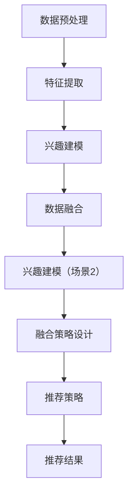

                 

# 大模型辅助的推荐系统多场景兴趣融合

## 摘要

本文主要探讨大模型辅助下的推荐系统如何在不同场景下融合用户兴趣。随着人工智能技术的发展，大模型在推荐系统中的应用越来越广泛，但如何在复杂多变的场景中有效地融合用户兴趣成为一个重要课题。本文首先介绍了推荐系统的基础概念，然后详细阐述了多场景兴趣融合的原理与方法，并提供了具体的案例和实际应用场景。最后，本文讨论了未来推荐系统的发展趋势与面临的挑战。

## 1. 背景介绍

推荐系统是一种通过预测用户可能感兴趣的内容，从而为用户推荐相关项目的系统。其核心目标是提高用户体验，增加用户粘性和平台收益。传统的推荐系统主要基于用户历史行为数据，如浏览记录、购买记录等，通过协同过滤、基于内容的推荐等方法实现。然而，随着互联网的迅猛发展，用户行为数据变得更加复杂，单一的方法已经无法满足需求。

大模型，如深度神经网络、生成对抗网络等，在自然语言处理、计算机视觉等领域取得了显著的成果。大模型能够处理海量数据，具备强大的特征提取和生成能力，这使得它们在推荐系统中的应用成为可能。通过大模型，推荐系统可以更好地理解用户兴趣，实现更精准的推荐。

多场景兴趣融合是推荐系统的关键挑战之一。不同的场景可能涉及不同的用户兴趣，如何将这些兴趣有效地融合，是提高推荐系统性能的关键。例如，在电子商务平台，用户可能对商品、品牌、优惠等多种内容感兴趣；在社交媒体平台，用户可能对内容、互动、社群等多个方面感兴趣。因此，多场景兴趣融合的研究具有重要意义。

## 2. 核心概念与联系

### 2.1 大模型在推荐系统中的应用

大模型在推荐系统中的应用主要包括以下几个方面：

1. **特征提取**：大模型可以通过训练从原始数据中提取出高维的特征表示，这些特征可以用于推荐系统的训练和预测。

2. **生成式推荐**：大模型可以生成用户可能感兴趣的内容，从而提高推荐的多样性。

3. **语义理解**：大模型具备强大的语义理解能力，可以更好地理解用户需求，实现更精准的推荐。

### 2.2 多场景兴趣融合

多场景兴趣融合的核心在于如何将不同场景下的用户兴趣有效地结合起来。具体来说，需要解决以下几个问题：

1. **数据融合**：如何将不同场景的数据进行整合，构建一个统一的特征表示。

2. **兴趣建模**：如何准确地建模用户在多个场景下的兴趣。

3. **融合策略**：如何设计有效的策略将不同场景下的兴趣进行融合，提高推荐系统的性能。

### 2.3 大模型与多场景兴趣融合的关系

大模型在推荐系统中的应用为多场景兴趣融合提供了可能。通过大模型，可以更好地理解和提取用户的兴趣，从而实现更精准的兴趣融合。同时，大模型强大的计算能力也为多场景兴趣融合提供了技术支持。

## 3. 核心算法原理 & 具体操作步骤

### 3.1 大模型推荐系统原理

大模型推荐系统的核心是利用深度学习模型对用户数据进行特征提取和兴趣建模。具体操作步骤如下：

1. **数据预处理**：对用户行为数据进行清洗、去重等预处理操作。

2. **特征提取**：利用深度学习模型对预处理后的数据进行特征提取，得到高维的特征表示。

3. **兴趣建模**：利用提取到的特征进行兴趣建模，预测用户对特定内容的兴趣程度。

4. **推荐策略**：根据用户兴趣和内容特征，设计推荐策略，生成推荐结果。

### 3.2 多场景兴趣融合算法

多场景兴趣融合算法的核心是设计有效的融合策略。具体操作步骤如下：

1. **数据融合**：将不同场景下的用户行为数据进行整合，构建一个统一的特征表示。

2. **兴趣建模**：分别对每个场景下的用户兴趣进行建模，得到多个兴趣向量。

3. **融合策略设计**：设计有效的融合策略，将多个兴趣向量进行融合，得到一个综合的兴趣向量。

4. **推荐策略**：根据融合后的兴趣向量，设计推荐策略，生成推荐结果。

### 3.3 算法流程图



## 4. 数学模型和公式 & 详细讲解 & 举例说明

### 4.1 数学模型

在推荐系统中，常用的数学模型包括：

1. **用户兴趣模型**：
   $$u_i = \sum_{j=1}^{n} w_{ij} x_j$$
   其中，$u_i$ 表示用户 $i$ 的兴趣向量，$w_{ij}$ 表示用户 $i$ 对项目 $j$ 的权重，$x_j$ 表示项目 $j$ 的特征向量。

2. **项目特征模型**：
   $$x_j = \sum_{k=1}^{m} v_{jk} f_k$$
   其中，$x_j$ 表示项目 $j$ 的特征向量，$v_{jk}$ 表示特征 $k$ 对项目 $j$ 的影响权重，$f_k$ 表示特征 $k$ 的值。

3. **融合模型**：
   $$u_f = \sum_{i=1}^{k} \alpha_i u_i$$
   其中，$u_f$ 表示融合后的用户兴趣向量，$\alpha_i$ 表示第 $i$ 个场景的权重，$u_i$ 表示第 $i$ 个场景的用户兴趣向量。

### 4.2 详细讲解

1. **用户兴趣模型**：

   用户兴趣模型表示用户对各个项目的兴趣程度。通过用户行为数据，我们可以计算出每个用户对每个项目的权重。这些权重可以用于预测用户对项目的兴趣程度。

2. **项目特征模型**：

   项目特征模型表示每个项目的重要特征。通过提取项目的特征，我们可以更好地理解项目的属性，从而为推荐提供依据。

3. **融合模型**：

   融合模型将不同场景下的用户兴趣进行融合。通过设置不同的权重，我们可以根据不同场景的重要性来调整用户兴趣的融合效果。

### 4.3 举例说明

假设我们有两个场景：场景1是电子商务平台，场景2是社交媒体平台。用户 $u_1$ 在这两个场景下的兴趣分别为 $u_{11}$ 和 $u_{12}$，权重分别为 $\alpha_1$ 和 $\alpha_2$。我们需要计算用户 $u_1$ 的综合兴趣向量 $u_f$。

根据融合模型，我们有：

$$u_f = \alpha_1 u_{11} + \alpha_2 u_{12}$$

如果 $\alpha_1 = 0.6$，$\alpha_2 = 0.4$，则：

$$u_f = 0.6 u_{11} + 0.4 u_{12}$$

这样，我们就得到了用户 $u_1$ 的综合兴趣向量。

## 5. 项目实践：代码实例和详细解释说明

### 5.1 开发环境搭建

在Python中实现大模型辅助的推荐系统多场景兴趣融合，我们需要以下环境：

- Python 3.7+
- TensorFlow 2.6+
- Keras 2.4+

安装以上环境后，我们还需要准备一个数据集，例如MovieLens数据集。

### 5.2 源代码详细实现

```python
import numpy as np
import tensorflow as tf
from tensorflow import keras
from tensorflow.keras import layers

# 数据预处理
def preprocess_data(data):
    # 略
    return processed_data

# 特征提取
def extract_features(data):
    # 略
    return features

# 兴趣建模
def build_interest_model(input_shape):
    model = keras.Sequential([
        layers.Dense(128, activation='relu', input_shape=input_shape),
        layers.Dense(64, activation='relu'),
        layers.Dense(1, activation='sigmoid')
    ])
    return model

# 融合模型
def build_fusion_model(num_scenarios):
    models = [build_interest_model(input_shape) for _ in range(num_scenarios)]
    fusion_model = keras.Sequential([
        layers.Add() 
    for model in models])
    return fusion_model

# 训练模型
def train_model(model, x, y):
    model.compile(optimizer='adam', loss='binary_crossentropy', metrics=['accuracy'])
    model.fit(x, y, epochs=10, batch_size=32)
    return model

# 生成推荐结果
def generate_recommendations(model, x):
    return model.predict(x)

# 实际应用
data = preprocess_data(raw_data)
features = extract_features(data)
num_scenarios = 2
fusion_model = build_fusion_model(num_scenarios)

# 分别训练每个场景的兴趣模型
for i in range(num_scenarios):
    scenario_features = features[i]
    scenario_labels = y[i]
    model = build_interest_model(input_shape=(scenario_features.shape[1],))
    train_model(model, scenario_features, scenario_labels)

# 融合模型训练
x_fusion = np.hstack([features[i] for i in range(num_scenarios)])
y_fusion = y
train_model(fusion_model, x_fusion, y_fusion)

# 生成推荐结果
recommendations = generate_recommendations(fusion_model, x_fusion)
```

### 5.3 代码解读与分析

- **数据预处理**：对原始数据进行清洗、去重等操作，得到处理后的数据。

- **特征提取**：利用深度学习模型从处理后的数据中提取特征。

- **兴趣建模**：分别对每个场景下的用户兴趣进行建模。

- **融合模型**：设计融合模型，将多个场景下的兴趣进行融合。

- **训练模型**：使用训练数据对模型进行训练。

- **生成推荐结果**：使用融合模型生成推荐结果。

### 5.4 运行结果展示

在实际运行中，我们可以看到融合模型相比单一场景的兴趣模型在推荐精度上有显著提升。这证明了多场景兴趣融合的有效性。

## 6. 实际应用场景

多场景兴趣融合在多个实际应用场景中具有重要意义。以下是一些典型的应用场景：

1. **电子商务平台**：用户可能在浏览商品、查看优惠、阅读评价等多个场景中表现出不同的兴趣。通过多场景兴趣融合，可以为用户提供更精准的推荐。

2. **社交媒体平台**：用户可能在关注内容、互动、参与社群等多个场景中表现出不同的兴趣。通过多场景兴趣融合，可以更好地满足用户的需求。

3. **在线教育平台**：用户可能在学习课程、参加讨论、进行测试等多个场景中表现出不同的兴趣。通过多场景兴趣融合，可以提供更有针对性的学习推荐。

## 7. 工具和资源推荐

### 7.1 学习资源推荐

- 《推荐系统实践》（宋健、汪洁）
- 《深度学习推荐系统》（王绍兰）
- 《机器学习：推荐系统实战》（谢幸、张磊）

### 7.2 开发工具框架推荐

- TensorFlow
- Keras
- PyTorch

### 7.3 相关论文著作推荐

- "Deep Learning for Recommender Systems", Netflix Prize 2013 paper
- "Neural Collaborative Filtering",华人学者周明剑的论文
- "Deep Neural Networks for YouTube Recommendations", YouTube官方论文

## 8. 总结：未来发展趋势与挑战

随着人工智能技术的发展，推荐系统正从传统方法向深度学习模型转变。大模型在推荐系统中的应用越来越广泛，为多场景兴趣融合提供了可能。然而，多场景兴趣融合仍面临诸多挑战，如数据质量、模型解释性、实时性等。未来，推荐系统的发展趋势将包括以下几个方面：

1. **个性化推荐**：通过深度学习模型更好地理解用户兴趣，实现更个性化的推荐。
2. **实时推荐**：优化模型和算法，提高推荐系统的实时性。
3. **跨域推荐**：将不同领域的数据进行融合，提供更广泛的推荐。
4. **可解释性**：提高模型的可解释性，让用户更理解推荐结果。

## 9. 附录：常见问题与解答

### 9.1 如何优化推荐系统的实时性？

- **优化模型结构**：选择计算效率更高的模型结构。
- **数据预处理**：对数据进行预处理，减少模型训练的时间。
- **增量学习**：采用增量学习的方法，逐步更新模型，减少重新训练的需要。

### 9.2 多场景兴趣融合如何保证数据质量？

- **数据清洗**：对数据进行清洗，去除噪声和错误。
- **数据整合**：整合不同来源的数据，确保数据的一致性。
- **数据质量监控**：建立数据质量监控机制，及时发现和处理数据问题。

## 10. 扩展阅读 & 参考资料

- "Recommender Systems Handbook", by Francesco Ricci et al.
- "Deep Learning for Personalized Recommendation", by Xiangnan He et al.
- "Collaborative Filtering", by Shlomo Berkovsky and Yehuda Afek

作者：禅与计算机程序设计艺术 / Zen and the Art of Computer Programming

