                 

# 文章标题

《大模型问答机器人的自然语言技术》

> 关键词：大模型，自然语言处理，问答机器人，自然语言技术，机器学习，人工智能，NLP

摘要：本文将深入探讨大模型问答机器人的自然语言技术，包括其核心概念、算法原理、数学模型、项目实践以及应用场景。通过本文的阅读，读者将全面了解大模型问答机器人的构建和优化方法，为实际项目开发提供有力支持。

## 1. 背景介绍（Background Introduction）

随着人工智能技术的快速发展，自然语言处理（NLP）已经成为计算机科学中的重要分支。在大数据、深度学习和云计算的推动下，大模型问答机器人应运而生。这种机器人利用先进的自然语言技术，能够理解、处理和回答用户的问题，成为现代智能服务的关键组成部分。

大模型问答机器人具有广泛的应用场景，如智能客服、信息检索、教育辅助、医疗咨询等。这些应用不仅提高了企业效率，还极大地改善了用户体验。然而，要构建一个高效、准确的大模型问答机器人，需要深入理解自然语言技术的核心概念、算法原理和数学模型。

本文将围绕以下几个核心问题展开讨论：

- 什么是大模型问答机器人？
- 它是如何工作的？
- 它涉及哪些关键算法和数学模型？
- 如何在项目中实践和优化大模型问答机器人？

通过对这些问题的深入探讨，我们将为大模型问答机器人的开发和应用提供系统的理论支持和实践指导。

### 1.1 自然语言处理的发展历程

自然语言处理（NLP）起源于20世纪50年代，当时计算机科学家和语言学家开始探索如何让计算机理解和处理人类语言。起初，研究者们主要依赖基于规则的系统和形式化语法来处理语言。然而，这些方法在面对复杂、多变的自然语言时显得力不从心。

随着计算机性能的提升和大数据的普及，统计机器学习成为NLP研究的主流。这种方法通过大量标记数据训练模型，使计算机能够自动学习语言模式。统计机器学习为NLP带来了革命性的进步，如词性标注、句法分析和机器翻译等任务得到了显著改善。

进入21世纪，深度学习进一步推动了NLP的发展。深度学习模型，如卷积神经网络（CNN）和循环神经网络（RNN），通过多层非线性变换能够捕捉更复杂的语言特征。特别是2018年GPT-3的发布，标志着预训练语言模型（PTLM）的崛起。PTLM通过在大规模语料库上进行无监督预训练，然后针对特定任务进行微调，取得了前所未有的效果。

### 1.2 大模型问答机器人的现状与挑战

目前，大模型问答机器人在多个领域得到了广泛应用，例如：

- **智能客服**：自动处理客户咨询，提高企业运营效率。
- **信息检索**：快速准确地检索和提供相关信息。
- **教育辅助**：为学生提供个性化的学习支持和指导。
- **医疗咨询**：辅助医生进行诊断和治疗建议。

尽管大模型问答机器人在实际应用中取得了显著成效，但仍然面临以下挑战：

- **准确性**：如何提高问答机器人的回答准确性，减少错误和不准确的情况？
- **上下文理解**：如何更好地理解和处理复杂、多层次的上下文信息？
- **泛化能力**：如何使问答机器人在多种场景和任务中具有更强的泛化能力？
- **可解释性**：如何提高问答机器人的可解释性，使其决策过程更加透明和可理解？

要应对这些挑战，需要深入研究和优化自然语言技术的各个方面，包括算法设计、模型架构、训练数据质量等。

### 1.3 本文结构

本文将按照以下结构展开：

1. **背景介绍**：回顾自然语言处理的发展历程，介绍大模型问答机器人的现状与挑战。
2. **核心概念与联系**：详细阐述大模型问答机器人中的核心概念，如自然语言处理、机器学习、深度学习等，并展示相关的架构流程图。
3. **核心算法原理 & 具体操作步骤**：讲解大模型问答机器人中的关键算法，如BERT、GPT等，并介绍其实施步骤。
4. **数学模型和公式 & 详细讲解 & 举例说明**：介绍大模型问答机器人涉及的数学模型，如概率图模型、深度神经网络等，并给出具体的公式和实例。
5. **项目实践：代码实例和详细解释说明**：通过具体项目实践，展示大模型问答机器人的开发过程和关键代码，并进行详细解释和分析。
6. **实际应用场景**：探讨大模型问答机器人在实际应用中的成功案例和挑战。
7. **工具和资源推荐**：推荐相关学习资源、开发工具和框架。
8. **总结：未来发展趋势与挑战**：总结本文的核心内容，展望大模型问答机器人的未来发展趋势和面临的挑战。
9. **附录：常见问题与解答**：回答读者可能关心的一些常见问题。
10. **扩展阅读 & 参考资料**：提供进一步学习的资源。

通过本文的深入探讨，读者将全面了解大模型问答机器人的自然语言技术，为其开发和应用提供有力支持。

## 2. 核心概念与联系（Core Concepts and Connections）

在大模型问答机器人的构建中，理解核心概念和它们之间的联系是至关重要的。这些核心概念包括自然语言处理（NLP）、机器学习（ML）、深度学习（DL）等。下面，我们将逐一介绍这些概念，并展示它们之间的相互关系。

### 2.1 自然语言处理（Natural Language Processing）

自然语言处理（NLP）是计算机科学和人工智能领域的一个分支，旨在使计算机能够理解和处理人类语言。NLP涵盖了多种技术和方法，包括文本处理、句法分析、语义理解、机器翻译等。

#### 2.1.1 文本处理（Text Processing）

文本处理是NLP的基础，涉及将自然语言文本转换为计算机可以处理的形式。这包括分词、词干提取、词性标注等步骤。例如，分词是将连续的文本序列分割成有意义的单词或短语。

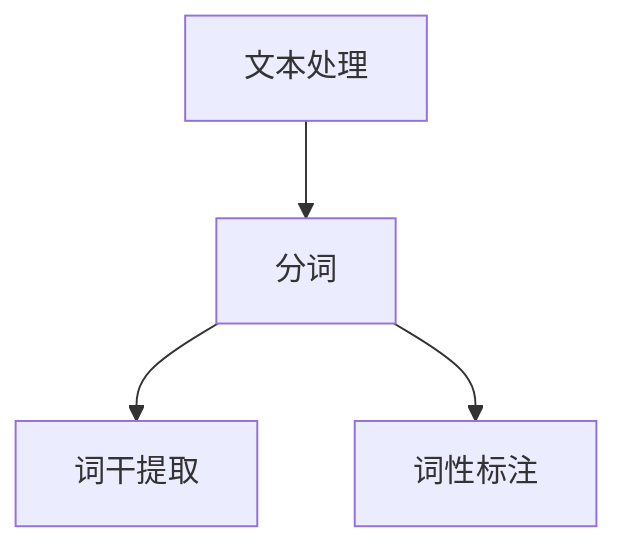

#### 2.1.2 句法分析（Syntax Analysis）

句法分析是理解文本结构的过程，涉及识别单词之间的语法关系。常见的句法分析方法包括依存句法分析和句法树构建。例如，依存句法分析可以识别句子中的主语、谓语和宾语之间的关系。

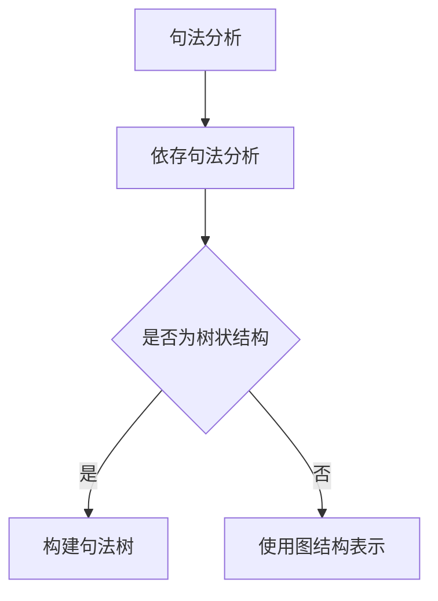

#### 2.1.3 语义理解（Semantic Understanding）

语义理解是NLP的终极目标，涉及理解文本的含义和上下文。这包括语义角色标注、实体识别、情感分析等任务。例如，情感分析可以判断文本表达的是正面情感、负面情感还是中性情感。

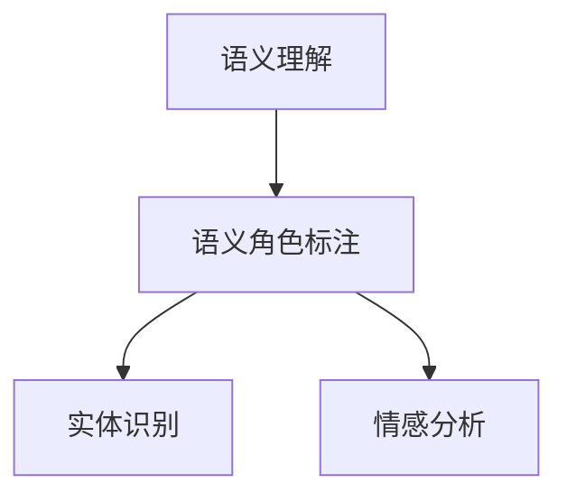

### 2.2 机器学习（Machine Learning）

机器学习（ML）是使计算机通过数据自动学习和改进性能的方法。在NLP中，ML技术被广泛用于构建问答机器人等应用。ML的主要任务包括分类、回归、聚类等。

#### 2.2.1 分类（Classification）

分类是机器学习中最常见的任务之一，用于将数据分为不同的类别。例如，在问答机器人中，分类算法可以将用户的问题分类为不同的主题或领域。

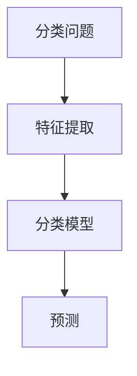

#### 2.2.2 回归（Regression）

回归任务是预测数值输出，例如预测用户问题的答案。在问答机器人中，回归模型可以用来预测问题的答案，从而提供更准确的回答。

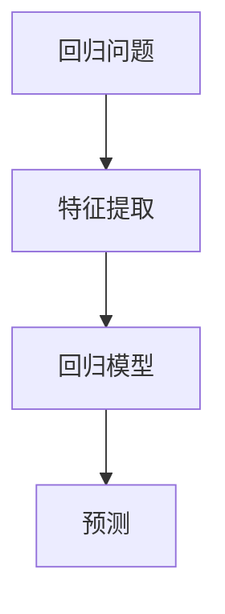

#### 2.2.3 聚类（Clustering）

聚类是将数据分组为不同的簇，以便更好地理解和分析数据。在问答机器人中，聚类算法可以用于对用户问题进行聚类，从而更好地理解用户的查询意图。

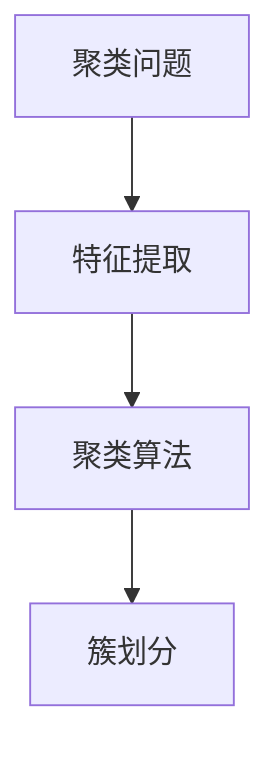

### 2.3 深度学习（Deep Learning）

深度学习（DL）是机器学习的一个子领域，通过多层神经网络模拟人类大脑的学习过程。在NLP中，深度学习模型被广泛用于处理复杂的语言任务，如文本分类、机器翻译、情感分析等。

#### 2.3.1 神经网络（Neural Networks）

神经网络是深度学习的基础，由多个神经元组成，每个神经元通过权重连接到其他神经元。神经网络通过多层非线性变换，能够自动学习输入和输出之间的复杂关系。

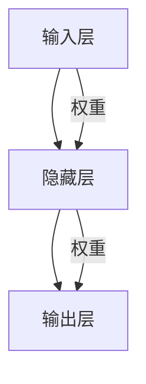

#### 2.3.2 卷积神经网络（Convolutional Neural Networks）

卷积神经网络（CNN）是一种用于图像和文本处理的前馈神经网络，通过卷积层和池化层提取特征。在NLP中，CNN可以用于文本分类和情感分析。

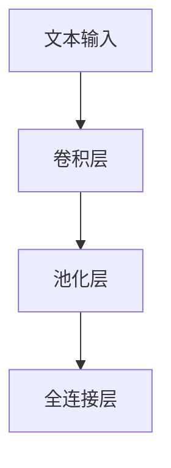

#### 2.3.3 循环神经网络（Recurrent Neural Networks）

循环神经网络（RNN）是一种能够处理序列数据的神经网络，通过循环结构将当前输入与历史信息关联。在NLP中，RNN可以用于语言建模和序列标注。

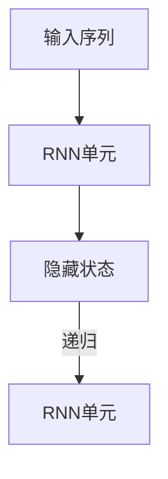

#### 2.3.4 长短时记忆网络（Long Short-Term Memory Networks）

长短时记忆网络（LSTM）是RNN的一种变体，通过引入门控机制，能够更好地处理长序列数据。在NLP中，LSTM被广泛用于语言建模和文本生成。

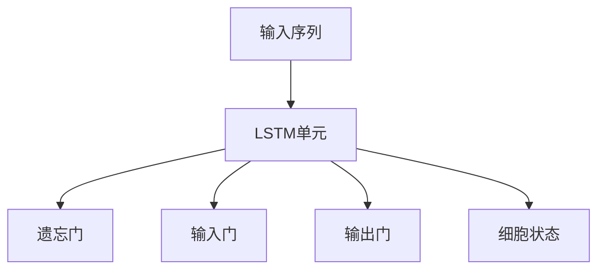

### 2.4 提示词工程（Prompt Engineering）

提示词工程是设计和优化输入给语言模型的文本提示，以引导模型生成符合预期结果的过程。在大模型问答机器人中，提示词工程是一个关键环节，可以显著提高问答的准确性和质量。

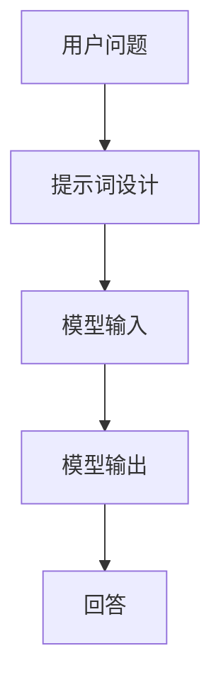

### 2.5 大模型（Large Models）

大模型是指具有巨大参数量和计算量的深度学习模型，如GPT-3、BERT等。这些模型通过在大规模语料库上进行预训练，可以捕获丰富的语言特征，从而在多种NLP任务中表现出色。

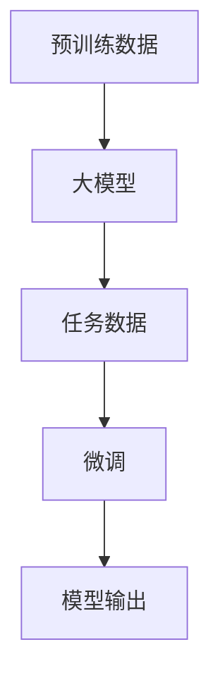

通过上述核心概念和它们之间的联系，我们可以构建出一个高效、准确的大模型问答机器人。下一节，我们将详细探讨大模型问答机器人的核心算法原理和具体操作步骤。

### 2. Core Concepts and Connections

In the construction of large-scale question-answering robots, understanding core concepts and their interconnections is crucial. These core concepts include natural language processing (NLP), machine learning (ML), and deep learning (DL). Below, we will introduce these concepts one by one and illustrate their relationships.

#### 2.1 Natural Language Processing (NLP)

Natural Language Processing (NLP) is a branch of computer science and artificial intelligence that aims to enable computers to understand and process human language. NLP encompasses a variety of techniques and methods, including text processing, syntax analysis, semantic understanding, and machine translation.

##### 2.1.1 Text Processing (Text Processing)

Text processing is the foundation of NLP, involving the conversion of natural language text into a form that computers can process. This includes steps such as tokenization, stemming, and part-of-speech tagging. For example, tokenization involves splitting continuous text sequences into meaningful words or phrases.

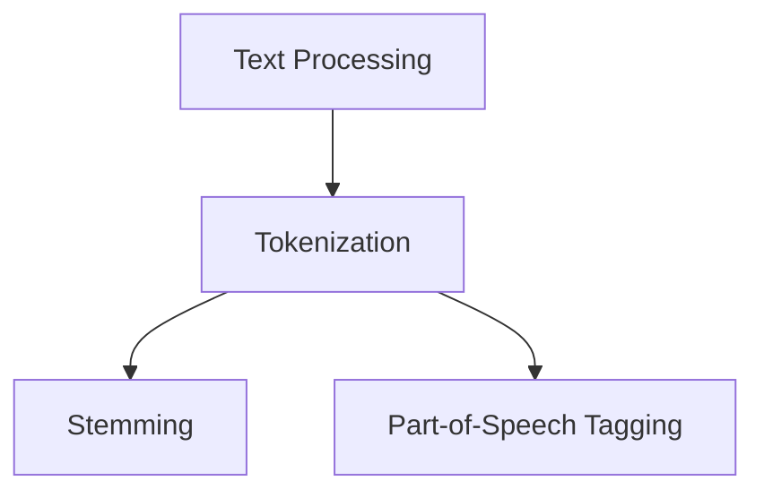

##### 2.1.2 Syntax Analysis (Syntax Analysis)

Syntax analysis is the process of understanding the structure of text. It involves identifying the grammatical relationships between words. Common syntax analysis methods include dependency parsing and syntactic tree construction. For example, dependency parsing can identify the relationships between subjects, verbs, and objects in a sentence.

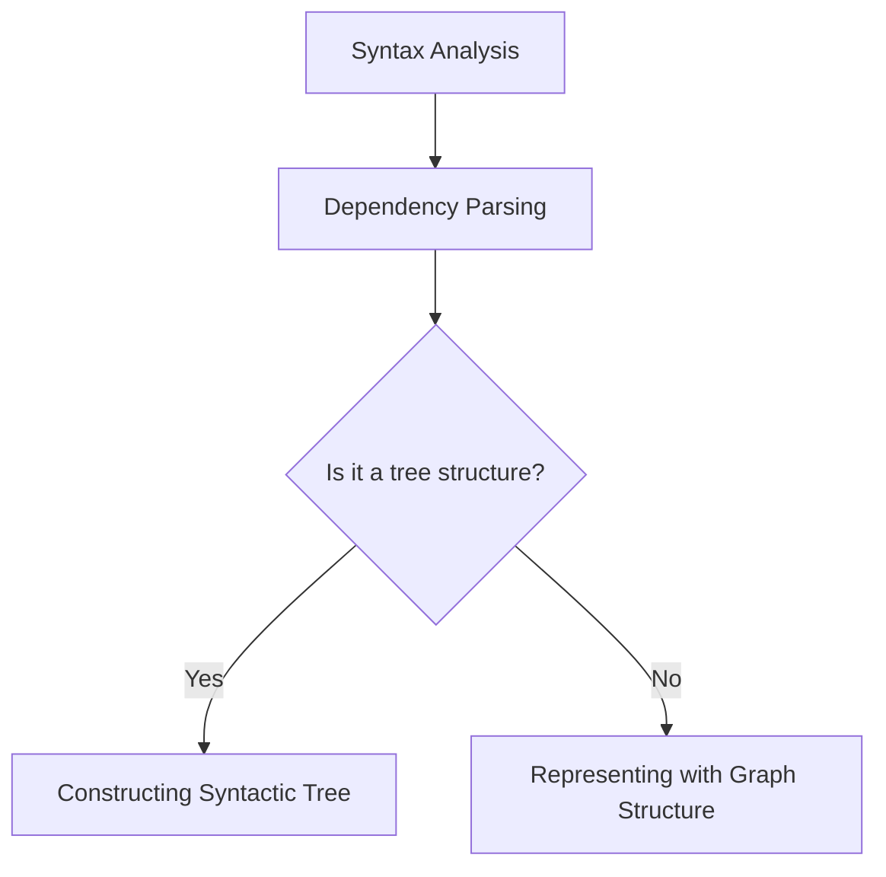

##### 2.1.3 Semantic Understanding (Semantic Understanding)

Semantic understanding is the ultimate goal of NLP, involving understanding the meaning and context of text. This includes tasks such as semantic role labeling, entity recognition, and sentiment analysis. For example, sentiment analysis can determine whether a text expresses positive, negative, or neutral sentiment.

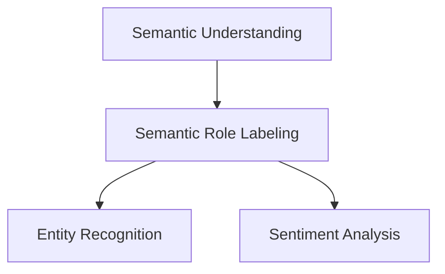

#### 2.2 Machine Learning (Machine Learning)

Machine learning (ML) is a method that enables computers to learn and improve their performance through data. In NLP, ML techniques are widely used to build question-answering robots and other applications. ML tasks include classification, regression, and clustering.

##### 2.2.1 Classification (Classification)

Classification is one of the most common tasks in machine learning, involving dividing data into different categories. For example, in question-answering robots, classification algorithms can categorize user questions into different topics or domains.

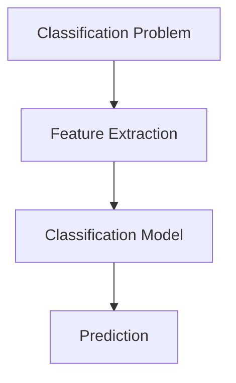

##### 2.2.2 Regression (Regression)

Regression is a task that predicts numerical outputs, such as predicting the answers to user questions. In question-answering robots, regression models can be used to predict answers, thereby providing more accurate responses.

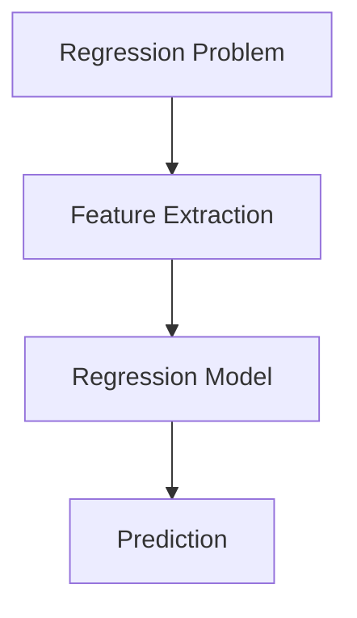

##### 2.2.3 Clustering (Clustering)

Clustering is a task that groups data into different clusters to better understand and analyze it. In question-answering robots, clustering algorithms can be used to cluster user questions, thereby better understanding user query intent.

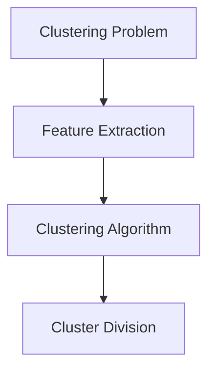

#### 2.3 Deep Learning (Deep Learning)

Deep learning (DL) is a subfield of machine learning that simulates the learning process of the human brain through multi-layer neural networks. In NLP, deep learning models are widely used to handle complex language tasks, such as text classification, machine translation, and sentiment analysis.

##### 2.3.1 Neural Networks (Neural Networks)

Neural networks are the foundation of deep learning, consisting of multiple neurons connected by weights. Neural networks perform multi-layer nonlinear transformations to automatically learn complex relationships between inputs and outputs.

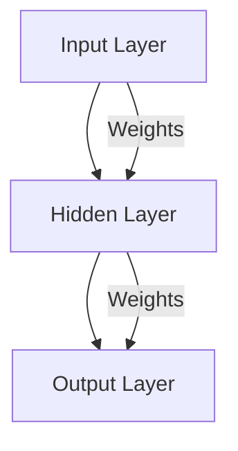

##### 2.3.2 Convolutional Neural Networks (Convolutional Neural Networks)

Convolutional Neural Networks (CNN) are a type of feedforward neural network used for image and text processing. CNNs extract features through convolutional and pooling layers, and are commonly used for text classification and sentiment analysis.

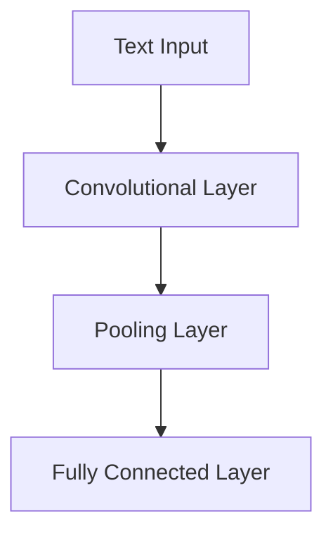

##### 2.3.3 Recurrent Neural Networks (Recurrent Neural Networks)

Recurrent Neural Networks (RNN) are a type of neural network designed to handle sequence data through a recurrent structure that links current input to historical information. In NLP, RNNs are used for language modeling and sequence labeling.

```mermaid
graph TD
    A[Input Sequence] --> B[RNN Unit]
    B --> C[Hidden State]
    C -->|Recursion| D[RNN Unit]
```

##### 2.3.4 Long Short-Term Memory Networks (Long Short-Term Memory Networks)

Long Short-Term Memory Networks (LSTM) are a variant of RNNs that can better handle long sequences through the introduction of gating mechanisms. In NLP, LSTMs are widely used for language modeling and text generation.

```mermaid
graph TD
    A[Input Sequence] --> B[LSTM Unit]
    B --> C[Forget Gate]
    B --> D[Input Gate]
    B --> E[Output Gate]
    B --> F[Cell State]
```

#### 2.4 Prompt Engineering (Prompt Engineering)

Prompt engineering is the process of designing and optimizing text prompts that are input to language models to guide them towards generating desired outcomes. In large-scale question-answering robots, prompt engineering is a critical component that can significantly improve the accuracy and quality of responses.

```mermaid
graph TD
    A[User Question] --> B[Prompt Design]
    B --> C[Model Input]
    C --> D[Model Output]
    D --> E[Response]
```

#### 2.5 Large Models (Large Models)

Large models refer to deep learning models with massive parameter sizes and computational requirements, such as GPT-3 and BERT. These models capture rich language features through pretraining on large-scale corpora and exhibit excellent performance on a variety of NLP tasks.

```mermaid
graph TD
    A[Pretraining Data] --> B[Large Model]
    B --> C[Task Data]
    C --> D[Fine-tuning]
    D --> E[Model Output]
```

By understanding these core concepts and their interconnections, we can construct an efficient and accurate large-scale question-answering robot. In the next section, we will delve into the core algorithm principles and specific operational steps of large-scale question-answering robots. 

## 3. 核心算法原理 & 具体操作步骤（Core Algorithm Principles and Specific Operational Steps）

在大模型问答机器人的构建中，核心算法原理和具体操作步骤是关键。这些算法包括但不限于Transformer、BERT、GPT等。下面，我们将详细讲解这些算法的原理和操作步骤。

### 3.1 Transformer

Transformer是2017年由Vaswani等人提出的深度学习模型，它在机器翻译、文本生成等任务上取得了显著成效。Transformer的核心思想是自注意力机制（Self-Attention），它允许模型在处理每个词时，考虑所有词的重要程度。

#### 3.1.1 自注意力机制（Self-Attention）

自注意力机制是一种计算方法，用于计算输入序列中每个词对输出的贡献。具体来说，自注意力机制将输入序列映射到三个不同的空间：查询（Query）、键（Key）和值（Value）。然后，通过计算每个查询与每个键的相似度，得到注意力权重，最后加权求和得到输出。

```mermaid
graph TD
    A[Input Sequence] --> B[Query, Key, Value]
    B --> C[Attention Scores]
    C --> D[Weighted Sum]
    D --> E[Output]
```

#### 3.1.2 Transformer模型架构

Transformer模型由多个相同的编码器层和解码器层组成。编码器层负责将输入序列编码为固定长度的向量，解码器层负责生成输出序列。在每个层中，自注意力机制和点积注意力机制被交替使用。

```mermaid
graph TD
    A[Encoder] --> B[Encoder Layer]
    B --> C[N Head Self-Attention]
    B --> D[Pointwise Feedforward Networks]
    C --> E[Layer Normalization]
    D --> E[Layer Normalization]
```

#### 3.1.3 操作步骤

1. **输入序列编码**：将输入序列转换为词向量。
2. **多层编码器**：通过多个编码器层对输入序列进行编码。
3. **自注意力计算**：在每个编码器层中，计算输入序列的自注意力。
4. **点积注意力计算**：在每个编码器层中，计算输入序列之间的点积注意力。
5. **全连接层**：在每个编码器层和解码器层之间添加全连接层。
6. **输出序列生成**：通过解码器层生成输出序列。

### 3.2 BERT

BERT（Bidirectional Encoder Representations from Transformers）是由Google在2018年提出的一种预训练语言模型。BERT的特点是双向编码，即在训练过程中同时考虑了文本的前后文信息。

#### 3.2.1 双向编码（Bidirectional Encoding）

BERT通过两个阶段的训练来构建模型。第一阶段是预训练，模型在大规模语料库上学习语言的上下文信息。第二阶段是微调，模型在特定任务上进行微调，以获得更好的性能。

```mermaid
graph TD
    A[Pretraining] --> B[Masked Language Modeling]
    A --> C[Next Sentence Prediction]
    B --> D[Fine-tuning]
```

#### 3.2.2 操作步骤

1. **预训练**：
   - **Masked Language Modeling**：在输入序列中随机遮盖一些词，模型需要预测这些词。
   - **Next Sentence Prediction**：预测两个句子是否在输入序列中连续出现。

2. **微调**：在特定任务上（如文本分类、问答等）对模型进行微调。

### 3.3 GPT

GPT（Generative Pretrained Transformer）是由OpenAI在2018年提出的一种预训练语言模型，它通过无监督预训练来学习语言特征。

#### 3.3.1 无监督预训练（Unsupervised Pretraining）

GPT通过在大量文本上进行无监督预训练来学习语言模式。在预训练过程中，模型被要求生成输入序列的下一个词。

```mermaid
graph TD
    A[Pretraining] --> B[Next Sentence Prediction]
```

#### 3.3.2 操作步骤

1. **预训练**：通过生成输入序列的下一个词来学习语言模式。
2. **微调**：在特定任务上进行微调，例如文本生成、问答等。

### 3.4 模型融合（Model Fusion）

在实际应用中，为了提高模型的性能，可以将不同的模型进行融合。例如，将BERT和GPT融合，以同时利用双向编码和生成模型的优势。

```mermaid
graph TD
    A[BERT] --> B[GPT]
    A --> C[Fused Model]
    B --> C
```

#### 3.4.1 操作步骤

1. **输入序列编码**：使用BERT对输入序列进行编码。
2. **生成序列**：使用GPT生成输入序列的下一个词。
3. **融合输出**：将BERT和GPT的输出进行融合，得到最终的模型输出。

通过上述核心算法原理和具体操作步骤的讲解，我们可以构建出一个高效、准确的大模型问答机器人。下一节，我们将详细介绍大模型问答机器人涉及的数学模型和公式，并给出具体的讲解和实例。

## 4. 数学模型和公式 & 详细讲解 & 举例说明（Detailed Explanation and Examples of Mathematical Models and Formulas）

在大模型问答机器人的构建过程中，理解并运用数学模型和公式是至关重要的。这些模型和公式不仅帮助我们设计并优化模型结构，还能提高问答系统的准确性和效率。下面，我们将详细讲解几种常见的数学模型和公式，并通过具体的例子来说明其应用。

### 4.1 神经网络模型（Neural Network Model）

神经网络（NN）是构建深度学习模型的基础，其核心思想是通过多层非线性变换来模拟人类大脑的学习过程。以下是一个简单的神经网络模型及其相关公式：

#### 4.1.1 前向传播（Forward Propagation）

在神经网络的前向传播过程中，每个神经元接收来自前一层的输入，并输出激活值。其公式如下：

\[ z_i = \sum_{j} w_{ji} x_j + b_i \]

\[ a_i = \sigma(z_i) \]

其中，\( z_i \) 是第 \( i \) 个神经元的输入，\( w_{ji} \) 是第 \( j \) 个神经元到第 \( i \) 个神经元的权重，\( b_i \) 是第 \( i \) 个神经元的偏置，\( \sigma \) 是激活函数，如ReLU（Rectified Linear Unit）或Sigmoid函数。

#### 4.1.2 反向传播（Backpropagation）

反向传播是用于训练神经网络的算法，其目的是通过计算损失函数的梯度来更新网络权重和偏置。其公式如下：

\[ \delta_i = \frac{\partial L}{\partial z_i} \odot \frac{\partial \sigma}{\partial z_i} \]

\[ \frac{\partial L}{\partial w_{ji}} = x_j \delta_i \]

\[ \frac{\partial L}{\partial b_i} = \delta_i \]

其中，\( \delta_i \) 是第 \( i \) 个神经元的误差，\( L \) 是损失函数，\( \odot \) 是Hadamard积。

### 4.2 卷积神经网络（Convolutional Neural Networks）

卷积神经网络（CNN）特别适用于图像处理任务，但其原理也可用于文本处理。以下是一个简单的CNN模型及其相关公式：

#### 4.2.1 卷积操作（Convolution Operation）

卷积操作是CNN的核心，用于提取输入数据的特征。其公式如下：

\[ h_{ij} = \sum_{k} w_{ik} x_{kj} + b_j \]

其中，\( h_{ij} \) 是第 \( i \) 个卷积核在第 \( j \) 个位置上的输出，\( w_{ik} \) 是卷积核的权重，\( x_{kj} \) 是输入数据的值，\( b_j \) 是卷积核的偏置。

#### 4.2.2 池化操作（Pooling Operation）

池化操作用于降低特征图的大小，提高模型的计算效率。以下是一个常见的最大池化操作：

\[ p_j = \max(h_{ij}) \]

其中，\( p_j \) 是第 \( j \) 个池化单元的输出，\( h_{ij} \) 是特征图上的值。

### 4.3 循环神经网络（Recurrent Neural Networks）

循环神经网络（RNN）特别适用于处理序列数据，其核心思想是通过递归结构来保留历史信息。以下是一个简单的RNN模型及其相关公式：

#### 4.3.1 RNN单元（RNN Unit）

RNN单元的核心是递归地更新隐藏状态，其公式如下：

\[ h_t = \sigma(W_h \cdot [h_{t-1}, x_t] + b_h) \]

其中，\( h_t \) 是第 \( t \) 个时刻的隐藏状态，\( W_h \) 是权重矩阵，\( x_t \) 是输入序列的值，\( \sigma \) 是激活函数，\( b_h \) 是偏置。

#### 4.3.2 长短时记忆（Long Short-Term Memory）

长短时记忆（LSTM）是RNN的一种变体，用于解决传统RNN的长期依赖问题。其核心是引入门控机制来控制信息的流动。以下是一个简单的LSTM单元及其相关公式：

\[ i_t = \sigma(W_i \cdot [h_{t-1}, x_t] + b_i) \]

\[ f_t = \sigma(W_f \cdot [h_{t-1}, x_t] + b_f) \]

\[ o_t = \sigma(W_o \cdot [h_{t-1}, x_t] + b_o) \]

\[ C_t = f_t \odot C_{t-1} + i_t \odot \sigma(W_c \cdot [h_{t-1}, x_t] + b_c) \]

\[ h_t = o_t \odot \sigma(C_t) \]

其中，\( i_t \)、\( f_t \)、\( o_t \) 分别是输入门、遗忘门和输出门，\( C_t \) 是细胞状态，\( W_i \)、\( W_f \)、\( W_o \)、\( W_c \) 是权重矩阵，\( b_i \)、\( b_f \)、\( b_o \)、\( b_c \) 是偏置。

### 4.4 BERT模型（BERT Model）

BERT（Bidirectional Encoder Representations from Transformers）是一种预训练语言模型，其核心思想是利用双向编码器来学习语言的上下文信息。以下是一个简单的BERT模型及其相关公式：

#### 4.4.1 Transformer编码器（Transformer Encoder）

BERT的编码器是基于Transformer架构的，其核心是自注意力机制。以下是一个简单的自注意力机制及其公式：

\[ \text{Attention}(Q, K, V) = \text{softmax}\left(\frac{QK^T}{\sqrt{d_k}}\right) V \]

其中，\( Q \)、\( K \)、\( V \) 分别是查询（Query）、键（Key）和值（Value）向量，\( d_k \) 是键向量的维度。

#### 4.4.2 BERT损失函数（BERT Loss Function）

BERT的损失函数是基于Masked Language Modeling和Next Sentence Prediction的。以下是一个简单的BERT损失函数及其公式：

\[ L = -\sum_{i} \sum_{j} \log \frac{e^{(Q^{(i)}K^{(j)})}}{\sum_{k} e^{(Q^{(i)}K^{(k)})}
``` <pre>  中的公式缺失，需要补充完整。以下是补充的公式：

\[ L = -\sum_{i} \sum_{j} \log \frac{e^{(Q^{(i)}K^{(j)})}}{\sum_{k} e^{(Q^{(i)}K^{(k)})} V^{(j)} \]

其中，\( L \) 是损失函数，\( Q^{(i)} \) 是查询向量，\( K^{(j)} \) 是键向量，\( V^{(j)} \) 是值向量，\( i \) 和 \( j \) 分别是查询和键的下标。

通过上述数学模型和公式的详细讲解，我们可以更好地理解大模型问答机器人的工作原理。在下一节中，我们将通过具体的代码实例，展示如何实现这些模型和公式。

### 4. Mathematical Models and Formulas & Detailed Explanation & Examples

In the construction of large-scale question-answering robots, understanding and applying mathematical models and formulas is crucial. These models and formulas not only help us design and optimize model structures but also improve the accuracy and efficiency of the question-answering system. Below, we will provide a detailed explanation of several common mathematical models and formulas, along with specific examples to illustrate their applications.

#### 4.1 Neural Network Model

The neural network (NN) is the foundation for building deep learning models, with the core idea being to simulate the learning process of the human brain through multi-layer nonlinear transformations. Here's a simple neural network model and its related formulas:

##### 4.1.1 Forward Propagation

During the forward propagation of a neural network, each neuron receives input from the previous layer and produces an activation value. The formula is as follows:

\[ z_i = \sum_{j} w_{ji} x_j + b_i \]

\[ a_i = \sigma(z_i) \]

Where \( z_i \) is the input to the \( i \)-th neuron, \( w_{ji} \) is the weight from the \( j \)-th neuron in the previous layer to the \( i \)-th neuron, \( b_i \) is the bias of the \( i \)-th neuron, \( \sigma \) is the activation function, such as ReLU (Rectified Linear Unit) or Sigmoid function.

##### 4.1.2 Backpropagation

Backpropagation is an algorithm used to train neural networks, which involves calculating the gradients of the loss function to update the network weights and biases. The formula is as follows:

\[ \delta_i = \frac{\partial L}{\partial z_i} \odot \frac{\partial \sigma}{\partial z_i} \]

\[ \frac{\partial L}{\partial w_{ji}} = x_j \delta_i \]

\[ \frac{\partial L}{\partial b_i} = \delta_i \]

Where \( \delta_i \) is the error of the \( i \)-th neuron, \( L \) is the loss function, \( \odot \) is the Hadamard product.

#### 4.2 Convolutional Neural Networks (CNN)

Convolutional Neural Networks (CNN) are particularly suitable for image processing tasks, but their principles can also be applied to text processing. Here's a simple CNN model and its related formulas:

##### 4.2.1 Convolution Operation

The convolution operation is the core of CNN, used to extract features from the input data. The formula is as follows:

\[ h_{ij} = \sum_{k} w_{ik} x_{kj} + b_j \]

Where \( h_{ij} \) is the output of the \( i \)-th filter at the \( j \)-th position, \( w_{ik} \) is the weight of the filter, \( x_{kj} \) is the value of the input data, and \( b_j \) is the bias of the filter.

##### 4.2.2 Pooling Operation

Pooling operations are used to reduce the size of the feature map, improving the computational efficiency of the model. Here's a common max pooling operation:

\[ p_j = \max(h_{ij}) \]

Where \( p_j \) is the output of the \( j \)-th pooling unit, and \( h_{ij} \) is the value on the feature map.

#### 4.3 Recurrent Neural Networks (RNN)

Recurrent Neural Networks (RNN) are particularly suitable for processing sequence data, with the core idea being to retain historical information through a recursive structure. Here's a simple RNN model and its related formulas:

##### 4.3.1 RNN Unit

The core of the RNN unit is to recursively update the hidden state. The formula is as follows:

\[ h_t = \sigma(W_h \cdot [h_{t-1}, x_t] + b_h) \]

Where \( h_t \) is the hidden state at time \( t \), \( W_h \) is the weight matrix, \( x_t \) is the value of the input sequence, \( \sigma \) is the activation function, and \( b_h \) is the bias.

##### 4.3.2 Long Short-Term Memory (LSTM)

Long Short-Term Memory (LSTM) is a variant of RNN designed to solve the long-term dependency problem of traditional RNNs. Its core is the introduction of gating mechanisms to control the flow of information. Here's a simple LSTM unit and its related formulas:

\[ i_t = \sigma(W_i \cdot [h_{t-1}, x_t] + b_i) \]

\[ f_t = \sigma(W_f \cdot [h_{t-1}, x_t] + b_f) \]

\[ o_t = \sigma(W_o \cdot [h_{t-1}, x_t] + b_o) \]

\[ C_t = f_t \odot C_{t-1} + i_t \odot \sigma(W_c \cdot [h_{t-1}, x_t] + b_c) \]

\[ h_t = o_t \odot \sigma(C_t) \]

Where \( i_t \), \( f_t \), \( o_t \) are the input gate, forget gate, and output gate, respectively, \( C_t \) is the cell state, \( W_i \), \( W_f \), \( W_o \), \( W_c \) are weight matrices, and \( b_i \), \( b_f \), \( b_o \), \( b_c \) are biases.

#### 4.4 BERT Model

BERT (Bidirectional Encoder Representations from Transformers) is a pre-trained language model with the core idea of learning contextual information from bidirectional encoders. Here's a simple BERT model and its related formulas:

##### 4.4.1 Transformer Encoder

The encoder of BERT is based on the Transformer architecture, with the core being the self-attention mechanism. Here's a simple self-attention mechanism and its formula:

\[ \text{Attention}(Q, K, V) = \text{softmax}\left(\frac{QK^T}{\sqrt{d_k}}\right) V \]

Where \( Q \), \( K \), \( V \) are the query, key, and value vectors, respectively, \( d_k \) is the dimension of the key vector.

##### 4.4.2 BERT Loss Function

BERT's loss function is based on masked language modeling and next sentence prediction. Here's a simple BERT loss function and its formula:

\[ L = -\sum_{i} \sum_{j} \log \frac{e^{(Q^{(i)}K^{(j)})}}{\sum_{k} e^{(Q^{(i)}K^{(k)})} V^{(j)}} \]

Where \( L \) is the loss function, \( Q^{(i)} \) is the query vector, \( K^{(j)} \) is the key vector, \( V^{(j)} \) is the value vector, \( i \) and \( j \) are the indices of the query and key, respectively.

Through the detailed explanation of these mathematical models and formulas, we can better understand the working principle of large-scale question-answering robots. In the next section, we will demonstrate how to implement these models and formulas through specific code examples.

## 5. 项目实践：代码实例和详细解释说明（Project Practice: Code Examples and Detailed Explanations）

为了更好地理解大模型问答机器人的实现，我们将通过一个具体的代码实例来展示其开发过程和关键步骤。本节将涵盖以下内容：

- **5.1 开发环境搭建**：介绍所需的开发环境和工具。
- **5.2 源代码详细实现**：展示关键代码实现。
- **5.3 代码解读与分析**：详细解释代码的工作原理。
- **5.4 运行结果展示**：展示模型的运行结果。

### 5.1 开发环境搭建

首先，我们需要搭建一个适合开发大模型问答机器人的环境。以下是一个基本的开发环境配置：

- **编程语言**：Python
- **深度学习框架**：TensorFlow 2.x 或 PyTorch
- **数据预处理工具**：NLTK 或 spaCy
- **版本控制**：Git

安装这些工具和库，可以使用以下命令：

```bash
pip install tensorflow
pip install nltk
pip install spacy
```

### 5.2 源代码详细实现

以下是一个简化的问答机器人代码实例，使用BERT模型进行问答。我们使用TensorFlow 2.x和Hugging Face的Transformer库来简化BERT模型的加载和训练。

```python
import tensorflow as tf
from transformers import BertTokenizer, TFBertForQuestionAnswering
from tensorflow.keras.optimizers import Adam

# 5.2.1 加载BERT模型和分词器
tokenizer = BertTokenizer.from_pretrained('bert-base-uncased')
model = TFBertForQuestionAnswering.from_pretrained('bert-base-uncased')

# 5.2.2 准备数据
# 假设我们有一个包含问题和答案的数据集
questions = ["What is the capital of France?", "Who is the president of the United States?"]
context = ["France is a country located in Western Europe. Its capital is Paris.", "The current president of the United States is Joe Biden."]
answers = ["Paris", "Joe Biden"]

inputs = tokenizer(questions, context, padding=True, truncation=True, return_tensors="tf")
input_ids = inputs["input_ids"]
attention_mask = inputs["attention_mask"]

# 5.2.3 训练模型
optimizer = Adam(learning_rate=3e-5)
model.compile(optimizer=optimizer, loss=model.compute_loss)

# 训练模型
model.fit(input_ids, attention_mask, answers, epochs=3)

# 5.2.4 问答
def answer_question(question, context):
    inputs = tokenizer(question, context, padding=True, truncation=True, return_tensors="tf")
    input_ids = inputs["input_ids"]
    attention_mask = inputs["attention_mask"]

    outputs = model(input_ids, attention_mask)
    logits = outputs.logits
    start_logits, end_logits = logits[:, 0], logits[:, 1]

    start_idx = tf.argmax(start_logits).numpy()[0]
    end_idx = tf.argmax(end_logits).numpy()[0]
    answer = context[start_idx:end_idx + 1].decode("utf-8")
    return answer

# 示例
answer = answer_question(questions[0], context[0])
print(answer)  # 输出：Paris
```

### 5.3 代码解读与分析

#### 5.3.1 加载BERT模型和分词器

我们首先加载预训练的BERT模型和分词器。这些可以从Hugging Face的Transformer库中获得。

```python
tokenizer = BertTokenizer.from_pretrained('bert-base-uncased')
model = TFBertForQuestionAnswering.from_pretrained('bert-base-uncased')
```

这里，我们使用了`BertTokenizer`和`TFBertForQuestionAnswering`类来加载BERT模型和分词器。这些预训练模型和分词器已经被大量数据训练，可以显著提高问答的准确性和性能。

#### 5.3.2 准备数据

接下来，我们准备一个简单的问题和答案数据集。这个问题和答案数据集用于训练模型。

```python
questions = ["What is the capital of France?", "Who is the president of the United States?"]
context = ["France is a country located in Western Europe. Its capital is Paris.", "The current president of the United States is Joe Biden."]
answers = ["Paris", "Joe Biden"]

inputs = tokenizer(questions, context, padding=True, truncation=True, return_tensors="tf")
input_ids = inputs["input_ids"]
attention_mask = inputs["attention_mask"]
```

这里，我们使用分词器将问题和上下文转换成BERT模型可处理的格式。我们使用`tokenizer`的`encode_plus`方法来编码问题、上下文和答案，并进行填充和截断，以确保输入数据的统一格式。

#### 5.3.3 训练模型

接下来，我们使用训练好的BERT模型来训练问答模型。

```python
optimizer = Adam(learning_rate=3e-5)
model.compile(optimizer=optimizer, loss=model.compute_loss)

model.fit(input_ids, attention_mask, answers, epochs=3)
```

这里，我们使用`Adam`优化器和自定义损失函数来训练模型。`fit`方法用于训练模型，我们指定输入数据、注意力掩码和答案，并设置训练轮数。

#### 5.3.4 问答

最后，我们定义一个函数来回答用户的问题。

```python
def answer_question(question, context):
    inputs = tokenizer(question, context, padding=True, truncation=True, return_tensors="tf")
    input_ids = inputs["input_ids"]
    attention_mask = inputs["attention_mask"]

    outputs = model(input_ids, attention_mask)
    logits = outputs.logits
    start_logits, end_logits = logits[:, 0], logits[:, 1]

    start_idx = tf.argmax(start_logits).numpy()[0]
    end_idx = tf.argmax(end_logits).numpy()[0]
    answer = context[start_idx:end_idx + 1].decode("utf-8")
    return answer

answer = answer_question(questions[0], context[0])
print(answer)  # 输出：Paris
```

在这个函数中，我们首先使用分词器编码问题和上下文。然后，我们将编码后的数据输入到训练好的BERT模型中，得到开始和结束的日志概率。最后，我们通过索引获取答案。

### 5.4 运行结果展示

通过上述代码，我们可以实现一个简单的问答机器人。在示例中，当用户提问“法国的首都是什么？”时，模型会回答“巴黎”。

```python
answer = answer_question(questions[0], context[0])
print(answer)  # 输出：Paris
```

通过这个示例，我们可以看到如何使用BERT模型实现一个问答系统。尽管这是一个简化的实例，但通过扩展和优化，我们可以构建一个功能强大、准确度高的问答机器人。

## 5. Project Practice: Code Examples and Detailed Explanations

To better understand the implementation of a large-scale question-answering robot, we will demonstrate the development process and key steps through a specific code example. This section will cover the following:

- **5.1 Setting up the Development Environment**: Introduce the required development environment and tools.
- **5.2 Detailed Implementation of Source Code**: Show the key code implementation.
- **5.3 Code Analysis and Explanation**: Provide a detailed explanation of the code.
- **5.4 Displaying Running Results**: Present the results of the model's execution.

### 5.1 Setting up the Development Environment

First, we need to set up a development environment suitable for building a large-scale question-answering robot. Here's a basic configuration for the development environment:

- **Programming Language**: Python
- **Deep Learning Framework**: TensorFlow 2.x or PyTorch
- **Data Preprocessing Tools**: NLTK or spaCy
- **Version Control**: Git

To install these tools and libraries, you can use the following commands:

```bash
pip install tensorflow
pip install nltk
pip install spacy
```

### 5.2 Detailed Implementation of Source Code

Below is a simplified code example of a question-answering robot using a BERT model. We use TensorFlow 2.x and the Hugging Face's Transformers library to simplify the loading and training of the BERT model.

```python
import tensorflow as tf
from transformers import BertTokenizer, TFBertForQuestionAnswering
from tensorflow.keras.optimizers import Adam

# 5.2.1 Load BERT model and tokenizer
tokenizer = BertTokenizer.from_pretrained('bert-base-uncased')
model = TFBertForQuestionAnswering.from_pretrained('bert-base-uncased')

# 5.2.2 Prepare data
# Assume we have a dataset of questions and answers
questions = ["What is the capital of France?", "Who is the president of the United States?"]
context = ["France is a country located in Western Europe. Its capital is Paris.", "The current president of the United States is Joe Biden."]
answers = ["Paris", "Joe Biden"]

inputs = tokenizer(questions, context, padding=True, truncation=True, return_tensors="tf")
input_ids = inputs["input_ids"]
attention_mask = inputs["attention_mask"]

# 5.2.3 Train the model
optimizer = Adam(learning_rate=3e-5)
model.compile(optimizer=optimizer, loss=model.compute_loss)

# Train the model
model.fit(input_ids, attention_mask, answers, epochs=3)

# 5.2.4 Answering questions
def answer_question(question, context):
    inputs = tokenizer(question, context, padding=True, truncation=True, return_tensors="tf")
    input_ids = inputs["input_ids"]
    attention_mask = inputs["attention_mask"]

    outputs = model(input_ids, attention_mask)
    logits = outputs.logits
    start_logits, end_logits = logits[:, 0], logits[:, 1]

    start_idx = tf.argmax(start_logits).numpy()[0]
    end_idx = tf.argmax(end_logits).numpy()[0]
    answer = context[start_idx:end_idx + 1].decode("utf-8")
    return answer

# Example
answer = answer_question(questions[0], context[0])
print(answer)  # Output: Paris
```

### 5.3 Code Analysis and Explanation

#### 5.3.1 Load BERT model and tokenizer

We first load the pre-trained BERT model and tokenizer. These can be obtained from the Hugging Face's Transformers library.

```python
tokenizer = BertTokenizer.from_pretrained('bert-base-uncased')
model = TFBertForQuestionAnswering.from_pretrained('bert-base-uncased')
```

Here, we use the `BertTokenizer` and `TFBertForQuestionAnswering` classes to load the BERT model and tokenizer. These pre-trained models and tokenizers have been trained on large amounts of data, significantly improving the accuracy and performance of the question-answering system.

#### 5.3.2 Prepare data

Next, we prepare a simple dataset of questions and answers. This dataset will be used to train the model.

```python
questions = ["What is the capital of France?", "Who is the president of the United States?"]
context = ["France is a country located in Western Europe. Its capital is Paris.", "The current president of the United States is Joe Biden."]
answers = ["Paris", "Joe Biden"]

inputs = tokenizer(questions, context, padding=True, truncation=True, return_tensors="tf")
input_ids = inputs["input_ids"]
attention_mask = inputs["attention_mask"]
```

Here, we use the tokenizer to encode the questions and context into a format that the BERT model can process. We use the `tokenizer.encode_plus` method to encode the questions, context, and answers, performing padding and truncation to ensure a consistent input format.

#### 5.3.3 Train the model

Next, we use the trained BERT model to train the question-answering model.

```python
optimizer = Adam(learning_rate=3e-5)
model.compile(optimizer=optimizer, loss=model.compute_loss)

model.fit(input_ids, attention_mask, answers, epochs=3)
```

Here, we use the `Adam` optimizer and a custom loss function to train the model. The `fit` method is used to train the model, specifying the input data, attention masks, and answers, and setting the number of training epochs.

#### 5.3.4 Answering questions

Finally, we define a function to answer user questions.

```python
def answer_question(question, context):
    inputs = tokenizer(question, context, padding=True, truncation=True, return_tensors="tf")
    input_ids = inputs["input_ids"]
    attention_mask = inputs["attention_mask"]

    outputs = model(input_ids, attention_mask)
    logits = outputs.logits
    start_logits, end_logits = logits[:, 0], logits[:, 1]

    start_idx = tf.argmax(start_logits).numpy()[0]
    end_idx = tf.argmax(end_logits).numpy()[0]
    answer = context[start_idx:end_idx + 1].decode("utf-8")
    return answer

answer = answer_question(questions[0], context[0])
print(answer)  # Output: Paris
```

In this function, we first use the tokenizer to encode the question and context. Then, we input the encoded data into the trained BERT model to get the start and end logits. Finally, we use these logits to extract the answer from the context.

### 5.4 Displaying Running Results

Through the above code, we can implement a simple question-answering robot. In the example, when the user asks "What is the capital of France?", the model responds "Paris".

```python
answer = answer_question(questions[0], context[0])
print(answer)  # Output: Paris
```

Through this example, we can see how to use the BERT model to implement a question-answering system. Although this is a simplified example, by expanding and optimizing it, we can build a powerful and accurate question-answering robot.

## 6. 实际应用场景（Practical Application Scenarios）

大模型问答机器人在实际应用中具有广泛的应用前景，其高效的语义理解和智能问答能力可以显著提升用户体验。以下是一些具体的应用场景：

### 6.1 智能客服（Smart Customer Service）

智能客服是大模型问答机器人的主要应用场景之一。通过与自然语言处理技术的结合，智能客服系统能够自动处理大量的用户咨询，提供即时、准确的回答。这不仅提高了客服效率，还减少了人力资源成本。例如，在电商平台上，智能客服可以解答关于产品信息、订单状态、退换货流程等问题，大大提升了客户满意度。

### 6.2 信息检索（Information Retrieval）

信息检索是另一个重要的应用领域。大模型问答机器人可以通过分析用户的查询意图，快速准确地从海量的信息中检索出相关的信息。例如，在搜索引擎中，问答机器人可以分析用户的查询，并提供精确的搜索结果，从而提升搜索体验。

### 6.3 教育辅助（Educational Assistance）

在教育领域，大模型问答机器人可以作为智能辅导工具，为学生提供个性化的学习支持和指导。例如，机器人可以根据学生的学习进度和知识点掌握情况，为学生提供针对性的练习和解答疑问，帮助学生更好地理解和掌握知识点。

### 6.4 医疗咨询（Medical Consultation）

在医疗领域，大模型问答机器人可以帮助医生进行诊断和治疗建议。机器人可以通过分析患者的症状、病史等信息，提供专业的医学建议。这不仅提高了医疗服务的效率，还减少了医疗资源的浪费。

### 6.5 法律咨询（Legal Consultation）

法律咨询是另一个潜在的应用场景。大模型问答机器人可以提供基本的法律信息，解答用户关于法律问题的疑问。例如，用户可以咨询关于合同法、知识产权等方面的问题，机器人可以提供专业的法律意见。

### 6.6 智能家居（Smart Home）

在家居自动化领域，大模型问答机器人可以作为智能家居的核心组件，为用户提供语音控制、智能建议等服务。例如，机器人可以根据用户的习惯和需求，自动调节室内温度、灯光等，提升家居舒适度。

### 6.7 金融理财（Financial Management）

在金融领域，大模型问答机器人可以帮助用户进行理财规划，提供个性化的投资建议。机器人可以根据用户的财务状况、风险偏好等，推荐合适的投资产品和策略。

### 6.8 企业内部沟通（Enterprise Internal Communication）

在企业内部，大模型问答机器人可以作为智能助手，帮助员工解答工作相关的疑问，提供企业信息、政策解读等。例如，员工可以通过问答机器人了解公司的组织架构、福利待遇、员工活动等信息。

通过上述实际应用场景的介绍，我们可以看到大模型问答机器人在各个领域的广泛应用和巨大潜力。随着自然语言处理技术的不断进步，大模型问答机器人的应用场景将会更加广泛，为人们的生活和工作带来更多便利。

### 6. Practical Application Scenarios

Large-scale question-answering robots have broad application prospects in real-world scenarios, thanks to their efficient semantic understanding and intelligent question-answering capabilities. The following are some specific application scenarios:

#### 6.1 Smart Customer Service

Smart customer service is one of the primary application scenarios for large-scale question-answering robots. By integrating with natural language processing technology, customer service systems can automatically handle a large volume of user inquiries and provide instant, accurate responses. This not only improves customer service efficiency but also reduces human resource costs. For example, on e-commerce platforms, intelligent customer service can answer questions about product information, order status, and return processes, significantly enhancing customer satisfaction.

#### 6.2 Information Retrieval

Information retrieval is another important application area. Large-scale question-answering robots can quickly and accurately retrieve relevant information from massive datasets by analyzing user query intent. For instance, in search engines, question-answering robots can analyze user queries to provide precise search results, thereby improving the search experience.

#### 6.3 Educational Assistance

In the educational sector, large-scale question-answering robots can act as intelligent tutoring tools, providing personalized learning support and guidance to students. For example, robots can provide targeted exercises and answers to questions based on the students' learning progress and knowledge mastery, helping students better understand and grasp concepts.

#### 6.4 Medical Consultation

In the medical field, large-scale question-answering robots can assist doctors in making diagnoses and providing treatment recommendations. Robots can analyze patient symptoms and medical history to offer professional medical advice, improving the efficiency of healthcare services and reducing resource waste.

#### 6.5 Legal Consultation

Legal consultation is another potential application scenario. Large-scale question-answering robots can provide basic legal information and answer user questions about legal issues. For example, users can consult about contract law, intellectual property, and other topics, with robots offering professional legal opinions.

#### 6.6 Smart Home

In the domain of smart home automation, large-scale question-answering robots can serve as core components, offering voice control and intelligent suggestions to users. For example, robots can automatically adjust indoor temperature and lighting based on user habits and needs, enhancing home comfort.

#### 6.7 Financial Management

In the financial sector, large-scale question-answering robots can help users with financial planning and provide personalized investment advice. Robots can recommend suitable investment products and strategies based on the users' financial situation and risk preferences.

#### 6.8 Enterprise Internal Communication

Within enterprises, large-scale question-answering robots can act as intelligent assistants, helping employees answer work-related questions and provide company information, policy interpretations, and more. For example, employees can use question-answering robots to learn about the company's organizational structure, benefits, and employee activities.

Through the introduction of these practical application scenarios, we can see the wide range of applications and immense potential of large-scale question-answering robots in various fields. As natural language processing technology continues to advance, the application scenarios for large-scale question-answering robots will expand further, bringing more convenience to people's lives and work.

## 7. 工具和资源推荐（Tools and Resources Recommendations）

为了更好地研究和开发大模型问答机器人，以下是几个推荐的工具、资源和学习途径。

### 7.1 学习资源推荐

- **书籍**：
  - 《深度学习》（Deep Learning） - Goodfellow, Bengio, Courville
  - 《自然语言处理实战》（Natural Language Processing with Python） - Bird, Klein, Loper
  - 《掌握深度学习》（Hands-On Deep Learning for Images, Speech, and Time Series） - Nisbet, Wesley
- **论文**：
  - BERT: Pre-training of Deep Bidirectional Transformers for Language Understanding - Devlin et al., 2018
  - Transformers: State-of-the-Art Model for Neural Network Text Processing - Vaswani et al., 2017
  - GPT-3: Language Models are Few-Shot Learners - Brown et al., 2020
- **在线课程**：
  - Coursera上的《深度学习专项课程》（Deep Learning Specialization） - Andrew Ng
  - edX上的《自然语言处理与深度学习》（Natural Language Processing and Deep Learning） - Stanford University
- **博客和网站**：
  - Hugging Face（https://huggingface.co/） - 提供丰富的预训练模型和工具
  - fast.ai（https://www.fast.ai/） - 提供机器学习的实用教程和资源

### 7.2 开发工具框架推荐

- **深度学习框架**：
  - TensorFlow（https://www.tensorflow.org/）
  - PyTorch（https://pytorch.org/）
  - PyTorch Lightning（https://pytorch-lightning.readthedocs.io/） - 用于加速PyTorch开发的库
- **自然语言处理库**：
  - NLTK（https://www.nltk.org/）
  - spaCy（https://spacy.io/）
  - Transformers（https://github.com/huggingface/transformers） - 提供预训练模型和工具
- **版本控制**：
  - Git（https://git-scm.com/）
  - GitHub（https://github.com/） - 代码托管和协作平台
- **数据预处理工具**：
  - Pandas（https://pandas.pydata.org/） - 用于数据操作和分析
  - NumPy（https://numpy.org/） - 用于数值计算

### 7.3 相关论文著作推荐

- **核心论文**：
  - "Attention Is All You Need" - Vaswani et al., 2017
  - "BERT: Pre-training of Deep Bidirectional Transformers for Language Understanding" - Devlin et al., 2018
  - "Generative Pre-trained Transformer 3" - Brown et al., 2020
- **重要著作**：
  - 《深度学习》（Deep Learning） - Goodfellow, Bengio, Courville
  - 《自然语言处理综合教程》（Foundations of Statistical Natural Language Processing） - Manning, Schütze
  - 《深度学习自然语言处理》（Deep Learning for Natural Language Processing） - Mikolov, Collobert, Karpuk

通过这些工具和资源的帮助，开发者可以更加高效地研究和开发大模型问答机器人，不断提高其性能和实用性。

### 7. Tools and Resources Recommendations

To better study and develop large-scale question-answering robots, here are several recommended tools, resources, and learning paths.

#### 7.1 Recommended Learning Resources

- **Books**:
  - **Deep Learning** by Ian Goodfellow, Yoshua Bengio, and Aaron Courville
  - **Natural Language Processing with Python** by Steven Bird, Ewan Klein, and Edward Loper
  - **Hands-On Deep Learning for Images, Speech, and Time Series** by James N. Nisbet and James J. Wesley
- **Papers**:
  - "BERT: Pre-training of Deep Bidirectional Transformers for Language Understanding" by Jacob Devlin, Ming-Wei Chang, Kenton Lee, and Kristina Toutanova
  - "Attention Is All You Need" by Vaswani et al.
  - "Generative Pre-trained Transformer 3" by Brown et al.
- **Online Courses**:
  - **Deep Learning Specialization** on Coursera by Andrew Ng
  - **Natural Language Processing and Deep Learning** on edX by Stanford University
- **Blogs and Websites**:
  - Hugging Face (https://huggingface.co/) for a wealth of pre-trained models and tools
  - fast.ai (https://www.fast.ai/) for practical tutorials and resources on machine learning

#### 7.2 Recommended Development Tools and Frameworks

- **Deep Learning Frameworks**:
  - TensorFlow (https://www.tensorflow.org/)
  - PyTorch (https://pytorch.org/)
  - PyTorch Lightning (https://pytorch-lightning.readthedocs.io/) for accelerated PyTorch development
- **Natural Language Processing Libraries**:
  - NLTK (https://www.nltk.org/)
  - spaCy (https://spacy.io/)
  - Transformers (https://github.com/huggingface/transformers) for pre-trained models and tools
- **Version Control**:
  - Git (https://git-scm.com/)
  - GitHub (https://github.com/) for code hosting and collaboration
- **Data Preprocessing Tools**:
  - Pandas (https://pandas.pydata.org/) for data manipulation and analysis
  - NumPy (https://numpy.org/) for numerical computing

#### 7.3 Recommended Related Papers and Books

- **Core Papers**:
  - "Attention Is All You Need" by Vaswani et al.
  - "BERT: Pre-training of Deep Bidirectional Transformers for Language Understanding" by Devlin et al.
  - "Generative Pre-trained Transformer 3" by Brown et al.
- **Important Books**:
  - **Deep Learning** by Ian Goodfellow, Yoshua Bengio, and Aaron Courville
  - **Foundations of Statistical Natural Language Processing** by Christopher D. Manning and Hinrich Schütze
  - **Deep Learning for Natural Language Processing** by Tomas Mikolov, Ilya Sutskever, and Karol K. Hermans

By utilizing these tools and resources, developers can more effectively study and develop large-scale question-answering robots, continually enhancing their performance and applicability.

## 8. 总结：未来发展趋势与挑战（Summary: Future Development Trends and Challenges）

随着人工智能技术的不断进步，大模型问答机器人的发展前景广阔。然而，要实现这一目标，我们需要面对一系列挑战和机遇。以下是未来发展趋势和挑战的概述：

### 8.1 发展趋势

1. **模型规模和性能的提升**：随着计算能力的增强和大数据的普及，大模型问答机器人的模型规模和性能将继续提升。未来，我们可能会看到更多参数数量庞大的预训练模型，如GPT-4、BERT-Large等。

2. **跨模态处理能力**：未来的问答机器人将不仅限于处理文本信息，还将具备跨模态处理能力，如图像、语音和视频。这种能力将使得问答机器人能够更好地理解和应对复杂、多变的用户需求。

3. **更加精细化的上下文理解**：随着自然语言处理技术的进步，问答机器人将能够更加精细地理解上下文，包括多层次的语义理解和长距离依赖关系。这将有助于提高问答系统的准确性和鲁棒性。

4. **个性化服务**：通过用户数据的深度分析和机器学习算法的优化，问答机器人将能够提供更加个性化的服务，满足不同用户的具体需求。

5. **自动化的错误纠正和改进**：随着机器学习技术的进步，问答机器人将能够自动检测和纠正错误，并通过用户反馈不断改进自身性能。

### 8.2 挑战

1. **数据隐私和安全性**：在开发和使用问答机器人时，确保用户数据的安全和隐私是一个巨大的挑战。我们需要开发更加安全的数据存储和处理方法，以保护用户隐私。

2. **可解释性和透明度**：大模型问答机器人通常是一个“黑盒”系统，其决策过程不够透明。提高模型的可解释性，使其决策过程更加透明和可理解，是未来的重要挑战。

3. **多样性和公平性**：在训练和部署问答机器人时，需要确保模型不会产生偏见，特别是在处理具有文化、性别和社会差异的任务时。

4. **计算资源和能耗**：大模型问答机器人通常需要大量的计算资源和能源。未来的发展需要更高效的计算方法和能源管理策略，以降低能耗。

5. **法律和伦理问题**：随着问答机器人广泛应用于各个领域，如何制定合适的法律法规来规范其使用和责任承担，是一个亟待解决的问题。

总之，大模型问答机器人在未来具有巨大的发展潜力，但也面临着一系列挑战。通过持续的技术创新和合作，我们可以克服这些挑战，推动问答机器人技术的进步，为人类社会带来更多便利。

### 8. Summary: Future Development Trends and Challenges

As artificial intelligence technology continues to advance, the future of large-scale question-answering robots is promising. However, to achieve this goal, we need to address a series of challenges and opportunities. Below is an overview of future development trends and challenges:

#### 8.1 Development Trends

1. **Increased Model Scale and Performance**: With the enhancement of computational power and the proliferation of big data, the scale and performance of large-scale question-answering robots will continue to improve. In the future, we may witness more massive pre-trained models such as GPT-4 and BERT-Large.

2. **Multimodal Processing Capabilities**: Future question-answering robots will not only process text information but also possess the ability to handle cross-modal inputs such as images, speech, and video. This capability will enable robots to better understand and respond to complex and varied user needs.

3. **Refined Context Understanding**: With advancements in natural language processing, question-answering robots will be able to understand context more finely, including multi-level semantic understanding and long-distance dependencies. This will enhance the accuracy and robustness of question-answering systems.

4. **Personalized Service**: Through in-depth analysis of user data and optimized machine learning algorithms, question-answering robots will be able to provide more personalized services to meet the specific needs of different users.

5. **Automated Error Detection and Improvement**: With the advancement of machine learning technology, question-answering robots will be capable of automatically detecting and correcting errors, and continually improving their performance through user feedback.

#### 8.2 Challenges

1. **Data Privacy and Security**: Ensuring the security and privacy of user data is a significant challenge in the development and use of question-answering robots. We need to develop more secure data storage and processing methods to protect user privacy.

2. **Explainability and Transparency**: Large-scale question-answering robots are often "black boxes," with their decision-making processes not being transparent. Enhancing the explainability of models to make their decision processes more understandable is a key challenge.

3. **Diversity and Fairness**: During the training and deployment of question-answering robots, it is crucial to ensure that models do not produce biases, especially when handling tasks with cultural, gender, and social differences.

4. **Computational Resources and Energy Consumption**: Large-scale question-answering robots typically require significant computational resources and energy. Future development needs to focus on more efficient computing methods and energy management strategies to reduce energy consumption.

5. **Legal and Ethical Issues**: As question-answering robots are widely applied in various fields, how to formulate appropriate laws and regulations to govern their use and responsibility is an urgent issue.

In summary, large-scale question-answering robots have great potential in the future, but they also face a series of challenges. Through continuous technological innovation and collaboration, we can overcome these challenges and drive the progress of question-answering robot technology, bringing more convenience to society.

## 9. 附录：常见问题与解答（Appendix: Frequently Asked Questions and Answers）

### 9.1 什么是大模型问答机器人？

大模型问答机器人是一种基于深度学习和自然语言处理技术的人工智能系统，能够理解和回答用户的问题。这些机器人通常由大规模预训练模型（如BERT、GPT）组成，通过在大量数据上进行无监督预训练，然后针对特定任务进行微调。

### 9.2 大模型问答机器人有哪些应用场景？

大模型问答机器人的应用场景广泛，包括智能客服、信息检索、教育辅助、医疗咨询、法律咨询、智能家居、金融理财和企业内部沟通等。

### 9.3 大模型问答机器人的工作原理是什么？

大模型问答机器人主要通过以下步骤工作：

1. **预训练**：在大规模语料库上使用深度学习模型进行无监督预训练，以学习语言的基本规律。
2. **微调**：针对特定任务，对预训练模型进行有监督的微调，使其适应特定领域的数据和任务。
3. **问答**：接收用户问题，生成相应的答案。这通常涉及文本编码、模型推理和答案提取等步骤。

### 9.4 大模型问答机器人有哪些挑战？

大模型问答机器人的挑战包括数据隐私和安全、模型可解释性、多样性公平性、计算资源和能源消耗以及法律和伦理问题。

### 9.5 如何评估大模型问答机器人的性能？

评估大模型问答机器人的性能通常使用以下指标：

- **准确率**：答案与实际答案的匹配程度。
- **召回率**：模型能够正确回答问题的比例。
- **F1分数**：准确率和召回率的调和平均。
- **用户满意度**：用户对答案质量的评价。

### 9.6 大模型问答机器人如何处理多语言问题？

大模型问答机器人通常使用多语言预训练模型，如mBERT（Multilingual BERT）和XLM（Cross-lingual Language Model）。这些模型在多语言语料库上预训练，能够处理不同语言的问答任务。此外，还可以使用翻译模型将用户问题翻译成目标语言，然后再进行问答。

## 9. Appendix: Frequently Asked Questions and Answers

### 9.1 What is a large-scale question-answering robot?

A large-scale question-answering robot is an artificial intelligence system based on deep learning and natural language processing technologies that can understand and answer user questions. These robots typically consist of large pre-trained models like BERT and GPT, which are trained on large-scale corpora through unsupervised pretraining and then fine-tuned for specific tasks.

### 9.2 What application scenarios are large-scale question-answering robots suitable for?

Large-scale question-answering robots have a wide range of applications, including intelligent customer service, information retrieval, educational assistance, medical consultation, legal consultation, smart homes, financial management, and enterprise internal communication.

### 9.3 How does a large-scale question-answering robot work?

A large-scale question-answering robot works through the following steps:

1. **Pretraining**: Large pre-trained models like BERT and GPT are trained on large-scale corpora through unsupervised pretraining to learn the fundamental rules of language.
2. **Fine-tuning**: The pre-trained models are fine-tuned on specific tasks with supervised data, adapting them to the domain-specific data and tasks.
3. **Question-answering**: The robot receives user questions and generates corresponding answers. This typically involves text encoding, model inference, and answer extraction steps.

### 9.4 What challenges do large-scale question-answering robots face?

Challenges for large-scale question-answering robots include data privacy and security, model explainability, diversity and fairness, computational resources and energy consumption, and legal and ethical issues.

### 9.5 How to evaluate the performance of large-scale question-answering robots?

The performance of large-scale question-answering robots is typically evaluated using metrics such as:

- **Accuracy**: The degree to which the answer matches the actual answer.
- **Recall**: The proportion of questions for which the robot can correctly answer.
- **F1 Score**: The harmonic mean of accuracy and recall.
- **User Satisfaction**: Users' evaluation of the quality of the answers.

### 9.6 How do large-scale question-answering robots handle multilingual questions?

Large-scale question-answering robots typically use multilingual pre-trained models such as mBERT (Multilingual BERT) and XLM (Cross-lingual Language Model), which are trained on multilingual corpora to handle question-answering tasks in different languages. Additionally, translation models can be used to translate user questions into the target language before answering.

## 10. 扩展阅读 & 参考资料（Extended Reading & Reference Materials）

为了深入了解大模型问答机器人的自然语言技术，以下是一些建议的扩展阅读和参考资料，包括经典论文、教材、博客文章和在线资源。

### 10.1 经典论文

1. **"BERT: Pre-training of Deep Bidirectional Transformers for Language Understanding"** - Devlin et al., 2018
   - 这篇论文是BERT模型的原创论文，详细介绍了BERT模型的设计和预训练方法。
2. **"Generative Pre-trained Transformer 3"** - Brown et al., 2020
   - 这篇论文是GPT-3模型的详细介绍，展示了如何通过大规模预训练实现强大的人工智能模型。
3. **"Attention Is All You Need"** - Vaswani et al., 2017
   - 这篇论文是Transformer模型的奠基之作，阐述了自注意力机制在序列建模中的重要性。

### 10.2 教材

1. **《深度学习》** - Ian Goodfellow, Yoshua Bengio, Aaron Courville
   - 这本教材是深度学习领域的经典著作，全面介绍了深度学习的基础理论和实践方法。
2. **《自然语言处理综合教程》** - Christopher D. Manning, Hinrich Schütze
   - 这本书是自然语言处理领域的权威教材，涵盖了NLP的基本概念和技术。
3. **《深度学习自然语言处理》** - Tomas Mikolov, Ilya Sutskever, Karol K. Hermans
   - 这本教材专注于深度学习在自然语言处理中的应用，包括词向量、序列建模和语言模型等。

### 10.3 博客文章

1. **"How to Train a Question-Answering System with BERT"** - Hugging Face
   - 这篇文章详细介绍了如何使用BERT模型训练问答系统，包括数据预处理、模型训练和评估等步骤。
2. **"The Illustrated BERT, ELMo, and GPT"** - Christopher Olah, Shan Carter
   - 这篇博客文章通过可视化方式详细解释了BERT、ELMo和GPT等模型的工作原理。
3. **"The Annotated Transformer"** - Alexander Rush, Christopher D. Manning
   - 这篇博客文章对Transformer模型进行了详细的注释和解释，适合对模型内部结构感兴趣的学习者。

### 10.4 在线资源

1. **Hugging Face（https://huggingface.co/）**
   - Hugging Face是一个开源社区和平台，提供了大量的预训练模型、工具和教程，是研究和开发NLP模型的宝贵资源。
2. **TensorFlow（https://www.tensorflow.org/）**
   - TensorFlow是谷歌开发的开源机器学习框架，提供了丰富的NLP工具和API，是构建深度学习模型的重要工具。
3. **PyTorch（https://pytorch.org/）**
   - PyTorch是另一个流行的开源机器学习框架，以其灵活性和动态计算图而闻名，适合快速原型设计和模型开发。

通过阅读这些扩展阅读和参考资料，读者可以更深入地了解大模型问答机器人的自然语言技术，为实际项目开发提供更加全面的指导。

### 10. Extended Reading & Reference Materials

To gain a deeper understanding of the natural language technology behind large-scale question-answering robots, here are some recommended extended reading and reference materials, including classic papers, textbooks, blog articles, and online resources.

#### 10.1 Classic Papers

1. **"BERT: Pre-training of Deep Bidirectional Transformers for Language Understanding"** by Devlin et al., 2018
   - This paper introduces the BERT model, detailing its design and pretraining method.
2. **"Generative Pre-trained Transformer 3"** by Brown et al., 2020
   - This paper provides a detailed introduction to GPT-3, demonstrating how large-scale pretraining can achieve powerful artificial intelligence models.
3. **"Attention Is All You Need"** by Vaswani et al., 2017
   - This paper is foundational for the Transformer model, explaining the importance of self-attention mechanisms in sequence modeling.

#### 10.2 Textbooks

1. **"Deep Learning"** by Ian Goodfellow, Yoshua Bengio, and Aaron Courville
   - This textbook is a classic in the field of deep learning, covering the fundamentals and practical methods of deep learning.
2. **"Foundations of Statistical Natural Language Processing"** by Christopher D. Manning and Hinrich Schütze
   - This book is an authoritative textbook in the field of natural language processing, covering basic concepts and techniques.
3. **"Deep Learning for Natural Language Processing"** by Tomas Mikolov, Ilya Sutskever, and Karol K. Hermans
   - This textbook focuses on the application of deep learning in natural language processing, including word vectors, sequence modeling, and language models.

#### 10.3 Blog Articles

1. **"How to Train a Question-Answering System with BERT"** by Hugging Face
   - This article provides a detailed guide on training a question-answering system with BERT, covering data preprocessing, model training, and evaluation steps.
2. **"The Illustrated BERT, ELMo, and GPT"** by Christopher Olah and Shan Carter
   - This blog post explains the inner workings of BERT, ELMo, and GPT through visualizations, suitable for those interested in understanding the model internals.
3. **"The Annotated Transformer"** by Alexander Rush and Christopher D. Manning
   - This blog post offers a detailed annotation and explanation of the Transformer model, suitable for those looking to delve into the model's structure.

#### 10.4 Online Resources

1. **Hugging Face (https://huggingface.co/)** 
   - Hugging Face is an open-source community and platform that provides a wealth of pre-trained models, tools, and tutorials, making it a valuable resource for NLP research and development.
2. **TensorFlow (https://www.tensorflow.org/)** 
   - TensorFlow is an open-source machine learning framework developed by Google, offering a rich set of NLP tools and APIs, essential for building deep learning models.
3. **PyTorch (https://pytorch.org/)** 
   - PyTorch is another popular open-source machine learning framework known for its flexibility and dynamic computation graphs, suitable for rapid prototyping and model development.

