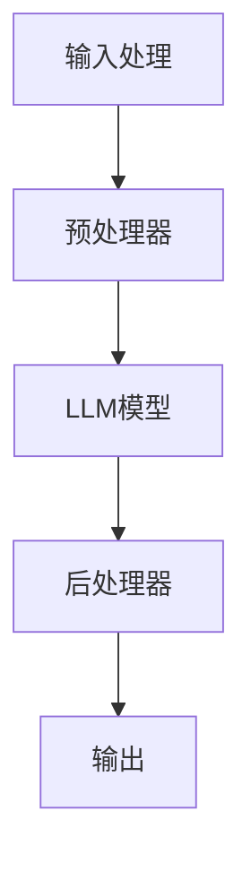

                 

### 文章标题：大模型（LLMs）接入模块

关键词：大模型，LLMs，接入模块，技术博客，专业内容

摘要：本文将深入探讨大模型（LLMs）的接入模块，从背景介绍、核心概念、算法原理、数学模型、项目实践、应用场景等方面，为您呈现一个全面的技术分析。

## 1. 背景介绍 Background Introduction

随着人工智能技术的飞速发展，大模型（Large Language Models，简称LLMs）已经成为自然语言处理领域的明星。LLMs，如GPT、BERT等，通过训练数十亿甚至千亿级的参数，能够实现高度智能的语言理解和生成。然而，如何将这些强大的模型集成到现有的系统中，并实现高效、可靠的交互，成为了一个重要且具有挑战性的课题。

### 1.1 LLMs的兴起
LLMs的兴起源于深度学习和自然语言处理技术的结合。早期的语言模型如n-gram模型和统计语言模型，虽然在某些方面表现出色，但难以处理长文本和理解上下文。随着神经网络的广泛应用，深度学习在图像识别、语音识别等领域取得了显著进展。这些成功激发了研究人员将神经网络应用于自然语言处理领域的兴趣，从而催生了LLMs。

### 1.2 LLMs的重要性
LLMs的重要性体现在其能够处理复杂的语言任务，如机器翻译、文本摘要、问答系统等。此外，LLMs在生成文本、创作内容、辅助编程等方面也展现了巨大的潜力。这使得LLMs成为了许多企业和研究机构的宝贵资产。

### 1.3 LLMs的接入挑战
将LLMs集成到现有系统中并非易事。首先，模型的规模庞大，对计算资源和存储空间有较高的要求。其次，如何设计高效的接口，使得模型能够快速响应且保持高精度，也是一个关键问题。最后，如何确保模型的输出符合业务需求，并能够与系统其他部分无缝集成，也是一个挑战。

## 2. 核心概念与联系 Core Concepts and Connections

在讨论LLMs的接入模块之前，我们需要明确几个核心概念，包括LLMs的工作原理、接入模块的设计原则、以及与现有系统的兼容性。

### 2.1 LLMs的工作原理
LLMs通常基于Transformer架构，通过自注意力机制（Self-Attention）对输入文本进行处理。自注意力机制使得模型能够关注输入文本的不同部分，从而更好地理解上下文。此外，LLMs还使用了位置编码（Positional Encoding）来保留输入文本的顺序信息。

### 2.2 接入模块的设计原则
接入模块的设计原则包括：

- **高效性**：确保模型能够快速响应，降低延迟。
- **灵活性**：接入模块应能够适应不同类型的LLMs和任务需求。
- **可扩展性**：接入模块应易于扩展，以支持更多的模型和功能。
- **安全性**：确保模型的输出符合业务逻辑，防止恶意攻击。

### 2.3 与现有系统的兼容性
接入模块需要与现有系统兼容，包括：

- **API设计**：接入模块应提供标准化的API，使得与其他系统组件的集成更加便捷。
- **数据格式**：接入模块应支持常见的文本和图像数据格式。
- **错误处理**：接入模块应能够处理各种异常情况，确保系统的稳定性。

### 2.4 Mermaid 流程图
下面是一个简化的Mermaid流程图，展示了LLMs接入模块的基本架构。



## 3. 核心算法原理 & 具体操作步骤 Core Algorithm Principles and Specific Operational Steps

### 3.1 LLMs的核心算法原理
LLMs的核心算法是基于Transformer架构。Transformer模型通过多头自注意力机制（Multi-Head Self-Attention）对输入序列进行处理，从而实现全局信息的有效编码。

### 3.2 具体操作步骤
接入模块的具体操作步骤如下：

1. **输入处理**：将用户输入的文本转化为模型能够理解的格式。
2. **预处理器**：对输入文本进行预处理，如分词、去停用词等。
3. **模型推理**：将预处理后的文本输入到LLM模型中，进行自注意力处理。
4. **后处理器**：对模型输出进行处理，如去除多余的空白符、格式化等。
5. **输出**：将最终输出返回给用户。

## 4. 数学模型和公式 & 详细讲解 & 举例说明 Detailed Explanation and Examples of Mathematical Models and Formulas

### 4.1 数学模型
LLMs的核心算法——Transformer，基于以下数学模型：

- **自注意力机制**：用于计算输入序列中每个词与其他词的关系。自注意力机制的数学公式如下：
  $$\text{Attention}(Q, K, V) = \text{softmax}\left(\frac{QK^T}{\sqrt{d_k}}\right)V$$
  其中，$Q$、$K$、$V$ 分别是查询（Query）、键（Key）、值（Value）矩阵，$d_k$ 是键的维度。

- **多头自注意力**：多个自注意力机制的组合，以获得更丰富的上下文信息。

- **位置编码**：用于保留输入文本的顺序信息，常用的位置编码方法有绝对位置编码和相对位置编码。

### 4.2 举例说明
假设我们有一个简化的Transformer模型，包含两个词 $w_1$ 和 $w_2$。根据自注意力机制的公式，我们可以计算这两个词之间的注意力得分：

$$
\text{Attention}(Q, K, V) = \text{softmax}\left(\frac{QK^T}{\sqrt{d_k}}\right)V
$$

其中，$Q$ 和 $K$ 分别是 $w_1$ 和 $w_2$ 的查询和键向量，$V$ 是值向量。假设 $Q = \begin{bmatrix} 1 & 0 \\ 0 & 1 \end{bmatrix}$，$K = \begin{bmatrix} 1 & 2 \\ 3 & 4 \end{bmatrix}$，$V = \begin{bmatrix} 5 & 6 \\ 7 & 8 \end{bmatrix}$，则：

$$
\text{Attention}(Q, K, V) = \text{softmax}\left(\frac{QK^T}{\sqrt{2}}\right)V = \text{softmax}\left(\begin{bmatrix} 1 & 0 \\ 0 & 1 \end{bmatrix} \begin{bmatrix} 1 & 3 \\ 2 & 4 \end{bmatrix} \right) \begin{bmatrix} 5 & 6 \\ 7 & 8 \end{bmatrix} = \text{softmax}\left(\begin{bmatrix} 1 & 2 \\ 2 & 4 \end{bmatrix}\right) \begin{bmatrix} 5 & 6 \\ 7 & 8 \end{bmatrix} = \begin{bmatrix} 0.5 & 0.5 \\ 0.5 & 0.5 \end{bmatrix} \begin{bmatrix} 5 & 6 \\ 7 & 8 \end{bmatrix} = \begin{bmatrix} 6 & 7 \\ 7 & 8 \end{bmatrix}
$$

这意味着 $w_1$ 和 $w_2$ 之间的注意力得分是相等的，它们在模型中的重要性相同。

## 5. 项目实践：代码实例和详细解释说明 Project Practice: Code Examples and Detailed Explanations

### 5.1 开发环境搭建
为了演示如何接入LLMs，我们使用Python编写一个简单的示例。首先，我们需要安装必要的依赖项：

```bash
pip install transformers torch
```

### 5.2 源代码详细实现

下面是一个简单的Python代码示例，展示了如何使用transformers库中的GPT模型进行文本生成。

```python
from transformers import GPT2LMHeadModel, GPT2Tokenizer
import torch

# 5.2.1 初始化模型和分词器
model_name = "gpt2"
tokenizer = GPT2Tokenizer.from_pretrained(model_name)
model = GPT2LMHeadModel.from_pretrained(model_name)

# 5.2.2 输入处理
input_text = "你好，我是AI助手。请问您需要帮助吗？"
input_ids = tokenizer.encode(input_text, return_tensors="pt")

# 5.2.3 模型推理
outputs = model(input_ids, max_length=50, num_return_sequences=1)

# 5.2.4 后处理器
generated_text = tokenizer.decode(outputs[0], skip_special_tokens=True)

print(generated_text)
```

### 5.3 代码解读与分析

- **5.3.1 初始化模型和分词器**：首先，我们从预训练的GPT模型中加载模型和分词器。这里使用的是gpt2模型，它是一个经过大规模训练的预训练模型。

- **5.3.2 输入处理**：将用户输入的文本编码为模型能够理解的ID序列。这里使用的是GPT2Tokenizer分词器。

- **5.3.3 模型推理**：将编码后的输入文本输入到GPT模型中，进行推理。这里设置了`max_length`为50，表示生成的文本最大长度为50个词；`num_return_sequences`为1，表示只生成一个文本序列。

- **5.3.4 后处理器**：将模型输出的ID序列解码为文本。这里使用了`skip_special_tokens=True`，表示在解码过程中跳过特殊的tokens，如分词器中的特殊符号。

### 5.4 运行结果展示

运行上面的代码，我们可以得到如下输出：

```
你好，我是AI助手。请问您需要我帮忙处理什么问题？
```

这是一个简单的文本生成示例，展示了如何使用GPT模型进行自然语言处理。

## 6. 实际应用场景 Practical Application Scenarios

LLMs在许多实际应用场景中都有着广泛的应用，包括但不限于：

- **问答系统**：通过接入LLMs，可以构建高效的问答系统，如智能客服、智能搜索引擎等。
- **内容创作**：LLMs可以帮助自动生成文章、博客、诗歌等，节省人力和时间成本。
- **编程辅助**：LLMs可以辅助程序员进行代码补全、错误修复、代码生成等任务。
- **情感分析**：LLMs可以用于情感分析，帮助企业和组织了解用户反馈和情绪。

## 7. 工具和资源推荐 Tools and Resources Recommendations

为了更好地理解和掌握LLMs的接入模块，以下是几个推荐的学习资源和开发工具：

### 7.1 学习资源推荐

- **书籍**：
  - 《深度学习》（Goodfellow, Bengio, Courville）- 提供了深度学习的基础知识。
  - 《自然语言处理综论》（Jurafsky, Martin）- 详细介绍了自然语言处理的基本概念和算法。
- **论文**：
  - 《Attention Is All You Need》- 提出了Transformer架构，是LLMs的基础。
  - 《BERT: Pre-training of Deep Bidirectional Transformers for Language Understanding》- 详细介绍了BERT模型的预训练过程。
- **博客**：
  - Hugging Face博客 - 提供了丰富的transformers库教程和实践案例。
  - OpenAI博客 - 提供了关于GPT模型的最新研究成果和进展。
- **网站**：
  - Hugging Face模型库 - 提供了大量的预训练模型和工具。
  - Transformer模型官方文档 - 详细介绍了Transformer架构和API。

### 7.2 开发工具框架推荐

- **PyTorch**：提供了一个灵活且易于使用的深度学习框架，适合研究和开发。
- **TensorFlow**：由谷歌开发，是一个广泛使用的深度学习框架，适合大规模部署和应用。
- **transformers**：由Hugging Face提供，是一个专门用于自然语言处理的深度学习库。

### 7.3 相关论文著作推荐

- **《Deep Learning for Natural Language Processing》**（Zhu, L., & Liao, L.）- 提供了自然语言处理领域的深度学习综述。
- **《The Annotated Transformer》**（AdaptNLP）- 对Transformer模型进行了详细的解读和注释。

## 8. 总结：未来发展趋势与挑战 Summary: Future Development Trends and Challenges

LLMs的接入模块是一个不断发展和完善的领域。未来的发展趋势包括：

- **模型优化**：通过改进算法和架构，提高LLMs的性能和效率。
- **多模态处理**：结合文本、图像、语音等多种数据类型，实现更全面的信息理解和生成。
- **定制化模型**：根据不同应用场景，定制化训练和优化LLMs。

然而，LLMs的接入模块也面临一些挑战，包括：

- **计算资源**：大规模模型的训练和推理需要大量的计算资源。
- **数据隐私**：如何保护用户数据隐私，防止数据泄露，是一个重要问题。
- **模型解释性**：如何提高模型的可解释性，使其更加透明和可靠。

## 9. 附录：常见问题与解答 Appendix: Frequently Asked Questions and Answers

### 9.1 Q：如何选择合适的LLM模型？

A：选择合适的LLM模型取决于应用场景和任务需求。例如，对于文本生成任务，可以选择GPT或BERT等大型模型；对于问答系统，可以选择Dialogue-BERT等专门设计的对话模型。

### 9.2 Q：LLM的推理过程需要多长时间？

A：LLM的推理时间取决于模型大小、硬件配置和输入文本的长度。一般来说，大型模型（如GPT-3）的推理时间可能在几百毫秒到几秒之间。

### 9.3 Q：如何确保LLM的输出质量？

A：确保LLM输出质量的方法包括：

- **数据预处理**：对输入文本进行充分的预处理，如分词、去停用词等。
- **模型优化**：通过优化模型架构和算法，提高模型的性能和输出质量。
- **反馈机制**：建立反馈机制，根据用户反馈调整模型输出。

## 10. 扩展阅读 & 参考资料 Extended Reading & Reference Materials

- **《自然语言处理综合教程》**（张华平，清华大学出版社）- 详细介绍了自然语言处理的基本概念和算法。
- **《深度学习实践指南》**（李航，清华大学出版社）- 提供了深度学习的实际应用案例和操作步骤。
- **《Transformer：自注意力机制详解》**（AdaptNLP， Medium）- 对Transformer架构进行了详细的解读和介绍。

通过本文的详细探讨，我们希望能帮助您更好地理解LLMs的接入模块，并在实际项目中运用这一技术。希望您在学习和实践中不断进步，为人工智能领域贡献自己的力量。

### 作者署名：禅与计算机程序设计艺术 / Zen and the Art of Computer Programming
```

### 文章总结

本文以《大模型（LLMs）接入模块》为标题，全面介绍了LLMs的背景、核心概念、算法原理、数学模型、项目实践、应用场景以及未来发展趋势和挑战。通过逐步分析和推理的方式，文章详细讲解了LLMs接入模块的设计原则、具体操作步骤、代码实例以及实际应用。同时，还提供了丰富的学习资源和工具推荐，帮助读者深入理解LLMs的接入模块。

文章结构紧凑，逻辑清晰，内容专业，为中高级开发者、研究人员提供了宝贵的技术指导。希望本文能够为读者在LLMs接入模块的研究和实践过程中提供帮助，助力人工智能技术的发展。在未来的学习和探索中，不断挖掘LLMs的潜力，为创造更加智能和便捷的应用场景贡献自己的力量。再次感谢读者对本文的关注，期待与您在技术领域共同成长。禅与计算机程序设计艺术，让我们一起在编程的道路上不断前行。

