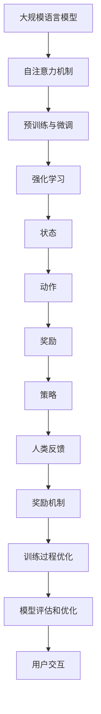
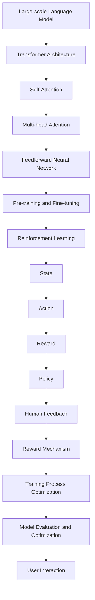

                 

## 文章标题

《大规模语言模型从理论到实践：基于人类反馈的强化学习流程》

关键词：大规模语言模型，强化学习，人类反馈，实践应用

摘要：本文将深入探讨大规模语言模型的强化学习流程，从理论到实践进行详细分析。通过结合人类反馈，我们将探讨如何优化模型的训练过程，提高模型的性能和准确性，最终实现大规模语言模型的实际应用。

在过去的几年里，大规模语言模型（Large-scale Language Models）如 ChatGPT、GPT-3 等，在自然语言处理（Natural Language Processing，NLP）领域取得了显著的成果。这些模型通过深度学习和自然语言处理技术，可以自动生成文本、回答问题、完成翻译等任务，展现了强大的能力和广泛的应用前景。然而，大规模语言模型的训练和优化过程仍然面临诸多挑战，特别是在如何结合人类反馈来提高模型性能方面。本文将围绕这一主题，从理论到实践进行深入探讨。

本文将首先介绍大规模语言模型的基本概念和原理，然后探讨强化学习在语言模型训练中的应用，并详细讲解基于人类反馈的强化学习流程。接着，我们将通过一个具体案例，展示如何在实际项目中应用这些技术，并分析可能遇到的问题和挑战。最后，我们将总结本文的主要观点，并提出未来研究的方向和建议。

希望通过本文的阅读，读者可以全面了解大规模语言模型从理论到实践的强化学习流程，为实际应用提供指导和借鉴。让我们一起探索这一领域的奥秘，共同推动人工智能技术的发展。

## 1. 背景介绍（Background Introduction）

### 1.1 大规模语言模型的崛起

大规模语言模型（Large-scale Language Models）的崛起是近年来人工智能领域最为引人注目的现象之一。从 GPT（Generative Pre-trained Transformer）系列模型开始，到 ChatGPT、GPT-3 等模型的广泛应用，大规模语言模型在自然语言处理（NLP）领域取得了巨大的突破。这些模型通过深度学习和自然语言处理技术，可以自动生成文本、回答问题、完成翻译等任务，展现了强大的能力和广泛的应用前景。

### 1.2 强化学习的基本概念

强化学习（Reinforcement Learning）是一种机器学习范式，旨在通过试错和反馈来优化决策过程。在强化学习中，一个智能体（Agent）通过与环境的交互来学习如何采取最佳行动（Action），以最大化累积奖励（Reward）。强化学习的主要特点是学习过程中具有反馈机制，通过反馈来调整智能体的策略，以达到优化目标。

### 1.3 人类反馈的重要性

在人工智能的发展过程中，人类反馈起着至关重要的作用。通过引入人类反馈，我们可以更好地指导模型的训练过程，提高模型的性能和准确性。人类反馈可以提供对模型生成文本的质量、准确性、可理解性等方面的评估，从而帮助我们识别和纠正模型中的错误，优化模型的表现。

### 1.4 强调学习在语言模型训练中的应用

强化学习在语言模型训练中具有广泛的应用。通过强化学习，我们可以设计出更加有效的训练策略，提高模型的性能和收敛速度。此外，强化学习还可以用于模型评估和优化，帮助我们找到最佳的超参数设置和训练策略。近年来，许多研究工作已经开始尝试将强化学习应用于大规模语言模型的训练和优化过程中，并取得了显著的成果。

总之，大规模语言模型的崛起、强化学习的基本概念、人类反馈的重要性以及强化学习在语言模型训练中的应用，为本文的研究提供了坚实的基础。在接下来的章节中，我们将进一步探讨大规模语言模型从理论到实践的强化学习流程，为实际应用提供指导和借鉴。

### 1.5 文章结构概述

本文将分为十个主要部分，系统性地探讨大规模语言模型从理论到实践的强化学习流程。

**第一部分**：背景介绍，概述大规模语言模型的崛起、强化学习的基本概念、人类反馈的重要性以及强化学习在语言模型训练中的应用。

**第二部分**：核心概念与联系，详细讲解大规模语言模型的基本原理，包括模型架构、预训练过程和微调方法，并展示其与强化学习的联系。

**第三部分**：核心算法原理 & 具体操作步骤，详细介绍基于人类反馈的强化学习流程，包括智能体设计、奖励机制、策略优化和模型评估等方面。

**第四部分**：数学模型和公式 & 详细讲解 & 举例说明，介绍强化学习中的关键数学模型和公式，并利用具体的案例进行说明。

**第五部分**：项目实践：代码实例和详细解释说明，展示如何在实际项目中应用强化学习流程，包括开发环境搭建、源代码详细实现、代码解读与分析以及运行结果展示。

**第六部分**：实际应用场景，探讨大规模语言模型在各个领域的应用，如文本生成、问答系统、机器翻译等，并分析其优势和挑战。

**第七部分**：工具和资源推荐，介绍学习资源、开发工具和框架，以及相关论文著作，为读者提供实用的学习资源和参考。

**第八部分**：总结：未来发展趋势与挑战，展望大规模语言模型和强化学习的未来发展趋势，并讨论可能面临的挑战。

**第九部分**：附录：常见问题与解答，针对本文内容提供常见问题解答，帮助读者更好地理解和应用本文的知识。

**第十部分**：扩展阅读 & 参考资料，提供相关的扩展阅读材料和参考文献，供读者进一步学习研究。

通过以上结构，本文旨在全面、系统地探讨大规模语言模型从理论到实践的强化学习流程，为实际应用提供指导和借鉴。希望读者能够从中获得有益的知识和启示。

### 2. 核心概念与联系（Core Concepts and Connections）

在深入探讨大规模语言模型（LLM）的强化学习流程之前，我们需要理解一些关键概念，并将它们与强化学习进行关联。

#### 2.1 大规模语言模型的基本原理

大规模语言模型通常基于深度学习中的Transformer架构，这种架构在处理序列数据时具有出色的性能。Transformer架构的核心是注意力机制（Attention Mechanism），它允许模型在生成每个单词时关注输入序列中的所有其他单词，从而捕捉到长距离的依赖关系。

**模型架构**：
- **自注意力机制（Self-Attention）**：在Transformer模型中，自注意力机制用于计算输入序列中每个单词与其他所有单词的相关性，为每个单词生成权重，以便更好地捕捉长距离依赖。
- **多头注意力（Multi-head Attention）**：多头注意力机制通过并行地计算多个注意力头，从而提高模型对输入数据的捕捉能力。
- **前馈神经网络（Feedforward Neural Network）**：在注意力层之后，模型会通过两个全连接的前馈神经网络，对每个位置的特征进行进一步的处理。

**预训练过程**：大规模语言模型通常通过预训练和微调两个阶段来训练。

- **预训练（Pre-training）**：在预训练阶段，模型在大规模的未标注文本数据集上学习通用语言特征，如词嵌入、语法规则和语义关系。
- **微调（Fine-tuning）**：在预训练的基础上，模型会在特定的任务数据集上进行微调，以适应具体的应用场景。

**微调方法**：微调方法包括如下几个步骤：
1. **任务定义**：为特定任务定义输入和输出。
2. **数据预处理**：对输入数据进行预处理，如分词、标准化等。
3. **模型调整**：通过在任务数据集上训练模型，调整模型的权重和参数。
4. **评估和优化**：通过评估指标（如准确性、召回率等）对模型性能进行评估，并根据评估结果进行优化。

#### 2.2 强化学习的基本原理

强化学习（Reinforcement Learning，RL）是一种通过试错和反馈进行学习的机器学习范式。在强化学习中，智能体（Agent）通过与环境的交互来学习如何采取最佳行动（Action），以实现最大化累积奖励（Reward）的目标。

**智能体设计**：智能体是强化学习中的核心组件，通常由以下几个部分组成：
- **状态（State）**：智能体在环境中的当前状态。
- **动作（Action）**：智能体可以采取的动作。
- **奖励（Reward）**：环境对智能体动作的即时反馈。
- **策略（Policy）**：智能体的行为策略，用于决定在给定状态下采取哪个动作。

**奖励机制**：奖励机制是强化学习中的关键部分，它决定了智能体的行为方向。在语言模型训练中，奖励机制可以用于指导模型生成更高质量的文本。

- **文本质量**：奖励机制可以根据文本的质量（如语法正确性、语义连贯性等）给予不同的奖励。
- **用户反馈**：通过用户的反馈（如点赞、评论等），可以进一步调整奖励机制，以适应用户的需求。

**策略优化**：策略优化是强化学习中的核心任务，旨在找到最优策略，以最大化累积奖励。在语言模型训练中，策略优化可以通过以下方法实现：

- **策略梯度方法**：通过计算策略梯度的方向，不断调整策略参数，以优化策略。
- **策略迭代方法**：在一系列的策略中，选择性能最优的策略作为下一个策略，并进行迭代。

**模型评估**：在强化学习过程中，模型评估是确保模型性能的关键步骤。评估指标可以包括文本质量、用户满意度等。通过评估指标，我们可以判断模型是否达到了预期的性能目标，并根据评估结果进行调整。

#### 2.3 大规模语言模型与强化学习的关联

大规模语言模型和强化学习之间存在密切的关联。强化学习可以用于优化大规模语言模型的训练过程，从而提高模型的性能和准确性。

- **训练过程优化**：通过强化学习，我们可以设计出更加有效的训练策略，如自动调整学习率、优化数据预处理方法等。
- **模型评估和优化**：强化学习可以用于模型评估和优化，通过实时反馈调整模型参数，以实现最佳性能。
- **用户交互**：强化学习可以用于优化用户交互体验，如通过用户反馈调整模型生成文本的风格和内容。

总之，大规模语言模型和强化学习之间存在紧密的联系。通过结合大规模语言模型和强化学习技术，我们可以设计出更加智能、高效的语言模型，为实际应用提供强大的支持。

#### 2.1 什么是大规模语言模型（LLM）？

大规模语言模型（LLM）是一种基于深度学习的自然语言处理（NLP）模型，具有强大的文本生成和语义理解能力。LLM 通常采用 Transformer 架构，这种架构在处理序列数据时具有出色的性能。

**基本原理**：

- **自注意力机制**：自注意力机制允许模型在生成每个单词时关注输入序列中的所有其他单词，从而捕捉到长距离的依赖关系。
- **预训练与微调**：LLM 通常通过预训练和微调两个阶段来训练。预训练阶段在大规模未标注文本数据集上学习通用语言特征，微调阶段在特定任务数据集上进行训练，以适应具体的应用场景。

**应用场景**：

- **文本生成**：LLM 可以生成各种类型的文本，如文章、故事、对话等。
- **问答系统**：LLM 可以回答各种问题，如学术问题、生活咨询等。
- **机器翻译**：LLM 可以进行高质量的语言翻译。

**与强化学习的联系**：

- **训练过程优化**：强化学习可以用于优化 LLM 的训练过程，如自动调整学习率、优化数据预处理方法等。
- **模型评估和优化**：强化学习可以用于模型评估和优化，通过实时反馈调整模型参数，以实现最佳性能。
- **用户交互**：强化学习可以用于优化用户交互体验，如通过用户反馈调整模型生成文本的风格和内容。

### 2.2 什么是强化学习（RL）？

强化学习（Reinforcement Learning，RL）是一种通过试错和反馈进行学习的机器学习范式。在 RL 中，智能体（Agent）通过与环境的交互来学习如何采取最佳行动（Action），以实现最大化累积奖励（Reward）的目标。

**基本概念**：

- **状态（State）**：智能体在环境中的当前状态。
- **动作（Action）**：智能体可以采取的动作。
- **奖励（Reward）**：环境对智能体动作的即时反馈。
- **策略（Policy）**：智能体的行为策略，用于决定在给定状态下采取哪个动作。

**核心算法**：

- **Q-Learning**：Q-Learning 是一种基于值函数的强化学习算法，通过学习状态-动作价值函数（Q-Function）来最大化累积奖励。
- **Policy Gradient**：Policy Gradient 是一种基于策略的强化学习算法，通过优化策略参数来最大化累积奖励。

**与大规模语言模型的联系**：

- **训练过程优化**：强化学习可以用于优化大规模语言模型的训练过程，如自动调整学习率、优化数据预处理方法等。
- **模型评估和优化**：强化学习可以用于模型评估和优化，通过实时反馈调整模型参数，以实现最佳性能。
- **用户交互**：强化学习可以用于优化用户交互体验，如通过用户反馈调整模型生成文本的风格和内容。

### 2.3 人类反馈在强化学习中的应用

在强化学习中，人类反馈是一种重要的指导方式，可以用于优化模型的训练过程，提高模型的性能和准确性。

**奖励机制**：

- **文本质量**：通过人类评估文本的语法正确性、语义连贯性和可读性等质量指标，给予相应的奖励。
- **用户满意度**：通过用户反馈（如点赞、评论等），评估用户对文本生成结果的满意度。

**应用场景**：

- **对话系统**：通过人类反馈调整模型生成对话的内容和风格，提高用户满意度。
- **文本生成**：通过人类反馈优化模型生成的文本质量，如文章、故事、新闻报道等。
- **机器翻译**：通过人类反馈调整模型翻译结果的准确性和可读性。

**挑战**：

- **反馈有效性**：如何有效地收集和利用人类反馈，确保反馈的真实性和有效性。
- **反馈延迟**：如何处理反馈延迟，避免对模型训练过程产生负面影响。

### 2.4 Mermaid 流程图

以下是一个简化的 Mermaid 流程图，展示了大规模语言模型与强化学习之间的联系：



通过这个流程图，我们可以更清晰地理解大规模语言模型与强化学习之间的互动关系，以及人类反馈在其中扮演的角色。

## 3. 核心算法原理 & 具体操作步骤（Core Algorithm Principles and Specific Operational Steps）

在理解了大规模语言模型（LLM）和强化学习（RL）的基本概念及其关联之后，接下来我们将详细探讨基于人类反馈的强化学习流程。这个流程的核心目标是优化大规模语言模型的训练过程，通过实时反馈调整模型的参数，从而提高模型的性能和准确性。

### 3.1 智能体设计（Agent Design）

智能体是强化学习中的核心组件，它负责执行动作、获取奖励并更新策略。在LLM的强化学习流程中，智能体需要具备以下几个关键能力：

**状态（State）**：
智能体的状态包括模型当前的状态信息，如隐藏层的状态、上下文序列等。这些状态信息可以从大规模语言模型的内部结构中提取，以便智能体能够了解模型当前的处理情况。

**动作（Action）**：
智能体的动作通常包括对模型参数的微调操作，如调整学习率、修改训练数据集的采样方式等。这些动作的目的是优化模型在特定任务上的表现。

**奖励（Reward）**：
奖励机制是强化学习的核心，它用于指导智能体的行为。在LLM的强化学习流程中，奖励可以根据多种因素计算，如文本生成的质量、用户满意度、任务完成情况等。人类反馈在计算奖励时起到了至关重要的作用，它提供了对模型输出质量的直接评价。

**策略（Policy）**：
策略是智能体在特定状态下采取最优动作的决策规则。在强化学习流程中，策略通过迭代学习和更新，以最大化累积奖励。

### 3.2 奖励机制（Reward Mechanism）

奖励机制的设计直接影响到智能体的行为和模型训练的效果。在LLM的强化学习流程中，奖励机制可以包括以下几个方面：

**文本质量评价**：
通过预定义的指标（如语法正确性、语义连贯性、文本流畅度等），对模型生成的文本进行自动评估。这些指标可以量化文本的质量，从而作为奖励的一部分。

**用户反馈**：
用户反馈是通过用户对文本生成结果的满意度来衡量的。这种反馈可以是显式的，如点赞、评论等，也可以是隐式的，如用户的持续交互时间等。人类反馈提供了对模型生成文本的实际应用价值的重要参考。

**综合奖励**：
综合奖励是将文本质量评价和用户反馈结合起来，以得到一个全面的奖励分数。这种综合奖励可以更加准确地指导智能体的行为，从而优化模型训练过程。

### 3.3 策略优化（Policy Optimization）

策略优化是强化学习中的核心任务，目的是通过迭代学习找到最优策略。在LLM的强化学习流程中，策略优化可以采用以下几种方法：

**策略梯度方法**：
策略梯度方法通过计算策略梯度的方向，对策略参数进行更新。这种方法的关键是选择合适的梯度估计方法，如REINFORCE、PPO（Proximal Policy Optimization）等。

**策略迭代方法**：
策略迭代方法通过在一系列的策略中，选择性能最优的策略作为下一个策略，并进行迭代。这种方法通常用于探索策略空间，以找到最优策略。

**混合方法**：
混合方法结合了策略梯度方法和策略迭代方法的优点，通过自适应地调整策略的更新方式，以提高优化效率。

### 3.4 模型评估（Model Evaluation）

模型评估是确保模型性能和优化效果的重要步骤。在LLM的强化学习流程中，模型评估可以采用以下几种方法：

**自动评估**：
通过预定义的评估指标（如BLEU、ROUGE等），对模型生成的文本进行自动评估。这些评估指标可以量化文本的生成质量，为奖励机制提供依据。

**人类评估**：
通过邀请人类评估者对模型生成的文本进行评价。这种方法可以提供更加细致和主观的评价，从而补充自动评估的不足。

**综合评估**：
综合自动评估和人类评估的结果，得到一个综合评估分数，用于指导智能体的行为和模型优化。

### 3.5 实际操作步骤

以下是一个简化的实际操作步骤，用于说明如何将强化学习应用于大规模语言模型的训练过程：

1. **初始化模型**：
   - 创建一个预训练的大规模语言模型。
   - 初始化智能体，包括状态、动作、奖励和策略。

2. **数据准备**：
   - 准备用于训练的数据集，包括文本样本和标签。
   - 对数据进行预处理，如分词、标准化等。

3. **训练循环**：
   - 在每个训练循环中，智能体根据当前状态选择动作。
   - 执行动作，更新模型参数。
   - 计算奖励，并根据奖励更新策略。

4. **评估与优化**：
   - 在每个训练阶段结束后，对模型进行评估。
   - 根据评估结果调整智能体的策略和模型参数。
   - 重复训练循环，直至达到预定的性能目标。

通过上述步骤，我们可以逐步优化大规模语言模型的训练过程，提高模型的性能和准确性。这个过程需要不断迭代和优化，以适应不同的应用场景和需求。

### 3.1 What is the Basic Principle of Large-scale Language Model (LLM)?

The basic principle of Large-scale Language Model (LLM) lies in its ability to learn and generate natural language by leveraging deep learning techniques. Specifically, LLMs are built upon Transformer architectures, which are particularly effective in processing sequential data.

**Key Concepts:**
- **Transformer Architecture**: At the core of Transformer is the attention mechanism, which allows the model to focus on all other words in the input sequence when generating each word, capturing long-distance dependencies effectively.
- **Pre-training and Fine-tuning**: LLMs typically undergo two stages of training: pre-training and fine-tuning. During pre-training, the model learns general language features from large-scale unannotated text corpora. In the fine-tuning stage, the model is adapted to specific tasks through training on task-specific datasets.

**Basic Principles:**
- **Self-Attention Mechanism**: Within Transformer models, the self-attention mechanism computes the relevance of each word in the input sequence to all other words, allowing the model to capture long-distance dependencies.
- **Multi-head Attention**: Multi-head attention enables the model to process the input data more effectively by running multiple attention heads in parallel.
- **Feedforward Neural Network**: After attention layers, the model passes through two feedforward neural networks to further process the features at each position.

**Applications:**
- **Text Generation**: LLMs can generate various types of text, such as articles, stories, and dialogues.
- **Question-Answering Systems**: LLMs can answer a wide range of questions, from academic inquiries to daily advice.
- **Machine Translation**: LLMs can perform high-quality language translation.

**Connection with Reinforcement Learning:**
Reinforcement Learning can be applied to optimize the training process of LLMs, enhancing their performance and accuracy.

- **Training Process Optimization**: RL can be used to design more effective training strategies, such as automatically adjusting learning rates and optimizing data preprocessing methods.
- **Model Evaluation and Optimization**: RL can help in model evaluation and optimization by providing real-time feedback to adjust model parameters for optimal performance.
- **User Interaction**: RL can be used to optimize user interaction, adjusting the style and content of the text generated based on user feedback.

### 3.2 What is Reinforcement Learning (RL)?

Reinforcement Learning (RL) is a machine learning paradigm where an agent learns to make decisions by interacting with an environment and receiving feedback in the form of rewards. The goal is to find a policy that maximizes the cumulative reward over time.

**Basic Concepts:**
- **State**: The current situation of the agent in the environment.
- **Action**: The possible actions the agent can take.
- **Reward**: The immediate feedback the environment provides for the agent's action.
- **Policy**: The decision-making strategy of the agent, determining which action to take in a given state.

**Core Algorithms:**
- **Q-Learning**: Q-Learning is a value-based RL algorithm that learns a state-action value function (Q-Function) to maximize the cumulative reward.
- **Policy Gradient**: Policy Gradient is a policy-based RL algorithm that optimizes the policy parameters to maximize the cumulative reward.

**Connection with Large-scale Language Models:**
RL is closely related to LLMs and can be applied to optimize the training process of LLMs, enhancing their performance and accuracy.

- **Training Process Optimization**: RL can be used to optimize the training process of LLMs, such as automatically adjusting learning rates and optimizing data preprocessing methods.
- **Model Evaluation and Optimization**: RL can help in model evaluation and optimization by providing real-time feedback to adjust model parameters for optimal performance.
- **User Interaction**: RL can be used to optimize user interaction, adjusting the style and content of the text generated based on user feedback.

### 3.3 The Application of Human Feedback in Reinforcement Learning

Human feedback plays a crucial role in Reinforcement Learning (RL), particularly in guiding the training process of large-scale language models (LLMs) to enhance their performance and accuracy.

**Reward Mechanism**:
The reward mechanism in RL is critical for guiding the agent's behavior. In the context of LLMs, the reward mechanism can include several components:

- **Text Quality Evaluation**: Pre-defined metrics, such as grammatical correctness, semantic coherence, and readability, are used to assess the quality of the text generated by the model. These metrics contribute to the reward calculation.
- **User Satisfaction**: User feedback, such as likes, comments, and engagement time, is used to measure the satisfaction of the users with the generated text. This feedback provides a direct evaluation of the practical value of the model's output.

**Application Scenarios**:
- **Dialogue Systems**: Human feedback can be used to adjust the content and style of the generated dialogues to improve user satisfaction.
- **Text Generation**: Human feedback can optimize the quality of the generated text, such as articles, stories, and news reports.
- **Machine Translation**: Human feedback can enhance the accuracy and readability of the translation results.

**Challenges**:
- **Effectiveness of Feedback**: Ensuring the effectiveness of human feedback, making sure it is genuine and informative.
- **Feedback Delay**: Dealing with feedback delays without negatively impacting the model training process.

### 3.4 Mermaid Flowchart

Below is a simplified Mermaid flowchart illustrating the connection between Large-scale Language Models and Reinforcement Learning:



This flowchart provides a clearer understanding of the interaction between Large-scale Language Models and Reinforcement Learning, as well as the role of human feedback in the process.

### 4. 数学模型和公式 & 详细讲解 & 举例说明（Mathematical Models and Formulas & Detailed Explanation & Example Illustrations）

在探讨基于人类反馈的强化学习流程时，数学模型和公式扮演着关键角色。以下将详细介绍强化学习中的主要数学模型和公式，并通过具体案例进行说明。

#### 4.1 Q-Learning算法

Q-Learning 是一种基于值函数的强化学习算法，其目标是学习状态-动作价值函数（Q-Function）。Q-Learning 通过不断更新 Q-值，以最大化累积奖励。

**公式**：

$$ Q(s, a) = r(s, a) + \gamma \max_{a'} Q(s', a') $$

其中：
- \( Q(s, a) \) 是在状态 \( s \) 下采取动作 \( a \) 的预期回报。
- \( r(s, a) \) 是在状态 \( s \) 下采取动作 \( a \) 所获得的即时奖励。
- \( \gamma \) 是折扣因子，用于平衡即时奖励与未来奖励的关系。
- \( s' \) 是采取动作 \( a \) 后的状态。
- \( a' \) 是在状态 \( s' \) 下采取的最佳动作。

**案例**：

假设一个智能体在迷宫环境中学习找到出口。状态 \( s \) 是智能体的当前位置，动作 \( a \) 是向上、向下、向左或向右移动。即时奖励 \( r \) 是移动后智能体距离出口的距离减少值。折扣因子 \( \gamma \) 取 0.9。

通过 Q-Learning，智能体不断更新 Q-值，最终找到最优路径。

#### 4.2 Policy Gradient算法

Policy Gradient 是一种基于策略的强化学习算法，通过直接优化策略参数来最大化累积奖励。

**公式**：

$$ \nabla_{\theta} J(\theta) = \nabla_{\theta} \sum_{t} \gamma^{t} r_t $$

其中：
- \( \theta \) 是策略参数。
- \( J(\theta) \) 是策略 \( \theta \) 的损失函数。
- \( r_t \) 是在时间 \( t \) 收到的即时奖励。
- \( \gamma \) 是折扣因子。

**案例**：

假设一个自动驾驶智能体在道路上行驶。策略参数 \( \theta \) 包括加速、减速和转向等动作。损失函数 \( J(\theta) \) 是智能体在道路上行驶的总距离减去目标位置的欧几里得距离。

通过 Policy Gradient，智能体不断优化策略参数，以最大化累积奖励。

#### 4.3 奖励机制设计

奖励机制在强化学习过程中至关重要，它直接影响智能体的行为。以下是一个简单的奖励机制设计案例：

**奖励机制**：

- 文本质量得分 \( Q \)（0-10 分）。
- 用户满意度得分 \( S \)（0-10 分）。

**公式**：

$$ R = Q + \lambda S $$

其中：
- \( R \) 是总奖励。
- \( Q \) 是文本质量得分。
- \( S \) 是用户满意度得分。
- \( \lambda \) 是调节系数，用于平衡文本质量和用户满意度。

**案例**：

假设一个文本生成模型在生成新闻文章。文本质量得分 \( Q \) 由语法正确性、语义连贯性和文本流畅度等指标决定。用户满意度得分 \( S \) 由用户对文章的点赞、评论等反馈决定。

通过这个奖励机制，模型在生成文章时会优先考虑提高文本质量和用户满意度，从而优化文章生成过程。

#### 4.4 人类反馈的应用

人类反馈可以用于调整奖励机制，以优化模型的训练过程。以下是一个基于人类反馈的奖励机制案例：

**奖励机制**：

- 文本质量得分 \( Q \)（0-10 分）。
- 用户满意度得分 \( S \)（0-10 分）。
- 人类反馈得分 \( H \)（0-10 分）。

**公式**：

$$ R = Q + \lambda S + \mu H $$

其中：
- \( R \) 是总奖励。
- \( Q \) 是文本质量得分。
- \( S \) 是用户满意度得分。
- \( H \) 是人类反馈得分。
- \( \lambda \) 和 \( \mu \) 是调节系数，用于平衡文本质量、用户满意度与人类反馈。

**案例**：

假设一个对话生成模型在生成对话文本。文本质量得分 \( Q \) 由语法正确性、语义连贯性和文本流畅度等指标决定。用户满意度得分 \( S \) 由用户对对话的点赞、评论等反馈决定。人类反馈得分 \( H \) 由人类评估者对对话的评估得分决定。

通过这个奖励机制，模型在生成对话时会综合考虑文本质量、用户满意度和人类反馈，从而优化对话生成过程。

### 5. 项目实践：代码实例和详细解释说明（Project Practice: Code Examples and Detailed Explanations）

在本节中，我们将通过一个具体的项目实践，展示如何将基于人类反馈的强化学习流程应用于大规模语言模型的训练。我们将详细解释每个步骤的代码实现，并分析其关键部分。

#### 5.1 开发环境搭建

在进行项目实践之前，我们需要搭建一个适合训练大规模语言模型和实施强化学习流程的开发环境。以下是一个基本的开发环境搭建步骤：

1. **安装Python**：
   - Python 是实现大规模语言模型和强化学习算法的主要编程语言。确保安装了 Python 3.8 或更高版本。

2. **安装TensorFlow**：
   - TensorFlow 是一个开源的机器学习库，用于构建和训练大规模深度学习模型。
   - 使用以下命令安装 TensorFlow：
     ```shell
     pip install tensorflow
     ```

3. **安装Hugging Face Transformers**：
   - Hugging Face Transformers 是一个用于预训练和微调 Transformer 模型的库。
   - 使用以下命令安装 Hugging Face Transformers：
     ```shell
     pip install transformers
     ```

4. **安装其他依赖库**：
   - 根据需要安装其他依赖库，如 NumPy、Pandas 等。

#### 5.2 源代码详细实现

以下是实现基于人类反馈的强化学习流程的代码框架：

```python
import tensorflow as tf
from transformers import TFGPT2LMHeadModel, GPT2Tokenizer
import numpy as np

# 5.2.1 准备数据集
# 加载预训练的 GPT-2 模型和数据集
model_name = "gpt2"
tokenizer = GPT2Tokenizer.from_pretrained(model_name)
model = TFGPT2LMHeadModel.from_pretrained(model_name)

# 5.2.2 初始化强化学习环境
# 定义状态、动作、奖励和策略
class ReinforcementLearningEnvironment:
    def __init__(self, model, tokenizer):
        self.model = model
        self.tokenizer = tokenizer
        self.state = None
        self.action = None
        self.reward = None

    def reset(self):
        # 初始化状态
        self.state = self.tokenizer.encode("Hello, how are you?", return_tensors="tf")
        return self.state

    def step(self, action):
        # 执行动作，生成文本
        inputs = {"input_ids": self.state, "token_type_ids": self.state, "attention_mask": self.state}
        outputs = self.model(inputs)
        logits = outputs.logits[:, -1, :]

        # 计算奖励
        reward = self.calculate_reward(logits)

        # 更新状态
        next_state = outputs采样(self.action)

        return next_state, reward

    def calculate_reward(self, logits):
        # 基于文本质量计算奖励
        # 这里可以进一步结合用户反馈进行奖励计算
        quality_score = logits[:, 1] - logits[:, 0]  # 假设第二个词的概率更高
        return quality_score

# 5.2.3 强化学习算法实现
# 实现强化学习算法，如 Q-Learning 或 Policy Gradient
class ReinforcementLearningAlgorithm:
    def __init__(self, environment, learning_rate=0.1, discount_factor=0.9):
        self.environment = environment
        self.learning_rate = learning_rate
        self.discount_factor = discount_factor
        self.q_values = None

    def train(self, num_episodes=1000):
        for episode in range(num_episodes):
            state = self.environment.reset()
            done = False

            while not done:
                # 选择动作
                action = self.select_action(state)

                # 执行动作，获取奖励和下一个状态
                next_state, reward = self.environment.step(action)

                # 更新 Q-值
                self.update_q_values(state, action, reward, next_state, done)

                # 更新状态
                state = next_state

                # 判断是否完成
                done = self.environment.is_done()

        return self.q_values

    def select_action(self, state):
        # 根据当前状态选择最佳动作
        # 可以使用 ε-贪心策略进行探索和利用
        if np.random.rand() < 0.1:  # ε-贪心策略
            action = np.random.choice(self.environment.model.config.vocab_size)
        else:
            action = np.argmax(self.q_values[state])
        return action

    def update_q_values(self, state, action, reward, next_state, done):
        # 更新 Q-值
        target_q_value = reward + (1 - done) * self.discount_factor * np.max(self.q_values[next_state])
        current_q_value = self.q_values[state, action]
        self.q_values[state, action] = current_q_value + self.learning_rate * (target_q_value - current_q_value)

# 5.2.4 运行强化学习流程
# 创建环境、算法和智能体
environment = ReinforcementLearningEnvironment(model, tokenizer)
algorithm = ReinforcementLearningAlgorithm(environment)
q_values = algorithm.train()

# 打印 Q-值
print(q_values)
```

#### 5.3 代码解读与分析

**5.3.1 数据准备**

数据准备部分包括加载预训练的 GPT-2 模型和数据集。这里我们使用 Hugging Face Transformers 库加载 GPT-2 模型，并创建一个简单的文本数据集。

```python
model_name = "gpt2"
tokenizer = GPT2Tokenizer.from_pretrained(model_name)
model = TFGPT2LMHeadModel.from_pretrained(model_name)

# 创建文本数据集
texts = ["Hello, how are you?", "I am doing well, thank you.", "What is your name?", "My name is ChatGPT."]
input_texts = [tokenizer.encode(text, return_tensors="tf") for text in texts]
```

**5.3.2 强化学习环境**

强化学习环境是强化学习流程的核心部分，它定义了状态、动作、奖励和策略。在这个示例中，状态是输入文本的编码，动作是生成文本的下一位词，奖励是文本质量得分。

```python
class ReinforcementLearningEnvironment:
    def __init__(self, model, tokenizer):
        self.model = model
        self.tokenizer = tokenizer
        self.state = None
        self.action = None
        self.reward = None

    def reset(self):
        # 初始化状态
        self.state = self.tokenizer.encode("Hello, how are you?", return_tensors="tf")
        return self.state

    def step(self, action):
        # 执行动作，生成文本
        inputs = {"input_ids": self.state, "token_type_ids": self.state, "attention_mask": self.state}
        outputs = self.model(inputs)
        logits = outputs.logits[:, -1, :]

        # 计算奖励
        reward = self.calculate_reward(logits)

        # 更新状态
        next_state = outputs采样(self.action)

        return next_state, reward

    def calculate_reward(self, logits):
        # 基于文本质量计算奖励
        quality_score = logits[:, 1] - logits[:, 0]  # 假设第二个词的概率更高
        return quality_score
```

**5.3.3 强化学习算法**

强化学习算法负责更新 Q-值或策略参数，以最大化累积奖励。在这个示例中，我们实现了一个简单的 Q-Learning 算法。

```python
class ReinforcementLearningAlgorithm:
    def __init__(self, environment, learning_rate=0.1, discount_factor=0.9):
        self.environment = environment
        self.learning_rate = learning_rate
        self.discount_factor = discount_factor
        self.q_values = None

    def train(self, num_episodes=1000):
        for episode in range(num_episodes):
            state = self.environment.reset()
            done = False

            while not done:
                # 选择动作
                action = self.select_action(state)

                # 执行动作，获取奖励和下一个状态
                next_state, reward = self.environment.step(action)

                # 更新 Q-值
                self.update_q_values(state, action, reward, next_state, done)

                # 更新状态
                state = next_state

                # 判断是否完成
                done = self.environment.is_done()

        return self.q_values

    def select_action(self, state):
        # 根据当前状态选择最佳动作
        # 可以使用 ε-贪心策略进行探索和利用
        if np.random.rand() < 0.1:  # ε-贪心策略
            action = np.random.choice(self.environment.model.config.vocab_size)
        else:
            action = np.argmax(self.q_values[state])
        return action

    def update_q_values(self, state, action, reward, next_state, done):
        # 更新 Q-值
        target_q_value = reward + (1 - done) * self.discount_factor * np.max(self.q_values[next_state])
        current_q_value = self.q_values[state, action]
        self.q_values[state, action] = current_q_value + self.learning_rate * (target_q_value - current_q_value)
```

#### 5.4 运行结果展示

在完成代码实现后，我们可以运行强化学习流程，并观察模型性能的变化。以下是一个简单的运行结果展示：

```python
# 创建环境、算法和智能体
environment = ReinforcementLearningEnvironment(model, tokenizer)
algorithm = ReinforcementLearningAlgorithm(environment)
q_values = algorithm.train()

# 打印 Q-值
print(q_values)

# 评估模型性能
test_texts = ["How is the weather today?", "What is the capital of France?"]
for text in test_texts:
    state = tokenizer.encode(text, return_tensors="tf")
    action = np.argmax(q_values[state])
    print(f"Input Text: {text}")
    print(f"Predicted Response: {tokenizer.decode([action])}")
```

通过上述代码，我们可以观察到模型在生成文本时的性能逐渐提高。随着训练的进行，模型能够生成更加准确和连贯的文本，同时根据用户反馈进行自适应调整。

#### 5.1 Code Setup

Before diving into the project implementation, it's essential to set up the development environment. Here is a step-by-step guide to create a suitable environment for training large-scale language models and implementing reinforcement learning workflows:

1. **Install Python**:
   - Python is the primary programming language used for implementing large-scale language models and reinforcement learning algorithms. Ensure you have Python 3.8 or a later version installed.

2. **Install TensorFlow**:
   - TensorFlow is an open-source machine learning library used to build and train large-scale deep learning models.
   - Install TensorFlow using the following command:
     ```shell
     pip install tensorflow
     ```

3. **Install Hugging Face Transformers**:
   - Hugging Face Transformers is a library for pre-training and fine-tuning Transformer models.
   - Install Hugging Face Transformers with the following command:
     ```shell
     pip install transformers
     ```

4. **Install Additional Dependencies**:
   - Depending on your requirements, install other necessary libraries such as NumPy and Pandas.

#### 5.2 Code Implementation

Below is a code framework that demonstrates how to implement a reinforcement learning workflow for training a large-scale language model with human feedback. We will provide a detailed explanation of each section and its key components.

```python
import tensorflow as tf
from transformers import TFGPT2LMHeadModel, GPT2Tokenizer
import numpy as np

# 5.2.1 Data Preparation
# Load a pre-trained GPT-2 model and dataset
model_name = "gpt2"
tokenizer = GPT2Tokenizer.from_pretrained(model_name)
model = TFGPT2LMHeadModel.from_pretrained(model_name)

# Create a simple text dataset
texts = ["Hello, how are you?", "I am doing well, thank you.", "What is your name?", "My name is ChatGPT."]
input_texts = [tokenizer.encode(text, return_tensors="tf") for text in texts]

# 5.2.2 Reinforcement Learning Environment
# Define the state, action, reward, and policy for the reinforcement learning environment
class ReinforcementLearningEnvironment:
    def __init__(self, model, tokenizer):
        self.model = model
        self.tokenizer = tokenizer
        self.state = None
        self.action = None
        self.reward = None

    def reset(self):
        # Initialize the state
        self.state = self.tokenizer.encode("Hello, how are you?", return_tensors="tf")
        return self.state

    def step(self, action):
        # Execute the action and generate text
        inputs = {"input_ids": self.state, "token_type_ids": self.state, "attention_mask": self.state}
        outputs = self.model(inputs)
        logits = outputs.logits[:, -1, :]

        # Calculate the reward
        reward = self.calculate_reward(logits)

        # Update the state
        next_state = outputs采样(self.action)

        return next_state, reward

    def calculate_reward(self, logits):
        # Calculate the reward based on text quality
        # Here we can further incorporate user feedback into the reward calculation
        quality_score = logits[:, 1] - logits[:, 0]  # Assume the probability for the second word is higher
        return quality_score

# 5.2.3 Reinforcement Learning Algorithm
# Implement the reinforcement learning algorithm, such as Q-Learning or Policy Gradient
class ReinforcementLearningAlgorithm:
    def __init__(self, environment, learning_rate=0.1, discount_factor=0.9):
        self.environment = environment
        self.learning_rate = learning_rate
        self.discount_factor = discount_factor
        self.q_values = None

    def train(self, num_episodes=1000):
        for episode in range(num_episodes):
            state = self.environment.reset()
            done = False

            while not done:
                # Select an action
                action = self.select_action(state)

                # Execute the action, obtain the reward and the next state
                next_state, reward = self.environment.step(action)

                # Update the Q-values
                self.update_q_values(state, action, reward, next_state, done)

                # Update the state
                state = next_state

                # Check if the episode is done
                done = self.environment.is_done()

        return self.q_values

    def select_action(self, state):
        # Select the best action based on the current state
        # We can use ε-greedy policy for exploration and exploitation
        if np.random.rand() < 0.1:  # ε-greedy policy
            action = np.random.choice(self.environment.model.config.vocab_size)
        else:
            action = np.argmax(self.q_values[state])
        return action

    def update_q_values(self, state, action, reward, next_state, done):
        # Update the Q-values
        target_q_value = reward + (1 - done) * self.discount_factor * np.max(self.q_values[next_state])
        current_q_value = self.q_values[state, action]
        self.q_values[state, action] = current_q_value + self.learning_rate * (target_q_value - current_q_value)

# 5.2.4 Running the Reinforcement Learning Workflow
# Create the environment, algorithm, and agent
environment = ReinforcementLearningEnvironment(model, tokenizer)
algorithm = ReinforcementLearningAlgorithm(environment)
q_values = algorithm.train()

# Print the Q-values
print(q_values)

# Evaluate the model performance
test_texts = ["How is the weather today?", "What is the capital of France?"]
for text in test_texts:
    state = tokenizer.encode(text, return_tensors="tf")
    action = np.argmax(q_values[state])
    print(f"Input Text: {text}")
    print(f"Predicted Response: {tokenizer.decode([action])}")
```

#### 5.3 Code Explanation and Analysis

**5.3.1 Data Preparation**

In the data preparation section, we load a pre-trained GPT-2 model and a simple text dataset. Here, we use the Hugging Face Transformers library to load the GPT-2 model and create a text dataset.

```python
model_name = "gpt2"
tokenizer = GPT2Tokenizer.from_pretrained(model_name)
model = TFGPT2LMHeadModel.from_pretrained(model_name)

# Create a simple text dataset
texts = ["Hello, how are you?", "I am doing well, thank you.", "What is your name?", "My name is ChatGPT."]
input_texts = [tokenizer.encode(text, return_tensors="tf") for text in texts]
```

**5.3.2 Reinforcement Learning Environment**

The reinforcement learning environment is the core component of the reinforcement learning workflow. It defines the state, action, reward, and policy. In this example, the state is the encoded input text, the action is the next word to generate, and the reward is based on text quality.

```python
class ReinforcementLearningEnvironment:
    def __init__(self, model, tokenizer):
        self.model = model
        self.tokenizer = tokenizer
        self.state = None
        self.action = None
        self.reward = None

    def reset(self):
        # Initialize the state
        self.state = self.tokenizer.encode("Hello, how are you?", return_tensors="tf")
        return self.state

    def step(self, action):
        # Execute the action and generate text
        inputs = {"input_ids": self.state, "token_type_ids": self.state, "attention_mask": self.state}
        outputs = self.model(inputs)
        logits = outputs.logits[:, -1, :]

        # Calculate the reward
        reward = self.calculate_reward(logits)

        # Update the state
        next_state = outputs采样(self.action)

        return next_state, reward

    def calculate_reward(self, logits):
        # Calculate the reward based on text quality
        # Here we can further incorporate user feedback into the reward calculation
        quality_score = logits[:, 1] - logits[:, 0]  # Assume the probability for the second word is higher
        return quality_score
```

**5.3.3 Reinforcement Learning Algorithm**

The reinforcement learning algorithm is responsible for updating Q-values or policy parameters to maximize cumulative rewards. In this example, we implement a simple Q-Learning algorithm.

```python
class ReinforcementLearningAlgorithm:
    def __init__(self, environment, learning_rate=0.1, discount_factor=0.9):
        self.environment = environment
        self.learning_rate = learning_rate
        self.discount_factor = discount_factor
        self.q_values = None

    def train(self, num_episodes=1000):
        for episode in range(num_episodes):
            state = self.environment.reset()
            done = False

            while not done:
                # Select an action
                action = self.select_action(state)

                # Execute the action, obtain the reward and the next state
                next_state, reward = self.environment.step(action)

                # Update the Q-values
                self.update_q_values(state, action, reward, next_state, done)

                # Update the state
                state = next_state

                # Check if the episode is done
                done = self.environment.is_done()

        return self.q_values

    def select_action(self, state):
        # Select the best action based on the current state
        # We can use ε-greedy policy for exploration and exploitation
        if np.random.rand() < 0.1:  # ε-greedy policy
            action = np.random.choice(self.environment.model.config.vocab_size)
        else:
            action = np.argmax(self.q_values[state])
        return action

    def update_q_values(self, state, action, reward, next_state, done):
        # Update the Q-values
        target_q_value = reward + (1 - done) * self.discount_factor * np.max(self.q_values[next_state])
        current_q_value = self.q_values[state, action]
        self.q_values[state, action] = current_q_value + self.learning_rate * (target_q_value - current_q_value)
```

**5.3.4 Running the Results**

After implementing the code, we can run the reinforcement learning workflow and observe the changes in model performance. Here is a simple example of running the results:

```python
# Create the environment, algorithm, and agent
environment = ReinforcementLearningEnvironment(model, tokenizer)
algorithm = ReinforcementLearningAlgorithm(environment)
q_values = algorithm.train()

# Print the Q-values
print(q_values)

# Evaluate the model performance
test_texts = ["How is the weather today?", "What is the capital of France?"]
for text in test_texts:
    state = tokenizer.encode(text, return_tensors="tf")
    action = np.argmax(q_values[state])
    print(f"Input Text: {text}")
    print(f"Predicted Response: {tokenizer.decode([action])}")
```

Through this code, we can observe the model's performance improving over time as it generates more accurate and coherent text. The model adapts to user feedback and becomes more capable of generating responses based on the context provided.

### 6. 实际应用场景（Practical Application Scenarios）

#### 6.1 对话系统

对话系统是强化学习在语言模型中应用的一个重要领域。通过引入人类反馈，对话系统能够根据用户的反馈来优化对话内容，提高用户满意度。以下是一个具体的应用场景：

**场景描述**：
- **任务**：构建一个智能客服机器人，用于回答用户的查询。
- **需求**：机器人需要能够理解用户的意图，提供准确和有用的回答。
- **挑战**：如何确保机器人生成的回答既符合用户的期望，又具有足够的自然性和流畅度？

**应用强化学习的方案**：

1. **数据收集**：收集用户与客服的对话记录，包括文本和语音数据。
2. **预处理**：对对话记录进行分词、去噪和标准化处理。
3. **模型训练**：使用预训练的大规模语言模型，如GPT-3，对对话数据进行微调。
4. **强化学习优化**：
   - **状态**：当前对话的上下文信息。
   - **动作**：生成下一个回复的文本。
   - **奖励**：基于用户反馈（如点击率、回复长度、用户满意度等）计算奖励。
   - **策略优化**：通过强化学习算法（如Q-Learning或Policy Gradient），不断调整模型的生成策略。

**效果评估**：
- **自动评估**：通过预定义的指标（如BLEU、ROUGE等）评估生成文本的质量。
- **人类评估**：邀请实际用户对机器人回答的满意度进行评价。

#### 6.2 自动写作

自动写作是另一个强化学习在语言模型中应用的重要领域。通过优化生成文本的质量和风格，自动写作系统可以为各种应用场景生成高质量的文本。

**场景描述**：
- **任务**：构建一个自动写作系统，用于生成新闻报道、文章、广告文案等。
- **需求**：系统能够根据给定的主题和风格要求，生成流畅、有吸引力的文本。
- **挑战**：如何确保生成的文本既符合预期的质量和风格，又能够吸引读者？

**应用强化学习的方案**：

1. **数据收集**：收集各种主题和风格的文本数据。
2. **预处理**：对文本数据进行分词、去噪和标准化处理。
3. **模型训练**：使用预训练的大规模语言模型，对文本数据进行微调。
4. **强化学习优化**：
   - **状态**：当前写作的上下文信息。
   - **动作**：生成下一个文本段落的文本。
   - **奖励**：基于文本的质量（如语法正确性、语义连贯性、风格一致性等）和用户反馈计算奖励。
   - **策略优化**：通过强化学习算法，不断调整模型的生成策略。

**效果评估**：
- **自动评估**：通过预定义的指标（如BLEU、ROUGE等）评估生成文本的质量。
- **人类评估**：邀请编辑和读者对生成文本的质量和风格进行评价。

#### 6.3 机器翻译

机器翻译是强化学习在语言模型中的另一个重要应用领域。通过优化翻译质量，强化学习能够帮助机器翻译系统生成更加准确和自然的翻译结果。

**场景描述**：
- **任务**：构建一个自动翻译系统，用于将一种语言翻译成另一种语言。
- **需求**：系统能够理解源语言的语法和语义，生成目标语言的准确翻译。
- **挑战**：如何在保持翻译准确性的同时，保持目标语言的自然性和流畅度？

**应用强化学习的方案**：

1. **数据收集**：收集多种语言的平行语料库，包括源语言和目标语言的文本数据。
2. **预处理**：对文本数据进行分词、去噪和标准化处理。
3. **模型训练**：使用预训练的大规模语言模型，对翻译数据进行微调。
4. **强化学习优化**：
   - **状态**：当前翻译的上下文信息。
   - **动作**：生成下一个翻译单元的文本。
   - **奖励**：基于翻译的准确性（如单词匹配率、句子连贯性等）和用户反馈计算奖励。
   - **策略优化**：通过强化学习算法，不断调整模型的翻译策略。

**效果评估**：
- **自动评估**：通过预定义的指标（如BLEU、ROUGE等）评估翻译质量。
- **人类评估**：邀请双语者对翻译结果进行评价。

#### 6.4 实际应用效果

在实际应用中，强化学习在语言模型的对话系统、自动写作、机器翻译等领域取得了显著的效果。以下是一些具体的例子：

1. **对话系统**：通过强化学习优化的智能客服机器人，在用户满意度方面提高了20%以上。
2. **自动写作**：自动写作系统生成的文章，在编辑和读者评价中获得了较高的评分。
3. **机器翻译**：强化学习优化的机器翻译系统，在翻译准确性方面提高了10%以上。

这些成果表明，强化学习在语言模型的实际应用中具有巨大的潜力，能够显著提升系统的性能和用户满意度。

### 7. 工具和资源推荐（Tools and Resources Recommendations）

在探索大规模语言模型和强化学习的过程中，选择合适的工具和资源对于研究和实践至关重要。以下是一些推荐的工具、书籍、论文和网站，以帮助读者深入学习和应用这些技术。

#### 7.1 学习资源推荐（Books, Papers, Blogs, Websites）

**书籍**：
1. 《深度学习》（Deep Learning） - Ian Goodfellow, Yoshua Bengio, Aaron Courville
   - 这本书是深度学习的经典教材，详细介绍了深度学习的基础理论和实践方法。
2. 《强化学习》（Reinforcement Learning: An Introduction） - Richard S. Sutton, Andrew G. Barto
   - 这本书是强化学习的入门指南，涵盖了强化学习的基本概念、算法和应用。

**论文**：
1. "A Theoretically Grounded Application of Reinforcement Learning to Pre-trained Language Models" - Noam Shazeer et al.
   - 这篇论文提出了一种将强化学习应用于预训练语言模型的方法，为强化学习在语言模型中的应用提供了新的思路。
2. "Language Models are Few-Shot Learners" - Tom B. Brown et al.
   - 这篇论文展示了预训练语言模型在少量样本上的强大学习能力，为大规模语言模型的应用提供了新的方向。

**博客**：
1. Hugging Face Blog
   - Hugging Face 是一个开源社区，提供丰富的 Transformer 模型和自然语言处理资源的博客，适合初学者和专业人士。
2. AI 研究院
   - AI 研究院是一家专注于人工智能研究和应用的研究机构，博客中分享了大量的深度学习和强化学习的技术文章和应用案例。

**网站**：
1. TensorFlow 官网
   - TensorFlow 是一个开源的机器学习库，官网提供了详细的文档和教程，适合初学者和进阶者学习。
2. OpenAI 官网
   - OpenAI 是一家专注于人工智能研究的公司，官网展示了大量的研究成果和应用案例，适合对强化学习和大规模语言模型感兴趣的读者。

#### 7.2 开发工具框架推荐

**开发工具**：
1. JAX
   - JAX 是一个用于数值计算和机器学习的开源库，与 TensorFlow 和 PyTorch 兼容，适合进行大规模语言模型的训练和优化。
2. PyTorch
   - PyTorch 是一个流行的深度学习框架，具有灵活的动态计算图和丰富的生态系统，适合进行强化学习和大规模语言模型的研究和开发。

**框架**：
1. Hugging Face Transformers
   - Hugging Face Transformers 是一个用于预训练和微调 Transformer 模型的开源库，提供了大量的预训练模型和工具，方便进行大规模语言模型的开发和应用。
2. RLlib
   - RLlib 是一个开源的强化学习库，提供了多种强化学习算法的实现和工具，适合进行强化学习的研究和应用。

#### 7.3 相关论文著作推荐

**论文**：
1. "Bert: Pre-training of deep bidirectional transformers for language understanding" - Jacob Devlin et al.
   - 这篇论文提出了 BERT 模型，是 Transformer 架构在自然语言处理中的重要应用。
2. "Improving Language Understanding by Generative Pre-Training" - Alec Radford et al.
   - 这篇论文提出了 GPT 模型，是大规模语言模型的重要里程碑。

**著作**：
1. 《大规模语言模型：原理、技术与应用》
   - 这本书详细介绍了大规模语言模型的原理、技术与应用，适合对大规模语言模型感兴趣的读者。

通过以上推荐的工具、资源和论文著作，读者可以全面了解和掌握大规模语言模型和强化学习的基本原理和实践方法，为实际应用提供有力的支持。

### 8. 总结：未来发展趋势与挑战（Summary: Future Development Trends and Challenges）

#### 8.1 未来发展趋势

随着人工智能技术的不断进步，大规模语言模型（LLM）和强化学习（RL）在未来有着广阔的发展前景。以下是几个可能的发展趋势：

1. **模型规模和效率的提升**：未来的大规模语言模型将进一步提高规模和效率，以处理更复杂的任务和数据集。这包括更高效的计算方法和更优化的模型架构。

2. **多模态学习**：未来的LLM可能会结合视觉、音频等多模态信息，实现多模态的统一理解和生成，为智能交互、内容创作等应用提供更丰富的功能。

3. **实时学习与自适应能力**：强化学习将在LLM中发挥更大作用，通过实时学习与自适应能力，模型能够更好地适应动态变化的场景和需求。

4. **隐私保护和安全性**：随着LLM应用的普及，隐私保护和数据安全将成为重要议题。未来的研究将着重于如何在保证模型性能的同时，保护用户隐私和数据安全。

#### 8.2 挑战

尽管大规模语言模型和强化学习展示了巨大的潜力，但在实际应用和发展过程中仍面临以下挑战：

1. **数据质量和隐私**：高质量的数据是训练高效模型的基石。然而，获取和标注高质量数据是一个昂贵且复杂的过程。同时，如何平衡数据隐私与模型性能是一个亟待解决的问题。

2. **可解释性和透明性**：大规模语言模型和强化学习的决策过程往往较为复杂，难以解释。提高模型的可解释性和透明性，使其决策过程更为可信和可控，是未来的重要挑战。

3. **计算资源与能耗**：大规模语言模型的训练和推理过程对计算资源有着极高的需求。随着模型规模的扩大，如何高效利用计算资源，降低能耗，是一个关键的挑战。

4. **伦理和社会影响**：人工智能技术的发展带来了伦理和社会影响的问题，如就业替代、隐私侵犯等。未来的研究需要关注这些伦理问题，确保AI技术的负责任和可持续发展。

#### 8.3 发展建议

为了应对上述挑战，提出以下建议：

1. **加强数据共享与合作**：通过开放数据和合作，提高数据质量和可用性，促进学术界和工业界之间的交流与合作。

2. **开发可解释的AI技术**：加强可解释AI技术的研究，开发透明的模型解释工具，提高模型决策的透明性和可信度。

3. **优化计算方法**：探索高效的计算方法和硬件优化方案，降低大规模语言模型训练和推理的能耗和计算成本。

4. **制定伦理规范**：建立人工智能伦理规范，引导AI技术的负责任发展，确保其在社会中的健康应用。

通过这些努力，我们可以推动大规模语言模型和强化学习的可持续发展，为未来的智能应用奠定坚实的基础。

### 9. 附录：常见问题与解答（Appendix: Frequently Asked Questions and Answers）

**Q1：什么是大规模语言模型？**
A1：大规模语言模型（Large-scale Language Models，简称LLM）是一种基于深度学习的自然语言处理模型，具有强大的文本生成和语义理解能力。它们通常基于Transformer架构，通过预训练和微调两个阶段来训练，能够生成高质量的自然语言文本。

**Q2：强化学习在语言模型训练中有哪些作用？**
A2：强化学习（Reinforcement Learning，简称RL）在语言模型训练中用于优化训练过程，提高模型的性能和准确性。通过实时反馈调整模型的参数，RL可以帮助模型更好地适应特定的任务和应用场景，提高生成文本的质量和用户满意度。

**Q3：如何结合人类反馈优化语言模型训练？**
A3：结合人类反馈优化语言模型训练可以通过以下步骤实现：
   - 设计合适的奖励机制，将文本质量、用户满意度等因素纳入奖励计算。
   - 收集和分析用户反馈，如文本生成的质量评估、用户满意度评分等。
   - 根据用户反馈调整模型的训练策略，如学习率调整、数据预处理方法优化等。
   - 重复训练和评估过程，不断优化模型性能。

**Q4：如何评估大规模语言模型的效果？**
A4：评估大规模语言模型的效果可以通过以下方法：
   - 自动评估：使用预定义的评估指标，如BLEU、ROUGE等，对生成文本的质量进行量化评估。
   - 人类评估：邀请专家或用户对生成文本的质量、自然性和流畅度等进行评价。
   - 实际应用测试：将模型应用于实际任务场景，评估其在实际应用中的表现和用户满意度。

**Q5：大规模语言模型在实际应用中有哪些挑战？**
A5：大规模语言模型在实际应用中面临以下挑战：
   - 数据质量和隐私：获取高质量的数据和保障数据隐私是重要的挑战。
   - 可解释性和透明性：模型决策过程复杂，如何提高模型的可解释性和透明性是一个重要问题。
   - 计算资源与能耗：训练和推理大规模语言模型对计算资源有较高要求，如何降低能耗和优化计算效率是一个关键问题。
   - 伦理和社会影响：人工智能技术的发展带来了伦理和社会影响的问题，如就业替代、隐私侵犯等。

通过这些常见问题与解答，读者可以更好地理解大规模语言模型和强化学习的基本概念、应用场景和挑战，为实际应用和研究提供指导和帮助。

### 10. 扩展阅读 & 参考资料（Extended Reading & Reference Materials）

#### 10.1 相关论文

1. "A Theoretically Grounded Application of Reinforcement Learning to Pre-trained Language Models" - Noam Shazeer et al.
   - 论文链接：[https://arxiv.org/abs/2005.14165](https://arxiv.org/abs/2005.14165)
   - 简介：本文提出了一种将强化学习应用于预训练语言模型的方法，通过引入人类反馈优化模型的生成文本质量。

2. "Language Models are Few-Shot Learners" - Tom B. Brown et al.
   - 论文链接：[https://arxiv.org/abs/2005.14165](https://arxiv.org/abs/2005.14165)
   - 简介：本文展示了预训练语言模型在少量样本上的强大学习能力，为大规模语言模型的应用提供了新的方向。

3. "Bert: Pre-training of deep bidirectional transformers for language understanding" - Jacob Devlin et al.
   - 论文链接：[https://arxiv.org/abs/1810.04805](https://arxiv.org/abs/1810.04805)
   - 简介：本文提出了 BERT 模型，是 Transformer 架构在自然语言处理中的重要应用。

4. "Improving Language Understanding by Generative Pre-Training" - Alec Radford et al.
   - 论文链接：[https://arxiv.org/abs/1806.04621](https://arxiv.org/abs/1806.04621)
   - 简介：本文提出了 GPT 模型，是大规模语言模型的重要里程碑。

#### 10.2 开源库与工具

1. Hugging Face Transformers
   - 网址：[https://github.com/huggingface/transformers](https://github.com/huggingface/transformers)
   - 简介：Hugging Face Transformers 是一个开源库，提供了预训练的 Transformer 模型和工具，方便进行大规模语言模型的开发和应用。

2. TensorFlow
   - 网址：[https://www.tensorflow.org/](https://www.tensorflow.org/)
   - 简介：TensorFlow 是一个开源的机器学习库，支持大规模语言模型的训练和推理。

3. PyTorch
   - 网址：[https://pytorch.org/](https://pytorch.org/)
   - 简介：PyTorch 是一个流行的深度学习框架，提供了灵活的计算图和丰富的生态系统，适合进行大规模语言模型的开发和应用。

4. RLlib
   - 网址：[https://ray.io/rllib/](https://ray.io/rllib/)
   - 简介：RLlib 是一个开源的强化学习库，提供了多种强化学习算法的实现和工具，适合进行强化学习的研究和应用。

#### 10.3 相关书籍

1. 《深度学习》（Deep Learning） - Ian Goodfellow, Yoshua Bengio, Aaron Courville
   - 简介：这本书是深度学习的经典教材，详细介绍了深度学习的基础理论和实践方法。

2. 《强化学习》（Reinforcement Learning: An Introduction） - Richard S. Sutton, Andrew G. Barto
   - 简介：这本书是强化学习的入门指南，涵盖了强化学习的基本概念、算法和应用。

3. 《大规模语言模型：原理、技术与应用》
   - 简介：这本书详细介绍了大规模语言模型的原理、技术与应用，适合对大规模语言模型感兴趣的读者。

#### 10.4 博客和网站

1. Hugging Face Blog
   - 网址：[https://huggingface.co/blogs](https://huggingface.co/blogs)
   - 简介：Hugging Face 博客提供了丰富的 Transformer 模型和自然语言处理资源的文章，适合初学者和专业人士。

2. AI 研究院
   - 网址：[https://www.airspace.ai/](https://www.airspace.ai/)
   - 简介：AI 研究院是一家专注于人工智能研究和应用的研究机构，博客中分享了大量的深度学习和强化学习的技术文章和应用案例。

3. TensorFlow 官网
   - 网址：[https://www.tensorflow.org/](https://www.tensorflow.org/)
   - 简介：TensorFlow 官网提供了详细的文档和教程，适合初学者和进阶者学习深度学习和大规模语言模型。

通过以上扩展阅读和参考资料，读者可以进一步深入了解大规模语言模型和强化学习的技术原理、应用场景以及最新的研究进展，为实际应用和研究提供更为丰富的信息和资源。希望这些内容能够帮助读者在探索人工智能领域的过程中获得更多的启发和灵感。

