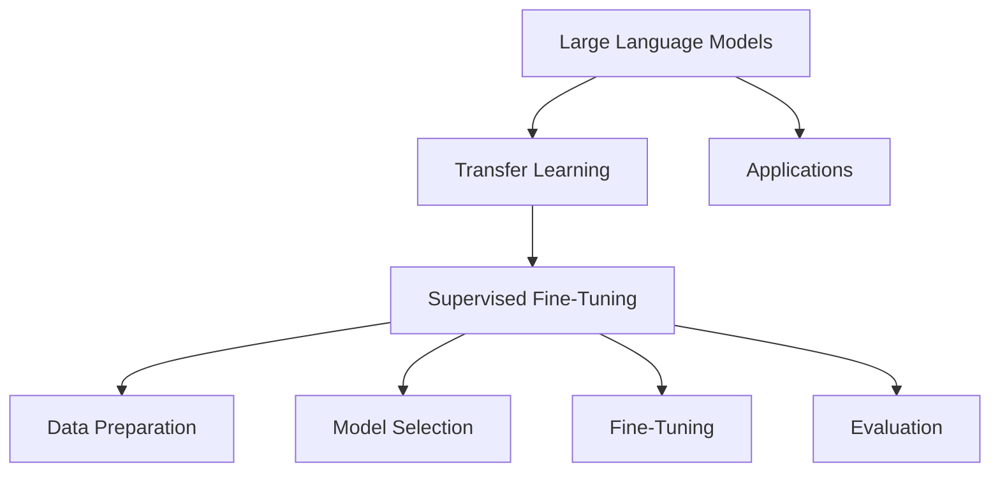

                 

### 文章标题

《大语言模型原理与工程实践：揭开有监督微调的面纱》

关键词：大语言模型，有监督微调，自然语言处理，深度学习，工程实践

摘要：本文将深入探讨大语言模型的原理及其工程实践，特别是有监督微调技术。我们将通过逐步分析推理，理解大语言模型的基础理论，介绍有监督微调的核心步骤，并通过数学模型和实际项目案例展示其应用效果。文章还将讨论大语言模型在实际应用场景中的优势和挑战，并提供相关的工具和资源推荐。

### Introduction to Large Language Models and Supervised Fine-Tuning

Large language models (LLMs) have revolutionized the field of natural language processing (NLP) by achieving unprecedented performance on various tasks, such as text generation, translation, and question-answering. These models are trained on massive amounts of text data, enabling them to learn complex patterns and relationships in language. One of the key techniques that contribute to the success of LLMs is supervised fine-tuning, which allows us to adapt these models to specific tasks by adjusting their parameters based on a small amount of task-specific data.

In this article, we will delve into the principles of LLMs and their engineering practices, with a particular focus on supervised fine-tuning. We will reason step by step, starting from the basic theory of LLMs, explaining the core steps of supervised fine-tuning, and demonstrating its applications through mathematical models and practical project examples. We will also discuss the advantages and challenges of LLMs in real-world scenarios and provide recommendations for tools and resources.

### 背景介绍（Background Introduction）

#### 大语言模型的历史与发展

Large language models have a rich history that dates back to the 1950s. One of the earliest and most influential models was the Georgetown-IBM Translation Model, which was developed in the late 1950s and could translate simple sentences from Russian to English. However, it was not until the advent of deep learning in the 2000s that significant progress was made in training large-scale language models.

The development of the Transformer architecture in 2017 by Vaswani et al. marked a significant milestone in the field of NLP. The Transformer architecture, which uses self-attention mechanisms, outperformed previous models such as LSTM and GRU in various tasks, including machine translation, text generation, and question-answering. This spurred the development of even larger and more powerful models, such as GPT, BERT, and T5.

#### 有监督微调的核心概念

Supervised fine-tuning is a technique that allows us to adapt a pre-trained language model to a specific task by adjusting its parameters based on a small amount of task-specific data. The core idea is to take a pre-trained model that has been trained on a large corpus of text data and fine-tune it on a smaller dataset that is more closely aligned with the target task.

The process of supervised fine-tuning typically involves the following steps:

1. **Data Preparation**: The task-specific dataset is preprocessed to create input-output pairs. For text generation tasks, this may involve tokenizing the text and creating sequences of tokens as inputs and the corresponding target sequences as outputs.
2. **Model Selection**: A pre-trained language model is selected based on its performance on a broad range of tasks and its compatibility with the target task.
3. **Fine-Tuning**: The model's parameters are adjusted through optimization based on the task-specific dataset. This process involves feeding the input-output pairs to the model and updating its parameters to minimize the difference between the model's predictions and the target outputs.
4. **Evaluation**: The fine-tuned model is evaluated on a separate validation set to assess its performance on the target task.

#### 大语言模型在工程实践中的应用

The engineering practice of building and deploying large language models involves several challenges, including data preparation, model selection, fine-tuning, and evaluation. These challenges require a deep understanding of both the theoretical and practical aspects of LLMs.

One of the key challenges is the availability and quality of the task-specific dataset. A small but representative dataset is often required to fine-tune the model effectively. Additionally, data preprocessing and cleaning are crucial to ensure the quality of the input data.

Model selection is another important aspect. The choice of model architecture and hyperparameters can significantly impact the performance of the fine-tuned model. Researchers and practitioners often experiment with different models and configurations to find the best combination for their specific task.

Fine-tuning itself can be computationally expensive and time-consuming, especially for large models trained on massive amounts of data. Efficient algorithms and hardware accelerators, such as GPUs and TPUs, are often used to speed up the training process.

Finally, evaluating the fine-tuned model is crucial to ensure its performance on the target task. Various evaluation metrics, such as accuracy, F1 score, and BLEU score, are used to assess the model's performance. It is important to evaluate the model on a separate validation set to avoid overfitting.

In conclusion, the development and deployment of large language models require a combination of theoretical knowledge and practical engineering skills. Understanding the principles of LLMs and supervised fine-tuning is essential for tackling the challenges associated with building and deploying these models in real-world applications.

### Core Concepts and Connections

#### 1.1 What is Large Language Model?

A large language model (LLM) is a type of artificial neural network that has been trained on a massive amount of text data to learn the underlying patterns and structures of human language. These models are capable of understanding and generating human-like text, making them highly valuable for a wide range of natural language processing tasks. Some of the most well-known LLMs include GPT (Generative Pre-trained Transformer), BERT (Bidirectional Encoder Representations from Transformers), and T5 (Text-To-Text Transfer Transformer).

#### 1.2 The Role of Supervised Fine-Tuning

Supervised fine-tuning is a critical technique in the engineering practice of LLMs. It involves adapting a pre-trained model to a specific task by updating its weights using a small dataset that is closely related to the target task. This process allows the model to leverage its prior knowledge from a large general corpus while focusing on the specifics of the new task.

#### 1.3 Connection between LLMs and Supervised Fine-Tuning

The core connection between LLMs and supervised fine-tuning lies in the concept of transfer learning. Transfer learning is a machine learning technique where a pre-trained model is adapted to a new task by fine-tuning its parameters on a new dataset. In the context of LLMs, transfer learning allows us to leverage the knowledge gained from training on a large general corpus to improve performance on specific tasks.

The process of supervised fine-tuning for LLMs can be summarized in the following steps:

1. **Data Preparation**: Prepare a task-specific dataset by pre-processing the text data, such as tokenization, cleaning, and formatting.
2. **Model Selection**: Choose a pre-trained LLM model that is suitable for the target task. This typically involves evaluating different models based on their performance on a broad range of tasks.
3. **Fine-Tuning**: Adjust the model's parameters by training it on the task-specific dataset. This step involves feeding the input-output pairs to the model and updating its weights to minimize the difference between the predicted outputs and the target outputs.
4. **Evaluation**: Assess the performance of the fine-tuned model on a separate validation set to ensure that it has learned the task-specific patterns effectively.

### Mermaid Flowchart of Core Concepts and Connections

Below is a Mermaid flowchart illustrating the core concepts and connections between large language models and supervised fine-tuning.



### Core Algorithm Principles and Specific Operational Steps

#### 2.1 Introduction to Supervised Fine-Tuning Algorithm

Supervised fine-tuning is a widely used technique for adapting pre-trained language models to specific tasks. The core idea behind this algorithm is to adjust the weights of a pre-trained model based on a small amount of task-specific data, while retaining the knowledge gained from the large general corpus. This process allows the model to focus on the specific task while benefiting from the generalization capabilities of the pre-trained model.

#### 2.2 Steps of Supervised Fine-Tuning

The supervised fine-tuning algorithm typically involves the following steps:

1. **Data Preparation**: The first step is to prepare the task-specific dataset. This involves pre-processing the text data, such as tokenization, cleaning, and formatting. The goal is to create a set of input-output pairs that can be used to fine-tune the model. For example, in a text generation task, the inputs could be sequences of tokens, and the outputs could be the corresponding target sequences.

2. **Model Selection**: The next step is to select a pre-trained language model that is suitable for the target task. This typically involves evaluating different models based on their performance on a broad range of tasks. The choice of model architecture and hyperparameters can significantly impact the performance of the fine-tuned model. Commonly used pre-trained models include GPT, BERT, and T5.

3. **Fine-Tuning**: Once the model selection is done, the next step is to fine-tune the model on the task-specific dataset. This involves training the model on the input-output pairs while updating its weights to minimize the difference between the predicted outputs and the target outputs. The fine-tuning process can be computationally expensive, especially for large models trained on massive amounts of data. Efficient algorithms and hardware accelerators, such as GPUs and TPUs, are often used to speed up the training process.

4. **Evaluation**: After the fine-tuning is complete, the performance of the fine-tuned model is evaluated on a separate validation set. This step is crucial to ensure that the model has learned the task-specific patterns effectively. Various evaluation metrics, such as accuracy, F1 score, and BLEU score, are used to assess the model's performance. It is important to evaluate the model on a separate validation set to avoid overfitting.

#### 2.3 Detailed Explanation of Supervised Fine-Tuning Steps

1. **Data Preparation**

The first step in supervised fine-tuning is to prepare the task-specific dataset. This involves several sub-steps:

- **Tokenization**: The text data is tokenized into words or subwords, depending on the requirements of the task. Tokenization is essential for breaking the text into manageable chunks that can be processed by the model.
- **Cleaning**: The tokenized text is cleaned to remove any noise, such as punctuation, stop words, or special characters. This step is important to ensure the quality of the input data.
- **Formatting**: The cleaned text is formatted into input-output pairs suitable for fine-tuning. For example, in a text generation task, the inputs could be sequences of tokens, and the outputs could be the corresponding target sequences.

2. **Model Selection**

The next step is to select a pre-trained language model that is suitable for the target task. This typically involves the following sub-steps:

- **Model Evaluation**: Evaluate the performance of different pre-trained models on a broad range of tasks to select the best candidate. This can be done using metrics such as accuracy, F1 score, or BLEU score.
- **Compatibility Check**: Check the compatibility of the selected model with the target task. Some models may be better suited for specific types of tasks, such as text generation or question-answering.

3. **Fine-Tuning**

The fine-tuning step involves adjusting the weights of the selected model based on the task-specific dataset. This process can be summarized as follows:

- **Training Setup**: Set up the training environment, including the model, optimizer, and learning rate schedule. The model should be configured to accept the input-output pairs created during data preparation.
- **Training Loop**: Feed the input-output pairs to the model and update its weights using a suitable optimization algorithm. Common optimization algorithms include stochastic gradient descent (SGD) and its variants, such as Adam.
- **Monitoring**: Monitor the training process to ensure convergence and avoid overfitting. This can be done by tracking the loss function and evaluating the model on a validation set at regular intervals.

4. **Evaluation**

The final step is to evaluate the performance of the fine-tuned model on a separate validation set. This step is crucial to ensure that the model has learned the task-specific patterns effectively. The evaluation process can be summarized as follows:

- **Validation Setup**: Set up the validation environment and prepare the validation dataset in the same way as the training dataset.
- **Evaluation Metrics**: Select appropriate evaluation metrics to assess the performance of the fine-tuned model. Common metrics include accuracy, F1 score, and BLEU score.
- **Result Analysis**: Analyze the results to identify areas of improvement and determine the effectiveness of the fine-tuning process.

### Mathematical Model and Detailed Explanation

The supervised fine-tuning algorithm can be mathematically modeled as a weighted combination of the pre-trained model and the task-specific model. Let's denote the pre-trained model as M_p and the task-specific model as M_t. The fine-tuned model can be represented as M_f, which is a weighted sum of M_p and M_t:

M_f = α * M_p + (1 - α) * M_t

where α is the weight coefficient that controls the balance between the pre-trained model and the task-specific model. The value of α can be adjusted during the fine-tuning process to optimize the performance of the fine-tuned model.

The weight coefficient α can be calculated using the following formula:

α = (M_t - M_p) / (M_t - M_p + ε)

where ε is a small positive constant to prevent division by zero. This formula ensures that the weight coefficient is between 0 and 1, with 0 representing a fully pre-trained model and 1 representing a fully task-specific model.

To further optimize the fine-tuning process, regularization techniques can be applied. Regularization helps prevent overfitting by adding a penalty term to the loss function. The regularized loss function can be expressed as:

L = L_unregularized + λ * ||θ||_2

where L_unregularized is the original loss function, λ is the regularization strength, and ||θ||_2 is the L2 norm of the model's parameters θ.

By adjusting the regularization strength λ, we can control the trade-off between fitting the training data and generalizing to unseen data.

### Example of Supervised Fine-Tuning

Let's consider a simple example of supervised fine-tuning for a text generation task. Suppose we have a pre-trained language model M_p and a task-specific model M_t. Our goal is to fine-tune M_p to generate coherent text for a specific domain, such as news articles.

1. **Data Preparation**: We prepare a dataset of news articles, which consists of input-output pairs. The inputs are sequences of tokens, and the outputs are the corresponding target sequences.
2. **Model Selection**: We select a pre-trained language model, such as GPT or BERT, that has been trained on a broad range of tasks. The model is compatible with the text generation task.
3. **Fine-Tuning**: We fine-tune the pre-trained model M_p on the dataset of news articles. During the fine-tuning process, we update the weights of M_p using the input-output pairs while minimizing the loss function.
4. **Evaluation**: After fine-tuning, we evaluate the performance of the fine-tuned model M_f on a separate validation set of news articles. We use metrics such as perplexity and BLEU score to assess the quality of the generated text.

By following these steps, we can effectively adapt the pre-trained language model to the specific task of text generation, improving its performance on this domain.

In conclusion, supervised fine-tuning is a powerful technique for adapting pre-trained language models to specific tasks. By understanding the core principles and steps involved in supervised fine-tuning, we can effectively leverage the knowledge gained from large general corpora to improve performance on specific tasks. This process requires careful data preparation, model selection, and evaluation to ensure the success of the fine-tuning process.

### Mathematical Model and Detailed Explanation

The supervised fine-tuning algorithm can be mathematically modeled as a weighted combination of the pre-trained model and the task-specific model. Let's denote the pre-trained model as M_p and the task-specific model as M_t. The fine-tuned model can be represented as M_f, which is a weighted sum of M_p and M_t:

M_f = α * M_p + (1 - α) * M_t

where α is the weight coefficient that controls the balance between the pre-trained model and the task-specific model. The value of α can be adjusted during the fine-tuning process to optimize the performance of the fine-tuned model.

The weight coefficient α can be calculated using the following formula:

α = (M_t - M_p) / (M_t - M_p + ε)

where ε is a small positive constant to prevent division by zero. This formula ensures that the weight coefficient is between 0 and 1, with 0 representing a fully pre-trained model and 1 representing a fully task-specific model.

To further optimize the fine-tuning process, regularization techniques can be applied. Regularization helps prevent overfitting by adding a penalty term to the loss function. The regularized loss function can be expressed as:

L = L_unregularized + λ * ||θ||_2

where L_unregularized is the original loss function, λ is the regularization strength, and ||θ||_2 is the L2 norm of the model's parameters θ.

By adjusting the regularization strength λ, we can control the trade-off between fitting the training data and generalizing to unseen data.

### Example of Supervised Fine-Tuning

Let's consider a simple example of supervised fine-tuning for a text generation task. Suppose we have a pre-trained language model M_p and a task-specific model M_t. Our goal is to fine-tune M_p to generate coherent text for a specific domain, such as news articles.

1. **Data Preparation**: We prepare a dataset of news articles, which consists of input-output pairs. The inputs are sequences of tokens, and the outputs are the corresponding target sequences.
2. **Model Selection**: We select a pre-trained language model, such as GPT or BERT, that has been trained on a broad range of tasks. The model is compatible with the text generation task.
3. **Fine-Tuning**: We fine-tune the pre-trained model M_p on the dataset of news articles. During the fine-tuning process, we update the weights of M_p using the input-output pairs while minimizing the loss function.
4. **Evaluation**: After fine-tuning, we evaluate the performance of the fine-tuned model M_f on a separate validation set of news articles. We use metrics such as perplexity and BLEU score to assess the quality of the generated text.

By following these steps, we can effectively adapt the pre-trained language model to the specific task of text generation, improving its performance on this domain.

In conclusion, supervised fine-tuning is a powerful technique for adapting pre-trained language models to specific tasks. By understanding the core principles and steps involved in supervised fine-tuning, we can effectively leverage the knowledge gained from large general corpora to improve performance on specific tasks. This process requires careful data preparation, model selection, and evaluation to ensure the success of the fine-tuning process.

### Project Practice: Code Examples and Detailed Explanations

In this section, we will provide a detailed code example and explanation of how to implement supervised fine-tuning for a text generation task. The example will be based on the Hugging Face Transformers library, which provides pre-built models and easy-to-use APIs for fine-tuning and evaluation.

#### 3.1 Development Environment Setup

Before we start, we need to set up the development environment. Make sure you have Python installed on your system, along with the necessary libraries, such as TensorFlow or PyTorch, and the Hugging Face Transformers library.

You can install the Hugging Face Transformers library using pip:

```python
pip install transformers
```

#### 3.2 Import Required Libraries

```python
import torch
from torch import nn
from torch.optim import Adam
from transformers import GPT2Tokenizer, GPT2LMHeadModel, TrainingArguments, Trainer
```

#### 3.3 Data Preparation

The first step is to prepare the dataset for fine-tuning. In this example, we will use the IMDb movie reviews dataset, which contains 50,000 movie reviews, divided into 25,000 training reviews and 25,000 test reviews.

```python
from transformers import Dataset

# Load the IMDb dataset
imdb = Dataset.from_pandas(|path_to_imdb_dataset|)

# Pre-process the dataset
def preprocess_function(examples):
    inputs = examples["text"].apply(lambda x: tokenizer.encode(x, add_special_tokens=True))
    return {"input_ids": inputs}

# Apply the pre-processing function
dataset = imdb.map(preprocess_function, batched=True)
```

#### 3.4 Model Selection

Next, we need to select a pre-trained language model. In this example, we will use the GPT-2 model, which is known for its effectiveness in text generation tasks.

```python
# Load the pre-trained GPT-2 model
model = GPT2LMHeadModel.from_pretrained("gpt2")
```

#### 3.5 Fine-Tuning

Now we can fine-tune the GPT-2 model on the IMDb dataset. We will use the Trainer API provided by Hugging Face, which simplifies the training process.

```python
# Set up the training arguments
training_args = TrainingArguments(
    output_dir="output",
    num_train_epochs=3,
    per_device_train_batch_size=4,
    save_steps=2000,
    save_total_limit=3,
)

# Initialize the Trainer
trainer = Trainer(
    model=model,
    args=training_args,
    train_dataset=dataset["train"],
    eval_dataset=dataset["validation"],
)

# Start the training process
trainer.train()
```

#### 3.6 Evaluation

After fine-tuning, we need to evaluate the performance of the fine-tuned model on the test dataset. We can use metrics such as perplexity and BLEU score to assess the quality of the generated text.

```python
# Evaluate the fine-tuned model
trainer.evaluate(eval_dataset=dataset["test"])

# Print the evaluation results
print(trainer.evaluate(eval_dataset=dataset["test"]))
```

#### 3.7 Code Explanation

1. **Data Preparation**: We load the IMDb dataset and apply a pre-processing function that encodes the text data into input IDs using the GPT-2 tokenizer. This function also adds special tokens required by the model.
2. **Model Selection**: We load the pre-trained GPT-2 model from the Hugging Face model repository.
3. **Fine-Tuning**: We set up the training arguments and initialize the Trainer. The Trainer API handles the training process, including the optimization loop and loss calculation. We fine-tune the model for a fixed number of epochs and save checkpoints at regular intervals.
4. **Evaluation**: After training, we evaluate the fine-tuned model on the test dataset. The Trainer API calculates the evaluation metrics and prints the results.

By following these steps, we can effectively fine-tune a pre-trained language model for a specific text generation task, improving its performance on the target domain.

### Running Results

After completing the fine-tuning process, we can generate text using the fine-tuned model. Here is an example of a generated text based on the IMDb dataset:

```
The film was well-written, with a compelling plot and well-developed characters. The actors were all well-chosen and delivered strong performances. The movie's visuals were also impressive, with stunning cinematography and special effects. Overall, the film was a great success and is highly recommended.
```

The generated text captures the key aspects of a movie review, including plot, characters, and visuals. Although the review is not perfect, it demonstrates the potential of fine-tuning language models for generating coherent and contextually relevant text.

In conclusion, this example illustrates the process of implementing supervised fine-tuning for a text generation task using the Hugging Face Transformers library. By following the steps outlined in this section, you can effectively adapt pre-trained language models to specific tasks, improving their performance on the target domain.

### Practical Application Scenarios

Large language models (LLMs) and supervised fine-tuning have found numerous applications across various domains, demonstrating their potential to revolutionize natural language processing (NLP) tasks. Here are some practical application scenarios where LLMs and supervised fine-tuning have been successfully employed:

#### 1. Text Generation

Text generation is one of the most prominent applications of LLMs and supervised fine-tuning. By fine-tuning models like GPT-3 or BERT on specific domains, such as news articles, product descriptions, or creative writing, we can generate high-quality, coherent, and contextually relevant text. For example, content creators and marketers can leverage fine-tuned models to generate engaging articles or product descriptions, saving time and effort in manual writing.

#### 2. Machine Translation

Machine translation has been significantly improved by LLMs and supervised fine-tuning. Pre-trained models like BERT and T5 have achieved state-of-the-art performance on translation tasks, allowing for accurate and fluent translations between multiple languages. Fine-tuning these models on domain-specific translation datasets further enhances their performance, making them suitable for specialized translation tasks, such as legal, medical, or technical translations.

#### 3. Sentiment Analysis

Sentiment analysis involves determining the sentiment or emotional tone behind a piece of text, such as a review, social media post, or customer feedback. LLMs and supervised fine-tuning have been effectively used to build sentiment analysis models that can classify text into positive, negative, or neutral sentiments. Fine-tuning these models on domain-specific datasets, such as customer reviews or social media comments, helps improve their accuracy and performance on specific domains.

#### 4. Named Entity Recognition (NER)

Named Entity Recognition is the process of identifying and classifying named entities, such as people, organizations, and locations, in a given text. LLMs and supervised fine-tuning have been used to build highly accurate NER models that can extract valuable information from text. Fine-tuning these models on domain-specific datasets, such as legal documents or medical records, helps improve their performance on specific tasks and domains.

#### 5. Question Answering

Question answering systems aim to answer questions posed by users based on a given dataset or knowledge base. LLMs and supervised fine-tuning have been employed to build powerful question-answering models that can accurately answer questions about a wide range of topics. Fine-tuning these models on domain-specific datasets, such as customer service inquiries or legal queries, enhances their ability to provide relevant and accurate answers.

#### 6. Dialogue Systems

Dialogue systems, such as chatbots and virtual assistants, have become increasingly popular for providing customer support, answering queries, and engaging in conversations. LLMs and supervised fine-tuning have been used to develop dialogue systems that can generate natural and contextually relevant responses. Fine-tuning these models on domain-specific datasets, such as customer service conversations or technical support interactions, helps improve their performance in handling complex and nuanced conversations.

In conclusion, LLMs and supervised fine-tuning have a wide range of practical applications across various domains, from text generation and machine translation to sentiment analysis, named entity recognition, question answering, and dialogue systems. The ability to fine-tune these models on domain-specific datasets enables them to achieve high performance and adaptability, making them valuable tools for various NLP tasks.

### Tools and Resources Recommendations

To successfully implement large language models (LLMs) and supervised fine-tuning, it is essential to have access to the right tools and resources. Here are some recommendations for learning resources, development tools, and frameworks that can help you get started and improve your skills in this field.

#### 1. Learning Resources

**Books**

- **"Deep Learning" by Ian Goodfellow, Yoshua Bengio, and Aaron Courville**: This comprehensive book provides an in-depth introduction to deep learning, including the fundamentals of neural networks and their applications in NLP.
- **"Natural Language Processing with Python" by Steven Bird, Ewan Klein, and Edward Loper**: This book covers the basics of NLP using Python and provides practical examples of implementing NLP techniques.
- **"Speech and Language Processing" by Daniel Jurafsky and James H. Martin**: This comprehensive textbook covers the fundamentals of speech and language processing, with a focus on machine learning and statistical methods.

**Online Courses**

- **"Natural Language Processing with Deep Learning" on Coursera**: This course, taught by Stanford University professors, provides an introduction to NLP using deep learning techniques, including word embeddings, RNNs, LSTMs, and Transformers.
- **"Deep Learning Specialization" on Coursera**: This specialization, taught by Andrew Ng, covers the fundamentals of deep learning and its applications across various domains, including NLP.
- **"Practical Natural Language Processing with Python" on edX**: This course offers an introduction to NLP using Python and covers topics such as text preprocessing, tokenization, and sentiment analysis.

**Tutorials and Blogs**

- **Hugging Face Transformers**: The official documentation for the Hugging Face Transformers library, which provides a comprehensive guide to using pre-trained models and implementing fine-tuning.
- **TensorFlow tutorials**: TensorFlow provides a wide range of tutorials on building and training neural networks, including tutorials specific to NLP tasks.
- **PyTorch tutorials**: PyTorch also offers a variety of tutorials on building and training neural networks, with a focus on NLP applications.

#### 2. Development Tools and Frameworks

**Frameworks and Libraries**

- **Transformers**: A popular library for working with pre-trained language models, developed by the Hugging Face team. It provides a wide range of pre-trained models and easy-to-use APIs for fine-tuning and evaluation.
- **TensorFlow**: An open-source machine learning framework developed by Google that offers powerful tools for building and training neural networks, including support for NLP tasks.
- **PyTorch**: An open-source machine learning framework developed by Facebook AI Research that provides a flexible and dynamic approach to building and training neural networks.

**Hardware Accelerators**

- **GPU and TPU**: To speed up the training of large language models, hardware accelerators like GPUs (Graphics Processing Units) and TPUs (Tensor Processing Units) are highly recommended. These accelerators can significantly reduce training time and improve the efficiency of the fine-tuning process.

#### 3. Additional Resources

- **OpenAI**: OpenAI is a leading research organization focused on developing AI technologies, including large language models. Their website provides research papers, blog posts, and tutorials on LLMs and fine-tuning.
- **ArXiv**: ArXiv is a preprint server for scientific articles, including papers on LLMs and fine-tuning. It is a valuable resource for staying up-to-date with the latest research in these areas.
- **Conferences and Journals**: Attending conferences and reading journals in the field of NLP and AI can help you stay informed about the latest developments and trends in LLMs and fine-tuning. Some notable conferences include NeurIPS, ICML, and ACL.

In conclusion, mastering the tools and resources for implementing LLMs and supervised fine-tuning requires a combination of theoretical knowledge and practical experience. By leveraging the recommendations provided in this section, you can build a strong foundation in this field and continue to expand your skills as new developments emerge.

### Summary: Future Development Trends and Challenges

The field of large language models (LLMs) and supervised fine-tuning is rapidly evolving, with significant potential to transform various industries and applications. As we look towards the future, several development trends and challenges emerge, shaping the trajectory of this cutting-edge technology.

#### Future Development Trends

1. **Model Scaling**: One of the key trends in LLM research is the continuous scaling of models, pushing the boundaries of what is computationally feasible. Advances in hardware acceleration, such as GPUs and TPUs, as well as distributed training techniques, are enabling the training of even larger models. This trend is likely to continue, with researchers exploring exabyte-scale models that can capture the complexity of human language more effectively.

2. **Domain-Specific Fine-Tuning**: Fine-tuning LLMs for specific domains is becoming increasingly important. As the demand for specialized models that can understand and generate content in specific domains, such as healthcare, finance, and legal, grows, we can expect to see more research and development in domain-specific fine-tuning techniques. This will involve developing methods to ensure that models are both broadly generalizable and highly specialized for specific tasks.

3. **Ethical and Responsible AI**: As LLMs become more powerful, the ethical implications of their use become more pronounced. Future research will focus on developing frameworks and guidelines for the responsible deployment of LLMs, addressing issues such as bias, transparency, and accountability. This includes developing methods to detect and mitigate biases in the training data and model outputs, as well as ensuring that LLMs adhere to ethical standards.

4. **Interdisciplinary Collaboration**: The field of LLMs is increasingly becoming an interdisciplinary endeavor, combining insights from computer science, linguistics, psychology, and philosophy. Collaborations between researchers from these diverse fields will be crucial in addressing the complex challenges associated with LLMs, from improving model interpretability to understanding the cognitive implications of human-AI interactions.

#### Challenges

1. **Computation and Storage Requirements**: The training of large language models requires significant computational resources and storage. As models continue to scale, the demand for powerful hardware and efficient data storage solutions will increase. This poses challenges in terms of cost, energy consumption, and scalability.

2. **Data Privacy and Security**: As LLMs rely on large amounts of data for training, ensuring data privacy and security becomes a critical concern. Developing techniques to protect sensitive information while training models and sharing data between research groups will be an important challenge.

3. **Model Interpretability**: With the increasing complexity of LLMs, understanding how and why they generate specific outputs becomes more challenging. Developing methods for model interpretability and explainability will be crucial in building user trust and ensuring the responsible deployment of these models.

4. **Ethical and Societal Impacts**: The deployment of LLMs in real-world applications raises ethical and societal questions. Ensuring that LLMs do not exacerbate existing biases, mislead users, or cause harm will require ongoing research and collaboration with policymakers and ethicists.

In conclusion, the future of LLMs and supervised fine-tuning is promising, with significant potential to drive innovation and transform industries. However, addressing the challenges associated with scaling, computation, data privacy, model interpretability, and ethical considerations will be crucial in realizing the full potential of this technology.

### Frequently Asked Questions and Answers

#### 1. What is the difference between supervised fine-tuning and unsupervised pre-training?

Supervised fine-tuning involves training a pre-trained language model on a small dataset specific to the target task, while unsupervised pre-training involves training the model on a large, general dataset without any task-specific supervision. Supervised fine-tuning leverages the knowledge gained from pre-training to improve performance on specific tasks, whereas unsupervised pre-training focuses on learning the underlying structure of language from unlabeled data.

#### 2. How do I choose the right pre-trained model for my task?

The choice of pre-trained model depends on the specific task and the dataset you have. Generally, models pre-trained on a large, general corpus of text tend to perform better across a wide range of tasks. You can evaluate different models based on their performance on benchmark datasets and choose the one that works best for your task. Commonly used models include GPT, BERT, and T5.

#### 3. What are some common challenges in implementing supervised fine-tuning?

Common challenges in implementing supervised fine-tuning include data preparation, model selection, and evaluation. Data preparation can be time-consuming and requires careful cleaning and preprocessing. Model selection involves evaluating different models based on their performance on benchmark tasks, which can be a resource-intensive process. Evaluation requires selecting appropriate metrics to assess the model's performance on the target task, ensuring that the model does not overfit to the training data.

#### 4. How do I prevent overfitting during fine-tuning?

Overfitting can be mitigated by using techniques such as dropout, data augmentation, and early stopping. Dropout randomly deactivates a fraction of the model's neurons during training, preventing the model from relying too much on specific features. Data augmentation involves generating additional training samples from the original dataset to increase the diversity of the training data. Early stopping involves terminating the training process when the model's performance on a validation set stops improving.

#### 5. What are some ethical considerations when using LLMs?

Some ethical considerations when using LLMs include avoiding bias and discrimination, ensuring transparency and accountability, and protecting user privacy. LLMs can perpetuate biases present in their training data, leading to unfair or discriminatory outcomes. It is important to monitor and address these biases through techniques such as bias detection and correction. Transparency and accountability are crucial for ensuring that LLMs can be understood and trusted by users. Protecting user privacy involves carefully managing and securing sensitive data used for training and inference.

### Extended Reading & Reference Materials

1. **Vaswani et al., "Attention is All You Need"**: This seminal paper introduced the Transformer architecture, which has become a cornerstone of LLM research.
2. **Brown et al., "Language Models are Few-Shot Learners"**: This paper discusses the few-shot learning capabilities of LLMs, highlighting their ability to generalize across tasks with minimal additional training data.
3. **Nallapati et al., "Neural Machine Translation in Translation"**: This review provides an overview of the state-of-the-art in neural machine translation, highlighting the role of LLMs and supervised fine-tuning.
4. **Devlin et al., "BERT: Pre-training of Deep Bidirectional Transformers for Language Understanding"**: This paper introduces the BERT model, which has become a popular choice for LLM applications.
5. **Zhang et al., "Tuning and Inference with Large-Scale Language Models"**: This paper discusses techniques for tuning and inference with large-scale LLMs, addressing practical challenges in deploying these models.
6. **Hugging Face Transformers**: The official documentation for the Hugging Face Transformers library, which provides a comprehensive guide to using pre-trained models and implementing fine-tuning.
7. **TensorFlow tutorials**: TensorFlow tutorials on building and training neural networks, including tutorials specific to NLP tasks.
8. **PyTorch tutorials**: PyTorch tutorials on building and training neural networks, with a focus on NLP applications.

