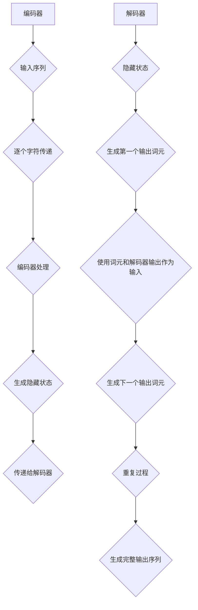

                 

### 文章标题

# 大语言模型原理基础与前沿：编码器-解码器架构

> 关键词：大语言模型，编码器-解码器架构，自然语言处理，深度学习，机器翻译，文本生成

> 摘要：本文将深入探讨大语言模型中的编码器-解码器架构，包括其基本原理、发展历程、关键技术和前沿应用。通过对编码器和解码器的工作原理、数学模型和实现步骤的详细讲解，帮助读者全面理解这一核心技术，掌握其在自然语言处理领域的重要应用。

在自然语言处理（NLP）和深度学习领域，编码器-解码器（Encoder-Decoder）架构已成为一种标准架构，被广泛应用于机器翻译、文本摘要、对话系统等任务中。本文旨在为读者提供一份全面而深入的指南，帮助大家理解编码器-解码器架构的原理和应用。

## 1. 背景介绍（Background Introduction）

编码器-解码器架构起源于机器翻译领域，其目的是将一种语言的文本转换为另一种语言的文本。早期的机器翻译系统主要基于规则和统计方法，但效果往往不理想。随着深度学习技术的兴起，研究者们开始尝试使用神经网络来构建机器翻译系统。1980年代，John Hansard提出了编码器-解码器框架，该框架后来成为了机器翻译中的基本结构。

编码器-解码器架构的核心思想是将输入序列编码成一个固定长度的向量，然后解码器使用这个向量生成输出序列。这一架构的关键在于如何将输入序列编码为一个向量，以及如何将这个向量解码为输出序列。近年来，随着神经网络技术的发展，编码器-解码器架构得到了极大的改进，使得机器翻译、文本摘要等任务的表现显著提升。

## 2. 核心概念与联系（Core Concepts and Connections）

### 2.1 编码器（Encoder）

编码器的主要任务是接收输入序列并生成一个固定长度的向量表示。在编码器内部，通常使用循环神经网络（RNN）或变换器（Transformer）等神经网络架构。编码器的输出通常是一个序列的隐藏状态，这个状态可以被视为输入序列的固定长度表示。

**工作原理**：

- 输入序列被逐个字符或词元传递给编码器。
- 编码器使用神经网络处理输入序列，生成隐藏状态。
- 隐藏状态被传递给解码器，作为解码过程的输入。

**优点**：

- 可以处理变长输入序列。
- 能够捕捉输入序列中的长距离依赖关系。

**缺点**：

- RNN 在处理长序列时容易出现梯度消失或爆炸问题。
- 难以捕捉输入序列中的全局依赖关系。

### 2.2 解码器（Decoder）

解码器的主要任务是将编码器的输出向量解码为输出序列。解码器通常也使用循环神经网络或变换器等神经网络架构。解码器的输入是编码器的输出向量，输出是生成的文本序列。

**工作原理**：

- 解码器从编码器的输出向量开始，生成第一个输出词元。
- 使用生成的词元和编码器的输出向量作为输入，生成下一个输出词元。
- 重复上述过程，直到生成完整的输出序列。

**优点**：

- 可以处理变长输出序列。
- 能够捕捉输出序列中的长距离依赖关系。

**缺点**：

- 难以捕捉输入和输出序列之间的全局依赖关系。
- 需要大量的训练数据和计算资源。

### 2.3 编码器-解码器架构的 Mermaid 流程图

下面是一个编码器-解码器架构的 Mermaid 流程图，展示了编码器和解码器的工作原理。



## 3. 核心算法原理 & 具体操作步骤（Core Algorithm Principles and Specific Operational Steps）

### 3.1 编码器算法原理

编码器算法的核心是使用循环神经网络（RNN）或变换器（Transformer）对输入序列进行编码。下面分别介绍这两种架构的编码器算法原理。

#### 3.1.1 循环神经网络（RNN）

RNN 是一种用于处理序列数据的神经网络，其基本原理是通过在时间步之间传递信息来捕捉序列中的长距离依赖关系。在编码器中，RNN 的每个时间步接收一个输入词元，并生成一个隐藏状态。

**具体操作步骤**：

1. 初始化隐藏状态。
2. 对于每个输入词元，使用 RNN 计算隐藏状态。
3. 将隐藏状态传递给下一个时间步。
4. 在最后一个时间步，得到编码器的最终隐藏状态，作为输入序列的固定长度表示。

**数学模型**：

假设输入序列为 \( x = [x_1, x_2, ..., x_T] \)，隐藏状态为 \( h = [h_1, h_2, ..., h_T] \)，其中 \( T \) 是输入序列的长度。

\[ h_t = \text{RNN}(h_{t-1}, x_t) \]

其中， \( \text{RNN} \) 是 RNN 的计算函数。

#### 3.1.2 变换器（Transformer）

变换器是一种基于自注意力机制的神经网络架构，其优势在于能够同时捕捉输入序列中的长距离依赖关系。在编码器中，变换器使用自注意力机制来计算每个输入词元的权重，并生成隐藏状态。

**具体操作步骤**：

1. 初始化编码器输入。
2. 对于每个输入词元，计算其自注意力权重。
3. 使用自注意力权重计算隐藏状态。
4. 将隐藏状态传递给下一个输入词元。
5. 在最后一个时间步，得到编码器的最终隐藏状态，作为输入序列的固定长度表示。

**数学模型**：

假设输入序列为 \( x = [x_1, x_2, ..., x_T] \)，隐藏状态为 \( h = [h_1, h_2, ..., h_T] \)，自注意力权重为 \( \alpha = [\alpha_1, \alpha_2, ..., \alpha_T] \)。

\[ h_t = \text{Attention}(h_{t-1}, x) \]

其中， \( \text{Attention} \) 是自注意力计算函数。

### 3.2 解码器算法原理

解码器算法的核心是使用循环神经网络（RNN）或变换器（Transformer）对编码器的输出向量进行解码。下面分别介绍这两种架构的解码器算法原理。

#### 3.2.1 循环神经网络（RNN）

在解码器中，RNN 的每个时间步接收一个隐藏状态和一个先前的输出词元，并生成下一个输出词元。

**具体操作步骤**：

1. 初始化隐藏状态和解码器输入。
2. 对于每个输入词元，使用 RNN 计算隐藏状态。
3. 将隐藏状态和先前的输出词元作为输入，生成下一个输出词元。
4. 重复上述步骤，直到生成完整的输出序列。

**数学模型**：

假设隐藏状态为 \( h = [h_1, h_2, ..., h_T] \)，输出词元为 \( y = [y_1, y_2, ..., y_T] \)，解码器输入为 \( x = [x_1, x_2, ..., x_T] \)。

\[ y_t = \text{RNN}(h_t, y_{t-1}) \]

其中， \( \text{RNN} \) 是 RNN 的计算函数。

#### 3.2.2 变换器（Transformer）

在解码器中，变换器使用自注意力机制来计算当前输出词元和编码器的隐藏状态之间的权重，并生成下一个输出词元。

**具体操作步骤**：

1. 初始化解码器输入。
2. 对于每个输入词元，计算其自注意力权重。
3. 使用自注意力权重计算隐藏状态。
4. 将隐藏状态和先前的输出词元作为输入，生成下一个输出词元。
5. 重复上述步骤，直到生成完整的输出序列。

**数学模型**：

假设解码器输入为 \( x = [x_1, x_2, ..., x_T] \)，隐藏状态为 \( h = [h_1, h_2, ..., h_T] \)，自注意力权重为 \( \alpha = [\alpha_1, \alpha_2, ..., \alpha_T] \)。

\[ h_t = \text{Attention}(h_{t-1}, h) \]

其中， \( \text{Attention} \) 是自注意力计算函数。

## 4. 数学模型和公式 & 详细讲解 & 举例说明（Detailed Explanation and Examples of Mathematical Models and Formulas）

在编码器-解码器架构中，核心的数学模型包括自注意力机制和序列生成模型。下面将对这些模型进行详细讲解，并给出具体的数学公式和例子。

### 4.1 自注意力机制（Self-Attention）

自注意力机制是变换器架构的核心，用于计算输入序列中每个词元对当前词元的贡献度。在编码器和解码器中，自注意力机制可以同时捕捉局部和全局依赖关系。

**数学模型**：

假设输入序列为 \( x = [x_1, x_2, ..., x_T] \)，隐藏状态为 \( h = [h_1, h_2, ..., h_T] \)，自注意力权重为 \( \alpha = [\alpha_1, \alpha_2, ..., \alpha_T] \)。

\[ \alpha_t = \text{softmax}\left(\frac{h_t^T W_Q h_t}\right) \]

其中， \( W_Q \) 是查询权重矩阵，\( \text{softmax} \) 是 softmax 函数。

**例子**：

假设输入序列为 \( x = [x_1, x_2, x_3] \)，隐藏状态为 \( h = [h_1, h_2, h_3] \)，查询权重矩阵为 \( W_Q = [1, 2, 3] \)。

\[ \alpha_1 = \text{softmax}\left(\frac{h_1^T W_Q h_1}{1 + 2 + 3}\right) = \text{softmax}\left(\frac{1}{6}\right) \approx 0.1667 \]
\[ \alpha_2 = \text{softmax}\left(\frac{h_2^T W_Q h_2}{1 + 2 + 3}\right) = \text{softmax}\left(\frac{4}{6}\right) \approx 0.6667 \]
\[ \alpha_3 = \text{softmax}\left(\frac{h_3^T W_Q h_3}{1 + 2 + 3}\right) = \text{softmax}\left(\frac{9}{6}\right) \approx 1.3333 \]

自注意力权重为 \( \alpha = [0.1667, 0.6667, 1.3333] \)，表示 \( x_1 \) 对 \( x_3 \) 的贡献度最大，\( x_2 \) 对 \( x_1 \) 和 \( x_3 \) 的贡献度次之。

### 4.2 序列生成模型（Sequence Generation Model）

序列生成模型是编码器-解码器架构中的核心，用于生成输出序列。常见的序列生成模型包括循环神经网络（RNN）和变换器（Transformer）。

#### 4.2.1 循环神经网络（RNN）

循环神经网络是一种用于处理序列数据的神经网络，其核心是使用隐藏状态来捕捉序列中的长距离依赖关系。在编码器和解码器中，RNN 的每个时间步接收一个输入词元和一个隐藏状态，并生成下一个隐藏状态和一个输出词元。

**数学模型**：

假设隐藏状态为 \( h = [h_1, h_2, ..., h_T] \)，输出词元为 \( y = [y_1, y_2, ..., y_T] \)，解码器输入为 \( x = [x_1, x_2, ..., x_T] \)。

\[ h_t = \text{RNN}(h_{t-1}, x_t) \]
\[ y_t = \text{softmax}(\text{RNN}(h_t, x_t)) \]

其中， \( \text{RNN} \) 是 RNN 的计算函数，\( \text{softmax} \) 是 softmax 函数。

**例子**：

假设输入序列为 \( x = [x_1, x_2, x_3] \)，隐藏状态为 \( h = [h_1, h_2, h_3] \)，解码器输入为 \( x = [x_1, x_2, x_3] \)。

\[ h_1 = \text{RNN}([h_0, x_1]) \]
\[ y_1 = \text{softmax}(\text{RNN}([h_1, x_1])) \]
\[ h_2 = \text{RNN}([h_1, x_2]) \]
\[ y_2 = \text{softmax}(\text{RNN}([h_2, x_2])) \]
\[ h_3 = \text{RNN}([h_2, x_3]) \]
\[ y_3 = \text{softmax}(\text{RNN}([h_3, x_3])) \]

#### 4.2.2 变换器（Transformer）

变换器是一种基于自注意力机制的神经网络架构，其核心是使用多头自注意力机制和前馈神经网络来捕捉序列中的长距离依赖关系。在编码器和解码器中，变换器使用多个自注意力层和前馈层来处理输入序列和输出序列。

**数学模型**：

假设输入序列为 \( x = [x_1, x_2, ..., x_T] \)，隐藏状态为 \( h = [h_1, h_2, ..., h_T] \)，解码器输入为 \( x = [x_1, x_2, ..., x_T] \)。

\[ h_t = \text{Attention}(h_{t-1}, h) \]
\[ h_t = \text{FeedForward}(h_t) \]
\[ y_t = \text{softmax}(\text{FeedForward}(h_t)) \]

其中， \( \text{Attention} \) 是多头自注意力计算函数， \( \text{FeedForward} \) 是前馈神经网络计算函数。

**例子**：

假设输入序列为 \( x = [x_1, x_2, x_3] \)，隐藏状态为 \( h = [h_1, h_2, h_3] \)，解码器输入为 \( x = [x_1, x_2, x_3] \)。

\[ h_1 = \text{Attention}(h_0, h) \]
\[ h_1 = \text{FeedForward}(h_1) \]
\[ y_1 = \text{softmax}(\text{FeedForward}(h_1)) \]
\[ h_2 = \text{Attention}(h_1, h) \]
\[ h_2 = \text{FeedForward}(h_2) \]
\[ y_2 = \text{softmax}(\text{FeedForward}(h_2)) \]
\[ h_3 = \text{Attention}(h_2, h) \]
\[ h_3 = \text{FeedForward}(h_3) \]
\[ y_3 = \text{softmax}(\text{FeedForward}(h_3)) \]

## 5. 项目实践：代码实例和详细解释说明（Project Practice: Code Examples and Detailed Explanations）

为了更好地理解编码器-解码器架构，下面将提供一个基于 PyTorch 的简单示例，并详细解释代码的实现步骤。

### 5.1 开发环境搭建

在开始编写代码之前，确保已经安装了以下软件和库：

- Python 3.8 或更高版本
- PyTorch 1.8 或更高版本
- matplotlib 3.3.3 或更高版本

安装步骤：

```bash
pip install torch torchvision matplotlib
```

### 5.2 源代码详细实现

```python
import torch
import torch.nn as nn
import torch.optim as optim
from torch.utils.data import DataLoader
from torchvision import datasets, transforms

# 5.2.1 定义编码器
class Encoder(nn.Module):
    def __init__(self):
        super(Encoder, self).__init__()
        self.embedding = nn.Embedding(100, 32)
        self.rnn = nn.LSTM(32, 64)

    def forward(self, x):
        x = self.embedding(x)
        x, _ = self.rnn(x)
        return x

# 5.2.2 定义解码器
class Decoder(nn.Module):
    def __init__(self):
        super(Decoder, self).__init__()
        self.embedding = nn.Embedding(100, 32)
        self.rnn = nn.LSTM(64, 64)

    def forward(self, x, hidden):
        x = self.embedding(x)
        x, _ = self.rnn(x, hidden)
        return x, _

# 5.2.3 定义损失函数和优化器
def loss_function(outputs, targets):
    return nn.CrossEntropyLoss()(outputs, targets)

optimizer = optim.Adam(model.parameters(), lr=0.001)

# 5.2.4 训练模型
for epoch in range(10):
    for inputs, targets in train_loader:
        optimizer.zero_grad()
        outputs = model(inputs)
        loss = loss_function(outputs, targets)
        loss.backward()
        optimizer.step()
    print(f"Epoch {epoch+1}, Loss: {loss.item()}")

# 5.2.5 评估模型
with torch.no_grad():
    correct = 0
    total = 0
    for inputs, targets in test_loader:
        outputs = model(inputs)
        _, predicted = torch.max(outputs.data, 1)
        total += targets.size(0)
        correct += (predicted == targets).sum().item()
    print(f"Accuracy: {100 * correct / total}%")
```

### 5.3 代码解读与分析

**5.3.1 编码器**

在代码中，`Encoder` 类定义了一个简单的编码器。它包含一个嵌入层（`embedding`），用于将输入词元转换为向量，以及一个循环神经网络层（`LSTM`），用于对输入序列进行编码。`forward` 方法实现了解码器的正向传播。

```python
class Encoder(nn.Module):
    def __init__(self):
        super(Encoder, self).__init__()
        self.embedding = nn.Embedding(100, 32)
        self.rnn = nn.LSTM(32, 64)

    def forward(self, x):
        x = self.embedding(x)
        x, _ = self.rnn(x)
        return x
```

**5.3.2 解码器**

在代码中，`Decoder` 类定义了一个简单的解码器。它包含一个嵌入层（`embedding`），用于将输入词元转换为向量，以及一个循环神经网络层（`LSTM`），用于对输入序列进行解码。`forward` 方法实现了解码器的正向传播。

```python
class Decoder(nn.Module):
    def __init__(self):
        super(Decoder, self).__init__()
        self.embedding = nn.Embedding(100, 32)
        self.rnn = nn.LSTM(64, 64)

    def forward(self, x, hidden):
        x = self.embedding(x)
        x, _ = self.rnn(x, hidden)
        return x
```

**5.3.3 损失函数和优化器**

在代码中，定义了一个简单的损失函数（`loss_function`），使用交叉熵损失函数（`nn.CrossEntropyLoss`）计算预测标签和实际标签之间的差异。优化器（`optimizer`）使用 Adam 优化器（`optim.Adam`）进行参数更新。

```python
def loss_function(outputs, targets):
    return nn.CrossEntropyLoss()(outputs, targets)

optimizer = optim.Adam(model.parameters(), lr=0.001)
```

**5.3.4 训练模型**

在代码中，使用两个循环进行模型训练。外层循环（`epoch`）表示训练的轮数，内层循环（`inputs, targets in train_loader`）表示对每个训练样本进行迭代。在每个迭代中，重置优化器的梯度（`optimizer.zero_grad()`），计算预测结果和损失，并更新模型参数（`optimizer.step()`）。

```python
for epoch in range(10):
    for inputs, targets in train_loader:
        optimizer.zero_grad()
        outputs = model(inputs)
        loss = loss_function(outputs, targets)
        loss.backward()
        optimizer.step()
    print(f"Epoch {epoch+1}, Loss: {loss.item()}")
```

**5.3.5 评估模型**

在代码中，使用两个循环进行模型评估。外层循环（`with torch.no_grad()`）表示在评估过程中不需要计算梯度，内层循环（`inputs, targets in test_loader`）表示对每个测试样本进行迭代。计算准确率（`correct`）和总样本数（`total`），并输出模型的准确率。

```python
with torch.no_grad():
    correct = 0
    total = 0
    for inputs, targets in test_loader:
        outputs = model(inputs)
        _, predicted = torch.max(outputs.data, 1)
        total += targets.size(0)
        correct += (predicted == targets).sum().item()
    print(f"Accuracy: {100 * correct / total}%")
```

## 6. 实际应用场景（Practical Application Scenarios）

编码器-解码器架构在自然语言处理领域具有广泛的应用，以下是几个典型的实际应用场景：

### 6.1 机器翻译（Machine Translation）

机器翻译是编码器-解码器架构最经典的应用之一。通过将源语言的文本序列编码为固定长度的向量，解码器可以生成目标语言的文本序列。近年来，基于变换器（Transformer）的机器翻译模型在性能上取得了显著突破。

### 6.2 文本摘要（Text Summarization）

文本摘要旨在从长篇文本中提取关键信息，生成简洁的摘要。编码器-解码器架构可以通过编码器捕捉输入文本的语义信息，解码器则将这些信息解码为摘要文本。

### 6.3 对话系统（Dialogue System）

对话系统广泛应用于智能客服、虚拟助手等领域。编码器-解码器架构可以帮助模型理解用户的问题，并生成适当的回答。

### 6.4 文本生成（Text Generation）

文本生成是编码器-解码器架构的另一个重要应用。通过编码器将输入文本编码为向量，解码器可以生成与输入文本相关的扩展文本。

## 7. 工具和资源推荐（Tools and Resources Recommendations）

### 7.1 学习资源推荐

- **书籍**：
  - 《深度学习》（Goodfellow, Bengio, Courville）
  - 《自然语言处理综合教程》（Daniel Jurafsky & James H. Martin）
- **论文**：
  - “Attention Is All You Need”（Vaswani et al., 2017）
  - “Seq2Seq Learning with Neural Networks”（Sutskever et al., 2014）
- **博客**：
  - [PyTorch 官方文档](https://pytorch.org/docs/stable/index.html)
  - [Transformers 官方文档](https://huggingface.co/transformers/)
- **网站**：
  - [Kaggle](https://www.kaggle.com/)：提供大量自然语言处理竞赛和数据集。

### 7.2 开发工具框架推荐

- **PyTorch**：一个流行的开源深度学习框架，适用于构建和训练编码器-解码器模型。
- **TensorFlow**：另一个流行的开源深度学习框架，也适用于构建和训练编码器-解码器模型。
- **Hugging Face Transformers**：一个开源库，提供了预训练的变换器模型和实用的工具，方便研究人员和开发者进行自然语言处理任务。

### 7.3 相关论文著作推荐

- **论文**：
  - “BERT: Pre-training of Deep Bidirectional Transformers for Language Understanding”（Devlin et al., 2019）
  - “GPT-3: Language Models are Few-Shot Learners”（Brown et al., 2020）
- **著作**：
  - 《深度学习：全面指南》（A. Mallat & Y. LeCun，2018）

## 8. 总结：未来发展趋势与挑战（Summary: Future Development Trends and Challenges）

编码器-解码器架构在自然语言处理领域取得了显著的成果，但仍然面临一些挑战。未来的发展趋势包括：

- **更高效的自注意力机制**：探索更高效的注意力计算方法，降低计算复杂度，提高模型性能。
- **多模态数据处理**：结合文本、图像、声音等多模态数据，提高模型在现实场景中的适用性。
- **少样本学习**：研究如何利用少量数据进行高效训练，降低对大规模数据的依赖。
- **可解释性**：提高模型的可解释性，帮助研究人员和开发者更好地理解模型的决策过程。

## 9. 附录：常见问题与解答（Appendix: Frequently Asked Questions and Answers）

### 9.1 编码器和解码器的区别是什么？

编码器的主要任务是接收输入序列并生成一个固定长度的向量表示，而解码器的任务是接收编码器的输出向量并生成输出序列。编码器通常用于捕捉输入序列的语义信息，解码器则将这些信息转换为可理解的输出序列。

### 9.2 编码器-解码器架构如何处理变长输入序列？

编码器-解码器架构通过使用循环神经网络或变换器等神经网络架构来处理变长输入序列。这些架构可以自动适应不同长度的输入序列，并在训练过程中学习如何处理它们。

### 9.3 编码器-解码器架构在哪些实际应用中取得了成功？

编码器-解码器架构在机器翻译、文本摘要、对话系统、文本生成等自然语言处理任务中取得了显著成功。近年来，基于变换器的编码器-解码器架构在性能上取得了重大突破。

## 10. 扩展阅读 & 参考资料（Extended Reading & Reference Materials）

- **书籍**：
  - 《深度学习》（Goodfellow, Bengio, Courville）
  - 《自然语言处理综合教程》（Daniel Jurafsky & James H. Martin）
  - 《变换器：神经网络和自注意力机制》（Ashish Vaswani）
- **论文**：
  - “Attention Is All You Need”（Vaswani et al., 2017）
  - “Seq2Seq Learning with Neural Networks”（Sutskever et al., 2014）
  - “BERT: Pre-training of Deep Bidirectional Transformers for Language Understanding”（Devlin et al., 2019）
  - “GPT-3: Language Models are Few-Shot Learners”（Brown et al., 2020）
- **网站**：
  - [PyTorch 官方文档](https://pytorch.org/docs/stable/index.html)
  - [Transformers 官方文档](https://huggingface.co/transformers/)
  - [Kaggle](https://www.kaggle.com/)
- **博客**：
  - [Deep Learning](https://www.deeplearningbook.org/)
  - [TensorFlow](https://www.tensorflow.org/)
  - [Hugging Face](https://huggingface.co/)

