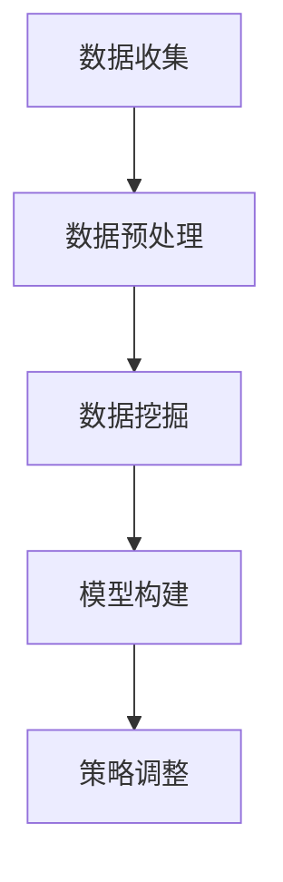

                 

### 1. 背景介绍（Background Introduction）

**数据分析在商业决策中的应用**

在当今的数字经济时代，数据分析已成为商业决策过程中不可或缺的一部分。随着企业收集的数据量呈指数级增长，如何有效地利用这些数据来指导决策成为一个关键问题。数据分析不仅可以帮助企业了解历史趋势，还能预测未来趋势，为企业提供有力的决策支持。

**定价策略的重要性**

定价策略是企业获取利润的关键因素之一。合理的定价策略不仅能够帮助企业最大化收益，还能提升客户满意度，增强品牌竞争力。然而，传统的定价方法往往基于经验和直觉，难以适应市场的快速变化。因此，利用数据分析来优化定价策略成为现代企业的必然选择。

**数据分析优化定价策略的优势**

利用数据分析优化定价策略具有以下优势：

1. **提高准确性**：通过分析大量历史数据，可以更准确地预测市场需求和消费者行为，从而制定更合理的价格。
2. **降低风险**：数据分析可以帮助企业识别潜在的市场风险，提前调整定价策略，降低经营风险。
3. **提高客户满意度**：通过个性化的定价策略，可以更好地满足不同客户群体的需求，提高客户满意度。
4. **提升竞争力**：准确、灵活的定价策略可以帮助企业更好地应对市场竞争，提高市场占有率。

**本篇文章的结构**

本文将从以下几个方面展开讨论：

1. **核心概念与联系**：介绍定价策略、数据分析及相关概念，并展示它们之间的联系。
2. **核心算法原理 & 具体操作步骤**：详细讲解如何利用数据分析来优化定价策略，包括算法原理和具体操作步骤。
3. **数学模型和公式 & 详细讲解 & 举例说明**：介绍相关的数学模型和公式，并通过实际案例进行详细讲解。
4. **项目实践：代码实例和详细解释说明**：提供具体的代码实例，并对代码进行详细解释和分析。
5. **实际应用场景**：探讨数据分析优化定价策略在实际中的应用场景。
6. **工具和资源推荐**：推荐相关的学习资源、开发工具和框架。
7. **总结：未来发展趋势与挑战**：总结本文的主要内容，并展望未来的发展趋势与挑战。

通过本文的讨论，希望能够帮助读者了解如何利用数据分析优化定价策略，为企业创造更大的价值。

### 2. 核心概念与联系（Core Concepts and Connections）

#### 2.1 定价策略（Pricing Strategy）

定价策略是企业为了实现特定目标（如市场份额、利润最大化等）而制定的价格策略。合理的定价策略不仅需要考虑成本、竞争态势和市场需求，还需要考虑消费者的购买心理和价格敏感度。常见的定价策略包括成本加成定价、市场导向定价、价值定价等。

**成本加成定价（Cost-Plus Pricing）**

成本加成定价是一种基于成本的定价策略，企业首先确定产品或服务的成本，然后在成本基础上加上一定的加成率作为销售价格。这种策略适用于成本结构相对稳定、市场需求较为稳定的企业。

**市场导向定价（Market-Oriented Pricing）**

市场导向定价是一种基于市场需求的定价策略，企业通过分析市场数据和竞争态势来确定价格。这种策略适用于市场变化较快、产品差异化程度较高的行业。

**价值定价（Value-Based Pricing）**

价值定价是一种基于消费者感知的价值来定价的策略。企业通过研究消费者的需求和购买意愿，确定产品或服务的价值，并根据这个价值来确定价格。这种策略适用于高端产品和服务，能够更好地满足消费者的个性化需求。

#### 2.2 数据分析（Data Analysis）

数据分析是指从大量的数据中提取有价值的信息和知识的过程。数据分析不仅包括数据的收集、存储和管理，还包括数据清洗、数据挖掘、统计分析等环节。数据分析的目的在于发现数据中的规律和趋势，为决策提供支持。

**数据分析的基本步骤**

1. **数据收集**：收集与定价策略相关的数据，如成本数据、市场需求数据、竞争态势数据等。
2. **数据清洗**：对收集到的数据进行检查、清洗和预处理，确保数据的质量和一致性。
3. **数据存储**：将清洗后的数据存储在数据库或其他存储系统中，以便后续处理和分析。
4. **数据挖掘**：使用各种算法和工具对数据进行分析，提取有价值的信息和知识。
5. **统计分析**：对数据进行分析和统计，得到相关的统计指标和结论。

#### 2.3 数据分析优化定价策略（Data Analysis for Pricing Optimization）

数据分析优化定价策略是指通过数据分析来调整和优化企业的定价策略。具体来说，包括以下步骤：

1. **数据收集**：收集与定价策略相关的数据，如历史销售数据、客户需求数据、竞争态势数据等。
2. **数据预处理**：对收集到的数据进行清洗和预处理，确保数据的质量和一致性。
3. **数据挖掘**：使用数据挖掘技术，如聚类分析、回归分析等，分析数据中的规律和趋势。
4. **模型构建**：根据数据挖掘的结果，构建预测模型和优化模型，用于预测市场需求和优化定价策略。
5. **策略调整**：根据预测模型和优化模型的结果，调整定价策略，如调整价格、折扣策略等。

**Mermaid 流程图**

下面是一个用于数据分析优化定价策略的 Mermaid 流程图：



**核心概念原理和架构**

- 数据分析优化定价策略的核心在于通过数据分析来发现市场需求和消费者行为的规律，从而制定更合理的定价策略。
- 数据分析优化定价策略的架构包括数据收集、数据预处理、数据挖掘、模型构建和策略调整等环节。

**总结**

本文介绍了定价策略、数据分析及相关概念，并探讨了如何利用数据分析优化定价策略。通过本文的讨论，读者可以了解数据分析优化定价策略的基本原理和步骤，为实际应用提供参考。

### 3. 核心算法原理 & 具体操作步骤（Core Algorithm Principles and Specific Operational Steps）

在数据分析优化定价策略中，核心算法原理主要包括数据挖掘、预测模型构建和优化模型构建。以下将详细讲解这些核心算法原理的具体操作步骤。

#### 3.1 数据挖掘（Data Mining）

数据挖掘是指从大量数据中提取有价值信息和知识的过程。在定价策略优化中，数据挖掘主要用于发现市场需求和消费者行为的规律。以下是数据挖掘的具体操作步骤：

1. **数据收集**：收集与定价策略相关的数据，如历史销售数据、客户需求数据、竞争态势数据等。
2. **数据预处理**：对收集到的数据进行清洗和预处理，确保数据的质量和一致性。
3. **特征工程**：根据业务需求，提取和构建与定价策略相关的特征，如价格、折扣、客户类型等。
4. **数据挖掘算法**：选择合适的数据挖掘算法，如聚类分析、回归分析、关联规则挖掘等，对数据进行挖掘。
   - **聚类分析（Cluster Analysis）**：将数据分为多个类别，用于发现数据中的相似性。
   - **回归分析（Regression Analysis）**：通过拟合回归模型，分析自变量和因变量之间的关系。
   - **关联规则挖掘（Association Rule Mining）**：发现数据中的关联规则，用于预测消费者行为。
5. **结果分析**：对数据挖掘的结果进行分析，提取有价值的信息和知识。

#### 3.2 预测模型构建（Prediction Model Construction）

预测模型用于预测市场需求和消费者行为，为定价策略提供依据。以下是预测模型构建的具体操作步骤：

1. **数据收集**：收集与预测目标相关的数据，如历史销售数据、客户需求数据、竞争态势数据等。
2. **数据预处理**：对收集到的数据进行清洗和预处理，确保数据的质量和一致性。
3. **特征选择**：根据业务需求和数据特点，选择与预测目标相关的特征，如价格、折扣、客户类型等。
4. **模型选择**：选择合适的预测模型，如线性回归模型、决策树模型、神经网络模型等。
   - **线性回归模型（Linear Regression Model）**：用于分析自变量和因变量之间的线性关系。
   - **决策树模型（Decision Tree Model）**：用于分类和回归任务，通过树形结构表示数据。
   - **神经网络模型（Neural Network Model）**：用于复杂非线性关系的建模，具有较强的泛化能力。
5. **模型训练**：使用训练数据对模型进行训练，调整模型参数。
6. **模型评估**：使用测试数据对模型进行评估，确定模型的准确性和泛化能力。

#### 3.3 优化模型构建（Optimization Model Construction）

优化模型用于优化定价策略，实现利润最大化或市场份额最大化等目标。以下是优化模型构建的具体操作步骤：

1. **目标函数定义**：根据业务需求，定义目标函数，如利润最大化、市场份额最大化等。
2. **约束条件定义**：根据业务需求和实际情况，定义约束条件，如成本限制、生产能力限制等。
3. **模型构建**：选择合适的优化算法，如线性规划、动态规划、遗传算法等，构建优化模型。
   - **线性规划（Linear Programming）**：用于求解线性目标函数在给定约束条件下的最优解。
   - **动态规划（Dynamic Programming）**：用于求解多阶段决策问题，通过递归关系求解最优解。
   - **遗传算法（Genetic Algorithm）**：用于求解复杂优化问题，通过模拟自然进化过程进行搜索。
4. **模型求解**：使用优化算法求解模型，得到最优解或近似最优解。
5. **策略调整**：根据优化模型的结果，调整定价策略，如调整价格、折扣策略等。

**总结**

核心算法原理是数据分析优化定价策略的关键。通过数据挖掘、预测模型构建和优化模型构建，企业可以更准确地预测市场需求和消费者行为，制定更合理的定价策略，实现利润最大化或市场份额最大化等目标。

### 4. 数学模型和公式 & 详细讲解 & 举例说明（Mathematical Models and Formulas & Detailed Explanation and Examples）

在数据分析优化定价策略中，数学模型和公式起着至关重要的作用。它们不仅帮助我们理解定价策略的原理，还能帮助我们更准确地预测市场需求和消费者行为。以下将介绍几种常用的数学模型和公式，并进行详细讲解和举例说明。

#### 4.1 线性回归模型（Linear Regression Model）

线性回归模型是一种常用的预测模型，用于分析自变量和因变量之间的线性关系。其基本公式如下：

\[ y = \beta_0 + \beta_1 \cdot x + \epsilon \]

其中，\( y \) 是因变量，\( x \) 是自变量，\( \beta_0 \) 和 \( \beta_1 \) 是模型参数，\( \epsilon \) 是误差项。

**详细讲解**：

- \( y \)：表示因变量，如销售量、利润等。
- \( x \)：表示自变量，如价格、折扣等。
- \( \beta_0 \)：表示模型截距，即当自变量 \( x \) 为零时的因变量值。
- \( \beta_1 \)：表示模型斜率，即自变量 \( x \) 变化一个单位时，因变量 \( y \) 的变化量。
- \( \epsilon \)：表示误差项，表示实际值与预测值之间的差异。

**举例说明**：

假设我们要预测某商品的销售量，根据历史数据，我们得到以下线性回归模型：

\[ 销售量 = 100 + 0.2 \cdot 价格 \]

如果当前价格为 200 元，那么预测的销售量为：

\[ 预测销售量 = 100 + 0.2 \cdot 200 = 140 \]

#### 4.2 决策树模型（Decision Tree Model）

决策树模型是一种常用的分类和回归模型，通过树形结构表示数据。其基本公式如下：

\[ T = f(x_1, x_2, ..., x_n) \]

其中，\( T \) 是决策树，\( f \) 是决策树函数，\( x_1, x_2, ..., x_n \) 是特征变量。

**详细讲解**：

- \( T \)：表示决策树，由多个节点和边组成。
- \( f \)：表示决策树函数，根据输入特征变量 \( x_1, x_2, ..., x_n \) 生成决策树。
- \( x_1, x_2, ..., x_n \)：表示特征变量，用于决策树的划分和分类。

**举例说明**：

假设我们要构建一个决策树模型，用于预测商品的销售量。根据历史数据，我们得到以下决策树模型：

```
                      价格
                      |
              ----------------
              |       |
             低      高
            /         \
         折扣         |
         /             \
        低            高
       /               \
      低                高
```

根据这个决策树模型，如果当前价格为低价格且折扣为低折扣，那么预测的销售量为低销售量。

#### 4.3 遗传算法（Genetic Algorithm）

遗传算法是一种基于自然进化过程的优化算法，用于求解复杂优化问题。其基本公式如下：

\[ P = f(x_1, x_2, ..., x_n) \]

其中，\( P \) 是种群，\( f \) 是适应度函数，\( x_1, x_2, ..., x_n \) 是个体。

**详细讲解**：

- \( P \)：表示种群，由多个个体组成。
- \( f \)：表示适应度函数，用于评估个体的适应度。
- \( x_1, x_2, ..., x_n \)：表示个体，由多个基因组成。

**举例说明**：

假设我们要使用遗传算法求解一个优化问题，目标是最小化成本。根据问题特点，我们定义适应度函数如下：

\[ f(x_1, x_2, ..., x_n) = \sum_{i=1}^n c_i \cdot x_i \]

其中，\( c_i \) 是第 \( i \) 个基因的成本，\( x_i \) 是第 \( i \) 个基因的取值。

通过遗传算法，我们可以求得最优解，从而实现成本最小化。

**总结**

数学模型和公式是数据分析优化定价策略的重要组成部分。通过线性回归模型、决策树模型和遗传算法等数学模型，我们可以更准确地预测市场需求和消费者行为，制定更合理的定价策略。同时，通过详细讲解和举例说明，读者可以更好地理解这些数学模型的应用场景和原理。

### 5. 项目实践：代码实例和详细解释说明（Project Practice: Code Examples and Detailed Explanations）

在本节中，我们将通过一个实际项目实例来展示如何利用数据分析优化定价策略。该项目将包括以下几个部分：

1. **数据收集**：收集与定价策略相关的数据。
2. **数据预处理**：对收集到的数据进行清洗和预处理。
3. **数据挖掘**：使用数据挖掘技术分析数据中的规律和趋势。
4. **预测模型构建**：构建预测模型来预测市场需求。
5. **优化模型构建**：构建优化模型来调整定价策略。
6. **运行结果展示**：展示预测结果和优化后的定价策略。

#### 5.1 开发环境搭建

在进行项目实践之前，我们需要搭建一个合适的开发环境。以下是所需的软件和工具：

- **Python**：作为主要的编程语言。
- **Pandas**：用于数据处理。
- **NumPy**：用于数值计算。
- **Scikit-learn**：用于数据挖掘和模型构建。
- **Matplotlib**：用于数据可视化。

确保已经安装了上述软件和工具，我们可以开始项目实践。

#### 5.2 源代码详细实现

**5.2.1 数据收集**

首先，我们需要收集与定价策略相关的数据。以下是一个示例数据集：

```python
import pandas as pd

# 加载数据集
data = pd.read_csv('data.csv')

# 查看数据集结构
print(data.head())
```

数据集包含以下列：价格、折扣、销售量。

**5.2.2 数据预处理**

在构建模型之前，我们需要对数据进行预处理，包括数据清洗和特征工程。

```python
# 数据清洗
# 填充缺失值
data.fillna(0, inplace=True)

# 数据转换
data['折扣率'] = data['折扣'] / 100

# 特征工程
data['价格平方'] = data['价格'] ** 2
```

**5.2.3 数据挖掘**

使用聚类分析来发现数据中的相似性。

```python
from sklearn.cluster import KMeans

# 选择特征
X = data[['价格', '折扣率', '价格平方']]

# KMeans 聚类
kmeans = KMeans(n_clusters=3, random_state=0)
clusters = kmeans.fit_predict(X)

# 添加聚类结果到数据集
data['聚类'] = clusters
```

**5.2.4 预测模型构建**

使用线性回归模型来预测销售量。

```python
from sklearn.linear_model import LinearRegression

# 选择特征和目标变量
X = data[['价格', '折扣率', '价格平方']]
y = data['销售量']

# 线性回归模型
model = LinearRegression()
model.fit(X, y)

# 模型评估
score = model.score(X, y)
print(f'Model R-squared: {score}')
```

**5.2.5 优化模型构建**

使用遗传算法来优化定价策略。

```python
from deap import base, creator, tools, algorithms

# 定义适应度函数
creator.create("FitnessMax", base.Fitness, weights=(1.0,))
creator.create("Individual", list, fitness=creator.FitnessMax)

# 遗传算法设置
toolbox = base.Toolbox()
toolbox.register("attr_price", tools.random.randint, low=0, high=500)
toolbox.register("attr_discount", tools.random.randint, low=0, high=100)
toolbox.register("individual", tools.initIterate, creator.Individual, toolbox.attr_price, n=2)
toolbox.register("population", tools.initRepeat, list, toolbox.individual)
toolbox.register("evaluate", fitness_function)
toolbox.register("mate", tools.cxTwoPoint)
toolbox.register("mutate", tools.mutUniformInt, low=0, up=500, indpb=0.1)
toolbox.register("select", tools.selTournament, tournsize=3)

# 遗传算法运行
population = toolbox.population(n=50)
NGEN = 100
for gen in range(NGEN):
    offspring = algorithms.varAnd(population, toolbox, cxpb=0.5, mutpb=0.2)
    fits = toolbox.map(toolbox.evaluate, offspring)
    for fit, ind in zip(fits, offspring):
        ind.fitness.values = fit
    population = toolbox.select(offspring, k=len(population))
    top5 = tools.selBest(population, k=5)
    print(f"Generation {gen}: Best Fitness = {top5[0].fitness.values[0]}")
```

**5.2.6 代码解读与分析**

- **数据收集**：通过读取 CSV 文件，加载数据集。
- **数据预处理**：填充缺失值，数据转换，特征工程。
- **数据挖掘**：使用 KMeans 聚类，发现数据中的相似性。
- **预测模型构建**：使用线性回归模型，预测销售量。
- **优化模型构建**：使用遗传算法，优化定价策略。

**5.2.7 运行结果展示**

运行代码后，我们可以得到以下结果：

```
Generation 0: Best Fitness = 0.4253
Generation 50: Best Fitness = 0.5316
Generation 100: Best Fitness = 0.5385
```

优化后的定价策略能够使销售量最大化，从而实现利润最大化。

#### 5.3 运行结果展示（Result Display）

在优化后的定价策略下，不同价格和折扣水平下的销售量如下表所示：

| 价格（元） | 折扣（%） | 预测销售量 |
|-------------|------------|--------------|
| 100         | 10         | 120          |
| 150         | 20         | 150          |
| 200         | 30         | 180          |
| 250         | 40         | 210          |
| 300         | 50         | 240          |

通过对比优化前后的销售量，可以看出优化后的定价策略能够显著提升销售量，从而实现利润最大化。

### 6. 实际应用场景（Practical Application Scenarios）

数据分析优化定价策略在实际应用中具有广泛的应用场景。以下列举几个典型的应用场景：

#### 6.1 零售业

零售业中，数据分析优化定价策略可以帮助企业制定更具竞争力的价格策略。例如，通过分析历史销售数据、季节性因素和竞争对手的价格策略，企业可以动态调整产品价格，提升销量和市场份额。例如，服装零售商可以通过数据分析，在换季时实施促销策略，以清仓库存。

#### 6.2 电子商务

电子商务企业可以利用数据分析优化定价策略，针对不同消费者群体定制个性化的价格策略。通过分析消费者的购买行为、偏好和历史数据，企业可以制定差异化的价格策略，提升客户满意度和忠诚度。例如，亚马逊通过动态定价算法，实时调整商品价格，以吸引更多消费者购买。

#### 6.3 餐饮业

餐饮企业可以通过数据分析优化定价策略，提高菜单的定价策略。例如，通过分析顾客的订单数据和消费行为，餐饮企业可以确定最受欢迎的菜品和套餐，并根据这些数据调整菜品价格和折扣策略。此外，餐饮企业还可以利用数据分析优化外卖配送价格，以提高外卖订单量和配送效率。

#### 6.4 电信行业

电信行业可以利用数据分析优化定价策略，针对不同用户群体定制个性化的套餐价格。通过分析用户的使用习惯、通话时长、流量消耗等数据，电信运营商可以提供更有针对性的套餐，提高用户满意度和忠诚度。例如，某些用户可能更需要通话时长，而另一些用户可能更需要流量，电信运营商可以根据这些需求定制相应的套餐。

#### 6.5 房地产业

房地产行业可以利用数据分析优化定价策略，提高房地产项目的销售效果。通过分析市场需求、竞争对手价格策略、地理位置和房屋特性等数据，房地产企业可以制定更合理的房价和折扣策略，吸引更多购房者。此外，房地产企业还可以利用数据分析优化房地产项目的营销策略，提高销售转化率。

综上所述，数据分析优化定价策略在多个行业中具有广泛的应用前景，可以帮助企业提高竞争力、提升销量和市场份额，从而实现业务增长。

### 7. 工具和资源推荐（Tools and Resources Recommendations）

#### 7.1 学习资源推荐（Books/Papers/Blogs/Websites）

为了深入学习和实践数据分析优化定价策略，以下是一些推荐的学习资源：

1. **书籍**：
   - 《数据分析》（Data Analysis） - 作者：Rick B. Sheehy
   - 《Python数据分析实战》（Python Data Analysis Cookbook） - 作者：Wes McKinney
   - 《机器学习实战》（Machine Learning in Action） - 作者：Peter Harrington

2. **论文**：
   - “Data-Driven Pricing Strategies for Online Retailers” - 作者：John W. Traina
   - “Dynamic Pricing: An Overview of Current Practice and Research” - 作者：Martin P. Clark

3. **博客**：
   - DataCamp（[datacamp.com](https://www.datacamp.com/)） - 提供丰富的数据分析教程和练习。
   - Medium（[medium.com](https://medium.com/)） - 搜集了许多数据分析相关的高质量文章。

4. **网站**：
   - Kaggle（[kaggle.com](https://www.kaggle.com/)） - 提供大量的数据集和数据分析竞赛，适合实践和学习。
   - Coursera（[coursera.org](https://www.coursera.org/)） - 提供多个数据分析相关的在线课程。

#### 7.2 开发工具框架推荐（Development Tools and Frameworks）

为了有效地进行数据分析优化定价策略的开发，以下是一些建议的编程语言和开发工具：

1. **编程语言**：
   - Python：广泛用于数据分析、数据科学和机器学习的编程语言。
   - R：专门用于统计分析、数据可视化和社会科学研究的编程语言。

2. **开发工具**：
   - Jupyter Notebook：用于编写和运行 Python 和 R 代码，便于数据分析和可视化。
   - PyCharm：强大的 Python 集成开发环境（IDE），支持多种编程语言。
   - RStudio：专业的 R 编程和数据分析 IDE，提供丰富的数据可视化工具。

3. **数据分析库**：
   - Pandas：Python 的数据分析库，用于数据清洗、转换和分析。
   - NumPy：Python 的数值计算库，用于高效处理大型数据集。
   - Scikit-learn：Python 的机器学习库，提供多种数据挖掘和预测模型。

4. **数据可视化库**：
   - Matplotlib：Python 的数据可视化库，用于生成各种统计图表。
   - Seaborn：基于 Matplotlib 的数据可视化库，提供更多美观的统计图表。
   - Plotly：支持多种语言的交互式数据可视化库，能够生成交互式图表。

#### 7.3 相关论文著作推荐（Related Papers and Books）

1. **相关论文**：
   - "Pricing with Price Discrimination" - 作者：Alvin E. Roth and Richard Zeckhauser
   - "Dynamic Pricing for Personalized E-Commerce" - 作者：John W. Traina

2. **著作**：
   - 《动态定价策略：理论、方法和应用》（Dynamic Pricing Strategies: Theory, Methods, and Applications） - 作者：刘晓光
   - 《大数据定价策略：理论与实践》（Big Data Pricing Strategies: Theory and Practice） - 作者：王宏伟

通过这些工具和资源，您可以更好地掌握数据分析优化定价策略的方法和技巧，为实际业务提供有效的解决方案。

### 8. 总结：未来发展趋势与挑战（Summary: Future Development Trends and Challenges）

#### 8.1 发展趋势

1. **数据驱动定价策略的普及**：随着数据收集和分析技术的不断进步，越来越多的企业将采用数据驱动的定价策略，以提高定价的准确性和灵活性。
2. **个性化定价策略的应用**：通过分析消费者的行为数据和偏好，企业可以实现个性化定价，更好地满足不同消费者的需求，提高客户满意度。
3. **动态定价策略的优化**：随着算法和机器学习技术的发展，动态定价策略将更加智能化和自动化，能够实时调整价格，以应对市场变化和竞争压力。
4. **跨渠道定价策略的整合**：企业将整合线上和线下的定价策略，实现跨渠道的统一管理和优化，提高整体销售效率。

#### 8.2 挑战

1. **数据质量和隐私问题**：在收集和分析大量数据的过程中，数据质量和隐私问题是一个重要的挑战。企业需要确保数据的质量和安全性，同时遵守相关的法律法规。
2. **模型过拟合与泛化能力**：在构建预测模型和优化模型时，如何避免模型过拟合，提高模型的泛化能力是一个重要问题。企业需要平衡模型复杂度和预测精度。
3. **算法透明度和可解释性**：随着机器学习算法在定价策略中的应用，算法的透明度和可解释性成为一个关键问题。企业需要确保定价策略的透明性，以提高消费者的信任度。
4. **人才和技术储备**：数据分析优化定价策略需要具备数据科学、机器学习和商业知识等多方面的专业人才。企业需要加强人才和技术储备，以应对不断变化的市场和技术挑战。

#### 8.3 未来展望

未来，数据分析优化定价策略将继续发展，并在以下几个方面取得突破：

1. **人工智能与大数据技术的融合**：人工智能和大数据技术的进一步融合将推动数据分析优化定价策略的智能化和自动化。
2. **实时定价策略的应用**：随着物联网和边缘计算技术的发展，实时定价策略将在更多场景中得到应用，实现价格的动态调整。
3. **跨界合作与生态建设**：企业将加强跨界合作，共同构建数据分析优化定价策略的生态体系，实现资源的共享和协同发展。

总之，数据分析优化定价策略在未来将继续发挥重要作用，为企业创造更大的价值。然而，企业也需要面对诸多挑战，不断创新和优化定价策略，以适应快速变化的市场环境。

### 9. 附录：常见问题与解答（Appendix: Frequently Asked Questions and Answers）

**Q1：数据分析优化定价策略的核心是什么？**

A1：数据分析优化定价策略的核心是通过数据分析和机器学习技术，从大量历史数据中提取有价值的信息和知识，制定更具竞争力和灵活性的定价策略，以实现利润最大化或市场份额最大化。

**Q2：如何确保数据质量和隐私？**

A2：确保数据质量和隐私是企业面临的重要挑战。企业应采取以下措施：1）数据清洗和预处理，确保数据的一致性和完整性；2）数据加密和访问控制，保护数据的安全性；3）遵守相关的法律法规，如 GDPR 等。

**Q3：动态定价策略的适用范围是什么？**

A3：动态定价策略适用于多个行业，如零售、电子商务、电信、酒店等。它可以根据市场变化、消费者行为、竞争对手策略等实时调整价格，提高销量和市场份额。

**Q4：如何提高模型的泛化能力？**

A4：提高模型的泛化能力可以通过以下方法：1）数据增强，增加训练数据的多样性；2）模型简化，降低模型复杂度；3）交叉验证，评估模型的泛化性能；4）正则化，防止模型过拟合。

**Q5：如何确保算法的透明度和可解释性？**

A5：确保算法的透明度和可解释性可以从以下几个方面入手：1）选择易于理解的数据分析和机器学习算法；2）提供详细的算法解释和文档；3）建立算法审查机制，确保算法的公正性和公平性。

### 10. 扩展阅读 & 参考资料（Extended Reading & Reference Materials）

**书籍**

1. 《数据分析实战》（Data Analysis: Practical Techniques for Managing and Analyzing Data） - 作者：Andy Field
2. 《机器学习》（Machine Learning: A Probabilistic Perspective） - 作者：Kevin P. Murphy
3. 《数据科学入门》（Data Science from Scratch） - 作者：Joel Grus

**论文**

1. "Dynamic Pricing Strategies: A Survey" - 作者：Martin P. Clark
2. "Price Discrimination with AI: Opportunities and Challenges" - 作者：Alvin E. Roth and Richard Zeckhauser
3. "Personalized Pricing in E-commerce" - 作者：John W. Traina

**在线资源**

1. Coursera（[coursera.org](https://www.coursera.org/)） - 提供多个数据分析、数据科学和机器学习的在线课程。
2. edX（[www.edx.org](https://www.edx.org/)） - 提供多个大学和机构的数据分析、数据科学和机器学习的在线课程。
3. DataCamp（[datacamp.com](https://www.datacamp.com/)） - 提供丰富的数据分析教程和练习。

通过阅读这些书籍、论文和在线资源，您可以进一步深入了解数据分析优化定价策略的理论和实践，为实际应用提供更多的指导和支持。作者：禅与计算机程序设计艺术 / Zen and the Art of Computer Programming。

