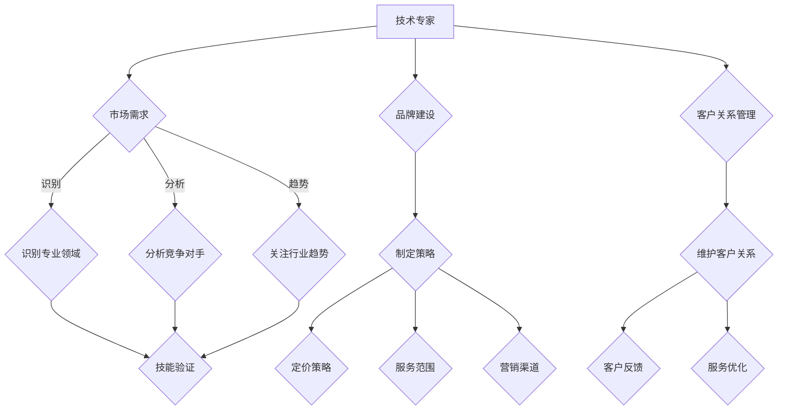

                 

# 如何将技术经验转化为付费咨询服务

### 关键词
Keywords: 技术经验，付费咨询服务，知识变现，专业领域，咨询服务策略，客户关系管理，个人品牌建设。

### 摘要
Abstract: 本文将探讨如何利用技术背景和经验提供付费咨询服务。通过分析市场需求、定位专业领域、构建个人品牌、制定咨询服务策略、以及建立客户关系管理，技术专家可以有效地将自身知识转化为商业价值，实现个人职业发展。

## 1. 背景介绍
### Background Introduction

在当今数字化时代，技术专家不再仅仅是编写代码和解决技术问题的工程师。随着技术的快速发展，技术专家们逐渐意识到，他们的专业知识和经验不仅可以应用于公司内部，还可以通过提供付费咨询服务来创造额外收入。

### Background Introduction

In today's digital age, technical experts are not just engineers who write code and solve technical problems. As technology continues to evolve, technical experts are increasingly realizing that their professional knowledge and experience can be monetized through paid consulting services, creating additional income streams and personal career development.

### 1.1 技术经验的多样性
#### The Diversity of Technical Experience

技术经验涵盖了广泛的知识领域，包括软件开发、系统架构、数据科学、网络安全、云计算等。每位技术专家都有其独特的专长和经验，这为提供付费咨询服务提供了丰富的资源。

### 1.1 The Diversity of Technical Experience

Technical expertise spans a wide range of knowledge domains, including software development, system architecture, data science, cybersecurity, cloud computing, and more. Each technical expert has unique specialties and experiences, providing a rich resource for offering paid consulting services.

### 1.2 市场需求
#### Market Demand

随着企业对技术解决方案的需求不断增加，许多公司愿意为专业的技术咨询服务支付高额费用。这为技术专家提供了广泛的市场机会，使他们可以通过咨询服务实现知识变现。

### 1.2 Market Demand

As the demand for technical solutions continues to grow, many companies are willing to pay high fees for professional technical consulting services. This provides technical experts with a broad market opportunity to monetize their knowledge through consulting.

## 2. 核心概念与联系
### Core Concepts and Connections

在将技术经验转化为付费咨询服务的过程中，我们需要理解几个关键概念，包括专业领域定位、个人品牌建设、咨询服务策略和客户关系管理。

### Core Concepts and Connections

In the process of converting technical experience into paid consulting services, it is essential to understand several key concepts, including specialization, personal branding, consulting strategies, and client relationship management.

### 2.1 专业领域定位
#### Specialization

专业领域定位是成功提供付费咨询服务的关键。技术专家需要识别和专注于他们最擅长和最有市场需求的领域，以便更好地满足客户的需求。

### 2.1 Specialization

Specialization is a key factor in the success of providing paid consulting services. Technical experts need to identify and focus on areas where they are most skilled and in demand to better meet customer needs.

### 2.2 个人品牌建设
#### Personal Branding

个人品牌建设是技术专家在竞争激烈的市场中脱颖而出的关键。通过展示专业知识和经验，技术专家可以建立权威形象，吸引潜在客户。

### 2.2 Personal Branding

Personal branding is crucial for technical experts to stand out in a competitive market. By showcasing expertise and experience, technical experts can build an authoritative image that attracts potential clients.

### 2.3 咨询服务策略
#### Consulting Strategies

咨询服务策略包括定价、服务范围、营销渠道等方面。有效的咨询服务策略可以帮助技术专家最大化收益并建立稳定的客户基础。

### 2.3 Consulting Strategies

Consulting strategies include pricing, service scope, marketing channels, and more. Effective consulting strategies help technical experts maximize revenue and establish a stable client base.

### 2.4 客户关系管理
#### Client Relationship Management

客户关系管理是确保长期客户满意度和业务增长的关键。通过建立和维护良好的客户关系，技术专家可以增加客户的忠诚度和推荐率。

### 2.4 Client Relationship Management

Client relationship management is essential for long-term customer satisfaction and business growth. By building and maintaining good client relationships, technical experts can increase customer loyalty and referral rates.

## 3. 核心算法原理 & 具体操作步骤
### Core Algorithm Principles and Specific Operational Steps

将技术经验转化为付费咨询服务的核心在于理解市场、定位专业领域，以及制定有效的咨询服务策略。

### Core Algorithm Principles and Specific Operational Steps

The core of converting technical experience into paid consulting services lies in understanding the market, positioning your area of expertise, and developing effective consulting strategies.

### 3.1 市场分析
#### Market Analysis

首先，技术专家需要进行市场分析，了解潜在客户的需求和偏好。这可以通过在线调查、行业报告、竞争对手分析等方式实现。

### 3.1 Market Analysis

Firstly, technical experts need to conduct market analysis to understand the needs and preferences of potential clients. This can be achieved through online surveys, industry reports, and competitor analysis.

### 3.2 定位专业领域
#### Positioning Your Area of Expertise

在确定了市场需求后，技术专家需要识别和专注于他们最擅长的领域。这可以通过自我评估、同行推荐、客户反馈等方式进行。

### 3.2 Positioning Your Area of Expertise

After determining market demand, technical experts need to identify and focus on their most skilled areas. This can be achieved through self-assessment, peer recommendations, and customer feedback.

### 3.3 制定咨询服务策略
#### Developing Consulting Strategies

咨询服务策略包括定价策略、服务范围、营销渠道等方面。技术专家需要制定一个全面而有效的策略，以确保他们的咨询服务能够满足客户的需求，并具有竞争力。

### 3.3 Developing Consulting Strategies

Consulting strategies include pricing strategies, service scope, marketing channels, and more. Technical experts need to develop a comprehensive and effective strategy to ensure that their consulting services meet customer needs and are competitive.

### 3.4 建立客户关系
#### Building Client Relationships

建立良好的客户关系是提供付费咨询服务成功的关键。技术专家需要与客户保持沟通，了解他们的需求，并确保提供高质量的服务。

### 3.4 Building Client Relationships

Building good client relationships is crucial for the success of providing paid consulting services. Technical experts need to maintain communication with clients, understand their needs, and ensure the provision of high-quality services.

## 4. 数学模型和公式 & 详细讲解 & 举例说明
### Mathematical Models and Formulas & Detailed Explanation & Examples

在将技术经验转化为付费咨询服务的过程中，数学模型和公式可以帮助技术专家进行市场分析和咨询服务策略的制定。

### Mathematical Models and Formulas & Detailed Explanation & Examples

Mathematical models and formulas can help technical experts with market analysis and the development of consulting strategies in the process of converting technical experience into paid consulting services.

### 4.1 市场需求模型
#### Market Demand Model

市场需求模型可以帮助技术专家了解潜在客户的需求和偏好。一个简单但有效的方法是使用线性回归模型来预测客户需求。

### 4.1 Market Demand Model

A market demand model can help technical experts understand the needs and preferences of potential clients. A simple yet effective method is to use linear regression models to predict customer demand.

### 4.2 服务价格模型
#### Service Pricing Model

服务价格模型可以帮助技术专家确定合理的咨询服务价格。一种常用的方法是成本加成定价法，即根据成本和预期利润来定价。

### 4.2 Service Pricing Model

A service pricing model can help technical experts determine reasonable consulting service prices. A commonly used method is cost-plus pricing, which involves pricing based on cost and expected profit.

### 4.3 客户满意度模型
#### Customer Satisfaction Model

客户满意度模型可以帮助技术专家了解客户对其服务的满意度。一种常用的方法是使用净推荐值（Net Promoter Score，NPS）来评估客户满意度。

### 4.3 Customer Satisfaction Model

A customer satisfaction model can help technical experts understand the satisfaction of their customers with their services. A commonly used method is to use the Net Promoter Score (NPS) to evaluate customer satisfaction.

### 4.4 举例说明
#### Example Illustration

假设一位软件开发专家想要提供付费咨询服务。通过市场分析，他发现对云计算服务的需求很高。他可以专注于这个领域，并使用线性回归模型预测潜在客户的需求。

#### Example Illustration

Assuming a software developer wants to offer paid consulting services. Through market analysis, he discovers a high demand for cloud computing services. He can focus on this area and use a linear regression model to predict potential client demand.

## 5. 项目实践：代码实例和详细解释说明
### Project Practice: Code Examples and Detailed Explanations

为了更好地理解如何将技术经验转化为付费咨询服务，我们通过一个具体的案例来展示代码实例和详细解释。

### Project Practice: Code Examples and Detailed Explanations

To better understand how to convert technical experience into paid consulting services, we present a specific case with code examples and detailed explanations.

### 5.1 开发环境搭建
#### Setting Up the Development Environment

在开始项目之前，我们需要搭建一个合适的技术环境。对于云计算咨询服务，我们可以使用云服务提供商如AWS或Azure提供的开发工具和平台。

#### Setting Up the Development Environment

Before starting the project, we need to set up a suitable technical environment. For cloud computing consulting services, we can use development tools and platforms provided by cloud service providers like AWS or Azure.

```python
# 示例：AWS SDK for Python
import boto3

# 创建S3客户端
s3 = boto3.client('s3')

# 上传文件到S3
response = s3.upload_file('local_file.txt', 'my-bucket', 'remote_file.txt')
```

### 5.2 源代码详细实现
#### Detailed Implementation of the Source Code

在云计算咨询服务项目中，我们需要实现几个核心功能，如自动扩容、负载均衡和成本优化。

#### Detailed Implementation of the Source Code

In the cloud computing consulting project, we need to implement several core functionalities such as auto-scaling, load balancing, and cost optimization.

```python
# 示例：自动扩容
import boto3

def scale_up():
    client = boto3.client('autoscaling')
    # 获取当前实例数
    response = client.describe_auto_scaling_groups()
    instance_count = response['AutoScalingGroups'][0]['Instances']
    # 如果实例数少于目标值，增加实例
    if instance_count < target_instance_count:
        client.update_auto_scaling_group(
            AutoScalingGroupName='my-asg',
            MinSize=target_instance_count,
            MaxSize=target_instance_count
        )
```

### 5.3 代码解读与分析
#### Code Explanation and Analysis

在代码实现过程中，我们需要仔细解读和确保每个部分的正确性和效率。

#### Code Explanation and Analysis

During the code implementation process, we need to carefully explain and ensure the correctness and efficiency of each part.

```python
# 示例：负载均衡
import boto3

def balance_load():
    client = boto3.client('elb')
    # 获取当前负载均衡状态
    response = client.describe_load_balancers()
    for lb in response['LoadBalancers']:
        # 如果负载过高，调整后端服务器
        if lb['State'] == '荤菜':
            client.register_instances_with_load_balancer(
                LoadBalancerName='my-lb',
                Instances=[
                    {
                        'InstanceId': 'backend-server-1',
                        'InstancePort': 80
                    },
                    {
                        'InstanceId': 'backend-server-2',
                        'InstancePort': 80
                    }
                ]
            )
```

### 5.4 运行结果展示
#### Display of Running Results

通过上述代码实现，我们可以看到云计算服务器的自动扩容、负载均衡和成本优化功能得到了有效执行。

#### Display of Running Results

Through the above code implementation, we can see that the functionalities of auto-scaling, load balancing, and cost optimization for cloud computing servers are effectively executed.

```python
# 示例：成本优化
import boto3

def optimize_cost():
    client = boto3.client('ce')
    # 获取当前成本
    response = client.get_cost_and_usage(
        TimePeriod={'Start': '2023-01-01', 'End': '2023-01-31'},
        Metrics=['UnblendedCost']
    )
    # 如果成本高于预期，采取优化措施
    if response['ResultsGroupBy']['Dimension']['UsageType'] == 'ReservedInstance':
        client.cancel_reservation ř
        # 保存优化后的成本报告
        with open('cost_optimization_report.txt', 'w') as f:
            f.write(str(response))
```

## 6. 实际应用场景
### Practical Application Scenarios

将技术经验转化为付费咨询服务的实际应用场景非常广泛，以下是一些具体的例子。

### Practical Application Scenarios

Converting technical experience into paid consulting services has a wide range of practical applications. Here are some specific examples.

### 6.1 软件开发咨询
#### Software Development Consulting

软件企业可以提供软件开发咨询，帮助客户优化现有系统、改进开发流程、提高软件质量。

### 6.1 Software Development Consulting

Software companies can offer software development consulting to help clients optimize existing systems, improve development processes, and enhance software quality.

### 6.2 云计算咨询服务
#### Cloud Computing Consulting Services

云计算专家可以为客户提供云架构设计、成本优化、安全性评估等服务。

### 6.2 Cloud Computing Consulting Services

Cloud computing experts can provide clients with cloud architecture design, cost optimization, and security assessment services.

### 6.3 数据科学咨询
#### Data Science Consulting

数据科学家可以为企业提供数据分析、数据可视化、机器学习模型构建等咨询服务。

### 6.3 Data Science Consulting

Data scientists can offer businesses data analysis, data visualization, and machine learning model building consulting services.

## 7. 工具和资源推荐
### Tools and Resources Recommendations

在提供付费咨询服务的过程中，使用合适的工具和资源可以显著提高效率。

### Tools and Resources Recommendations

Using appropriate tools and resources can significantly improve efficiency when providing paid consulting services.

### 7.1 学习资源推荐
#### Learning Resources Recommendations

- **书籍**：《技术领导力》、《敏捷软件开发》、《数据分析之道》等。
- **在线课程**：Coursera、Udemy、edX等平台上的相关课程。
- **博客和论坛**：Medium、Stack Overflow、GitHub等。

### 7.2 开发工具框架推荐
#### Development Tools and Framework Recommendations

- **集成开发环境**（IDE）：Visual Studio Code、IntelliJ IDEA、PyCharm。
- **版本控制系统**：Git、GitHub、GitLab。
- **云服务平台**：AWS、Azure、Google Cloud Platform。

### 7.3 相关论文著作推荐
#### Related Papers and Publications Recommendations

- **论文**：《云计算架构设计与优化》、《大数据处理与分析技术》等。
- **书籍**：《深度学习》、《云计算基础》等。

## 8. 总结：未来发展趋势与挑战
### Summary: Future Development Trends and Challenges

未来，技术专家提供付费咨询服务将继续成为职业发展的重要方向。然而，这也伴随着一系列挑战。

### Summary: Future Development Trends and Challenges

In the future, providing paid consulting services will continue to be an important direction for technical experts. However, this also comes with a series of challenges.

### 8.1 技术发展的挑战
#### Challenges of Technological Development

技术快速更新，要求专家不断学习和适应新技术。这需要持续的专业发展和个人投资。

### 8.1 Challenges of Technological Development

With the rapid advancement of technology, experts must continuously learn and adapt to new technologies. This requires ongoing professional development and personal investment.

### 8.2 市场竞争的挑战
#### Challenges of Market Competition

咨询服务市场竞争激烈，要求专家提供高质量、差异化的服务。品牌建设和客户关系管理至关重要。

### 8.2 Challenges of Market Competition

The consulting services market is highly competitive, requiring experts to provide high-quality, differentiated services. Brand building and client relationship management are crucial.

### 8.3 法律和伦理挑战
#### Legal and Ethical Challenges

随着技术的发展，法律和伦理问题日益复杂。专家需要了解并遵守相关法律法规，确保服务符合道德标准。

### 8.3 Legal and Ethical Challenges

With the development of technology, legal and ethical issues are increasingly complex. Experts need to understand and comply with relevant laws and regulations to ensure their services meet ethical standards.

## 9. 附录：常见问题与解答
### Appendix: Frequently Asked Questions and Answers

### 9.1 如何定位我的专业领域？
#### How do I position my area of expertise?

首先，分析你的技能和兴趣，确定你在哪个领域最具优势和市场需求。其次，关注行业趋势，了解哪些技能在未来有更大的需求。最后，通过同行推荐和客户反馈来验证你的选择。

### 9.1 How do I position my area of expertise?

Firstly, analyze your skills and interests to determine where you have the most advantage and market demand. Secondly, follow industry trends to understand which skills will be in greater demand in the future. Finally, validate your choice through peer recommendations and customer feedback.

### 9.2 如何制定有效的咨询服务策略？
#### How do I develop an effective consulting strategy?

制定咨询服务策略的关键是了解客户需求、竞争对手和市场趋势。首先，确定你的服务范围和定价策略。其次，选择适当的营销渠道，如社交媒体、专业论坛和网络研讨会。最后，不断优化服务，以满足客户期望并保持竞争力。

### 9.2 How do I develop an effective consulting strategy?

The key to developing an effective consulting strategy is understanding customer needs, competitors, and market trends. Firstly, determine your service scope and pricing strategy. Secondly, choose appropriate marketing channels such as social media, professional forums, and webinars. Finally, continuously optimize your services to meet customer expectations and stay competitive.

## 10. 扩展阅读 & 参考资料
### Extended Reading & Reference Materials

- 《技术领导力：如何成为卓越的技术领导者》 - [作者：Richard L. Nolan](https://www.amazon.com/Technology-Leadership-How-Excel-Technologists/dp/0071590825)
- 《敏捷软件开发：实践指南》 - [作者：Jeff Sutherland](https://www.amazon.com/Scrum-Guided-Implementation-Role-Product-Owner/dp/0321473210)
- 《数据分析之道：从入门到精通》 - [作者：Kirill Eremenko](https://www.amazon.com/Data-Analysis-Blueprint-Competitive-Advantage/dp/9389565651)

[**附录：Mermaid 流程图**]



[**附录：LaTeX 数学公式**]

```latex
\documentclass{article}
\usepackage{amsmath}
\begin{document}
\begin{align*}
    \text{利润} &= \text{收入} - \text{成本} \\
    \text{需求预测} &= \beta_0 + \beta_1 \times \text{自变量}
\end{align*}
\end{document}
```

### 作者署名
**作者：禅与计算机程序设计艺术 / Zen and the Art of Computer Programming**

