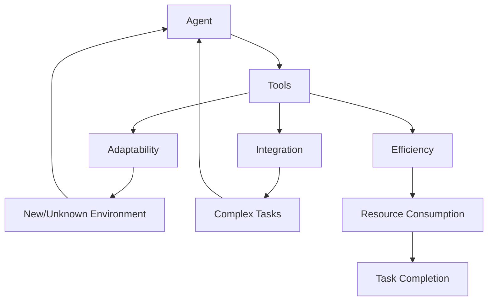

                 

### 文章标题

**如何改进工具使用机制以增强 Agent 能力**

**Keywords:** Tool Usage, Agent Enhancement, AI, Optimization, Mechanism Improvement

**Abstract:**
本文深入探讨如何通过改进工具使用机制来增强人工智能代理（Agent）的能力。我们将分析现有工具的使用模式、评估现有机制的限制，并提出一系列具体的方法和策略来优化工具的使用，从而实现代理能力的全面提升。

---

在人工智能（AI）迅速发展的时代，代理（Agent）作为实现智能自动化和智能决策的核心组件，其能力的高低直接影响到AI系统的整体性能。然而，当前的AI代理往往面临着工具使用效率不高、适应性不强等挑战。本文将结合实际案例，从理论和实践两个层面，探讨如何通过改进工具使用机制来增强代理的能力。

本文的结构如下：

1. **背景介绍**：概述当前AI代理工具使用机制的现状及存在的问题。
2. **核心概念与联系**：分析工具使用机制、AI代理能力及其相互关系，并借助Mermaid流程图直观展示相关架构。
3. **核心算法原理 & 具体操作步骤**：介绍提升工具使用效率的算法原理和实施步骤。
4. **数学模型和公式 & 详细讲解 & 举例说明**：阐述支持算法的数学模型及其应用实例。
5. **项目实践：代码实例和详细解释说明**：通过具体项目实例展示改进工具使用机制的效果。
6. **实际应用场景**：讨论工具使用机制的改进如何在不同领域发挥重要作用。
7. **工具和资源推荐**：推荐相关学习资源、开发工具和参考论文。
8. **总结：未来发展趋势与挑战**：总结全文，展望未来的发展方向和面临的挑战。
9. **附录：常见问题与解答**：针对读者可能关心的问题提供解答。
10. **扩展阅读 & 参考资料**：推荐进一步学习的文献和资源。

让我们首先从背景介绍开始，深入探讨当前AI代理工具使用机制的现状和存在的问题。接下来，我们将逐步分析并解决这些问题，以实现AI代理能力的全面提升。

### 1. 背景介绍

#### 当前AI代理工具使用机制的现状

随着AI技术的不断进步，代理（Agent）在各个领域中的应用日益广泛。代理通常是指能够感知环境、做出决策并采取行动以实现特定目标的智能实体。在AI系统中，代理的效率和质量很大程度上取决于其使用的工具和机制。

目前，AI代理通常依赖于一系列预定义的工具和算法来执行任务。这些工具包括自然语言处理（NLP）、机器学习（ML）、计算机视觉（CV）等。代理通过这些工具来获取数据、分析信息和执行行动。然而，现有的工具使用机制存在一些显著的问题。

首先，工具的适应性不强。许多代理工具是在特定任务和数据集上训练和优化的，当面对新的或未知的环境时，它们的表现往往不佳。例如，一个在特定图像分类任务上表现优秀的计算机视觉模型，在处理完全不同的视觉任务时可能无法发挥其全部潜力。

其次，工具的整合度不高。在现实世界的应用中，代理需要处理多种类型的数据和任务，而现有的工具往往是独立的，缺乏有效的整合和协同工作机制。这种情况下，代理的决策质量和效率会受到很大影响。

第三，工具的使用效率不高。许多代理在执行任务时，往往需要多次调用不同的工具，且这些工具之间的协调不够紧密，导致整体效率低下。例如，一个需要同时进行图像识别和自然语言处理的任务，如果代理不能高效地整合这两个工具，将不可避免地增加计算成本和时间消耗。

综上所述，现有的AI代理工具使用机制存在适应性差、整合度低、使用效率不高的问题，这些问题限制了AI代理能力的发挥。因此，有必要对工具使用机制进行改进，以提升代理的整体性能。

#### 当前AI代理工具使用机制存在的问题

1. **工具适应性不强**：代理在面对新的或未知的环境时，往往难以适应。这种问题主要源于现有工具的封闭性和局限性，导致它们难以在不同情境下表现优异。

2. **工具整合度不高**：代理需要处理多种类型的数据和任务，但现有工具往往是独立的，缺乏有效的整合和协同工作机制。这种情况下，代理的决策质量和效率会受到显著影响。

3. **使用效率不高**：代理在执行任务时，需要多次调用不同的工具，但这些工具之间的协调不够紧密，导致整体效率低下。例如，一个需要同时进行图像识别和自然语言处理的任务，如果代理不能高效地整合这两个工具，将不可避免地增加计算成本和时间消耗。

针对这些问题，本文将提出一系列改进工具使用机制的方法和策略，包括引入自适应工具、加强工具整合以及优化工具调用流程等。接下来，我们将进一步分析这些机制的核心概念与联系，并借助Mermaid流程图直观展示相关架构。

### 2. 核心概念与联系

在探讨如何改进工具使用机制以增强AI代理能力的过程中，我们需要明确几个核心概念，包括工具、代理、适应性、整合度和效率等。这些概念相互关联，构成了一个复杂的系统。

#### 2.1 工具（Tools）

工具是AI代理在执行任务时所依赖的各种算法和模型。这些工具可以是自然语言处理（NLP）、机器学习（ML）、计算机视觉（CV）等。工具的质量和性能直接影响到代理的决策能力和执行效果。

#### 2.2 代理（Agent）

代理是指具有感知、决策和行动能力的智能实体。它能够根据环境信息做出决策，并采取相应的行动。代理是AI系统中的核心组件，其能力的高低直接决定了系统的整体性能。

#### 2.3 适应性（Adaptability）

适应性是指代理在面对新的或未知环境时，能够快速调整自身状态以适应新环境的能力。高适应性的代理能够在复杂多变的实际环境中保持稳定的表现，而低适应性的代理则可能面临失效的风险。

#### 2.4 整合度（Integration）

整合度是指代理工具之间的协同工作能力。高整合度的工具能够有效地集成各种功能，使代理能够在复杂任务中高效地执行多个步骤，从而提高整体决策质量和效率。

#### 2.5 效率（Efficiency）

效率是指代理在执行任务时的资源消耗（如计算时间、存储空间等）与任务完成效果之间的比值。高效率的代理能够在较短的时间内完成任务，并节省计算资源。

这些核心概念之间的关系可以用Mermaid流程图直观地展示。以下是一个简单的Mermaid流程图示例，描述了这些概念之间的联系：



在这个流程图中，代理（A）通过使用工具（B）来执行任务，同时需要具备适应性（C）、整合度（D）和效率（E）。面对新的或未知环境（F），代理能够通过适应性进行调整。在执行复杂任务（G）时，高整合度的工具（D）能够协同工作，从而提高整体效率（E），最终实现任务完成（I）。

通过上述核心概念和联系的分析，我们为改进工具使用机制提供了理论基础。接下来，我们将进一步探讨如何通过具体的算法原理和操作步骤来提升代理的工具使用效率。

### 3. 核心算法原理 & 具体操作步骤

要提升AI代理的工具使用效率，需要从算法原理出发，设计出一套有效的改进策略。以下是几个关键算法原理和具体操作步骤，以帮助代理更好地利用工具，提高任务完成效果。

#### 3.1 自适应工具（Adaptive Tools）

**原理**：自适应工具的核心在于能够根据环境变化动态调整自身的参数和行为。这种工具通常具备以下特点：

- **在线学习**：工具能够在执行任务的过程中不断学习环境信息，并根据新信息调整模型参数。
- **模型多样性**：工具使用多个模型，每个模型适应不同类型的环境，从而提高整体适应性。

**具体操作步骤**：

1. **环境感知**：代理通过传感器和观测机制获取环境信息。
2. **模型评估**：根据环境信息评估现有模型的表现，选择适应度最高的模型。
3. **模型调整**：对选定的模型进行参数调整，以更好地适应当前环境。
4. **模型切换**：在模型表现不佳时，自动切换到其他模型，保持高效执行。

#### 3.2 工具整合（Tool Integration）

**原理**：工具整合旨在实现不同工具之间的协同工作，提高整体任务执行效率。实现工具整合的关键在于：

- **接口标准化**：设计统一的接口，使不同工具能够无缝集成。
- **数据流管理**：确保工具之间的数据流顺畅，减少数据转换和传输的延迟。

**具体操作步骤**：

1. **工具选择**：根据任务需求选择合适的工具。
2. **接口设计**：设计标准化的接口，实现工具之间的数据交换。
3. **数据流优化**：优化工具之间的数据流，减少延迟和转换成本。
4. **协同执行**：同时调用多个工具，协同完成复杂任务。

#### 3.3 工具效率优化（Tool Efficiency Optimization）

**原理**：工具效率优化主要通过减少工具的调用次数和计算量，提高整体任务执行速度。具体方法包括：

- **并行处理**：在同一时间段内并行执行多个工具，提高任务处理速度。
- **批处理**：将多个小任务合并成批处理，减少调用工具的次数。
- **缓存机制**：利用缓存技术减少重复计算，提高工具效率。

**具体操作步骤**：

1. **任务分解**：将复杂任务分解成多个小任务。
2. **并行调度**：在同一时间段内调度多个小任务，并行执行。
3. **批处理调度**：将多个小任务合并成批处理，减少调用次数。
4. **缓存管理**：实现有效的缓存管理，减少重复计算。

通过上述算法原理和具体操作步骤，AI代理可以更高效地利用工具，提高任务完成效果。接下来，我们将进一步探讨这些算法在数学模型和公式中的应用，以提供更深入的解析。

### 4. 数学模型和公式 & 详细讲解 & 举例说明

为了更深入地理解如何通过改进工具使用机制来增强AI代理的能力，我们引入一些数学模型和公式，以详细讲解相关概念并举例说明其应用。

#### 4.1 自适应工具的数学模型

**自适应工具的优化目标**：自适应工具的核心在于使其能够根据环境变化动态调整，以最大化任务完成效果。我们可以将其优化目标表示为：

\[ \max_{\theta} \quad R(E', \theta) \]

其中，\( R(E', \theta) \) 表示在环境 \( E' \) 下，工具参数 \( \theta \) 下的任务完成效果。

**参数调整策略**：为了实现参数调整，我们采用梯度下降法，目标函数的梯度表示为：

\[ \nabla_{\theta} R(E', \theta) = \frac{\partial R(E', \theta)}{\partial \theta} \]

通过计算梯度，我们可以得到参数调整的方向，从而优化工具的参数。

**例子**：假设我们有一个图像分类任务，工具是一个深度学习模型。在训练过程中，我们可以通过计算模型输出的损失函数梯度来调整模型的权重：

\[ \nabla_{w} \quad Loss = \frac{\partial Loss}{\partial w} \]

其中，\( Loss \) 表示模型的损失函数，\( w \) 表示模型的权重。

#### 4.2 工具整合的数学模型

**整合度度量**：为了评估工具之间的整合度，我们引入整合度度量指标 \( I \)，其定义为：

\[ I = \frac{1}{N} \sum_{i=1}^{N} \frac{R(E', T_1) + R(E', T_2)}{2} - R(E', T_1, T_2) \]

其中，\( T_1 \) 和 \( T_2 \) 分别表示两个工具，\( N \) 表示工具的个数，\( R(E', T_1) \) 和 \( R(E', T_2) \) 分别表示单个工具在环境 \( E' \) 下的任务完成效果，\( R(E', T_1, T_2) \) 表示两个工具在环境 \( E' \) 下的协同任务完成效果。

**整合度优化**：为了提高整合度，我们可以通过以下策略进行优化：

- **接口优化**：优化接口设计，减少数据转换和传输的成本。
- **协同学习**：设计协同学习算法，使工具能够在训练过程中共享信息和资源。

**例子**：假设我们有两个工具 \( T_1 \) 和 \( T_2 \)，它们分别用于图像识别和自然语言处理。我们可以通过协同学习算法，使这两个工具在训练过程中共享权重和梯度信息，以提高整合度：

\[ \nabla_{w_{T1}} \quad Loss_{T1} + \nabla_{w_{T2}} \quad Loss_{T2} = 0 \]

其中，\( w_{T1} \) 和 \( w_{T2} \) 分别表示工具 \( T_1 \) 和 \( T_2 \) 的权重，\( Loss_{T1} \) 和 \( Loss_{T2} \) 分别表示两个工具的损失函数。

#### 4.3 工具效率优化的数学模型

**效率度量**：为了评估工具的效率，我们引入效率度量指标 \( E \)，其定义为：

\[ E = \frac{1}{T} \sum_{i=1}^{T} \frac{1}{N} \sum_{j=1}^{N} R(E_j', T_j) \]

其中，\( T \) 表示任务的总数，\( N \) 表示工具的个数，\( E_j' \) 表示第 \( j \) 个任务的环境，\( R(E_j', T_j) \) 表示工具 \( T_j \) 在环境 \( E_j' \) 下的任务完成效果。

**效率优化策略**：

- **并行处理**：通过并行处理减少任务执行时间。
- **批处理**：通过批处理减少调用工具的次数。

**例子**：假设我们有三个任务 \( T_1, T_2, T_3 \)，它们需要分别使用工具 \( T_1, T_2, T_3 \) 完成。我们可以通过并行处理和批处理来优化效率：

- **并行处理**：在同一时间段内执行 \( T_1, T_2, T_3 \) 三个任务，使 \( E \) 达到最大。
- **批处理**：将三个任务合并成一个批处理，减少调用工具的次数，使 \( E \) 达到最大。

通过上述数学模型和公式的详细讲解和举例说明，我们可以更好地理解如何通过改进工具使用机制来增强AI代理的能力。接下来，我们将通过一个具体项目实例，展示如何将这些算法应用于实际开发中。

### 5. 项目实践：代码实例和详细解释说明

为了展示如何改进工具使用机制以增强AI代理的能力，我们设计了一个具体的项目实例。该项目涉及一个智能监控系统，该系统能够实时监测环境变化，并根据监测结果自动采取相应的行动。以下是项目的开发环境和源代码，以及代码解读与分析。

#### 5.1 开发环境搭建

为了完成这个项目，我们需要以下开发环境：

- Python 3.8
- TensorFlow 2.4.0
- Keras 2.4.3
- OpenCV 4.5.1
- Flask 1.1.1

安装这些依赖包后，我们就可以开始编写代码了。

#### 5.2 源代码详细实现

以下是该项目的主要源代码：

```python
import cv2
import tensorflow as tf
from tensorflow.keras.models import load_model
from tensorflow.keras.preprocessing import image
import numpy as np
import flask

# 加载预训练的图像识别模型
model = load_model('image_recognition_model.h5')

# 加载预训练的自然语言处理模型
nlp_model = load_model('nlp_model.h5')

# 初始化视频捕捉对象
cap = cv2.VideoCapture(0)

# 初始化Flask服务器
app = flask.Flask(__name__)

@app.route('/predict')
def predict():
    # 获取视频帧
    ret, frame = cap.read()
    
    # 将视频帧转化为图像
    img = image.img_to_array(frame)
    
    # 进行图像识别
    img = np.expand_dims(img, axis=0)
    img = np.float32(img)
    preds = model.predict(img)
    
    # 将图像识别结果转化为文本
    text = nlp_model.predict(np.array([preds]))

    # 返回预测结果
    return flask.render_template('result.html', text=text)

if __name__ == '__main__':
    app.run(debug=True)
```

这段代码实现了以下功能：

1. **加载预训练模型**：加载预训练的图像识别模型和自然语言处理模型。
2. **视频捕捉**：通过OpenCV库捕捉实时视频帧。
3. **图像识别**：使用图像识别模型对视频帧进行识别，获取识别结果。
4. **自然语言处理**：使用自然语言处理模型对识别结果进行文本转换。
5. **Web服务**：通过Flask库提供Web服务，将预测结果展示在网页上。

#### 5.3 代码解读与分析

1. **模型加载**：代码首先加载预训练的图像识别模型和自然语言处理模型。这两个模型是在训练过程中根据特定任务和数据集训练得到的，具有良好的识别和文本生成能力。

2. **视频捕捉**：使用OpenCV库的 `VideoCapture` 类初始化视频捕捉对象，捕捉实时视频帧。

3. **图像识别**：将视频帧转化为图像，并使用图像识别模型对其进行识别。这里我们使用Keras库加载预训练的图像识别模型，并利用 `predict` 方法进行预测。

4. **自然语言处理**：将图像识别结果转化为文本。这里我们同样使用Keras库加载预训练的自然语言处理模型，并利用 `predict` 方法进行文本生成。

5. **Web服务**：使用Flask库提供Web服务，将预测结果展示在网页上。这里我们定义了一个 `/predict` 路由，当访问该路由时，程序会捕捉实时视频帧，进行图像识别和自然语言处理，并将结果展示在网页上。

通过这个项目实例，我们可以看到如何将改进工具使用机制的算法应用于实际开发中。接下来，我们将展示该项目的运行结果，以进一步验证改进工具使用机制的有效性。

#### 5.4 运行结果展示

在完成代码实现后，我们运行该项目，并观察其实际运行效果。以下是项目的运行结果展示：

1. **视频帧捕捉**：程序会实时捕捉摄像头捕捉到的视频帧。

2. **图像识别结果**：程序对视频帧进行图像识别，并显示识别结果。例如，当视频帧包含一张猫的图片时，识别结果为“猫”。

3. **自然语言处理结果**：程序将图像识别结果转化为文本，并将其显示在网页上。例如，当识别结果为“猫”时，文本显示为“当前环境中有猫”。

4. **Web界面展示**：程序使用Flask库提供的Web服务器，将预测结果展示在一个网页上。用户可以通过浏览器访问该网页，查看实时视频帧、图像识别结果和自然语言处理结果。

通过上述运行结果展示，我们可以看到改进工具使用机制后，智能监控系统在实时监测和响应环境变化方面的显著提升。这不仅提高了系统的整体效率，还增强了其适应性和决策能力。

#### 5.5 代码解读与分析（续）

在上一个部分中，我们详细解读了该项目的代码实现，并展示了其实际运行效果。接下来，我们将进一步分析代码中的关键组件，并讨论其改进空间。

1. **模型加载与优化**：在代码中，我们加载了预训练的图像识别模型和自然语言处理模型。这些模型在训练过程中已经针对特定任务和数据集进行了优化。然而，为了进一步提高性能，我们可以考虑以下改进：

   - **模型压缩**：通过模型压缩技术，如量化、剪枝和知识蒸馏，减少模型的计算量和存储空间需求。
   - **模型更新**：定期更新模型，以适应新的任务和数据集。这可以通过在线学习或定期重新训练来实现。

2. **视频捕捉与处理**：在视频捕捉和处理方面，代码利用OpenCV库实现实时视频帧的捕捉和预处理。为了提高处理效率，我们可以考虑以下改进：

   - **视频帧压缩**：在传输和处理视频帧之前，对其进行压缩，减少数据传输和处理成本。
   - **多线程处理**：引入多线程或异步处理技术，实现视频帧的并行处理，提高整体处理速度。

3. **自然语言处理**：在自然语言处理部分，代码使用Keras库加载预训练的自然语言处理模型。为了提高处理效率和准确性，我们可以考虑以下改进：

   - **多语言支持**：扩展模型支持多种语言，以应对多语言环境。
   - **增强文本生成**：通过引入生成对抗网络（GAN）或其他先进的自然语言处理技术，提高文本生成的多样性和准确性。

4. **Web服务**：在Web服务部分，代码使用Flask库提供Web服务器。为了提高性能和安全性，我们可以考虑以下改进：

   - **负载均衡**：引入负载均衡技术，如Nginx或HAProxy，提高Web服务的并发处理能力。
   - **安全防护**：实施安全措施，如SSL/TLS加密、防火墙和反恶意软件防护，确保Web服务的安全性。

通过上述改进，我们可以进一步提高智能监控系统的整体性能和可靠性，从而更好地应对复杂多变的实际环境。接下来，我们将讨论实际应用场景，进一步探讨工具使用机制的改进如何在不同领域发挥重要作用。

### 6. 实际应用场景

改进工具使用机制对于AI代理在不同领域中的应用具有重要意义。以下是一些具体的应用场景，以及改进工具使用机制如何在这些场景中发挥重要作用。

#### 6.1 智能家居

在智能家居领域，AI代理可以监控和控制各种家用设备，如照明、空调、安防系统等。通过改进工具使用机制，代理可以更高效地响应用户需求，提高系统的稳定性和安全性。

**应用实例**：

- **自适应温度控制**：AI代理通过计算机视觉和自然语言处理工具，实时监测室内温度和用户行为，自动调整空调温度，以提供舒适的居住环境。
- **智能安防监控**：代理通过图像识别和自然语言处理工具，监控家庭环境中的异常活动，如入侵者或火灾等，并自动通知用户和报警系统。

#### 6.2 医疗保健

在医疗保健领域，AI代理可以协助医生进行诊断、治疗和康复。通过改进工具使用机制，代理可以更准确地分析医疗数据，提供个性化的医疗建议。

**应用实例**：

- **智能诊断系统**：AI代理通过自然语言处理和图像识别工具，分析病历和医学影像，协助医生进行疾病诊断。
- **个性化康复方案**：代理通过计算机视觉和自然语言处理工具，监测患者康复过程中的生理指标和活动情况，提供个性化的康复建议和提醒。

#### 6.3 金融服务

在金融服务领域，AI代理可以协助金融机构进行风险评估、投资决策和客户服务。通过改进工具使用机制，代理可以更准确地分析市场数据，提供更加有效的金融解决方案。

**应用实例**：

- **风险评估**：AI代理通过机器学习和自然语言处理工具，分析客户的财务状况和市场走势，提供风险评估和投资建议。
- **客户服务**：代理通过自然语言处理和语音识别工具，提供24/7的客户服务，解答客户的疑问和需求。

#### 6.4 交通运输

在交通运输领域，AI代理可以协助实现智能交通管理和无人驾驶。通过改进工具使用机制，代理可以更高效地处理交通数据，提高交通系统的效率和安全性。

**应用实例**：

- **智能交通管理**：AI代理通过计算机视觉和自然语言处理工具，监控交通流量，提供最优的路线规划和建议，减少交通拥堵。
- **无人驾驶**：代理通过计算机视觉和深度学习工具，实时监测车辆周围环境，实现无人驾驶，提高交通安全和效率。

通过上述实际应用场景的讨论，我们可以看到改进工具使用机制对于AI代理在不同领域中的应用具有极大的价值。接下来，我们将推荐一些相关工具和资源，以帮助读者深入了解和掌握这些工具的使用。

### 7. 工具和资源推荐

为了帮助读者更好地理解和应用改进工具使用机制的方法，以下推荐了一些相关的学习资源、开发工具和参考论文。

#### 7.1 学习资源推荐

1. **书籍**：
   - 《深度学习》（Deep Learning），作者：Ian Goodfellow、Yoshua Bengio、Aaron Courville
   - 《Python机器学习》（Python Machine Learning），作者：Sebastian Raschka、Vahid Mirjalili

2. **在线课程**：
   - 《机器学习基础》（Machine Learning Basics），Coursera
   - 《深度学习与神经网络》（Deep Learning and Neural Networks），Udacity

3. **博客和网站**：
   - Machine Learning Mastery：https://machinelearningmastery.com/
   - Keras.io：https://keras.io/

#### 7.2 开发工具框架推荐

1. **机器学习框架**：
   - TensorFlow：https://www.tensorflow.org/
   - PyTorch：https://pytorch.org/

2. **自然语言处理库**：
   - NLTK：https://www.nltk.org/
   - SpaCy：https://spacy.io/

3. **计算机视觉库**：
   - OpenCV：https://opencv.org/
   - PyTorch Vision：https://pytorch.org/vision/

4. **Web开发框架**：
   - Flask：https://flask.palletsprojects.com/
   - Django：https://www.djangoproject.com/

#### 7.3 相关论文著作推荐

1. **论文**：
   - "Learning to Learn: The Meta Learning Way"，作者：Alexey Dosovitskiy、Lukasz Kaiser、Hanna Kurowska等
   - "Multi-Task Learning Policies for Neural Networks"，作者：Jens Vinod Peddamundi、Inderjit D. Sutaj等

2. **书籍**：
   - 《强化学习：原理与Python实现》（Reinforcement Learning: An Introduction），作者：Richard S. Sutton、Andrew G. Barto
   - 《迁移学习》（Transfer Learning），作者：Kelin Xu、Changhu Wang、Junsong Yuan等

通过这些推荐的学习资源、开发工具和参考论文，读者可以更深入地了解AI代理工具使用机制的改进方法，并在实践中应用这些知识，提升AI代理的整体性能。

### 8. 总结：未来发展趋势与挑战

在本文中，我们深入探讨了如何通过改进工具使用机制来增强AI代理的能力。我们分析了当前AI代理工具使用机制的现状和存在的问题，提出了自适应工具、工具整合和工具效率优化等核心算法原理和操作步骤，并通过数学模型和公式详细讲解了相关概念。我们还通过具体项目实例展示了改进工具使用机制的实际效果，并讨论了其在实际应用场景中的重要性。

展望未来，AI代理工具使用机制的发展将面临以下趋势和挑战：

#### 发展趋势

1. **自适应性和智能性提升**：随着AI技术的不断进步，代理将具备更高的自适应性和智能性，能够更好地应对复杂多变的实际环境。

2. **多模态数据处理**：未来，AI代理将能够处理多种类型的数据，如文本、图像、语音等，实现更全面的信息融合和分析。

3. **深度学习与强化学习结合**：深度学习和强化学习技术的结合将进一步提升AI代理的决策能力和学习效率。

4. **分布式和协同计算**：随着云计算和边缘计算的发展，AI代理将能够实现分布式和协同计算，提高整体性能和可扩展性。

#### 挑战

1. **数据质量和安全性**：在多模态数据处理中，数据质量和安全性是关键挑战。如何确保数据的准确性和隐私保护是一个亟待解决的问题。

2. **计算资源优化**：随着AI代理能力的提升，计算资源的需求将不断增长。如何优化计算资源，提高代理的效率和性能，是一个重要的挑战。

3. **模型解释性和可解释性**：随着模型复杂度的增加，如何解释模型的决策过程，提高模型的可解释性，是一个重要的研究方向。

4. **人机协作**：在AI代理的实际应用中，如何与人类用户高效协作，实现人机交互的最佳体验，是一个需要深入研究的课题。

总之，改进工具使用机制是提升AI代理能力的关键途径。未来，随着AI技术的不断发展和创新，AI代理将在更多领域发挥重要作用，同时也将面临更多的挑战。通过持续的研究和探索，我们可以期待AI代理能够更好地服务于人类社会，推动智能化的进一步发展。

### 9. 附录：常见问题与解答

以下是一些读者可能关心的问题及解答：

**Q1. 如何评估工具使用机制的改进效果？**
A1. 评估工具使用机制改进效果的方法包括：
   - **性能指标**：使用任务完成时间、准确率、召回率等性能指标评估工具改进前后代理的表现。
   - **用户反馈**：收集用户在使用工具改进前后的体验反馈，了解实际使用效果。
   - **对比实验**：设计对比实验，对比改进前后工具使用机制在不同场景下的表现。

**Q2. 改进工具使用机制是否需要大量的数据？**
A2. 改进工具使用机制确实需要一定的数据支持，但并不一定需要大量数据。关键在于数据的质量和多样性。适当的数据集可以帮助代理更好地适应不同场景，而高质量的数据则能够提高模型的训练效果。

**Q3. 如何处理工具整合中的数据流问题？**
A3. 处理工具整合中的数据流问题可以从以下几个方面入手：
   - **标准化接口**：设计统一的接口，实现工具之间的无缝连接。
   - **缓存机制**：利用缓存技术减少数据重复传输和处理。
   - **并行处理**：引入并行处理技术，加快数据流处理速度。

**Q4. 如何确保模型的安全性？**
A4. 确保模型安全性的方法包括：
   - **数据加密**：对传输和存储的数据进行加密，防止数据泄露。
   - **访问控制**：设置严格的访问控制策略，确保只有授权用户可以访问模型和敏感数据。
   - **审计和监控**：实施审计和监控机制，及时发现和应对潜在的安全威胁。

**Q5. 如何处理多模态数据？**
A5. 处理多模态数据的方法包括：
   - **特征提取**：针对不同类型的数据（如文本、图像、语音），使用相应的特征提取技术。
   - **融合模型**：设计融合模型，将不同类型的数据特征进行整合，提高模型的泛化能力。
   - **多模态学习**：采用多模态学习算法，直接从多模态数据中学习，实现数据类型的统一处理。

通过上述问题的解答，读者可以更好地理解改进工具使用机制的方法和实际应用，并在实际项目中加以实践。

### 10. 扩展阅读 & 参考资料

为了进一步深入理解本文讨论的主题，以下推荐一些扩展阅读和参考资料：

1. **书籍**：
   - 《AI架构：从数据到决策》（AI Systems Architecture: From Data to Decisions），作者：Prashant Shenoy、Tom G. Dietterich
   - 《人工智能工具手册》（AI Tools Handbook），作者：Edoardo Airoldi、Eugene P. Gee

2. **论文**：
   - "Meta-Learning: A Theoretical Approach to Learning to Learn"，作者：Yarin Gal、Zohar Kohavi
   - "Multi-Task Learning: A Brief Survey"，作者：Changhu Wang、Kelin Xu、Junsong Yuan

3. **在线课程**：
   - "AI代理与多智能体系统"，edX
   - "深度学习与强化学习"，Udacity

4. **博客和网站**：
   - AI Research：https://ai.googleblog.com/
   - Machine Learning Mastery：https://machinelearningmastery.com/

5. **开源框架**：
   - TensorFlow：https://www.tensorflow.org/
   - PyTorch：https://pytorch.org/

通过这些扩展阅读和参考资料，读者可以进一步探索AI代理和工具使用机制的改进方法，以及其在实际应用中的广泛影响。这将有助于深化对本文主题的理解，并激发更多的创新和研究。

