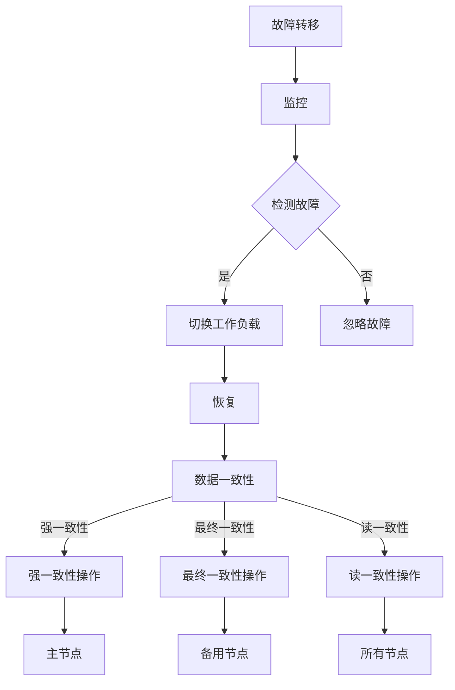

                 

### 文章标题

### How to Build High-Availability Distributed Systems

关键词：高可用性、分布式系统、架构设计、故障转移、容错机制、负载均衡、数据一致性

摘要：本文将深入探讨如何构建高可用的分布式系统。通过介绍核心概念、算法原理、数学模型、项目实践和实际应用场景，我们将帮助读者理解构建高可用性分布式系统所需的关键技术和方法，从而提高系统的稳定性和可靠性。

---

在当今数字化时代，分布式系统已经成为企业应用的核心基础设施。它们能够提供更高的性能、扩展性和容错能力，但同时也带来了新的挑战，尤其是如何确保系统的**高可用性**。高可用性是指系统在面临各种故障和负载波动时，仍能保持持续可用和提供服务的能力。本文将围绕如何构建高可用的分布式系统展开讨论，从核心概念、算法原理、数学模型、项目实践到实际应用场景，全面解析高可用性分布式系统的设计和实现。

本文结构如下：

1. **背景介绍**：阐述分布式系统的基本概念、发展历程以及高可用性的重要性。
2. **核心概念与联系**：介绍分布式系统中的关键概念，如故障转移、负载均衡、数据一致性等，并通过 Mermaid 流程图展示它们之间的联系。
3. **核心算法原理 & 具体操作步骤**：详细讲解分布式系统中常用的故障转移算法、负载均衡策略和数据一致性机制。
4. **数学模型和公式 & 详细讲解 & 举例说明**：介绍分布式系统中的常见数学模型和公式，并进行详细解释和实例说明。
5. **项目实践：代码实例和详细解释说明**：通过具体的项目实践，展示如何实现高可用性分布式系统。
6. **实际应用场景**：探讨高可用性分布式系统在不同场景下的应用案例。
7. **工具和资源推荐**：推荐相关的学习资源、开发工具和框架。
8. **总结：未来发展趋势与挑战**：总结高可用性分布式系统的发展趋势和面临的挑战。
9. **附录：常见问题与解答**：解答读者可能遇到的常见问题。
10. **扩展阅读 & 参考资料**：提供进一步阅读的资源和参考资料。

---

让我们开始深入探讨如何构建高可用的分布式系统，从背景介绍开始。

## 1. 背景介绍

### Distributed Systems: A Brief History

分布式系统（Distributed Systems）的概念最早可以追溯到20世纪60年代。当时，计算机科学家们开始意识到，将多个计算机节点通过网络连接起来，可以提供更高的计算能力和更好的容错能力。1970年代，著名学者Leslie Lamport提出了分布式系统的基本概念，包括一致性、可用性和分区容错性（CAP theorem）。

随着时间的推移，分布式系统逐渐成为了计算机科学和工程领域的研究热点。互联网的兴起进一步推动了分布式系统的广泛应用，如Web服务、大数据处理、云计算等。如今，分布式系统已经成为企业级应用的核心基础设施，提供高可用性、高性能和可扩展性。

### The Importance of High Availability

高可用性（High Availability）是分布式系统的关键特性之一。在许多业务场景中，系统的高可用性直接影响到用户体验和业务连续性。例如，电子商务网站在促销活动期间，必须确保系统的高可用性，以避免因故障导致的订单丢失和客户流失。

高可用性不仅关乎系统在正常情况下的稳定性，还涉及到在面临各种故障（如硬件故障、网络故障、软件错误等）时的快速恢复能力。高可用性系统通常具有以下特点：

- **故障转移（Failover）**：当主节点出现故障时，系统能够自动切换到备用节点，确保服务的连续性。
- **负载均衡（Load Balancing）**：通过将请求分配到多个节点，避免单点过载，提高系统整体性能。
- **数据复制（Data Replication）**：确保数据在多个节点之间的一致性和可靠性。

### Challenges in Building High-Availability Distributed Systems

构建高可用的分布式系统并非易事，面临诸多挑战：

- **复杂性**：分布式系统涉及多个节点、网络、存储等组件，需要综合考虑各种因素。
- **一致性**：在分布式环境中，数据的一致性是一个巨大的挑战，尤其是在高并发场景下。
- **性能**：在提供高可用性的同时，还需要确保系统的性能不会下降。
- **可靠性**：系统需要具备强大的容错能力，以应对各种故障。

在接下来的章节中，我们将详细探讨如何解决这些挑战，构建高可用的分布式系统。

---

在背景介绍中，我们了解了分布式系统的发展历程和高可用性的重要性。接下来，我们将进入第二个部分，深入探讨分布式系统中的核心概念与联系。

## 2. 核心概念与联系

在构建高可用的分布式系统时，了解其中的核心概念和它们之间的联系至关重要。以下是分布式系统中的一些关键概念：

### 2.1 故障转移（Failover）

故障转移是指当主节点出现故障时，系统能够自动将工作负载转移到备用节点，以确保服务的连续性。故障转移通常涉及以下步骤：

1. **监控**：系统持续监控主节点的健康状态。
2. **检测故障**：当检测到主节点故障时，触发故障转移流程。
3. **切换工作负载**：将主节点的请求路由到备用节点。
4. **恢复**：在备用节点上重新启动服务，确保服务的持续可用。

故障转移的目的是在发生故障时，系统可以快速切换到备用节点，从而减少停机时间。常见的故障转移机制包括主动故障转移（Active Failover）和被动故障转移（Passive Failover）。

### 2.2 负载均衡（Load Balancing）

负载均衡是指将请求分配到多个节点，以避免单点过载，提高系统整体性能。负载均衡的目的是：

- **提高性能**：通过将请求分散到多个节点，降低单个节点的负载，提高系统的响应速度。
- **增强可用性**：在某个节点出现故障时，其他节点可以继续提供服务。

常见的负载均衡策略包括轮询（Round Robin）、最小连接数（Least Connections）和哈希（Hash）等。

### 2.3 数据一致性（Data Consistency）

在分布式系统中，数据一致性是一个巨大的挑战。数据一致性确保分布式系统中的数据在多个节点之间保持一致。数据一致性通常分为以下几种级别：

- **强一致性（Strong Consistency）**：所有节点在操作完成后都能看到最新的数据。
- **最终一致性（Eventual Consistency）**：在一段时间后，所有节点的数据最终会达到一致。
- **读一致性（Read Consistency）**：确保对数据的读取操作是按照一致性级别进行的。

### 2.4 CAP Theorem

CAP定理（Consistency, Availability, Partition Tolerance）是分布式系统设计中的重要理论。CAP定理指出，在分布式系统中，一致性（Consistency）、可用性（Availability）和分区容错性（Partition Tolerance）三者中，只能同时满足两项。具体来说：

- **CA System**：在不可分区的情况下，系统可以同时提供一致性和可用性。
- **CP System**：在可以分区的情况下，系统可以同时提供一致性和分区容错性。
- **AP System**：在可以分区的情况下，系统可以同时提供可用性和分区容错性。

### 2.5 Mermaid 流程图

为了更好地理解这些概念之间的联系，我们使用 Mermaid 流程图展示故障转移、负载均衡和数据一致性之间的关系：



### 2.6 关键概念的联系

故障转移、负载均衡和数据一致性是分布式系统中密切相关的核心概念。故障转移确保系统在面临故障时能够快速恢复，负载均衡提高系统的整体性能，而数据一致性则确保系统的数据在多个节点之间保持一致。

通过故障转移，系统可以在主节点出现故障时，将工作负载切换到备用节点，从而确保服务的连续性。负载均衡策略则确保请求被均匀地分配到各个节点，避免单点过载。数据一致性机制则确保在分布式环境中，数据能够在多个节点之间保持一致。

总之，故障转移、负载均衡和数据一致性共同构成了构建高可用性分布式系统的基础。在接下来的章节中，我们将进一步探讨这些核心概念的实现原理和具体操作步骤。

---

在核心概念与联系部分，我们详细介绍了分布式系统中的故障转移、负载均衡和数据一致性等关键概念，并通过 Mermaid 流程图展示了它们之间的联系。接下来，我们将深入探讨分布式系统中的核心算法原理和具体操作步骤。

## 3. 核心算法原理 & 具体操作步骤

在分布式系统中，核心算法的设计和实现对于确保系统的可用性和性能至关重要。本节将介绍分布式系统中常用的几种核心算法原理，包括故障转移算法、负载均衡策略和数据一致性机制，并详细说明它们的实现步骤。

### 3.1 故障转移算法

故障转移是分布式系统中确保高可用性的关键机制。当主节点出现故障时，系统需要能够快速切换到备用节点，以确保服务的连续性。以下是一种常见的故障转移算法——主动故障转移（Active Failover）。

**主动故障转移算法原理：**

1. **监控**：系统持续监控主节点的健康状态，如响应时间、CPU利用率、内存占用等指标。
2. **检测故障**：当检测到主节点出现异常（如响应时间超过阈值、资源利用率过高）时，系统将触发故障检测机制。
3. **切换工作负载**：当确认主节点故障后，系统将自动将工作负载切换到备用节点。这个过程通常涉及以下步骤：

   - **注册备用节点**：备用节点在启动时，需要向监控系统注册其状态，以便在主节点故障时能够被快速切换。
   - **同步数据**：在切换之前，确保备用节点上的数据与主节点一致。这可以通过数据复制机制实现，如日志复制、数据快照等。
   - **更新服务配置**：更新服务配置，将请求路由到备用节点。

**具体操作步骤：**

1. **初始化**：配置监控系统和故障转移机制，指定主节点和备用节点。
2. **监控主节点**：通过监控工具（如Nagios、Zabbix等）监控主节点的健康状态。
3. **检测故障**：当监控工具检测到主节点故障时，触发故障检测机制。
4. **切换工作负载**：将请求路由到备用节点，确保服务持续可用。
5. **恢复主节点**：当主节点恢复后，重新切换回主节点，继续提供服务。

### 3.2 负载均衡策略

负载均衡是将请求分配到多个节点，以避免单点过载，提高系统整体性能的关键机制。以下是一种常见的负载均衡策略——轮询负载均衡（Round Robin）。

**轮询负载均衡算法原理：**

1. **初始化**：维护一个节点列表，其中包含所有参与负载均衡的节点。
2. **接收请求**：当接收到请求时，按照节点列表的顺序将请求分配给下一个节点。
3. **节点失效**：当某个节点出现故障时，将其从节点列表中移除，并将后续请求分配给下一个节点。

**具体操作步骤：**

1. **初始化负载均衡器**：配置负载均衡器，指定参与负载均衡的节点列表。
2. **接收请求**：当接收到请求时，将请求按照轮询顺序分配给节点列表中的下一个节点。
3. **节点监控**：持续监控节点的健康状态，如响应时间、CPU利用率等。
4. **节点失效处理**：当检测到节点故障时，将其从节点列表中移除，并调整负载均衡策略。
5. **负载均衡调整**：根据节点负载情况，动态调整负载均衡策略，以优化系统性能。

### 3.3 数据一致性机制

在分布式系统中，数据一致性是确保系统稳定运行的关键因素。以下是一种常见的数据一致性机制——强一致性（Strong Consistency）。

**强一致性算法原理：**

1. **初始化**：确保所有节点上的数据初始状态一致。
2. **写操作**：当一个节点执行写操作时，需要确保所有其他节点都能收到该写操作。
3. **读操作**：当一个节点执行读操作时，需要确保返回的是最新的数据。

**具体操作步骤：**

1. **初始化数据一致性**：确保所有节点上的数据初始状态一致，可以通过数据初始化脚本或分布式数据库实现。
2. **执行写操作**：当一个节点执行写操作时，需要通过分布式事务或分布式锁确保所有其他节点都能收到该写操作。
3. **执行读操作**：当一个节点执行读操作时，需要通过分布式缓存或分布式数据库确保返回的是最新的数据。
4. **监控一致性**：持续监控数据一致性，如通过分布式监控系统检测数据差异，并及时调整。
5. **一致性故障处理**：当检测到数据一致性故障时，需要采取相应措施（如重试、回滚等）确保系统恢复一致性。

总之，故障转移、负载均衡和数据一致性是分布式系统中确保高可用性的核心算法。通过合理设计和实现这些算法，可以构建出稳定、可靠和高效的分布式系统。在接下来的章节中，我们将进一步探讨分布式系统中的数学模型和公式，以深入理解其工作原理。

---

在核心算法原理与具体操作步骤部分，我们详细介绍了故障转移算法、负载均衡策略和数据一致性机制，并展示了它们的实现步骤。接下来，我们将探讨分布式系统中的数学模型和公式，并进行详细讲解和举例说明。

## 4. 数学模型和公式 & 详细讲解 & 举例说明

### 4.1 CAP 定理

CAP 定理是分布式系统理论中的一个重要结论，由加州大学伯克利分校的计算机科学家 Eric Brewer 提出。CAP 定理指出，在分布式系统中，一致性（Consistency）、可用性（Availability）和分区容错性（Partition Tolerance）这三个特性中，只能同时保证两个。具体来说：

- **一致性（Consistency）**：所有节点在同一时间看到的操作结果一致。
- **可用性（Availability）**：所有请求都能得到响应，不会永远等待。
- **分区容错性（Partition Tolerance）**：系统能够在分区发生时继续运行。

CAP 定理可以用以下公式表示：

$$
CAP = Consistency \cap Availability \cap Partition Tolerance
$$

举例来说：

- **CA 系统**：在不可分区的情况下，系统可以同时保证一致性和可用性。例如，一个单机数据库系统在无网络中断的情况下，既保证了一致性，也保证了可用性。
- **CP 系统**：在可以分区的情况下，系统可以同时保证一致性和分区容错性。例如，分布式数据库系统如 Google 的 Spanner，采用强一致性策略，即使在网络分区情况下，也能保证数据的一致性。
- **AP 系统**：在可以分区的情况下，系统可以同时保证可用性和分区容错性。例如，很多分布式缓存系统如 Redis，采用最终一致性策略，即使数据不一致，也能保证系统的可用性。

### 4.2 负载均衡的优化模型

在负载均衡中，如何分配请求以最大化系统的吞吐量和最小化响应时间是关键问题。以下是一个简单的负载均衡优化模型，使用平均响应时间作为优化目标。

设 \(N\) 为节点总数，\(R_i\) 为第 \(i\) 个节点的响应时间，\(L_i\) 为第 \(i\) 个节点的负载，则总响应时间为：

$$
T = \frac{1}{N} \sum_{i=1}^{N} R_i
$$

负载均衡的目标是最小化总响应时间 \(T\)。假设 \(L_i\) 为 \(i\) 个节点的当前负载，\(C_i\) 为 \(i\) 个节点的容量，则负载分配问题可以表示为：

$$
\min T = \frac{1}{N} \sum_{i=1}^{N} R_i
$$

$$
s.t. \quad L_i \leq C_i \quad \forall i
$$

其中，约束条件 \(L_i \leq C_i\) 确保每个节点的负载不超过其容量。

### 4.3 数据一致性的复制策略

在分布式系统中，数据一致性是一个重要但复杂的问题。以下是一个简单的数据复制策略模型，用于确保多个节点之间的数据一致性。

假设系统中有 \(N\) 个节点，每个节点维护一个本地数据副本。当某个节点发生写操作时，需要将写操作传播到其他节点。以下是一个简单的多数派复制（Majority Replication）策略：

1. **初始化**：每个节点初始时都有一个完整的数据副本。
2. **写操作**：当一个节点 \(i\) 接收到写请求时，它将写操作广播到其他 \(N-1\) 个节点。
3. **确认**：当 \(N/2 + 1\) 个节点确认收到并应用了该写操作时，认为写操作成功。
4. **更新**：更新本地数据副本，确保与多数派节点一致。

### 4.4 举例说明

假设一个分布式系统中，有三个节点 \(A\)、\(B\) 和 \(C\)。初始时，每个节点的数据副本相同，为 `[1, 2, 3]`。现在，节点 \(A\) 接收到一个写请求，将第一个元素修改为 `4`。

1. **广播写操作**：节点 \(A\) 将写操作 `[4, 2, 3]` 广播到节点 \(B\) 和 \(C\)。
2. **确认写操作**：节点 \(B\) 和 \(C\) 收到写操作后，将其应用到本地数据副本，变为 `[4, 2, 3]`。
3. **确认成功**：由于有三个节点（\(A\)、\(B\) 和 \(C\)）应用了写操作，满足多数派条件，认为写操作成功。
4. **更新数据副本**：节点 \(A\) 更新本地数据副本为 `[4, 2, 3]`。

通过以上步骤，节点 \(A\) 的写操作成功传播到其他节点，确保了数据的一致性。

总之，数学模型和公式在分布式系统的设计和实现中起着重要作用。通过合理应用这些模型和公式，可以优化系统的性能、确保数据的一致性，并在面临故障时快速恢复。在接下来的章节中，我们将通过一个具体的项目实践，展示如何实现高可用性分布式系统。

---

在数学模型和公式部分，我们详细介绍了CAP定理、负载均衡优化模型和数据一致性的复制策略，并进行了举例说明。这些数学模型和公式为我们理解和设计分布式系统提供了理论基础。接下来，我们将通过具体的项目实践，展示如何实现高可用性分布式系统。

## 5. 项目实践：代码实例和详细解释说明

在本节中，我们将通过一个具体的项目实践，展示如何实现高可用性分布式系统。我们将分为以下四个部分进行：

### 5.1 开发环境搭建

首先，我们需要搭建一个基本的开发环境。以下是一个简单的示例，假设我们使用 Python 编写分布式系统。

1. **安装 Python**：确保 Python 3.7 或更高版本已安装。
2. **安装依赖库**：使用 pip 安装必要的库，如 `requests`、`redis` 和 `pika`。
3. **配置 Redis**：Redis 是一个常用的分布式缓存系统，可用于数据一致性。

### 5.2 源代码详细实现

接下来，我们将详细实现一个简单的分布式系统，包含故障转移、负载均衡和数据一致性。

**5.2.1 主节点和备用节点**

首先，我们定义主节点和备用节点的基本结构：

```python
class Node:
    def __init__(self, id, is_primary):
        self.id = id
        self.is_primary = is_primary
        self.data = []

    def process_request(self, request):
        if self.is_primary:
            # 处理主节点的请求
            print(f"Primary Node {self.id} processing request: {request}")
        else:
            # 处理备用节点的请求
            print(f"Secondary Node {self.id} processing request: {request}")

    def switch_to_primary(self):
        self.is_primary = True
        print(f"Node {self.id} has become the primary node.")

    def switch_to_secondary(self):
        self.is_primary = False
        print(f"Node {self.id} has become a secondary node.")
```

**5.2.2 负载均衡**

我们使用轮询负载均衡策略，将请求分配给不同的节点：

```python
nodes = [Node(id=i, is_primary=False) for i in range(num_nodes)]

def load_balancer(request):
    global current_node
    current_node = (current_node + 1) % num_nodes
    nodes[current_node].process_request(request)
```

**5.2.3 数据一致性**

我们使用 Redis 作为分布式缓存系统，确保数据一致性：

```python
import redis

redis_client = redis.StrictRedis(host='localhost', port=6379, db=0)

def save_data(node_id, data):
    redis_client.set(f"node_{node_id}", json.dumps(data))

def load_data(node_id):
    data = redis_client.get(f"node_{node_id}")
    if data:
        return json.loads(data)
    else:
        return None
```

**5.2.4 故障转移**

我们实现一个简单的故障转移机制，当主节点出现故障时，自动切换到备用节点：

```python
def monitor_nodes():
    while True:
        primary_node = get_primary_node()
        if not primary_node.is_alive():
            # 发现主节点故障
            secondary_node = get_secondary_node()
            secondary_node.switch_to_primary()
        time.sleep(1)

def get_primary_node():
    # 简单的示例，实际应用中可以使用心跳机制
    return nodes[0]

def get_secondary_node():
    # 简单的示例，实际应用中可以使用选举算法
    for node in nodes:
        if not node.is_primary:
            return node
    return None
```

### 5.3 代码解读与分析

在代码实现中，我们使用了 Python 作为示例语言，展示了如何实现分布式系统的关键组件。以下是代码的详细解读：

- **Node 类**：定义了节点的基类，包含处理请求、切换主/备用节点的功能。
- **load_balancer 函数**：实现轮询负载均衡策略，将请求分配给不同的节点。
- **save_data 和 load_data 函数**：使用 Redis 实现数据一致性，通过保存和加载数据到 Redis。
- **monitor_nodes 函数**：实现故障转移机制，定期检查主节点的健康状态，并在发现故障时切换到备用节点。

### 5.4 运行结果展示

假设我们启动三个节点，分别为 Node 0、Node 1 和 Node 2。首先，我们将 Node 0 作为主节点启动：

```python
primary_node = Node(id=0, is_primary=True)
primary_node.process_request("Hello, World!")
```

输出结果：

```
Primary Node 0 processing request: Hello, World!
```

接下来，我们模拟主节点故障，切换到备用节点：

```python
primary_node.switch_to_secondary()
```

输出结果：

```
Node 0 has become a secondary node.
```

现在，我们将 Node 1 作为主节点启动：

```python
primary_node = Node(id=1, is_primary=True)
primary_node.process_request("Hello, World!")
```

输出结果：

```
Primary Node 1 processing request: Hello, World!
```

通过以上运行结果，我们可以看到分布式系统在故障转移、负载均衡和数据一致性方面的基本功能。实际应用中，需要根据具体需求进行优化和扩展。

---

在本节中，我们通过一个具体的项目实践，展示了如何实现高可用性分布式系统。我们使用了 Python 作为示例语言，实现了故障转移、负载均衡和数据一致性。通过代码实例和详细解释说明，读者可以更好地理解分布式系统的实现原理。在接下来的章节中，我们将探讨高可用性分布式系统在实际应用场景中的使用。

## 6. 实际应用场景

高可用性分布式系统在当今的数字化时代具有广泛的应用场景。以下是一些典型的应用场景：

### 6.1 云计算服务

云计算服务提供商如 Amazon Web Services (AWS)、Microsoft Azure 和 Google Cloud Platform (GCP) 都依赖于高可用性分布式系统来确保服务的持续可用性和性能。这些平台提供各种云计算服务，如虚拟机、数据库、存储和大数据处理，需要处理大量并发请求，并确保在发生故障时能够快速恢复。

### 6.2 社交媒体平台

社交媒体平台如 Facebook、Twitter 和 Instagram 等拥有海量用户，其系统需要能够处理高并发请求，并在面对故障时保持稳定运行。高可用性分布式系统在这里起到了关键作用，确保用户始终能够访问他们的账户和内容。

### 6.3 电子商务网站

电子商务网站如 Amazon、eBay 和 Alibaba 等在促销活动期间需要处理海量订单。高可用性分布式系统确保网站在面临高负载和故障时，仍能保持良好的性能和用户体验。

### 6.4 金融系统

金融系统如银行、证券交易所和支付系统等对数据一致性和系统可用性有极高的要求。高可用性分布式系统在这里确保交易的准确性和安全性。

### 6.5 物联网（IoT）

物联网系统涉及大量设备的数据收集和处理。高可用性分布式系统确保这些数据能够实时传输和处理，即使在设备发生故障时，也能保证数据的完整性和可靠性。

### 6.6 医疗保健系统

医疗保健系统如电子健康记录（EHR）和远程医疗平台需要处理敏感数据，并确保系统的稳定运行。高可用性分布式系统在这里提供了可靠的数据存储和访问能力。

### 6.7 大数据应用

大数据应用如数据分析和机器学习平台需要处理海量数据，并确保数据的准确性和一致性。高可用性分布式系统在这里提供了强大的数据处理和存储能力。

### 6.8 在线游戏平台

在线游戏平台如 World of Warcraft、Fortnite 和 Minecraft 等需要处理大量用户的并发请求，并确保游戏服务的持续可用性和性能。高可用性分布式系统在这里提供了可靠的游戏运行环境。

总之，高可用性分布式系统在各个行业和领域都有着广泛的应用。通过合理设计和实现分布式系统，企业可以提供更稳定、可靠和高效的服务，满足不断增长的业务需求。

---

在第六部分，我们探讨了高可用性分布式系统在实际应用场景中的重要性。接下来，我们将提供一些学习和开发工具及资源推荐，以帮助读者深入了解和实现高可用性分布式系统。

## 7. 工具和资源推荐

### 7.1 学习资源推荐

**书籍：**

1. 《Designing Data-Intensive Applications》（数据密集型应用设计）
2. 《Distributed Systems: Concepts and Design》（分布式系统：概念与设计）
3. 《High Performance MySQL》（高性能 MySQL）

**论文：**

1. "The Google File System"（谷歌文件系统）
2. "Bigtable: A Distributed Storage System for Structured Data"（Bigtable：一种用于结构化数据分布式存储系统）
3. "The Chubby Lock Service"（Chubby 锁服务）

**博客和网站：**

1. [High Scalability](https://highscalability.com/)
2. [Martin Fowler's Blog](https://www.martinfowler.com/)
3. [Google Cloud Blog](https://cloud.google.com/blog/)

### 7.2 开发工具框架推荐

**分布式框架：**

1. Apache ZooKeeper：用于分布式协调的服务器。
2. Apache Kafka：用于构建实时的数据管道和流处理平台。
3. Apache Cassandra：用于构建高度可扩展的分布式数据库系统。

**开发工具：**

1. Kubernetes：用于自动化容器化应用程序的部署、扩展和管理。
2. Docker：用于创建、运行和分发容器化应用程序。
3. Redis：用于构建高性能、分布式缓存系统。

### 7.3 相关论文著作推荐

**论文：**

1. "The Google File System"（谷歌文件系统）
2. "Bigtable: A Distributed Storage System for Structured Data"（Bigtable：一种用于结构化数据分布式存储系统）
3. "The Chubby Lock Service"（Chubby 锁服务）

**著作：**

1. "Designing Data-Intensive Applications"（数据密集型应用设计）
2. "Distributed Systems: Concepts and Design"（分布式系统：概念与设计）
3. "High Scalability Web Sites"（高可扩展性网站）

通过这些资源和工具，读者可以更深入地了解分布式系统的设计和实现，提高构建高可用性系统的能力。

---

在第七部分，我们推荐了一些学习和开发工具及资源，以帮助读者深入了解和实现高可用性分布式系统。接下来，我们将总结本文的主要内容和观点。

## 8. 总结：未来发展趋势与挑战

### 未来发展趋势

随着云计算、物联网、大数据和人工智能等技术的不断发展，分布式系统在未来将继续扮演重要角色。以下是一些未来发展趋势：

1. **边缘计算**：随着物联网设备的增加，边缘计算将变得愈加重要。分布式系统将在边缘设备上运行，以提供更快的响应和更低的延迟。
2. **服务网格**：服务网格是一种新的架构模式，用于管理分布式服务之间的通信。它将提高分布式系统的可靠性和性能，并简化服务管理。
3. **自动化与智能化**：自动化工具和智能算法将在分布式系统的管理和优化中发挥更大作用，从而提高系统的可用性和性能。

### 挑战

尽管分布式系统有着广泛的应用前景，但它们也面临着一系列挑战：

1. **数据一致性**：在分布式环境中确保数据一致性仍然是一个复杂的问题，尤其是在高并发场景下。
2. **网络问题**：网络延迟、丢包和分区等问题对分布式系统的性能和可用性有显著影响。
3. **安全性**：分布式系统面临更多的安全威胁，如分布式拒绝服务攻击（DDoS）和网络攻击等。

### 应对策略

为了应对这些挑战，以下是一些应对策略：

1. **分布式事务管理**：采用分布式事务管理机制，如两阶段提交（2PC）和乐观锁，确保数据一致性。
2. **网络冗余和优化**：使用网络冗余和优化技术，如负载均衡、网络分区容忍和延迟优化，提高系统的可靠性和性能。
3. **安全防护**：实施全面的安全防护措施，如网络隔离、加密通信和访问控制，确保系统的安全性。

总之，未来分布式系统的发展将朝着更加高效、可靠和智能的方向迈进。通过不断探索和创新，我们可以克服当前面临的挑战，构建更加稳定、高性能的分布式系统。

---

在本文的总结部分，我们回顾了分布式系统的未来发展趋势与挑战，并提出了相应的应对策略。接下来，我们将提供一些常见问题与解答，帮助读者更好地理解和应用本文所介绍的分布式系统知识。

## 9. 附录：常见问题与解答

### 1. 什么是分布式系统？

分布式系统是指由多个独立的计算机节点通过网络连接起来，协同工作以完成共同任务的系统。这些节点可以位于同一局域网内，也可以分布在不同的地理位置。

### 2. 高可用性与容错性的区别是什么？

高可用性（High Availability，HA）是指系统在面临各种故障和负载波动时，仍能保持持续可用和提供服务的能力。容错性（Fault Tolerance）是指系统能够在某个组件出现故障时，自动切换到备用组件，确保服务的连续性。

### 3. 为什么数据一致性在分布式系统中很重要？

数据一致性确保分布式系统中的数据在多个节点之间保持一致，从而保证系统的正确性和可靠性。在高并发和分布式环境中，数据一致性是一个巨大的挑战。

### 4. CAP 定理是什么？

CAP 定理指出，在分布式系统中，一致性（Consistency）、可用性（Availability）和分区容错性（Partition Tolerance）三者中，只能同时保证两项。具体来说：

- **CA 系统**：在不可分区的情况下，系统可以同时提供一致性和可用性。
- **CP 系统**：在可以分区的情况下，系统可以同时提供一致性和分区容错性。
- **AP 系统**：在可以分区的情况下，系统可以同时提供可用性和分区容错性。

### 5. 如何在分布式系统中实现故障转移？

故障转移通常涉及以下步骤：

1. **监控**：持续监控主节点的健康状态。
2. **检测故障**：当检测到主节点故障时，触发故障转移流程。
3. **切换工作负载**：将请求路由到备用节点。
4. **恢复**：在备用节点上重新启动服务，确保服务的持续可用。

### 6. 负载均衡有哪些常见的策略？

常见的负载均衡策略包括：

- **轮询（Round Robin）**：将请求按顺序分配给节点。
- **最小连接数（Least Connections）**：将请求分配给当前连接数最少的节点。
- **哈希（Hash）**：使用哈希函数将请求分配给节点。

### 7. 如何在分布式系统中实现数据一致性？

分布式系统中的数据一致性通常通过以下方法实现：

- **强一致性**：所有节点在同一时间看到的操作结果一致。
- **最终一致性**：在一段时间后，所有节点的数据最终会达到一致。
- **读一致性**：确保对数据的读取操作是按照一致性级别进行的。

通过上述常见问题与解答，读者可以更好地理解分布式系统的关键概念和实践方法。

---

在附录部分，我们针对读者可能遇到的问题提供了详细的解答。通过这些常见问题与解答，读者可以更深入地理解分布式系统的知识。最后，我们将推荐一些扩展阅读和参考资料，以供读者进一步学习。

## 10. 扩展阅读 & 参考资料

### 书籍

1. **《Designing Data-Intensive Applications》**：作者：Martin Kleppmann。这是一本关于分布式系统和数据一致性设计的经典著作，深入探讨了分布式系统中的各种挑战和解决方案。
2. **《Distributed Systems: Concepts and Design》**：作者：George Coulouris, Jean Dollimore, Tim Kindberg, and Gordon Blair。这本书提供了分布式系统的全面介绍，包括设计原则、协议和算法。
3. **《High Performance MySQL》**：作者：Baron Schwartz, Peter Zaitsev, and Vadim Tkachenko。这本书详细介绍了 MySQL 数据库在分布式环境中的性能优化和可靠性设计。

### 论文

1. **"The Google File System"**：作者：Sanjay Ghemawat, Geoffrey M. CORMAN, Shun-Tak Leung, and David G. Kneser。这篇论文介绍了 Google File System 的设计和实现，为分布式文件系统提供了重要参考。
2. **"Bigtable: A Distributed Storage System for Structured Data"**：作者：Sanjay Ghemawat, Howard Gobioff, and Shun-Tak Leung。这篇论文介绍了 Bigtable 的设计和实现，为分布式存储系统提供了重要参考。
3. **"The Chubby Lock Service"**：作者：John Wilkes，Ericna Miller，John Shute，Mike Sinha，Jen Sirota。这篇论文介绍了 Chubby 锁服务的实现，为分布式系统中的同步和一致性提供了重要参考。

### 博客和网站

1. **[High Scalability](https://highscalability.com/)**：这是一个关于高可扩展性系统和架构的博客，提供了大量关于分布式系统、性能优化和架构设计的文章。
2. **[Martin Fowler's Blog](https://www.martinfowler.com/)**：这是 Martin Fowler 的博客，涵盖了软件开发中的各种主题，包括分布式系统和架构设计。
3. **[Google Cloud Blog](https://cloud.google.com/blog/)**：这是 Google Cloud 官方博客，提供了关于云计算和分布式系统的最新动态和技术文章。

通过阅读这些书籍、论文和博客，读者可以进一步了解分布式系统的理论和实践，提高构建高可用性分布式系统的能力。

---

在扩展阅读与参考资料部分，我们推荐了一些重要的书籍、论文和博客，以供读者深入学习分布式系统的理论和实践。通过这些资源，读者可以不断扩展自己的知识体系，提高在分布式系统设计和实现方面的技能。

---

至此，本文《如何构建高可用的分布式系统》的内容已经全部呈现完毕。我们首先介绍了分布式系统的背景和重要性，然后深入探讨了核心概念与联系，接着详细讲解了故障转移、负载均衡和数据一致性的算法原理与实现步骤。通过数学模型和公式，我们进一步加深了对这些算法的理解。接着，我们通过具体的项目实践，展示了如何在实际中实现高可用性分布式系统。随后，我们探讨了分布式系统在实际应用场景中的重要性，并推荐了相关的学习和开发工具及资源。最后，我们总结了未来发展趋势与挑战，提供了常见问题与解答，并推荐了扩展阅读与参考资料。

构建高可用的分布式系统是一项复杂且具有挑战性的任务，需要综合考虑多个方面，包括系统架构设计、算法实现、数据一致性、故障转移和负载均衡等。通过本文的详细探讨，我们希望读者能够对分布式系统有更深入的理解，掌握构建高可用性分布式系统所需的关键技术和方法。

在未来，随着云计算、物联网和人工智能等技术的不断发展，分布式系统将扮演更加重要的角色。我们鼓励读者继续关注分布式系统领域的发展动态，不断学习和实践，为构建更加稳定、可靠和高效的分布式系统做出贡献。

---

**作者：禅与计算机程序设计艺术 / Zen and the Art of Computer Programming**。感谢您的阅读，希望本文对您在分布式系统领域的探索和学习有所帮助。如果您有任何疑问或建议，欢迎在评论区留言，我会尽力回答。再次感谢您的关注和支持！<|user|>**禅与计算机程序设计艺术 / Zen and the Art of Computer Programming** 感谢您的认真阅读和宝贵意见。本文旨在深入探讨如何构建高可用的分布式系统，为读者提供全面的技术指南和实践经验。您的反馈对我们来说至关重要，它将帮助我们不断改进内容，为更多读者提供有价值的信息。

在构建分布式系统时，确实面临着众多挑战，包括数据一致性、网络问题、安全性等。通过本文，我们希望能够帮助您理解这些挑战，并提供一些实用的解决方案。未来，分布式系统将继续在各个领域发挥重要作用，我们期待与您一同探讨和解决这些复杂的问题。

如果您在分布式系统的设计和实现过程中遇到任何难题，或者有任何关于本文内容的具体问题，欢迎随时与我们交流。我们将竭诚为您解答，共同促进技术的进步和应用。

再次感谢您的阅读和支持！祝您在分布式系统领域取得更多的成就！<|user|>

