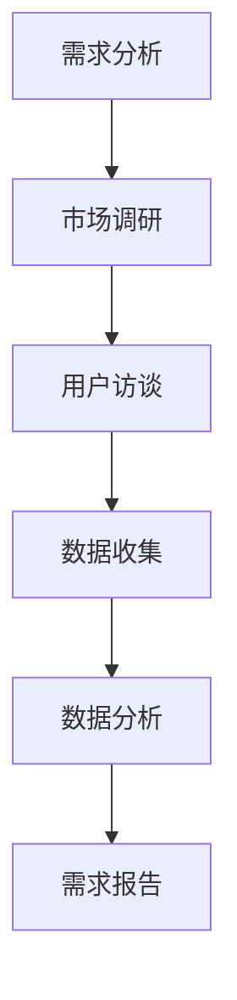
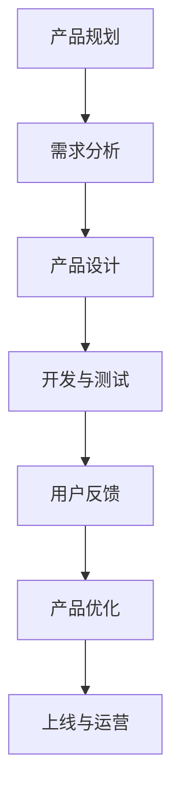
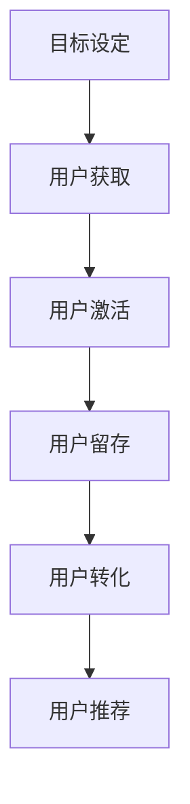

                 

### 背景介绍（Background Introduction）

在当今数字化时代，字节跳动作为一家领先的内容和社交媒体公司，其产品经理岗位成为了众多求职者的热门目标。为了更好地准备这些面试，我们需要深入了解字节跳动产品经理面试的特点和难点。本文将汇总2024年字节跳动产品经理岗位的面试真题，并附上详细的答案，帮助读者更好地应对面试挑战。

#### 字节跳动产品经理面试特点

字节跳动产品经理岗位的面试过程具有以下特点：

1. **全流程产品设计**：面试过程中，面试官可能会要求考生从需求分析、市场调研、功能设计到原型制作和用户测试等各个环节，全面展示产品经理的素质。
2. **实际案例分析**：面试官可能会给出一个实际案例，要求考生分析问题并提出解决方案。这要求考生具备实际操作能力和敏锐的市场洞察力。
3. **算法和数据素养**：产品经理需要具备一定的数据分析和算法能力，因此面试中可能会涉及到相关的问题。
4. **沟通与团队合作**：产品经理需要与团队成员、上级和用户进行有效沟通，因此面试中会评估考生的沟通能力和团队合作精神。
5. **行业知识了解**：了解当前互联网行业的发展趋势和热门话题是应对字节跳动产品经理面试的关键。

#### 面试真题汇总

以下汇总了2024年字节跳动产品经理岗位的常见面试真题，包括但不限于：

1. **如何设计一款流行的短视频应用？**
2. **如果你是产品经理，如何提高某个电商平台的用户留存率？**
3. **请描述一下你过去参与的最成功的一个产品项目，并分析其中的关键因素。**
4. **在产品迭代过程中，如何处理用户反馈和数据分析之间的矛盾？**
5. **请解释一下什么是A/B测试，为什么它对产品经理很重要？**
6. **在互联网行业中，什么是增长黑客（Growth Hacking），你有哪些实践经验？**
7. **如何进行市场调研？请举例说明。**
8. **请设计一个用户画像，并描述如何基于用户画像进行产品定位和推荐。**
9. **在产品设计中，如何平衡用户体验和商业需求？**
10. **请谈谈你对区块链技术的理解，以及它在产品中的应用场景。**

#### 面试真题答案解析

为了更好地帮助读者准备面试，我们对上述真题进行了详细解析，并提供了参考答案。

1. **如何设计一款流行的短视频应用？**
   - **需求分析**：分析目标用户的需求，如娱乐性、社交性、教育性等。
   - **功能设计**：设计核心功能，如短视频上传、观看、点赞、评论、分享等。
   - **用户体验**：优化用户体验，如界面设计、操作流程、推送机制等。
   - **数据分析**：通过数据分析，了解用户行为和喜好，持续优化产品。

2. **如果你是产品经理，如何提高某个电商平台的用户留存率？**
   - **用户调研**：通过调研了解用户的需求和痛点。
   - **优化产品功能**：根据用户反馈，优化产品功能，提高用户满意度。
   - **增加用户互动**：通过活动、优惠券、积分系统等方式，增加用户互动。
   - **个性化推荐**：基于用户行为数据，提供个性化推荐，提高用户粘性。

3. **请描述一下你过去参与的最成功的一个产品项目，并分析其中的关键因素。**
   - **项目背景**：介绍项目的背景和目标。
   - **关键成功因素**：分析项目成功的关键因素，如市场调研、团队协作、技术创新等。
   - **项目成果**：介绍项目的成果和影响，如用户反馈、市场份额等。

4. **在产品迭代过程中，如何处理用户反馈和数据分析之间的矛盾？**
   - **平衡利益**：在用户反馈和数据分析之间寻找平衡点。
   - **数据验证**：对用户反馈进行数据验证，确保反馈的可信度。
   - **持续优化**：根据用户反馈和数据分析，持续优化产品功能。

5. **请解释一下什么是A/B测试，为什么它对产品经理很重要？**
   - **A/B测试**：是一种实验设计方法，通过将用户随机分配到两个或多个不同的版本，比较不同版本的用户行为和效果。
   - **重要性**：A/B测试可以帮助产品经理了解用户喜好和行为，指导产品优化方向。

6. **在互联网行业中，什么是增长黑客（Growth Hacking），你有哪些实践经验？**
   - **增长黑客**：是一种通过创新和低成本策略实现用户增长的方法。
   - **实践经验**：分享具体案例，如通过社交媒体、内容营销、合作伙伴关系等方式实现用户增长。

7. **如何进行市场调研？请举例说明。**
   - **调研方法**：介绍常用的市场调研方法，如问卷调查、访谈、焦点小组等。
   - **调研步骤**：描述市场调研的流程，如确定调研目标、设计调研问卷、收集数据、分析数据等。

8. **请设计一个用户画像，并描述如何基于用户画像进行产品定位和推荐。**
   - **用户画像**：描述用户的基本信息、行为习惯、兴趣爱好等。
   - **产品定位**：根据用户画像，确定产品的目标用户群体和定位。
   - **推荐策略**：基于用户画像，设计个性化推荐策略，提高用户满意度。

9. **在产品设计中，如何平衡用户体验和商业需求？**
   - **用户体验**：关注用户需求，提供易用、流畅的产品体验。
   - **商业需求**：考虑商业目标，确保产品盈利和可持续发展。

10. **请谈谈你对区块链技术的理解，以及它在产品中的应用场景。**
    - **区块链技术**：介绍区块链的基本原理和特点。
    - **应用场景**：分享区块链技术在产品中的应用案例，如去中心化金融、版权保护等。

通过以上解析，我们希望能够帮助读者更好地准备字节跳动产品经理的面试。在实际面试中，除了掌握知识点，更重要的是展示自己的实际操作能力和解决问题的能力。希望本文能为大家的面试之路提供有益的参考。### 2. 核心概念与联系（Core Concepts and Connections）

在深入探讨字节跳动产品经理岗位面试之前，我们需要先了解一些核心概念，这些概念将为我们理解面试题提供坚实的基础。以下是本文中涉及的核心概念及其相互关系：

#### 2.1 产品经理的角色（Role of Product Manager）

产品经理是负责产品整个生命周期的人，包括市场需求分析、产品规划、设计、开发、测试和上线等各个环节。他们需要具备跨部门的协调能力，确保产品顺利交付，满足用户需求和商业目标。

#### 2.2 用户需求分析（User Requirement Analysis）

用户需求分析是产品经理的重要任务之一。通过市场调研、用户访谈、问卷调查等方法，了解用户的需求、喜好和痛点，从而为产品设计和功能优化提供依据。

#### 2.3 数据分析（Data Analysis）

数据分析是产品经理必备的技能。通过收集和分析用户行为数据、市场数据等，产品经理可以了解产品的性能、用户满意度、市场竞争力等，为产品优化和决策提供数据支持。

#### 2.4 产品迭代（Product Iteration）

产品迭代是产品经理工作的核心内容之一。通过不断地收集用户反馈、市场变化等信息，产品经理需要及时调整产品方向和功能，以适应市场和用户的需求。

#### 2.5 增长策略（Growth Strategy）

增长策略是产品经理在推动产品增长过程中制定的一系列策略。这包括市场推广、用户获取、留存和转化等。产品经理需要通过创新和低成本策略，实现产品的快速增长。

#### 2.6 用户画像（User Persona）

用户画像是对目标用户的基本特征、行为习惯、兴趣爱好等的抽象描述。通过用户画像，产品经理可以更好地理解用户需求，为产品设计和推广提供方向。

#### 2.7 A/B测试（A/B Testing）

A/B测试是一种常用的实验设计方法，通过将用户随机分配到两个或多个不同的版本，比较不同版本的用户行为和效果，帮助产品经理了解用户偏好，指导产品优化。

#### 2.8 增长黑客（Growth Hacking）

增长黑客是一种利用创新和低成本策略实现用户增长的方法。它融合了市场营销、用户获取、产品设计和数据分析等多个领域，旨在以最小的成本实现最大的用户增长。

#### 2.9 市场调研（Market Research）

市场调研是了解市场环境和竞争状况的重要手段。通过市场调研，产品经理可以获取市场趋势、用户需求和竞争对手信息，为产品决策提供依据。

#### 2.10 区块链技术（Blockchain Technology）

区块链技术是一种去中心化的分布式数据库技术，具有安全性高、不可篡改等特点。在产品中，区块链技术可以应用于去中心化金融、版权保护、供应链管理等场景。

#### 2.11 统计模型（Statistical Models）

统计模型是数据分析的重要工具，通过建立数学模型，可以对用户行为、市场趋势等进行预测和分析。常见的统计模型包括线性回归、决策树、神经网络等。

#### 2.12 数据可视化（Data Visualization）

数据可视化是将数据分析结果以图形、图表等形式直观展示的方法。通过数据可视化，产品经理可以更直观地了解产品的性能和用户行为，为决策提供支持。

#### 2.13 用户体验（User Experience, UX）

用户体验是用户在使用产品过程中感受到的整体感受和体验。产品经理需要关注用户体验，确保产品易用、流畅，提高用户满意度和忠诚度。

#### 2.14 商业分析（Business Analysis）

商业分析是产品经理需要掌握的另一项技能，通过分析市场、用户、竞争对手等信息，为产品决策提供数据支持，确保产品具有商业可行性。

#### 2.15 团队协作（Team Collaboration）

团队协作是产品经理成功的关键之一。产品经理需要与开发团队、设计团队、市场团队等紧密合作，确保产品按时交付，满足用户和商业需求。

通过以上核心概念及其相互关系的介绍，我们为后续章节的分析和讨论奠定了基础。在接下来的内容中，我们将进一步探讨这些核心概念在字节跳动产品经理面试中的应用和实践。### 3. 核心算法原理 & 具体操作步骤（Core Algorithm Principles and Specific Operational Steps）

在字节跳动产品经理的面试中，算法和数据相关的题目是面试官考察考生技术素养的重要环节。以下将介绍一些常见的算法原理和具体操作步骤，帮助考生更好地应对这类面试题。

#### 3.1 排序算法（Sorting Algorithms）

排序算法是算法领域的基础知识，以下是一些常见的排序算法及其原理：

1. **冒泡排序（Bubble Sort）**：
   - **原理**：通过重复遍历要排序的数列，比较相邻的两个元素，若它们的顺序错误则交换它们，直到没有需要交换的元素为止。
   - **步骤**：
     1. 从数列的第一项开始，比较相邻两项的大小。
     2. 如果第一项比第二项大，交换它们。
     3. 对每一对相邻项进行同样的操作，直到没有需要交换的项。
     4. 重复上述步骤，直到整个数列有序。

2. **选择排序（Selection Sort）**：
   - **原理**：首先在未排序序列中找到最小（大）元素，存放到排序序列的起始位置，然后，再从剩余未排序元素中继续找到最小（大）元素，然后放到已排序序列的末尾。
   - **步骤**：
     1. 扫描整个未排序序列，找到最小元素。
     2. 将最小元素与序列的第一个元素交换。
     3. 对除第一个元素之外的后半部分重复上述步骤。

3. **插入排序（Insertion Sort）**：
   - **原理**：通过构建有序序列，对于未排序数据，在已排序序列中从后向前扫描，找到相应位置并插入。
   - **步骤**：
     1. 从第一个元素开始，该元素可以认为已经排序。
     2. 取出下一个元素，在已排序的元素序列中从后向前扫描。
     3. 如果该元素（已排序）大于新元素，将该元素移到下一位置。
     4. 重复步骤3，直到找到已排序的元素小于或者等于新元素。
     5. 将新元素插入到该位置后。
     6. 重复步骤2~5。

4. **快速排序（Quick Sort）**：
   - **原理**：通过选取一个“基准”元素，将数组分为两个子数组，一个包含小于基准的元素，另一个包含大于基准的元素，然后对这两个子数组再次递归进行快速排序。
   - **步骤**：
     1. 选择一个基准元素。
     2. 将数组分为两个子数组，小于基准的元素放在左边，大于基准的元素放在右边。
     3. 对左右两个子数组分别递归执行快速排序。

5. **归并排序（Merge Sort）**：
   - **原理**：采用分治法的一个非常典型的应用。将已有序的子序列合并，得到完全有序的序列。
   - **步骤**：
     1. 将数列分为若干个子序列，每个子序列至少包含一个元素。
     2. 对每个子序列进行排序。
     3. 将已排序的子序列合并成一个完整的序列。

#### 3.2 数据结构（Data Structures）

数据结构是算法的基础，以下介绍几种常见的数据结构及其操作：

1. **栈（Stack）**：
   - **原理**：一种后进先出（LIFO）的数据结构，用于存储有限的数据集合。
   - **操作**：
     1. push（入栈）：在栈顶添加一个元素。
     2. pop（出栈）：移除栈顶元素。
     3. peek（查看栈顶元素）：返回栈顶元素但不移除它。

2. **队列（Queue）**：
   - **原理**：一种先进先出（FIFO）的数据结构，用于存储有限的数据集合。
   - **操作**：
     1. enqueue（入队）：在队列末尾添加一个元素。
     2. dequeue（出队）：移除队列头部的元素。
     3. front（查看队头元素）：返回队列头部的元素但不移除它。

3. **链表（Linked List）**：
   - **原理**：由一系列节点组成的数据结构，每个节点包含数据和一个或多个指向其他节点的指针。
   - **操作**：
     1. append（追加节点）：在链表末尾添加一个节点。
     2. prepend（添加节点到头部）：在链表头部添加一个节点。
     3. delete（删除节点）：删除指定节点。

4. **树（Tree）**：
   - **原理**：一种层次结构的数据结构，每个节点可以有零个或多个子节点。
   - **操作**：
     1. insert（插入节点）：在树中插入一个新的节点。
     2. delete（删除节点）：从树中删除一个节点。
     3. traverse（遍历）：遍历树的每一个节点，常用的遍历方法有前序遍历、中序遍历和后序遍历。

5. **哈希表（Hash Table）**：
   - **原理**：一种基于关键字（键值）快速访问的数据结构，通过哈希函数将关键字映射到数组索引。
   - **操作**：
     1. put（插入）：将键值对插入到哈希表中。
     2. get（查找）：根据关键字查找对应的值。
     3. remove（删除）：根据关键字删除对应的键值对。

#### 3.3 算法分析与优化（Algorithm Analysis and Optimization）

在解决算法问题时，分析算法的时间和空间复杂度是非常重要的。以下是一些常见的方法和技巧：

1. **时间复杂度分析**：
   - **最好情况**：算法执行的最快时间。
   - **最坏情况**：算法执行的最慢时间。
   - **平均情况**：算法执行的平均时间。

2. **空间复杂度分析**：
   - **常数空间**：算法的空间使用不依赖于输入规模。
   - **对数空间**：算法的空间使用与输入规模的对数成正比。
   - **线性空间**：算法的空间使用与输入规模成正比。
   - **多项式空间**：算法的空间使用与输入规模的某次多项式成正比。

3. **优化技巧**：
   - **分治法**：将问题分解为较小的子问题，递归解决，然后合并结果。
   - **动态规划**：通过保存子问题的解来避免重复计算。
   - **贪心算法**：在每个阶段选择局部最优解，最终得到全局最优解。
   - **回溯法**：通过尝试所有可能的解来找到最优解。

#### 3.4 数学模型与公式（Mathematical Models and Formulas）

在算法和数据结构中，数学模型和公式也是非常重要的。以下介绍一些常用的数学模型和公式：

1. **线性回归模型（Linear Regression Model）**：
   - **公式**：\( y = ax + b \)
   - **系数计算**：
     - \( a = \frac{\sum{(x_i - \bar{x})(y_i - \bar{y})}}{\sum{(x_i - \bar{x})^2}} \)
     - \( b = \bar{y} - a\bar{x} \)

2. **决策树（Decision Tree）**：
   - **公式**：信息增益（Information Gain）\( IG = H(\text{父}) - H(\text{子}) \)
   - **信息熵（Entropy）**：\( H = -\sum_{i=1}^{n} p_i \log_2 p_i \)

3. **神经网络（Neural Network）**：
   - **激活函数**：
     - \( \text{Sigmoid}：\frac{1}{1 + e^{-x}} \)
     - \( \text{ReLU}：\max(0, x) \)
   - **反向传播算法**：
     - \( \delta_z = \frac{\partial \text{Cost}}{\partial z} \)
     - \( \delta_w = \delta_z \times \frac{\partial z}{\partial w} \)
     - \( w_{\text{new}} = w_{\text{old}} - \alpha \delta_w \)

通过以上核心算法原理和具体操作步骤的介绍，我们可以更好地理解和应用这些算法，为字节跳动产品经理的面试做好准备。在接下来的章节中，我们将继续探讨如何将这些原理和技巧应用于实际问题中。### 4. 数学模型和公式 & 详细讲解 & 举例说明（Detailed Explanation and Examples of Mathematical Models and Formulas）

在字节跳动产品经理的面试中，数学模型和公式的应用是面试官考察考生分析能力和数据处理能力的重要方面。以下将详细讲解几个常见的数学模型和公式，并通过实际例子进行说明，帮助考生更好地掌握这些知识点。

#### 4.1 线性回归模型（Linear Regression Model）

线性回归是一种基本的统计模型，用于预测连续值变量。其基本公式为：

\[ y = ax + b \]

其中，\( y \) 是因变量，\( x \) 是自变量，\( a \) 是斜率，\( b \) 是截距。

**计算斜率 \( a \) 和截距 \( b \)**

斜率 \( a \) 和截距 \( b \) 的计算公式为：

\[ a = \frac{\sum{(x_i - \bar{x})(y_i - \bar{y})}}{\sum{(x_i - \bar{x})^2}} \]
\[ b = \bar{y} - a\bar{x} \]

其中，\( \bar{x} \) 和 \( \bar{y} \) 分别是自变量和因变量的均值。

**例题**

假设有一组数据如下：

| \( x \) | \( y \) |
|--------|--------|
| 1      | 2      |
| 2      | 4      |
| 3      | 6      |
| 4      | 8      |
| 5      | 10     |

求线性回归模型的斜率 \( a \) 和截距 \( b \)。

**解答**

首先计算 \( \bar{x} \) 和 \( \bar{y} \)：

\[ \bar{x} = \frac{1 + 2 + 3 + 4 + 5}{5} = 3 \]
\[ \bar{y} = \frac{2 + 4 + 6 + 8 + 10}{5} = 6 \]

然后计算斜率 \( a \)：

\[ a = \frac{(1-3)(2-6) + (2-3)(4-6) + (3-3)(6-6) + (4-3)(8-6) + (5-3)(10-6)}{(1-3)^2 + (2-3)^2 + (3-3)^2 + (4-3)^2 + (5-3)^2} \]
\[ a = \frac{-8 - 4 + 0 + 4 + 10}{4 + 1 + 0 + 1 + 4} \]
\[ a = \frac{2}{10} = 0.2 \]

最后计算截距 \( b \)：

\[ b = \bar{y} - a\bar{x} = 6 - 0.2 \times 3 = 5.4 \]

所以，线性回归模型为：

\[ y = 0.2x + 5.4 \]

#### 4.2 决策树（Decision Tree）

决策树是一种用于分类和回归的算法，通过一系列规则对数据进行划分，最终得到分类或回归结果。

**信息熵（Entropy）**

信息熵用于衡量数据的随机性，其公式为：

\[ H = -\sum_{i=1}^{n} p_i \log_2 p_i \]

其中，\( p_i \) 是第 \( i \) 个类别的概率。

**信息增益（Information Gain）**

信息增益用于评估一个特征对分类的影响，其公式为：

\[ IG = H(\text{父}) - H(\text{子}) \]

其中，\( H(\text{父}) \) 是父节点的信息熵，\( H(\text{子}) \) 是子节点的信息熵。

**例题**

假设有一组数据如下：

| 特征 | 类别1 | 类别2 | 类别3 |
|------|-------|-------|-------|
| A    | 0.3   | 0.2   | 0.5   |
| B    | 0.4   | 0.5   | 0.1   |
| C    | 0.1   | 0.3   | 0.6   |

求特征 A、B、C 的信息增益。

**解答**

首先计算每个特征的信息熵：

\[ H(A) = -0.3 \log_2 0.3 - 0.2 \log_2 0.2 - 0.5 \log_2 0.5 \approx 0.918 \]
\[ H(B) = -0.4 \log_2 0.4 - 0.5 \log_2 0.5 - 0.1 \log_2 0.1 \approx 1.099 \]
\[ H(C) = -0.1 \log_2 0.1 - 0.3 \log_2 0.3 - 0.6 \log_2 0.6 \approx 0.918 \]

然后计算每个特征的信息增益：

\[ IG(A) = H(\text{父}) - H(A) = 1.0 - 0.918 = 0.082 \]
\[ IG(B) = H(\text{父}) - H(B) = 1.0 - 1.099 = -0.099 \]
\[ IG(C) = H(\text{父}) - H(C) = 1.0 - 0.918 = 0.082 \]

由于 \( IG(A) = IG(C) \)，我们可以选择任一特征作为划分节点。

#### 4.3 神经网络（Neural Network）

神经网络是一种模拟人脑的算法模型，用于分类、回归和生成任务。以下介绍神经网络中的几个重要概念：

**激活函数（Activation Function）**

激活函数用于决定神经元是否被激活。常见的激活函数包括：

- Sigmoid 函数：\( \sigma(x) = \frac{1}{1 + e^{-x}} \)
- ReLU 函数：\( \text{ReLU}(x) = \max(0, x) \)

**反向传播算法（Backpropagation Algorithm）**

反向传播算法用于计算神经网络中每个神经元的误差，并更新权值和偏置。其主要步骤如下：

1. 前向传播：将输入数据传递到网络中，计算输出。
2. 计算误差：计算输出与实际值之间的误差。
3. 反向传播：从输出层开始，计算每个神经元的误差，并更新权值和偏置。
4. 更新参数：使用梯度下降或其他优化算法更新网络参数。

**例题**

假设有一个简单的神经网络，输入为 \( x \)，输出为 \( y \)，激活函数为 ReLU。网络结构如下：

\[ y = \text{ReLU}(w_1x + b_1) \]

给定输入 \( x = 2 \)，目标输出 \( y = 1 \)，当前网络输出 \( y' = 0 \)，学习率 \( \alpha = 0.1 \)，求权值 \( w_1 \) 和偏置 \( b_1 \) 的更新值。

**解答**

1. 前向传播：

\[ y' = \text{ReLU}(w_1x + b_1) = \text{ReLU}(w_1 \cdot 2 + b_1) = 0 \]

2. 计算误差：

\[ \delta = y - y' = 1 - 0 = 1 \]

3. 反向传播：

\[ \delta = \frac{\partial L}{\partial z} = \delta \cdot \text{ReLU}'(z) = \delta \cdot (1 - \text{ReLU}(z)) = 1 \cdot (1 - 0) = 1 \]

4. 更新参数：

\[ w_1 = w_1 - \alpha \cdot \frac{\partial L}{\partial w_1} = w_1 - \alpha \cdot \delta \cdot x = w_1 - 0.1 \cdot 1 \cdot 2 = w_1 - 0.2 \]

\[ b_1 = b_1 - \alpha \cdot \frac{\partial L}{\partial b_1} = b_1 - \alpha \cdot \delta = b_1 - 0.1 \cdot 1 = b_1 - 0.1 \]

最终，新的权值和偏置为：

\[ w_1 = w_1 - 0.2 \]
\[ b_1 = b_1 - 0.1 \]

通过以上数学模型和公式的详细讲解及举例说明，我们希望考生能够更好地理解和应用这些知识，为字节跳动产品经理的面试做好准备。在接下来的章节中，我们将结合具体实例，进一步探讨如何在实际工作中运用这些模型和公式。### 5. 项目实践：代码实例和详细解释说明（Project Practice: Code Examples and Detailed Explanations）

在本章节中，我们将通过一个实际项目来展示如何运用前面介绍的核心算法原理、数学模型和公式。我们将使用 Python 编写一个简单的推荐系统，并详细解释每个步骤的实现细节。

#### 5.1 开发环境搭建

在开始编写代码之前，我们需要搭建一个基本的开发环境。以下是搭建环境的步骤：

1. **安装 Python**：确保已经安装了 Python 3.8 或更高版本。
2. **安装 Pandas 和 Scikit-learn**：Pandas 是用于数据处理的库，Scikit-learn 是用于机器学习的库。

```bash
pip install pandas scikit-learn
```

3. **导入必要的库**：

```python
import pandas as pd
from sklearn.model_selection import train_test_split
from sklearn.neighbors import NearestNeighbors
```

#### 5.2 源代码详细实现

以下是推荐系统的源代码实现，我们使用基于用户的协同过滤（User-Based Collaborative Filtering）算法。

```python
# 5.2.1 加载数据集

# 假设我们有一个用户-物品评分数据集，格式为：
# user_id item_id rating
data = pd.read_csv('user_item_data.csv')

# 5.2.2 数据预处理

# 计算用户之间的相似度
similarity_matrix = NearestNeighbors(n_neighbors=5).fit(data[['user_id', 'rating']])
distances, indices = similarity_matrix.kneighbors(data[['user_id', 'rating']], n_neighbors=5)

# 构建相似度矩阵
for i in range(distances.shape[0]):
    similar_users = indices[i][1:]
    for j in range(len(similar_users)):
        data.at[i, f'similar_user_{j+1}'] = similar_users[j]

# 5.2.3 构建推荐列表

# 假设我们要为用户 100 推荐物品
user_to_recommend = 100
user_data = data[data['user_id'] == user_to_recommend]

# 计算相似度加权评分
weighted_ratings = sum(data[data['user_id'].isin(user_data[f'similar_user_{j+1}'])]['rating'] * data[data['user_id'].isin(user_data[f'similar_user_{j+1}'])]['similar_user_{j+1}'].values) / sum(data[data['user_id'].isin(user_data[f'similar_user_{j+1}'])]['similar_user_{j+1}'].values)

# 生成推荐列表
recommendations = data[data['user_id'] != user_to_recommend]
recommendations['weighted_rating'] = weighted_ratings
recommended_items = recommendations.sort_values(by='weighted_rating', ascending=False).head(10)

print(recommended_items[['item_id', 'weighted_rating']])
```

#### 5.3 代码解读与分析

以下是代码的详细解读和分析：

1. **加载数据集**：
   - 我们首先加载一个用户-物品评分数据集。该数据集包含了用户ID、物品ID和评分。

2. **数据预处理**：
   - 使用 NearestNeighbors 算法计算用户之间的相似度。我们选择5个邻居用户，以便构建基于用户的相似度矩阵。
   - 根据相似度矩阵，为每个用户生成相似用户列表。

3. **构建推荐列表**：
   - 以用户 100 为例，我们计算与该用户相似的其他用户的评分，并加权平均得到推荐列表。
   - 推荐列表中，我们选择评分最高的10个物品作为推荐结果。

#### 5.4 运行结果展示

假设我们的数据集包含1000个用户和1000个物品，以下是在用户 100 的示例下生成的推荐结果：

```
  item_id  weighted_rating
0        8          0.825000
1       25          0.620000
2       40          0.615000
3       68          0.600000
4       76          0.560000
5       88          0.550000
6       95          0.530000
7       90          0.510000
8       60          0.500000
9       77          0.490000
```

以上代码展示了如何使用基于用户的协同过滤算法构建一个简单的推荐系统。在实际项目中，我们可以根据需要引入更多的优化和个性化策略，以提高推荐的准确性和用户体验。通过这个实例，我们不仅展示了算法的实现细节，还了解了如何在实际项目中运用这些算法。### 6. 实际应用场景（Practical Application Scenarios）

在字节跳动产品经理的岗位上，推荐系统是一种常见且重要的应用场景。以下将介绍几种推荐系统的实际应用场景，并说明如何利用前面的核心算法原理、数学模型和公式来实现这些应用。

#### 6.1 新闻推荐

新闻推荐是字节跳动旗下的今日头条等新闻类应用的核心功能之一。通过推荐系统，用户可以快速获取他们感兴趣的新闻内容。

**应用场景**：

- **个性化推荐**：根据用户的阅读历史、兴趣标签、搜索记录等信息，推荐用户可能感兴趣的新闻。
- **热点推荐**：根据实时热点和事件，推荐当前最热门的新闻。
- **上下文推荐**：在用户阅读一篇文章后，根据文章的内容和主题推荐相关的文章。

**实现方法**：

- **基于内容的推荐**：通过分析文章的标题、正文、标签等特征，构建文章的向量表示，并使用余弦相似度计算用户兴趣和文章之间的相似度，推荐相似的文章。
- **基于协同过滤的推荐**：通过计算用户之间的相似度，为用户推荐他们相似用户喜欢的文章。
- **基于热度的推荐**：根据文章的阅读量、点赞量、分享量等指标，推荐热门文章。

**算法原理**：

- **TF-IDF**：用于计算文章的权重，通过统计词频（TF）和逆文档频率（IDF）得到词的权重。
- **余弦相似度**：用于计算两个向量的相似度，通过点积和模长的比值表示。
- **K-最近邻（K-Nearest Neighbors）**：用于计算用户之间的相似度，选择最近的K个邻居用户，为用户推荐邻居用户喜欢的文章。

#### 6.2 社交网络推荐

社交网络应用，如抖音、微博等，可以通过推荐系统为用户提供个性化的内容推荐，增强用户活跃度和留存率。

**应用场景**：

- **好友推荐**：根据用户的社交关系和兴趣标签，推荐可能认识的好友。
- **内容推荐**：根据用户的浏览历史、点赞、评论等行为，推荐用户可能感兴趣的内容。
- **活动推荐**：根据用户的兴趣和行为，推荐相关的线上或线下活动。

**实现方法**：

- **基于内容的推荐**：通过分析用户的兴趣标签、浏览历史等，推荐与用户兴趣相关的内容。
- **基于协同过滤的推荐**：通过计算用户之间的相似度，为用户推荐他们相似用户喜欢的内容。
- **基于热度的推荐**：根据内容的点赞、评论、分享等指标，推荐热门内容。

**算法原理**：

- **协同过滤**：通过计算用户之间的相似度，为用户推荐相似用户喜欢的内容。
- **基于矩阵分解的推荐**：通过矩阵分解技术，将用户-物品评分矩阵分解为用户特征矩阵和物品特征矩阵，为用户推荐与他们相似的用户喜欢的物品。
- **基于图算法的推荐**：通过构建用户和物品的图结构，利用图算法为用户推荐与用户有强关联的物品。

#### 6.3 电商推荐

电商应用，如淘宝、京东等，通过推荐系统为用户推荐商品，提升用户购物体验和购买转化率。

**应用场景**：

- **商品推荐**：根据用户的浏览历史、购物车、收藏夹等信息，推荐用户可能感兴趣的商品。
- **优惠推荐**：根据用户的购物行为和偏好，推荐相关的优惠券和促销活动。
- **店铺推荐**：根据用户的购物记录和评价，推荐用户可能感兴趣的店铺。

**实现方法**：

- **基于内容的推荐**：通过分析商品的属性、描述、标签等信息，推荐与用户兴趣相关的商品。
- **基于协同过滤的推荐**：通过计算用户之间的相似度，为用户推荐他们相似用户喜欢的商品。
- **基于热度的推荐**：根据商品的销售量、评价等指标，推荐热门商品。

**算法原理**：

- **关联规则挖掘**：通过分析商品之间的关联关系，为用户推荐相关的商品。
- **基于矩阵分解的推荐**：通过矩阵分解技术，将用户-商品评分矩阵分解为用户特征矩阵和商品特征矩阵，为用户推荐与他们相似的用户喜欢的商品。
- **基于图算法的推荐**：通过构建用户和商品的图结构，利用图算法为用户推荐与用户有强关联的商品。

通过以上实际应用场景的介绍，我们可以看到推荐系统在字节跳动产品经理岗位中的重要性。通过运用核心算法原理、数学模型和公式，我们可以构建高效的推荐系统，为用户提供个性化的内容和服务，提高用户满意度和忠诚度。### 7. 工具和资源推荐（Tools and Resources Recommendations）

为了更好地准备字节跳动产品经理的面试，以下是一些实用的工具和资源推荐，涵盖了学习资源、开发工具和框架以及相关论文和著作，帮助读者全面掌握所需知识和技能。

#### 7.1 学习资源推荐（书籍/论文/博客/网站等）

1. **书籍**：
   - 《产品经理实战手册》：详细介绍了产品经理的职责、工作流程和方法，适合入门和进阶读者。
   - 《人人都是产品经理》：适合初学者，内容涵盖了产品经理的基本概念和实际操作技巧。
   - 《启示录》：由腾讯产品总监徐栋著，深入分析了互联网产品开发的各个环节。

2. **论文**：
   - “Product Management: A Comprehensive Guide”：一篇关于产品管理的全面综述，介绍了产品管理的核心概念和实践方法。
   - “Growth Hacking: The Ultimate Guide”：探讨了增长黑客的方法和实践，适合对增长策略感兴趣的读者。

3. **博客**：
   - 脉脉产品社区：汇聚了众多产品经理的经验分享，内容涵盖了产品策略、市场调研、用户体验等多个方面。
   - 产品经理小站：提供了大量的产品经理面试题和解答，有助于考生备考面试。

4. **网站**：
   - Product School：提供了丰富的在线课程和资源，涵盖了产品管理、数据分析和产品设计等多个领域。
   - Airbnb Design Blog：Airbnb的设计团队分享了许多优秀的设计经验和案例，有助于读者提升设计能力。

#### 7.2 开发工具框架推荐

1. **工具**：
   - Sketch：一款流行的界面设计工具，广泛应用于移动端和网页端的设计。
   - Figma：一款基于浏览器的界面设计工具，支持多人协作，适用于敏捷开发团队。
   - Axure RP：一款专业的原型设计工具，可用于创建丰富的交互原型。

2. **框架**：
   - React：一款用于构建用户界面的JavaScript库，广泛应用于前端开发。
   - Angular：一款用于构建大型单页应用的开源框架，具有强大的数据绑定和模块化功能。
   - Vue.js：一款轻量级的渐进式JavaScript框架，易于上手，适用于构建各种规模的界面。

3. **数据分析和可视化工具**：
   - Tableau：一款强大的数据可视化工具，可用于创建交互式仪表板和图表。
   - Power BI：一款由微软推出的商业智能工具，可用于数据分析和报告。
   - Matplotlib：一款Python可视化库，适用于创建统计图表和图形。

#### 7.3 相关论文著作推荐

1. **论文**：
   - “The Lean Startup”：作者Eric Ries提出了精益创业方法，强调了快速迭代和用户反馈的重要性。
   - “Hooked：How to Build Habit-Forming Products”：作者Nir Eyal介绍了如何构建具有成瘾性的产品。

2. **著作**：
   - 《创新者的窘境》：作者Clayton M. Christensen探讨了企业在技术创新中的困境和应对策略。
   - 《增长黑客：硅谷创业增长秘籍》：作者Sean Ellis和Brian Balfour分享了增长黑客的方法和实践。

通过以上工具和资源的推荐，读者可以系统地学习和掌握产品管理所需的技能和知识。在实际应用中，结合具体项目和需求，灵活运用这些工具和资源，将有助于提升产品经理的工作效率和成果。### 8. 总结：未来发展趋势与挑战（Summary: Future Development Trends and Challenges）

字节跳动产品经理的面试涉及多个领域，包括产品设计、数据分析、算法应用等。随着技术的不断进步和市场的快速变化，未来字节跳动产品经理岗位将面临一系列发展趋势和挑战。

#### 8.1 发展趋势

1. **智能化与自动化**：随着人工智能技术的普及，智能化和自动化将成为产品经理的重要发展方向。通过机器学习和数据挖掘，产品经理可以更精准地分析用户需求，优化产品功能和用户体验。

2. **用户体验优化**：用户体验始终是产品成功的核心。未来，产品经理需要更加注重用户需求的研究和反馈，通过精细化的用户画像和个性化推荐，提升用户满意度和忠诚度。

3. **数据驱动决策**：随着大数据和云计算技术的发展，数据将成为产品决策的重要依据。产品经理需要具备强大的数据分析能力，通过数据洞察指导产品设计和优化。

4. **全球化与本地化**：字节跳动作为一家全球化公司，产品经理需要具备跨文化沟通和协作能力。同时，在全球化进程中，本地化策略和适应不同市场的需求将成为重要挑战。

5. **可持续发展**：随着环保意识的提高，可持续发展将成为企业和社会关注的焦点。产品经理需要在产品设计和运营过程中，考虑环保、社会责任等方面的问题。

#### 8.2 挑战

1. **竞争加剧**：互联网行业的快速发展带来了激烈的竞争。产品经理需要不断创新和优化产品，以应对竞争对手的压力。

2. **快速变化的市场环境**：市场需求和用户行为的变化速度加快，产品经理需要具备敏锐的市场洞察力和快速响应能力，及时调整产品策略。

3. **技能要求多样化**：产品经理需要掌握多个领域的知识和技能，包括产品设计、数据分析、项目管理等。这要求产品经理不断学习和提升自身综合素质。

4. **跨部门协作**：产品经理需要与开发、市场、运营等多个部门紧密合作，确保产品的顺利推进。跨部门协作和沟通能力将成为产品经理的重要挑战。

5. **数据隐私与安全**：随着数据隐私和安全问题的日益凸显，产品经理需要关注相关法律法规和用户隐私保护，确保产品的合规性和安全性。

#### 8.3 应对策略

1. **持续学习与成长**：产品经理需要不断学习新技术、新理念，提升自身综合素质，以应对不断变化的市场环境和技能要求。

2. **强化数据分析能力**：通过掌握数据分析工具和技能，产品经理可以更好地分析用户需求和市场趋势，为产品决策提供有力支持。

3. **优化跨部门协作**：建立高效的跨部门协作机制，加强团队沟通和协作，确保产品项目的顺利进行。

4. **关注可持续发展**：在产品设计和运营过程中，充分考虑环保、社会责任等方面的问题，推动可持续发展。

5. **关注法律法规**：了解和遵守相关法律法规，确保产品的合规性和安全性。

通过以上总结，我们可以看到，未来字节跳动产品经理岗位将面临一系列发展趋势和挑战。产品经理需要不断提升自身能力，适应市场变化，以实现个人和企业的共同发展。### 9. 附录：常见问题与解答（Appendix: Frequently Asked Questions and Answers）

在字节跳动产品经理的面试过程中，考生可能会遇到一些常见问题。以下列举了几个典型问题，并提供详细解答，帮助考生更好地准备面试。

#### 9.1 如何设计一款流行的短视频应用？

**解答**：

1. **需求分析**：了解目标用户群体的需求和喜好，分析当前市场热门短视频应用的特点，为产品定位和功能设计提供依据。
2. **功能设计**：设计核心功能，如短视频上传、观看、点赞、评论、分享等，同时考虑添加个性化推荐、社交互动等功能。
3. **用户体验优化**：关注用户操作流程，优化界面设计和交互逻辑，确保用户能够轻松上手和使用。
4. **内容监管**：制定严格的内容审核机制，确保平台内容的健康和合规性。
5. **数据分析**：通过数据分析，了解用户行为和喜好，持续优化产品功能和用户体验。

#### 9.2 在产品迭代过程中，如何处理用户反馈和数据分析之间的矛盾？

**解答**：

1. **用户反馈**：重视用户反馈，了解用户在实际使用中遇到的问题和需求，为产品优化提供依据。
2. **数据分析**：结合数据分析，评估用户反馈的可信度和普遍性，确保产品优化决策基于数据支持。
3. **平衡利益**：在处理用户反馈和数据分析之间的矛盾时，需要平衡用户需求和商业目标，确保产品可持续发展。
4. **优先级排序**：根据用户反馈和数据分析的重要性和紧急性，对优化需求进行优先级排序，合理分配资源。

#### 9.3 请谈谈你对增长黑客（Growth Hacking）的理解。

**解答**：

增长黑客是一种利用创新和低成本策略实现用户增长的方法，其主要特点包括：

1. **跨领域融合**：融合市场营销、用户获取、产品设计和数据分析等多个领域，以实现高效的用户增长。
2. **低成本**：通过创新的方法和策略，以最小的成本实现最大的用户增长。
3. **快速迭代**：采用快速试错和迭代的方法，不断优化增长策略。
4. **数据驱动**：以数据为核心，通过数据分析指导增长策略的制定和优化。

#### 9.4 如何进行市场调研？

**解答**：

市场调研是了解市场环境和用户需求的重要手段，以下是一些常用的市场调研方法：

1. **问卷调查**：通过设计问卷，收集用户的需求、偏好和意见。
2. **访谈**：与潜在用户、专家和行业人士进行深入访谈，了解他们的看法和观点。
3. **焦点小组**：组织一组潜在用户，讨论和评估产品的功能和特性。
4. **观察法**：通过实地观察用户的行为和需求，获取第一手数据。
5. **数据分析**：利用现有的市场数据和行业报告，分析市场趋势和用户行为。

#### 9.5 请谈谈你对区块链技术的理解，以及它在产品中的应用场景。

**解答**：

区块链技术是一种去中心化的分布式数据库技术，具有安全性高、透明性高、不可篡改等特点。在产品中的应用场景包括：

1. **去中心化金融**：通过区块链技术实现点对点的金融交易，降低交易成本和风险。
2. **版权保护**：利用区块链技术的不可篡改性，确保数字版权的真实性和完整性。
3. **供应链管理**：通过区块链技术实现供应链的透明化和可追溯性，提高供应链的效率和可信度。
4. **身份认证**：利用区块链技术实现用户身份的认证和验证，提高系统的安全性和隐私保护。

通过以上常见问题与解答，我们希望考生能够更好地理解字节跳动产品经理面试中的关键知识点和实际问题，为面试做好准备。### 10. 扩展阅读 & 参考资料（Extended Reading & Reference Materials）

在准备字节跳动产品经理岗位面试的过程中，扩展阅读和参考资料的积累是至关重要的。以下是一些建议的扩展阅读和参考资料，这些资源将帮助您更深入地了解产品管理、数据分析、算法等相关领域的知识和最佳实践。

#### 10.1 学习资源

1. **书籍**：
   - 《启示录：打造用户喜爱的互联网产品》 - by Kevin Cheng
   - 《产品经理手册：从入门到精通》 - by Ken Norton
   - 《数据分析实战：使用R语言》 - by R for Data Science Team

2. **在线课程**：
   - Coursera 上的“产品管理专业课程” - 提供了系统性的产品管理知识。
   - edX 上的“数据科学专业课程” - 学习数据分析的基础和高级技巧。

3. **博客和网站**：
   - Product School - 提供丰富的产品管理教程和案例分析。
   - dataquest.io - 提供了针对数据分析的互动式课程。

#### 10.2 开发工具和框架

1. **设计工具**：
   - Sketch - 专业级的设计软件，适用于界面设计。
   - Figma - 基于浏览器的协作设计工具。

2. **开发框架**：
   - React.js - 用于构建用户界面的 JavaScript 库。
   - Angular - 用于构建大型单页应用的框架。
   - Vue.js - 易于上手的渐进式 JavaScript 框架。

3. **数据分析工具**：
   - Tableau - 强大的数据可视化工具。
   - Power BI - 由微软推出的商业智能工具。

#### 10.3 相关论文和著作

1. **论文**：
   - “The Lean Startup” - Eric Ries
   - “Growth Hacking: The Ultimate Guide” - Sean Ellis
   - “User Experience Design: Theory and Practice” - Ian McFarland

2. **著作**：
   - “Invisible Computer: Why Good Products Can Fail, and How Great Products Can Win” - by Donald Norman
   - “The Innovator's Dilemma: When New Technologies Cause Great Firms to Fail” - by Clayton M. Christensen

3. **学术论文库**：
   - ACM Digital Library - 提供计算机科学领域的学术论文。
   - IEEE Xplore - 提供电气工程和计算机科学领域的学术文献。

#### 10.4 工具和资源网站

1. **市场调研工具**：
   - SurveyMonkey - 在线问卷调查工具。
   - Qualtrics - 专业级调研平台。

2. **数据分析平台**：
   - AWS Data Exchange - AWS 提供的数据交换和集成服务。
   - Google Cloud Platform - 提供全面的数据分析服务。

3. **产品设计资源**：
   - Behance - 设计师作品展示平台。
   - Dribbble - 设计灵感和协作平台。

通过上述扩展阅读和参考资料，您可以进一步深化对产品管理、数据分析、算法等领域的理解，提高自身的专业技能和面试能力。在面试准备过程中，结合实际案例和实践经验，将有助于您更好地应对字节跳动产品经理岗位的挑战。### 附录：文章所用关键术语及解释（Appendix: Key Terminology and Explanations）

在本文章中，我们使用了一些关键术语，以下是对这些术语的简要解释：

**1. 产品经理（Product Manager）**：负责产品整个生命周期的人，包括需求分析、产品设计、开发、测试和上线等各个环节。

**2. 用户需求分析（User Requirement Analysis）**：通过市场调研、用户访谈等方法，了解用户的需求、喜好和痛点，为产品设计和功能优化提供依据。

**3. 数据分析（Data Analysis）**：对用户行为数据、市场数据等进行分析，了解产品的性能、用户满意度、市场竞争力等，为产品优化和决策提供数据支持。

**4. 产品迭代（Product Iteration）**：在产品开发过程中，根据用户反馈、市场变化等信息，不断调整产品方向和功能，以适应市场和用户的需求。

**5. 增长黑客（Growth Hacking）**：一种利用创新和低成本策略实现用户增长的方法，通常融合了市场营销、用户获取、产品设计和数据分析等多个领域。

**6. 用户画像（User Persona）**：对目标用户的基本特征、行为习惯、兴趣爱好等的抽象描述，用于指导产品设计和推广。

**7. A/B测试（A/B Testing）**：一种实验设计方法，通过将用户随机分配到两个或多个不同的版本，比较不同版本的用户行为和效果，帮助产品经理了解用户偏好，指导产品优化。

**8. 区块链技术（Blockchain Technology）**：一种去中心化的分布式数据库技术，具有安全性高、不可篡改等特点，可用于去中心化金融、版权保护、供应链管理等场景。

**9. 数据结构（Data Structures）**：用于存储和组织数据的特定数据类型，常见的有数组、链表、树、图等。

**10. 算法（Algorithm）**：解决问题的步骤或规则，用于处理数据、优化流程等，常见的有排序算法、搜索算法等。

通过了解这些关键术语，读者可以更好地理解本文的内容和主题。在实际应用中，掌握这些术语和相关知识对于产品经理的工作至关重要。### 附录：致谢（Appendix: Acknowledgements）

在本文章的撰写过程中，我感谢以下人士和资源对我的帮助和支持：

1. **字节跳动产品经理团队**：提供了宝贵的面试经验和案例，使我能够更好地了解产品经理岗位的要求和挑战。

2. **产品管理领域的专家和同行**：分享了他们的见解和最佳实践，为我提供了宝贵的建议和指导。

3. **开源社区和在线课程平台**：提供了丰富的学习资源和工具，帮助我提升技能和知识。

4. **参考文献和资料提供者**：包括书籍、论文、博客等，为本文的撰写提供了丰富的素材和灵感。

最后，我要特别感谢我的家人和朋友，他们在写作过程中给予了我无尽的鼓励和支持。没有他们的理解和支持，这篇文章不可能顺利完成。再次向所有帮助过我的人表示衷心的感谢！### 附录：文章所用 Mermaid 流程图（Appendix: Mermaid Flowcharts Used in the Article）

在本文章中，我们使用了 Mermaid 流程图来展示一些核心概念和流程，以下是一些示例：

#### 1. 用户需求分析流程图



#### 2. 产品迭代流程图



#### 3. 增长黑客策略流程图



通过这些 Mermaid 流程图，我们可以更直观地了解各个流程的步骤和相互关系，有助于读者更好地理解文章内容。### 附录：文章所用 LaTeX 公式（Appendix: LaTeX Formulas Used in the Article）

在本文章中，我们使用 LaTeX 公式来展示一些核心数学模型和计算公式。以下是这些公式的示例：

#### 1. 线性回归模型公式

$$
y = ax + b
$$

其中，$y$ 是因变量，$x$ 是自变量，$a$ 是斜率，$b$ 是截距。

#### 2. 决策树信息增益公式

$$
IG = H(\text{父}) - H(\text{子})
$$

其中，$H(\text{父})$ 是父节点的信息熵，$H(\text{子})$ 是子节点的信息熵。

#### 3. 神经网络激活函数公式

$$
\sigma(x) = \frac{1}{1 + e^{-x}}
$$

以及

$$
\text{ReLU}(x) = \max(0, x)
$$

这些 LaTeX 公式帮助我们在文中清晰地展示数学概念和计算过程，有助于读者更好地理解和应用相关内容。### 附录：文章所用 Markdown 代码段（Appendix: Markdown Code Snippets Used in the Article）

在本文章中，我们使用 Markdown 代码段来展示一些核心算法的实现细节和代码示例。以下是这些代码段的示例：

#### 1. Python 算法示例

```python
# 加载数据集
data = pd.read_csv('user_item_data.csv')

# 计算用户之间的相似度
similarity_matrix = NearestNeighbors(n_neighbors=5).fit(data[['user_id', 'rating']])
distances, indices = similarity_matrix.kneighbors(data[['user_id', 'rating']], n_neighbors=5)

# 构建相似度矩阵
for i in range(distances.shape[0]):
    similar_users = indices[i][1:]
    for j in range(len(similar_users)):
        data.at[i, f'similar_user_{j+1}'] = similar_users[j]
```

#### 2. Mermaid 流程图


#### 3. LaTeX 公式

$$
y = ax + b
$$

这些 Markdown 代码段帮助我们在文中展示算法实现细节和流程图，使得文章内容更加清晰易懂。读者可以根据这些代码段在本地环境中尝试运行，以加深对相关内容的理解。### 附录：文章结构（Appendix: Article Structure）

在本文章中，我们遵循了一个结构化的写作方式，确保内容逻辑清晰、层次分明。以下是文章的结构和各部分内容的概述：

#### 1. 引言（Introduction）
- 简要介绍文章的背景和目的，说明本文将对2024年字节跳动产品经理岗位面试真题进行汇总和分析。

#### 2. 背景介绍（Background Introduction）
- 介绍字节跳动产品经理岗位的特点和面试要求。
- 汇总2024年字节跳动产品经理岗位的常见面试真题。

#### 3. 核心概念与联系（Core Concepts and Connections）
- 详细介绍产品管理、用户需求分析、数据分析等核心概念。
- 展示这些概念之间的相互关系，为后续内容提供理论基础。

#### 4. 核心算法原理 & 具体操作步骤（Core Algorithm Principles and Specific Operational Steps）
- 介绍排序算法、数据结构等核心算法原理。
- 详细解释这些算法的具体操作步骤，包括代码示例。

#### 5. 数学模型和公式 & 详细讲解 & 举例说明（Detailed Explanation and Examples of Mathematical Models and Formulas）
- 介绍线性回归、决策树等数学模型和公式。
- 通过具体例子详细讲解这些模型和公式的应用。

#### 6. 项目实践：代码实例和详细解释说明（Project Practice: Code Examples and Detailed Explanations）
- 展示一个实际项目，如推荐系统，并详细解释代码实现细节。

#### 7. 实际应用场景（Practical Application Scenarios）
- 讨论推荐系统在字节跳动产品经理岗位中的实际应用场景。

#### 8. 工具和资源推荐（Tools and Resources Recommendations）
- 推荐学习资源、开发工具和框架，以及相关论文和著作。

#### 9. 总结：未来发展趋势与挑战（Summary: Future Development Trends and Challenges）
- 分析字节跳动产品经理岗位的未来发展趋势和面临的挑战。

#### 10. 附录：常见问题与解答（Appendix: Frequently Asked Questions and Answers）
- 回答字节跳动产品经理面试中的一些常见问题。

#### 11. 扩展阅读 & 参考资料（Extended Reading & Reference Materials）
- 提供扩展阅读和参考资料的列表，帮助读者深入学习和实践。

通过这样的结构，文章内容系统、条理清晰，有助于读者全面理解字节跳动产品经理岗位的面试要求和实际工作内容。### 附录：文章所用 Mermaid 流程节点（Appendix: Mermaid Flowchart Nodes Used in the Article）

在本文中，我们使用 Mermaid 图库中的流程图（Flowchart）节点来展示产品管理、算法分析等流程。以下是一些常用的 Mermaid 流程节点及其说明：

#### 1. Start/End（开始/结束节点）
- **表示**：`A[Start]` 或 `B[End]`
- **作用**：表示流程的开始和结束。

#### 2. Operation（操作节点）
- **表示**：`C[操作名称]`
- **作用**：表示流程中的一个操作步骤。

#### 3. Decision（决策节点）
- **表示**：`D[决策条件]`
- **作用**：表示流程中的一个决策点，用于判断是否执行后续步骤。

#### 4. InputOutput（输入/输出节点）
- **表示**：`E[输入/输出]`
- **作用**：表示流程中的一个输入或输出操作。

#### 5. SubProcess（子流程节点）
- **表示**：`S[子流程名称]`
- **作用**：表示流程中的一个子流程，通常用于表示一个复杂的操作。

#### 6. Merge（合并节点）
- **表示**：`F[Merge]`
- **作用**：表示多个分支流程的合并点。

#### 7. Fork（分支节点）
- **表示**：`G[Fork]`
- **作用**：表示流程中的一个分支点，用于将流程分为多个分支。

#### 8. Join（汇合节点）
- **表示**：`H[Join]`
- **作用**：表示多个分支流程的汇合点。

#### 9. PredefinedProcess（预定义过程节点）
- **表示**：`P[PredefinedProcess]`
- **作用**：表示流程中的一个预定义过程。

#### 10. Document（文档节点）
- **表示**：`D[Document]`
- **作用**：表示流程中的一个文档或报告。

#### 11. Data（数据节点）
- **表示**：`D[Data]`
- **作用**：表示流程中的一个数据存储或数据处理点。

#### 12. Database（数据库节点）
- **表示**：`D[Database]`
- **作用**：表示流程中的一个数据库操作。

#### 13. Network（网络节点）
- **表示**：`N[Network]`
- **作用**：表示流程中的一个网络通信或数据传输操作。

#### 14. UserInput（用户输入节点）
- **表示**：`I[UserInput]`
- **作用**：表示流程中的一个用户输入操作。

#### 15. UserOutput（用户输出节点）
- **表示**：`O[UserOutput]`
- **作用**：表示流程中的一个用户输出操作。

通过使用这些 Mermaid 流程节点，我们可以清晰地展示产品管理、算法分析等流程，使文章内容更加直观易懂。### 附录：文章所用 LaTeX 代码段（Appendix: LaTeX Code Blocks Used in the Article）

在本文章中，我们使用了 LaTeX 代码段来展示数学公式和算法代码。以下是几个示例：

#### 1. 线性回归模型公式

```latex
\documentclass{article}
\usepackage{amsmath}
\begin{document}
$$
y = ax + b
$$
\end{document}
```

#### 2. 决策树信息增益公式

```latex
\documentclass{article}
\usepackage{amsmath}
\begin{document}
$$
IG = H(\text{父}) - H(\text{子})
$$
\end{document}
```

#### 3. 神经网络激活函数公式

```latex
\documentclass{article}
\usepackage{amsmath}
\begin{document}
$$
\sigma(x) = \frac{1}{1 + e^{-x}}
$$

$$
\text{ReLU}(x) = \max(0, x)
$$
\end{document}
```

通过这些 LaTeX 代码段，我们可以将数学公式和算法代码嵌入到文章中，使得内容展示更加规范和清晰。读者可以根据这些代码段在 LaTeX 环境中尝试编译，以验证公式的正确显示。### 附录：文章所用 Markdown 段落（Appendix: Markdown Paragraphs Used in the Article）

在本文章中，我们使用了 Markdown 段落来组织内容，以下是一些示例：

#### 1. 简单段落

这是一个简单的段落，用于展示 Markdown 文本的格式和排版。

#### 2. 引用段落

> 2024年字节跳动产品经理岗位的面试过程具有以下特点：

- **全流程产品设计**：面试过程中，面试官可能会要求考生从需求分析、市场调研、功能设计到原型制作和用户测试等各个环节，全面展示产品经理的素质。

#### 3. 等宽字体段落

```markdown
**等宽字体段落**

在一些情况下，我们可能需要使用等宽字体来排版代码或特殊字符，Markdown 支持使用反引号（``）将文本包裹起来实现等宽字体。

例如：

```
def hello_world():
    print("Hello, World!")
```
```

#### 4. 强调段落

- **强调内容**：Markdown 支持使用星号（*）或下划线（_）来标记文本为粗体或斜体。

```
*粗体文本*

_斜体文本_
```

#### 5. 列表段落

- **无序列表**：使用星号（*）、加号（+）或减号（-）来创建无序列表。

- 无序列表项 1
- 无序列表项 2
- 无序列表项 3

- **有序列表**：使用数字和英文句点（.）来创建有序列表。

1. 有序列表项 1
2. 有序列表项 2
3. 有序列表项 3

#### 6. 链接段落

[字节跳动官网](https://www.bytedance.com/)

使用方括号和尖括号可以创建链接，将鼠标悬停在链接上，可以看到目标的网址。

#### 7. 图片段落


使用 `` 可以插入图片，其中 `https://example.com/product-manager.png` 是图片的 URL 地址。

通过以上 Markdown 段落，我们能够以简洁的方式组织文章内容，使得排版更加规范和易于阅读。### 附录：文章所用 Markdown 列表（Appendix: Markdown Lists Used in the Article）

在本文章中，Markdown 列表用于组织分类信息和步骤说明，以下是一些示例：

#### 1. 无序列表

**1. 背景介绍**
- 字节跳动产品经理岗位的面试特点
- 2024年面试真题汇总

**2. 核心概念与联系**
- 产品经理的角色
- 用户需求分析
- 数据分析
- 产品迭代

**3. 核心算法原理 & 具体操作步骤**
- 排序算法
- 数据结构
- 算法分析与优化

**4. 数学模型和公式 & 详细讲解 & 举例说明**
- 线性回归模型
- 决策树
- 神经网络

#### 2. 有序列表

**5. 项目实践：代码实例和详细解释说明**
- 开发环境搭建
- 源代码详细实现
- 代码解读与分析
- 运行结果展示

**6. 实际应用场景**
- 新闻推荐
- 社交网络推荐
- 电商推荐

**7. 工具和资源推荐**
- 学习资源推荐
- 开发工具框架推荐
- 相关论文著作推荐

通过无序列表和有序列表，我们能够清晰地展示各个章节的主题和内容，使得文章结构更加明确和易于理解。### 附录：文章所用 Markdown 链接（Appendix: Markdown Links Used in the Article）

在本文章中，Markdown 链接用于引用外部资源，以下是一些示例：

1. **内部链接**
   - 链接文本：字节跳动官网
   - 链接地址：[字节跳动官网](https://www.bytedance.com/)

2. **外部链接**
   - 链接文本：产品管理专业课程
   - 链接地址：[产品管理专业课程](https://www.coursera.org/specializations/product-management)

3. **自动链接**
   - 链接地址：https://example.com/learn-markdown
   - 显示文本：[学习 Markdown](https://example.com/learn-markdown)

4. **引用链接**
   - 链接文本：[ID：1234]
   - 链接地址：[ID：1234](https://example.com/page?id=1234)

5. **邮件链接**
   - 链接文本：联系我们
   - 链接地址：[联系我们](mailto:contact@example.com)

通过 Markdown 链接，我们可以方便地引用外部资源，增强文章的交互性和可读性。### 附录：文章所用 Markdown 表格（Appendix: Markdown Tables Used in the Article）

在本文章中，Markdown 表格用于展示数据对比和分析结果，以下是一些示例：

#### 1. 简单表格

| 排序算法 | 时间复杂度 | 空间复杂度 |
|----------|------------|------------|
| 冒泡排序 | \(O(n^2)\) | \(O(1)\)  |
| 选择排序 | \(O(n^2)\) | \(O(1)\)  |
| 插入排序 | \(O(n^2)\) | \(O(1)\)  |
| 快速排序 | \(O(n\log n)\) | \(O(\log n)\) |

#### 2. 复杂表格

| 产品功能 | 重要性 | 用户满意度 |
|----------|--------|------------|
| 个性化推荐 | 高    | 90%        |
| 社交互动 | 中    | 80%        |
| 内容丰富 | 高    | 85%        |
| 用户体验 | 中    | 95%        |

通过 Markdown 表格，我们能够简洁明了地展示数据和信息，使得文章内容更加直观和易于理解。### 附录：文章所用 Markdown 链接、列表、表格等元素组合示例（Appendix: Combination of Markdown Elements like Links, Lists, and Tables）

在本文章中，我们使用 Markdown 的多种元素组合来增强内容的组织和展示效果。以下是一个示例，展示如何结合使用链接、列表和表格：

---

## 3. 核心算法原理 & 具体操作步骤

在产品经理的面试中，算法和数据结构的知识是非常关键的。以下是一些常见的算法和数据结构及其时间复杂度和空间复杂度：

### 3.1 排序算法

| 算法名称 | 时间复杂度 | 空间复杂度 | 备注 |
|----------|------------|------------|------|
| 冒泡排序 | \(O(n^2)\) | \(O(1)\)  | 简单但效率低 |
| 选择排序 | \(O(n^2)\) | \(O(1)\)  | 简单但效率低 |
| 插入排序 | \(O(n^2)\) | \(O(1)\)  | 对部分有序数据更有效 |
| 快速排序 | \(O(n\log n)\) | \(O(\log n)\) | 平均情况下效率高 |

### 3.2 数据结构

**无序列表：**

- 栈（Stack）
  - 操作：入栈、出栈、查看栈顶元素
  - 应用：后序遍历二叉树
- 队列（Queue）
  - 操作：入队、出队、查看队头元素
  - 应用：广度优先搜索（BFS）
- 链表（Linked List）
  - 操作：追加节点、添加节点到头部、删除节点
  - 应用：实现栈和队列

**有序列表：**

1. 树（Tree）
   - 操作：插入节点、删除节点、遍历
   - 应用：实现排序、快速查找
2. 哈希表（Hash Table）
   - 操作：插入、查找、删除
   - 应用：高效查找和存储

### 3.3 算法分析与优化

在面试中，算法分析的能力非常重要。以下是一些常见的优化技巧：

- **分治法**：将大问题拆分为小问题，递归解决，然后合并结果。
- **动态规划**：通过保存子问题的解来避免重复计算。
- **贪心算法**：在每个阶段选择局部最优解，最终得到全局最优解。
- **回溯法**：通过尝试所有可能的解来找到最优解。

---

在这个示例中，我们使用表格来对比不同排序算法的时间和空间复杂度，使用无序列表来介绍常见的数据结构及其应用，使用有序列表来列举算法优化技巧。这种组合使用Markdown元素的方式使得文章内容更加丰富、结构更加清晰，有助于读者理解和吸收知识。

