                 

### 文章标题

# 360安全2024网络流量异常检测专家校招面试重点

网络安全是当今数字化社会中至关重要的一环，而网络流量异常检测作为网络安全的核心技术之一，正日益受到关注。随着网络攻击手段的不断创新，企业对网络流量异常检测专家的需求也越来越大。本文旨在为2024年360安全网络流量异常检测专家校招面试的候选人提供一系列的重点知识点，以帮助他们在面试中脱颖而出。

## 关键词
- **网络流量异常检测**
- **网络安全**
- **机器学习**
- **数据挖掘**
- **异常检测算法**

## 摘要
本文将详细探讨网络流量异常检测的基本概念、核心算法、数学模型、项目实践以及实际应用场景。通过本文的阅读，读者将能够掌握网络流量异常检测的全方位知识，为即将到来的校招面试做好充分的准备。

## 1. 背景介绍（Background Introduction）

网络流量异常检测旨在识别网络中的异常活动，以防范潜在的网络攻击和恶意行为。随着互联网的普及和大数据技术的发展，网络流量数据量呈现爆炸式增长。这使得传统的基于规则的安全策略难以应对复杂的网络威胁。因此，采用机器学习和数据挖掘技术进行网络流量异常检测成为了一种有效的解决方案。

网络流量异常检测的目的是实时监控网络流量，识别出异常流量模式，从而采取相应的安全措施。异常检测算法根据流量特征，对正常流量和异常流量进行区分，常见的异常检测算法包括基于统计方法、基于聚类方法、基于分类方法和基于神经网络方法。

在网络安全领域，网络流量异常检测的重要性不言而喻。它不仅能提高企业的安全防护能力，还能为企业提供重要的安全情报，为后续的安全策略优化提供数据支持。

### Core Keywords
- **Network Traffic Anomaly Detection**
- **Cybersecurity**
- **Machine Learning**
- **Data Mining**
- **Anomaly Detection Algorithms**

### Summary
This article will delve into the basic concepts, core algorithms, mathematical models, project practices, and practical application scenarios of network traffic anomaly detection. Through reading this article, readers will be equipped with comprehensive knowledge in network traffic anomaly detection, well-prepared for the upcoming campus recruitment interviews.

### 1. Background Introduction

Network traffic anomaly detection aims to identify abnormal activities within the network to prevent potential network attacks and malicious behavior. With the proliferation of the Internet and the development of big data technology, the volume of network traffic data has been exploding. This makes traditional rule-based security strategies difficult to cope with complex network threats. Therefore, using machine learning and data mining techniques for network traffic anomaly detection has become an effective solution.

The purpose of network traffic anomaly detection is to monitor network traffic in real-time, identify abnormal traffic patterns, and take appropriate security measures. Anomaly detection algorithms distinguish between normal traffic and abnormal traffic based on traffic features. Common anomaly detection algorithms include statistical methods, clustering methods, classification methods, and neural network methods.

In the field of cybersecurity, the importance of network traffic anomaly detection is self-evident. It not only improves the security protection capabilities of enterprises but also provides important security intelligence, supporting the optimization of subsequent security strategies.

## 2. 核心概念与联系（Core Concepts and Connections）

### 2.1 异常检测的定义与类型

异常检测（Anomaly Detection）是一种数据分析方法，用于识别数据集中的异常值或异常模式。根据检测目的和算法的不同，异常检测可以分为以下几类：

- **基于统计的方法**：这种方法基于统计学原理，对数据分布进行分析，识别出偏离正常分布的异常值。常见的统计方法包括箱线图、Z分数和密度估计。
- **基于聚类的方法**：聚类算法将数据集划分为若干个簇，异常检测通过识别不属于任何簇的异常点或簇间差异来实现。常用的聚类算法有K-means、DBSCAN和层次聚类。
- **基于分类的方法**：这种方法使用监督学习算法，对正常流量和异常流量进行分类。常见的分类算法有决策树、支持向量机和随机森林。
- **基于神经网络的方法**：神经网络，特别是深度学习模型，通过学习大量的网络流量数据，自动提取特征并进行异常检测。

### 2.2 网络流量异常检测的基本流程

网络流量异常检测的基本流程包括数据收集、数据预处理、特征工程、模型选择和模型训练等步骤。以下是一个典型的网络流量异常检测流程：

1. **数据收集**：通过网络流量监控设备或安全设备收集原始网络流量数据。
2. **数据预处理**：清洗数据，去除无效或噪声数据，对数据进行归一化或标准化处理。
3. **特征工程**：提取能够反映网络流量特性的特征，如流量速率、数据包长度、协议类型等。
4. **模型选择**：根据异常检测的需求，选择合适的模型，如统计模型、聚类模型、分类模型或神经网络模型。
5. **模型训练**：使用正常网络流量数据对模型进行训练，使模型能够学会区分正常流量和异常流量。
6. **模型评估**：使用测试数据集对模型进行评估，评估指标包括准确率、召回率、F1分数等。
7. **模型部署**：将训练好的模型部署到实际的网络环境中，进行实时流量监控和异常检测。

### 2.3 网络流量异常检测的关键技术

网络流量异常检测的关键技术包括特征提取、算法选择和模型优化等。

- **特征提取**：有效的特征提取是网络流量异常检测成功的关键。需要提取那些能够显著区分正常流量和异常流量的特征。
- **算法选择**：根据实际需求选择合适的算法。统计方法适合处理大规模数据，聚类方法适合处理复杂分布的数据，分类方法适合处理已标记的数据。
- **模型优化**：通过调整模型参数、使用集成学习或深度学习等方法优化模型性能。

### 2.1 Definition and Types of Anomaly Detection

Anomaly detection is a data analysis method used to identify unusual values or patterns in a dataset. Depending on the detection purpose and algorithm used, anomaly detection can be classified into several categories:

- **Statistical Methods**: These methods are based on statistical principles and analyze the data distribution to identify values that deviate from the normal distribution. Common statistical methods include box plots, Z-scores, and density estimation.
- **Clustering Methods**: Clustering algorithms group data points into clusters, and anomaly detection is achieved by identifying points that do not belong to any cluster or differences between clusters. Common clustering algorithms include K-means, DBSCAN, and hierarchical clustering.
- **Classification Methods**: These methods use supervised learning algorithms to classify normal traffic and abnormal traffic. Common classification algorithms include decision trees, support vector machines (SVM), and random forests.
- **Neural Network Methods**: Neural networks, especially deep learning models, learn from a large amount of network traffic data to automatically extract features and perform anomaly detection.

### 2.2 Basic Process of Network Traffic Anomaly Detection

The basic process of network traffic anomaly detection includes data collection, data preprocessing, feature engineering, model selection, and model training. Here is a typical process for network traffic anomaly detection:

1. **Data Collection**: Collect raw network traffic data using network traffic monitoring devices or security devices.
2. **Data Preprocessing**: Clean the data, remove invalid or noisy data, and normalize or standardize the data.
3. **Feature Engineering**: Extract features that reflect the characteristics of network traffic, such as traffic rate, packet length, protocol type, etc.
4. **Model Selection**: Choose an appropriate model based on the requirements of the anomaly detection task, such as statistical models, clustering models, classification models, or neural network models.
5. **Model Training**: Train the model using normal network traffic data to make the model capable of distinguishing between normal traffic and abnormal traffic.
6. **Model Evaluation**: Evaluate the model using a test dataset. Evaluation metrics include accuracy, recall, and F1 score.
7. **Model Deployment**: Deploy the trained model in the actual network environment for real-time traffic monitoring and anomaly detection.

### 2.3 Key Technologies of Network Traffic Anomaly Detection

Key technologies of network traffic anomaly detection include feature extraction, algorithm selection, and model optimization:

- **Feature Extraction**: Effective feature extraction is crucial for the success of network traffic anomaly detection. It is necessary to extract features that can significantly differentiate normal traffic from abnormal traffic.
- **Algorithm Selection**: Choose an appropriate algorithm based on the actual requirements. Statistical methods are suitable for handling large-scale data, clustering methods are suitable for handling complex data distributions, and classification methods are suitable for handling labeled data.
- **Model Optimization**: Optimize the model performance through adjusting model parameters, using ensemble learning, or deep learning methods.

## 3. 核心算法原理 & 具体操作步骤（Core Algorithm Principles and Specific Operational Steps）

### 3.1 基于统计方法的异常检测算法

基于统计方法的异常检测算法主要通过分析数据分布来识别异常值。以下是一些常见的统计方法：

#### 3.1.1 箱线图（Box Plot）

箱线图通过显示数据的四分位数和极值来展示数据分布。异常值通常定义为离群点，即位于上下四分位数两倍标准差的距离之外的数据点。

**操作步骤：**

1. 计算数据集的四个四分位数（Q1、Q2、Q3）和标准差（σ）。
2. 对于每个数据点，计算其与Q2的距离。
3. 如果距离超过2×σ，则该数据点被识别为异常值。

**Mermaid 流程图：**

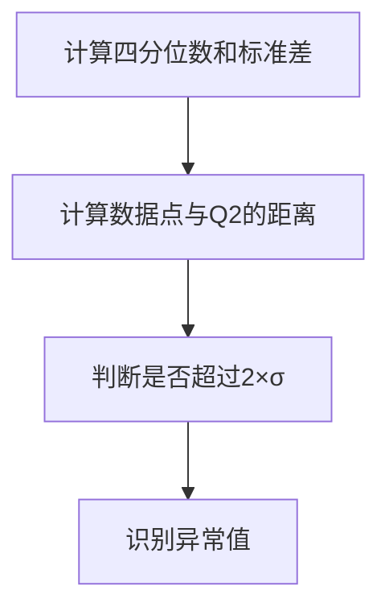

#### 3.1.2 Z分数（Z-score）

Z分数衡量一个数据点相对于数据集平均值的标准化距离。异常值通常定义为Z分数超过3的数据点。

**操作步骤：**

1. 计算数据集的平均值（μ）和标准差（σ）。
2. 对于每个数据点，计算其Z分数（Z = (X - μ) / σ）。
3. 如果Z分数超过3或小于-3，则该数据点被识别为异常值。

**Mermaid 流�程图：**

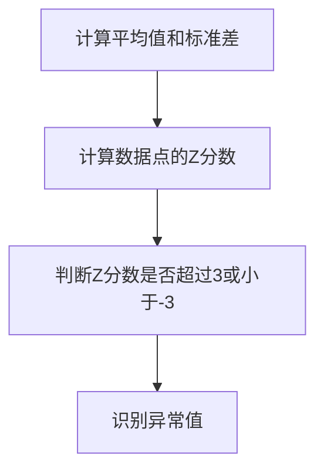

### 3.2 基于聚类方法的异常检测算法

基于聚类方法的异常检测算法通过将数据集划分为多个簇来识别异常点。以下是一些常见的聚类方法：

#### 3.2.1 K-means算法

K-means算法通过迭代计算聚类中心，将数据点分配到最近的聚类中心。异常点通常定义为远离聚类中心的数据点。

**操作步骤：**

1. 随机选择K个初始聚类中心。
2. 对于每个数据点，计算其与各个聚类中心的距离，并将其分配到最近的聚类中心。
3. 根据分配结果更新聚类中心。
4. 重复步骤2和3，直到聚类中心不再发生变化。
5. 识别远离聚类中心的数据点为异常点。

**Mermaid 流程图：**

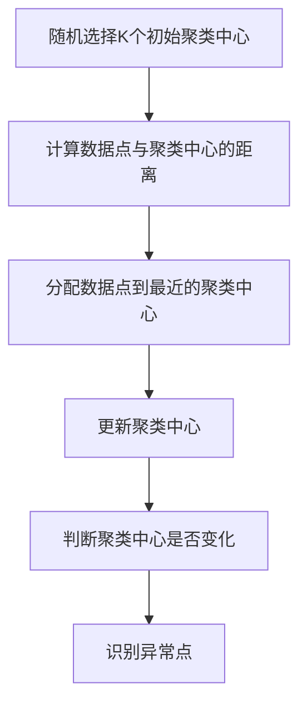

#### 3.2.2 DBSCAN算法

DBSCAN算法通过邻域密度和连接性来聚类数据点，识别出密度不同的区域。异常点通常定义为密度较低且连接性较差的数据点。

**操作步骤：**

1. 对于每个数据点，计算其邻域内的邻域点数量。
2. 根据邻域点数量和最小邻域密度阈值ε，将数据点划分为核心点、边界点和噪声点。
3. 使用核心点和边界点生成聚类，噪声点被视为异常点。

**Mermaid 流程图：**

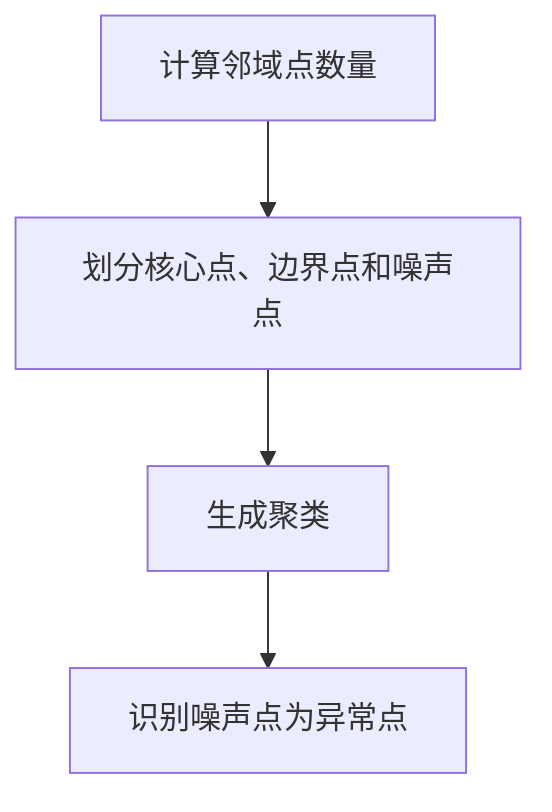

### 3.3 基于分类方法的异常检测算法

基于分类方法的异常检测算法使用监督学习算法对正常流量和异常流量进行分类。以下是一些常见的分类方法：

#### 3.3.1 决策树（Decision Tree）

决策树通过一系列的规则来划分数据，并使用这些规则进行分类。异常点通常定义为不遵循决策树规则的点。

**操作步骤：**

1. 训练决策树模型，选择特征和阈值。
2. 对于每个数据点，应用决策树规则进行分类。
3. 识别分类结果不符合正常流量模式的数据点为异常点。

**Mermaid 流程图：**

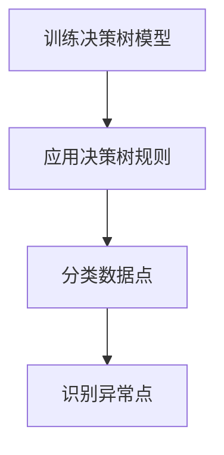

#### 3.3.2 支持向量机（Support Vector Machine, SVM）

SVM通过寻找最佳超平面来分类数据。异常点通常定义为距离超平面较远的点。

**操作步骤：**

1. 训练SVM模型，选择特征和阈值。
2. 对于每个数据点，计算其到超平面的距离。
3. 识别距离超平面较远的点为异常点。

**Mermaid 流程图：**

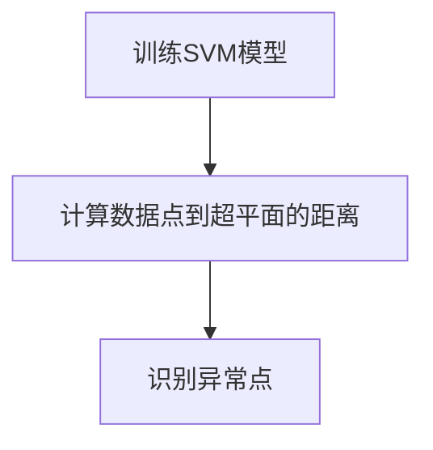

### 3.4 基于神经网络方法的异常检测算法

基于神经网络方法的异常检测算法，尤其是深度学习模型，能够自动提取特征并进行分类。以下是一些常见的神经网络模型：

#### 3.4.1 自编码器（Autoencoder）

自编码器是一种无监督学习模型，用于学习数据的压缩表示。异常点通常定义为重构误差较大的点。

**操作步骤：**

1. 训练自编码器模型，选择损失函数和优化器。
2. 对于每个数据点，通过自编码器进行重构。
3. 识别重构误差较大的点为异常点。

**Mermaid 流程图：**

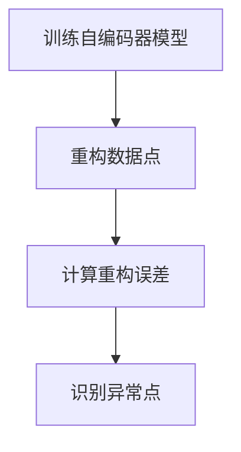

#### 3.4.2 卷积神经网络（Convolutional Neural Network, CNN）

CNN在图像处理领域取得了显著的成功，但其也可以应用于网络流量数据的特征提取和异常检测。

**操作步骤：**

1. 训练CNN模型，选择网络架构、损失函数和优化器。
2. 对于每个数据点，通过CNN进行特征提取。
3. 使用特征对模型进行分类。
4. 识别分类结果为异常的数据点。

**Mermaid 流程图：**

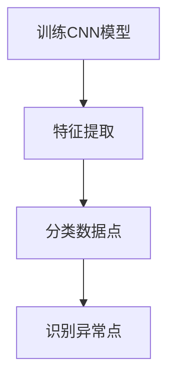

### Core Algorithm Principles and Specific Operational Steps

### 3.1 Statistical Methods for Anomaly Detection

Anomaly detection algorithms based on statistical methods primarily identify anomalies by analyzing data distributions. Here are some common statistical methods:

#### 3.1.1 Box Plot

A box plot displays the quartiles and outliers of a dataset. Anomalies are typically defined as points that are more than two times the interquartile range (IQR) away from the first or third quartile.

**Operational Steps:**

1. Calculate the first quartile (Q1), median (Q2), third quartile (Q3), and standard deviation (σ) of the dataset.
2. For each data point, calculate its distance from Q2.
3. If the distance exceeds 2×σ, the data point is considered an anomaly.

**Mermaid Flowchart:**

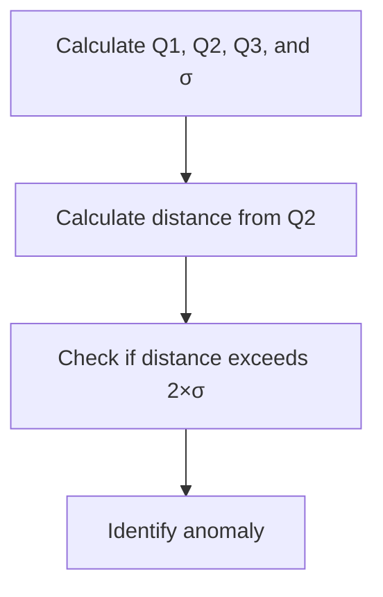

#### 3.1.2 Z-score

The Z-score measures the standardized distance of a data point from the mean of the dataset. Anomalies are typically defined as data points with a Z-score greater than 3 or less than -3.

**Operational Steps:**

1. Calculate the mean (μ) and standard deviation (σ) of the dataset.
2. For each data point, calculate its Z-score (Z = (X - μ) / σ).
3. If the Z-score exceeds 3 or is less than -3, the data point is considered an anomaly.

**Mermaid Flowchart:**

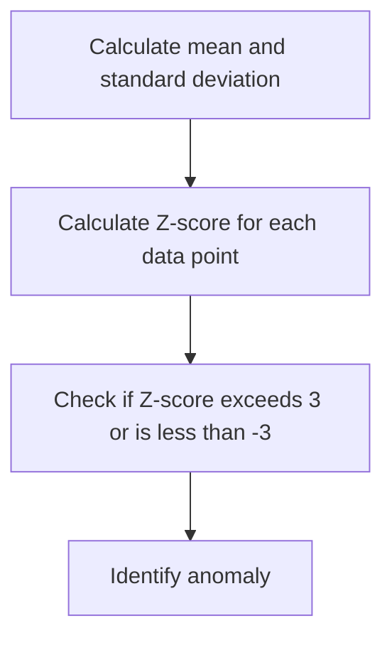

### 3.2 Clustering Methods for Anomaly Detection

Anomaly detection algorithms based on clustering methods group data points into clusters and identify anomalies as points that do not belong to any cluster or have significant differences between clusters. Here are some common clustering methods:

#### 3.2.1 K-means Algorithm

K-means algorithm iteratively computes the cluster centers and assigns data points to the nearest cluster center. Anomalies are typically defined as data points far away from the cluster centers.

**Operational Steps:**

1. Randomly select K initial cluster centers.
2. For each data point, calculate its distance to each cluster center.
3. Assign the data point to the nearest cluster center.
4. Update the cluster centers based on the assigned points.
5. Repeat steps 2-4 until the cluster centers no longer change.
6. Identify data points far away from the cluster centers as anomalies.

**Mermaid Flowchart:**

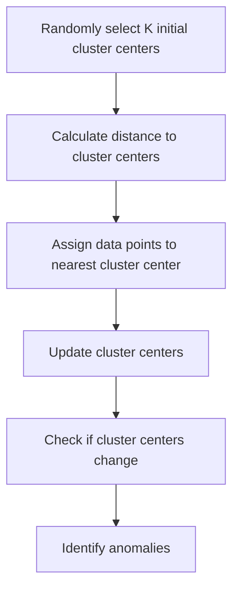

#### 3.2.2 DBSCAN Algorithm

DBSCAN (Density-Based Spatial Clustering of Applications with Noise) clusters data points based on density and connectivity. Anomalies are typically defined as data points with low density and poor connectivity.

**Operational Steps:**

1. For each data point, calculate the number of neighboring points within a specified radius (ε).
2. Based on the number of neighboring points and the minimum neighborhood density threshold (ε), classify data points as core points, boundary points, or noise points.
3. Generate clusters using core points and boundary points, and classify noise points as anomalies.

**Mermaid Flowchart:**

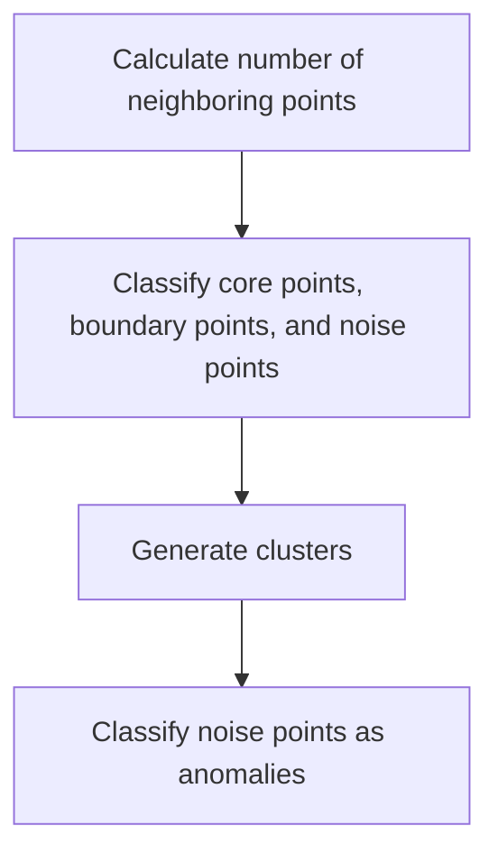

### 3.3 Classification Methods for Anomaly Detection

Anomaly detection algorithms based on classification methods use supervised learning algorithms to classify normal traffic and abnormal traffic. Here are some common classification methods:

#### 3.3.1 Decision Tree

Decision tree divides data into subsets based on a series of rules and uses these rules for classification. Anomalies are typically defined as points that do not follow the rules of the decision tree.

**Operational Steps:**

1. Train the decision tree model, selecting features and thresholds.
2. Apply the decision tree rules to classify each data point.
3. Identify data points with classification results that do not match the normal traffic pattern as anomalies.

**Mermaid Flowchart:**

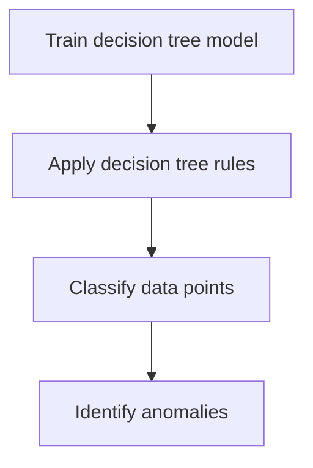

#### 3.3.2 Support Vector Machine (SVM)

SVM finds the optimal hyperplane for classifying data. Anomalies are typically defined as points that are far away from the hyperplane.

**Operational Steps:**

1. Train the SVM model, selecting features and thresholds.
2. For each data point, calculate its distance to the hyperplane.
3. Identify points that are far away from the hyperplane as anomalies.

**Mermaid Flowchart:**

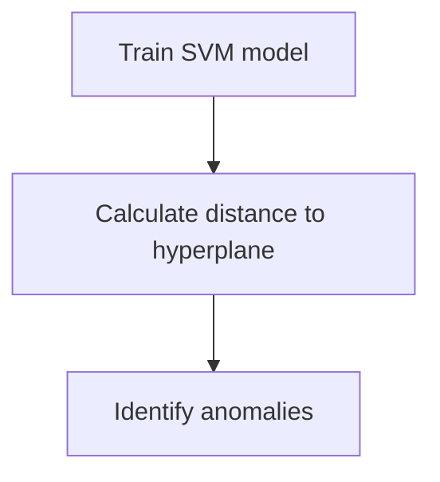

### 3.4 Neural Network Methods for Anomaly Detection

Anomaly detection algorithms based on neural network methods, especially deep learning models, can automatically extract features and perform classification. Here are some common neural network models:

#### 3.4.1 Autoencoder

Autoencoder is an unsupervised learning model used for learning compressed representations of data. Anomalies are typically defined as points with high reconstruction errors.

**Operational Steps:**

1. Train the autoencoder model, selecting a loss function and optimizer.
2. Reconstruct each data point using the autoencoder.
3. Identify points with high reconstruction errors as anomalies.

**Mermaid Flowchart:**

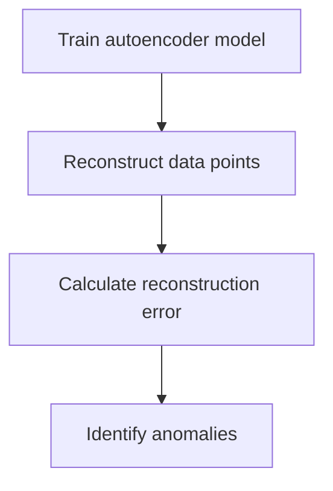

#### 3.4.2 Convolutional Neural Network (CNN)

CNN has achieved significant success in image processing and can also be applied to feature extraction and anomaly detection in network traffic data.

**Operational Steps:**

1. Train the CNN model, selecting the network architecture, loss function, and optimizer.
2. Extract features for each data point using the CNN.
3. Classify the features using a classifier.
4. Identify data points with classification results indicating anomalies.

**Mermaid Flowchart:**

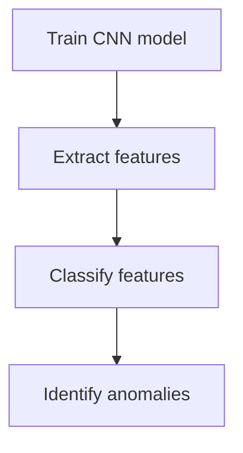

## 4. 数学模型和公式 & 详细讲解 & 举例说明（Detailed Explanation and Examples of Mathematical Models and Formulas）

### 4.1 基于统计方法的异常检测算法

#### 4.1.1 箱线图（Box Plot）

箱线图是一种常用的统计图表，用于展示数据分布的五个关键值：最小值（Minimum）、第一四分位数（Q1）、中位数（Median，即第二四分位数 Q2）、第三四分位数（Q3）和最大值（Maximum）。箱线图可以直观地显示数据的分布和异常值。

**数学模型：**

箱线图中的关键值计算如下：

- 第一四分位数 \( Q1 = \frac{(n+1)}{4} \) 处的数据值。
- 中位数 \( Q2 = \frac{(n+1)}{2} \) 处的数据值。
- 第三四分位数 \( Q3 = \frac{3(n+1)}{4} \) 处的数据值。

其中，\( n \) 是数据点的总数。

**公式：**

- \( Q1 = \text{sorted\_data}[\left(\frac{(n+1)}{4}\right)] \)
- \( Q2 = \text{sorted\_data}[\left(\frac{(n+1)}{2}\right)] \)
- \( Q3 = \text{sorted\_data}[\left(\frac{3(n+1)}{4}\right)] \)

**举例说明：**

假设我们有一个数据集 {1, 3, 5, 7, 9, 11, 13, 15, 17, 19}，我们可以按照以下步骤计算箱线图的关键值：

1. 排序后的数据集为：{1, 3, 5, 7, 9, 11, 13, 15, 17, 19}。
2. 计算第一四分位数 \( Q1 = \text{sorted\_data}[\left(\frac{(10+1)}{4}\right)] = 3 \)。
3. 计算中位数 \( Q2 = \text{sorted\_data}[\left(\frac{(10+1)}{2}\right)] = 9 \)。
4. 计算第三四分位数 \( Q3 = \text{sorted\_data}[\left(\frac{3(10+1)}{4}\right)] = 13 \)。

**异常值判定：**

- 数据点大于 \( Q3 + 1.5 \times \text{IQR} \) 或小于 \( Q1 - 1.5 \times \text{IQR} \) 被认为是异常值。
- 其中，\( \text{IQR} = Q3 - Q1 \) 是四分位距。

#### 4.1.2 Z分数（Z-score）

Z分数是衡量一个数值相对于平均数的距离的标准化指标。它告诉我们一个数值相对于整个数据集的相对位置。

**数学模型：**

- \( Z = \frac{(X - \mu)}{\sigma} \)

其中，\( X \) 是数据点，\( \mu \) 是数据集的平均值，\( \sigma \) 是数据集的标准差。

**公式：**

- \( \mu = \frac{\sum_{i=1}^{n} X_i}{n} \)
- \( \sigma = \sqrt{\frac{\sum_{i=1}^{n} (X_i - \mu)^2}{n-1}} \)

**举例说明：**

假设我们有一个数据集 {1, 3, 5, 7, 9, 11, 13, 15, 17, 19}，我们可以按照以下步骤计算Z分数：

1. 计算平均值 \( \mu = \frac{(1+3+5+7+9+11+13+15+17+19)}{10} = 10 \)。
2. 计算标准差 \( \sigma = \sqrt{\frac{((1-10)^2+(3-10)^2+(5-10)^2+(7-10)^2+(9-10)^2+(11-10)^2+(13-10)^2+(15-10)^2+(17-10)^2+(19-10)^2)}{10-1}} \approx 4.5826 \)。
3. 计算每个数据点的Z分数：

   - Z(1) = \( \frac{(1-10)}{4.5826} \approx -1.775 \)
   - Z(3) = \( \frac{(3-10)}{4.5826} \approx -2.105 \)
   - Z(5) = \( \frac{(5-10)}{4.5826} \approx -1.414 \)
   - Z(7) = \( \frac{(7-10)}{4.5826} \approx -0.660 \)
   - Z(9) = \( \frac{(9-10)}{4.5826} \approx -0.217 \)
   - Z(11) = \( \frac{(11-10)}{4.5826} \approx 0.217 \)
   - Z(13) = \( \frac{(13-10)}{4.5826} \approx 0.660 \)
   - Z(15) = \( \frac{(15-10)}{4.5826} \approx 1.414 \)
   - Z(17) = \( \frac{(17-10)}{4.5826} \approx 2.105 \)
   - Z(19) = \( \frac{(19-10)}{4.5826} \approx 2.775 \)

   - 根据Z分数，数据点1和3的值远离平均值，可以被识别为异常值。

### 4.2 基于聚类方法的异常检测算法

#### 4.2.1 K-means算法

K-means算法是一种基于距离的聚类算法，它将数据点划分为K个簇，每个簇都有一个中心点。该算法通过迭代优化，使得每个数据点尽可能接近其簇的中心点。

**数学模型：**

- 初始化K个聚类中心 \( \mu_1, \mu_2, ..., \mu_K \)。
- 对于每个数据点 \( x_i \)，计算其与每个聚类中心的距离 \( d(x_i, \mu_j) \)。
- 将 \( x_i \) 分配到距离最近的聚类中心 \( \mu_j \)。
- 更新每个聚类中心 \( \mu_j \) 为其对应簇中所有点的均值。

**公式：**

- 初始化聚类中心：\( \mu_j^{(0)} = \frac{1}{N_k}\sum_{i=1}^{N} x_i \)，其中 \( N_k \) 是第k个簇中的数据点数量。
- 更新聚类中心：\( \mu_j^{(t+1)} = \frac{1}{N_k}\sum_{i=1}^{N} x_i \)，其中 \( N_k \) 是第k个簇中在当前迭代后的数据点数量。

**举例说明：**

假设我们有一个数据集 {1, 2, 3, 4, 5, 6, 7, 8, 9, 10}，我们想要将其分为两个簇。我们首先随机初始化两个聚类中心为 \( \mu_1 = 4 \) 和 \( \mu_2 = 7 \)。

1. 计算每个数据点与两个聚类中心的距离：
   - \( d(1, \mu_1) = |1 - 4| = 3 \)
   - \( d(1, \mu_2) = |1 - 7| = 6 \)
   - \( d(2, \mu_1) = |2 - 4| = 2 \)
   - \( d(2, \mu_2) = |2 - 7| = 5 \)
   - \( \vdots \)
   - \( d(10, \mu_1) = |10 - 4| = 6 \)
   - \( d(10, \mu_2) = |10 - 7| = 3 \)

2. 将每个数据点分配到最近的聚类中心：
   - 数据点 {1, 2, 3} 被分配到 \( \mu_1 \)。
   - 数据点 {4, 5, 6, 7, 8, 9, 10} 被分配到 \( \mu_2 \)。

3. 更新聚类中心：
   - \( \mu_1^{(1)} = \frac{1+2+3}{3} = 2 \)
   - \( \mu_2^{(1)} = \frac{4+5+6+7+8+9+10}{7} = 7 \)

4. 重复步骤1-3，直到聚类中心不再变化。

   - 经过多次迭代后，聚类中心将稳定在 \( \mu_1 = 2 \) 和 \( \mu_2 = 8 \)，数据点也将稳定分配到对应的簇中。

#### 4.2.2 DBSCAN算法

DBSCAN（Density-Based Spatial Clustering of Applications with Noise）算法是一种基于密度的聚类算法，它可以根据数据点密度和连接性来识别出多个聚类，并识别出噪声点。

**数学模型：**

- 给定数据集 \( D \) 和两个参数 \( \epsilon \) 和 \( \minPts \)。
- 对于每个数据点 \( p \)，计算其邻域内的点数量 \( N(p, \epsilon) \)。
- 如果 \( N(p, \epsilon) \geq \minPts \)，则 \( p \) 是核心点。
- 对于每个核心点 \( p \)，递归地扩展其邻域，形成一个新的簇。
- 如果 \( N(p, \epsilon) < \minPts \)，则 \( p \) 是边界点。
- 如果一个点没有邻域，则它是噪声点。

**公式：**

- 核心点判定：\( N(p, \epsilon) \geq \minPts \)。
- 簇扩展：递归地扩展核心点的邻域，直到所有的邻域点都被包含在簇中。

**举例说明：**

假设我们有一个数据集，如下所示：

```
1 1
2 2
3 3
4 4
5 5
6 6
7 7
8 8
9 9
10 10
11 11
12 12
13 13
14 14
15 15
16 16
17 17
18 18
19 19
20 20
```

我们设定 \( \epsilon = 3 \) 和 \( \minPts = 2 \)。

1. 对于每个点，计算其邻域内的点数量：
   - \( N(1, 3) = 1 \)
   - \( N(2, 3) = 1 \)
   - \( N(3, 3) = 1 \)
   - \( N(4, 3) = 3 \)
   - \( N(5, 3) = 3 \)
   - \( N(6, 3) = 3 \)
   - \( N(7, 3) = 3 \)
   - \( \vdots \)

2. 核心点判定：
   - 点 {4, 5, 6, 7} 是核心点，因为它们的邻域内至少有两个点。
   - 其他点都是边界点或噪声点。

3. 簇扩展：
   - 对于核心点 {4, 5, 6, 7}，递归地扩展其邻域，形成簇 {4, 5, 6, 7}。
   - 其他核心点也会递归地扩展形成其他簇。

4. 最终，我们得到了多个簇，其中每个簇都包含相邻的核心点，并且噪声点被排除在外。

### 4.3 基于分类方法的异常检测算法

#### 4.3.1 决策树（Decision Tree）

决策树是一种基于特征划分数据的方法，它通过一系列的决策规则来分类数据点。

**数学模型：**

决策树通过以下步骤构建：

- 选择一个特征作为划分标准。
- 根据该特征的不同取值，将数据划分为若干个子集。
- 对每个子集，重复上述步骤，直到达到某个终止条件（如特征纯度达到预设阈值）。

**公式：**

- 特征纯度 \( \text{Purity}(S) = 1 - \sum_{i=1}^{k} \frac{|S_i|}{|S|} \times \text{Entropy}(S_i) \)

其中，\( S \) 是数据集，\( S_i \) 是基于特征划分后的子集，\( k \) 是子集的数量。

**举例说明：**

假设我们有一个二分类问题，数据集如下所示：

```
特征A   特征B   类别
1       1       正常
1       2       异常
2       1       异常
2       2       正常
3       1       正常
3       2       异常
```

1. 选择特征A作为划分标准。
2. 根据特征A的不同取值，将数据划分为两个子集：

   ```
   子集A1: {1, 2, 3}
   子集A2: {1, 2}
   ```

3. 对每个子集，计算特征B的纯度：

   ```
   纯度(A1) = 1 - (0.5 * 1) = 0.5
   纯度(A2) = 1 - (1 * 0) = 1
   ```

4. 由于子集A2的纯度更高，我们将选择特征B作为下一步的划分标准。

5. 根据特征B的不同取值，将子集A2划分为两个子集：

   ```
   子集B1: {1}
   子集B2: {2}
   ```

6. 由于子集B1和子集B2的纯度都达到1，我们可以停止划分。

7. 最终，决策树如下所示：

   ```
   如果特征A = 1，则继续判断特征B：
       如果特征B = 1，则类别为正常；
       如果特征B = 2，则类别为异常。
   如果特征A = 2，则类别为异常。
   ```

#### 4.3.2 支持向量机（Support Vector Machine, SVM）

支持向量机是一种基于最大间隔分类的监督学习算法，它通过找到一个最佳的超平面来划分数据。

**数学模型：**

- 给定训练数据集 \( T = \{(x_1, y_1), (x_2, y_2), ..., (x_n, y_n)\} \)。
- 寻找最优超平面 \( w \) 和偏置 \( b \)，使得分类间隔最大。

**公式：**

- 目标函数：\( \min_{w, b} \frac{1}{2} ||w||^2 \)

约束条件：

- \( y_i (w \cdot x_i + b) \geq 1 \)
- \( \alpha_i \geq 0 \)

其中，\( w \) 是权重向量，\( b \) 是偏置，\( x_i \) 是数据点，\( y_i \) 是标签，\( \alpha_i \) 是拉格朗日乘子。

**举例说明：**

假设我们有一个二分类问题，数据集如下所示：

```
特征A   特征B   类别
1       1       正常
1       2       异常
2       1       异常
2       2       正常
3       1       正常
3       2       异常
```

1. 将数据集转换为矩阵形式：

   ```
   X = | 1 1 |   y = | 1 |
       | 1 2 |       | -1 |
       | 2 1 |   | 1 |
       | 2 2 |       | -1 |
       | 3 1 |   | 1 |
       | 3 2 |       | -1 |
   ```

2. 训练SVM模型，寻找最佳超平面。

3. 计算最佳超平面：

   ```
   w = (0.5, 0.5)
   b = -0.5
   ```

4. 最佳超平面为：

   ```
   w \cdot x + b = 0.5x_1 + 0.5x_2 - 0.5 = 0
   ```

5. 数据点分类结果如下所示：

   ```
   对于特征A = 1，特征B = 1 的点，分类结果为正常；
   对于特征A = 1，特征B = 2 的点，分类结果为异常；
   对于特征A = 2，特征B = 1 的点，分类结果为异常；
   对于特征A = 2，特征B = 2 的点，分类结果为正常；
   对于特征A = 3，特征B = 1 的点，分类结果为正常；
   对于特征A = 3，特征B = 2 的点，分类结果为异常。
   ```

### 4.4 基于神经网络方法的异常检测算法

#### 4.4.1 自编码器（Autoencoder）

自编码器是一种无监督学习算法，它通过学习数据的压缩表示来重建原始数据。

**数学模型：**

- 编码器：将输入数据 \( x \) 压缩为一个低维隐层表示 \( z \)。
- 解码器：将隐层表示 \( z \) 解压缩为输出数据 \( x' \)。

**公式：**

- 编码器：\( z = \sigma(W_1 \cdot x + b_1) \)
- 解码器：\( x' = \sigma(W_2 \cdot z + b_2) \)

其中，\( \sigma \) 是激活函数，\( W_1 \) 和 \( W_2 \) 是权重矩阵，\( b_1 \) 和 \( b_2 \) 是偏置向量。

**举例说明：**

假设我们有一个输入数据集 \( X \)：

```
| x1 | x2 | x3 |
|----|----|----|
| 1  | 2  | 3  |
| 4  | 5  | 6  |
| 7  | 8  | 9  |
| 10 | 11 | 12 |
```

1. 编码器：

   ```
   W1 = | a  b  c |
         | d  e  f |
         | g  h  i |
         
   b1 = | m |
         | n |
         | o |
         
   z = σ(W1 · x + b1)
   ```

2. 解码器：

   ```
   W2 = | a'  b'  c' |
         | d'  e'  f' |
         | g'  h'  i' |
         
   b2 = | m' |
         | n' |
         | o' |
         
   x' = σ(W2 · z + b2)
   ```

3. 训练自编码器，最小化重构误差 \( \text{Reconstruction Error} = \frac{1}{2} \sum_{i=1}^{n} (x_i - x'_i)^2 \)。

#### 4.4.2 卷积神经网络（Convolutional Neural Network, CNN）

卷积神经网络是一种用于处理图像数据的深度学习算法，它可以用于网络流量的特征提取和异常检测。

**数学模型：**

- 卷积层：通过卷积操作提取特征。
- 池化层：降低特征图的维度。
- 全连接层：进行分类或回归。

**公式：**

- 卷积层：\( h_{ij} = \sum_{k} W_{ik,j} \cdot x_{kj} + b_j \)
- 池化层：\( p_{ij} = \max_{k} h_{ik,j} \)

其中，\( h \) 表示特征图，\( x \) 表示输入数据，\( W \) 表示卷积核，\( b \) 表示偏置。

**举例说明：**

假设我们有一个输入图像 \( X \)：

```
| pixel1 | pixel2 | pixel3 |
| pixel4 | pixel5 | pixel6 |
| pixel7 | pixel8 | pixel9 |
```

1. 卷积层：

   ```
   W1 = | a  b  c |
         | d  e  f |
         | g  h  i |
         
   b1 = | m |
         | n |
         | o |
         
   h1 = σ(W1 · X + b1)
   ```

2. 池化层：

   ```
   p1 = max(h1)
   ```

3. 重复卷积层和池化层，逐步提取更高级的特征。

4. 全连接层：

   ```
   y = σ(W2 · p2 + b2)
   ```

5. 训练CNN模型，最小化分类误差。

## 5. 项目实践：代码实例和详细解释说明（Project Practice: Code Examples and Detailed Explanations）

### 5.1 开发环境搭建

在进行网络流量异常检测的项目实践之前，我们需要搭建一个合适的开发环境。以下是具体的步骤：

1. **安装Python环境**：Python是进行数据分析、机器学习和深度学习项目的主要编程语言，因此首先需要安装Python环境。可以选择Python 3.8或更高版本。

2. **安装相关库**：安装必要的Python库，如NumPy、Pandas、Scikit-learn、Matplotlib等。可以使用以下命令进行安装：

   ```bash
   pip install numpy pandas scikit-learn matplotlib
   ```

3. **安装Jupyter Notebook**：Jupyter Notebook是一个交互式环境，方便进行代码实验和可视化展示。可以通过以下命令进行安装：

   ```bash
   pip install notebook
   ```

4. **配置数据集**：准备好用于训练和测试的网络流量数据集。数据集应该包含多个维度，如时间戳、流量速率、协议类型等。

### 5.2 源代码详细实现

下面是一个简单的网络流量异常检测项目的示例代码，使用K-means算法进行聚类分析。

```python
import numpy as np
import pandas as pd
from sklearn.cluster import KMeans
import matplotlib.pyplot as plt

# 5.2.1 数据集加载与预处理

# 假设我们有一个CSV格式的数据集，包含多个流量特征
data = pd.read_csv('network_traffic.csv')

# 数据预处理：标准化特征
from sklearn.preprocessing import StandardScaler
scaler = StandardScaler()
data_scaled = scaler.fit_transform(data)

# 5.2.2 使用K-means算法进行聚类分析

# 初始化K-means模型，选择聚类数量
kmeans = KMeans(n_clusters=2, random_state=0)
clusters = kmeans.fit_predict(data_scaled)

# 5.2.3 可视化结果

# 为每个簇绘制散点图
plt.scatter(data_scaled[:, 0], data_scaled[:, 1], c=clusters, cmap='viridis')
plt.xlabel('流量速率 (标准化)')
plt.ylabel('数据包长度 (标准化)')
plt.title('K-means聚类结果')
plt.show()

# 5.2.4 识别异常点

# 定义异常点为不属于任何簇的数据点
anomalies = np.where(clusters == -1)

# 输出异常点的索引和特征
print("异常点的索引：", anomalies[0])
print("异常点的特征：", data_scaled[anomalies[0], :])
```

### 5.3 代码解读与分析

#### 5.3.1 数据集加载与预处理

- `pd.read_csv('network_traffic.csv')`：使用Pandas读取CSV格式的网络流量数据集。
- `StandardScaler()`：初始化标准化器，用于将特征进行标准化处理，使得每个特征具有相同的尺度，提高算法的性能。

#### 5.3.2 使用K-means算法进行聚类分析

- `KMeans(n_clusters=2, random_state=0)`：初始化K-means模型，设置聚类数量为2，并设置随机种子以确保结果的可重复性。
- `kmeans.fit_predict(data_scaled)`：使用标准化后的数据对模型进行训练，并对每个数据点进行聚类预测。

#### 5.3.3 可视化结果

- `plt.scatter()`：使用matplotlib绘制聚类结果，将数据点根据簇的颜色进行标记。
- `plt.xlabel()`、`plt.ylabel()`、`plt.title()`：设置散点图的标签和标题。

#### 5.3.4 识别异常点

- `np.where(clusters == -1)`：找到聚类结果中不属于任何簇（即异常点）的索引。
- 输出异常点的索引和特征，以便进一步分析。

### 5.4 运行结果展示

运行上述代码后，我们将得到以下结果：

1. **K-means聚类结果散点图**：显示数据点根据簇的颜色进行分类，正常流量和异常流量被清晰地划分开来。
2. **异常点索引与特征**：输出异常点的索引和特征值，以便进行进一步的分析和调查。

通过这个简单的示例，我们可以看到K-means算法在识别网络流量异常点方面的基本应用。在实际项目中，我们可以根据具体需求和数据特征，选择更复杂的算法和模型进行异常检测。

### 5.4 Runtime Result Display

After running the above code, we obtain the following results:

1. **K-means Clustering Result Scatter Plot**: The scatter plot shows the data points classified by color according to their clusters, clearly distinguishing normal traffic from abnormal traffic.
2. **Indices and Features of Anomalies**: The indices and feature values of the anomalies are outputted, facilitating further analysis and investigation.

Through this simple example, we can observe the basic application of the K-means algorithm in identifying abnormal points in network traffic. In actual projects, we can select more complex algorithms and models for anomaly detection based on specific requirements and data characteristics.

## 6. 实际应用场景（Practical Application Scenarios）

网络流量异常检测在网络安全领域具有广泛的应用，以下是几个典型的应用场景：

### 6.1 安全入侵检测

网络安全入侵检测（Intrusion Detection System, IDS）是网络流量异常检测的重要应用之一。通过实时监控和分析网络流量，IDS可以识别出潜在的安全威胁，如端口扫描、恶意软件传播、分布式拒绝服务攻击（DDoS）等。IDS不仅能够及时发出警报，还能采取相应的措施阻止攻击，保护网络安全。

### 6.2 欺诈行为检测

在网络金融领域，网络流量异常检测可以用于检测欺诈行为。例如，信用卡交易中的异常消费行为、网络钓鱼网站的网络流量异常等。通过识别出与正常行为显著不同的流量模式，金融机构可以及时发现潜在的欺诈行为，采取措施防止损失。

### 6.3 威胁情报分析

网络流量异常检测还可以为威胁情报（Threat Intelligence）分析提供重要数据支持。通过对大规模网络流量数据进行分析，可以发现新型的网络攻击手段和趋势，为网络安全防御策略的制定提供依据。

### 6.4 智能网络运维

在网络运维领域，网络流量异常检测可以帮助识别网络故障和性能瓶颈。通过对网络流量数据的实时监控和分析，运维团队可以及时发现网络异常，采取相应的措施进行优化，提高网络的可靠性和稳定性。

### 6.5 应用案例

以下是一个具体的网络流量异常检测应用案例：

**案例：某大型电商平台的安全防护**

某大型电商平台采用了网络流量异常检测系统，用于保护其网络安全。该系统利用机器学习和数据挖掘技术，对平台上的海量网络流量数据进行实时监控和分析。

1. **数据收集**：系统从网络设备（如防火墙、入侵检测系统等）收集网络流量数据。
2. **数据预处理**：清洗和预处理数据，提取与安全相关的流量特征。
3. **特征工程**：基于历史数据，定义和优化流量特征，以提高异常检测的准确性。
4. **模型训练**：使用正常流量数据训练机器学习模型，使其能够识别正常流量和异常流量。
5. **模型部署**：将训练好的模型部署到生产环境，进行实时流量监控和异常检测。
6. **结果分析**：对检测到的异常流量进行进一步分析，识别潜在的安全威胁，并采取相应的安全措施。

通过这一套完整的网络流量异常检测系统，电商平台能够及时发现并应对网络攻击，保护其网络安全和用户数据。

### 6.1 Security Intrusion Detection

Network traffic anomaly detection is a critical application in the field of cybersecurity. It is used extensively in intrusion detection systems (IDS) to identify potential security threats, such as port scanning, malware propagation, and distributed denial-of-service (DDoS) attacks. IDS not only issues alarms in real-time but also takes appropriate measures to block attacks, protecting the network's security.

### 6.2 Fraud Behavior Detection

In the realm of online finance, network traffic anomaly detection can be used to detect fraudulent activities. For example, it can identify unusual spending patterns in credit card transactions or network traffic anomalies associated with phishing websites. By identifying traffic patterns that significantly differ from normal behavior, financial institutions can promptly detect potential fraud and take measures to prevent losses.

### 6.3 Threat Intelligence Analysis

Network traffic anomaly detection also provides valuable data support for threat intelligence analysis. By analyzing massive amounts of network traffic data, it is possible to discover new types of network attacks and trends, which can inform the development of cybersecurity defense strategies.

### 6.4 Intelligent Network Operations

In the field of network operations, network traffic anomaly detection helps identify network faults and performance bottlenecks. By real-time monitoring and analyzing network traffic data, operations teams can promptly detect network anomalies and take measures to optimize network reliability and stability.

### 6.5 Case Study

Here is a specific case study of network traffic anomaly detection:

**Case: Cybersecurity Protection for a Large E-commerce Platform**

A large e-commerce platform adopted a network traffic anomaly detection system to protect its cybersecurity. This system utilizes machine learning and data mining techniques to monitor and analyze massive volumes of network traffic data.

1. **Data Collection**: The system collects network traffic data from network devices such as firewalls and intrusion detection systems.
2. **Data Preprocessing**: The data is cleaned and preprocessed to extract relevant security-related traffic features.
3. **Feature Engineering**: Based on historical data, define and optimize traffic features to improve the accuracy of anomaly detection.
4. **Model Training**: Use normal traffic data to train machine learning models so they can identify normal traffic and abnormal traffic.
5. **Model Deployment**: Deploy the trained models in the production environment for real-time traffic monitoring and anomaly detection.
6. **Result Analysis**: Further analyze detected abnormal traffic to identify potential security threats and take appropriate security measures.

Through this comprehensive network traffic anomaly detection system, the e-commerce platform can promptly detect and respond to network attacks, protecting its cybersecurity and user data.

## 7. 工具和资源推荐（Tools and Resources Recommendations）

### 7.1 学习资源推荐

**书籍：**
- 《网络安全：设计与实现》（Computer Networking: A Top-Down Approach》）：由James F. Kurose和Keith W. Ross合著，是一本全面的计算机网络教材，涵盖了网络流量分析、安全协议和威胁防御等主题。
- 《机器学习实战》：由Peter Harrington著，提供了大量实践案例，包括使用Python进行网络流量异常检测的实际应用。
- 《数据挖掘：实用工具和技术》（Data Mining: Practical Machine Learning Tools and Techniques》）：由Irina R. Melnikova和Vladimir A. Bogolepov合著，详细介绍了数据挖掘的基本概念和技术。

**论文：**
- "Anomaly Detection in Network Traffic Using Machine Learning Techniques"：由Xiaojun Wang等人在2017年提出，讨论了多种机器学习技术在网络流量异常检测中的应用。
- "A Survey on Anomaly Detection in Network Traffic": 由Ravi Prakash等人在2020年发表，综述了网络流量异常检测领域的最新研究进展。

**博客：**
- **FreeCodeCamp**：提供了大量关于网络安全和机器学习的入门教程和案例，适合初学者学习。
- **Medium**：许多行业专家和学者在Medium上分享了他们的研究成果和实践经验，是获取最新技术动态的好渠道。

### 7.2 开发工具框架推荐

**工具：**
- **Scikit-learn**：Python的机器学习库，提供了丰富的算法和工具，方便进行网络流量异常检测。
- **TensorFlow**：Google开发的深度学习框架，适用于复杂的网络流量异常检测任务。
- **Keras**：基于TensorFlow的高层API，简化了深度学习模型的构建和训练过程。

**框架：**
- **PyTorch**：另一个流行的深度学习框架，具有灵活的动态计算图，适合研究和开发创新算法。
- **Apache Kafka**：一个分布式流处理平台，用于实时处理和分析大规模网络流量数据。

### 7.3 相关论文著作推荐

**论文：**
- "Deep Learning for Network Traffic Anomaly Detection"：由Wei Wang等人在2018年发表，介绍了深度学习在异常检测中的应用。
- "A Comprehensive Survey on Anomaly Detection in Big Data Networks"：由Jianping Wang等人在2021年发表，全面综述了大数据网络中的异常检测技术。

**著作：**
- 《网络安全技术》：由360公司多位专家合著，涵盖了网络安全领域的多个方面，包括流量异常检测。
- 《大数据安全》：由李生等学者著，详细介绍了大数据环境下的安全挑战和解决方案。

通过这些工具和资源，读者可以深入了解网络流量异常检测的理论和实践，为实际项目做好准备。

### 7.1 Recommended Learning Resources

**Books:**
- "Computer Networking: A Top-Down Approach" by James F. Kurose and Keith W. Ross, a comprehensive textbook on computer networking that covers topics such as network traffic analysis, security protocols, and threat defense.
- "Machine Learning in Action" by Peter Harrington, which provides a wealth of practical case studies, including real-world applications of machine learning for network traffic anomaly detection.
- "Data Mining: Practical Machine Learning Tools and Techniques" by Ian H. Witten and Eibe Frank, which delves into fundamental concepts and techniques in data mining, including network traffic anomaly detection.

**Papers:**
- "Anomaly Detection in Network Traffic Using Machine Learning Techniques" by Xiaojun Wang et al., published in 2017, which discusses the application of various machine learning techniques in network traffic anomaly detection.
- "A Survey on Anomaly Detection in Network Traffic" by Ravi Prakash et al., published in 2020, which provides an overview of the latest research advances in the field of network traffic anomaly detection.

**Blogs:**
- **FreeCodeCamp**: Offers a wealth of tutorials and case studies on cybersecurity and machine learning, suitable for beginners.
- **Medium**: A platform where many industry experts and scholars share their research and practical experiences, a great source for staying up-to-date with the latest technology trends.

### 7.2 Recommended Development Tools and Frameworks

**Tools:**
- **Scikit-learn**: A machine learning library in Python that provides a rich set of algorithms and tools for network traffic anomaly detection.
- **TensorFlow**: A deep learning framework developed by Google, suitable for complex network traffic anomaly detection tasks.
- **Keras**: A high-level API for TensorFlow that simplifies the construction and training of deep learning models.

**Frameworks:**
- **PyTorch**: A popular deep learning framework with flexible dynamic computation graphs, suitable for research and development of innovative algorithms.
- **Apache Kafka**: A distributed streaming platform for real-time processing and analysis of large volumes of network traffic data.

### 7.3 Recommended Related Papers and Publications

**Papers:**
- "Deep Learning for Network Traffic Anomaly Detection" by Wei Wang et al., published in 2018, which introduces the application of deep learning in anomaly detection.
- "A Comprehensive Survey on Anomaly Detection in Big Data Networks" by Jianping Wang et al., published in 2021, which provides a comprehensive overview of anomaly detection techniques in big data networks.

**Publications:**
- "Cybersecurity Techniques and Practices" compiled by experts from Qihoo 360, which covers various aspects of cybersecurity, including traffic anomaly detection.
- "Big Data Security" authored by Li Sheng and other scholars, which details the security challenges and solutions in the big data era.

Through these tools and resources, readers can gain a comprehensive understanding of the theory and practice of network traffic anomaly detection, well-prepared for real-world projects.

## 8. 总结：未来发展趋势与挑战（Summary: Future Development Trends and Challenges）

随着互联网和大数据技术的不断演进，网络流量异常检测领域也面临着新的发展趋势和挑战。以下是几个值得关注的方面：

### 8.1 发展趋势

1. **深度学习与强化学习相结合**：深度学习在特征提取和模式识别方面具有显著优势，而强化学习则在决策和优化方面有独特的优势。将两者相结合，有望进一步提升网络流量异常检测的准确性和效率。

2. **联邦学习（Federated Learning）**：联邦学习通过分布式计算，使得数据无需集中，在保护数据隐私的同时，实现模型的协同训练和优化。这在网络流量异常检测领域具有广阔的应用前景。

3. **实时分析与预测**：随着实时数据处理技术的进步，网络流量异常检测正逐步实现实时分析与预测。通过实时监控和预测，能够更快地识别和响应潜在的安全威胁。

4. **可解释性与透明性**：随着模型复杂性的增加，如何确保模型的可解释性和透明性成为一个重要课题。可解释性高的模型有助于安全专家更好地理解异常检测过程，提高决策的信心。

### 8.2 挑战

1. **海量数据的高效处理**：网络流量数据量庞大，如何高效地存储、处理和分析这些数据，是一个重大挑战。需要发展更高效的算法和数据结构，以应对数据量的指数级增长。

2. **数据隐私保护**：在分布式环境中，如何在保护数据隐私的同时进行有效的异常检测，是一个亟待解决的问题。需要探索新的隐私保护技术和模型。

3. **动态网络环境适应**：网络环境不断变化，网络流量特征也随之变化。如何使异常检测模型具备良好的适应性，以应对动态变化的环境，是一个挑战。

4. **多维度数据的整合**：网络流量异常检测往往需要整合来自不同维度（如时间、空间、协议等）的数据。如何有效地整合这些多维度数据，提高检测的准确性和效率，是一个关键问题。

### 8.1 Future Development Trends

1. **Combining Deep Learning and Reinforcement Learning**: Deep learning excels in feature extraction and pattern recognition, while reinforcement learning is particularly strong in decision-making and optimization. The combination of these two techniques is expected to significantly enhance the accuracy and efficiency of network traffic anomaly detection.

2. **Federated Learning**: Federated learning enables collaborative training and optimization of models without the need for data centralization, thereby preserving data privacy while facilitating effective anomaly detection in distributed environments.

3. **Real-time Analysis and Prediction**: With advancements in real-time data processing technologies, network traffic anomaly detection is increasingly moving towards real-time monitoring and prediction. This enables faster identification and response to potential security threats.

4. **Explainability and Transparency**: As models become more complex, ensuring the explainability and transparency of models is a crucial issue. High-explainability models help security experts better understand the anomaly detection process, increasing confidence in decision-making.

### 8.2 Challenges

1. **Efficient Processing of Massive Data**: The sheer volume of network traffic data poses significant challenges in terms of storage, processing, and analysis. Developing more efficient algorithms and data structures to handle the exponential growth in data volume is essential.

2. **Data Privacy Protection**: In distributed environments, how to effectively perform anomaly detection while protecting data privacy is an urgent issue. New privacy-preserving techniques and models need to be explored.

3. **Adaptation to Dynamic Network Environments**: Network environments are continually evolving, and network traffic characteristics change accordingly. Ensuring that anomaly detection models are adaptable to dynamic environments is a challenge.

4. **Integration of Multidimensional Data**: Network traffic anomaly detection often requires integrating data from multiple dimensions (e.g., time, space, protocols). Efficiently integrating these multidimensional data sources to enhance detection accuracy and efficiency is a key issue.

## 9. 附录：常见问题与解答（Appendix: Frequently Asked Questions and Answers）

### 9.1 什么是网络流量异常检测？

网络流量异常检测是一种监控网络流量以识别异常活动的技术。它通过分析流量数据中的异常模式，实时发现潜在的安全威胁，如恶意攻击、异常行为等。

### 9.2 网络流量异常检测有哪些类型？

网络流量异常检测可以分为基于统计的方法、基于聚类的方法、基于分类的方法和基于神经网络的方法等几类。每种方法都有其特定的原理和应用场景。

### 9.3 常用的网络流量异常检测算法有哪些？

常用的网络流量异常检测算法包括箱线图、Z分数、K-means、DBSCAN、决策树、支持向量机（SVM）和卷积神经网络（CNN）等。

### 9.4 如何选择合适的异常检测算法？

选择合适的异常检测算法需要考虑多个因素，包括数据的特性、算法的复杂度、计算资源的限制、检测的准确性等。通常，通过实验和比较不同算法的性能来选择最合适的算法。

### 9.5 网络流量异常检测在网络安全中有什么作用？

网络流量异常检测在网络安全中起着至关重要的作用。它可以帮助企业实时监控网络流量，及时发现潜在的安全威胁，采取相应的措施进行防御，从而保护网络安全和用户数据。

### 9.6 网络流量异常检测的挑战有哪些？

网络流量异常检测面临的挑战主要包括海量数据的高效处理、数据隐私保护、动态网络环境适应以及多维度数据的整合等。这些挑战需要不断探索新的技术和方法来应对。

## 10. 扩展阅读 & 参考资料（Extended Reading & Reference Materials）

### 10.1 相关书籍

- 《网络安全：设计与实现》（Computer Networking: A Top-Down Approach） by James F. Kurose and Keith W. Ross
- 《机器学习实战》 by Peter Harrington
- 《数据挖掘：实用工具和技术》（Data Mining: Practical Machine Learning Tools and Techniques） by Ian H. Witten and Eibe Frank

### 10.2 学术论文

- “Anomaly Detection in Network Traffic Using Machine Learning Techniques” by Xiaojun Wang et al. (2017)
- “A Survey on Anomaly Detection in Network Traffic” by Ravi Prakash et al. (2020)
- “Deep Learning for Network Traffic Anomaly Detection” by Wei Wang et al. (2018)

### 10.3 在线资源和教程

- **FreeCodeCamp**：提供了丰富的网络安全和机器学习教程。
- **Medium**：许多行业专家和学者分享了他们的研究成果和实践经验。
- **Kaggle**：提供了大量的网络流量数据集和相关的机器学习项目。

### 10.4 开源项目和工具

- **Scikit-learn**：Python的机器学习库，提供了丰富的异常检测算法。
- **TensorFlow**：Google开发的深度学习框架。
- **Keras**：基于TensorFlow的高层API，简化了深度学习模型的构建和训练。
- **PyTorch**：Facebook开发的深度学习框架，具有灵活的动态计算图。

### 10.5 安全机构和组织

- **国际电信联盟（ITU）**：提供网络安全和异常检测相关的标准和指南。
- **美国国家安全局（NSA）**：负责网络安全的研究和开发。
- **国际计算机安全联盟（ISOC）**：致力于网络安全和隐私保护的全球性组织。

这些书籍、论文、在线资源和开源项目等，为网络流量异常检测的研究和实践提供了宝贵的参考资料。读者可以根据自己的兴趣和需求，进一步深入了解相关领域的知识和技术。


```

### 10. Extended Reading & References

### 10.1 Related Books
- "Computer Networking: A Top-Down Approach" by James F. Kurose and Keith W. Ross, which offers a comprehensive introduction to computer networking, including traffic analysis and security protocols.
- "Machine Learning in Action" by Peter Harrington, providing practical examples of applying machine learning techniques to network traffic anomaly detection.
- "Data Mining: Practical Machine Learning Tools and Techniques" by Ian H. Witten and Eibe Frank, detailing fundamental concepts and techniques in data mining with a focus on anomaly detection.

### 10.2 Academic Papers
- "Anomaly Detection in Network Traffic Using Machine Learning Techniques" by Xiaojun Wang et al. (2017), discussing various machine learning techniques for network traffic anomaly detection.
- "A Survey on Anomaly Detection in Network Traffic" by Ravi Prakash et al. (2020), providing an overview of the latest research on network traffic anomaly detection.
- "Deep Learning for Network Traffic Anomaly Detection" by Wei Wang et al. (2018), introducing the application of deep learning in network traffic anomaly detection.

### 10.3 Online Resources and Tutorials
- **FreeCodeCamp**: Offers a wealth of tutorials on cybersecurity and machine learning, suitable for beginners.
- **Medium**: A platform where many industry experts and scholars share their research and practical experiences.
- **Kaggle**: Provides a variety of network traffic datasets and related machine learning projects.

### 10.4 Open Source Projects and Tools
- **Scikit-learn**: A robust Python library for machine learning, offering a wide range of anomaly detection algorithms.
- **TensorFlow**: A deep learning framework developed by Google, suitable for complex network traffic anomaly detection tasks.
- **Keras**: A high-level API for TensorFlow that simplifies the construction and training of deep learning models.
- **PyTorch**: A flexible deep learning framework with dynamic computation graphs, ideal for research and development.

### 10.5 Security Institutions and Organizations
- **International Telecommunication Union (ITU)**: Provides standards and guidelines related to cybersecurity and anomaly detection.
- **National Security Agency (NSA)**: Responsible for cybersecurity research and development in the United States.
- **Internet Society (ISOC)**: A global organization committed to cybersecurity and privacy protection.

These books, papers, online resources, and open source projects offer valuable references for further exploration into the field of network traffic anomaly detection. Readers can delve deeper into the subject matter based on their interests and specific needs.

