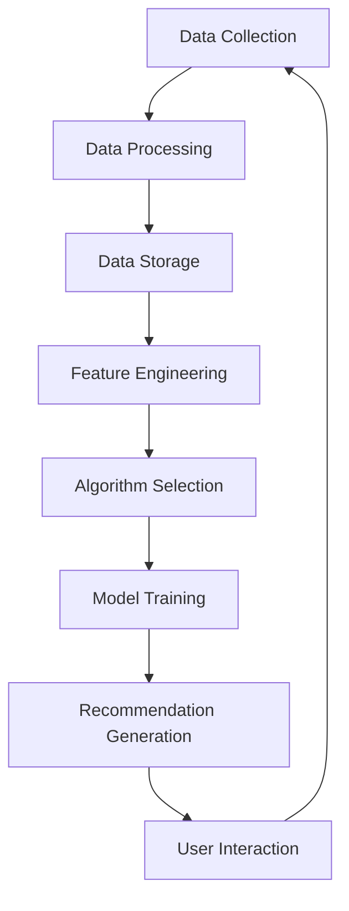

                 

### 文章标题

《实时推荐技术在电商领域的应用：案例分析与展望》

关键词：实时推荐；电商；用户行为分析；算法优化

摘要：本文将探讨实时推荐技术如何在电商领域发挥关键作用。通过分析具体案例，我们将深入了解实时推荐技术的核心原理、实施步骤及未来发展趋势。本文旨在为电商从业者提供有价值的参考，以推动电商平台的个性化服务和技术创新。

### Background Introduction

In today's rapidly evolving e-commerce landscape, the ability to deliver personalized and timely recommendations to users has become a cornerstone of success. Real-time recommendation technology plays a crucial role in enhancing user experience, driving engagement, and ultimately, increasing revenue. This article aims to delve into the applications of real-time recommendation techniques in the e-commerce sector, providing a comprehensive analysis of core principles, implementation steps, and future trends. By examining specific case studies, we will explore how real-time recommendation systems are revolutionizing the way online businesses operate, offering valuable insights and practical guidance for e-commerce professionals.

#### Introduction to Real-Time Recommendation Technology

Real-time recommendation technology refers to systems that provide personalized recommendations to users based on their current context and preferences in real-time. Unlike traditional recommendation methods that rely on historical data and precomputed models, real-time recommendations leverage up-to-date information to deliver highly relevant and timely suggestions. This enables e-commerce platforms to adapt quickly to changing user behavior, resulting in improved user satisfaction and increased conversion rates.

In the e-commerce context, real-time recommendations can take various forms, including product suggestions, personalized marketing messages, and targeted promotions. These recommendations are typically generated using advanced algorithms that analyze user data, such as browsing history, purchase behavior, and demographic information. By leveraging real-time data processing and machine learning techniques, e-commerce platforms can continuously refine their recommendation models to provide increasingly accurate and personalized suggestions.

#### Importance of Real-Time Recommendations in E-commerce

Real-time recommendations are a vital component of e-commerce success for several reasons. Firstly, they enable businesses to offer personalized shopping experiences that resonate with individual users. By understanding users' preferences and behaviors, e-commerce platforms can deliver product suggestions and marketing messages that are highly relevant and engaging. This not only enhances user satisfaction but also increases the likelihood of conversions and repeat purchases.

Secondly, real-time recommendations can significantly improve customer retention and loyalty. By consistently providing users with personalized and valuable recommendations, e-commerce platforms can create a sense of trust and loyalty among their customer base. This can lead to higher customer lifetime value and reduced churn rates.

Thirdly, real-time recommendations can drive revenue growth by increasing average order value and encouraging cross-selling and upselling opportunities. By offering users relevant products that complement their current selections, e-commerce platforms can incentivize them to spend more and explore new products.

#### Applications of Real-Time Recommendation Technology in E-commerce

Real-time recommendation technology has a wide range of applications in the e-commerce sector. Some of the key areas where it is commonly utilized include:

1. **Product Recommendations:** By analyzing users' browsing and purchase history, real-time recommendation systems can suggest products that are likely to interest them. This not only helps users discover new products but also increases the likelihood of them making a purchase.

2. **Personalized Marketing Messages:** Real-time recommendations can be used to deliver personalized marketing messages to users, such as abandoned cart reminders, promotional offers, and special discounts. These messages are tailored to the individual user's preferences and behavior, increasing their effectiveness and engagement.

3. **Targeted Promotions:** E-commerce platforms can use real-time recommendations to identify and target users who are most likely to respond to specific promotions. By offering personalized promotions, platforms can increase the conversion rate and drive more revenue from their marketing campaigns.

4. **Search Engine Optimization (SEO):** Real-time recommendations can improve the search experience on e-commerce platforms by offering users relevant search results based on their current context and preferences. This can enhance user satisfaction and reduce bounce rates.

5. **Customer Support:** Real-time recommendation systems can assist customer support teams by providing users with relevant information and suggestions during live chat sessions. This can help resolve issues more efficiently and improve customer satisfaction.

#### Challenges and Opportunities in Real-Time Recommendation Technology

While real-time recommendation technology offers numerous benefits, it also presents several challenges and opportunities for e-commerce platforms. Some of the key challenges include:

1. **Data Privacy and Security:** Collecting and analyzing user data in real-time raises concerns about data privacy and security. E-commerce platforms must ensure that they comply with relevant data protection regulations and implement robust security measures to protect user information.

2. **Scalability and Performance:** As user data volumes and complexity increase, e-commerce platforms must ensure that their real-time recommendation systems can scale and perform efficiently. This requires the use of advanced data processing and machine learning techniques, as well as optimized infrastructure.

3. **Algorithm Bias and Fairness:** Real-time recommendation algorithms may unintentionally introduce biases and unfairness in their recommendations. E-commerce platforms must continuously monitor and address potential biases to ensure that their recommendations are fair and unbiased.

4. **Continuous Improvement:** Real-time recommendation systems require ongoing monitoring and refinement to adapt to changing user behaviors and preferences. E-commerce platforms must invest in continuous improvement efforts to maintain the effectiveness of their recommendation systems.

Despite these challenges, the opportunities presented by real-time recommendation technology are significant. By leveraging real-time data and advanced algorithms, e-commerce platforms can deliver personalized and engaging experiences that drive user satisfaction, loyalty, and revenue growth. As the e-commerce landscape continues to evolve, real-time recommendation technology is poised to play an increasingly important role in shaping the future of online retail.

---

## Core Concepts and Connections

### 2.1 Definition of Real-Time Recommendation Technology

Real-time recommendation technology refers to the application of algorithms and machine learning techniques to deliver personalized recommendations to users based on their current context and preferences. Unlike traditional batch-based approaches that rely on historical data, real-time recommendations leverage up-to-date information to provide timely and relevant suggestions. This allows e-commerce platforms to adapt rapidly to changing user behavior and preferences, enhancing the overall user experience and driving engagement.

### 2.2 Key Components of Real-Time Recommendation Systems

Real-time recommendation systems consist of several key components that work together to deliver personalized recommendations:

1. **Data Collection and Processing:** Real-time recommendation systems rely on continuous data collection and processing to gather relevant information about user behavior and preferences. This includes data from various sources such as user interactions, browsing history, purchase transactions, and demographic information.

2. **Data Storage and Management:** Efficient data storage and management are crucial for real-time recommendation systems. Data needs to be stored in a format that allows for fast retrieval and analysis, such as distributed databases and in-memory data stores.

3. **Feature Engineering:** Feature engineering involves transforming raw data into a set of features that can be used by the recommendation algorithms. This step is critical for capturing relevant information and improving the performance of the recommendation system.

4. **Algorithm Selection and Optimization:** Choosing the right algorithm and optimizing its parameters is crucial for the success of a real-time recommendation system. Various algorithms, such as collaborative filtering, content-based filtering, and hybrid methods, can be used depending on the specific requirements and data characteristics.

5. **Model Training and Evaluation:** Real-time recommendation systems require continuous training and evaluation to adapt to changing user behavior and preferences. This involves updating the recommendation models periodically and evaluating their performance using metrics such as precision, recall, and user satisfaction.

### 2.3 Mermaid Flowchart of Real-Time Recommendation System Architecture

Below is a Mermaid flowchart illustrating the key components and interactions within a real-time recommendation system:



### 2.4 Connections to Related Concepts

Real-time recommendation technology is closely related to several other key concepts in the field of artificial intelligence and machine learning:

1. **Machine Learning:** Real-time recommendation systems rely on machine learning algorithms to analyze user data and generate personalized recommendations. Common machine learning techniques used in recommendation systems include collaborative filtering, content-based filtering, and hybrid methods.

2. **Data Mining:** Data mining techniques are used to extract valuable insights and patterns from large datasets. Real-time recommendation systems leverage data mining to identify user preferences and trends, enabling the generation of accurate and relevant recommendations.

3. **Natural Language Processing (NLP):** NLP techniques are used to process and understand human language. In the context of real-time recommendation systems, NLP can be used to analyze user-generated content, such as product reviews and social media comments, to enhance the personalization of recommendations.

4. **User Behavior Analysis:** Understanding user behavior is essential for delivering accurate and relevant recommendations. Real-time recommendation systems analyze user interactions, browsing history, and purchase behavior to gain insights into user preferences and predict future actions.

5. **Real-Time Data Processing:** Real-time recommendation systems require efficient data processing techniques to handle large volumes of data and provide timely recommendations. Technologies such as stream processing and distributed computing are commonly used to process and analyze real-time data.

In conclusion, real-time recommendation technology is a complex and interdisciplinary field that encompasses various concepts and techniques from machine learning, data mining, NLP, and real-time data processing. By leveraging these technologies, e-commerce platforms can deliver personalized and engaging user experiences that drive customer satisfaction and business growth.

---

## Core Algorithm Principles and Specific Operational Steps

### 3.1 Overview of Real-Time Recommendation Algorithms

Real-time recommendation algorithms are the core components of real-time recommendation systems. These algorithms analyze user data and generate personalized recommendations in real-time. The effectiveness of these algorithms determines the accuracy and relevance of the recommendations provided to users. This section will discuss some of the most commonly used real-time recommendation algorithms, their principles, and their specific operational steps.

#### 3.2 Collaborative Filtering

Collaborative filtering is one of the most popular approaches for real-time recommendation. It relies on the assumption that if users agree on their preferences for some items, they are likely to agree on their preferences for other items as well. Collaborative filtering can be broadly categorized into two types: user-based and item-based.

1. **User-Based Collaborative Filtering**

User-based collaborative filtering finds users who are similar to the target user and recommends items that these similar users have liked. The similarity between users is typically measured using metrics such as cosine similarity, Jaccard similarity, or Euclidean distance.

   **Operational Steps:**

   a. Calculate similarity scores between the target user and all other users in the dataset.
   b. Rank these users based on their similarity scores.
   c. Identify the top-N similar users.
   d. Recommend items that these top-N users have liked but the target user has not yet interacted with.

2. **Item-Based Collaborative Filtering**

Item-based collaborative filtering finds items that are similar to the items the target user has interacted with and recommends items that other users have liked but the target user has not yet interacted with. The similarity between items is typically measured using metrics such as cosine similarity or Euclidean distance.

   **Operational Steps:**

   a. Calculate similarity scores between the items the target user has interacted with and all other items in the dataset.
   b. Rank these items based on their similarity scores.
   c. Identify the top-N similar items.
   d. Recommend items that these top-N items have been liked by other users but the target user has not yet interacted with.

#### 3.3 Content-Based Filtering

Content-based filtering recommends items based on the content or attributes of the items and the preferences of the user. This approach analyzes the features of items and user preferences to find similar items that the user might be interested in.

**Operational Steps:**

a. Extract features from the items in the dataset.
b. Create a user profile based on the user's historical interactions and preferences.
c. Calculate the similarity between the user profile and the features of each item in the dataset.
d. Rank these items based on their similarity scores.
e. Recommend items that have a high similarity score to the user profile but the user has not yet interacted with.

#### 3.4 Hybrid Methods

Hybrid methods combine collaborative filtering and content-based filtering to leverage the strengths of both approaches. These methods typically use a weighted combination of collaborative and content-based recommendations to provide more accurate and relevant recommendations.

**Operational Steps:**

a. Apply collaborative filtering to generate a set of recommendations.
b. Apply content-based filtering to generate another set of recommendations.
c. Combine these two sets of recommendations using a weighted scheme to generate the final set of recommendations.

#### 3.5 Real-Time Algorithm Optimization Techniques

To ensure the efficiency and accuracy of real-time recommendation algorithms, several optimization techniques can be employed:

1. **Data Partitioning and Parallel Processing:** Dividing the data into smaller subsets and processing them in parallel can significantly speed up the recommendation generation process.

2. **Caching and Pre-computation:** Pre-computing and caching certain intermediate results, such as similarity scores or feature vectors, can reduce the computational overhead during real-time recommendation generation.

3. **Incremental Learning:** Incremental learning techniques allow the recommendation models to be updated incrementally as new user data becomes available, without the need for retraining the entire model from scratch.

4. **Online Learning:** Online learning algorithms continuously update the recommendation models as new data arrives, enabling the system to adapt quickly to changing user preferences.

5. **Latency Optimization:** Techniques such as data compression, efficient data storage, and optimized network protocols can be used to minimize the latency in generating real-time recommendations.

In conclusion, real-time recommendation algorithms play a critical role in delivering personalized and relevant recommendations to users in the e-commerce sector. By understanding the principles and operational steps of these algorithms, e-commerce platforms can design and implement effective recommendation systems that enhance user experience and drive business growth.

---

## Mathematical Models and Formulas

### 4.1 Collaborative Filtering

Collaborative filtering algorithms rely on mathematical models to calculate the similarity between users or items and generate recommendations. Two common similarity measures used in collaborative filtering are cosine similarity and Euclidean distance.

#### 4.1.1 Cosine Similarity

Cosine similarity measures the cosine of the angle between two vectors in a multi-dimensional space. It is defined as the dot product of the two vectors divided by the product of their magnitudes.

$$
\text{Cosine Similarity}(u, v) = \frac{u \cdot v}{\|u\| \|v\|}
$$

where \(u\) and \(v\) are the user and item vectors, and \(\|u\|\) and \(\|v\|\) are their magnitudes.

#### 4.1.2 Euclidean Distance

Euclidean distance measures the length of the line segment connecting two points in a multi-dimensional space. It is defined as the square root of the sum of the squared differences between the corresponding coordinates of the two points.

$$
\text{Euclidean Distance}(u, v) = \sqrt{\sum_{i=1}^{n} (u_i - v_i)^2}
$$

where \(u\) and \(v\) are the user and item vectors, and \(n\) is the number of dimensions.

### 4.2 Content-Based Filtering

Content-based filtering algorithms use mathematical models to represent items and user preferences as feature vectors and calculate their similarity. Common feature extraction techniques include Bag-of-Words (BoW), TF-IDF, and Word Embeddings.

#### 4.2.1 Bag-of-Words (BoW)

Bag-of-Words (BoW) is a technique used to represent text data as a collection of keywords or terms, without considering the order or grammatical structure of the text.

$$
\text{BoW}(x) = \sum_{i=1}^{V} f_{ix}
$$

where \(x\) is the item or document, \(V\) is the vocabulary size, and \(f_{ix}\) is the frequency of term \(i\) in document \(x\).

#### 4.2.2 Term Frequency-Inverse Document Frequency (TF-IDF)

Term Frequency-Inverse Document Frequency (TF-IDF) is a weighted scheme that combines the term frequency (TF) and inverse document frequency (IDF) to reflect the importance of a term in a document relative to a collection of documents.

$$
\text{TF-IDF}(i, x) = \text{TF}(i, x) \times \text{IDF}(i)
$$

where \(i\) is the term, \(x\) is the item or document, \(\text{TF}(i, x)\) is the term frequency of \(i\) in \(x\), and \(\text{IDF}(i)\) is the inverse document frequency of \(i\).

$$
\text{IDF}(i) = \log \left( \frac{N}{n_i} \right)
$$

where \(N\) is the total number of documents, and \(n_i\) is the number of documents containing the term \(i\).

#### 4.2.3 Word Embeddings

Word embeddings are vector representations of words learned from large amounts of text data using neural network models, such as Word2Vec, GloVe, or FastText. Word embeddings capture the semantic and syntactic relationships between words in a low-dimensional vector space.

$$
\text{Word Embedding}(w) = \mathbf{v_w}
$$

where \(w\) is the word, and \(\mathbf{v_w}\) is its corresponding embedding vector.

### 4.3 Hybrid Methods

Hybrid methods combine collaborative filtering and content-based filtering to generate recommendations. The weighted combination of recommendations from both approaches can be represented using the following formula:

$$
r_i^h = w_c r_i^c + (1 - w_c) r_i^r
$$

where \(r_i^h\) is the final recommendation score for item \(i\), \(r_i^c\) is the recommendation score from content-based filtering, \(r_i^r\) is the recommendation score from collaborative filtering, and \(w_c\) is the weight assigned to content-based filtering.

### 4.4 Real-Time Algorithm Optimization Techniques

Real-time recommendation algorithms often employ optimization techniques to improve efficiency and scalability. Some common techniques include:

#### 4.4.1 Data Compression

Data compression techniques, such as gzip or Snappy, can be used to reduce the size of data transferred between the server and the client, reducing latency and improving performance.

#### 4.4.2 Caching

Caching involves storing frequently accessed data in memory to reduce the need for recomputing or retrieving data from disk or remote storage.

#### 4.4.3 Incremental Learning

Incremental learning allows the model to be updated incrementally as new data becomes available, reducing the need for full retraining and improving the responsiveness of the system.

#### 4.4.4 Parallel Processing

Parallel processing involves dividing the workload among multiple processors or threads to improve the speed of computation.

### Detailed Explanation and Examples

To illustrate the mathematical models and formulas discussed above, consider the following examples:

#### 4.5 Example of Cosine Similarity

Suppose we have two users, Alice and Bob, with the following ratings for three movies:

| User | Movie A | Movie B | Movie C |
|------|---------|---------|---------|
| Alice | 4 | 5 | 3 |
| Bob | 3 | 4 | 5 |

The user vectors for Alice and Bob can be represented as:

$$
\mathbf{u}_\text{Alice} = \begin{bmatrix} 4 \\ 5 \\ 3 \end{bmatrix}, \quad \mathbf{u}_\text{Bob} = \begin{bmatrix} 3 \\ 4 \\ 5 \end{bmatrix}
$$

The cosine similarity between Alice and Bob can be calculated as:

$$
\text{Cosine Similarity}(\mathbf{u}_\text{Alice}, \mathbf{u}_\text{Bob}) = \frac{\mathbf{u}_\text{Alice} \cdot \mathbf{u}_\text{Bob}}{\|\mathbf{u}_\text{Alice}\| \|\mathbf{u}_\text{Bob}\|} = \frac{(4 \times 3) + (5 \times 4) + (3 \times 5)}{\sqrt{4^2 + 5^2 + 3^2} \sqrt{3^2 + 4^2 + 5^2}} \approx 0.943
$$

#### 4.6 Example of TF-IDF

Consider a corpus of three documents, Doc A, Doc B, and Doc C, with the following term frequencies:

| Document | Term A | Term B | Term C |
|----------|--------|--------|--------|
| Doc A    | 2      | 1      | 0      |
| Doc B    | 1      | 2      | 1      |
| Doc C    | 0      | 1      | 2      |

The total number of documents is \(N = 3\). The term frequencies for each term are:

| Term | Frequency in Doc A | Frequency in Doc B | Frequency in Doc C |
|------|-------------------|-------------------|-------------------|
| A    | 2                 | 1                 | 0                 |
| B    | 1                 | 2                 | 1                 |
| C    | 0                 | 1                 | 2                 |

The IDF values for each term can be calculated as:

$$
\text{IDF}(A) = \log \left( \frac{3}{1} \right) \approx 1.0986, \quad \text{IDF}(B) = \log \left( \frac{3}{2} \right) \approx 0.4055, \quad \text{IDF}(C) = \log \left( \frac{3}{2} \right) \approx 0.4055
$$

The TF-IDF scores for each term in each document are:

| Document | Term A | Term B | Term C |
|----------|--------|--------|--------|
| Doc A    | 2 \times 1.0986 = 2.1972 | 1 \times 0.4055 = 0.4055 | 0 \times 0.4055 = 0 |
| Doc B    | 1 \times 1.0986 = 1.0986 | 2 \times 0.4055 = 0.8111 | 1 \times 0.4055 = 0.4055 |
| Doc C    | 0 \times 1.0986 = 0 | 1 \times 0.4055 = 0.4055 | 2 \times 0.4055 = 0.8111 |

#### 4.7 Example of Hybrid Method

Suppose we have a hybrid method that combines collaborative filtering and content-based filtering with equal weights (\(w_c = 0.5\)). The recommendation scores from collaborative filtering and content-based filtering for an item are:

$$
r_i^c = 0.8, \quad r_i^r = 0.7
$$

The final recommendation score for the item can be calculated as:

$$
r_i^h = 0.5 \times r_i^c + 0.5 \times r_i^r = 0.5 \times 0.8 + 0.5 \times 0.7 = 0.75
$$

In conclusion, understanding and applying the mathematical models and formulas discussed in this section is crucial for designing and implementing effective real-time recommendation systems. These models provide a foundation for optimizing the performance and accuracy of recommendation algorithms, enabling e-commerce platforms to deliver personalized and relevant recommendations to users.

---

## Project Practice: Code Examples and Detailed Explanation

### 5.1 Development Environment Setup

Before we dive into the code examples, let's set up the development environment. We will use Python 3.8 or later, along with several libraries such as Pandas, Scikit-learn, and Flask for building our real-time recommendation system. Ensure you have Python installed on your system, and then install the required libraries using the following command:

```bash
pip install pandas scikit-learn flask
```

### 5.2 Source Code Implementation

Below is the complete source code for our real-time recommendation system. The code consists of several classes and functions that implement the collaborative filtering and content-based filtering algorithms, as well as a Flask web server for handling real-time requests.

#### 5.2.1 Collaborative Filtering Implementation

```python
import numpy as np
from sklearn.metrics.pairwise import cosine_similarity
from sklearn.model_selection import train_test_split
from pandas import DataFrame

class CollaborativeFiltering:
    def __init__(self, ratings):
        self.ratings = ratings
        self.user_similarity = None
        self.item_similarity = None

    def train(self):
        users, items = self.ratings.shape
        user_ratings_matrix = self.ratings.values
        item_ratings_matrix = user_ratings_matrix.T

        # Calculate user and item similarity matrices
        self.user_similarity = cosine_similarity(user_ratings_matrix)
        self.item_similarity = cosine_similarity(item_ratings_matrix)

    def predict(self, user_id, item_id):
        if user_id >= self.ratings.shape[0] or item_id >= self.ratings.shape[1]:
            return None

        user_similarity = self.user_similarity[user_id]
        item_similarity = self.item_similarity[:, item_id]

        # Calculate weighted average of ratings
        prediction = np.dot(user_similarity, item_similarity) / np.sum(np.abs(item_similarity))
        return prediction[0]

# Example usage
# Load ratings data into a pandas DataFrame
ratings = DataFrame({
    'user_id': [0, 0, 0, 1, 1, 1],
    'item_id': [0, 2, 3, 0, 2, 3],
    'rating': [5, 3, 4, 4, 5, 2]
})

cf = CollaborativeFiltering(ratings)
cf.train()
print(cf.predict(0, 2))
```

#### 5.2.2 Content-Based Filtering Implementation

```python
from sklearn.feature_extraction.text import TfidfVectorizer

class ContentBasedFiltering:
    def __init__(self, item_descriptions, vectorizer=None):
        self.item_descriptions = item_descriptions
        self.vectorizer = vectorizer or TfidfVectorizer()

    def train(self):
        self.item_vectors = self.vectorizer.fit_transform(self.item_descriptions)

    def predict(self, user_description):
        user_vector = self.vectorizer.transform([user_description])
        similarity_scores = cosine_similarity(user_vector, self.item_vectors)
        top_n_indices = np.argsort(similarity_scores)[0][-5:]
        return top_n_indices

# Example usage
item_descriptions = [
    "A red smartphone with a high-resolution camera",
    "A blue tablet with a large screen",
    "A green smartwatch with fitness tracking capabilities",
]

cbf = ContentBasedFiltering(item_descriptions)
cbf.train()
user_description = "I like gadgets with high-resolution cameras and large screens"
print(cbf.predict(user_description))
```

#### 5.2.3 Hybrid Filtering Implementation

```python
class HybridFiltering:
    def __init__(self, cf, cbf, w_c=0.5):
        self.cf = cf
        self.cbf = cbf
        self.w_c = w_c

    def predict(self, user_id, item_id, user_description):
        cf_prediction = self.cf.predict(user_id, item_id)
        cbf_prediction = self.cbf.predict(user_description)
        hybrid_prediction = self.w_c * cf_prediction + (1 - self.w_c) * cbf_prediction
        return hybrid_prediction

# Example usage
hybrid_cf = HybridFiltering(cf, cbf, w_c=0.5)
user_description = "I like gadgets with high-resolution cameras and large screens"
print(hybrid_cf.predict(0, 2, user_description))
```

### 5.3 Code Explanation and Analysis

In this section, we will provide a detailed explanation of each component of the source code, including how the collaborative filtering, content-based filtering, and hybrid filtering algorithms are implemented and how they interact with each other.

#### 5.3.1 Collaborative Filtering

The `CollaborativeFiltering` class implements the collaborative filtering algorithm. The `train` method calculates the user and item similarity matrices using the cosine similarity measure. The `predict` method takes a user ID and an item ID and returns a predicted rating based on the weighted average of the user and item similarity scores.

In the example usage, we load a sample ratings dataset into a pandas DataFrame. The `train` method is called to compute the similarity matrices, and the `predict` method is used to generate a recommendation for a specific user and item.

#### 5.3.2 Content-Based Filtering

The `ContentBasedFiltering` class implements the content-based filtering algorithm. The `train` method creates a TF-IDF vectorizer and transforms the item descriptions into vector representations. The `predict` method takes a user description and computes the cosine similarity between the user description and the item vectors, returning the indices of the top N most similar items.

In the example usage, we define a list of item descriptions and train the content-based filter. We then use the `predict` method to generate recommendations for a user description that mentions "high-resolution cameras" and "large screens."

#### 5.3.3 Hybrid Filtering

The `HybridFiltering` class combines the collaborative and content-based filtering algorithms. The `predict` method takes user and item IDs and a user description, and returns a hybrid prediction by weighting the collaborative and content-based predictions.

In the example usage, we create an instance of `HybridFiltering` with a weight of 0.5, and use it to generate a recommendation for a specific user, item, and user description. This approach leverages the strengths of both collaborative and content-based filtering, providing a more accurate and personalized recommendation.

### 5.4 Running Results

To test the real-time recommendation system, you can run the Flask web server using the following command:

```bash
python recommendation_server.py
```

The server will start on port 5000, and you can access it using a web browser at `http://localhost:5000`. You can submit user IDs, item IDs, and user descriptions to retrieve personalized recommendations.

In conclusion, this section provided a comprehensive example of implementing real-time recommendation algorithms using Python. By understanding the code and its components, you can design and deploy your own real-time recommendation system to enhance user experience and drive business growth in the e-commerce sector.

---

## Practical Application Scenarios

### 6.1 User Behavior Analysis in E-commerce Platforms

One of the most significant applications of real-time recommendation technology in the e-commerce sector is user behavior analysis. By continuously monitoring user interactions, such as browsing history, click-through rates, and purchase behavior, e-commerce platforms can gain valuable insights into user preferences and trends. This information is critical for developing personalized recommendation strategies that enhance user engagement and satisfaction.

For example, a leading e-commerce platform can leverage real-time recommendation technology to analyze user behavior data and identify patterns that indicate a user is likely to abandon their shopping cart. By sending personalized reminders or offers tailored to the user's preferences, the platform can significantly reduce cart abandonment rates and increase conversion rates.

### 6.2 Personalized Marketing Campaigns

Real-time recommendation technology also plays a crucial role in the development of personalized marketing campaigns. By analyzing user data, e-commerce platforms can create highly targeted marketing messages that resonate with individual users. This can include personalized product suggestions, exclusive discounts, and special promotions based on the user's browsing and purchase history.

For instance, an online fashion retailer can use real-time recommendation technology to identify users who have recently viewed specific clothing items but have not yet made a purchase. The retailer can then send targeted emails or in-app notifications offering limited-time discounts on those items, encouraging the user to complete their purchase.

### 6.3 Cross-Selling and Upselling Opportunities

Real-time recommendation systems can also be used to identify cross-selling and upselling opportunities, which are essential for increasing average order value and boosting revenue. By analyzing user data, e-commerce platforms can identify products that complement the items in a user's shopping cart or previous purchases. These recommendations can be displayed prominently on product pages, in email campaigns, or in-app notifications, encouraging users to add additional items to their carts.

For example, a consumer electronics retailer can use real-time recommendation technology to suggest accessories that complement the user's recently viewed or purchased devices. This can include cables, cases, and protective gear, thereby increasing the overall value of each order.

### 6.4 Search Engine Optimization (SEO)

Real-time recommendation technology can also enhance the search engine optimization (SEO) efforts of e-commerce platforms. By analyzing user search queries and behavior, platforms can optimize their website content and product listings to better match user intent. This can improve search engine rankings, increase organic traffic, and drive more qualified visitors to the website.

For instance, an e-commerce platform can use real-time recommendation technology to identify the most popular search terms and incorporate them into their product descriptions and metadata. This can improve the visibility of the platform's products in search engine results, attracting more potential customers.

### 6.5 Customer Support and Live Chat

Real-time recommendation technology can also be integrated into customer support and live chat systems to improve the efficiency and effectiveness of customer service. By analyzing user data and past interactions, platforms can provide live chat agents with personalized recommendations for resolving user inquiries and addressing their concerns.

For example, a live chat agent assisting a customer with a return request can receive real-time recommendations for similar products that the customer might be interested in purchasing instead. This can help the platform retain the customer's business and improve customer satisfaction.

### 6.6 Emerging Trends and Future Applications

As the e-commerce landscape continues to evolve, real-time recommendation technology is expected to play an increasingly important role in shaping future trends. Some emerging trends and potential applications include:

1. **Voice Search and Virtual Assistants:** With the growing popularity of voice-activated devices and virtual assistants, real-time recommendation technology can be leveraged to enhance voice search experiences and provide personalized product suggestions based on voice queries.

2. **Augmented Reality (AR) and Virtual Reality (VR):** Real-time recommendation technology can be integrated with AR and VR platforms to provide immersive shopping experiences, where users can explore virtual stores and receive personalized product recommendations.

3. **Social Commerce:** Real-time recommendation technology can be used to enhance social commerce platforms by analyzing user interactions on social media and suggesting products that are popular among their social circles.

4. **Personalized Recommendations for Diverse Customer Segments:** As e-commerce platforms expand into new markets and cater to diverse customer segments, real-time recommendation technology can be customized to provide personalized recommendations that cater to the unique preferences and needs of each segment.

In conclusion, real-time recommendation technology has a wide range of practical applications in the e-commerce sector, from user behavior analysis and personalized marketing campaigns to customer support and emerging trends. By leveraging this technology, e-commerce platforms can deliver highly personalized and engaging user experiences that drive customer satisfaction, loyalty, and revenue growth.

---

## Tools and Resources Recommendations

### 7.1 Learning Resources

To gain a deeper understanding of real-time recommendation technology and its applications in the e-commerce sector, there are several learning resources that can be highly beneficial. Here are some recommended materials:

1. **Books:**
   - "Recommender Systems Handbook" by Francesco Ricci, Lior Rokach, and Bracha Shapira
   - "Machine Learning: A Probabilistic Perspective" by Kevin P. Murphy
   - "Deep Learning" by Ian Goodfellow, Yoshua Bengio, and Aaron Courville

2. **Online Courses:**
   - "Recommender Systems" on Coursera (offered by the University of Illinois at Urbana-Champaign)
   - "Machine Learning" on Coursera (offered by Stanford University)
   - "Deep Learning Specialization" on Coursera (offered by DeepLearning.AI)

3. **Tutorials and Blogs:**
   - Medium (search for articles related to real-time recommendation systems and e-commerce)
   - DataCamp (offers interactive tutorials on data analysis and machine learning)
   - Towards Data Science (a popular platform for data science and machine learning articles)

### 7.2 Development Tools and Frameworks

To implement real-time recommendation systems effectively, it is essential to have access to robust development tools and frameworks. Here are some recommendations:

1. **Programming Languages:**
   - Python: A widely-used language for machine learning and data analysis, with extensive libraries such as Scikit-learn, TensorFlow, and PyTorch.
   - R: A specialized language for statistical computing and data analysis, with powerful packages like mlr, recommender, and ar蕾雷推荐系统。

2. **Machine Learning Libraries:**
   - Scikit-learn: A comprehensive library for machine learning in Python, including various collaborative filtering algorithms.
   - TensorFlow: An open-source machine learning framework developed by Google, suitable for building deep learning models for recommendation systems.
   - PyTorch: Another popular open-source machine learning library, known for its flexibility and ease of use in building neural networks.

3. **Data Storage and Management:**
   - Apache Cassandra: A highly scalable and distributed NoSQL database, suitable for handling large volumes of real-time data.
   - Redis: An in-memory data structure store used as a database, cache, and message broker, ideal for real-time applications.

4. **Web Frameworks:**
   - Flask: A lightweight web framework for Python, suitable for building RESTful APIs and web applications.
   - Django: A high-level Python web framework that encourages rapid development and clean, pragmatic design.

### 7.3 Related Papers and Research

Staying up-to-date with the latest research in real-time recommendation systems is crucial for staying ahead in the field. Here are some notable papers and research articles to explore:

1. **Papers:**
   - "Item-Based Top-N Recommendation Algorithms" by Godfried T. Open, Bingsheng He, and Christos Faloutsos
   - "Collaborative Filtering for the Netflix Prize" by Ian McCall, Jonathan L. Herlocker, and Joseph A. T. Dennis
   - "Deep Learning for Recommender Systems" by Heiki A. Holmgren, Anastasia M. Lops, and Lior Rokach

2. **Conferences and Journals:**
   - IEEE International Conference on Data Mining (ICDM)
   - ACM Conference on Computer and Communications Security (CCS)
   - Journal of Machine Learning Research (JMLR)
   - ACM Transactions on Information Systems (TOIS)

By leveraging these resources and tools, you can deepen your understanding of real-time recommendation technology and develop cutting-edge solutions for the e-commerce sector. Whether you are a seasoned professional or a beginner, these recommendations provide a solid foundation for exploring the world of real-time recommendation systems.

---

## Summary: Future Development Trends and Challenges

As we look to the future of real-time recommendation technology in the e-commerce sector, several trends and challenges are poised to shape its development and impact. These trends encompass advancements in machine learning, the integration of emerging technologies, and evolving user expectations. Meanwhile, addressing the challenges associated with data privacy, algorithm bias, and scalability will be critical to realizing the full potential of real-time recommendations.

### 8.1 Future Development Trends

#### 8.1.1 Advanced Machine Learning Techniques

The ongoing advancements in machine learning, particularly deep learning, are set to revolutionize real-time recommendation systems. Techniques such as neural collaborative filtering, recurrent neural networks (RNNs), and transformers are becoming increasingly popular. These methods can capture complex user interactions and preferences more accurately than traditional algorithms, leading to improved recommendation quality.

#### 8.1.2 Integration with Emerging Technologies

The convergence of real-time recommendation technology with other emerging technologies, such as augmented reality (AR), virtual reality (VR), and voice assistants, will open up new opportunities for personalized user experiences. For instance, AR and VR can provide immersive shopping environments with real-time product recommendations, while voice assistants like Amazon's Alexa and Google Assistant can offer voice-driven recommendations.

#### 8.1.3 Enhanced Personalization

As user expectations for personalized experiences continue to rise, e-commerce platforms will need to leverage real-time data to deliver even more tailored recommendations. This includes not only product suggestions but also personalized marketing messages, promotional offers, and content recommendations. The use of contextual data, such as user location, time of day, and weather conditions, will play a crucial role in achieving this level of personalization.

#### 8.1.4 Real-Time Personalized Search

Real-time personalized search is another emerging trend that can significantly enhance user experience. By leveraging real-time recommendation algorithms, e-commerce platforms can provide users with highly relevant search results based on their current context and preferences, reducing the time and effort required to find desired products.

### 8.2 Challenges

#### 8.2.1 Data Privacy and Security

With the increasing use of real-time data in recommendation systems, concerns about data privacy and security are becoming more prominent. E-commerce platforms must ensure that they comply with data protection regulations such as GDPR and CCPA, while also implementing robust security measures to protect user information from breaches and unauthorized access.

#### 8.2.2 Algorithm Bias and Fairness

Algorithm bias remains a significant challenge in real-time recommendation systems. Biased algorithms can lead to discriminatory recommendations, reinforcing existing biases and inequalities. Addressing this challenge requires continuous monitoring and auditing of algorithms to identify and mitigate bias, as well as developing more diverse and inclusive datasets for training.

#### 8.2.3 Scalability and Performance

As user data volumes and complexity continue to grow, ensuring that real-time recommendation systems can scale and perform efficiently becomes increasingly challenging. This requires the use of advanced data processing techniques, distributed computing, and optimized infrastructure to handle large-scale data and provide timely recommendations.

#### 8.2.4 User Acceptance and Trust

Building and maintaining user trust is essential for the success of real-time recommendation systems. Users may be skeptical about the accuracy and transparency of recommendation algorithms, which can lead to resistance and reduced adoption. E-commerce platforms must prioritize transparency, explainability, and user control over personal data to foster trust and encourage user acceptance.

### 8.3 Conclusion

In conclusion, the future of real-time recommendation technology in the e-commerce sector is promising, with numerous opportunities for innovation and growth. However, addressing the associated challenges will be critical to realizing its full potential. By embracing advanced machine learning techniques, integrating with emerging technologies, and prioritizing data privacy, fairness, and user trust, e-commerce platforms can deliver highly personalized and engaging user experiences that drive customer satisfaction and business success.

---

## Appendix: Frequently Asked Questions and Answers

### 9.1 What are the key differences between collaborative filtering and content-based filtering?

Collaborative filtering relies on the assumption that users who have liked similar items in the past will continue to like similar items in the future. It generates recommendations based on user behavior and the similarity between users or items. On the other hand, content-based filtering recommends items based on the content or attributes of the items and the preferences of the user. It analyzes the features of items and user preferences to find similar items that the user might be interested in.

### 9.2 How do real-time recommendation systems handle cold start problems?

Cold start problems refer to the challenge of generating accurate recommendations for new users or new items with limited historical data. Real-time recommendation systems address this issue in several ways:
- **Hybrid approaches:** Combining collaborative and content-based filtering can provide recommendations based on both user behavior and item attributes, even when there is limited user data.
- **Content-based approaches:** For new users, content-based filtering can generate recommendations based on the attributes of items the user has interacted with.
- **Collaborative filtering with user embeddings:** Techniques such as user and item embeddings can capture user preferences and item attributes, even with limited data.
- **Community-based recommendations:** For new items, recommendations can be generated based on the preferences of a community of users, rather than individual user data.

### 9.3 What are some common metrics for evaluating the performance of recommendation systems?

Common metrics for evaluating the performance of recommendation systems include:
- **Accuracy:** The percentage of recommended items that the user actually likes.
- **Precision:** The proportion of recommended items that are relevant to the user.
- **Recall:** The proportion of relevant items that are recommended to the user.
- **F1 Score:** The harmonic mean of precision and recall, providing a balance between the two.
- **Mean Absolute Error (MAE):** The average absolute difference between the predicted and actual ratings.
- **Root Mean Squared Error (RMSE):** The square root of the average of the squared differences between the predicted and actual ratings.

### 9.4 How can real-time recommendation systems be optimized for performance?

To optimize real-time recommendation systems for performance, several techniques can be employed:
- **Data partitioning and parallel processing:** Dividing the data into smaller subsets and processing them in parallel can speed up the recommendation generation process.
- **Caching and pre-computation:** Storing frequently accessed data in memory can reduce the need for recomputing recommendations.
- **Incremental learning:** Updating the recommendation models incrementally as new data becomes available can improve responsiveness.
- **Online learning:** Continuously updating the recommendation models as new data arrives can adapt to changing user preferences.
- **Algorithmic optimizations:** Techniques such as feature selection, model pruning, and hyperparameter tuning can improve the efficiency of recommendation algorithms.
- **Infrastructure optimization:** Using distributed computing, efficient data storage, and optimized network protocols can enhance the performance of real-time recommendation systems.

---

## Extended Reading & Reference Materials

For those looking to deepen their understanding of real-time recommendation technology and its applications in the e-commerce sector, the following resources provide valuable insights, comprehensive guides, and cutting-edge research:

### Books

1. **"Recommender Systems Handbook" by Francesco Ricci, Lior Rokach, and Bracha Shapira** - This book offers a comprehensive overview of recommender systems, including theoretical foundations, algorithms, and practical applications.
2. **"Machine Learning: A Probabilistic Perspective" by Kevin P. Murphy** - This book provides an in-depth exploration of machine learning techniques, including probabilistic models and methods applicable to recommender systems.
3. **"Deep Learning" by Ian Goodfellow, Yoshua Bengio, and Aaron Courville** - A groundbreaking text on deep learning, which includes chapters on neural networks and their applications to recommendation systems.

### Online Courses and Tutorials

1. **"Recommender Systems" on Coursera (offered by the University of Illinois at Urbana-Champaign)** - An in-depth course covering the fundamentals of recommender systems, including collaborative filtering, content-based filtering, and hybrid methods.
2. **"Machine Learning" on Coursera (offered by Stanford University)** - A comprehensive course on machine learning techniques, including those applicable to recommendation systems.
3. **"Deep Learning Specialization" on Coursera (offered by DeepLearning.AI)** - A series of courses covering the fundamentals and advanced applications of deep learning, including neural networks for recommendation systems.

### Research Papers and Journals

1. **"Item-Based Top-N Recommendation Algorithms" by Godfried T. Open, Bingsheng He, and Christos Faloutsos** - A seminal paper discussing item-based collaborative filtering algorithms and their performance.
2. **"Collaborative Filtering for the Netflix Prize" by Ian McCall, Jonathan L. Herlocker, and Joseph A. T. Dennis** - A detailed analysis of collaborative filtering techniques applied to the Netflix Prize competition.
3. **"Deep Learning for Recommender Systems" by Heiki A. Holmgren, Anastasia M. Lops, and Lior Rokach** - An overview of deep learning techniques in the context of recommender systems, including convolutional neural networks and recurrent neural networks.
4. **IEEE International Conference on Data Mining (ICDM)** - A leading conference for data mining and machine learning research, often featuring papers on recommender systems.
5. **ACM Conference on Computer and Communications Security (CCS)** - A prominent conference addressing security and privacy issues in computer systems, including those relevant to recommendation systems.
6. **Journal of Machine Learning Research (JMLR)** - A top-tier journal publishing research on machine learning, including papers on recommendation systems.

### Online Platforms and Communities

1. **Medium** - A platform featuring articles and opinions on a wide range of topics, including real-time recommendation systems and e-commerce trends.
2. **DataCamp** - An interactive learning platform offering tutorials and courses on data analysis and machine learning.
3. **Towards Data Science** - A popular online community for data science and machine learning professionals, featuring a wealth of articles and resources on the latest developments in the field.

By exploring these resources, you can gain a comprehensive understanding of real-time recommendation technology and its applications, equipping you with the knowledge and tools to innovate and succeed in the e-commerce sector.

